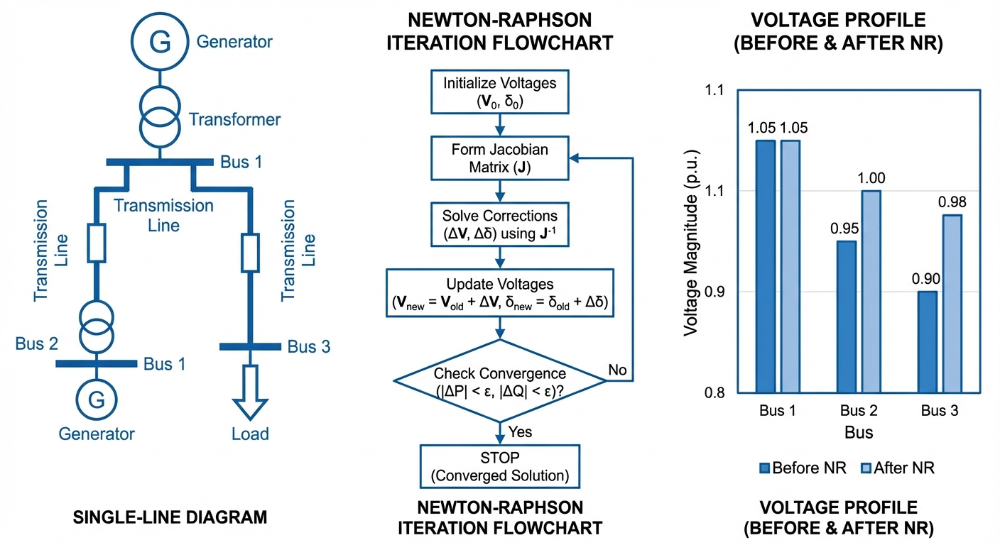

# 第 3 章 电力系统潮流计算

前两章建立了自动控制原理的核心分析框架。从本章开始，我们将视线转向电力系统分析——另一门考研核心课程。电力系统本身就是一个典型的多变量、非线性、强耦合的大型动态系统。无论是进行动态暂态稳定分析，还是设计各种自动控制装置（如励磁控制、调速器），其前提都是确定系统在扰动发生前的初始稳态运行工况。本章重点讲解的电力系统潮流计算，正是求解电网稳态运行状态的核心工具，也是后续短路分析、稳定性分析的起点。

## 学习目标

- 掌握电力系统等值电路中变压器和输电线路的参数计算与标幺值严格变换推导
- 深入理解节点导纳矩阵的构建规则、修改方法及其稀疏性与物理意义
- 熟练推导极坐标下 Newton-Raphson 法潮流计算的雅可比矩阵元素偏导数
- 掌握 2~3 节点小型系统的牛顿-拉夫逊法单次迭代手算过程
- 剖析 PQ 分解法的简化假设、推导逻辑及其在大型工程网络中的适用条件

## 3.1 等效电路与标幺值计算

### 3.1.1 标幺值系统

电力系统分析中，由于涉及发电机、升压变压器、各级输电线路以及降压变压器等多个电压等级，直接使用实际物理量进行网络方程列写会导致大量变比折算，容易引入人为计算错误。为此，普遍采用标幺值（per unit, pu）系统进行无量纲化处理。

标幺值的基本定义为：标幺值 = 实际有名值 / 基准值。选定基准功率 $S_B$（三相总功率，常取 100 MVA）和某一电压等级的基准电压 $V_B$（线电压）后，基准电流和基准阻抗分别为：

$$
I_B = \frac{S_B}{\sqrt{3}V_B}, \quad Z_B = \frac{V_B^2}{S_B} \tag{3.1}
$$

当跨越变压器进入另一电压等级时，基准电压必须按照理想变压器的变比 $k$ 进行折算，使理想变压器部分在标幺值系统中变为 1:1。

在实际设备参数中，厂家通常提供基于设备额定参数（$S_N, V_N$）的标幺值或百分值。将其归算到全网统一新基准下的标幺值，严格推导如下：设备实际阻抗有名值为 $Z = Z_{pu}^{(old)} \cdot V_N^2/S_N$，将其除以新基准阻抗 $Z_B = V_B^2/S_B$，得到：

$$
Z_{pu}^{(new)} = Z_{pu}^{(old)} \times \frac{S_{B}}{S_{N}} \times \left(\frac{V_{N}}{V_{B}}\right)^2 \tag{3.2}
$$

该公式是考研必考公式，考生需要牢记"新基准功率比旧基准功率"乘以"旧额定电压比新基准电压的平方"。

### 3.1.2 输电线路与变压器模型

输电线路用 $\pi$ 型等值电路表示，其串联阻抗 $z = r + jx$（标幺值）和对地导纳 $y_0 = jb/2$ 构成完整的线路模型。变压器由于激磁支路电流较小，在稳态潮流中常简化为单个串联漏抗 $x_T$ 以及变比 $k$。当基准电压取各侧额定电压时，理想变压器部分可以省略。

### 3.1.3 节点导纳矩阵

节点导纳矩阵 $\mathbf{Y}$ 是潮流计算的基础数据结构。对于 $n$ 节点系统：

$$
Y_{ii} = \sum_{j \in \text{adj}(i)} y_{ij} + y_{i0}, \quad Y_{ij} = -y_{ij} \tag{3.3}
$$

其中 $y_{ij}$ 是节点 $i$ 与 $j$ 之间支路导纳，$y_{i0}$ 是节点 $i$ 的对地导纳。

导纳矩阵具有三个核心特性：

1. **对称性**：由互易定理可知，在不包含移相变压器时，$Y_{ij} = Y_{ji}$。
2. **高度稀疏性**：实际电力系统中，每个节点平均仅与 2~3 个相邻节点直接相连。在大规模系统中（例如 1000 个节点），矩阵中非零元素的比例通常不到 1%。
3. **主对角占优倾向**：自导纳 $Y_{ii}$ 汇集了所有相连支路导纳，其绝对值往往大于同行其他非对角元素之和，有利于迭代求解时的数值稳定性。

**导纳矩阵的动态修改**是考研几乎必考的小题。当在节点 $i$ 和 $j$ 间新增一条支路（导纳为 $y_{new}$，含对地导纳 $y_0$）时：$Y_{ij}$ 与 $Y_{ji}$ 需减去 $y_{new}$；对角元素 $Y_{ii}$ 需加上 $y_{new} + y_0/2$，$Y_{jj}$ 需加上 $y_{new} + y_0/2$。

## 3.2 Newton-Raphson潮流计算

### 3.2.1 功率平衡方程

潮流计算的目标是在已知负荷功率和发电机出力的条件下，求解各节点电压幅值和相角。在极坐标下，节点 $i$ 注入的复功率 $S_i = P_i + jQ_i = V_i I_i^*$。将 $I_i = \sum_{j=1}^n Y_{ij} V_j$ 展开代入，并令电压 $V_i = |V_i|\angle\theta_i$、导纳 $Y_{ij} = G_{ij} + jB_{ij}$，分离实部和虚部后可得：

$$
P_i = V_i \sum_{j=1}^n V_j(G_{ij}\cos\theta_{ij} + B_{ij}\sin\theta_{ij}) \tag{3.4}
$$

$$
Q_i = V_i \sum_{j=1}^n V_j(G_{ij}\sin\theta_{ij} - B_{ij}\cos\theta_{ij}) \tag{3.5}
$$

其中 $\theta_{ij} = \theta_i - \theta_j$。

### 3.2.2 NR迭代公式推导

Newton-Raphson法通过泰勒级数展开的一阶线性近似来逼近非线性方程解。设功率偏差为 $\Delta P_i = P_{i,spec} - P_{i,calc}$，$\Delta Q_i = Q_{i,spec} - Q_{i,calc}$，则每次迭代中求解修正方程：

$$
\begin{bmatrix} \Delta\mathbf{P} \\ \Delta\mathbf{Q} \end{bmatrix} = \begin{bmatrix} \mathbf{H} & \mathbf{N} \\ \mathbf{J} & \mathbf{L} \end{bmatrix} \begin{bmatrix} \Delta\boldsymbol{\theta} \\ \Delta\mathbf{V}/\mathbf{V} \end{bmatrix} \tag{3.6}
$$

### 3.2.3 雅可比矩阵元素的严格求导

雅可比矩阵决定了收敛的方向。对于非对角元素（$i \neq j$）：

$$
H_{ij} = \frac{\partial P_i}{\partial \theta_j} = -|V_i||V_j|(G_{ij}\sin\theta_{ij} - B_{ij}\cos\theta_{ij})
$$

$$
N_{ij} = |V_j| \frac{\partial P_i}{\partial |V_j|} = |V_i||V_j|(G_{ij}\cos\theta_{ij} + B_{ij}\sin\theta_{ij})
$$

$$
J_{ij} = \frac{\partial Q_i}{\partial \theta_j} = -N_{ij}, \quad L_{ij} = |V_j| \frac{\partial Q_i}{\partial |V_j|} = -H_{ij}
$$

对于对角元素（$i = j$），求导并结合式(3.4)(3.5)进行代换，得到化简结果：

$$
H_{ii} = -Q_i - B_{ii}|V_i|^2, \quad N_{ii} = P_i + G_{ii}|V_i|^2
$$

$$
J_{ii} = P_i - G_{ii}|V_i|^2, \quad L_{ii} = Q_i - B_{ii}|V_i|^2
$$

掌握上述推导与化简结果，是解答考研中关于雅可比矩阵性质简答题的关键得分点。NR法具有二阶收敛速度，通常3-5次迭代即可达到工程精度要求。

## 3.3 PQ分解法

PQ分解法（Fast Decoupled Load Flow, FDLF）利用高压电网的物理特性进行深度简化：

1. **网络电抗远大于电阻**：$X \gg R$，导纳矩阵实部 $G_{ij} \approx 0$。
2. **运行相角差极小**：$\cos\theta_{ij} \approx 1$，$\sin\theta_{ij} \approx 0$。
3. **节点无功不平衡量较小**：无功注入远小于系统短路容量。

应用上述假设后，交叉矩阵 $\mathbf{N}$ 和 $\mathbf{J}$ 退化为零矩阵，实现了有功 $P-\theta$ 和无功 $Q-V$ 的完全解耦：

$$
\Delta\mathbf{P}/\mathbf{V} = \mathbf{B}'\Delta\boldsymbol{\theta}, \quad \Delta\mathbf{Q}/\mathbf{V} = \mathbf{B}''\Delta\mathbf{V} \tag{3.7}
$$

$\mathbf{B}'$ 和 $\mathbf{B}''$ 在整个迭代周期内保持恒定，只需执行一次三角分解，其后所有迭代均蜕变为高效的前代与回代过程。每次迭代的计算量大幅减少，但收敛速度略慢于完整NR法。

## 3.4 典型考研例题详解

**【例题1】标幺值换算与节点导纳矩阵构建**

某三节点电力系统，变压器 T1 额定容量 $S_N = 60$ MVA，额定电压 $10.5/121$ kV，短路电压百分值 $U_k\% = 10.5$。输电线路 L1 长度 $l = 50$ km，单位长度电抗 $x_1 = 0.4\ \Omega/\text{km}$，忽略电阻和对地导纳。基准功率 $S_B = 100$ MVA，高压侧基准电压 $V_B = 115$ kV。求各元件电抗标幺值并构建导纳矩阵。

**【详细解答】**

**步骤一**：确定各级基准值。高压侧基准阻抗 $Z_B = V_B^2/S_B = 115^2/100 = 132.25\ \Omega$。低压侧基准电压按变比折算：$V_{B1} = 115 \times 10.5/121 = 9.979$ kV。

**步骤二**：计算变压器电抗标幺值。

$$
X_{T1(pu)} = \frac{U_k\%}{100} \cdot \frac{S_B}{S_N} \cdot \left(\frac{V_N}{V_B}\right)^2 = 0.105 \times \frac{100}{60} \times \left(\frac{10.5}{9.979}\right)^2 \approx 0.194\,\text{pu}
$$

**步骤三**：计算线路电抗标幺值。线路实际电抗 $X_L = 0.4 \times 50 = 20\ \Omega$，标幺值 $X_{L1(pu)} = 20/132.25 = 0.151\,\text{pu}$。

**步骤四**：构建节点导纳矩阵。支路导纳 $y_{12} = 1/(j0.194) = -j5.160$，$y_{23} = 1/(j0.151) = -j6.614$，节点1和3之间无直接连接。

$$
\mathbf{Y} = \begin{bmatrix}
-j5.160 & j5.160 & 0 \\
j5.160 & -j11.774 & j6.614 \\
0 & j6.614 & -j6.614
\end{bmatrix}\,\text{pu}
$$

---

**【例题2】简化2节点NR潮流迭代**

系统有2个节点：节点1为平衡节点（$V_1 = 1.0\angle 0°$ pu），节点2为PQ节点（$P_2 = -0.4$ pu，$Q_2 = -0.3$ pu），线路导纳 $y_{12} = -j5.0$ pu，忽略对地导纳。初始值 $V_2^{(0)} = 1.0$ pu，$\theta_2^{(0)} = 0°$。手算第一次NR迭代。

**【详细解答】**

**步骤一**：分析导纳矩阵。$Y_{22} = y_{12} = -j5.0$，故 $G_{22} = 0$，$B_{22} = -5.0$。$Y_{21} = -y_{12} = j5.0$，故 $G_{21} = 0$，$B_{21} = 5.0$。

**步骤二**：计算初始功率。在 $\theta_{21} = 0$ 时：

$$
P_2^{(0)} = 0, \quad Q_2^{(0)} = 0
$$

功率偏差：$\Delta P_2 = -0.4 - 0 = -0.4$，$\Delta Q_2 = -0.3 - 0 = -0.3$。

**步骤三**：计算雅可比矩阵对角元素。

$$
H_{22} = -Q_2^{(0)} - B_{22}|V_2|^2 = 0 - (-5.0) = 5.0
$$

$$
N_{22} = P_2^{(0)} + G_{22}|V_2|^2 = 0, \quad J_{22} = P_2^{(0)} - G_{22}|V_2|^2 = 0
$$

$$
L_{22} = Q_2^{(0)} - B_{22}|V_2|^2 = 0 - (-5.0) = 5.0
$$

**步骤四**：求解修正量。由于 $N_{22} = J_{22} = 0$（纯电抗网络+平直启动），有功-相角与无功-幅值天然解耦：

$$
\begin{bmatrix} -0.4 \\ -0.3 \end{bmatrix} = \begin{bmatrix} 5.0 & 0 \\ 0 & 5.0 \end{bmatrix} \begin{bmatrix} \Delta\theta_2 \\ \Delta V_2/V_2 \end{bmatrix}
$$

解得 $\Delta\theta_2 = -0.08$ rad，$\Delta V_2 = -0.06$ pu。更新：$\theta_2^{(1)} = -0.08$ rad，$V_2^{(1)} = 0.94$ pu。

## 3.5 仿真案例

本章仿真脚本 `assets/ch03/ch03_power_flow.py` 对3节点电力系统进行完整的Newton-Raphson潮流计算。

**系统参数**（基准值 $S_B=100$ MVA，$V_B=110$ kV）：
- 节点1：平衡节点，$V_1=1.05\angle 0°$ pu
- 节点2：PV节点，$P_2=0.5$ pu，$V_2=1.02$ pu
- 节点3：PQ节点，$P_3=-1.0$ pu，$Q_3=-0.5$ pu（负荷）
- 线路阻抗：$z_{12}=0.02+j0.06$，$z_{13}=0.01+j0.04$，$z_{23}=0.03+j0.08$（标幺值）

**潮流计算结果：**

| 节点 | 电压幅值 (pu) | 相角 (°) | 有功 P (pu) | 无功 Q (pu) |
|:-----|:-------------|:---------|:-----------|:-----------|
| 节点1 (Slack) | 1.0500 | 0.0000 | 0.5183 | 1.2290 |
| 节点2 (PV) | 1.0200 | 0.9400 | 0.5000 | -0.6681 |
| 节点3 (PQ) | 1.0188 | -0.9791 | -1.0000 | -0.5000 |

**线路功率流与损耗：**

| 线路 | 传输功率 P+jQ (pu) | 有功损耗 (pu) |
|:-----|:-------------------|:-------------|
| 1-2 | -0.1053+j0.5625 | 0.005941 |
| 1-3 | 0.6236+j0.6665 | 0.007556 |
| 2-3 | 0.3887+j-0.1234 | 0.004797 |

系统总有功损耗为 0.018294 pu（即1.83 MW），NR法仅用 **4次迭代** 即收敛至 $2.52 \times 10^{-7}$ pu 的精度。

## 3.6 Python代码解读与手算验证

仿真脚本的核心流程是：构建节点导纳矩阵 - NR迭代求解 - 计算线路潮流和损耗。

**导纳矩阵构建**：代码先将各线路阻抗求倒数得到导纳 $y_{ij} = 1/z_{ij}$，然后按公式(3.3)组装3x3矩阵Y。自导纳 $Y_{ii}$ 等于连接该节点的所有支路导纳之和，互导纳 $Y_{ij}$ 等于支路导纳的负值。代码中未加入并联电纳/接地支路，因此矩阵仅由串联支路贡献。矩阵满足对称性（无移相变压器），可通过 `np.allclose(Y, Y.T)` 进行自检。

**雅可比矩阵手动组装**：本算例中节点1为平衡节点（已知 $V_1, \theta_1$），节点2为PV节点（已知 $P_2, V_2$），节点3为PQ节点（已知 $P_3, Q_3$）。因此未知量仅有 $[\theta_2, \theta_3, V_3]$ 三个，对应失配量 $[\Delta P_2, \Delta P_3, \Delta Q_3]$，雅可比矩阵维度为3x3。代码逐项按偏导公式填写：对角元素中 $\partial P_i/\partial V_i$ 需额外加 $2V_iG_{ii}$，$\partial Q_i/\partial V_i$ 需额外加 $-2V_iB_{ii}$，这两个自导纳修正项是手算中容易遗漏的细节。每次迭代中用 `np.linalg.solve(J, mismatch)` 解线性方程得修正量，避免了显式求逆运算，在数值精度和计算效率上均优于 `np.linalg.inv(J) @ mismatch`。

**收敛判断**：每次迭代后计算功率偏差向量的最大绝对值（无穷范数），与容差 $10^{-6}$ 比较。代码打印每次迭代的各项偏差，可以观察到NR法的二次收敛特性：前两次迭代将偏差从 $10^{-1}$ 降至 $10^{-3}$，后两次降至 $10^{-7}$。最大迭代次数设为20次，超过则判定为不收敛。

**功率平衡验证**：线路潮流通过 $S_{ij} = V_i \cdot (V_i - V_j)^*/z_{ij}^*$ 计算，线路损耗为两端有功之和 $P_{loss} = \text{Re}(S_{ij}) + \text{Re}(S_{ji})$。总发电功率应等于总负荷加总损耗：$0.5183 + 0.5 = 1.0 + 0.018294$，验证功率平衡。这一验证方法在考研计算题中也可作为检验中间过程是否有误的有效手段。

**手算与代码结果交叉核验要点**：(1) 节点注入平衡：$P_1+P_2+P_3 = 0.5183+0.5+(-1.0) = 0.0183$，应等于总网损 0.018294，仅有四舍五入误差；(2) PV节点的无功出力 $Q_2 = -0.6681$ 需检查是否在发电机无功容量上下限之内，若越限则需将PV节点转为PQ节点重新迭代；(3) 所有节点电压应在 0.95~1.05 pu 的运行允许范围内。

## 3.7 结果分析

从收敛曲线可以看出，Newton-Raphson法展现了典型的二阶收敛特征。这种快速收敛性是NR法在电力系统分析中被广泛采用的主要原因。

节点电压分布表明，PQ负荷节点（节点3）的电压为1.0188 pu，略低于标称值但仍在 0.95~1.05 pu 的合格范围内。平衡节点承担了0.5183 pu的有功和1.2290 pu的无功出力。线路1-2上的有功功率为负值（-0.1053 pu），说明实际潮流方向是从节点2流向节点1，这是因为节点2的发电功率超过了其就近供电需求。

系统总有功损耗占总发电量的1.80%，处于正常水平。在考研题目中，计算线路损耗并验证功率平衡（$\sum P_G = \sum P_L + \sum P_{loss}$）是常见的验证步骤。

## 3.8 考研备考要点

1. **标幺值换算陷阱**：在归算发电机或变压器电抗时，经常考察额定电压与系统基准电压不一致的情况。必须牢记式(3.2)，绝不能漏掉电压平方的比值项。若第一步参数算错，整道大题全盘皆输。
2. **节点导纳矩阵的动态修改**：当在网络中切除一条带有对地电容的输电线路，或新增一条支路时，导纳矩阵不必从头重算。掌握局部修改法则可大幅节省考试时间。
3. **节点类型与未知量**：平衡节点（已知V和角度）、PV节点（已知P和V）、PQ节点（已知P和Q）。PV节点在迭代中不参与 $\Delta Q-\Delta V$ 方程，因此雅可比矩阵的维度要根据PV节点数做相应缩减。
4. **PV节点越限判定**：当PV节点的无功输出超出设备容量上下限时，需将其转换为PQ节点，固定无功为极限值，释放电压幅值参与迭代。这是综合大题中设置障碍的高频考法。
5. **各算法特性对比**：NR法初值敏感但二阶收敛；PQ分解法计算速度快但在 $R/X$ 比较大的配电网或病态系统中收敛性差；高斯-赛德尔法编程简单但收敛缓慢。考研简答题中经常要求比较三者的异同。

## 3.9 补充知识：高斯-赛德尔法简介

在NR法之前，高斯-赛德尔（Gauss-Seidel, G-S）法是最早用于潮流计算的迭代方法。其基本思想是将功率平衡方程改写为电压的显式迭代公式：

$$
V_i^{(k+1)} = \frac{1}{Y_{ii}} \left[ \frac{P_i - jQ_i}{V_i^{(k)*}} - \sum_{j=1, j<i}^n Y_{ij} V_j^{(k+1)} - \sum_{j=i+1}^n Y_{ij} V_j^{(k)} \right]
$$

该方法的优点是每次迭代的计算量小、编程简单，无需组装和因式分解雅可比矩阵。但其收敛速度仅为线性（一阶），大规模系统通常需要数十甚至上百次迭代才能收敛，远不如NR法的二次收敛效率。此外，G-S法对初值的选取较为敏感，在病态系统（如长线路、重负荷、无功不足等情况）中容易发散。

在考研简答题中，三种方法的对比是高频考点。考生需从收敛阶次、单次计算量、存储需求、初值敏感性和适用场景等维度进行全面比较。实际工程中，NR法因其可靠的收敛性成为主流选择，PQ分解法在大规模高压电网的在线计算中仍有应用价值。

## 3.10 本章小结

本章系统论述了电力系统稳态潮流计算的完整数学架构与实现方法。从消除电压等级壁垒的标幺值系统出发，探讨了节点导纳矩阵的构建机理及其稀疏性特征。核心篇幅聚焦于极坐标系下的 Newton-Raphson 潮流迭代方程及其雅可比矩阵的严谨数学推导，并辅以单次迭代的具体手算范例。针对大型电网计算效率瓶颈，剖析了 PQ 分解法的工程降维思路。稳态潮流数据是后续所有深度分析（短路计算、暂态稳定等）的起点。

## 思考与练习

**1.** 某变压器额定容量 60 MVA，额定电压 110/38.5 kV，短路电压百分比 10.5%。若系统基准取 $S_B = 100$ MVA，$V_B = 110$ kV（高压侧），求变压器在系统基准下的标幺值电抗。

**2.** 三节点电力系统中，节点1-2之间线路导纳为 $y_{12} = 2-j6$ pu，节点1-3之间为 $y_{13} = 1-j4$ pu，节点2-3之间为 $y_{23} = 1.5-j5$ pu。写出完整的3x3节点导纳矩阵。

**3.** 比较高斯-赛德尔法、牛顿-拉夫逊法与 PQ 分解法在潮流计算中的收敛特性、单次计算量以及各自适用的电网场景。

**4.** 某两节点系统，节点1为平衡节点（$V_1 = 1.0\angle 0°$ pu），节点2的负荷功率为 $S_2 = -0.6-j0.4$ pu，线路导纳 $y_{12} = -j8.0$ pu，无对地支路。以 $V_2^{(0)} = 1.0\angle 0°$ pu 为初值，采用NR法手算第一次迭代后的节点2电压幅值和相角。

**5.** 完成潮流计算后如何验证结果的正确性？请列出至少三种检验方法。

---

**拓展视野**：PID 控制器是水利工程中应用最广泛的反馈控制算法。在闸门自动控制系统中，PI 控制器用于跟踪目标水位，其积分项消除稳态误差，比例项决定响应速度。本章的根轨迹分析方法可以直观揭示为什么渠道系统的纯延迟特性会导致 PID 参数整定困难——延迟越大，根轨迹越早穿越虚轴进入不稳定区域。

## 参考文献

[1] 何仰赞, 温增银. 电力系统分析 (第四版) [M]. 武汉: 华中科技大学出版社, 2016.

[2] Glover, J.D., Overbye, T.J., Sarma, M.S. Power Systems Analysis and Design (6th Edition) [M]. Boston: Cengage Learning, 2017.

[3] 陈珩. 电力系统稳态分析 (第四版) [M]. 北京: 中国电力出版社, 2015.
