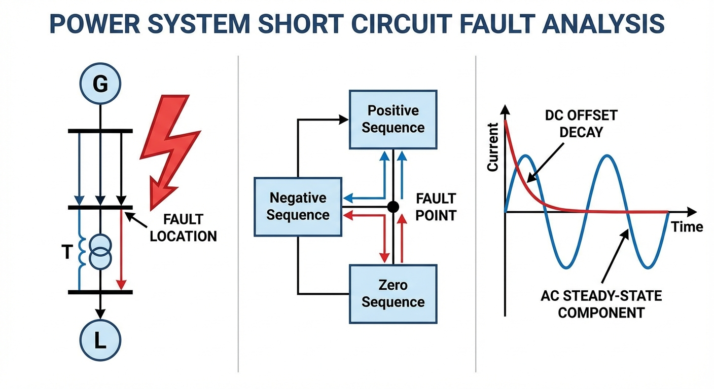
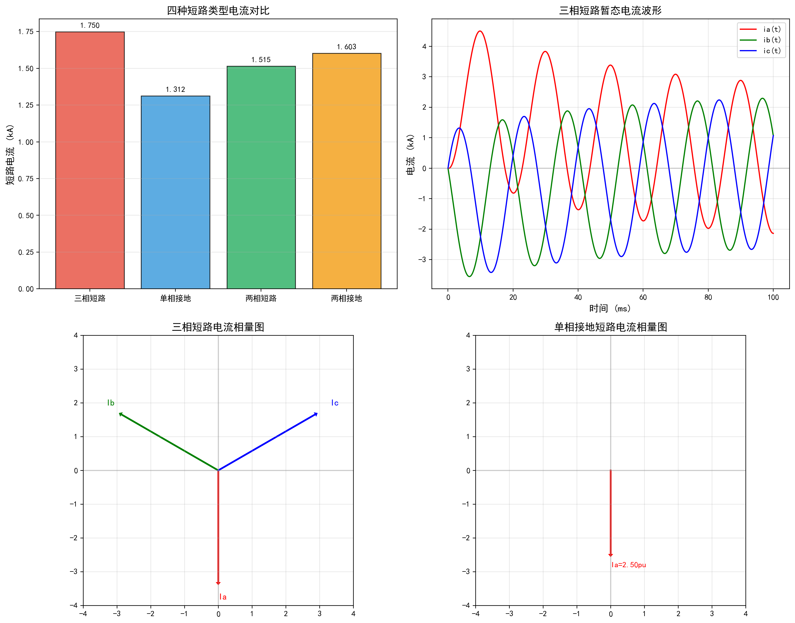

# 第 4 章 电力系统短路故障分析

第3章讨论了电力系统正常运行状态下的潮流分布。然而，电力系统在运行过程中不可避免地会遭遇各类短路故障。短路不仅会破坏系统的稳态平衡，引发暂态过程，还会产生巨大的短路电流，对电气设备和系统稳定性造成严重威胁。短路计算的结果直接决定了继电保护的整定、断路器的选型以及系统的动稳定校验。本章将系统介绍短路电流的计算方法，重点掌握对称分量法这一处理不对称故障的核心工具。

## 学习目标

- 掌握无限大容量系统三相短路暂态过程的物理本质和各类电流的计算方法
- 理解并熟练运用对称分量法的基本原理，能准确建立各元件及全系统的正序、负序、零序等效电路
- 掌握四种常见短路类型（三相、单相接地、两相、两相接地）的边界条件和解析计算方法
- 能够准确计算冲击电流、短路容量，并具备解答考研综合性短路计算题的能力

## 4.1 三相短路暂态过程

### 4.1.1 暂态过程的物理分析

当电力系统发生三相对称短路时，系统从一个稳态过渡到另一个稳态，伴随着电磁能量的剧烈重新分布。设发生短路前的电源电压为 $u(t) = U_m \sin(\omega t + \alpha)$，短路瞬间（$t=0$）电压初相位为 $\alpha$。短路回路的总电阻为 $R$，总电感为 $L$，总电抗为 $X = \omega L$。短路后的微分方程为：

$$
L \frac{di}{dt} + Ri = U_m \sin(\omega t + \alpha)
$$

其全解由周期分量（稳态特解）和非周期分量（衰减自由分量）组成：

$$
i_k(t) = I_{pm} \sin(\omega t + \alpha - \varphi_k) + \left[ I_{m0} \sin(\alpha - \varphi_0) - I_{pm} \sin(\alpha - \varphi_k) \right] e^{-t/T_a}
$$

其中 $I_{pm} = U_m/\sqrt{R^2 + X^2}$ 为周期分量幅值，$\varphi_k = \arctan(X/R)$ 为短路回路阻抗角，$T_a = L/R = X/(\omega R)$ 为非周期分量衰减时间常数。

在实际高压电网中，$X \gg R$，因此 $\varphi_k \approx 90°$。在无限大容量电源供电条件下，周期分量幅值不衰减。短路瞬间的次暂态电流有效值为：

$$
I''_k = \frac{E}{X_1} \tag{4.1}
$$

其中 $E$ 为短路点的等效电动势（通常取1.0 pu），$X_1$ 为从短路点看进去的正序等效电抗。

### 4.1.2 冲击电流与短路容量

**冲击电流**是短路暂态过程中全电流的最大瞬时值，主要用于校验电气设备的动稳定性，即设备在短路瞬间承受巨大电动力而不发生机械变形或损坏的能力。产生最大冲击电流的条件（最不利合闸角）是：短路前系统空载（短路前电流为零），且短路发生瞬间电源电压恰好过零（$\alpha = 0$，$\varphi_k = 90°$），此时非周期分量具有最大初始值。非周期分量与周期分量叠加后，在半个工频周期后（$t = 0.01$ s）达到绝对值最大：

$$
i_{sh} = \sqrt{2} I''_k (1 + e^{-0.01/T_a}) = \sqrt{2} \cdot K_{sh} \cdot I''_k \tag{4.2}
$$

$K_{sh} = 1 + e^{-0.01/T_a}$ 为冲击系数。取 $T_a \approx 0.05$ s 时，$K_{sh} \approx 1.8$，冲击电流约为 $2.55 I''_k$。

**短路容量**（短路功率）衡量系统短路点的强弱，用于校验断路器的开断能力：

$$
S_{sc} = \sqrt{3} V_N I''_k
$$

在标幺值系统下，若 $E = 1.0$，则 $S_{sc*} = I''_{k*} = E/X_1$。

### 4.1.3 典型例题：三相短路电流计算

**【例题1】** 发电机 $G$ 经变压器 $T$ 和输电线路 $L$ 向负荷供电。发电机额定容量 $S_{GN} = 100$ MVA，次暂态电抗 $X''_d = 0.15$；变压器额定容量 $S_{TN} = 100$ MVA，$10.5/121$ kV，$V_k\% = 10.5$；线路长度 50 km，正序电抗 $x_1 = 0.4\ \Omega/\text{km}$。基准 $S_B = 100$ MVA，$V_{B2} = 115$ kV。

**【详细解答】**

**步骤一**：参数归算。$X_{G*} = 0.15$，$X_{T*} = 0.105/100 \times 100 = 0.105$。线路实际电抗 $20\ \Omega$，基准阻抗 $Z_{B2} = 115^2/100 = 132.25\ \Omega$，$X_{L*} = 20/132.25 = 0.1512$。

**步骤二**：总电抗 $X_{\Sigma} = 0.15 + 0.105 + 0.1512 = 0.4062$。

**步骤三**：次暂态短路电流 $I''_{k*} = 1.0/0.4062 = 2.462$。基准电流 $I_{B2} = 100/(\sqrt{3}\times 115) = 0.502$ kA，故 $I''_k = 2.462 \times 0.502 = 1.236$ kA。

**步骤四**：冲击电流 $i_{sh} = \sqrt{2} \times 1.8 \times 1.236 = 3.15$ kA。

**步骤五**：短路容量 $S_{sc} = 2.462 \times 100 = 246.2$ MVA。

## 4.2 对称分量法

### 4.2.1 对称分量变换

对称分量法是由Fortescue于1918年提出的分析不对称故障的核心工具。任意一组不对称三相量可唯一分解为正序、负序和零序三组对称分量。定义旋转算子 $a = e^{j120°}$，其关键性质为：

$$
a^3 = 1, \quad 1 + a + a^2 = 0, \quad a - a^2 = j\sqrt{3}
$$

变换矩阵和逆变换为：

$$
\begin{bmatrix} \dot{I}_a \\ \dot{I}_b \\ \dot{I}_c \end{bmatrix} = \begin{bmatrix} 1 & 1 & 1 \\ 1 & a^2 & a \\ 1 & a & a^2 \end{bmatrix} \begin{bmatrix} \dot{I}_0 \\ \dot{I}_1 \\ \dot{I}_2 \end{bmatrix} \tag{4.3}
$$

$$
\begin{bmatrix} \dot{I}_0 \\ \dot{I}_1 \\ \dot{I}_2 \end{bmatrix} = \frac{1}{3}\begin{bmatrix} 1 & 1 & 1 \\ 1 & a & a^2 \\ 1 & a^2 & a \end{bmatrix} \begin{bmatrix} \dot{I}_a \\ \dot{I}_b \\ \dot{I}_c \end{bmatrix} \tag{4.4}
$$

### 4.2.2 序阻抗与序网络

各元件对不同相序电流表现出不同的序阻抗：

- **正序阻抗**：对静止元件（变压器、线路）等于交流阻抗；对发电机为同步电抗或暂态电抗。
- **负序阻抗**：静止元件的负序阻抗等于正序阻抗；发电机负序阻抗取 $X_2 \approx (X''_d + X''_q)/2$。
- **零序阻抗**：取决于接地方式和回流路径。零序电流具有三相同相位的特征，实质上是单相电流通过大地或中性线构成的回路。输电线路的零序阻抗受大地回流和架空地线影响，单回线通常为正序阻抗的2~3.5倍。双回线由于线间互感的影响，零序阻抗比值更为复杂，需根据线路参数和运行方式具体计算。

**变压器零序等值电路**是不对称故障分析中最容易出错的环节，也是考研重中之重。能否流通零序电流取决于绕组接线方式：$Y_N$ 接法可流通（中性点接地提供通路）；$Y$ 接法不能流通（$3\dot{I}_0 = 0$）；$\Delta$ 接法零序电流在内部环流，对外相当于开路，但为另一侧提供安匝平衡。

## 4.3 各类短路的边界条件与序网连接

### 4.3.1 三相短路

仅正序网工作：$I_1 = E/(jX_1)$，$I_2 = I_0 = 0$。

### 4.3.2 单相接地短路（A相）

边界条件：$\dot{I}_b = 0$，$\dot{I}_c = 0$，$\dot{V}_a = 0$。

将电流条件代入逆变换得 $I_1 = I_2 = I_0 = \dot{I}_a/3$，电压条件给出 $V_1 + V_2 + V_0 = 0$。结合序网方程推导出三个序网**串联**：

$$
I_1 = I_2 = I_0 = \frac{E}{j(X_1+X_2+X_0)} \tag{4.5}
$$

故障相电流 $I_a = 3I_0 = 3E/[j(X_1+X_2+X_0)]$。

### 4.3.3 两相短路（B-C相）

边界条件：$\dot{I}_a = 0$，$\dot{V}_b = \dot{V}_c$，$\dot{I}_b + \dot{I}_c = 0$。

由 $\dot{V}_b - \dot{V}_c = (a^2-a)(V_1 - V_2) = 0$ 且 $a^2 - a \neq 0$，得 $V_1 = V_2$。由 $I_a = 0$ 得 $I_0 = 0$。进一步推导 $I_1 = -I_2$。

正序和负序网**并联**，零序网不参与：

$$
I_1 = -I_2 = \frac{E}{j(X_1+X_2)}, \quad I_0 = 0
$$

### 4.3.4 两相接地短路（B-C相接地）

边界条件：$\dot{I}_a = 0$，$\dot{V}_b = \dot{V}_c = 0$。

由电压条件得 $V_1 = V_2 = V_0$，由电流条件得 $I_1 + I_2 + I_0 = 0$。三序网在故障点**并联**：

$$
I_1 = \frac{E}{j\left[X_1 + \frac{X_2 X_0}{X_2 + X_0}\right]} \tag{4.6}
$$

### 4.3.5 正序等效定则（综合阻抗法）

四种短路可用统一公式 $I_1 = E/(jX_1 + jX_\Delta)$ 表示，其中附加阻抗 $X_\Delta$ 分别为：

| 短路类型 | 附加阻抗 $X_\Delta$ | 序网连接方式 |
|:---------|:-------------------|:-----------|
| 三相短路 | $0$ | 仅正序网 |
| 单相接地 | $X_2 + X_0$ | 三序串联 |
| 两相短路 | $X_2$ | 正负序并联 |
| 两相接地 | $X_2 X_0/(X_2+X_0)$ | 正序串联(负零并联) |

这一统一表达式在快速解答选择填空题时非常有效：只需比较各类附加阻抗的大小，即可判断短路电流的大小关系。当 $X_0 > X_1 = X_2$ 时，$X_\Delta$ 从大到小依次为单相接地、两相接地、两相短路、三相短路，对应的短路电流从小到大排列。

### 4.3.6 经过渡电阻的短路

实际短路往往不是金属性短路，而是经过渡电阻（如电弧电阻 $Z_f$）发生的。对于单相经阻抗 $Z_f$ 接地的情况，边界条件变为 $\dot{V}_a = Z_f \dot{I}_a$，代入序分量关系后，三序串联回路中额外串入 $3Z_f$：

$$
I_1 = I_2 = I_0 = \frac{E}{j(X_1+X_2+X_0) + 3Z_f}
$$

$3Z_f$ 的系数3来源于 $I_a = 3I_0$ 的关系。这一结论可推广到两相接地经阻抗的情况，是考研中偶尔出现的拔高题型。

## 4.4 典型考研例题详解

**【例题2】单相接地短路的序分量与电压计算**

已知 $X_1 = 0.2$ pu，$X_2 = 0.2$ pu，$X_0 = 0.1$ pu，$E = 1.0\angle 0°$ pu。计算A相接地短路时的各序电流、各相电流，以及非故障相电压。

**【详细解答】**

**步骤一**：各序电流。三序串联，总阻抗 $X_\Sigma = 0.5$ pu。

$$
\dot{I}_{1} = \dot{I}_{2} = \dot{I}_{0} = \frac{1.0}{j0.5} = -j2.0\,\text{pu}
$$

**步骤二**：各相电流。$I_a = 3I_0 = -j6.0$ pu（幅值6.0 pu），$I_b = I_c = 0$（利用 $1+a+a^2 = 0$）。

**步骤三**：各序电压。

$$
V_1 = E - I_1(jX_1) = 1.0 - (-j2.0)(j0.2) = 0.6\,\text{pu}
$$

$$
V_2 = -I_2(jX_2) = -(-j2.0)(j0.2) = -0.4\,\text{pu}
$$

$$
V_0 = -I_0(jX_0) = -(-j2.0)(j0.1) = -0.2\,\text{pu}
$$

验证：$V_a = V_1 + V_2 + V_0 = 0.6 - 0.4 - 0.2 = 0$，正确。

**步骤四**：非故障相电压。B相电压：

$$
V_b = a^2 V_1 + a V_2 + V_0 = (-0.5-j0.866)\times 0.6 + (-0.5+j0.866)\times(-0.4) - 0.2
$$

$$
= (-0.3-j0.520) + (0.2-j0.346) - 0.2 = -0.3-j0.866\,\text{pu}
$$

幅值 $|V_b| = \sqrt{0.09+0.75} = 0.917$ pu。同理 $|V_c| = 0.917$ pu。单相接地后非故障相电压并非保持额定值，出现了跌落现象。

## 4.5 仿真案例

本章仿真脚本 `assets/ch04/ch04_short_circuit.py` 对典型系统计算四种短路电流。

**系统参数**（基准 $S_B=100$ MVA，$V_B=110$ kV，$I_B=0.5249$ kA）：
- 正序阻抗 $X_1 = 0.30$ pu，负序阻抗 $X_2 = 0.30$ pu，零序阻抗 $X_0 = 0.60$ pu
- 电源电压 $E = 1.0$ pu

**四种短路类型电流对比：**

| 短路类型 | 短路电流 (pu) | 短路电流 (kA) | 与三相短路之比 |
|:---------|:-------------|:-------------|:-------------|
| 三相短路 | 3.3333 | 1.7495 | 1.0000 |
| 单相接地 | 2.5000 | 1.3122 | 0.7500 |
| 两相短路 | 2.8868 | 1.5152 | 0.8660 |
| 两相接地 | 3.0551 | 1.6035 | 0.9165 |

冲击电流（三相短路）：$i_{sh} = \sqrt{2} \times 1.8 \times 1.7495 = 4.4536$ kA

## 4.6 Python代码解读与手算验证

仿真脚本用标幺值建模，按"先序网、后相量"的思路计算。

**旋转算子实现**：`a = np.exp(1j * 2 * np.pi / 3)` 定义120°旋转算子。在对称分量反变换中，`a` 和 `a**2` 将正序/负序分量旋转到B、C相。

**四种短路的序网连接**：三相短路仅用正序（`I1 = E/(jX1)`）；单相接地三序串联（`I_seq = E/(j(X1+X2+X0))`，`Ia = 3*I_seq`）；两相短路正负序并联（`I1 = -I2 = E/(j(X1+X2))`）；两相接地正序串联负零序并联（先算 `X_parallel = X2*X0/(X2+X0)`，再求 `I1`，由分流关系求 `I2, I0`）。

**暂态波形生成**：三相短路暂态波形由周期分量 $\sqrt{2}I\sin(\omega t + \phi)$ 和非周期分量 $\sqrt{2}I\sin\phi \cdot e^{-t/T_a}$ 叠加。A相取最不利合闸角使冲击电流在半周波后（10 ms）达到峰值。

**比值验证**：可添加 `np.isclose` 断言将理论比值与仿真结果逐项比对，形成可回归测试的短路计算脚本。例如，两相短路的理论比值为 $\sqrt{3}/(1+X_0/X_1) \times 3/(X_1+X_2)$ 的简化形式，当 $X_1 = X_2$ 时比值恒为 $\sqrt{3}/2 \approx 0.866$，与代码输出完全吻合。

**相量图绘制**：脚本还利用复数平面绘制了各种短路类型下的三相电流相量图。三相短路时三相电流大小相等、互差120°，呈现完全对称的正三角形；单相接地时仅A相有大电流，B、C相为零，反映了故障的空间不对称性。这种可视化对照有助于建立从数学公式到物理图像的直觉理解。

## 4.7 结果分析

仿真结果展示了同一系统节点在遭遇不同类型短路时电流强度的差异。在本算例中（$X_0 = 2X_1$），三相短路电流最大，其次是两相接地（0.917倍）、两相短路（0.866倍）、单相接地（0.75倍）。

这一排序直接根植于对称分量法所揭示的等效拓扑关系。单相接地故障中，三序网串联使总阻抗达到 $X_1+X_2+X_0 = 1.2$ pu，远大于三相短路的 $X_1 = 0.3$ pu，从而抑制了故障电流。

值得注意的是，当系统中存在多台中性点直接接地的大型变压器时，等效零序阻抗 $X_0$ 可能大幅下降。极端情况下 $X_0 < X_1$ 时，单相接地短路电流将反超三相短路电流，成为破坏力最强的故障类型。这种反转现象是考研中常设置的理论陷阱。

三相短路暂态波形图中，A相在最不利合闸角条件下出现最大冲击电流，约在短路后10 ms达到峰值。B、C两相由于初始相角差异，非周期分量较小，峰值相对温和。从工程应用角度看，断路器的遮断容量必须按最严重故障类型下的最大短路电流来整定。在本算例中，三相短路电流最大，因此断路器额定遮断电流应不低于3.333 pu对应的有名值。而当系统接地方式改变导致 $X_0$ 减小时，需重新校验单相接地是否成为最严重工况。

从保护整定的角度分析，不同短路类型的电流差异直接影响继电保护的灵敏度。当短路电流过小时（如高阻接地故障），保护装置可能无法可靠动作，这要求保护整定时必须考虑各种故障类型下的最小短路电流水平。

## 4.8 考研备考要点

1. **标幺值参数归算**：考研大题的第一步永远是参数归算。变压器铭牌参数（短路电压百分比）到电抗标幺值的换算，当基准容量与额定容量不一致时的折算关系，必须做到熟练精确。
2. **零序网络的绘制法则**：失分重灾区。牢记"正负序网络看电源，零序网络看接地"。$\Delta$ 侧短路时内部环流不向外输出，$Y$ 侧不接地等效开路。
3. **序网连接规则**：三相短路（仅正序）、单相接地（三序串联）、两相短路（正负序并联）、两相接地（正序串联负零序并联）。建议画图记忆。
4. **正序等效定则**：$I_1 = E/(X_1 + X_\Delta)$ 的统一表达式是快速验算和解答选择填空题的利器。
5. **电流大小比较**：当 $X_0 > X_1 = X_2$ 时，$I_{3\phi} > I_{2\phi g} > I_{2\phi} > I_{1\phi g}$；当 $X_0 < X_1$ 时排序发生变化。论述时必须结合序网阻抗公式推导，切忌只抛结论。
6. **冲击系数**：工频50 Hz系统中，$K_{sh} = 1.8$ 对应 $T_a = 0.05$ s，冲击电流在短路后约0.01 s出现。需注意 $T_a = X/(\omega R)$，当短路点距发电机较近（$R$ 小，$X/R$ 大）时，$T_a$ 增大，$K_{sh}$ 也相应增大。
7. **经阻抗接地**：单相短路经阻抗 $Z_f$ 接地时，序网串联回路中额外串入 $3Z_f$，这是从边界条件 $V_a = Z_f I_a = 3Z_f I_0$ 自然推导出的结论。两相接地经阻抗的情况更为复杂，需在零序网的接地支路中串入 $3Z_f$。
8. **旋转算子运算**：$a^3 = 1$、$1+a+a^2 = 0$、$a-a^2 = j\sqrt{3}$ 这三个性质在推导中反复使用，务必熟记。利用 $1+a+a^2 = 0$ 可以快速判断：当三个序电流相等时，非故障相（B、C相）的合成电流为零。

## 4.9 本章小结

本章系统阐述了电力系统短路故障的计算原理与方法。首先从物理概念入手，解析了三相短路时的电磁暂态过程，明确了周期分量与非周期分量的成因及演变规律，给出了冲击电流与短路容量的实用计算方法。随后引入对称分量法，详尽推导了相量变换矩阵及各序阻抗网络模型，特别是变压器零序等效电路的深度解析。利用边界条件严谨推演了四种短路类型的序网连接规律，并辅以详实的数值例题和仿真对比。掌握本章理论与计算技能，是进行电力系统继电保护整定、设备选择与动态安全分析的先决条件。

## 思考与练习

**1.** 解释为什么在 $X_0 < X_1$ 的条件下，单相接地短路电流可能超过三相短路电流。这种情况在什么样的系统接地方式下可能出现？

**2.** 某系统正序阻抗 $X_1 = 0.25$ pu，负序阻抗 $X_2 = 0.25$ pu，零序阻抗 $X_0 = 0.40$ pu，$E = 1.0$ pu。分别计算四种短路类型的短路电流（标幺值），并排列大小顺序。

**3.** 推导两相短路（B-C相）的边界条件，并证明此时零序电流为零。

**4.** 某变压器组别为 $YN/\Delta$-11，试画出其零序等值电路，并说明零序电流在该变压器中的流通路径。

**5.** 基准 $S_B = 100$ MVA，$V_B = 220$ kV。发电机暂态电抗 $x''_d = 0.2$ pu（额定 $S_N = 200$ MVA），变压器短路电抗 $x_T = 0.12$ pu（额定 $S_N = 250$ MVA，$V_N = 220$ kV）。求系统基准下的等效阻抗，并计算母线处三相短路电流和短路容量。

---

**拓展视野**：超前-滞后校正网络在水利自动化中有直接应用。长距离输水渠道由于传输延迟导致相位裕度不足，工程师通过增加超前校正环节来补偿相位损失，其设计过程与本章的频域校正方法完全一致。Smith预估补偿器更是专为含纯延迟系统设计的经典方案，在渠道水位自动控制中被广泛采用。

## 参考文献

[1] 何仰赞, 温增银. 电力系统分析 (第四版) [M]. 武汉: 华中科技大学出版社, 2016.

[2] Grainger, J.J., Stevenson, W.D. Power Systems Analysis and Design [M]. New York: McGraw-Hill, 1994.

[3] 诸骏伟. 电力系统分析 (第四版) [M]. 北京: 中国电力出版社, 2018.
