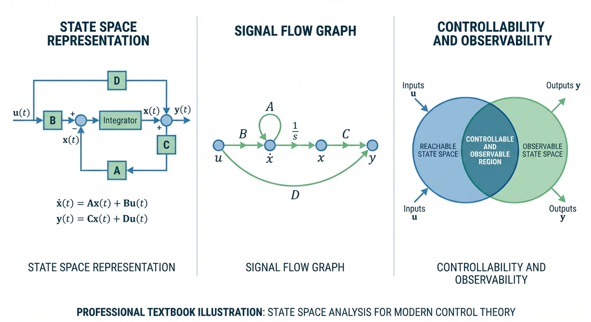
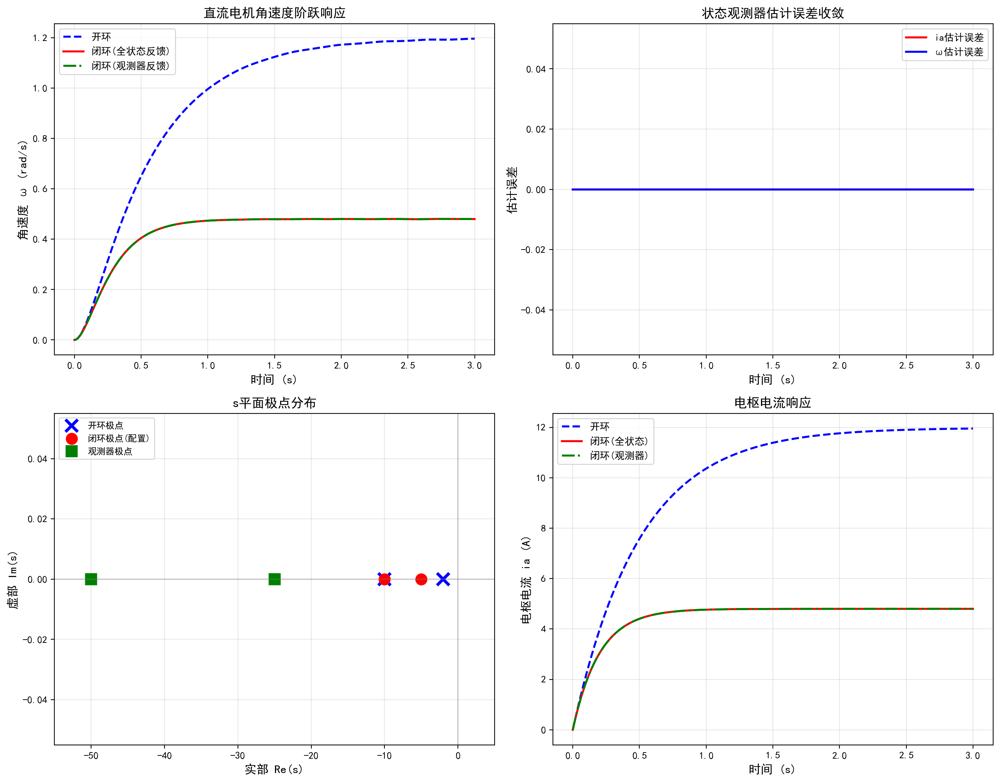

# 第 5 章 状态空间分析与设计

经过第3-4章对电力系统稳态和故障分析的学习，本章重新回到自动控制理论，进入现代控制理论的核心内容——状态空间方法。传统的经典控制理论以传递函数为核心，主要解决单输入单输出系统的控制问题，将系统内部视为"黑盒"。当面对高度互联的多输入多输出系统时，传递函数方法便显露出局限性。状态空间方法能够完整描述系统的内部状态，是多变量系统分析和控制器设计的基础框架，也是通往最优控制与卡尔曼滤波等高阶理论的必经桥梁。

## 学习目标

- 掌握从物理系统及传递函数建立状态空间方程的方法，能正确选择和变换状态变量
- 深入理解状态转移矩阵的求解方法，熟练掌握拉普拉斯逆变换法计算矩阵指数 $e^{\mathbf{A}t}$
- 熟练运用可控性矩阵和可观测性矩阵判定系统的可控性与可观测性，理解其与零极点对消的深层联系
- 掌握极点配置理论，能够熟练运用Ackermann公式进行状态反馈增益计算
- 掌握全维状态观测器的设计方法及分离定理的应用原理

## 5.1 状态空间方程的建立

### 5.1.1 基本概念与物理意义

所谓"状态"，是指系统过去历史信息的最小集合。只要已知系统在某初始时刻的状态变量值以及该时刻之后的输入信号，就能完全确定系统未来的所有响应。在物理系统中，状态变量通常对应于独立的储能元件（电容电压、电感电流、质体位移与速度等）。

状态空间描述由状态方程和输出方程组成：

$$
\dot{\mathbf{x}} = \mathbf{A}\mathbf{x} + \mathbf{B}\mathbf{u}, \quad \mathbf{y} = \mathbf{C}\mathbf{x} + \mathbf{D}\mathbf{u} \tag{5.1}
$$

其中 $\mathbf{x}$ 为 $n$ 维状态向量，$\mathbf{u}$ 为 $m$ 维输入向量，$\mathbf{y}$ 为 $p$ 维输出向量。$\mathbf{A}$（$n \times n$）为系统矩阵，$\mathbf{B}$（$n \times m$）为输入矩阵，$\mathbf{C}$（$p \times n$）为输出矩阵，$\mathbf{D}$（$p \times m$）为直接传输矩阵。对于大多数严格真的实际物理系统，$\mathbf{D}$ 通常为零矩阵。

### 5.1.2 从物理系统建立状态方程

以直流电机为例，选取电枢电流 $i_a$ 和角速度 $\omega$ 为状态变量，输入为电枢电压 $u_a$。根据基尔霍夫电压定律和牛顿第二定律：

$$
L_a \frac{di_a}{dt} + R_a i_a + K_e \omega = u_a, \quad J \frac{d\omega}{dt} + b \omega = K_t i_a
$$

整理为标准形式：

$$
\begin{bmatrix} \dot{i}_a \\ \dot{\omega} \end{bmatrix} = \begin{bmatrix} -R_a/L_a & -K_e/L_a \\ K_t/J & -b/J \end{bmatrix} \begin{bmatrix} i_a \\ \omega \end{bmatrix} + \begin{bmatrix} 1/L_a \\ 0 \end{bmatrix} u_a, \quad y = \begin{bmatrix} 0 & 1 \end{bmatrix} \begin{bmatrix} i_a \\ \omega \end{bmatrix} \tag{5.2}
$$

### 5.1.3 从传递函数建立状态方程

对于传递函数 $G(s) = (b_1 s + b_0)/(s^2 + a_1 s + a_0)$，可用两种标准形直接写出状态方程。

**能控标准形**（保证完全可控）：

$$
\mathbf{A} = \begin{bmatrix} 0 & 1 \\ -a_0 & -a_1 \end{bmatrix}, \quad \mathbf{B} = \begin{bmatrix} 0 \\ 1 \end{bmatrix}, \quad \mathbf{C} = \begin{bmatrix} b_0 & b_1 \end{bmatrix}
$$

**能观标准形**（保证完全可观测）：为能控标准形的对偶形式，$\mathbf{A}$ 转置，$\mathbf{B}$ 与 $\mathbf{C}^T$ 互换。对于三阶系统 $G(s) = N(s)/(s^3+a_1s^2+a_2s+a_3)$，能观标准形的系统矩阵最后一列由分母系数的负值构成，输入矩阵由分子系数构成。

考研中经常要求从传递函数写出两种标准形，并判断对应的可控性和可观测性。需要特别注意的是：能控标准形一定完全可控但不一定完全可观，能观标准形一定完全可观但不一定完全可控。当传递函数存在零极点对消时，两种标准形各自的"短板"就会暴露出来。

### 5.1.4 状态变量的线性变换

对于同一个系统，状态变量的选择不是唯一的。设 $\mathbf{x} = \mathbf{P}\mathbf{z}$（$\mathbf{P}$ 为非奇异矩阵），则变换后的状态方程为 $\dot{\mathbf{z}} = \mathbf{P}^{-1}\mathbf{A}\mathbf{P}\mathbf{z} + \mathbf{P}^{-1}\mathbf{B}\mathbf{u}$，$\mathbf{y} = \mathbf{C}\mathbf{P}\mathbf{z}$。可以证明，线性非奇异变换不改变系统的传递函数、特征值、可控性和可观测性。这一性质保证了控制系统设计结论的坐标无关性。

当选择 $\mathbf{P}$ 使得 $\mathbf{P}^{-1}\mathbf{A}\mathbf{P}$ 成为对角矩阵（要求特征值全为相异实数）或Jordan标准形（存在重根时），状态方程将呈现解耦或半解耦的形式，便于直接写出矩阵指数和判断各模态的可控可观性。

## 5.2 状态转移矩阵

### 5.2.1 求解理论与推导

状态转移矩阵 $\boldsymbol{\Phi}(t) = e^{\mathbf{A}t}$ 描述了系统在零输入下的自由响应。对齐次状态方程两边进行拉普拉斯变换：

$$
s\mathbf{X}(s) - \mathbf{x}(0) = \mathbf{A}\mathbf{X}(s) \implies \mathbf{X}(s) = (s\mathbf{I}-\mathbf{A})^{-1}\mathbf{x}(0)
$$

取拉氏逆变换得：

$$
e^{\mathbf{A}t} = \mathcal{L}^{-1}[(s\mathbf{I}-\mathbf{A})^{-1}] \tag{5.3}
$$

计算步骤：(1) 计算 $s\mathbf{I} - \mathbf{A}$；(2) 用伴随矩阵法求逆 $(s\mathbf{I}-\mathbf{A})^{-1} = \text{adj}(s\mathbf{I}-\mathbf{A})/|s\mathbf{I}-\mathbf{A}|$；(3) 对逆矩阵中每个元素进行部分分式展开后求拉氏逆变换。

### 5.2.2 状态转移矩阵的性质

1. **初始性**：$\boldsymbol{\Phi}(0) = \mathbf{I}$
2. **半群性质**：$\boldsymbol{\Phi}(t_1+t_2) = \boldsymbol{\Phi}(t_1)\boldsymbol{\Phi}(t_2)$
3. **逆元性质**：$\boldsymbol{\Phi}^{-1}(t) = \boldsymbol{\Phi}(-t)$
4. **导数性质**：$\frac{d}{dt}\boldsymbol{\Phi}(t) = \mathbf{A}\boldsymbol{\Phi}(t) = \boldsymbol{\Phi}(t)\mathbf{A}$

求出 $\boldsymbol{\Phi}(t)$ 后，含外部输入的完全解为：

$$
\mathbf{x}(t) = \boldsymbol{\Phi}(t)\mathbf{x}(0) + \int_{0}^{t} \boldsymbol{\Phi}(t-\tau)\mathbf{B}\mathbf{u}(\tau) d\tau
$$

## 5.3 可控性与可观测性

### 5.3.1 可控性判定

完全可控性意味着：存在一个控制向量 $\mathbf{u}(t)$，能够在有限时间内将系统从任意初始状态驱动到任意目标状态。构建可控性矩阵：

$$
\mathbf{M}_c = [\mathbf{B}, \mathbf{AB}, \mathbf{A}^2\mathbf{B}, \ldots, \mathbf{A}^{n-1}\mathbf{B}] \tag{5.4}
$$

若 $\text{rank}(\mathbf{M}_c) = n$（满秩），则系统完全可控。

### 5.3.2 可观测性判定

完全可观测性意味着：仅通过对输出和输入的观测记录，能够在有限时间内唯一确定系统的初始状态。构建可观测性矩阵：

$$
\mathbf{M}_o = \begin{bmatrix} \mathbf{C} \\ \mathbf{CA} \\ \vdots \\ \mathbf{CA}^{n-1} \end{bmatrix} \tag{5.5}
$$

若 $\text{rank}(\mathbf{M}_o) = n$ 则完全可观测。两个特性互为对偶：$(\mathbf{A}, \mathbf{B})$ 可控等价于 $(\mathbf{A}^T, \mathbf{B}^T)$ 可观。

### 5.3.3 与传递函数的关系

不可控或不可观意味着存在零极点对消。传递函数仅表征系统的外部特性，一旦发生零极点对消，被"屏蔽"的内部模态从输入无法激发（不可控）或从输出无法观测（不可观）。这正是状态空间方法相对传递函数方法的根本优势。

## 5.4 极点配置与状态观测器

### 5.4.1 极点配置理论

当系统完全可控时，可以通过状态反馈 $u = r - \mathbf{K}\mathbf{x}$ 将闭环极点配置到s平面的任意共轭对称位置。闭环矩阵变为 $\mathbf{A}_{cl} = \mathbf{A} - \mathbf{B}\mathbf{K}$。

Ackermann公式提供了系统化的增益矩阵计算方法。其推导利用了Cayley-Hamilton定理（方阵满足自身特征方程）和可控标准形变换的代数联系：

$$
\mathbf{K} = \begin{bmatrix} 0 & \cdots & 0 & 1 \end{bmatrix} \mathbf{M}_c^{-1} \alpha(\mathbf{A}) \tag{5.6}
$$

其中 $\alpha(\mathbf{A})$ 是将期望特征多项式 $\alpha(s) = s^n + \alpha_1 s^{n-1} + \cdots + \alpha_n$ 中的 $s$ 替换为矩阵 $\mathbf{A}$ 后得到的矩阵多项式。

### 5.4.2 全维状态观测器

当不是所有状态都可以直接测量时，需要设计状态观测器：

$$
\dot{\hat{\mathbf{x}}} = \mathbf{A}\hat{\mathbf{x}} + \mathbf{B}u + \mathbf{L}(y - \mathbf{C}\hat{\mathbf{x}}) \tag{5.7}
$$

估计误差的动态方程为 $\dot{\mathbf{e}} = (\mathbf{A} - \mathbf{L}\mathbf{C})\mathbf{e}$，观测器增益 $\mathbf{L}$ 的设计本质上是对偶系统 $(\mathbf{A}^T, \mathbf{C}^T)$ 的极点配置问题。

**分离定理**保证了控制器和观测器可以独立设计，互不影响。观测器极点选择的工程法则：取闭环极点实部的3~5倍。过快的观测器虽然收敛迅速，但会像高通滤波器一样放大传感器噪声，反而恶化控制性能。这体现了"带宽与噪声抑制"的经典权衡。

## 5.5 典型考研例题详解

**【例题1】状态方程建立、可控可观判定与零极点对消分析**

已知系统传递函数为 $G(s) = (s+2)/(s^3+4s^2+5s+2)$。(1) 写出能观标准形状态方程；(2) 判定可控性和可观测性；(3) 分析零极点对消现象与可控可观性的关系。

**【详细解答】**

**步骤一**：分母 $D(s) = s^3+4s^2+5s+2$，系数 $a_1=4, a_2=5, a_3=2$。分子 $N(s) = s+2$，补齐后系数 $b_1=0, b_2=1, b_3=2$。能观标准形：

$$
\mathbf{A} = \begin{bmatrix} 0 & 0 & -2 \\ 1 & 0 & -5 \\ 0 & 1 & -4 \end{bmatrix}, \quad \mathbf{B} = \begin{bmatrix} 2 \\ 1 \\ 0 \end{bmatrix}, \quad \mathbf{C} = \begin{bmatrix} 0 & 0 & 1 \end{bmatrix}
$$

**步骤二**：判定可观测性。

$$
\mathbf{M}_o = \begin{bmatrix} 0 & 0 & 1 \\ 0 & 1 & -4 \\ 1 & -4 & 11 \end{bmatrix}, \quad \det(\mathbf{M}_o) = -1 \neq 0
$$

$\text{rank}(\mathbf{M}_o) = 3$，完全可观测。判定可控性：

$$
\mathbf{M}_c = \begin{bmatrix} 2 & 0 & -2 \\ 1 & 2 & -5 \\ 0 & 1 & -2 \end{bmatrix}, \quad \det(\mathbf{M}_c) = 2(2\times(-2)-(-5)\times 1) - 1(0\times(-2)-(-2)\times 1) = 2(1)-1(2) = 0
$$

秩亏，系统**不完全可控**。

**步骤三**：因式分解 $s^3+4s^2+5s+2 = (s+1)^2(s+2)$，故 $G(s) = (s+2)/[(s+1)^2(s+2)]$，在 $s=-2$ 处发生零极点对消。由于采用了能观标准形（保证完全可观），被对消的模态 $s=-2$ 只能是不可控的。

---

**【例题2】Ackermann公式极点配置**

已知 $\mathbf{A} = \begin{bmatrix} 1 & 1 \\ 2 & -1 \end{bmatrix}$，$\mathbf{B} = \begin{bmatrix} 0 \\ 1 \end{bmatrix}$。开环极点 $\lambda = \pm\sqrt{3}$（不稳定），期望闭环极点 $s_{1,2} = -2, -3$。

**【详细解答】**

**步骤一**：验证可控性。$\mathbf{M}_c = \begin{bmatrix} 0 & 1 \\ 1 & -1 \end{bmatrix}$，$\det = -1 \neq 0$，完全可控。

**步骤二**：期望特征多项式 $\alpha(s) = (s+2)(s+3) = s^2+5s+6$。计算 $\alpha(\mathbf{A}) = \mathbf{A}^2 + 5\mathbf{A} + 6\mathbf{I}$。

$$
\mathbf{A}^2 = \begin{bmatrix} 3 & 0 \\ 0 & 3 \end{bmatrix}, \quad 5\mathbf{A} = \begin{bmatrix} 5 & 5 \\ 10 & -5 \end{bmatrix}, \quad \alpha(\mathbf{A}) = \begin{bmatrix} 14 & 5 \\ 10 & 4 \end{bmatrix}
$$

**步骤三**：$\mathbf{M}_c^{-1} = \begin{bmatrix} 1 & 1 \\ 1 & 0 \end{bmatrix}$。

$$
\mathbf{K} = \begin{bmatrix} 0 & 1 \end{bmatrix} \begin{bmatrix} 1 & 1 \\ 1 & 0 \end{bmatrix} \begin{bmatrix} 14 & 5 \\ 10 & 4 \end{bmatrix} = \begin{bmatrix} 1 & 0 \end{bmatrix} \begin{bmatrix} 14 & 5 \\ 10 & 4 \end{bmatrix} = \begin{bmatrix} 14 & 5 \end{bmatrix}
$$

**验证**：$\mathbf{A}_{cl} = \begin{bmatrix} 1 & 1 \\ -12 & -6 \end{bmatrix}$，特征方程 $s^2+5s+6 = 0$，根为 $-2, -3$，正确。

## 5.6 仿真案例

本章仿真脚本 `assets/ch05/ch05_state_space.py` 以直流电机为对象，完整演示状态空间分析流程。

**电机参数**：$R_a=1\,\Omega$，$L_a=0.5\,\text{H}$，$K_t=K_e=0.01$，$J=0.01\,\text{kg}\cdot\text{m}^2$，$b=0.1\,\text{N}\cdot\text{m}\cdot\text{s/rad}$

代入式(5.2)得具体矩阵：$\mathbf{A} = \begin{bmatrix} -2.00 & -0.02 \\ 1.00 & -10.00 \end{bmatrix}$，$\mathbf{B} = \begin{bmatrix} 2.0 \\ 0.0 \end{bmatrix}$。

**系统分析结果：**

| 分析项目 | 结果 |
|:---------|:-----|
| 开环极点 | $\lambda_1 = -2.003$，$\lambda_2 = -9.997$ |
| 可控性矩阵行列式 | det($\mathbf{M}_c$) = 4.0，rank = 2，完全可控 |
| 可观测性矩阵行列式 | det($\mathbf{M}_o$) = -1.0，rank = 2，完全可观测 |
| 期望闭环极点 | $s_1 = -5$，$s_2 = -10$ |
| 状态反馈增益 | $\mathbf{K} = [1.50,\ -0.01]$ |
| 闭环极点验证 | $-5.0$，$-10.0$（精确匹配） |
| 观测器极点 | $s_1 = -25$，$s_2 = -50$ |
| 观测器增益 | $\mathbf{L} = [1103.98,\ 63.00]$ |

**动态响应性能对比（12V阶跃输入）：**

| 方案 | 稳态角速度 (rad/s) | 超调量 (%) | 调节时间 (s) |
|:-----|:------------------|:----------|:------------|
| 开环 | 1.1963 | 0.00 | 1.9960 |
| 闭环(全状态反馈) | 0.4801 | 0.13 | 0.9198 |
| 闭环(观测器反馈) | 0.4801 | 0.13 | 0.9198 |

## 5.7 Python代码解读与手算验证

仿真脚本完整实现了状态空间分析的全流程。

**矩阵构建**：代码直接从物理参数计算A、B、C、D矩阵。`np.linalg.eigvals(A)` 求特征值（开环极点），`np.linalg.matrix_rank()` 和 `np.linalg.det()` 判定可控可观性。对二阶系统，`rank == 2` 即完全可控/可观，`det != 0` 是等价判据。

**Ackermann公式实现**：代码构建 $\alpha(\mathbf{A}) = \mathbf{A}^2 + 15\mathbf{A} + 50\mathbf{I}$，然后通过 `K = np.array([[0, 1]]) @ np.linalg.inv(Mc) @ phi_A` 计算增益。其中 `[0, 1]` 是二阶系统的选择向量 $\mathbf{e}_n^T$。代码中的 `flatten/reshape` 操作是数值编程中常见的维度管理细节。

**观测器增益的对偶设计**：利用对偶系统 $(\mathbf{A}^T, \mathbf{C}^T)$ 再做一次Ackermann：$\mathbf{L}^T = \mathbf{e}_n^T \mathbf{M}_o^{-1} \alpha(\mathbf{A}^T)$，取转置得到 $\mathbf{L}$。观测器极点放在 $-25, -50$（控制极点的5倍速），确保状态估计快速收敛。

**三种方案ODE仿真**：使用 `scipy.integrate.solve_ivp` 对开环、全状态反馈、带观测器闭环分别求解。带观测器的系统状态向量扩展为4维（2个真实状态 + 2个估计状态），在ODE函数内实现观测器更新律。需要注意的是，本例中初始状态和估计初值均设为零，且无噪声扰动，因此观测器方案与全状态反馈几乎完全重合。在实际工程中，初始估计误差和测量噪声会使两者在暂态阶段产生可见差异，直到观测器收敛后才趋于一致。

**控制律的物理含义**：全状态反馈 $u = r - \mathbf{K}\mathbf{x}$ 中，$r$ 为参考输入（本例为12V常值），$\mathbf{K}\mathbf{x}$ 为反馈修正量。需要注意，代码中并未加入前馈补偿来实现单位增益跟踪，因此闭环稳态值（0.4801 rad/s）与开环稳态值（1.1963 rad/s）不同。若需精确跟踪参考信号，应额外引入前馈增益 $\bar{N}$ 使得 $u = \bar{N}r - \mathbf{K}\mathbf{x}$，其中 $\bar{N} = -1/[\mathbf{C}(\mathbf{A}-\mathbf{B}\mathbf{K})^{-1}\mathbf{B}]$。

## 5.8 结果分析

开环极点 $-2.003$ 和 $-9.997$ 均在左半平面，系统开环稳定，但慢极点导致调节时间约2.0 s。通过状态反馈将极点配置到 $-5$ 和 $-10$ 后，调节时间压缩至0.92 s，提升一倍以上，超调量仅0.13%。这本质上是通过反馈注入了额外的"电子阻尼和刚度"。

全状态反馈与观测器反馈的稳态性能完全一致（稳态值0.4801，调节时间0.92 s），证实了分离定理：观测器极点选在闭环极点的5倍速（$-25, -50$），状态估计快速收敛后，带观测器的闭环与理想全状态反馈在宏观表现上完全吻合。

**拓展视野**：状态空间方法是处理多输入多输出（MIMO）系统的自然框架。在多渠池联合调度中，每个渠池的水位构成状态向量，各闸门开度构成输入向量，基于状态空间模型可以设计LQR最优调节器实现多变量协调控制。

## 5.9 考研备考要点

1. **状态空间模型的相互转换**：掌握能控标准形和能观标准形的矩阵特征。若特征根全为相异实根，需能写出对角线标准形；若存在重根，掌握Jordan标准形中"1"元素的结构法则。
2. **可控性与可观性的快速判定**：除 $\mathbf{M}_c$/$\mathbf{M}_o$ 满秩判定外，留意PBH（Popov-Belevitch-Hautus）秩判据——检查 $[\lambda\mathbf{I}-\mathbf{A} \mid \mathbf{B}]$ 对所有特征值是否满秩。面对对角形或Jordan形时，PBH判据可实现"秒杀"。
3. **极点配置全流程**：先判可控性，再构造期望多项式，最后求增益。对 $n \leq 3$ 的系统，推荐Ackermann公式或待定系数法（令 $|\lambda\mathbf{I}-\mathbf{A}+\mathbf{BK}|$ 等于期望多项式，对比系数求解）。
4. **状态转移矩阵的计算**：$(s\mathbf{I}-\mathbf{A})^{-1}$ 的拉氏逆变换法是考研最常考的方法。对角矩阵的矩阵指数可直接写出（各对角元素取 $e^{\lambda_i t}$），Jordan块需额外乘以 $t^k/k!$ 项。
5. **观测器极点选择**：取闭环极点实部的3~5倍是工程法则。考研论述题中"为何不将观测器极点配到负无穷远"的标准回答是：过快的观测器放大测量噪声，这是带宽与噪声抑制的经典权衡。
6. **可控可观与传递函数**：不可控/不可观等价于传递函数中存在零极点对消。这是连接经典理论和现代理论的桥梁知识点，考研中经常以综合分析题形式出现。

## 5.10 本章小结

本章系统介绍了现代控制理论的状态空间方法。从物理系统和传递函数两个途径建立了状态方程，掌握了状态转移矩阵的求解技术和性质。可控性和可观测性的判定揭示了系统能否被有效控制和观测的内在条件，并与传递函数的零极点对消建立了深刻联系。极点配置通过Ackermann公式实现了闭环极点的精确控制，状态观测器解决了不可直测状态的估计问题，分离定理保证了二者可以独立设计。状态空间方法与经典传递函数方法互为补充，共同构成了控制理论的完整体系，也为最优控制（LQR）和状态估计（卡尔曼滤波）奠定了不可或缺的理论基础。

## 思考与练习

**1.** 已知 $\mathbf{A} = \begin{bmatrix} 0 & 1 \\ -2 & -3 \end{bmatrix}$，用拉氏逆变换法求状态转移矩阵 $e^{\mathbf{A}t}$。

**2.** 系统 $G(s) = 1/[(s+1)(s+2)]$。(1) 写出能控标准形和能观标准形的状态方程；(2) 分别验证两种形式的可控性和可观测性。

**3.** 已知 $\mathbf{A} = \begin{bmatrix} -1 & 1 \\ 0 & -2 \end{bmatrix}$，$\mathbf{B} = \begin{bmatrix} 0 \\ 1 \end{bmatrix}$，$\mathbf{C} = \begin{bmatrix} 1 & 0 \end{bmatrix}$。判断系统的可控性和可观测性，若可控，设计状态反馈使闭环极点位于 $s = -3 \pm j4$。

**4.** 解释分离定理的含义。为什么观测器的极点选择不影响闭环系统的特征值？从实际工程角度说明观测器极点不应配置得过快的原因。

**5.** 某系统 $\mathbf{A} = \begin{bmatrix} 0 & 1 \\ -6 & -5 \end{bmatrix}$，$\mathbf{B} = \begin{bmatrix} 1 \\ 1 \end{bmatrix}$，$\mathbf{C} = \begin{bmatrix} 1 & 0 \end{bmatrix}$。若期望闭环极点为 $s_1 = -4$，$s_2 = -6$，用Ackermann公式求 $\mathbf{K}$，并验证闭环矩阵的特征值。

## 参考文献

[1] 胡寿松. 自动控制原理 (第七版) [M]. 北京: 科学出版社, 2019.

[2] Chen, C.T. Linear System Theory and Design (4th Edition) [M]. New York: Oxford University Press, 2012.

[3] 郑大钟. 线性系统理论 (第二版) [M]. 北京: 清华大学出版社, 2002.
