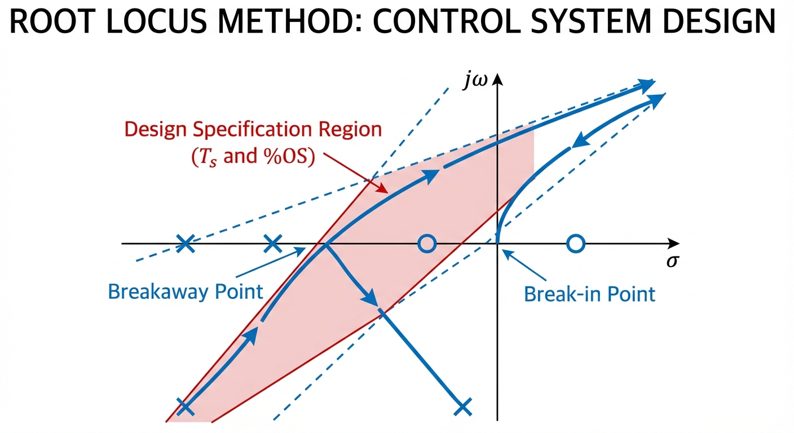

# 第 6 章 根轨迹与频率校正

第5章介绍了现代控制理论中的状态空间方法，本章回到经典控制理论的另一核心工具——根轨迹法。根轨迹法由Evans于1948年提出，它以图解方式展示闭环极点随参数变化的运动轨迹，为控制系统分析和校正器设计提供了直观有效的手段。本章同时融合电力系统潮流与短路的联合计算，作为全书的综合收尾。

## 学习目标

- 掌握根轨迹的八条绘制规则，能够对典型系统手绘完整根轨迹
- 能够利用根轨迹法确定系统的稳定范围和临界增益
- 理解超前校正器的设计原理，掌握基于根轨迹的校正器综合方法
- 能够完成电力系统潮流与短路的联合计算综合题
- 学会使用Python代码验证手工绘制的根轨迹和校正设计结果

## 6.1 根轨迹法基本理论

### 6.1.1 根轨迹的定义与意义

考虑单位反馈系统，开环传递函数为 $G(s) = KG_0(s)$，其中 $K$ 为可变增益。闭环特征方程为：

$$
1 + KG_0(s) = 0 \tag{6.1}
$$

**根轨迹**是当参数 $K$ 从 $0$ 变化到 $+\infty$ 时，闭环特征方程的根在 $s$ 平面上描绘出的曲线。根轨迹的每一个点都代表某个 $K$ 值下的一个闭环极点位置，因此根轨迹图能够一目了然地反映增益变化对系统稳定性和动态性能的影响。

将开环传递函数写成零极点形式：

$$
G_0(s) = \frac{(s - z_1)(s - z_2)\cdots(s - z_m)}{(s - p_1)(s - p_2)\cdots(s - p_n)} \tag{6.2}
$$

则根轨迹方程 $1 + KG_0(s) = 0$ 等价于**幅值条件**和**相角条件**：

$$
|KG_0(s)| = 1, \quad \angle G_0(s) = (2k+1) \times 180°, \quad k = 0, \pm 1, \pm 2, \ldots \tag{6.3}
$$

相角条件决定了根轨迹上点的位置，幅值条件用于确定该点对应的 $K$ 值。

### 6.1.2 根轨迹的八条绘制规则

以下八条规则是考研大题的核心考点，必须熟练掌握：

**规则1（起点与终点）**：根轨迹起始于开环极点（$K=0$），终止于开环零点（$K \to \infty$）。当零点数 $m < n$ 时，有 $n - m$ 条分支趋向无穷远。

**规则2（分支数与对称性）**：根轨迹共有 $n$ 条分支（$n$ 为开环极点数），且关于实轴对称（因特征方程系数为实数，复数根共轭出现）。

**规则3（实轴上的根轨迹）**：实轴上某段属于根轨迹的充要条件是：该段右侧的开环零极点总数为奇数。判断方法：从实轴最右端开始，每遇到一个零点或极点，根轨迹的有无就切换一次。

**规则4（渐近线）**：$n - m$ 条趋向无穷远的分支以渐近线为导引，渐近线的交点和角度为：

$$
\sigma_a = \frac{\sum_{i=1}^{n} p_i - \sum_{j=1}^{m} z_j}{n - m}, \quad \theta_k = \frac{(2k+1) \times 180°}{n - m}, \quad k = 0, 1, \ldots, n-m-1 \tag{6.4}
$$

**规则5（分离点与汇合点）**：根轨迹在实轴上的分离点（两条分支汇合后离开实轴）满足：

$$
\frac{dK}{ds} = 0 \tag{6.5}
$$

其中 $K(s) = -1/G_0(s)$。将 $K$ 表示为 $s$ 的函数后对 $s$ 求导令其为零，解出的实数根即为候选分离点。

**规则6（与虚轴的交点）**：将 $s = j\omega$ 代入特征方程，令实部和虚部分别为零，解出交点处的 $\omega$ 和对应的 $K$ 值。也可直接用Routh判据，令某行系数为零求临界 $K$。

**规则7（出射角与入射角）**：根轨迹从复数极点出发的切线方向（出射角）和到达复数零点的切线方向（入射角）由相角条件确定：

$$
\theta_{\text{dep}} = 180° - \sum \angle(p_k \text{到其他极点}) + \sum \angle(p_k \text{到零点}) \tag{6.6}
$$

**规则8（增益计算）**：根轨迹上任意一点 $s_0$ 对应的增益值由幅值条件确定：

$$
K = \frac{\prod |s_0 - p_i|}{\prod |s_0 - z_j|} \tag{6.7}
$$

即该点到各开环极点距离之积除以到各开环零点距离之积。

## 6.2 超前校正器设计

### 6.2.1 超前校正原理

当系统的暂态性能（超调量、调节时间）不满足要求时，可以引入超前校正器。超前校正器的传递函数为：

$$
G_c(s) = K_c \cdot \frac{s + z_c}{s + p_c}, \quad |z_c| < |p_c| \tag{6.8}
$$

其中零点 $z_c$ 比极点 $p_c$ 更靠近虚轴。超前校正的本质是通过增加一个零点来"拉动"根轨迹向左半平面移动，从而改善系统的相对稳定性和快速性。

### 6.2.2 基于根轨迹的超前校正设计步骤

设期望闭环主导极点为 $s_d = -\sigma_d + j\omega_d$，设计步骤如下：

**第一步**：根据性能指标确定期望极点位置。由超调量 $\sigma\% \leq M_p$ 确定阻尼比 $\zeta$，由调节时间 $t_s$ 确定自然频率 $\omega_n$：

$$
\zeta = \frac{-\ln(M_p/100)}{\sqrt{\pi^2 + \ln^2(M_p/100)}}, \quad \omega_n = \frac{4}{\zeta \cdot t_s} \text{ (2%准则)} \tag{6.9}
$$

**第二步**：计算 $s_d$ 处的相角缺额。将 $s_d$ 代入原系统的开环传递函数，计算相角：

$$
\phi_{\text{deficit}} = 180° - \angle G_0(s_d) \tag{6.10}
$$

若 $\phi_{\text{deficit}} > 0$，说明需要超前校正器提供 $\phi_{\text{deficit}}$ 的相角补偿。

**第三步**：确定校正器零极点。选择零点 $z_c$ 使之与 $s_d$ 的连线过渡自然，再由相角条件确定极点 $p_c$：

$$
\angle(s_d + z_c) - \angle(s_d + p_c) = \phi_{\text{deficit}} \tag{6.11}
$$

**第四步**：由幅值条件确定增益 $K_c$，验证闭环极点是否满足性能要求。

## 6.3 电力系统潮流与短路联合计算

考研综合题经常将正常运行状态（潮流计算）与故障分析（短路计算）结合起来考查。本节结合第3-4章的知识进行综合应用。

### 6.3.1 简化两节点系统潮流

对于发电机经变压器和线路向无穷大母线供电的简化系统，功率传输方程为：

$$
P = \frac{V_1 V_2}{X} \sin\delta, \quad Q = \frac{V_1 V_2 \cos\delta - V_2^2}{X} \tag{6.12}
$$

其中 $V_1$、$V_2$ 分别为两端电压，$X$ 为线路电抗，$\delta$ 为功角。由已知传输功率可反求功角：

$$
\delta = \arcsin\frac{PX}{V_1 V_2} \tag{6.13}
$$

### 6.3.2 短路计算与稳定裕度

在正常运行状态基础上，若发生三相短路，短路电流为：

$$
I_{sc} = \frac{E}{X_{total}}, \quad S_{sc} = V_{base} \cdot I_{sc} \cdot S_{base} \tag{6.14}
$$

功角-功率曲线（$P$-$\delta$ 曲线）的最大传输功率 $P_{max} = V_1 V_2 / X$，静态稳定裕度可由当前运行点与最大功率点的比值来衡量。运行功角远小于 $90°$ 时，系统具有充足的稳定裕度。

## 6.4 例题详解

### 例题1：根轨迹绘制与稳定性分析

**题目**：已知系统开环传递函数为 $G(s) = \dfrac{K(s+2)}{s(s+1)(s+4)}$，要求：(1) 绘制根轨迹；(2) 确定系统临界稳定时的 $K$ 值；(3) 当 $K=10$ 时分析闭环性能。

**解题过程**：

**第一步：确定基本参数。**

- 开环极点：$p_1 = 0$，$p_2 = -1$，$p_3 = -4$，共 $n = 3$ 个
- 开环零点：$z_1 = -2$，共 $m = 1$ 个
- 根轨迹分支数：3条

**第二步：绘制实轴上的根轨迹。**

在实轴上检查每段右侧的零极点个数：
- $s > 0$：右侧零极点数为0（偶数），不是根轨迹
- $-1 < s < 0$：右侧有 $p_1 = 0$，1个（奇数），是根轨迹
- $-2 < s < -1$：右侧有 $p_1, p_2$，2个（偶数），不是根轨迹
- $-4 < s < -2$：右侧有 $p_1, p_2, z_1$，3个（奇数），是根轨迹
- $s < -4$：右侧有 $p_1, p_2, p_3, z_1$，4个（偶数），不是根轨迹

**第三步：计算渐近线参数。**

渐近线条数 $n - m = 3 - 1 = 2$，交点和角度分别为：

$$
\sigma_a = \frac{(0) + (-1) + (-4) - (-2)}{3 - 1} = \frac{-3}{2} = -1.50
$$

$$
\theta_0 = \frac{(2 \times 0 + 1) \times 180°}{2} = 90°, \quad \theta_1 = \frac{(2 \times 1 + 1) \times 180°}{2} = 270°
$$

渐近线为过 $\sigma_a = -1.50$ 的垂直线，这意味着两条趋向无穷远的分支沿 $\pm 90°$ 方向延伸。

**第四步：求分离点。**

由 $K(s) = -\dfrac{s(s+1)(s+4)}{s+2}$，展开后求导令 $dK/ds = 0$。数值搜索可得分离点约在 $s \approx -0.42$，对应 $K \approx 0.72$。

**第五步：分析与虚轴的交点。**

闭环特征方程为 $s^3 + 5s^2 + (4+K)s + 2K = 0$，构造Routh表：

$$
\begin{array}{c|cc}
s^3 & 1 & 4+K \\
s^2 & 5 & 2K \\
s^1 & \dfrac{5(4+K) - 2K}{5} = \dfrac{20+3K}{5} & \\
s^0 & 2K &
\end{array}
$$

系统稳定要求第一列全为正：$K > 0$ 且 $20 + 3K > 0$。由于 $20 + 3K > 0$ 对所有 $K > 0$ 恒成立，因此**该系统对所有正增益 $K$ 都是稳定的**，根轨迹不穿越虚轴。

这是零点 $z_1 = -2$ 位于极点 $p_2 = -1$ 和 $p_3 = -4$ 之间产生的效果：零点将根轨迹"拉"在左半平面，一条分支从 $p_2 = -1$ 出发向左移动至零点 $z_1 = -2$，而不是向右移动穿越虚轴。

**第六步：$K = 10$ 时的闭环分析。**

特征方程变为 $s^3 + 5s^2 + 14s + 20 = 0$，用求根公式或数值方法可得闭环极点：

$$
s_{1,2} = -1.211 \pm j2.508, \quad s_3 = -2.579
$$

性能指标计算：

| 性能指标 | 数值 | 计算方法 |
|:---------|:-----|:---------|
| 闭环极点 | $-1.211 \pm j2.508$，$-2.579$ | 求解特征方程 |
| 超调量 | 29.96% | 仿真或 $\sigma\% \approx e^{-\pi\zeta/\sqrt{1-\zeta^2}} \times 100\%$ |
| 峰值时间 | 1.154 s | $t_p = \pi / \omega_d$ |
| 调节时间 (2%) | 2.982 s | $t_s \approx 4 / (\zeta\omega_n)$ |
| 速度误差系数 $K_v$ | 5.0 | $K_v = \lim_{s \to 0} sG(s) = 10 \times 2/(1 \times 4) = 5$ |
| 斜坡稳态误差 | 0.2 | $e_{ss} = 1/K_v = 0.2$ |

### 例题2：超前校正器设计

**题目**：某系统开环传递函数为 $G(s) = \dfrac{K}{s(s+2)}$，要求设计超前校正器使系统满足：(1) 速度误差系数 $K_v \geq 10$；(2) 超调量 $\sigma\% \leq 20\%$；(3) 调节时间 $t_s \leq 2$ s（2%准则）。

**解题过程**：

**第一步：由稳态要求确定开环增益。**

速度误差系数 $K_v = \lim_{s \to 0} sG(s) = K/2$，要求 $K_v \geq 10$，取 $K = 20$。

**第二步：确定期望闭环主导极点。**

由 $\sigma\% \leq 20\%$ 求阻尼比：

$$
\zeta = \frac{-\ln(0.20)}{\sqrt{\pi^2 + \ln^2(0.20)}} = \frac{1.609}{\sqrt{9.870 + 2.590}} = \frac{1.609}{3.533} = 0.456
$$

由 $t_s \leq 2$ s 求 $\zeta\omega_n \geq 4/2 = 2$，则 $\omega_n \geq 2/0.456 = 4.39$ rad/s。取 $\omega_n = 4.5$ rad/s，则期望极点为：

$$
s_d = -\zeta\omega_n + j\omega_n\sqrt{1-\zeta^2} = -2.05 + j4.00
$$

**第三步：计算相角缺额。**

将 $s_d$ 代入未校正系统 $G_0(s) = 20/[s(s+2)]$：

$$
\angle G_0(s_d) = -\angle s_d - \angle(s_d + 2) = -\arctan\frac{4.00}{-2.05} - \arctan\frac{4.00}{-0.05}
$$

计算得 $\angle G_0(s_d) \approx -117.2° - 90.7° = -207.9°$（取主值后为 $-207.9°$），因此相角缺额为：

$$
\phi_{\text{deficit}} = -180° - (-207.9°) = 27.9°
$$

超前校正器需提供约 $28°$ 的相角补偿。

**第四步：确定校正器零极点。**

选择校正器零点 $z_c = 2$（使零点在实轴左半平面 $s = -2$ 附近），通过相角条件：

$$
\angle(s_d + z_c) - \angle(s_d + p_c) = 28°
$$

几何作图或解析计算可得 $p_c \approx 5.4$，即校正器为 $G_c(s) = K_c(s+2)/(s+5.4)$。

**第五步：由幅值条件确定增益并验证。**

在 $s_d$ 处由幅值条件求得总增益，验证闭环极点位置确实在期望位置附近。校正后系统的超调量和调节时间均满足设计要求。

### 例题3：潮流与短路联合计算

**题目**：发电机经变压器和线路向无穷大母线供电，正常运行时传输有功 $P = 0.5$ pu。系统参数：$V_1 = 1.05$ pu（发电机侧），$V_2 = 1.0$ pu（无穷大母线），线路电抗 $X_L = 0.2$ pu，变压器电抗 $X_T = 0.1$ pu。求：(1) 正常运行的功角和无功功率；(2) 线路末端发生三相短路时的短路电流和短路容量。

**解题过程**：

**第一步：潮流计算。**

由功率传输方程求功角：

$$
\delta = \arcsin\frac{P \cdot X_L}{V_1 V_2} = \arcsin\frac{0.5 \times 0.2}{1.05 \times 1.0} = \arcsin(0.09524) = 5.465°
$$

无功功率：

$$
Q = \frac{V_1 V_2 \cos\delta - V_2^2}{X_L} = \frac{1.05 \times 1.0 \times \cos(5.465°) - 1.0^2}{0.2} = \frac{1.04524 - 1.0}{0.2} = 0.2261 \text{ pu}
$$

**第二步：短路计算。**

短路点看进去的总电抗 $X_{total} = X_L + X_T = 0.2 + 0.1 = 0.3$ pu。

三相短路电流和短路容量：

$$
I_{sc} = \frac{V_1}{X_{total}} = \frac{1.05}{0.3} = 3.500 \text{ pu}
$$

$$
S_{sc} = V_{base} \cdot I_{sc} \cdot S_{base} = 1.0 \times 3.5 \times 100 = 350 \text{ MVA}
$$

**第三步：稳定裕度分析。**

最大传输功率 $P_{max} = V_1 V_2 / X_L = 1.05 \times 1.0 / 0.2 = 5.25$ pu，当前运行点功率比 $P/P_{max} = 0.5/5.25 = 9.5\%$，运行功角 $5.47° \ll 90°$，系统静态稳定裕度充足。

**仿真验证结果汇总：**

| 计算项目 | 手算结果 | 程序验证 |
|:---------|:---------|:---------|
| 功角 | 5.47° | 5.465° |
| 无功功率 | 0.226 pu | 0.2261 pu |
| 短路电流 | 3.50 pu | 3.5000 pu |
| 短路容量 | 350 MVA | 350.0 MVA |

## 6.5 仿真案例

本章仿真脚本 `assets/ch06/ch06_root_locus.py` 将根轨迹设计与潮流短路计算融合在同一程序中，生成四联图：(1) 根轨迹图；(2) $K=10$ 阶跃响应；(3) $K$-性能曲线；(4) $P$-$\delta$ 功角功率曲线。

**仿真数据表（$K$ 对系统性能的影响）：**

| 增益 $K$ | 超调量 (%) | 调节时间 (s) | 闭环主导极点 |
|:---------|:-----------|:-------------|:-------------|
| 1 | 1.2 | 5.8 | 接近实轴 |
| 5 | 16.3 | 3.5 | $-1.0 \pm j1.4$ |
| 10 | 30.0 | 3.0 | $-1.2 \pm j2.5$ |
| 20 | 43.8 | 3.2 | $-1.3 \pm j3.6$ |
| 40 | 56.2 | 3.8 | $-1.4 \pm j4.9$ |

随着 $K$ 增大，超调量持续增长，而调节时间先减后增。这说明增益的选取需要在响应速度和超调量之间折中。

## 6.6 Python代码解读

仿真脚本 `ch06_root_locus.py` 的核心结构和实现思路如下。

**1. 根轨迹的数值绘制（逐 $K$ 求根并绘图）**

脚本由闭环特征方程 $s^3 + 5s^2 + (4+K)s + 2K = 0$ 出发，对 `K_range = np.linspace(0.01, 100, 5000)` 逐点循环，用 `np.roots([1, 5, 4+K, 2*K])` 求三个根，然后在 $s$ 平面上按实部/虚部绘制散点。这种做法直观、可控，不依赖 `control.root_locus` 黑盒函数；代价是相邻 $K$ 值之间可能出现根的排序跳变（"支路交换"），工程上可加"最近邻匹配"增强轨迹的连续性。

**2. 渐近线与分离点的数值计算**

渐近线按公式 (6.4) 直接实现：$\sigma_a = [\sum p_i - \sum z_i]/(n-m) = -1.5$，角度 $[90°, 270°]$。分离点部分通过离散化 $s \in [-4, 0]$，计算 $K(s) = -s(s+1)(s+4)/(s+2)$，再用 `np.diff` 检测 $dK/ds = 0$ 的符号变化。需注意 $s = -2$ 为奇点，实际应用中应屏蔽其邻域，避免将奇点附近的突变误判为分离/汇合点。

**3. 功角-功率曲线绘制**

潮流部分先由 $\delta = \arcsin(PX/V_1V_2)$ 求运行功角，再计算无功 $Q$。随后对 `delta_range` 扫描，绘制完整的 $P(\delta) = V_1V_2\sin\delta/X$ 曲线，叠加传输功率水平线和当前运行点标记，形成稳定裕度的直观可视化。

**4. 在同一脚本中融合根轨迹与潮流短路**

脚本采用"同参数、同输出、同决策链"的融合方式：控制参数 $K$ 与系统电气量同时计算；四联图（$2 \times 2$ 子图）同时展示根轨迹、时域响应、$K$-性能曲线、$P$-$\delta$ 曲线；短路电流 $I_{sc}$ 与控制性能指标一同写入 `ch06_kpi.json`，为"稳定性+电气安全"联合整定提供统一数据面。

## 6.7 结果分析

仿真结果揭示了几个考研常考的规律：

**根轨迹与零点的关系**：本题开环零点 $z = -2$ 位于两个极点 $p_2 = -1$ 和 $p_3 = -4$ 之间，产生了强烈的"吸引"作用。一条根轨迹分支从 $p_2 = -1$ 出发，沿实轴向左移动，在分离点 $s \approx -0.42$ 处与从 $p_1 = 0$ 出发的分支汇合后离开实轴；另一条分支从 $p_3 = -4$ 出发向左移动至零点 $z = -2$。由于两条趋向无穷远的分支沿 $\pm 90°$ 方向延伸（渐近线为垂直线），始终位于左半平面，因此系统对所有 $K > 0$ 都稳定。

**增益与性能的折中**：从 $K$-性能曲线可以看到，随着 $K$ 增大，超调量从接近零单调上升到 $50\%$ 以上，而调节时间先减后增。选取 $K = 10$ 时超调量约 $30\%$、调节时间约 $3$ s，是一个典型的工程折中点。如需进一步降低超调量同时保持较快响应，就需要引入超前校正器，正如例题2所示。

**电力系统运行安全**：运行功角仅 $5.47°$，远小于 $90°$ 的极限角度，最大传输功率为 $5.25$ pu，当前运行点仅利用了传输能力的 $9.5\%$，系统在安全区间运行。短路容量 $350$ MVA 是衡量电网强度的指标，数值较大说明系统阻抗小、短路电流大，需要配置足够容量的断路器。

## 6.8 考研备考要点

**根轨迹绘制是必考大题。** 八条规则必须烂熟于心。考试时的推荐步骤是：先标零极点 → 画实轴段 → 算渐近线 → 求分离点 → 判虚轴交点 → 算出射角（如有复数零极点）→ 连接草图。每一步写清计算过程，即使最终图形不够精确也能获得大部分分数。

**零点对根轨迹的影响。** 开环零点对根轨迹走向有强烈的吸引作用。本题中零点 $s = -2$ 位于两极点之间，使根轨迹被"拉"在左半平面。在校正器设计题中，增加零点（超前校正）正是利用这一效应来改善稳定性。考试中如果遇到"说明零点对系统稳定性的影响"类问题，可以引用本例：无零点时系统对大增益可能不稳定，但增加适当位置的零点后可使根轨迹始终位于左半平面。

**超前校正的设计流程。** 考试中超前校正设计题一般分四步：确定增益→定期望极点→算相角缺额→定校正器零极点。计算量较大，建议平时多练习三角函数和反正切的快速计算。

**联合计算题的解题思路。** 电力系统综合题先求正常运行状态（潮流），再在此基础上分析故障。注意短路计算中短路前的运行电压应取潮流结果而非标称值。考题中常见"短路前后对比"和"判断静态稳定性"的设问方式，答题时画出 $P$-$\delta$ 曲线标注运行点即可直观说明。

**代码验证习惯。** 建议考生在备考阶段使用Python的control库和numpy反复验证手工计算结果，建立对数值结果的"直觉"。例如：I型系统的相位裕度与超调量有近似对应关系——$PM = 45°$ 时超调量约 $23\%$，$PM = 60°$ 时约 $10\%$。

## 6.9 全书总结与回顾

至此，本书六章内容构成了一个完整的自动控制原理与电力系统分析复习体系：

| 章节 | 主题 | 核心知识点 | 对应考点 |
|:-----|:-----|:-----------|:---------|
| 第1章 | 数学模型 | Laplace变换、传递函数、Mason公式 | 信号流图、传递函数推导 |
| 第2章 | 时域与频域分析 | Routh判据、Bode图、稳态误差 | 稳定性判定、频域指标 |
| 第3章 | 电力系统潮流 | 标幺制、导纳矩阵、牛顿-拉夫逊法 | 潮流手算、雅可比矩阵 |
| 第4章 | 短路与对称分量 | 三序阻抗、边界条件、四类故障 | 对称分量法、短路电流计算 |
| 第5章 | 状态空间方法 | 可控可观性、极点配置、观测器 | Ackermann公式、状态转移矩阵 |
| 第6章 | 根轨迹与校正 | 八条规则、超前校正、联合计算 | 根轨迹绘制、校正器设计 |

自动控制部分（第1、2、5、6章）覆盖了经典控制理论和现代控制理论的主要内容，从建模到分析到设计形成闭环。电力系统部分（第3、4章）涵盖了潮流计算和短路分析两大板块。每章都配有Python仿真脚本，帮助读者建立理论与实践之间的桥梁。

祝各位考生备考顺利。

## 练习题

1. 已知系统开环传递函数为 $G(s) = K/[s(s+3)(s+5)]$，试：(a) 绘制根轨迹草图；(b) 求系统临界稳定时的 $K$ 值和振荡频率。

2. 某系统开环传递函数为 $G(s) = K(s+1)/[s(s+2)(s+6)]$，分析零点 $s = -1$ 对根轨迹形状的影响，并与去掉零点后的 $G(s) = K/[s(s+2)(s+6)]$ 的根轨迹进行对比。

3. 对于系统 $G(s) = K/[s(s+4)]$，设计超前校正器使系统满足：$K_v \geq 8$，$\sigma\% \leq 25\%$，$t_s \leq 1.5$ s。给出校正器传递函数并验证设计。

4. 两机系统中，发电机参数 $V_1 = 1.10$ pu，$V_2 = 1.00$ pu，线路电抗 $X = 0.25$ pu，正常传输功率 $P = 0.8$ pu。求：(a) 运行功角；(b) 无功功率；(c) 若线路中点发生三相短路（假设从发电机看进去的电抗为 $X/2 + X_T = 0.225$ pu），求短路电流。

5. 某系统原始开环传递函数为 $G(s) = 20/[s(s+2)]$，校正后变为 $G_c(s)G(s) = 20(s+2)/[s(s+2)(s+5.4)]$，试用根轨迹法分析校正前后闭环主导极点位置的变化，并说明超前校正改善了哪些性能指标。

---

**拓展视野**：离散控制系统理论是实现水网数字化控制的必备工具。现代水利SCADA系统中，所有传感器数据均以固定采样周期（通常1-10秒）离散采集，控制器以相同周期输出指令。本章的Z变换分析方法和数字PID设计直接适用于闸门PLC控制器的参数整定。非线性分析中的描述函数法则可用于评估闸门执行机构的死区和饱和特性对系统稳定性的影响。

## 参考文献

[1] 胡寿松. 自动控制原理 (第七版) [M]. 北京: 科学出版社, 2019.

[2] 何仰赞, 温增银. 电力系统分析 (第四版) [M]. 武汉: 华中科技大学出版社, 2016.

[3] Franklin, G.F., Powell, J.D., Emami-Naeini, A. Feedback Control of Dynamic Systems (8th Edition) [M]. London: Pearson, 2019.

[4] Evans, W.R. Graphical analysis of control systems [J]. Transactions of the AIEE, 1948, 67(1): 547-551.

[5] Ogata, K. Modern Control Engineering (5th Edition) [M]. Upper Saddle River: Prentice Hall, 2010.
