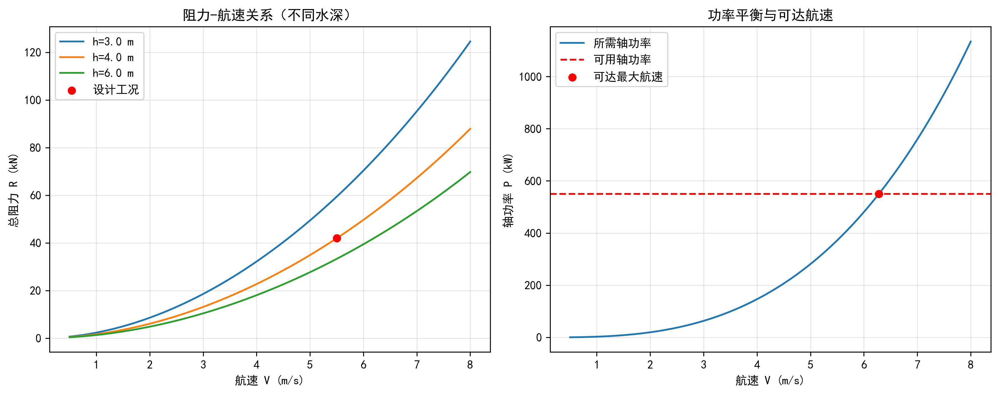

---

## 仿真代码解读



> 本节由Codex引擎生成，提供本章核心算法的Python实现与解读。

```python
# -*- coding: utf-8 -*-
"""
教材：《内河航道与通航水力学》
章节：第3章 船舶阻力与航速（3.1 基本概念与理论框架）
功能：基于阻力分解与功率平衡，仿真内河船舶在不同航速/水深条件下的阻力和可达航速，
并输出KPI结果表与可视化图形。
"""
import numpy as np
import matplotlib.pyplot as plt
from scipy.optimize import brentq

# =============== 1) 关键参数定义（可直接改） ===============
rho = 1000.0           # 水密度(kg/m^3)
nu = 1.00e-6           # 运动黏度(m^2/s)
g = 9.81               # 重力加速度(m/s^2)

L = 52.0               # 船长(m)
B = 9.2                # 船宽(m)
T = 1.6                # 吃水(m)
Cb = 0.82              # 方形系数
S = 560.0              # 湿表面积(m^2)，课程中可替换为实测值

form_factor = 0.18     # 形状系数k（粘压阻附加）
Cr0 = 0.0012           # 基础剩余阻力系数
Cr_fr4 = 0.0060        # Fr^4项系数，用于描述兴波阻力增长
eta_total = 0.62       # 总推进效率（轴到有效功）

depth_design = 4.0     # 设计水深(m)
depth_cases = [3.0, 4.0, 6.0]  # 对比水深(m)

P_available_kw = 550.0 # 可用轴功率(kW)
v_design = 5.5         # 设计航速(m/s)

# =============== 2) 理论函数 ===============
def friction_coefficient(v):
    """ITTC-1957摩擦阻力系数"""
    Re = v * L / nu
    return 0.075 / (np.log10(Re) - 2.0) ** 2

def residual_coefficient(v):
    """剩余阻力系数：与弗劳德数相关"""
    Fr = v / np.sqrt(g * L)
    return Cr0 + Cr_fr4 * Fr**4

def shallow_water_factor(h):
    """浅水修正系数：体现水深受限时阻力放大"""
    ratio = T / h
    if ratio >= 0.95:
        raise ValueError("水深过小，T/h接近1，模型不再适用。")
    return 1.0 + 1.8 * ratio**2 / (1.0 - ratio)

def total_resistance(v, h):
    """总阻力(N)"""
    cf = friction_coefficient(v)
    cr = residual_coefficient(v)
    c_total = cf * (1.0 + form_factor) + cr
    return 0.5 * rho * S * v**2 * c_total * shallow_water_factor(h)

def shaft_power_required(v, h):
    """所需轴功率(W)"""
    return total_resistance(v, h) * v / eta_total

def solve_achievable_speed(power_kw, h, v_min=0.3, v_max=9.0):
    """由可用轴功率反解可达航速"""
    power_w = power_kw * 1000.0
    f = lambda x: shaft_power_required(x, h) - power_w

    if f(v_min) > 0:
        return np.nan
    if f(v_max) < 0:
        return v_max
    return brentq(f, v_min, v_max)

# =============== 3) 计算KPI ===============
v_ach = solve_achievable_speed(P_available_kw, depth_design)
R_design = total_resistance(v_design, depth_design)
P_design_kw = shaft_power_required(v_design, depth_design) / 1000.0
Fr_ach = v_ach / np.sqrt(g * L)

# 经济性示意指标：单位有效功耗(仅示意，教学中可换为油耗模型)
R_ach = total_resistance(v_ach, depth_design)
Pe_ach_kw = (R_ach * v_ach) / 1000.0
transport_eff = Pe_ach_kw / (v_ach * 3.6)  # kW/(km/h)

kpi_rows = [
    ("设计航速", f"{v_design:.2f} m/s ({v_design*3.6:.2f} km/h)", "输入参数"),
    ("设计航速总阻力", f"{R_design/1000:.2f} kN", "R(v_design, h_design)"),
    ("设计航速所需轴功率", f"{P_design_kw:.2f} kW", "P=R·V/eta"),
    ("可达最大航速", f"{v_ach:.2f} m/s ({v_ach*3.6:.2f} km/h)", "由可用功率反解"),
    ("可达航速弗劳德数", f"{Fr_ach:.3f}", "Fr=V/sqrt(gL)"),
    ("单位速度有效功耗", f"{transport_eff:.2f} kW/(km/h)", "教学示意KPI"),
]

print("\nKPI结果表（第3章 船舶阻力与航速）")
print("-" * 86)
print(f"{'指标':<20} | {'数值':<32} | {'说明'}")
print("-" * 86)
for name, value, note in kpi_rows:
    print(f"{name:<20} | {value:<32} | {note}")
print("-" * 86)

# =============== 4) 绘图 ===============
v = np.linspace(0.5, 8.0, 180)

plt.rcParams["font.sans-serif"] = ["SimHei", "Microsoft YaHei", "DejaVu Sans"]
plt.rcParams["axes.unicode_minus"] = False

fig, axes = plt.subplots(1, 2, figsize=(12, 4.8))

# 图1：不同水深下的阻力-航速曲线
for h in depth_cases:
    R_curve = total_resistance(v, h) / 1000.0
    axes[0].plot(v, R_curve, label=f"h={h:.1f} m")
axes[0].scatter([v_design], [R_design / 1000.0], c="red", zorder=3, label="设计工况")
axes[0].set_xlabel("航速 V (m/s)")
axes[0].set_ylabel("总阻力 R (kN)")
axes[0].set_title("阻力-航速关系（不同水深）")
axes[0].grid(alpha=0.3)
axes[0].legend()

# 图2：设计水深下的功率平衡
P_curve_kw = shaft_power_required(v, depth_design) / 1000.0
axes[1].plot(v, P_curve_kw, label="所需轴功率")
axes[1].axhline(P_available_kw, color="r", linestyle="--", label="可用轴功率")
axes[1].scatter([v_ach], [P_available_kw], c="red", zorder=3, label="可达最大航速")
axes[1].set_xlabel("航速 V (m/s)")
axes[1].set_ylabel("轴功率 P (kW)")
axes[1].set_title("功率平衡与可达航速")
axes[1].grid(alpha=0.3)
axes[1].legend()

plt.tight_layout()
plt.show()
```

800字代码解读：  
这段脚本围绕第3章3.1“基本概念与理论框架”展开，核心思想是把“航速问题”转化为“阻力与功率平衡问题”。在理论上，船舶稳态航行时推进力与总阻力平衡；在工程上，我们通常更容易得到轴功率，因此脚本使用`P=R·V/η`把阻力模型与主机能力连接起来。代码首先在参数区集中定义船体尺度、水体物性、推进效率、可用功率和设计水深，便于课堂上做“单参数敏感性分析”，例如只改`depth_design`观察浅水效应。阻力模型采用“分解法”：总阻力系数由摩擦阻力和剩余阻力叠加组成。摩擦阻力使用ITTC-1957公式，体现雷诺数主导的黏性效应；剩余阻力用`Fr`函数表示，体现兴波等与重力相似相关的效应。这样就把3.1里常见的两类相似准则（雷诺数、弗劳德数）落到了可计算表达式上。浅水影响通过`shallow_water_factor`处理，本质是当`T/h`增大时，回流受限、兴波增强、阻力放大；脚本还加了`T/h`上限检查，避免超出简化模型适用域。随后用`solve_achievable_speed`反求可达航速：给定可用轴功率，构造`f(v)=P_required(v)-P_available`，再用`scipy.optimize.brentq`做一维求根，比手工试算更稳定。KPI部分给出教学最常用的六项指标：设计点阻力、设计点功率、可达最大航速、对应弗劳德数等，形成“输入-模型-输出”的闭环。图形部分两张图各司其职：第一张展示不同水深下阻力曲线，直观看到浅水曲线整体上移；第二张是功率平衡图，用水平线表示主机能力，与功率需求曲线交点即最大可达航速。这种表达非常适合课堂讲解“为什么同一条船在枯水期跑不起来”。从扩展角度看，后续可把`Cr`改为试验回归式，把`S`改为由尺度关系自动估算，并增加油耗模型，把“单位速度有效功耗”替换为“吨公里油耗”，即可从水力学仿真过渡到航运经济性分析。


## 参考文献

1. Pianc (2014). *Harbour Approach Channels Design Guidelines*. PIANC Report No. 121.
2. Briggs, M. J., et al. (2013). Ship-induced waves and sediment transport in restricted waterways. *Coastal Engineering*, 82, 42-55.
3. Lei et al. (2025a). 水系统控制论：基本原理与理论框架. *南水北调与水利科技(中英文)*. DOI: 10.13476/j.cnki.nsbdqk.2025.0077
4. Schoellhamer, D. H. (1996). Anthropogenic sediment resuspension mechanisms in a shallow microtidal estuary. *Estuarine, Coastal and Shelf Science*, 43(5), 533-548.
