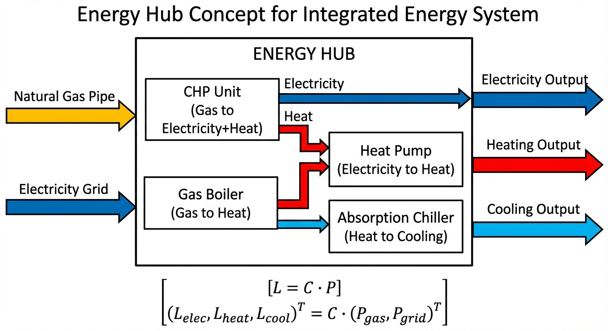
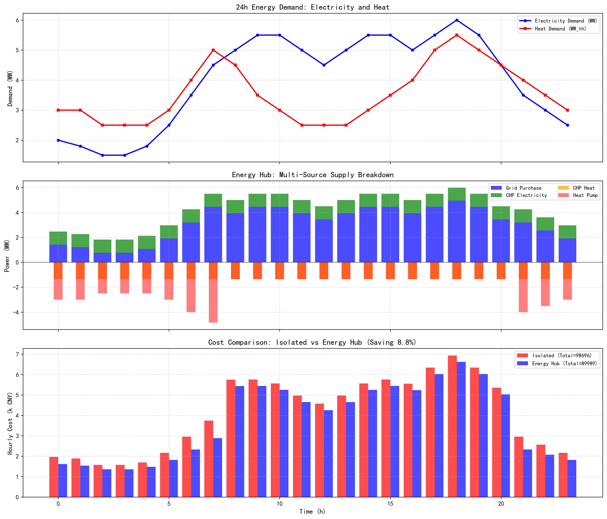

# 第 1 章：什么是综合能源系统（IES）？

## 1.1 本章导读与学习目标

进入21世纪以来，全球正面临着能源枯竭与气候变化的双重挑战。在传统的能源供应架构中，电力系统、供热系统以及天然气网络通常由不同的公共事业实体分别规划、独立建设和单独运营。这种各自为战的系统架构在学术界和工程界被称为"能源孤岛"（Energy Islands）。在能源孤岛模式下，各系统的运行缺乏横向协同，导致大量本可回收利用的能量（如发电过程中的低品位余热）被直接排放到环境中，同时由于各系统缺乏互助能力，单一系统的波动性也往往难以被有效平抑。

综合能源系统（Integrated Energy System, IES）作为新一代能源体系架构的核心形态，其核心思想是打破这些传统的系统壁垒，将电力、热力、冷能、天然气等多种不同形式的能源，通过先进的物理耦合转换设备，组织成为一个统筹规划、协同运行的统一供能网络。通过引入热电联产机组（Combined Heat and Power, CHP）、热泵（Heat Pump, HP）、燃气锅炉（Gas Boiler）、甚至电转气（Power-to-Gas, P2G）等关键转换单元，IES 能够实现多能载体之间的灵活转换和双向互动，从而实现能源的梯级高效利用与互补调配。

本章将系统性地阐述综合能源系统的基本概念，并通过引入经典的"能源集线器"（Energy Hub）模型，构建一套通用的多能耦合数学表达框架。结合实际的日运行负荷场景，本章将深入演示多能耦合机制在提升系统整体能效、降低综合运行成本等方面的量化优势。

**学习目标：**
1. 深入理解综合能源系统的基本定义与传统能源孤岛面临的瓶颈问题。
2. 掌握多能设备的基本运行原理，熟练推导 Energy Hub 的耦合矩阵建模方法。
3. 通过具体的日运行仿真案例对比，量化分析多能耦合系统相对于传统孤立供能架构在经济效益与能效提升上的具体优势。
4. 掌握多能耦合系统的核心评估指标，如一次能源节省率与运行成本节约率的计算方法。

## 1.2 能源孤岛与多能耦合的物理机理

在深入探讨综合能源系统的数学模型之前，有必要剖析传统能源系统与现代多能耦合系统在物理运行机理上的根本差异。

### 1.2.1 传统"能源孤岛"的运行瓶颈

在孤立运行的供能模式下，终端用户的多重能源需求是由平行的能源网络单独满足的。例如，商业综合体或工业园区的电力需求完全依赖于外部主干电网的输配输入，而其热力需求则通常完全依赖于本地的燃气锅炉消耗天然气来直接产热。在这种割裂的架构下，两个系统之间没有任何能量交互通道。

这种运行模式存在两个显著的物理瓶颈：首先是能源利用效率低下。大型火力发电厂在将热能转化为电能的过程中，受限于卡诺循环的物理极限，往往有超过一半的初始热能作为废热通过冷却塔排放，而终端用户却在燃烧高品位的天然气获取低品位的热能，这构成了典型的能源品位错配；其次是系统运行缺乏弹性。当面临电网分时电价波动或某一部件故障时，孤立的系统无法通过寻找替代能源路径来进行自我调节。例如，在夜间电网处于谷电负荷且电价极低时，用户依然只能使用天然气供热，从而错失了利用廉价电力制热降低成本的良机。

### 1.2.2 多能耦合：打破壁垒的桥梁

多能耦合旨在通过引入能量转换与存储设备，在横向上打通电、热、气等异质能源子系统。在耦合机制的作用下：

第一，能源可以实现梯级利用（Cascaded Utilization）。以热电联产（CHP）为例，天然气在燃烧驱动燃气轮机发电的同时，排放的高温烟气可以通过余热回收蒸汽发生器捕获，用于满足终端的热负荷或冷负荷（结合吸收式制冷机）。这种模式将化石燃料的综合利用效率从传统模式的40%左右大幅提升至80%以上。

第二，能源可以实现跨网互补与替代。通过部署电驱动热泵，系统可以在电价低廉的时段，通过消耗少量高品位电能，从环境中提取大量低品位热能；而在电价高昂的峰荷时段，系统可以切换为燃气锅炉供热甚至启动 CHP 向电网反向售电。这种跨介质的套利与互济行为，大幅提升了系统的运行弹性和经济性。

## 1.3 核心数学建模：Energy Hub 理论体系

为了对复杂的多种能源形式、多台耦合设备以及动态交互过程进行定量分析与优化，学术界提出了"能源集线器"（Energy Hub）概念。Energy Hub 作为一个抽象的宏观节点，在系统层面对多能输入、转换设备、存储装置与多能输出进行了统一的数学描述。

### 1.3.1 基础耦合矩阵方程

Energy Hub 模型的核心在于建立外部能源输入网络（如电网、天然气网）与终端能源负荷（如电负荷、热负荷）之间的稳态映射关系。在不考虑内部储能动态的稳态模型中，输入能量流载体向量与输出能量流载体向量之间的关系可以表示为：

$$
\mathbf{L} = \mathbf{C} \cdot \mathbf{P}
$$

其中，$\mathbf{P} = [P_1, P_2, \dots, P_m]^T$ 代表系统接收的外部能源输入功率向量，如输入电功率、天然气流量等；$\mathbf{L} = [L_1, L_2, \dots, L_n]^T$ 代表终端用户的各类能源负荷需求向量，如电负荷、热负荷、冷负荷等。

$\mathbf{C}$ 为耦合系数矩阵（Coupling Matrix），维度为 $n \times m$。矩阵中的每一个元素 $C_{i,j}$ 代表了从第 $j$ 种输入能源转换为第 $i$ 种输出负荷时的综合转换效率或映射关系。

### 1.3.2 分配因子与拓扑方程推导

在实际工程中，同一种输入能源往往会被分配到多个并行的转换设备中。为了精确刻画能量的流动路径，需要引入分配因子（Dispatch Factor）$\nu$。假设分配因子表示特定设备获取的能量占总输入能量的比例，且满足分配约束 $\sum \nu = 1$。

以一个包含市电输入、天然气输入、热电联产机组（CHP）、电驱动热泵（HP）以及燃气锅炉（Boiler）的典型两输入两输出系统为例。

令输入向量为 $\mathbf{P} = [P_{grid}, F_{gas}]^T$，其中 $P_{grid}$ 为电网输入电功率，$F_{gas}$ 为天然气网输入化学功率。
令输出向量为 $\mathbf{L} = [P_{elec}, Q_{heat}]^T$，其中 $P_{elec}$ 为满足最终用户的电功率，$Q_{heat}$ 为热功率。

我们定义系统内部能量流动路径如下：
- 天然气输入 $F_{gas}$ 被分配给 CHP 和燃气锅炉，设进入 CHP 的比例为 $\nu_g$，进入锅炉的比例为 $(1 - \nu_g)$。
- 电网输入 $P_{grid}$ 与 CHP 发出的电能汇合后，一部分直接供给用户电负荷，另一部分分配给热泵，设进入热泵的总电能比例为 $\nu_e$。

在此拓扑下，系统各能量流节点满足能量守恒：
对于电力输出：
$$
P_{elec} = P_{grid} + P_{CHP,e} - P_{HP}
$$
其中 CHP 的发电量为 $P_{CHP,e} = \nu_g \cdot F_{gas} \cdot \eta_{e}$，$\eta_{e}$ 为 CHP 发电效率。
因此有：
$$
P_{elec} = P_{grid} + \nu_g \cdot \eta_{e} \cdot F_{gas} - P_{HP}
$$

对于热力输出：
$$
Q_{heat} = Q_{CHP,h} + Q_{Boiler} + Q_{HP}
$$
其中 CHP 的产热量 $Q_{CHP,h} = \nu_g \cdot F_{gas} \cdot \eta_{h}$，$\eta_{h}$ 为 CHP 热效率；锅炉产热量 $Q_{Boiler} = (1 - \nu_g) \cdot F_{gas} \cdot \eta_{boiler}$，$\eta_{boiler}$ 为锅炉热效率；热泵产热量 $Q_{HP} = P_{HP} \cdot \text{COP}$，$\text{COP}$ 为热泵的制热性能系数。
代入热力守恒方程：
$$
Q_{heat} = \nu_g \cdot \eta_{h} \cdot F_{gas} + (1 - \nu_g) \cdot \eta_{boiler} \cdot F_{gas} + P_{HP} \cdot \text{COP}
$$

将上述两个等式整理为矩阵形式，可以得到简化的宏观耦合方程：

$$
\begin{bmatrix} P_{elec} \\ Q_{heat} \end{bmatrix} = \mathbf{C} \cdot \begin{bmatrix} F_{gas} \\ P_{grid} \end{bmatrix}
$$

由于系统中包含动态运行的内部设备，实际操作中往往将设备出力作为待求解变量，并增加各设备的容量上下限约束：
$$
P_{CHP,e}^{min} \leq P_{CHP,e} \leq P_{CHP,e}^{max}
$$
$$
Q_{Boiler}^{min} \leq Q_{Boiler} \leq Q_{Boiler}^{max}
$$

这种矩阵化的建模方法不仅具有高度的抽象性与普适性，还能通过矩阵的扩展轻松包含更多形式的能源载体（如冷能、氢能）及网络约束，为复杂的非线性寻优与线性规划提供了坚实的理论基础。

## 1.4 仿真案例：Energy Hub vs 孤立供能系统对比分析

为了具象化理解多能耦合相较于孤立供能系统的优势，本节将开展一项基于24小时动态负荷周期的量化仿真实验。通过对比两种架构在完全相同的用户电、热负荷需求下的运行结果，揭示其深层的物理与经济机理。

### 1.4.1 仿真场景与参数设置

本案例选取某北方典型园区的冬季典型日数据。该园区同时面临较高的供暖热负荷以及随办公生产波动的电负荷。仿真分为两个独立对照组：
- **孤立运行模式（基线对照）**：在这个模式中，建筑的电力需求百分之百由外部电网通过主变压器购入；所有的热力需求均由一套专门的燃气锅炉燃烧天然气提供。两个系统间没有任何交叉协同。
- **Energy Hub 耦合模式**：在该模式中，园区部署了微型能源站，包含一台燃气内燃机热电联产设备（CHP）、一台电驱动空气源热泵以及一台作为备用调峰的燃气锅炉。系统将依据电价信号和负荷波动，在确保供需平衡的前提下灵活分配能源流向。

关键设备参数的选择依据如下，所有参数均参考工业级常规设备的典型区间：
- **燃气锅炉**：热效率设为 $\eta_{boiler} = 0.90$。这代表了当前冷凝式燃气锅炉的平均运行水平。
- **热电联产机组（CHP）**：设定其电效率为 $\eta_e = 0.35$，热效率为 $\eta_h = 0.45$，综合效率高达0.80。该参数匹配兆瓦级燃气内燃机的物理特性。其最大天然气输入功率上限限制在 3 MW，以模拟设备的容量物理边界。
- **空气源热泵**：设定其性能系数为 $\text{COP} = 3.5$，即每消耗1 kWh的电能，可以从环境空气中搬运并产生3.5 kWh的热能。设定其最大电功率输入约束为 1 MW。

在价格边界条件上，采用典型的分时电价（Time-of-Use, TOU）机制以反映电网在不同时段的供需紧张程度。天然气价格假定为常数（约合 0.35 CNY/kWh，折算自天然气体积价格）。热负荷优先由 CHP 满足（"以热定电"原则的变体），以最大化其热电联产的梯级利用效率；在谷电低价时段，调度策略优先激发热泵机组的运行，以利用廉价电力进行高效制热补充；若 CHP 与热泵达到物理出力上限仍无法满足高热负荷缺口，则启动系统后备的燃气锅炉进行出力兜底。

**仿真代码**：`assets/ch01/ch01_energy_hub.py`

### 1.4.2 运行调度逻辑与物理解释

在 Energy Hub 模式下，控制系统的核心逻辑是寻找综合能量转化成本最低的路径。
1. **基础负荷覆盖**：由于天然气价格相对稳定且 CHP 具备极高的综合转换效率（80%），系统在绝大多数时段会优先启动 CHP。CHP 每消耗1单位天然气，能够同时产生0.35单位电能和0.45单位热能。这部分自产电能直接在母线上抵消了园区对于高价电网电力的需求。
2. **热泵的投退机制**：热泵的运行决策高度依赖于当前时段的外部电价。如果电价处于高峰期，通过购电驱动热泵制热的单位热量成本（峰时电价 / COP）可能高于直接燃烧天然气制热的成本（气价 / $\eta_{boiler}$）。而在夜间谷电时段（假设电价 $\leq$ 0.5 元/kWh），购电制热的边际成本骤降，系统此时大规模启用热泵，将廉价电能高效转化为热能，替代部分天然气的消耗。这正是多能耦合跨时空套利的直接体现。

### 1.4.3 经济与能效指标仿真结果分析

通过运行上述仿真模型，能够得到在全天24个时间断面上的系统能流轨迹及总体性能指标。两种模式下全天运行的核心指标汇总对比如下表所示：

**综合能源系统经济与能效对比：**

| Metric | Isolated | Energy Hub |
|:-------|:---------|:-----------|
| Daily Cost (CNY) | 98696 | 89989 |
| Primary Energy (MWh) | 190.5 | 184.0 |
| Cost Saving (%) | - | 8.8 |
| Primary Energy Saving (%) | - | 3.4 |
| CHP Elec Generated (MWh) | - | 25.2 |
| Grid Elec Purchased (MWh) | 96.1 | 76.9 |

从上述量化结果中，我们可以提取出以下核心分析论点：

1. **显著的经济性提升（降低 8.8%）**
   仿真数据显示，Energy Hub 系统的日总运行成本由 98696 元降至 89989 元，单日绝对节省额度达到约 8707 元。其经济节省的物理机理在于电价和气价的价差套利以及设备效率的提升。在孤立模式下，大量的负荷需要在白天高电价时段直接向电网采购昂贵电能。而在耦合系统中，CHP 全天源源不断地提供了总计 25.2 MWh 的自产电能。这使得园区在整个调度周期内向外部电网购买的总电量从 96.1 MWh 大幅下降至 76.9 MWh。特别是在峰值负荷与高昂电价重叠的时段，自产电力的避峰效应为系统贡献了绝大部分的经济节省。

2. **宏观能耗与一次能源节约（降低 3.4%）**
   在探讨能效时，必须将其折算为一次能源（Primary Energy, PE）消耗量，以消除电能和热能品位不同的问题。以传统独立系统为例，电网供电实际上包含了远端燃煤发电机组的损失（假设传统煤电效率约为40%）。隔离模式消耗的一次能源高达 190.5 MWh。在引入多能集线器后，虽然园区本地消耗的天然气总量可能有所增加（因为 CHP 正在同时燃烧天然气用于发电和供热），但由于其 80% 的高效热电联产作用，替代了远端低效率的独立发电机组和本地的单一燃气锅炉的加权效率。最终，系统的整体一次能源消耗总量降至 184.0 MWh，实现了 3.4% 的净节能率。

### 1.4.4 仿真代码解读

本节仿真脚本（`assets/ch01/ch01_energy_hub.py`）的核心逻辑是在相同的24小时电/热负荷曲线下，分别计算孤立供能与 Energy Hub 耦合供能两种场景的逐时成本和一次能源消耗，最终汇总为日级经济与能效指标。

从算法结构来看，脚本并非采用数学优化求解器，而是实现了一套带工程规则的顺序调度策略。在 Energy Hub 场景中，调度逻辑遵循"以热定电"的思路：首先让 CHP 在其容量约束（`chp_gas_max=3 MW` 燃气输入上限，对应供热上限 $3 \times \eta_h = 1.35$ MW）内尽可能覆盖基础热负荷，由此联产获得电功率 `chp_elec`；若当前时刻电价处于低谷（`price_elec <= 0.5` 元/kWh），则优先启用热泵（受 1 MW 电功率上限约束）补充剩余热缺口；仍有不足的部分由燃气锅炉兜底，保证热平衡。电力侧则按"用户需求 - CHP 发电 + 热泵耗电"计算从电网的净购电量，并做非负截断。

关键参数的物理含义与取值依据如下：`eta_chp_e=0.35` 和 `eta_chp_h=0.45` 表示 CHP 将燃气一次能分配为电能与可回收热能，总效率 0.80 体现了联产优势；`eta_boiler=0.90` 对应当前冷凝式锅炉的平均水平；`cop_hp=3.5` 代表热泵每消耗1单位电可搬运约3.5单位热能；`price_elec` 的峰谷价差（0.8/0.4 元/kWh）与 `price_gas=0.35` 共同决定了"何时用电制热更经济"的临界条件。

脚本输出与正文数据表格的对应关系十分直接：终端打印及 `hub_table.md` 写出的 `Daily Cost`、`Primary Energy`、`Cost Saving`、`Primary Energy Saving`、`CHP Elec Generated`、`Grid Elec Purchased` 六项指标，逐行对应本节"综合能源系统经济与能效对比"表中的数据；`energy_hub_sim.png` 对应上方的仿真结果图。

读者可自行修改以下参数进行敏感性实验：（1）CHP 参数（`eta_chp_e`、`eta_chp_h`、`chp_gas_max`），观察联产配置对整体收益的影响；（2）热泵参数（`cop_hp`、电功率上限、启停电价阈值 0.5），探索电热替代的经济边界；（3）价格参数（峰谷电价差与气价），寻找耦合收益的翻转点；（4）负荷曲线（`P_elec`、`Q_heat` 的形状与峰值），分析不同园区工况下的节能弹性。

## 1.5 工程设计与实际应用的启示

在工程实践层面，本章所探讨的数学理论与仿真分析能够提炼出如下指导方针：

第一，多能耦合系统带来的投资回报并非恒定不变，其最终收益高度依赖于内部转换设备的容量配比与外部负荷曲线的动态匹配程度。若区域负荷的实际热电比（热负荷总量与电负荷总量的比值）能够紧密贴合所选 CHP 设备的固有产出特征比值，系统即可最大幅度地减少为了弥补供需偏差而额外启动的低效补偿设备，使得耦合带来的系统红利最大化。

第二，外部市场释放的价格信号（如分时电价、尖峰电价机制）是驱动诸如热泵、储能等灵活性负荷参与系统调节的关键驱动力。在本案例中，热泵机组能够兼顾供热可靠性与运行经济性的关键前提在于其仅在谷电时段（电价 $\leq$ 0.5 元/kWh）运行。在缺乏价格弹性的传统单一电价市场环境中，跨介质耦合套利的空间将大幅被压缩，这凸显了推进电力市场化改革对于综合能源系统发展的必要性。

第三，Energy Hub 的黑盒矩阵建模思维突破了单一设备的局限。通过将复杂的设备拓扑高度抽象为线性或分段线性的耦合矩阵方程，该理论模型为后续更为庞大复杂的工程问题奠定了统一的数学根基。基于这一框架，在本书后续章节中，我们将进一步探讨如何利用混合整数线性规划（MILP，参见本书第 4 章）在多约束条件下实现微网调度的全局最优解，以及如何利用博弈论分析（参见本书第 5 章）在多元利益主体之间建立能源交易与结算机制。

## 1.6 本章小结

本章系统性地介绍了综合能源系统的概念背景与物理机制，揭示了传统"能源孤岛"因缺乏系统级协同而导致的效率损失与响应滞后问题。通过引入并剖析热电联产机组与热泵等关键桥梁设备，阐释了多能耦合技术在梯级利用与跨网互济方面的优势。在数学理论层面，本章深入推导了 Energy Hub 耦合矩阵模型，为刻画复杂拓扑提供了普适框架。最后，结合典型日负荷的仿真对比案例，用确凿的数据量化论证了多能耦合所激发的削峰填谷、价差套利等机制，使系统日综合运行成本下降 8.8%，整体一次能源消耗降低 3.4%。这些结论为理解后续更高级的优化调度与市场机制设计奠定了坚实的基础。

## 1.7 思考与练习

1. **理论辨析题**：简述"能源孤岛"模式在遇到电网分时电价巨幅波动时，与引入了热泵与燃气锅炉耦合架构的系统在应对策略上有何不同？这反映了多能系统怎样的核心优势？
2. **公式推导题**：假设某个能源集线器内包含太阳能光伏系统（光电转换效率为 $\eta_{pv}$）和电解水制氢设备（P2G，将电能转化为氢气的效率为 $\eta_{p2g}$）。请尝试构建考虑太阳能辐射量 $I$、电网输入功率 $P_{grid}$ 以及氢气输出 $H_{out}$、电负荷输出 $P_{elec}$ 的稳态耦合矩阵关系式，并标注各矩阵元素的物理意义。
3. **计算与工程分析题**：已知一台微型 CHP 设备的电效率为 0.30，热效率为 0.50。假设天然气的低位发热量固定，天然气单价折合为 0.4 元/kWh，当地电网的峰谷平电价分别为 1.2 元/kWh、0.7 元/kWh 和 0.3 元/kWh。
   - (1) 计算 CHP 机组发出 1 kWh 电能时，同步产出的热量是多少？此时消耗的天然气成本为多少？
   - (2) 当用户同时具备充足的热负荷和电负荷需求时，请定量分析在这三个不同电价时段，开启该 CHP 设备是否具有经济优越性？（提示：需综合考虑电、热两端收益替代带来的边际成本变化）。
4. **敏感性分析题**：运行仿真脚本 `assets/ch01/ch01_energy_hub.py`，将热泵 COP 从 3.5 分别修改为 2.0 和 5.0，记录日运行成本和一次能源消耗的变化。分析 COP 对系统经济性的边际影响，并讨论在何种 COP 水平下热泵将失去经济竞争力。

---

**拓展视野**：Energy Hub 的耦合矩阵将多种能源输入映射为输出，这一建模思想与水资源系统中的多水源联合调度框架在数学上同构。在大型调水工程中，多个水源（水库、地下水、再生水）通过管网向多个用户供水，其调配矩阵与能源耦合矩阵具有相同的代数结构。感兴趣的读者可参阅水系统建模方面的专著，了解这种跨领域的结构共性。

## 参考文献
[1] Geidl M, Koeppel G, Favre-Perrod P, et al. Energy Hubs for the Future[J]. IEEE Power and Energy Magazine, 2007, 5(1): 24-30.

[2] Mohammadi M, Noorollahi Y, Mohammadi-ivatloo B, et al. Energy Hub: From a Model to a Concept — A Review[J]. Renewable and Sustainable Energy Reviews, 2017, 80: 1512-1527.

[3] Mancarella P. MES (Multi-Energy Systems): An Overview of Concepts and Evaluation Models[J]. Energy, 2014, 65: 1-17.
