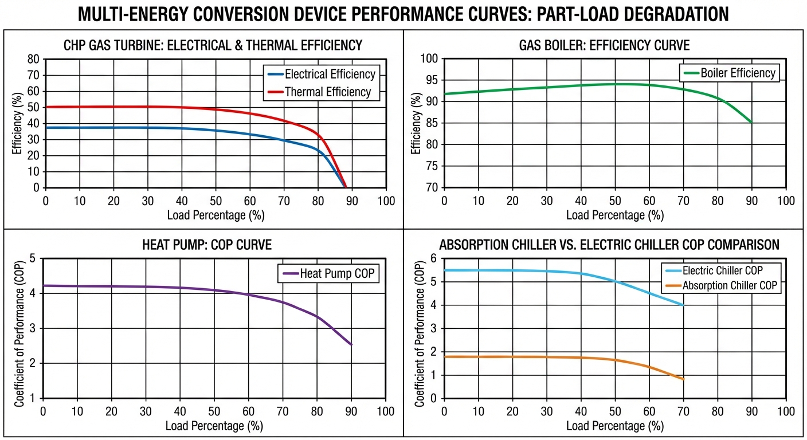

# 第 2 章：多能转换设备建模

> 在上一章中，我们通过 Energy Hub 耦合矩阵模型建立了综合能源系统的宏观分析框架。本章将深入系统的物理核心，聚焦于实现多源能量相互转化的关键设备，建立精确的变工况效率模型。

## 2.1 本章导读与学习目标

综合能源系统（Integrated Energy System, IES）的整体能效与经济性能，最终取决于网络中各能量转换设备在不同负荷率、不同环境条件下的实际运行效率。在传统的系统规划与初步设计阶段，工程人员常采用设备的"额定效率"（Nominal Efficiency）或"铭牌参数"进行静态估算。然而，这种假设仅代表设备在满负荷及标定工况下的理想状态。在实际动态运行中，受终端电、热、冷负荷时序波动的影响，多能转换设备频繁处于部分负荷（Part-load）或变工况状态，其运行效率往往显著偏离标称值。如果调度模型忽略这种非线性衰减特性，将导致理论优化结果在实际执行时产生巨大的偏差，甚至得出完全违背物理规律的调度指令。

本章致力于打破"恒定效率"的理想化假设，建立涵盖热电联产（CHP）燃气轮机、燃气锅炉、电驱热泵、吸收式制冷机和电压缩制冷机五类核心设备的高精度变工况数学模型。通过引入部分负荷特性曲线与热力学机制分析，为后续的系统仿真与优化调度提供坚实的底层物理约束。

**学习目标：**
1. 深入掌握微型燃气轮机（CHP）的电效率与热效率随负荷率非线性变化的物理规律及其数学描述方法。
2. 从热力学循环角度，理解电驱热泵、电压缩制冷机与吸收式制冷机在部分负荷下性能系数（COP）衰减的内部机理。
3. 熟悉多能转换设备静态非线性模型的构建流程，掌握利用分段线性化（Piecewise Linearization）技术将非线性效率曲线转化为混合整数线性规划（MILP）适用约束的方法。
4. 能够基于给定参数独立完成多种设备部分负荷特性的仿真验证，并具备对仿真结果进行深度物理诠释的能力。

## 2.2 多能转换设备建模基础理论

在对具体设备进行详细建模之前，有必要明晰综合能源系统中设备建模的方法论。根据建模的颗粒度与物理机制的深度，设备模型通常可分为"白盒模型"（机理模型）、"黑盒模型"（数据驱动模型）与"灰盒模型"（半经验模型）。

### 2.2.1 建模方法论分类

1. **白盒模型（机理模型）**：基于热力学第一定律（能量守恒）与第二定律（熵增原理）、流体力学以及传热学基本方程构建。此类模型参数众多，通常包含大量的微分代数方程（DAEs），能够精确地反映设备内部的温度、压力、流量等状态变量分布。但由于计算复杂度高，难以直接嵌入到系统级的长时间尺度优化调度模型中。
2. **黑盒模型（数据驱动模型）**：完全忽略设备内部的物理过程，仅通过大量的实验或运行数据，利用机器学习（如人工神经网络、支持向量机）拟合设备输入能源与输出能源之间的映射关系。其优点是计算速度快，但泛化能力弱，一旦超出训练数据范围，预测结果可能严重失真，且缺乏物理可解释性。
3. **灰盒模型（半经验模型）**：在综合能源系统调度与规划领域应用最广。该方法保留了设备输入输出之间的宏观能量守恒结构，同时利用经验多项式或拟合曲线来表征复杂的非线性损耗规律。本章所采用的"部分负荷特性模型"即属于典型的灰盒模型。

### 2.2.2 广义能量转换方程

对于任意一个多能转换设备 $i$，假设其消耗输入能源载体集合为 $\mathcal{E}_{in}$，产出输出能源载体集合为 $\mathcal{E}_{out}$。基于热力学第一定律的稳态能量平衡可表示为：
$$
\sum_{e \in \mathcal{E}_{out}} P_{i, e}^{out} (t) = \sum_{e \in \mathcal{E}_{in}} \left( P_{i, e}^{in} (t) \cdot \eta_{i, e}^{conversion} (PLR_{i}(t), \Theta_{env}(t)) \right) - P_{i}^{loss}(t)
$$
式中，$P_{i, e}^{out} (t)$ 与 $P_{i, e}^{in} (t)$ 分别表示设备 $i$ 在 $t$ 时刻输出和输入的能源功率；$\eta_{i, e}^{conversion}$ 为能量转换效率或性能系数，它是一个非线性函数，高度依赖于设备当前的部分负荷率 $PLR_{i}(t)$ 以及环境状态参量 $\Theta_{env}(t)$（如环境温度、冷却水温度等）；$P_{i}^{loss}(t)$ 为向环境散失的无法回收的废热或机械损耗。

部分负荷率 $PLR_{i}(t)$ 的一般定义为设备当前实际输出功率与设备额定设计功率（铭牌功率）之比：
$$
PLR_{i}(t) = \frac{P_{i}^{out}(t)}{P_{i, nominal}^{out}} \times 100\%
$$
显然，$PLR_{i}(t) \in [0, 1]$。当 $PLR_{i}(t)=1$ 时，设备处于满负荷（额定）运行状态。

## 2.3 热电联产（CHP）机组数学建模

热电联产设备是综合能源系统实现能源梯级利用的核心。本文以微型燃气轮机（Micro Gas Turbine, MGT）为代表展开讨论。

### 2.3.1 物理原理与热力学特性

微型燃气轮机基于布雷顿循环（Brayton Cycle）工作，主要部件包括压气机、回热器、燃烧室和透平膨胀机。天然气在燃烧室中与压缩空气混合燃烧，产生的高温高压燃气推动透平做功，带动发电机发电。透平排出的高温尾气（通常在 250°C~300°C 之间）通过余热回收锅炉（Heat Recovery Steam Generator, HRSG）或换热器转化为可用的热能（蒸汽或热水），供给终端热负荷或驱动吸收式制冷机。

在额定工况下，由于存在各种不可逆损失（如流动阻力损失、换热温差损失、机械摩擦等），燃料的化学能仅有 25%~35% 转化为电能，约 40%~50% 被回收为热能，剩余约 15%~25% 以排烟热损失和机体散热的形式散失。

### 2.3.2 变工况效率数学模型

当系统电负荷或热负荷需求降低时，CHP 机组必须降低出力，进入部分负荷运行状态。此时，压气机转速下降，压比偏离设计点，空气流量和燃气初温降低，导致内部空气动力学损失急剧增加，从而引发电效率 $\eta_e$ 的显著下降。

为了在调度模型中准确表征这一现象，通常采用燃气消耗量关于电功率的三阶多项式拟合模型。令 $P_{e, CHP}(t)$ 为 $t$ 时刻的电功率输出，$F_{CHP}(t)$ 为天然气消耗功率（基于低位发热量 LHV 计算），其关系可表示为：
$$
F_{CHP}(t) = a_0 + a_1 P_{e, CHP}(t) + a_2 P_{e, CHP}^2(t) + a_3 P_{e, CHP}^3(t)
$$
式中，$a_0, a_1, a_2, a_3$ 为通过设备出厂数据或现场运行数据拟合得到的特性系数。此时，设备在任意电功率下的瞬时电效率可表示为：
$$
\eta_{e, CHP}(t) = \frac{P_{e, CHP}(t)}{F_{CHP}(t)} = \frac{P_{e, CHP}(t)}{a_0 + a_1 P_{e, CHP}(t) + a_2 P_{e, CHP}^2(t) + a_3 P_{e, CHP}^3(t)}
$$

与电效率的剧烈衰减不同，CHP 的热效率 $\eta_{h, CHP}$ 在部分负荷下相对稳定，甚至在特定区间内会有微小的提升。这是因为虽然燃气总流量减少，但在余热回收器的换热面积保持不变的情况下，尾气在换热器内的停留时间增加，换热温差更为充分，使得余热回收效率有所保障。热功率 $Q_{h, CHP}(t)$ 与天然气消耗量的关系可表示为：
$$
Q_{h, CHP}(t) = F_{CHP}(t) \cdot \eta_{h, CHP}(PLR_{CHP})
$$
综合总效率 $\eta_{total}$ 为电效率与热效率之和：
$$
\eta_{total}(PLR_{CHP}) = \eta_{e, CHP}(PLR_{CHP}) + \eta_{h, CHP}(PLR_{CHP})
$$

### 2.3.3 运行约束条件

CHP 机组的运行除满足能量转换方程外，还受限于爬坡率和运行边界约束：
$$
u_{CHP}(t) P_{e, CHP}^{\min} \le P_{e, CHP}(t) \le u_{CHP}(t) P_{e, CHP}^{\max}
$$
$$
-R_{CHP}^{down} \le P_{e, CHP}(t) - P_{e, CHP}(t-1) \le R_{CHP}^{up}
$$
其中，$u_{CHP}(t) \in \{0, 1\}$ 为机组启停状态变量；$P_{e, CHP}^{\min}$ 为最小稳定运行负荷（通常设定为额定功率的 20%~30%）；$R_{CHP}^{down}$ 与 $R_{CHP}^{up}$ 分别为向下和向上爬坡速率限制。

## 2.4 供热与制冷设备数学建模

### 2.4.1 燃气锅炉模型

燃气锅炉是 IES 中最为基础的热源补给设备。其能量转换方程为：
$$
Q_{GB}(t) = F_{GB}(t) \cdot \eta_{GB}(PLR_{GB})
$$
现代冷凝式锅炉在较宽的负荷范围内能够保持较高的燃烧效率，其部分负荷特性曲线相对平缓。一般采用二次多项式拟合锅炉效率：
$$
\eta_{GB}(PLR_{GB}) = \eta_{GB, nom} \left( d_0 + d_1 PLR_{GB} + d_2 PLR_{GB}^2 \right)
$$

### 2.4.2 电驱热泵模型

电驱热泵通过消耗少量的电能，驱动压缩机实现逆卡诺循环，从低品位热源中吸取热量，并向高温侧释放高品位热能。其制热功率与输入电功率的关系由性能系数 $COP_{HP}$ 决定：
$$
Q_{HP}(t) = P_{HP}(t) \cdot COP_{HP}(PLR_{HP}, T_{evap}, T_{cond})
$$
理想情况下，卡诺循环的 $COP$ 由蒸发温度 $T_{evap}$ 和冷凝温度 $T_{cond}$ 决定（采用开尔文温度）：
$$
COP_{Carnot} = \frac{T_{cond}}{T_{cond} - T_{evap}}
$$
实际设备由于压缩机等熵效率、换热器传热温差以及管道节流损失，其实际 $COP$ 远低于卡诺极限。定义热力学完善度 $\psi \in (0.3, 0.6)$，则额定工况下：
$$
COP_{HP, nom} = \psi \cdot \frac{T_{cond}}{T_{cond} - T_{evap}}
$$
在部分负荷下，定频热泵由于需要频繁启停压缩机，启动瞬态损失导致 $COP$ 显著下降。部分负荷下的 $COP$ 校正公式可表示为：
$$
COP_{HP}(PLR_{HP}) = COP_{HP, nom} \cdot f_{HP}(PLR_{HP})
$$
其中 $f_{HP}(PLR_{HP})$ 通常为关于 $PLR_{HP}$ 的二次或三次经验方程。

### 2.4.3 吸收式制冷机模型

吸收式制冷机利用热能驱动，采用溴化锂-水（LiBr-H₂O）溶液作为工质对。制冷量与消耗热量之间的关系为：
$$
Q_{c, AC}(t) = Q_{h, AC}(t) \cdot COP_{AC}(PLR_{AC})
$$
单效溴化锂吸收式制冷机的额定 $COP$ 一般在 0.7 左右。在部分负荷时，溶液循环量和换热效果偏离最佳设计点，导致 $COP$ 呈现单调递减趋势。

### 2.4.4 电压缩制冷机模型

电压缩制冷机的工作原理与电驱热泵类似，仅是目的在于从低温端获取冷量。其能量转换关系为：
$$
Q_{c, EC}(t) = P_{EC}(t) \cdot COP_{EC}(PLR_{EC})
$$

## 2.5 仿真案例：五类设备部分负荷特性联合仿真

### 2.5.1 仿真设置与参数选择依据

在仿真中，选取微型燃气轮机、冷凝式燃气锅炉、变频空气源热泵、单效溴化锂吸收式制冷机和离心式电压缩制冷机作为研究对象。

**参数选择依据：**
- **微型燃气轮机**：设定满负荷额定电效率为 35.0%，满负荷热效率为 45.0%。此参数参考了典型的 600kW 级 MGT 商业产品。
- **燃气锅炉**：采用现代冷凝锅炉参数，满载效率设为 92.0%。
- **电驱热泵**：设定额定 $COP = 3.50$（匹配典型供暖季工况）。
- **吸收式制冷机与电压缩制冷机**：分别设定满载 $COP = 0.70$（单效）与 $COP = 5.00$（离心式标况）。

对五类设备在 10%~100% 负荷范围内扫描效率/COP，生成部分负荷特性曲线。

**仿真代码**：`assets/ch02/ch02_device_models.py`

### 2.5.2 仿真结果

**关键负荷点效率/COP 对比：**

| Load (%) | CHP Elec Eff | CHP Heat Eff | CHP Total Eff | Boiler Eff | HP COP | Abs Chiller COP | Elec Chiller COP |
|:---------|:-------------|:-------------|:--------------|:-----------|:-------|:----------------|:-----------------|
| 25 | 0.218 | 0.399 | 0.617 | 0.851 | 2.71 | 0.489 | 4.06 |
| 50 | 0.263 | 0.417 | 0.680 | 0.874 | 2.98 | 0.561 | 4.38 |
| 75 | 0.305 | 0.433 | 0.738 | 0.896 | 3.23 | 0.628 | 4.68 |
| 100 | 0.350 | 0.450 | 0.800 | 0.920 | 3.50 | 0.700 | 5.00 |

### 2.5.3 结果深度分析与物理解释

从上述仿真结果及特征曲线中，可以提取出以下物理机制和运行规律：

1. **CHP 效率劣化的双重不对称性**：当负荷率从 100% 降至 25% 时，CHP 的电效率从 0.350 锐减至 0.218（相对下降幅度高达 37.7%）。这种剧烈衰减源于燃气轮机压气机偏离设计工况点，导致气动效率骤降。然而，同期热效率仅从 0.450 降至 0.399（相对降幅约 11.3%）。热效率的"抗跌性"是因为即使排气温度下降，余热回收锅炉内工质依然能进行有效换热。综合效率从 25% 负荷的 61.7% 提升到满负荷的 80.0%。这意味着 CHP 在低负荷下的运行不经济，其单位发电成本可能高于直接从电网购电，这构成了优化调度中设置"最小运行启停边界"的直接物理原因。

2. **锅炉的平稳特性**：燃气锅炉的效率在整个扫描区间内表现出极强的平稳性（0.851~0.920）。这在运行策略上赋予了燃气锅炉作为"深度调峰"和"兜底补热"设备的绝佳属性——它可以在较低负荷下灵活运转而不用担心巨大的效率惩罚。

3. **两类制冷机理的博弈**：虽然电压缩制冷机在绝对 $COP$ 数值上（4.06~5.00）远高于吸收式制冷机（0.489~0.700），但本质区别在于能源品位：电压缩机消耗的是高品位电能，而吸收式制冷机消耗的是低品位热能（往往是 CHP 产生的废热）。在夏季制冷高峰期，若直接开启吸收机消耗废热，其制冷边际成本接近零；只有当废热不足时，才应启停高 $COP$ 的电制冷机补足冷量缺口。

### 2.5.4 仿真代码解读

本节仿真脚本（`assets/ch02/ch02_device_models.py`）采用统一的负荷率扫描法构建五类设备的部分负荷性能曲线。算法首先将负荷率设为 10%~100% 的 50 个均匀离散点，然后对每个负荷率分别计算 CHP 电效率、CHP 热效率、燃气锅炉效率、热泵 COP、吸收式制冷 COP 和电压缩制冷 COP，最后在 25%、50%、75%、100% 四个关键工况点抽样输出至数据表格。

建模思想统一为"额定值 $\times$ 负荷修正系数"的形式。CHP 电效率由 `eta_chp_e_full=0.35` 乘以线性修正因子 `(0.5+0.5*load_frac)` 得到，该因子在 10% 负荷时仅为 0.55，反映了低负荷下电效率的剧烈衰减；CHP 热效率由 `eta_chp_h_full=0.45` 乘以 `(0.85+0.15*load_frac)`，修正范围更窄（0.865~1.0），体现了余热回收的相对稳定性。锅炉效率 `0.92*(0.9+0.1*load_frac)` 表征冷凝锅炉在宽负荷区间的高效与平稳。热泵以 $COP=3.5$ 为基准，通过 `(0.7+0.3*load_frac)` 修正，反映启停损耗与压缩机偏离最优工作点的影响。吸收式制冷与电压缩制冷分别以 0.70 和 5.0 为基准值，采用类似的线性修正结构。

脚本输出与正文数据表的对应关系十分清晰：终端打印的 KPI 表和写入的 `device_table.md`（列名从 Load(%) 到 Elec Chiller COP）就是本节"关键负荷点效率/COP 对比"表的直接数据源；保存的 `device_models_sim.png` 对应上方的综合曲线图。

读者做敏感性实验时，建议修改以下四类参数：（1）额定参数（0.35、0.45、0.92、3.5、0.70、5.0），用于比较不同品牌或代际的设备差异；（2）负荷修正斜率（如 0.5/0.5、0.85/0.15 等系数），用于模拟不同控制策略和机组品质对衰减曲线的影响；（3）负荷扫描范围与步长（如改为 20%~100% 或增加采样密度），检验离散化精度的影响；（4）将热泵和制冷机 COP 扩展为"负荷 + 环境温度"的二维函数，观察气象耦合对调度结论的影响。

## 2.6 设备模型的非线性处理与工程应用

在前面的讨论中，我们获得了高精度的非线性多项式效率曲线。然而，主流的综合能源系统调度通常建立在混合整数线性规划（MILP）框架下。直接将高阶多项式引入调度模型，会导致问题转变为混合整数非线性规划（MINLP），大幅增加求解难度。

因此，工程中需要对非线性的能耗曲线进行分段线性化（Piecewise Linear Approximation）处理。假设输入能源 $F$ 与输出功率 $P$ 的非线性关系为 $F = g(P)$。将设备的运行区间 $[P^{\min}, P^{\max}]$ 划分为 $K-1$ 个线段，产生 $K$ 个断点：$(P_1, F_1), (P_2, F_2), \dots, (P_K, F_K)$。

引入一组连续的权重变量 $\lambda_k (t) \in [0, 1], \forall k=1, \dots, K$，利用特殊有序集类型2（SOS2）变量进行约束表达：
$$
P(t) = \sum_{k=1}^K \lambda_k(t) P_k, \quad F(t) = \sum_{k=1}^K \lambda_k(t) F_k, \quad \sum_{k=1}^K \lambda_k(t) = u(t)
$$
式中，$u(t)$ 为设备在时刻 $t$ 的启停状态。SOS2 变量的定义强制要求在任意时刻最多只能有两个相邻的元素非零。

通过这种分段线性化处理，成功地将复杂的变工况效率劣化现象嵌入到了线性规划框架中。忽略部分负荷特性，粗暴地采用恒定额定效率进行优化，往往会导致系统给 CHP 下达长期在低效区间运行的指令，使实际能耗偏差超过 15%。

## 2.7 本章小结

本章从热力学基本定律出发，系统性地构建了综合能源系统中关键能量转换设备（微型燃气轮机、燃气锅炉、电驱热泵及两类制冷机）的稳态能效模型。重点剖析了设备在部分负荷运行状态下效率或 $COP$ 非线性衰减的物理机理，并通过多项式拟合给出了定量的数学表达。联合仿真结果直观验证了不同能源装备在降负荷过程中表现出的差异化特性，为调度约束中的最小运行区间设定提供了依据。此外，引入的 SOS2 分段线性化技术，搭建了底层复杂物理模型与顶层线性规划算法之间的桥梁。设备转换效率仅决定了系统瞬间能量流转的代价，而系统时间维度上的灵活性，则依赖于管网的热惯性与储能设备——下一章将引入这些动态特性。

## 2.8 思考与练习

1. **简答题**：简述"额定效率"与"部分负荷效率"在综合能源系统建模中的本质区别，并举例说明如果完全采用额定效率进行系统调度，可能带来哪些负面的工程后果？
2. **机理分析**：请结合布雷顿热力学循环的基本原理，详细解释为何微型燃气轮机（CHP）在降低负荷时，其电效率的下降幅度显著大于热效率的下降幅度？
3. **计算题**：某综合能源园区的一台燃气轮机标称最大发电功率为 $800\text{ kW}$。已知其消耗的天然气功率（基于低位热值计算，单位 $\text{kW}$）与电输出功率 $P_e$ 之间满足二次关系模型：$F_{CHP} = 0.0004 P_e^2 + 1.8 P_e + 200$。
   - (1) 计算该燃气轮机在满负荷（$100\%$）和部分负荷（$40\%$）下的电输出功率和天然气消耗量。
   - (2) 分别计算这两种工况下的瞬时电效率 $\eta_e$。
   - (3) 如果调度系统错误地假设全区间保持满负荷时的效率，请计算在 $40\%$ 负荷运行时，由于模型不准确导致的每小时天然气消耗量误差（单位 kWh）。
4. **建模题**：基于第 3 题的二次能耗函数，若要求将其引入线性规划调度模型，且燃气轮机的运行区间限定在 $[240\text{ kW}, 800\text{ kW}]$。请选择 3 个断点对其进行分段线性化处理，写出利用 SOS2 变量 $\lambda_1, \lambda_2, \lambda_3$ 表征电功率和燃料消耗量的完整线性约束方程组。
5. **综合拓展**：本章仅讨论了部分负荷率对电驱热泵 $COP$ 的影响。在实际北方地区寒冷冬季，环境空气温度的急剧下降会同时改变热泵的制热能力和效率。试查阅相关文献，尝试写出一个同时耦合了 $PLR$ 和环境温度 $T_{ambient}$ 的热泵 $COP$ 二元经验数学模型形式，并讨论这种气象耦合对 IES 日前调度的影响。

---

**拓展视野**：部分负荷效率曲线是所有旋转机械的共性特征。水泵在不同转速和流量下同样呈现非线性效率变化，其相似律 $H \propto n^2$, $Q \propto n$ 与本章的设备特性建模方法一脉相承。在水利工程中，泵站的变频调速节能优化所依赖的数学模型与 CHP 的部分负荷建模高度相似。

## 参考文献
[1] Chicco G, Mancarella P. Distributed Multi-Generation: A Comprehensive View[J]. Renewable and Sustainable Energy Reviews, 2009, 13(3): 535-551.

[2] Lozano M A, Ramos J C, Serra L M. Cost Optimization of the Design of CHCP (Combined Heat, Cooling and Power) Systems under Legal Constraints[J]. Energy, 2010, 35(2): 794-805.

[3] Cho H, Smith A D, Mago P. Combined Cooling, Heating and Power: A Review of Performance Improvement and Optimization[J]. Applied Energy, 2014, 136: 168-185.
