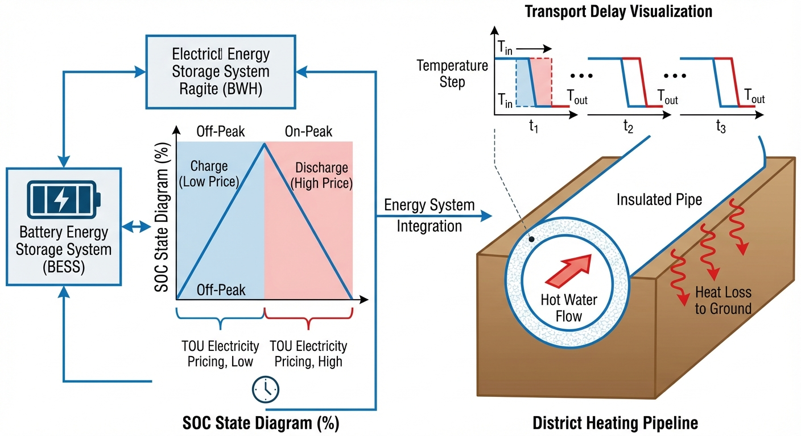
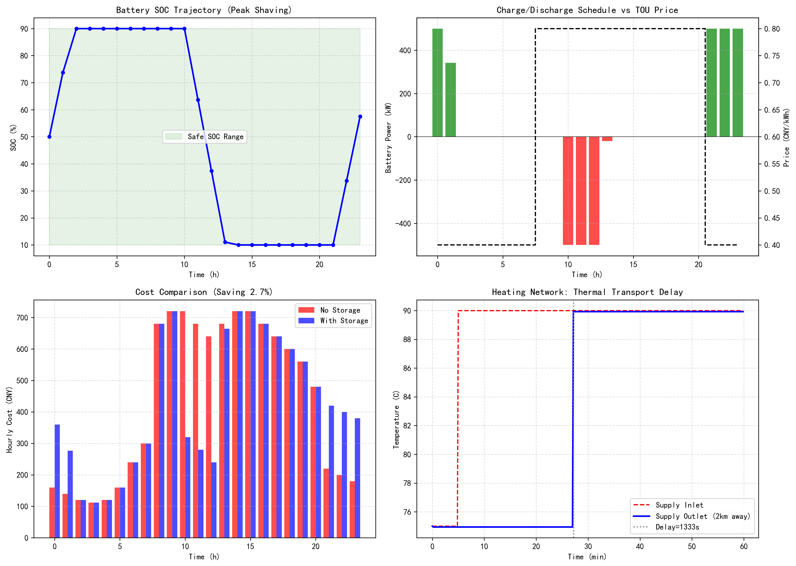

# 第 3 章：储能与管网时空动态建模

> 在上一章中，我们建立了多能转换设备的稳态效率模型。本章将突破稳态分析的局限，引入能量在时间维度上的存储转移和在空间维度上的管网传输，构建完整的时空动态约束体系。

## 3.1 本章导读与学习目标

在上一章探讨了多能设备的稳态能量转换机理与非线性效率曲线之后，我们已经掌握了综合能源系统中各个独立物理节点的能量耦合与转换特性。然而，真实的物理系统不仅涉及多能流在节点上的即时转换，还不可避免地包含能量在时间维度上的转移（滞留）与在空间维度上的输运。综合能源系统（IES）的高阶动态特性由两类子系统主导：一是储能设备（如电化学电池、蓄热罐）的充放能状态转移过程，它打破了传统电网"即发即用"的瞬时平衡刚性约束；二是流体管网（如区域热力管网、天然气管网）的流体动力学传输延时与能量沿程损耗，它决定了空间能量调度的响应边界。本章将分别建立电池储能的离散时间状态空间模型和区域供热管网的热力传输模型，为后续的系统级优化调度提供严谨的时空维度动态约束。

**学习目标：**
1. 掌握能量在时间维度的转移机理，建立完整的电池储能荷电状态（SOC）状态方程，并理解充放电效率对系统经济性的影响。
2. 突破稳态网络模型的局限，掌握流体供热管网空间维度的动态特征，推导管网的水力传输延时与沿程热损失方程。
3. 掌握将复杂非线性动态约束转化为混合整数线性规划（MILP）标准形式的基本技巧。
4. 通过储能削峰填谷与管网热响应综合仿真案例，量化分析储能的经济套利价值及其可能引发的二次负荷冲击现象。

## 3.2 电池储能状态空间模型与动态约束

储能系统是实现综合能源系统供需双侧时间解耦的核心装备。以目前应用最广泛的锂离子电池为例，构建其面向系统级调度的宏观能量状态演化模型。

### 3.2.1 荷电状态（SOC）的连续与离散状态方程

电池荷电状态（State of Charge, SOC）被定义为当前电池内部可用总能量与电池额定最大容量的比值。在连续时间域下，考虑电池固有自放电现象，SOC 的一阶常微分控制方程可表示为：

$$
\frac{d \text{SOC}(t)}{dt} = \frac{1}{E_{cap}} \left( \eta_{ch} P_{ch}(t) - \frac{P_{dis}(t)}{\eta_{dis}} \right) - \sigma \cdot \text{SOC}(t)
$$

式中，$E_{cap}$ 为电池的额定能量容量（kWh）；$P_{ch}(t)$ 和 $P_{dis}(t)$ 分别为 $t$ 时刻的充电功率和放电功率（kW）；$\eta_{ch}$ 和 $\eta_{dis}$ 分别代表充电和放电的能量转换效率，其物理意义在于克服电池内阻发热和极化效应带来的能量耗散；$\sigma$ 为自放电衰减率系数。

在计算机离散化仿真中，采用零阶保持器（ZOH）方法，假设在采样时间步长 $\Delta t$ 内功率保持恒定。忽略较小的自放电率（令 $\sigma \approx 0$），得到标准的离散时间状态方程：

$$
SOC(k+1) = SOC(k) + \frac{\eta_{ch} \cdot P_{ch}(k) \cdot \Delta t}{E_{cap}} - \frac{P_{dis}(k) \cdot \Delta t}{\eta_{dis} \cdot E_{cap}}
$$

### 3.2.2 储能系统的关键运行与物理约束

**（1）容量安全区间约束**

为避免深度充放电对锂离子电池的不可逆损伤，SOC 的安全运行区间通常被严格限制：
$$
SOC_{min} \le SOC(k) \le SOC_{max}
$$
通常取 $SOC_{min} = 0.1$，$SOC_{max} = 0.9$。

**（2）充放电功率与互斥约束**

在任何一个物理时刻，电池不可能既充电又放电。这种非线性互斥逻辑 $P_{ch}(k) \cdot P_{dis}(k) = 0$ 通过引入 0-1 布尔状态变量和 Big-M 法转化为线性不等式：

$$
0 \le P_{ch}(k) \le P_{ch}^{max} \cdot u_{ch}(k)
$$
$$
0 \le P_{dis}(k) \le P_{dis}^{max} \cdot u_{dis}(k)
$$
$$
u_{ch}(k) + u_{dis}(k) \le 1
$$

**（3）调度周期能量守恒约束**

为保证连续多日运行的可持续性，通常要求完整调度周期结束后 SOC 恢复到初始水平：
$$
SOC(0) = SOC(T)
$$

### 3.2.3 削峰填谷的经济驱动模型

储能削峰填谷策略的核心逻辑基于峰谷电价差套利。假设 $c(k)$ 为电网在时段 $k$ 的分时电价，则与储能直接相关的收益可抽象为：

$$
\max \text{Revenue} = \sum_{k=1}^{T} \left[ c(k) P_{dis}(k) \Delta t - c(k) P_{ch}(k) \Delta t \right]
$$

受制于效率 $\eta < 1$，仅当峰时电价与谷时电价的比例越过临界点（$c_{peak} > c_{valley} / (\eta_{ch}\eta_{dis})$）时，套利行为才能产生正向收益。

## 3.3 供热管网热力时空传输模型

与电网中电磁波以接近光速传播不同，区域供热管网的能量传输依赖于载能介质（热水或蒸汽）的宏观物理流动，具有不可忽略的流体力学惯性和热力学延时。

### 3.3.1 管网质量传输与水力延时推导

对于内径为 $D$、长度为 $L$ 的保温管道，当管内水流速 $v$ 为常数时，传输延时（Transport Delay）$\tau_d$ 定义为流体质点穿过整条管道所需的时间：
$$
\tau_d = \frac{L}{v} = \frac{2000}{1.5} \approx 1333 \text{ s} \approx 22.2 \text{ min}
$$

这长达 20 分钟量级的纯时间滞后项，是导致热能调度与电能调度无法完全同步的关键物理阻碍。

### 3.3.2 管道传热学模型与热损失推导

基于能量守恒定律，管道内微元体的一维瞬态对流-扩散偏微分方程可写为：

$$
\rho c_p A \frac{\partial T(x,t)}{\partial t} + \rho c_p A v \frac{\partial T(x,t)}{\partial x} = - U_{loss} \pi D (T(x,t) - T_{ground})
$$

在稳态运行工况下（$\frac{\partial T}{\partial t} = 0$），偏微分方程退化为一阶常微分方程，求解可得管道出口温度：

$$
T_{out} = T_{ground} + (T_{supply} - T_{ground}) \exp\left( - \frac{U_{loss}' \cdot L}{\dot{m} \cdot c_p} \right)
$$

由于现代区域供热管网保温材料性能优越且流量巨大，指数项极小，利用泰勒展开 $e^{-x} \approx 1 - x$ 线性化后，温度降的工程计算公式为：

$$
\Delta T = \frac{U_{loss} \cdot L \cdot (T_{supply} - T_{ground})}{\dot{m} \cdot c_p}
$$

## 3.4 仿真案例：储能削峰填谷与管网热响应

### 3.4.1 仿真设置与核心参数选择依据

- **电池物理参数**：选用额定容量 2000 kWh、最大充放电功率 500 kW 的磷酸铁锂电池集装箱。此参数代表了储能行业标准的 0.25C 倍率系统（即以最大功率连续运行需要 4 小时充满或放空）。充放电单向效率设定为 95%（对应循环往返效率约为 90.25%）。初始 SOC = 50%。
- **管网参数**：主干线长度 $L$ = 2000 m，管道内径 $D$ = 0.5 m，设计流速 $v$ = 1.5 m/s，综合线传热系数 $U_{loss}$ = 0.5 W/(m·K)。
- **分时电价**：峰时 0.8 元/kWh（8:00-20:00），谷时 0.4 元/kWh。

**仿真代码**：`assets/ch03/ch03_storage_network.py`

### 3.4.2 仿真结果

**储能经济性与管网动态参数：**

| Metric | No Storage | With Storage |
|:-------|:-----------|:-------------|
| Daily Cost (CNY) | 10472 | 10193 |
| Cost Saving (%) | - | 2.7 |
| Peak Demand (kW) | 900 | 1050 |
| Pipe Transport Delay (s) | - | 1333 |
| Pipe Temp Drop (C) | - | 0.07 |

### 3.4.3 结果的物理解释与深度分析

**1. 经济效益的来源解析**

引入储能系统后，园区的日综合运行成本从 10472 元下降至 10193 元，实现净节省 279 元（降幅 2.7%）。这一经济价值完全来自于跨时间尺度的能量搬移：在夜间谷电时刻（0.4 元/度）吸纳低价电能，扣除约 9.75% 的充放电双向能量损耗后，在白天峰时段（0.8 元/度）释放高价值电能。

**2. "反向增加峰值"的二次冲击悖论**

需特别警惕的是：加入储能后，园区的最大物理负荷从 900 kW 恶化到 1050 kW。这种反常现象在于：储能控制器为追求套利最大化，在夜间低价时段以满功率（500 kW）充电，与原有基础负荷叠加后制造了超越白天原有峰值的"人造新高峰"。这说明单纯的套利策略不一定具有削峰效果——若同时追求削峰和套利，需要在优化目标中加入需量电费项。

**3. 热力管网的参数响应剖析**

1333 秒（约 22.2 分钟）的传输延时意味着热源侧的供温调节需要提前约 20 分钟执行，才能使用户侧在目标时刻感受到温度变化。管道温降仅 0.07°C，得益于大流量（约 294 kg/s）和良好保温——现代大口径热网在短距离内可近似视为无损耗的"虚拟蓄热罐"。

### 3.4.4 仿真代码解读

本节仿真脚本（`assets/ch03/ch03_storage_network.py`）将系统拆分为两个可耦合但独立求解的模块。

**模块一：电池储能状态空间仿真。** 脚本首先按分时电价构造启发式调度策略——低价时段（0.4 元/kWh）以最大功率 `P_max=500 kW` 充电，高价时段（0.8 元/kWh，且 `i>=10`）以最大功率放电。然后用 SOC 递推式 `SOC(k+1) = SOC(k) + P*eta*dt/E_cap`（放电时除以 `eta_dis`）进行逐时步仿真，SOC 在 0.1~0.9 之间裁剪，同时反算功率以保证边界可行。最后将净负荷 `base_load + P_batt` 乘以电价得到有/无储能两种场景的逐时成本。

**模块二：供热管网延迟-损耗模型。** 脚本首先由 `L/v` 计算运输延迟（2000m / 1.5m/s = 1333s），然后用 `m_dot = rho*pi*(D/2)^2*v` 求质量流量（约 294.5 kg/s），并按 `DeltaT = U*L*(T_in - T_ground)/(m_dot*cp)` 估算沿程温降，以此得到出口温度对入口 75→90°C 阶跃输入的延迟响应曲线。

关键参数的物理含义：`E_cap=2000 kWh` 与 `P_max=500 kW` 对应约 0.25C 倍率，适合削峰场景；`eta_ch=eta_dis=0.95` 对应锂电池常见的单程效率；`U_loss=0.5 W/(m·K)` 和 `T_ground=5°C` 对应冬季保温管道的近似条件。

脚本输出与正文表格的对应关系：终端打印的 `Daily cost without/with storage` 对应 `Daily Cost` 两列（10472/10193），`Cost saving` 对应 2.7%，`Peak demand` 对应 900/1050 kW，`Transport delay` 和 `Temperature drop` 分别对应 1333s 和 0.07°C；四子图 `storage_network_sim.png` 对应 SOC 轨迹、功率-电价联动、成本对比和供温延迟响应。

读者做敏感性实验时，可优先修改：（1）电价时段与价差，观察套利收益的临界条件；（2）`P_max/E_cap` 配比和 SOC 上下限，分析倍率对套利空间的约束；（3）`eta_ch/eta_dis` 充放电效率，寻找套利的盈亏平衡点；（4）管网侧 `pipe_length`、`flow_velocity`、`U_loss`、`T_ground`，观察末端温降和延迟对参数扰动的弹性。

## 3.5 工程启示

- **容量/功率配比（C-rate）主导套利上限**：储能额定容量与最大吞吐功率的配比决定了系统每天能搬移的能量规模。本案例中 0.25C 的配置限制了单小时套利量。对于以削峰填谷为主要收益来源的储能项目，2h-4h 的持续时长配置（对应 0.25C-0.5C）是当前主流方案。若需参与调频辅助服务，则需要更高的功率配比（1C-2C），但此时储能容量的利用率较低，商业模式需要调频里程补偿来支撑。
- **延时约束不可简化**：供热管网的传输延时是联合调度中不可忽略的核心约束，尤其在快速负荷变化场景下可能导致供需失配。本案例中 22 分钟的延时意味着：若用户侧在 8:00 出现采暖负荷突增，热源侧必须在 7:38 就开始加大供热量。这种"提前行动"的需求使得热力调度对负荷预测的准确性提出了更高要求。在实际工程中，管网运营商通常采用"预测+反馈"的双闭环策略——基于天气预报和历史数据预判未来 1-2 小时的热负荷变化趋势（前馈），同时监测用户侧回水温度的偏差进行在线修正（反馈）。
- **套利边界对效率高度敏感**：储能的经济性对峰谷电价差高度敏感。当价差低于充放电损耗（本例为 10%）时，储能套利将无利可图。具体而言，设峰电价为 $c_p$、谷电价为 $c_v$，往返效率为 $\eta_{rt} = \eta_{ch} \times \eta_{dis}$，则套利的盈亏平衡条件为 $c_p / c_v > 1 / \eta_{rt}$。当 $\eta_{rt} = 0.9$ 时，要求峰谷比大于 1.11；当 $\eta_{rt} = 0.8$（如铅酸电池）时，则要求峰谷比大于 1.25。这一分析为储能技术选型提供了直接的经济判据。
- **多能互补的协同潜力**：电储能和热储能（蓄热罐）在时间尺度上具有互补特性。电池响应快（毫秒级）但容量成本高，蓄热罐响应慢（分钟级）但容量成本低。在综合能源系统中，两者协同配置可以实现"电池管快、蓄热罐管慢"的分频调节策略，既满足电网的快速调频需求，又实现热负荷的经济调度。

## 3.6 本章小结

本章完成了从"稳态转换"到"时空维度动态演化"的思维跨越。在时间维度上，利用一阶常微分方程构建了电池储能的荷电状态（SOC）状态空间模型，并引入了 Big-M 法逻辑互斥约束，为刻画能量的时间平移奠定了基础；在空间维度上，深入剖析了流体传热偏微分方程，推导了区域热力管网的水力传输延时规律与沿程热损耗衰减公式。仿真案例通过量化数据揭示了单纯的经济套利策略可能引发"二次负荷高峰"的物理隐患。如何通过更高维度的数学规划手段平衡经济利益与系统安全——这正是下一章 MILP 经济调度的核心课题。

## 3.7 思考与练习

1. **概念简答题**：简述为何电力网络的分析通常采用代数方程组，而供热管网的分析必须使用偏微分方程或滞后代数方程？这种差异对综合能源系统的实时联合控制提出了哪些挑战？
2. **状态方程计算题**：某锂电池储能电站额定容量为 $10 \text{ MWh}$，最大充放电功率为 $2 \text{ MW}$。已知充电效率 $\eta_{ch} = 0.96$，放电效率 $\eta_{dis} = 0.94$，自放电率 $\sigma = 0.001 (\text{h}^{-1})$。若初始 SOC 为 50%，以 1.5 MW 恒定功率充电 2 小时后闲置 10 小时。请通过离散化状态方程（步长 $\Delta t = 1$ h），计算这 12 小时内每个时刻的 SOC 值。
3. **管网推导题**：从圆柱坐标系下微元管段的能量守恒原理出发，独立推导稳态下管道沿程温度的指数衰减解析解；并证明：当质量流量 $\dot{m} \to \infty$ 时，进出口温差 $\Delta T$ 的极限为多少？该结论有何物理意义？
4. **MILP 建模题**：针对本章仿真中揭示的"储能套利引发二次负荷激增"问题，请利用数学语言（变量集、目标函数、约束条件），编写一个同时考虑"分时电价收益最大化"和"最大需量电费约束"的优化调度模型，并将其线性化为标准 MILP 格式。
5. **敏感性分析题**：运行仿真脚本 `assets/ch03/ch03_storage_network.py`，将充放电效率从 95% 分别降至 85% 和 75%，记录日成本节省额的变化。计算使套利收益归零的临界效率值，并讨论该结果对储能技术选型的指导意义。

---

**拓展视野**：电池 SOC 的状态转移方程 $SOC_{k+1} = SOC_k \pm \eta \cdot P \cdot \Delta t / E_{cap}$ 与水库蓄水量的水量平衡方程 $V_{k+1} = V_k + (Q_{in} - Q_{out}) \cdot \Delta t$ 在数学形式上完全等价。两者都是带约束的积分型动态系统，均可用模型预测控制（MPC）进行最优调度。热力管网的传输延迟建模同样可类比长距离输水管道中的水锤波传播——两者都是流体在管道中的时空传输问题，只是载能介质从热水变成了冷水，关注的物理量从温度变成了压力。

## 参考文献
[1] Xu B, Oudalov A, Ulbig A, et al. Modeling of Lithium-Ion Battery Degradation for Cell Life Assessment[J]. IEEE Transactions on Smart Grid, 2018, 9(2): 1131-1140.

[2] Li P, Nord N, Ertesvag I S, et al. Integrated Multiscale Simulation of Combined Heat and Power Based District Heating System[J]. Energy Conversion and Management, 2015, 106: 337-349.

[3] Pirouti M, Bagdanavicius A, Ekanayake J, et al. Energy Consumption and Economic Analyses of a District Heating Network[J]. Energy, 2013, 57: 149-159.
