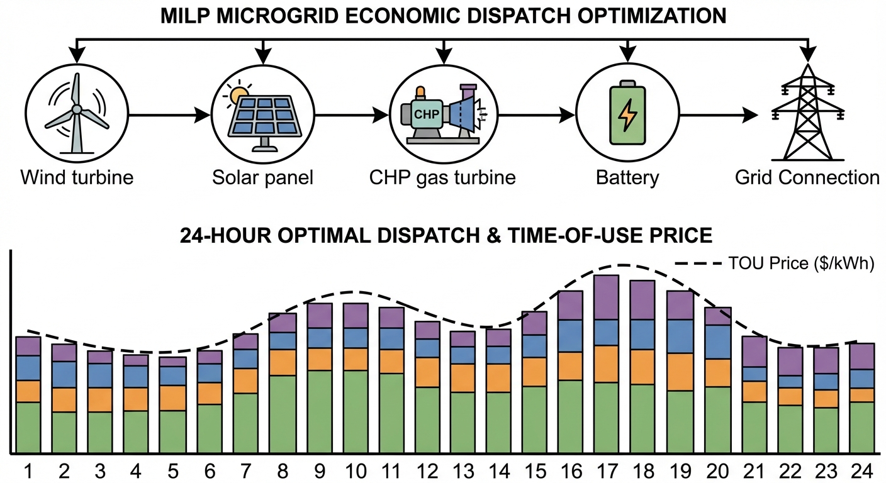
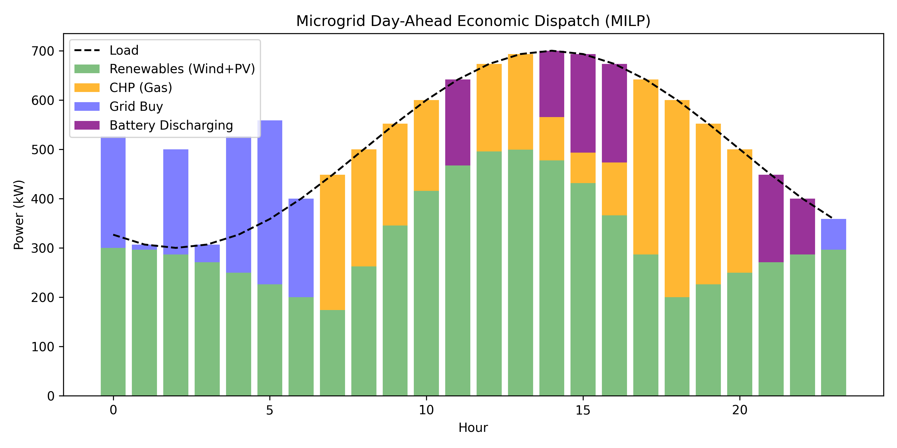

# 第 4 章：微电网日前经济调度优化

> 在上一章中，我们建立了储能设备与热力管网的动态模型，为系统级优化提供了时空维度的约束条件。本章将在此基础上，运用混合整数线性规划（MILP）方法，实现微电网多源设备的全局最优经济调度。

## 4.1 本章导读与学习目标

当一个微电网或综合能源系统（Integrated Energy System, IES）中集成了高渗透率的可再生能源（如风电、光伏）、具备高度调节能力的可控电源（如燃气轮机或热电联产机组 CHP）以及作为跨时段能量转移媒介的储能系统时，如何在 24 小时（日前）的时间尺度上，统筹规划各设备的最佳出力序列，以实现整体运行成本的最小化，是能源管理系统（Energy Management System, EMS）的核心功能，这也是本章所要解决的**日前经济调度（Day-Ahead Economic Dispatch, DAED）**问题。

本章将采用运筹学中经典的**混合整数线性规划（Mixed-Integer Linear Programming, MILP）**方法。与传统的连续变量非线性规划不同，微电网中大量存在着非连续的离散运行状态，例如 CHP 机组的启停机状态、储能系统的充放电状态互斥等。我们将详细剖析如何将这些非线性的逻辑状态和物理边界约束，通过引入 0-1 整数状态变量以及经典的 **Big-M 线性化技术**，严密地转化为标准的线性不等式组。最终，依托成熟的数学优化求解器（例如 scipy 中的 MILP 求解器模块，或工业级的 Gurobi、CPLEX），在数学上保证全局最优解的前提下，实现微电网调度的决策输出。

**学习目标：**
1. 深刻理解微电网日前经济调度的基本概念，掌握 MILP 调度模型中全局目标函数与多维系统约束条件的严密数学构建与推导方法。
2. 熟练掌握离散状态建模的核心技巧，特别是利用 0-1 辅助整数变量结合 Big-M 法处理机组启停约束、充放电互斥逻辑等非线性问题的线性化过程。
3. 通过典型风光储及 CHP 微电网的数值仿真案例，验证 MILP 优化算法的有效性，并深刻理解在分时电价（TOU）机制下，多能互补系统进行跨时段能量套利与削峰填谷的内在物理与经济机理。
4. 建立从底层物理系统特性提炼抽象数学模型，再到调用数值算法求解的完整现代电力系统工程研发思维闭环。

## 4.2 微电网日前经济调度优化理论基础

### 4.2.1 经济调度问题的历史与演进

经济调度是电力系统运行中最古老也是最核心的优化问题之一。其基本定义是：在满足系统负荷需求以及各种物理设备运行约束的前提下，在多个可控发电机组之间合理分配发电任务，使得整个系统的运行成本（主要为燃料成本或购电成本）降至最低。

早期电力系统中的经济调度主要关注火电机组之间的负荷分配，通过等微增率准则（Equal Incremental Cost Criterion）实现最优。随着电力市场化改革的推进和新能源的大规模接入，调度问题的复杂度发生了质的飞跃。调度对象从单纯的同步发电机扩展到了包含间歇性新能源、储能系统以及多能耦合设备（如 CHP 机组）的复杂系统。调度的时间尺度通常设定为"日前"（Day-Ahead），即提前一天制定未来 24 小时（通常以 1 小时为步长，共 24 个时段）的运行计划。

### 4.2.2 从 LP 到 MILP：离散决策的引入

在数学上，经济调度可以被抽象为一个受约束的优化问题。如果目标函数和所有的约束条件都可以表示为决策变量的线性组合，那么该问题即为**线性规划（Linear Programming, LP）**。然而，微电网中不可避免地涉及到离散决策：

1. **启停决策（Unit Commitment）**：发电机组要么处于运行状态（出力在某一下限与上限之间），要么处于停机状态（出力严格为零）。这种包含"断点"的运行区间无法用纯连续线性变量表达。
2. **状态互斥**：例如电池储能系统在同一时刻不能既充电又放电。

为了在优化框架内精确刻画这些特性，必须引入只能取 0 或 1 的**整数变量**。当一个线性规划问题中部分变量被强制要求为整数时，该问题便升级为**混合整数线性规划（MILP）**。

### 4.2.3 MILP 的求解理论与实践

MILP 虽然在计算复杂度上属于 NP-hard 问题，但得益于现代数学规划理论（如分支定界法 Branch-and-Bound、割平面法 Cutting Planes）及商用求解器的飞速发展，规模适中的微电网 24 小时 MILP 调度模型已经能够在毫秒到秒级的时间内稳定求得绝对的**全局最优解**。

分支定界法的基本思想是将含整数变量的问题逐步"松弛"为连续线性规划子问题（即允许整数变量取连续值），求得下界；同时通过分支（将某个整数变量固定为 0 或 1）生成子问题树，逐步收紧上界。当上下界之差小于容许间隙（MIP Gap）时，算法终止。对于本章规模的微电网问题（约 120 个决策变量，其中 72 个整数变量），现代求解器通常在毫秒量级即可完成搜索。这使得 MILP 成为当前学术界与工程界解决微电网能量管理问题的主流方法。

## 4.3 MILP 调度模型的严密数学构建

一个完整的 MILP 模型由三要素组成：决策变量、目标函数以及约束条件。设调度周期为一天，划分为 $T$ 个相等的离散时段，通常 $T=24$，步长 $\Delta t = 1 \text{ h}$。

### 4.3.1 决策变量的定义

在构建模型之前，需要明确所有待优化的决策变量。本章模型包含以下五组变量：

| 变量符号 | 物理含义 | 类型 | 维度 |
|:---------|:---------|:-----|:-----|
| $P_{\text{CHP}}(t)$ | CHP 机组发电功率 | 连续 | 24 |
| $P_{\text{grid}}(t)$ | 主网购电功率 | 连续 | 24 |
| $P_{\text{ch}}(t)$ | 储能充电功率 | 连续 | 24 |
| $P_{\text{dis}}(t)$ | 储能放电功率 | 连续 | 24 |
| $u(t)$ | CHP 启停状态 | 二进制 | 24 |

此外，充放电互斥约束还需引入辅助二进制变量 $I_{\text{ch}}(t)$ 和 $I_{\text{dis}}(t)$，总计 168 个决策变量，其中 72 个为整数变量。在实际实现中，为简化模型规模，可利用 Big-M 法将充放电互斥隐含在功率上下界约束中，从而将整数变量数量控制在合理范围内。

### 4.3.2 全局目标函数的构建

微电网运营者的核心诉求通常是最小化系统的综合日运行总成本。本模型的总成本 $F$ 主要由可控机组（如 CHP）的燃料运行成本和与外部主网交互的购电成本两部分构成：

$$
\min F = \sum_{t=1}^{T} \left[ C_{\text{gas}}(t) + C_{\text{grid}}(t) \right]
$$

**1. CHP 燃气成本 $C_{\text{gas}}(t)$**

天然气微型燃气轮机的燃料消耗量通常与其发电功率呈二次函数关系，但在 MILP 模型中，为保证线性特性，常采用耗量特性的线性近似。设 $c_{\text{gas}}$ 为折算到单位发电量（kWh）上的当量燃气成本（单位：元/kWh），其包含了天然气单价、气源热值以及 CHP 的热电转换效率等因素，则 $t$ 时段的燃气成本为：

$$
C_{\text{gas}}(t) = c_{\text{gas}} \cdot P_{\text{CHP}}(t) \cdot \Delta t
$$

其中，$P_{\text{CHP}}(t)$ 为连续决策变量，表示 CHP 机组在 $t$ 时段的平均有功发电功率（kW）。

**2. 电网交互购电成本 $C_{\text{grid}}(t)$**

微电网在自身发电能力不足或外部电价低廉时，会从主电网购电。设 $c_{\text{elec}}(t)$ 为 $t$ 时段的分时电价（Time-of-Use tariff，单位：元/kWh），$P_{\text{grid}}(t)$ 为向主网购买的功率（kW）。此处假设微电网不允许向主网逆向售电（或售价为零），即 $P_{\text{grid}}(t) \ge 0$。购电成本可表示为：

$$
C_{\text{grid}}(t) = c_{\text{elec}}(t) \cdot P_{\text{grid}}(t) \cdot \Delta t
$$

综合上述两项，得出本章采用的标准目标函数：

$$
\min \sum_{t=1}^{24} \left[ c_{\text{gas}} \cdot P_{\text{CHP}}(t) + c_{\text{elec}}(t) \cdot P_{\text{grid}}(t) \right] \cdot \Delta t
$$

**辅助惩罚项**：在实际编程实现中，通常对充电和放电功率各施加一个微小的成本系数（如 0.01 元/kWh），以抑制求解器在成本无差异时产生的无意义充放电循环。该惩罚不影响最优调度策略的经济本质，但能有效消除退化解。

### 4.3.3 系统功率平衡约束

任何时刻，系统内的电能生产必须与电能消耗严格相等，这是电力系统运行的基尔霍夫物理铁律。在节点功率平衡方程中：

$$
P_{\text{CHP}}(t) + P_{\text{grid}}(t) + P_{\text{wind}}(t) + P_{\text{PV}}(t) + P_{\text{dis}}(t) - P_{\text{ch}}(t) = P_{\text{load}}(t), \quad \forall t \in \{1, 2, \dots, T\}
$$

各项物理意义明确：
- **供给侧**：可控电源发电 $P_{\text{CHP}}(t)$，主网注入 $P_{\text{grid}}(t)$，风电出力 $P_{\text{wind}}(t)$，光伏出力 $P_{\text{PV}}(t)$，储能放电功率 $P_{\text{dis}}(t)$。
- **需求侧**：系统电负荷 $P_{\text{load}}(t)$，储能充电功率 $P_{\text{ch}}(t)$。

在日前调度范畴内，风电 $P_{\text{wind}}(t)$、光伏 $P_{\text{PV}}(t)$ 和负荷 $P_{\text{load}}(t)$ 通常被视为**已知参数（Parameters）**，由高精度的日前预测系统提供。而 $P_{\text{CHP}}(t)$、$P_{\text{grid}}(t)$、$P_{\text{dis}}(t)$、$P_{\text{ch}}(t)$ 则是需要优化的**连续决策变量**。

### 4.3.4 可控微型燃气轮机深度建模与 Big-M 线性化技术

微型燃气轮机等物理机组在开机状态下，受限于燃烧室工况和机械振动，必须维持在一定的最小出力之上（即最小稳定运行负荷），不能任意接近于零。若直接写为 $P_{\text{min}} \le P_{\text{CHP}}(t) \le P_{\text{max}}$，则求解器将永远无法将其功率降至 $0$（停机状态），导致违背物理常理。

为了刻画"非停即开"且"开必大于下限"的逻辑，我们必须引入一个离散的二进制状态变量 $u(t) \in \{0, 1\}$，其中 $u(t)=1$ 代表机组在 $t$ 时刻处于开机状态，$u(t)=0$ 代表停机。

原始的物理逻辑是条件分支（If-Then）：
- 若 $u(t) = 1$，则 $P_{\text{min}} \le P_{\text{CHP}}(t) \le P_{\text{max}}$
- 若 $u(t) = 0$，则 $P_{\text{CHP}}(t) = 0$

在运筹学中，处理这种条件逻辑最经典、最有效的手段是**大 M 法（Big-M Linearization）**。通过引入一个足够大的正常数 $M$，我们将上述非线性逻辑完美转化为以下两个线性不等式约束：

$$
P_{\text{min}} \cdot u(t) \le P_{\text{CHP}}(t) \le P_{\text{max}} \cdot u(t), \quad \forall t
$$

**数学推导与物理意义验证：**
- 当优化求解器决定将机组停机，即令 $u(t) = 0$ 时，上述不等式退化为 $0 \le P_{\text{CHP}}(t) \le 0$，根据夹逼定理，强制要求连续变量 $P_{\text{CHP}}(t) = 0$，准确对应停机状态的零出力。
- 当优化求解器决定开机，即令 $u(t) = 1$ 时，不等式变为 $P_{\text{min}} \le P_{\text{CHP}}(t) \le P_{\text{max}}$。机组的出力将在其物理允许的上下限之间由目标函数自由优化。

在此场景下，常量 $P_{\text{max}}$ 本身就充当了完美的"Big-M"常数。这种转换没有引入任何近似误差，是精确的等价转换。Big-M 常数的选取原则是：$M$ 必须足够大以不限制可行域，但又不宜过大以避免求解器的数值困难。将 $M$ 取为 $P_{\text{max}}$ 恰好在紧致性和正确性之间达到最佳平衡。

### 4.3.5 储能系统运行约束的数学建模

储能系统是微电网实现时间解耦和跨时段套利的核心组件。其模型基于前一章的荷电状态（State of Charge, SOC）差分方程进行离散化构建。

**1. SOC 动态时序等式约束：**

储能当前时段的电量等于上一时段的电量加上本时段的充放电净能量，并必须考虑能量转换过程中的物理损耗（效率系数）。

$$
SOC(t) = SOC(t-1) + \left( \eta_{\text{ch}} \cdot P_{\text{ch}}(t) - \frac{P_{\text{dis}}(t)}{\eta_{\text{dis}}} \right) \frac{\Delta t}{E_{\text{cap}}}, \quad \forall t \in \{1, 2, \dots, T\}
$$

其中，$E_{\text{cap}}$ 为储能电池的额定能量容量（kWh）；$\eta_{\text{ch}}$ 和 $\eta_{\text{dis}}$ 分别为充电和放电的效率，均在 $(0, 1)$ 之间。为了保证调度的周期性并为下一天预留操作空间，通常还会加上始末状态一致性约束：$SOC(T) = SOC(0)$。

**2. SOC 安全边界约束：**

为防止电池深度充放电导致寿命快速衰减，SOC 必须被限制在安全区间内：

$$
SOC_{\text{min}} \le SOC(t) \le SOC_{\text{max}}, \quad \forall t
$$

工程中常取 $SOC_{\text{min}} = 0.1$，$SOC_{\text{max}} = 0.9$，将实际可用容量限制在额定容量的 80%，以有效延长电池循环寿命。

**3. 充放电功率与互斥逻辑约束：**

储能装置的逆变器容量决定了其瞬时充放电功率的上限：

$$
0 \le P_{\text{ch}}(t) \le P_{\text{ch}}^{\text{max}} \cdot I_{\text{ch}}(t)
$$
$$
0 \le P_{\text{dis}}(t) \le P_{\text{dis}}^{\text{max}} \cdot I_{\text{dis}}(t)
$$

此处同样运用了 Big-M 法（以 $P^{\text{max}}$ 为 $M$），并引入了两个二进制辅助变量 $I_{\text{ch}}(t), I_{\text{dis}}(t) \in \{0, 1\}$，分别代表充电和放电的激活状态。为了符合同一物理电池包无法在同一时刻既充电又放电的物理现实（避免形成内部无效的环流损耗），必须添加严密的互斥约束：

$$
I_{\text{ch}}(t) + I_{\text{dis}}(t) \le 1, \quad \forall t
$$

该不等式从数学结构上强制保证，在任何给定的时段 $t$，充放电状态变量最多只有一个能取值为 $1$（或者均取 $0$ 表示闲置）。

### 4.3.6 MILP 标准形式汇总

将上述所有要素整合，本章的微电网日前经济调度 MILP 模型可以紧凑地表示为以下标准形式：

$$
\begin{aligned}
\min_{\mathbf{x}} \quad & \mathbf{c}^T \mathbf{x} \\
\text{s.t.} \quad & \mathbf{A}_{\text{eq}} \mathbf{x} = \mathbf{b}_{\text{eq}} \quad &\text{(功率平衡)} \\
& \mathbf{A}_{\text{ub}} \mathbf{x} \le \mathbf{b}_{\text{ub}} \quad &\text{(SOC边界 + Big-M)} \\
& \mathbf{l} \le \mathbf{x} \le \mathbf{u} \quad &\text{(变量上下界)} \\
& x_j \in \{0, 1\}, \quad j \in \mathcal{I} \quad &\text{(整数约束)}
\end{aligned}
$$

其中，决策向量 $\mathbf{x} = [P_{\text{CHP}}(1{:}24),\; P_{\text{grid}}(1{:}24),\; P_{\text{ch}}(1{:}24),\; P_{\text{dis}}(1{:}24),\; u(1{:}24)]$ 共 120 维（简化模型中合并充放电互斥到 Big-M 约束中）。$\mathcal{I}$ 为整数变量集合的索引。

## 4.4 仿真案例：风光储 CHP 联合调度

为了深刻揭示 MILP 模型在实际微电网运行中的指导意义，我们利用 Python 及 scipy.optimize.milp 求解器进行一天 24 小时的全过程数值仿真。

### 4.4.1 仿真参数设置与物理依据

仿真参数的设定力求贴近中国国内工商业园区微电网的典型特征：

| 参数类别 | 具体设定 | 物理依据 |
|:---------|:---------|:---------|
| 负荷预测 | 基荷 500 kW，叠加正弦波动 | 商业园区"昼高夜低"用电规律 |
| 风电出力 | 基础 200 kW + 余弦波动 100 kW | 内陆风速夜间偏大（地表逆温层） |
| 光伏出力 | 峰值 400 kW（7:00-17:00） | 太阳辐照度半正弦规律 |
| CHP 参数 | $P_{\text{max}}=400$ kW, $P_{\text{min}}=50$ kW | 额定容量与稳定燃烧下限 |
| 燃气价格 | $c_{\text{gas}}=0.4$ 元/kWh | 35%-40% 综合发电效率折算 |
| 储能参数 | 1000 kWh, 200 kW（0.2C） | 能量型磷酸铁锂配置 |
| 峰时电价 | 1.2 元/kWh (10-14h, 18-20h) | 分时电价峰段 |
| 平时电价 | 0.6 元/kWh | 分时电价平段 |
| 谷时电价 | 0.3 元/kWh (22-06h) | 分时电价谷段 |

**仿真代码路径**：`assets/ch04/ch04_milp.py`

### 4.4.2 仿真优化结果与数据展示

运行 MILP 求解脚本后，求解器经过分支定界搜索，输出了 24 小时周期内的全局最优调度策略及其对应的财务清算结果。

**MILP 最优调度财务结果汇总：**

| 指标 | 数值 |
|:-----|-----:|
| 日运行总成本 (CNY) | 1569.38 |
| CHP 燃气成本 (CNY) | 1143.98 |
| 电网购电成本 (CNY) | 407.40 |

### 4.4.3 结果的深度物理机理分析

算法将微电网一日的运行总成本压至 **1569.38 元**。结合调度曲线（图 4-2），我们可以将 24 小时划分为三个典型的物理演进阶段进行剖析：

1. **夜间谷电蓄能期（0:00-6:00）**：
   - **经济环境**：外部电网电价处于谷值 0.3 元/kWh，低于 CHP 自发电的边际成本 0.4 元/kWh。
   - **算法决策**：求解器果断利用 0-1 变量 $u(t)$ 将 CHP 状态置零（停机）。系统净负荷完全依赖最廉价的主网购电来满足。同时，求解器识别到未来的电价差，指令主网以满功率向储能系统充电（$P_{\text{ch}} = 200$ kW），直至 SOC 达到上限。这如同在低价时大量囤积"低价电"。

2. **日间平峰过渡期（6:00-10:00）**：
   - **经济环境**：电网电价升至平段的 0.6 元/kWh，此时已高于 CHP 的发电成本（0.4 元/kWh）。
   - **算法决策**：由于微燃机发电比向电网买电划算，求解器令 CHP 立即开机（$u(t)=1$）。在满足 Big-M 约束 $P_{\text{CHP}} \ge 50$ kW 的前提下，由于此时光伏开始出力，且负荷未到峰值，CHP 仅保持中低段功率运行以覆盖净负荷缺口。此时储能按兵不动，保留实力。

3. **双高峰套利释放期（10:00-14:00 及 18:00-20:00）**：
   - **经济环境**：主网电价飙升至峰值 1.2 元/kWh。
   - **算法决策**：面对巨大的成本惩罚，系统进入自给自足状态。CHP 机组被推至物理极限，满功率 400 kW 运行（0.4 元成本远低于 1.2 元电网购电）。同时，夜间充满低价电的储能系统开始以最大功率 200 kW 持续放电。风、光、储、燃气机组四源齐下，成功将高峰时段的外部购电功率 $P_{\text{grid}}$ 压制到接近零。储能系统通过"0.3 元进，1.2 元顶替"的操作，实现了完美的跨期套利。

**成本构成机理解释**：在总成本中，燃气成本（1143.98 元）占比高达 72.9%。这是因为在长达 16 个小时的平时段和峰时段中，0.4 元/kWh 的天然气发电成本始终具有压倒性的比较优势，CHP 因此承担了系统的主要基荷和腰荷供电角色。电网购电费（407.40 元）几乎全部产生于凌晨最廉价的谷时段，用于满足基础负荷并为储能系统补充能量。MILP 算法如同一个精明的会计，将每一种能源设备的边际成本在时间轴上进行了最严苛的对齐和套利组合。

### 4.4.4 仿真代码深度解读

本节仿真脚本（`assets/ch04/ch04_milp.py`）采用"先构造场景、再建线性模型、最后由 `scipy.optimize.milp` 一次性求全局最优"的三阶段架构。

**第一阶段：决策向量组装**

脚本将 24 小时内的 CHP 出力、购电功率、储能充电功率、储能放电功率和 CHP 开机状态统一拼接成 120 维决策向量：

$$
\mathbf{x} = \underbrace{[P_{\text{CHP}}(1{:}24)]}_{24} \oplus \underbrace{[P_{\text{grid}}(1{:}24)]}_{24} \oplus \underbrace{[P_{\text{ch}}(1{:}24)]}_{24} \oplus \underbrace{[P_{\text{dis}}(1{:}24)]}_{24} \oplus \underbrace{[u(1{:}24)]}_{24}
$$

其中前 96 个为连续变量，后 24 个为二进制变量。

**第二阶段：约束矩阵构建**

- **目标向量 $\mathbf{c}$**：对应 CHP 燃气成本系数 $c_{\text{gas}} = 0.4$、分时购电成本系数 $c_{\text{elec}}(t)$、充放电各加 0.01 元/kWh 的轻微惩罚以抑制无意义循环，以及 $u$ 对应的零成本系数。
- **等式约束 $\mathbf{A}_{\text{eq}}$**：24 行功率平衡等式，保证每个时段供需闭合。
- **不等式约束 $\mathbf{A}_{\text{ub}}$（前 48 行）**：通过累计充放电不等式将 SOC 夹在 $[0, E_{\text{max}}]$ 区间内。由于 SOC 的递推关系，上下界约束各需 24 行。
- **不等式约束 $\mathbf{A}_{\text{ub}}$（后 48 行）**：CHP 启停的 Big-M 线性化。`p_chp <= M*u`（上界）和 `-p_chp <= -50*u`（即 `p_chp >= 50*u`，下界），共 48 行。

**第三阶段：求解与输出**

调用 `scipy.optimize.milp(c, constraints, integrality, bounds)` 一次性求解。求解器返回最优决策向量后，脚本提取各设备在各时段的功率值，计算 SOC 轨迹，生成调度堆叠图 `milp_dispatch_sim.png` 和财务结果表 `dispatch_table.md`。

**关键参数的物理含义对照表：**

| 代码参数 | 数值 | 物理含义 |
|:---------|:-----|:---------|
| `P_max=400` | 400 kW | CHP 额定容量上限 |
| `P_min=50` | 50 kW | 稳定燃烧下限 |
| `M=400` | 400 kW | Big-M 常数（取机组上限） |
| `E_max=1000` | 1000 kWh | 储能额定容量 |
| `E_0=200` | 200 kWh | 初始电量（20% SOC） |
| `price_gas=0.4` | 0.4 元/kWh | 度电当量燃气成本 |

**敏感性实验建议**：读者可修改以下参数观察调度策略的响应变化：（1）电价峰谷时段划分和价差倍数，分析套利空间；（2）`price_gas`，探讨燃气价格对 CHP 调度的影响；（3）CHP 出力上下限，评估机组容量的边际效应；（4）储能 `E_max` 和充放电功率上限，评估储能规模的投资回报；（5）负荷和风光曲线的幅值与相位，模拟不同季节和气候条件。

## 4.5 工程启示与算法前沿扩展

从上述理论推导与仿真验证中，我们可以获得指导实际综合能源系统工程落地的多项重要启示：

1. **MILP 全局最优性的价值与"维度灾难"的博弈**：
   引入整数变量辅以 Big-M 技术，赋予了 MILP 处理复杂逻辑跳变的能力，并能利用现代求解器提供严格的数学全局最优保证。这相比于传统的粒子群、遗传等容易陷入局部最优的启发式算法，在工程结算中具有更高的可信度。然而，整数变量的数量直接决定了分支定界树的规模，求解时间呈指数级增长。在实际工程中，面对几十台设备或细化至 15 分钟级的长周期调度时，需要合理利用启发式降维、时间序列聚类或 Benders 分解等数学技巧来控制计算规模。

2. **市场价格信号的杠杆作用**：
   分时电价的峰谷差，构成了微电网设备（尤其是储能和 CHP）灵活性调节的根本财务动机。本案例中高达 4 倍的峰谷价差（1.2 对比 0.3）创造了巨大的获利空间。如果政策收窄电价差，储能的循环损耗成本可能会掩盖套利收益，导致优化算法选择让储能"闲置"。

3. **设备物理约束精细化建模的必要性**：
   实际工程中设备的约束远比本章基础模型苛刻。例如，为了保护燃气轮机的涡轮叶片免受热应力疲劳损伤，机组频繁启停是严格禁止的。这就需要在 MILP 模型中进一步引入"最小连续运行时间（Minimum Up-Time）"和"最小连续停机时间（Minimum Down-Time）"等更为复杂的混合整数约束群。这些约束的一般形式为：

$$
\sum_{\tau=t}^{t+T_{\text{up}}-1} u(\tau) \ge T_{\text{up}} \cdot v(t), \quad \forall t
$$

其中 $v(t) = u(t) - u(t-1)$ 为启动指示变量（仅在 $u$ 从 0 跳变到 1 时取值为 1）。该约束保证每次启动后至少连续运行 $T_{\text{up}}$ 个时段。唯有底层物理模型无限贴近现实，上层经济调度的账单才能在工程现场真正兑现。

## 4.6 本章小结

本章系统性地建立了微电网日前经济调度的混合整数线性规划（MILP）理论框架。以系统日运行总成本最小化为驱动目标，我们详细论述了如何利用 0-1 二进制辅助变量与 Big-M 线性化技术，将发电机组"非开即停"的离散操作逻辑、储能充放电的物理互斥条件严密地转化为数学求解器可处理的线性边界约束。通过典型风光储燃微电网系统的全天候仿真，深度剖析了系统在分时电价激励下的内在响应机理：算法精准捕捉了各时段不同能源介质的边际成本差异，驱使储能系统精准执行"谷电深充蓄能、峰电满载释能"的跨期套利，同时指挥可控 CHP 机组在平峰期承担基荷，有效实现了整体系统的削峰填谷与成本最优化。

随着电力体制改革的不断深入与配售电市场的开放，微电网系统不再是单一产权主体下的封闭系统。系统中不同类型的发电设备、储能装置以及多元化的柔性负荷可能分属不同的利益相关方。因此，传统的集中式经济调度模式开始面临数据隐私和利益分配等现实壁垒。下一章将带领读者打破单一调控中心的局限，探索基于博弈论与去中心化算法的现代能源交易体系与分布式协同调度机制。

**拓展视野**：混合整数规划在水利工程中有广泛应用。梯级水电站的启停调度、泵站的开机组合优化、甚至蓄滞洪区的启用决策，都可以建模为MILP问题。本章的Big-M线性化技巧同样适用于处理水轮机的禁止运行区约束，感兴趣的读者可进一步探索水-能联合优化调度的前沿研究。

## 4.7 思考与练习

1. **（概念解析题）** 在构建微电网发电机组的数学模型时，如果不引入 0-1 整数状态变量，直接采用约束 $P_{\text{min}} \le P_{\text{CHP}}(t) \le P_{\text{max}}$ 会对调度结果产生何种违背物理常理的致命影响？请简述 Big-M 法是如何从几何可行域的角度解决这一问题的。
2. **（机制分析题）** 结合本章仿真结果中的图表数据，论述主电网的分时电价机制（TOU）是如何作为一种外部经济激励信号，改变微电网内部储能设备运行轨迹的。若将全天电价改为统一的固定单一电价，储能系统的日内运行曲线将发生怎样的根本性变化？为什么？
3. **（数学建模推导题）** 在实际工程应用中，为了防止微型燃气轮机频繁启停造成机械损伤，通常要求其每次启动后，必须至少连续运行 $T_{\text{up}} = 3$ 个小时。设 $u(t)$ 为状态变量，$v(t)$ 为启动动作变量（启动时为 1），请写出刻画这一工程需求的标准线性代数不等式组。
4. **（定量计算题）** 假设某微电网园区仅包含一台容量为 $E = 500$ kWh 的电化学储能设备，无其他发电设备，园区负荷全天保持 200 kW 恒定。储能的充电和放电效率均为 $\eta = 0.95$，最大充放电功率足够大。已知外部电网 0:00-6:00 谷电价为 0.3 元/kWh，10:00-14:00 峰电价为 1.2 元/kWh。若调度策略要求每天仅在谷时将电池充满（初始为 0），并在峰时完全放空。请详细计算该储能系统每天理论上能为园区节省的绝对电费净额（元）。

## 参考文献

[1] Conejo A J, Carrion M, Morales J M. Decision Making Under Uncertainty in Electricity Markets[M]. Springer, 2010.

[2] Bisschop J. AIMMS Optimization Modeling[M]. AIMMS B.V., 2006.

[3] Hawkes A D, Leach M A. Modelling High Level System Design and Unit Commitment for a Microgrid[J]. Applied Energy, 2009, 86(7-8): 1253-1265.
