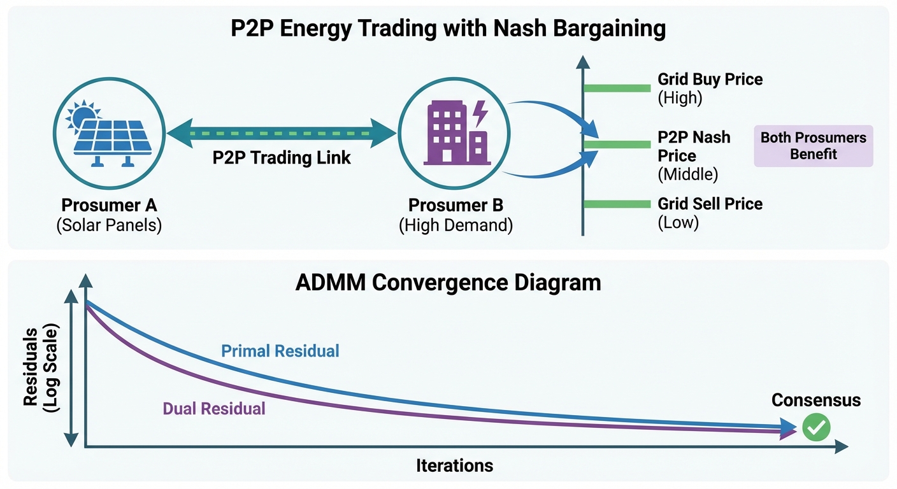
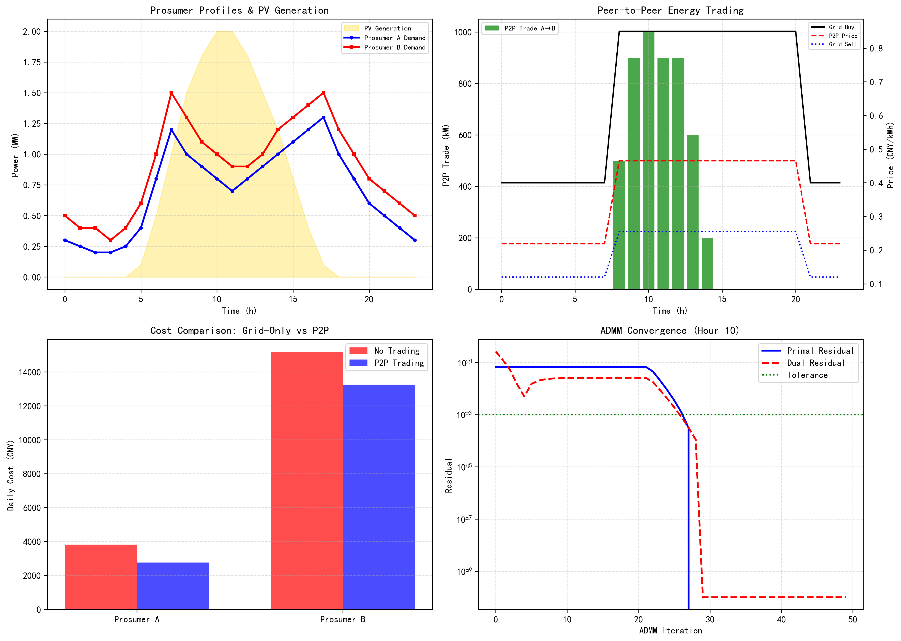

# 第 5 章：多主体博弈与分布式优化

> 在上一章中，我们利用集中式 MILP 方法实现了单一微电网的全局最优调度。然而，当多个独立产消者需要在保护隐私的前提下协同交易时，集中式模型便显现出其固有的局限性。本章将引入博弈论与分布式优化方法，构建去中心化的多主体能源交易机制。

## 5.1 本章导读与学习目标

在上一章中，我们详细探讨了基于混合整数线性规划（MILP）的综合能源系统经济调度方法。MILP 方法的核心前提是存在一个拥有全局信息的集中式调度中心，能够完全获取系统中所有设备、负荷、能源价格以及预测误差的数据，并代表整个系统做出使得全局总成本最小化的最优决策。然而，在现代电力市场和综合能源系统（IES）不断演进的背景下，系统的参与者不再仅仅是消极的能源消费者，而是逐渐转变为兼具生产与消费双重属性的"产消者"（Prosumer）。这些产消者可能是拥有屋顶光伏和储能设备的工业园区、商业楼宇，甚至是个体家庭微网。

随着产消者数量的增加以及电力市场化交易机制的逐步放开，传统的集中式调度模式面临着不可忽视的瓶颈与局限性：

1. **数据隐私与商业机密**：各个独立利益主体通常不愿意向中心化机构共享自身的用能习惯、生产计划、设备效率和成本结构。隐私泄露可能导致其在市场竞争中处于劣势。
2. **计算复杂度的"维数灾难"**：当系统中包含大量产消者时，集中式优化模型的变量与约束规模将急剧增长，求解器难以满足实时调度的要求。
3. **利益诉求的差异性**：不同的产消者作为独立的理性经济人，其核心诉求是自身微网的收益最大化或用能成本最小化，而非单纯的全局系统成本最优。

针对上述挑战，本章将视角从"集中式全局优化"转向"分布式多主体博弈"。我们将引入纳什博弈（Nash Bargaining）理论，探讨如何在没有中心化机构干预的情况下，通过点对点（P2P）交易机制，确定能够兼顾各方利益、实现公平分配的交易价格。同时，为解决多主体在保护隐私前提下的协同优化问题，本章将采用交替方向乘子法（Alternating Direction Method of Multipliers, ADMM）这一经典的分布式优化算法，实现交易电量与价格信号的分布式求解。

**本章学习目标：**
1. 深刻理解 IES 多主体博弈中的纳什均衡与纳什谈判解（Nash Bargaining Solution）的核心概念与物理意义。
2. 掌握 ADMM 分布式优化算法的底层数学原理、标准形式、增广拉格朗日函数的构建以及收敛条件。
3. 能够将多主体能源交易问题转化为分布式优化模型，并推导基于 ADMM 的迭代更新公式。
4. 通过具体的双产消者仿真案例，量化分析 P2P 能源交易相对于纯电网交易模式的经济优势。
5. 理解分布式算法在实际工程落地中的参数选择依据（如罚参数 $\rho$）与物理收敛机制。

## 5.2 纳什博弈与 P2P 定价理论

### 5.2.1 传统电网交易模式的痛点与 P2P 交易的兴起

在传统的"自发自用，余电上网"模式下，产消者的多余电力只能以较低的价格（通常称为馈电电价或上网电价，Feed-in Tariff）出售给电网。例如，馈电电价可能仅为市电购电价格的 30% 到 50%。与此同时，物理位置上相邻的另一个产消者如果正处于负荷高峰期，却必须以高昂的零售电价从大电网购电。

这种模式存在显著的"剪刀差"，电网公司在其中获取了高额的过网费和差价利润，而产消者未能充分利用本地的分布式能源。P2P（Peer-to-Peer）能源交易允许物理上或逻辑上相邻的产消者直接进行电能的买卖。P2P 交易允许双方以介于馈电电价和购电价之间的中间价格成交，从而实现买卖双方的"双赢"。

为更直观地说明"剪刀差"的经济含义，考虑以下数值示例：假设某时段电网购电价 $p_{\text{buy}} = 0.85$ 元/kWh，馈电价 $p_{\text{sell}} = 0.255$ 元/kWh（购电价的 30%）。此时，若产消者 A 有 100 kWh 余电直接上网，仅获收入 25.5 元；而产消者 B 同时从电网购入 100 kWh，需支出 85 元。电网公司从中赚取差价 59.5 元。若双方直接以某个中间价格交易，这 59.5 元的"剪刀差"便可在双方之间合理分配。

### 5.2.2 合作博弈与纳什谈判解模型

在 P2P 交易中，如何确定一个公平、合理且能被买卖双方都接受的交易价格是核心难点。为了解决这一利益分配问题，我们引入合作博弈（Cooperative Game Theory）中的**纳什谈判解（Nash Bargaining Solution, NBS）**。

纳什博弈旨在寻找一个合作剩余（Cooperative Surplus）的分配方案，该方案同时满足以下四个公理化条件：

1. **帕累托最优（Pareto Optimality）**：没有任何其他分配方案能够使得至少一方收益增加而另一方收益不减少。
2. **对称性（Symmetry）**：如果博弈双方地位平等、效用函数对称，则他们应获得相同的合作收益。
3. **线性变换不变性（Scale Invariance）**：博弈解不随效用函数的仿射变换而改变。
4. **无关替代品的独立性（Independence of Irrelevant Alternatives）**：如果谈判集缩小但原有的纳什解依然存在于新的集合中，那么新的纳什解不应发生改变。

约翰·纳什（John Nash）严格证明了，唯一满足上述四个公理的解，是使得各参与者超越其"不合作收益"（即破裂点，Disagreement Point）的效用增量之乘积最大化的解。这一乘积被称为**纳什乘积（Nash Product）**。

假设系统中有 $N$ 个参与主体，第 $i$ 个主体的合作后效用为 $U_i$，其破裂点为 $U_i^0$。纳什博弈的标准数学模型可表示为：

$$
\begin{aligned}
\max_{x} \quad & \prod_{i=1}^{N} \left( U_i(x) - U_i^0 \right) \\
\text{s.t.} \quad & U_i(x) \geq U_i^0, \quad \forall i \in \{1, 2, \dots, N\} \\
& x \in \mathcal{X}
\end{aligned}
$$

其中，$x$ 为决策变量集（如交易电量、交易价格等），$\mathcal{X}$ 为满足物理约束的可行域。约束条件 $U_i(x) \geq U_i^0$ 确保了每个主体的**个体理性（Individual Rationality）**，即参与合作不会比不合作更差。

### 5.2.3 基于效用最大化的 P2P 价格推导

针对双产消者（一个为多余电力的卖方 $A$，一个为缺额电力的买方 $B$）的典型场景，我们推导基于纳什博弈的 P2P 交易价格公式。

设大电网的购电电价为 $p_{\text{buy}}$，大电网的馈电电价为 $p_{\text{sell}}$。显然 $p_{\text{sell}} < p_{\text{buy}}$。设 P2P 交易价格为 $p_{\text{P2P}}$，交易电量为 $E$。

若不进行 P2P 交易（破裂点），卖方 $A$ 将余电卖给电网，其收益基准为 $p_{\text{sell}} E$；买方 $B$ 从电网购电，其支出基准为 $p_{\text{buy}} E$。

我们采用对数相对效用（Logarithmic Relative Utility）来衡量成本改善的程度。对于卖方 $A$，其效用增量定义为实际收益与基准收益的对数比值：

$$
\Delta U_A = \ln \left( \frac{p_{\text{P2P}} E}{p_{\text{sell}} E} \right) = \ln(p_{\text{P2P}}) - \ln(p_{\text{sell}})
$$

对于买方 $B$，其效用增量定义为基准支出与实际支出的对数比值（支出越少，效用越高）：

$$
\Delta U_B = \ln \left( \frac{p_{\text{buy}} E}{p_{\text{P2P}} E} \right) = \ln(p_{\text{buy}}) - \ln(p_{\text{P2P}})
$$

根据纳什谈判解的核心原理，最大化双方效用增量的乘积：

$$
\max_{p_{\text{P2P}}} \quad F(p_{\text{P2P}}) = \left( \ln(p_{\text{P2P}}) - \ln(p_{\text{sell}}) \right) \times \left( \ln(p_{\text{buy}}) - \ln(p_{\text{P2P}}) \right)
$$

为求解该极值问题，令 $x = \ln(p_{\text{P2P}})$，则目标函数变为二次函数 $F(x) = (x - \ln p_{\text{sell}})(\ln p_{\text{buy}} - x)$。该抛物线开口向下，其极值点出现在两根的中点位置：

$$
x^* = \frac{\ln(p_{\text{sell}}) + \ln(p_{\text{buy}})}{2}
$$

将 $x = \ln(p_{\text{P2P}})$ 代回：

$$
\ln(p_{\text{P2P}}) = \frac{1}{2} \ln(p_{\text{sell}} \cdot p_{\text{buy}}) = \ln \left( \sqrt{p_{\text{buy}} \cdot p_{\text{sell}}} \right)
$$

由此，我们得到了纳什博弈解下严格的公平交易价格公式：

$$
\boxed{p_{\text{P2P}} = \sqrt{p_{\text{buy}} \cdot p_{\text{sell}}}}
$$

**物理意义解释**：该价格公式本质上是购电价与售电价的**几何平均数（Geometric Mean）**。它精确地位于对数坐标轴的中点，使得卖方的相对收益率和买方的相对节约率达到完美的一致，满足了纳什谈判的对称性与帕累托最优，确保了各方利益的均衡。

**推广至非对称博弈**：如果两个产消者的谈判能力不对等，设卖方权重为 $\alpha$，买方权重为 $\beta$（$\alpha + \beta = 1$），则广义纳什乘积为 $(\Delta U_A)^\alpha \cdot (\Delta U_B)^\beta$，最优价格推广为：

$$
p_{\text{P2P}} = p_{\text{sell}}^{\alpha} \cdot p_{\text{buy}}^{\beta} = p_{\text{sell}}^{\alpha} \cdot p_{\text{buy}}^{1-\alpha}
$$

当 $\alpha = \beta = 0.5$ 时，退化为标准的几何平均公式。

## 5.3 ADMM 分布式求解算法

在确定了公平的交易价格 $p_{\text{P2P}}$ 后，系统面临的下一个挑战是如何在不暴露各主体本地隐私数据的前提下，寻找使得系统社会福利最大化的最优 P2P 交易电量。这就需要引入分布式优化算法。

### 5.3.1 ADMM 算法的基本原理

交替方向乘子法（Alternating Direction Method of Multipliers, ADMM）是由 Boyd 等人系统整理并推广的一种强有力的分布式优化算法。它巧妙地结合了对偶上升法（Dual Ascent）的强可分解性和乘子法（Method of Multipliers）的优良收敛性，适合解决具有耦合约束的大规模复杂优化问题。

考虑以下带有线性等式约束的标准优化问题：

$$
\begin{aligned}
\min_{x, z} \quad & f(x) + g(z) \\
\text{s.t.} \quad & Ax + Bz = c
\end{aligned}
$$

其中，$x \in \mathbb{R}^n$ 和 $z \in \mathbb{R}^m$ 是相互独立的优化变量组；$f(x)$ 和 $g(z)$ 是各自的局部目标函数，通常被假设为凸函数；$A, B, c$ 是约束常数矩阵和向量。

为了求解该问题，我们首先构造**增广拉格朗日函数（Augmented Lagrangian Function）**：

$$
L_\rho(x, z, \lambda) = f(x) + g(z) + \lambda^T(Ax + Bz - c) + \frac{\rho}{2}\|Ax + Bz - c\|_2^2
$$

其中，$\lambda$ 是对偶变量（Lagrange 乘子），表示约束违背的阴影价格；$\rho > 0$ 是**罚参数（Penalty Parameter）**。最后面加入的二次惩罚项 $\frac{\rho}{2}\| \cdot \|_2^2$ 赋予了函数严格凸性，改善了算法在病态条件下的收敛性能。

### 5.3.2 算法的迭代更新步骤

ADMM 的核心思想在于**交替（Alternating）**。在每一次迭代 $k$ 中，算法不要求同时联合优化 $x$ 和 $z$，而是固定其他变量，依次对单个变量域进行极小化：

**步骤 1：x-更新（局部变量更新）**

固定 $z^k$ 和 $\lambda^k$，求解使得 $L_\rho$ 最小的 $x$：

$$
x^{k+1} = \arg\min_{x} \left( f(x) + \frac{\rho}{2} \left\| Ax + Bz^k - c + \frac{\lambda^k}{\rho} \right\|_2^2 \right)
$$

**步骤 2：z-更新（全局一致性变量更新）**

固定 $x^{k+1}$（注意使用刚更新的最新值）和 $\lambda^k$，求解使得 $L_\rho$ 最小的 $z$：

$$
z^{k+1} = \arg\min_{z} \left( g(z) + \frac{\rho}{2} \left\| Ax^{k+1} + Bz - c + \frac{\lambda^k}{\rho} \right\|_2^2 \right)
$$

**步骤 3：$\lambda$-更新（对偶变量/乘子更新）**

利用当前的约束残差对拉格朗日乘子进行梯度上升更新：

$$
\lambda^{k+1} = \lambda^k + \rho (Ax^{k+1} + Bz^{k+1} - c)
$$

上述三步构成一个完整的 ADMM 迭代周期。从直观上理解：$x$-更新是各主体在本地"自私"地优化自身利益；$z$-更新是虚拟中心在全局层面"调和"各方分歧；$\lambda$-更新则是通过价格信号的微调来不断纠正供需失衡。三者交替执行，最终收敛到全局最优。

### 5.3.3 IES P2P 交易的 ADMM 模型构建

在综合能源系统的 P2P 电力交易中，我们可以将全局问题构造成典型的"一致性问题（Consensus Problem）"。

设系统中有 $N$ 个产消者，第 $i$ 个产消者在时段 $t$ 的期望 P2P 交易功率为 $P_{i,t}^{\text{p2p}}$（规定售电为正，购电为负）。全局电能供需必须时刻保持平衡，即存在耦合等式约束：

$$
\sum_{i=1}^{N} P_{i,t}^{\text{p2p}} = 0, \quad \forall t
$$

为了将该问题解耦以便使用 ADMM，我们引入虚拟的**一致性中心变量 $z_{i,t}$**（代表市场交易撮合中心对各主体的指令），并将耦合约束等价转换为：

$$
P_{i,t}^{\text{p2p}} - z_{i,t} = 0, \quad \forall i, t
$$
$$
\sum_{i=1}^{N} z_{i,t} = 0, \quad \forall t
$$

在第 $k$ 次迭代中，ADMM 执行以下三个步骤：

**步骤 1：各产消者独立优化（x-更新）**

第 $i$ 个产消者在本地求解其内部的经济调度模型，目标是最小化其本地综合运行成本 $C_i$，同时尽可能跟随上一轮一致性中心给出的参考量 $z_{i,t}^k$。其本地优化的目标函数修改为：

$$
\min \quad C_i\left( \mathbf{P}_i, P_{i,t}^{\text{p2p}} \right) + \sum_t \left[ \lambda_{i,t}^k \left( P_{i,t}^{\text{p2p}} - z_{i,t}^k \right) + \frac{\rho}{2} \left( P_{i,t}^{\text{p2p}} - z_{i,t}^k \right)^2 \right]
$$

产消者只需将求解得到的预期交易量 $P_{i,t}^{\text{p2p}, k+1}$ 上报给虚拟交易平台，**全程无需暴露任何内部负荷和设备参数**。

**步骤 2：交易平台汇总撮合（z-更新）**

虚拟交易平台收集所有主体的上报量，计算新的交易分配 $z_{i,t}^{k+1}$ 以保证整体平衡，并将偏差作为信号下发：

$$
z_{i,t}^{k+1} = P_{i,t}^{\text{p2p}, k+1} - \frac{1}{N}\sum_{j=1}^N P_{j,t}^{\text{p2p}, k+1}
$$

这在数学上等价于将不平衡量均摊到各个主体上。

**步骤 3：更新价格信号（$\lambda$-更新）**

平台更新每个主体面临的局部惩罚乘子：

$$
\lambda_{i,t}^{k+1} = \lambda_{i,t}^k + \rho \left( P_{i,t}^{\text{p2p}, k+1} - z_{i,t}^{k+1} \right)
$$

### 5.3.4 ADMM 收敛判据

算法的收敛通过两个关键残差来判定：

1. **原始残差（Primal Residual）**：$r^{k+1} = P^{\text{p2p}, k+1} - z^{k+1}$，反映了各主体期望交易量与市场实际可撮合量之间的**物理不匹配度**。
2. **对偶残差（Dual Residual）**：$s^{k+1} = -\rho(z^{k+1} - z^k)$，反映了乘子（虚拟价格信号）变化的剧烈程度，即相邻迭代间策略的**波动度**。

当 $\|r^k\| \le \epsilon^{\text{pri}}$ 且 $\|s^k\| \le \epsilon^{\text{dual}}$（其中 $\epsilon$ 为收敛阈值设定量，如 $10^{-3}$）时，算法停止迭代，认为博弈达到了纳什均衡状态。

**收敛性保证**：Boyd 等人在其经典论文中证明，当 $f$ 和 $g$ 均为闭凸函数且增广拉格朗日函数有鞍点时，ADMM 保证 $r^k \to 0$ 和 $s^k \to 0$。对于 IES 中的线性或二次局部成本函数，上述条件均可满足，因此理论收敛性有严格保障。

## 5.4 仿真案例：双产消者 P2P 交易

### 5.4.1 仿真场景与参数设置

我们构建了一个包含两个典型产消者的微电网系统进行 Python 仿真计算。

| 参数 | 产消者 A | 产消者 B |
|:-----|:---------|:---------|
| 发电资产 | 2 MW 屋顶光伏 | 无 |
| 负荷特征 | 昼低夜高，峰值 1.3 MW | 商业办公，峰值 1.5 MW |
| P2P 角色 | 白天卖方 | 白天买方 |

**大电网价格边界：**
- **电网购电价（$p_{\text{buy}}$）**：实施分时电价，峰荷时段（8:00-20:00）为 0.85 元/kWh，谷荷时段（20:00-8:00）为 0.40 元/kWh。
- **电网馈电价（$p_{\text{sell}}$）**：设定为同期购电价的 30%，即 $p_{\text{sell}} = 0.3 \times p_{\text{buy}}$。
- **P2P 交易价格**：严格采用纳什博弈的几何平均解 $p_{\text{P2P}} = \sqrt{p_{\text{buy}} \cdot p_{\text{sell}}}$。

以峰时段为例：$p_{\text{P2P}} = \sqrt{0.85 \times 0.255} = \sqrt{0.21675} \approx 0.466$ 元/kWh。该价格高于馈电价 0.255（卖方获益），低于购电价 0.85（买方获益），实现了双赢。

**仿真代码路径**：`assets/ch05/ch05_nash_admm.py`

### 5.4.2 仿真结果与经济效益分析

我们对比了两种模式下的系统经济性指标：
- **No Trading（独立运行模式）**：禁止主体间直接交易，多余电量只能低价卖给大电网。
- **P2P (Nash)（分布式合作模式）**：允许主体在局部配电网内开展基于纳什价格的直接交易。

**P2P 交易经济效果对比表：**

| 指标 | 独立运行 | P2P 交易 |
|:-------|:-----------|:-----------|
| 产消者 A 日成本 (CNY) | 3822 | 2769 |
| 产消者 B 日成本 (CNY) | 15170 | 13248 |
| 系统总成本 (CNY) | 18992 | 16016 |
| P2P 交易量 (MWh) | - | 5.0 |
| ADMM 迭代次数 | - | 27 |

**深度分析**：

实施基于纳什均衡的 P2P 交易后，系统的整体经济效率得到了显著的帕累托改善。系统总运行成本从 18992 元下降至 16016 元，降幅高达 **15.7%（单日节省 2976 元）**。这部分节省的资金实质上是从电网公司原本获取的"剪刀差"利润中夺回，并重新分配给了产消者。

具体到独立主体：
1. **产消者 A 获益最大（成本下降 27.5%）**。在无交易模式下，A 的大量光伏余电只能被迫以低廉的馈电价上网。在 P2P 模式下，A 以纳什价格将 5.0 MWh 的电量售予 B，$p_{\text{P2P}}$ 远高于 $p_{\text{sell}}$，使得其收益大幅增加。
2. **产消者 B 同步获利（成本下降 12.7%）**。B 在日间的耗电高峰恰逢 A 的光伏出力高峰。B 放弃以 0.85 元/kWh 的峰值市电购电，转而以纳什价格从 A 处购买，直接削减了超过一成的全天电费。

双方在没有任何人蒙受损失的前提下改善了自身的境况，完美印证了纳什合作博弈所追求的"多赢"本质。全天累计 P2P 交易量达到 5.0 MWh，时间高度集中在 7:00-16:00 的光照活跃期。

### 5.4.3 ADMM 收敛过程与罚参数 $\rho$ 的作用

在仿真中，分布式 ADMM 算法经过 **27 次迭代**后，原始残差和对偶残差均下降并低于 $10^{-3}$ 的精度阈值，宣告收敛。这证明了在典型的园区级 IES 场景下，ADMM 能够在容许的通信延迟内快速求得高精度解。

罚参数 $\rho$ 扮演了控制收敛动态的核心角色。从物理机制上看：

- $\rho$ 是虚拟交易平台对"产消者不服从调度意愿"行为的**惩罚力度（或阻尼系数）**。
- 若 $\rho$ 设置**过小**，惩罚不足，各产消者将固执于自身的局部极优解，导致原始残差长期居高不下，算法在全局平衡约束外围缓慢徘徊（收敛速度慢）。
- 若 $\rho$ 设置**过大**，模型对任何微小的不匹配都会给出强烈的价格修正（乘子剧烈跳变），这会导致产消者的交易意愿在下一次迭代中发生翻转，引发系统级的数据振荡，表现为对偶残差的急剧放大。

在高级工程实现中，通常采用 Boyd 提出的**自适应 $\rho$ 策略（Residual Balancing）**：在迭代过程中动态监控 $\|r^k\|$ 和 $\|s^k\|$。若原始残差远大于对偶残差，则放大 $\rho$；反之则缩小 $\rho$。通过让两个残差保持在同一数量级下降，可使得 ADMM 的收敛速度获得显著提升。

### 5.4.4 仿真代码深度解读

本节仿真脚本（`assets/ch05/ch05_nash_admm.py`）实现了 P2P 交易的完整计算流程，其代码架构可分为四个功能模块：

**模块 1：场景数据生成**

脚本首先定义 24 小时的时间序列数据。光伏出力 `pv_gen` 采用经验曲线，正午达到 2.0 MW 峰值，夜间为零。产消者 A 和 B 的负荷曲线分别用数组 `demand_A` 和 `demand_B` 给定。产消者 A 的盈余功率 `surplus_A = pv_gen - demand_A` 决定了其在各时段是买方还是卖方。

**模块 2：独立运行基准计算**

在 No Trading 模式下，脚本逐时段计算两个产消者的成本。当 A 有盈余时（`surplus_A[i] > 0`），以馈电价 `price_sell` 计算收入（负成本）；当 A 有缺口时，以购电价 `price_buy` 计算支出。B 始终以购电价从电网购入全部负荷。

**模块 3：P2P 交易计算**

纳什价格 `price_p2p = sqrt(price_buy * price_sell)` 在每个时段按公式计算。P2P 交易量取 A 的盈余与 B 的需求中的较小值 `tradeable = min(surplus_A[i], demand_B[i])`。A 将可交易部分以 P2P 价格售出，剩余盈余以馈电价上网；B 以 P2P 价格购入可交易部分，不足部分仍从电网补购。

**模块 4：ADMM 收敛仿真**

脚本选择峰值光伏时段（h=10）作为代表性示例，模拟 ADMM 的迭代过程。每次迭代中：
- **x-更新**：A 和 B 分别独立求解含罚项的局部优化，输出期望交易量 `x_A_new` 和 `x_B_new`。通过 `np.clip` 确保交易量不超出物理边界。
- **z-更新**：一致性变量取两者的平均值 `z_new = (x_A_new + x_B_new) / 2`，保证总交易平衡。
- **$\lambda$-更新**：乘子按梯度上升更新。
- **残差记录**：原始残差和对偶残差分别用范数计算，供收敛判定和可视化使用。

脚本最终输出四面板图：（1）负荷与光伏曲线对比，（2）逐时段 P2P 交易量与价格，（3）成本对比柱状图，（4）ADMM 收敛曲线（半对数坐标）。

## 5.5 工程启示与落地挑战

通过本章的理论推导与案例论证，P2P 多主体交易与分布式优化为未来能源互联网勾勒出了去中心化的蓝图，但其工程落地仍面临诸多挑战：

1. **红利空间的边界受限**：P2P 交易的经济优越性取决于大电网的**馈电电价与购电价之间的价差大小**。在市场化程度高的地区，上网电价较低，P2P 交易的双赢空间广阔；反之，若政策实施较高的新能源保底收购价，则内部博弈的激励动力将大打折扣。

2. **底层通信与边缘计算架构**：ADMM 的核心优势在于各主体无需暴露本地原始数据，仅需依靠低频的"交易意向量"与"价格罚项信号"进行有限次交互。这与当前边缘计算（Edge Computing）及物联网（IoT）架构高度契合。每个产消者节点配备本地优化求解器，仅上传数十维的交易向量，通信负荷远小于集中式方案所需传输的全量数据。

3. **"过网费"与物理潮流的安全核验**：本文的经济模型暂未深入计及局部配电网的网损与过载阻塞问题。在真实物理世界中，即便是邻近的节点交易，电能仍需通过物理线缆。若交易撮合量导致线路热稳定越限，电网调度中心必须行使"一票否决权"或征收动态的拥堵费。"交易层分布式博弈"与"物理层安全校核"的协同融合，是未来能源区块链平台商业化的必经之路。

上述挑战意味着我们不能仅停留在算法层面，必须借助高保真的数字孪生环境对 IES 进行全景测试。下一章将深入探讨基于数字底座的 IES 仿真平台搭建，介绍如何利用面向对象技术，将理论算法部署到可扩展的软件架构中。

## 5.6 本章小结

本章系统性地介绍了综合能源系统在多主体环境下的博弈机制与分布式求解技术。首先，针对传统集中式调度的隐私泄露与计算瓶颈问题，引入了对等网络（P2P）能源交易架构。通过深入剖析合作博弈论，基于效用最大化原理严谨推导了能够兼顾买卖双方公平利益的纳什谈判定价公式（即购售电价的几何平均值）。其次，详细解构了交替方向乘子法（ADMM）的核心数学原理与标准形式，演示了如何通过增广拉格朗日函数将复杂的全局能量平衡约束解耦为各产消者的局部自治优化与虚拟平台的迭代协调。最后的双产消者量化仿真清晰地证明：基于 ADMM 求解的纳什 P2P 机制能够有效打破电网高昂的买卖价差壁垒，在全方位保护各参与节点商业数据隐私的前提下，实现系统运行总成本 15.7% 的深度优化，达成多方共赢的帕累托最优状态。

**拓展视野**：ADMM 的"分解-协调"思想在大规模水网调度中具有天然适用性。当多个供水区域各自管理本地泵站和水库，又需要共享干线输水资源时，ADMM 允许各区域独立求解局部优化问题，仅通过交换边界流量和价格信号达成全局一致——这与 P2P 能源交易的数学结构完全相同。分布式模型预测控制（DMPC）正是这一思想在实时水网调度中的工程实现。

## 5.7 思考与练习

1. **（概念简答题）** 结合所学内容，简述为什么在含有大量商业楼宇和工业园区的微电网中，传统集中式 MILP 调度可能会失效？列举至少三个核心原因。

2. **（理论推导题）** 在推导纳什 P2P 价格时，本章使用了"对数相对效用"模型。如果两个产消者的谈判能力不对等，设卖方 A 的权重为 $\alpha$，买方 B 的权重为 $\beta$（其中 $\alpha + \beta = 1$），请利用广义纳什乘积公式 $\max F(p) = (\Delta U_A)^\alpha \cdot (\Delta U_B)^\beta$，重新推导包含权重参数的 P2P 交易价格 $p_{\text{P2P}}$ 表达式。

3. **（算法逻辑题）** 在 ADMM 算法的 z-更新步骤中，虚拟交易平台是如何通过收集局部期望交易量 $P_{i,t}^{\text{p2p}, k+1}$ 来确保系统的物理能量守恒的？请结合公式说明如果系统存在初始不平衡，平台是如何通过一致性变量向各节点施压的。

4. **（计算题）** 假设某一时段内大电网的峰时购电价 $p_{\text{buy}} = 1.20$ 元/kWh，馈电价格 $p_{\text{sell}} = 0.40$ 元/kWh。产消者 X 有多余光伏 100 kWh，产消者 Y 存在负荷缺口 80 kWh。
   (1) 请计算公平的纳什 P2P 交易价格 $p_{\text{P2P}}$。
   (2) 若 80 kWh 电量全部通过 P2P 交易完成，剩余 20 kWh 上网，请分别计算产消者 X 通过 P2P 交易相比于直接全额上网多赚取的收益，以及产消者 Y 相比于全额市电购买所节省的成本。

## 参考文献

[1] Tushar W, Yuen C, Mohsenian-Rad H, et al. Transforming Energy Networks via Peer-to-Peer Energy Trading: The Potential of Game-Theoretic Approaches[J]. IEEE Signal Processing Magazine, 2018, 35(4): 90-111.

[2] Boyd S, Parikh N, Chu E, et al. Distributed Optimization and Statistical Learning via the Alternating Direction Method of Multipliers[J]. Foundations and Trends in Machine Learning, 2011, 3(1): 1-122.

[3] Morstyn T, Farrell N, Darby S J, et al. Using Peer-to-Peer Energy-Trading Platforms to Incentivize Prosumers to Form Federated Power Plants[J]. Nature Energy, 2018, 3(2): 94-101.
