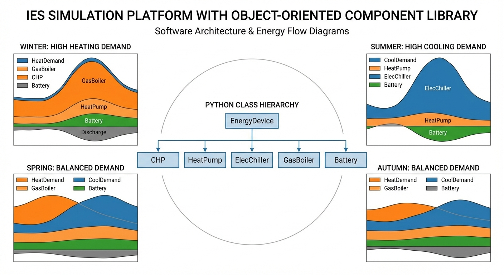

# 第 6 章：基于数字底座的 IES 仿真平台搭建

> 前五章分别建立了 Energy Hub 概念（第 1 章）、设备模型（第 2 章）、储能与管网动态（第 3 章）、MILP 调度（第 4 章）和 P2P 博弈（第 5 章）。本章将这些组件集成为面向对象的 IES 仿真平台，通过四季能流测试验证平台在不同运行工况下的适应性。

## 6.1 本章导读与学习目标

综合能源系统的核心价值在于多种能源介质（电、热、冷、气）的耦合互补。然而，前几章分别独立地建立了各设备的数学模型和优化算法，这些模型尚未被组装为一个完整的、可运行的软件系统。从工程实践的角度出发，一个好的 IES 仿真平台不仅需要准确地复现每个设备的物理行为，还必须支持灵活的系统配置、快速的场景切换，以及清晰的结果可视化。

面向对象编程（Object-Oriented Programming, OOP）是构建此类复杂系统仿真平台的理想方法论。OOP 的核心理念是将现实世界中的物理实体（如 CHP 机组、热泵、制冷机、锅炉、储能电池等）抽象为软件中的"类（Class）"，每个类封装该设备的物理参数（属性）和运行逻辑（方法）。通过实例化这些类并按照能量流向将它们连接起来，即可构建任意拓扑结构的 IES 系统——这种"搭积木"式的建模范式使得工程师可以在不修改底层算法的前提下，快速评估不同设备选型、不同系统配置方案的运行效果。

本章将设计并实现一个基于 Python 的 IES 仿真平台，包含五类核心设备组件，并通过冬、春、夏、秋四个典型日的能流调度仿真，深入分析季节性负荷差异对系统运行策略和经济性的影响。

**学习目标：**
1. 掌握面向对象的 IES 组件类设计方法，理解封装（Encapsulation）、继承（Inheritance）和多态（Polymorphism）在能源系统建模中的应用。
2. 理解四季负荷特征（电/热/冷三维负荷向量）对 IES 调度策略的结构性影响。
3. 能够利用仿真平台进行设备选型比较、运行模式评估和经济性分析。
4. 掌握从独立组件到系统集成的软件工程方法论，为后续的数字孪生和在线调度奠定基础。



## 6.2 面向对象的 IES 组件库设计

### 6.2.1 设计原则与类层次结构

IES 仿真平台的组件库设计遵循以下三个核心原则：

1. **单一职责原则**：每个类只负责一种设备的物理建模，不混合调度逻辑。
2. **开放封闭原则**：组件库对扩展开放（可新增设备类型），对修改封闭（已有设备类的接口保持稳定）。
3. **统一接口原则**：所有设备类均提供 `operate()` 方法作为外部调用入口，输入为该设备的一次能源输入量，输出为各形式能源的产出量和实际消耗量。

基于上述原则，本平台定义了五个核心设备类，其继承关系和接口规范如下表所示：

| 设备类 | 输入能源 | 输出能源 | 核心参数 | 建模方程 |
|:-------|:---------|:---------|:---------|:---------|
| CHP | 天然气 | 电 + 热 | $\eta_e, \eta_h, P_{\text{max}}^{\text{gas}}$ | $P_e = \eta_e \cdot G$, $P_h = \eta_h \cdot G$ |
| HeatPump | 电 | 热 | COP, $P_{\text{max}}^{\text{elec}}$ | $Q_h = \text{COP} \cdot P_e$ |
| ElecChiller | 电 | 冷 | COP, $P_{\text{max}}^{\text{elec}}$ | $Q_c = \text{COP} \cdot P_e$ |
| GasBoiler | 天然气 | 热 | $\eta, P_{\text{max}}^{\text{gas}}$ | $Q_h = \eta \cdot G$ |
| Battery | 电（双向） | 电（双向） | $E_{\text{cap}}, P_{\text{max}}, \eta$ | SOC 递推方程 |

### 6.2.2 各设备类的详细设计

**1. CHP 热电联产类**

CHP 是 IES 中最核心的能源转换设备，其本质是通过燃烧天然气同时产生电能和热能。在线性化建模假设下，电效率 $\eta_e$ 和热效率 $\eta_h$ 为常数，且满足 $\eta_e + \eta_h < 1$（余热损失）。CHP 类的数学模型为：

$$
P_e = \eta_e \cdot G, \quad Q_h = \eta_h \cdot G, \quad 0 \le G \le G_{\text{max}}
$$

其中 $G$ 为燃气输入功率（MW），$P_e$ 为发电功率，$Q_h$ 为产热功率。在本平台中，典型参数设定为 $\eta_e = 0.35$, $\eta_h = 0.45$, $G_{\text{max}} = 3.0$ MW，综合能源利用率达到 80%。

CHP 的一个重要运行特征是"以热定电"或"以电定热"。在供热主导的冬季，CHP 常被迫以较高功率运行以满足热负荷，此时附带产生的电能可能超过系统电负荷需求，多余电力需要外送或存储。反之，在夏季热需求低迷时，CHP 不得不降低出力，导致其经济性下降。

**2. 热泵类**

热泵利用逆卡诺循环原理，以少量电能驱动，将低品位热源中的热量"泵"入高温供热系统。其核心指标是性能系数（Coefficient of Performance, COP）：

$$
Q_h = \text{COP} \cdot P_e, \quad 0 \le P_e \le P_e^{\text{max}}
$$

本平台设定 COP = 3.5，即消耗 1 kWh 电能可产生 3.5 kWh 热能。热泵在电价较低时段运行尤为经济，因此调度策略中常安排其在谷电时段承担供热任务。需要指出的是，热泵的 COP 实际上受到室外温度的显著影响——低温环境下 COP 下降，这在冬季可能导致其供热效率不如预期。本平台的线性化模型未计入此非线性效应，读者可在扩展练习中探讨此问题。

**3. 电制冷机类**

电制冷机（Electric Chiller）采用蒸气压缩制冷循环，消耗电能产生冷量：

$$
Q_c = \text{COP}_c \cdot P_e, \quad 0 \le P_e \le P_e^{\text{max}}
$$

本平台设定制冷 COP = 5.0，即消耗 1 kWh 电能可产生 5.0 kWh 冷量。电制冷机在夏季承担主要的制冷任务，但其对电力的大量消耗会显著增加系统的电网购电压力，尤其是在峰电时段。

**4. 燃气锅炉类**

燃气锅炉是最简单的热源设备，直接燃烧天然气产生热能：

$$
Q_h = \eta \cdot G, \quad 0 \le G \le G_{\text{max}}
$$

本平台设定热效率 $\eta = 0.90$，$G_{\text{max}} = 2.0$ MW。锅炉通常作为备用热源，在 CHP 和热泵不足以满足热负荷时投入运行。其运行成本高于热泵（不具备"放大"效应），但投资成本低、响应速度快、可靠性高。

**5. 储能电池类**

电池储能系统的建模与第 3 章相同，采用 SOC 差分方程：

$$
\text{SOC}(t+1) = \text{SOC}(t) + \frac{\eta_{\text{ch}} \cdot P_{\text{ch}} \cdot \Delta t}{E_{\text{cap}}} \quad \text{(充电)}
$$
$$
\text{SOC}(t+1) = \text{SOC}(t) - \frac{P_{\text{dis}} \cdot \Delta t}{\eta_{\text{dis}} \cdot E_{\text{cap}}} \quad \text{(放电)}
$$

本平台设定 $E_{\text{cap}} = 2000$ kWh，$P_{\text{max}} = 500$ kW，$\eta = 0.95$，SOC 安全区间为 $[0.1, 0.9]$。Battery 类内部维护 SOC 状态变量，`charge()` 和 `discharge()` 方法自动检查 SOC 边界并裁剪实际充放电功率，确保不会越界。

### 6.2.3 组件化设计的工程优势

组件化设计的优势在于以下几个方面：

1. **设备替换的零修改成本**：更换一台 CHP 的参数（如从 3 MW 升级到 5 MW）只需修改类实例的初始化参数，无需触碰调度逻辑代码。
2. **新设备类型的低成本接入**：新增吸收式制冷机、氢能设备等只需定义新类并实现 `operate()` 接口，即可无缝接入现有调度框架。
3. **仿真场景的快速切换**：通过修改负荷曲线数组和电价向量，可在秒级时间内完成不同季节、不同地区的仿真，无需重新编译或重构代码。

## 6.3 四季负荷特征与能流差异分析

### 6.3.1 电-热-冷三维负荷向量

IES 与传统纯电力系统的根本区别在于其负荷具有三维向量特征：每个时段的负荷由电负荷 $P_{\text{elec}}(t)$、热负荷 $Q_{\text{heat}}(t)$ 和冷负荷 $Q_{\text{cool}}(t)$ 三个分量构成。不同季节的三维负荷向量呈现出截然不同的形态：

**冬季负荷特征**：

$$
\mathbf{L}_{\text{winter}}(t) = \begin{bmatrix} P_{\text{elec}}(t) \\ Q_{\text{heat}}(t) \\ 0 \end{bmatrix}, \quad Q_{\text{heat}} \gg P_{\text{elec}}
$$

冬季以供热为绝对主导，日热负荷可达 133 MWh（含建筑供暖和工业用热），无制冷需求。电负荷相对平稳，但供暖用电（如电暖器、热泵辅助加热）会使其略高于春秋季。

**夏季负荷特征**：

$$
\mathbf{L}_{\text{summer}}(t) = \begin{bmatrix} P_{\text{elec}}(t) \\ Q_{\text{heat}}(t) \\ Q_{\text{cool}}(t) \end{bmatrix}, \quad Q_{\text{cool}} \gg Q_{\text{heat}}, \quad P_{\text{elec}}^{\text{summer}} > P_{\text{elec}}^{\text{winter}}
$$

夏季以制冷为主（日冷负荷约 52.5 MWh），电负荷因空调负荷而显著升高，热负荷降至冬季的约 1/5（仅含生活热水和工业用热）。

**春/秋季负荷特征**：

过渡季节的电热冷负荷均处于中间水平，负荷结构最为均衡。这两个季节通常是 IES 运行效率最优的时期，因为 CHP 能够在电热匹配度较高的工况下运行。

### 6.3.2 四季负荷数据汇总

| 季节 | 日电负荷 (MWh) | 日热负荷 (MWh) | 日冷负荷 (MWh) | 负荷主导特征 |
|:-----|:----|:----|:----|:---------|
| 冬季 | 91.8 | 133.0 | 0 | 热主导 |
| 春季 | 79.3 | 71.5 | 9.1 | 均衡 |
| 夏季 | 107.2 | 28.4 | 52.5 | 冷+电主导 |
| 秋季 | 82.3 | 93.5 | 0 | 热偏重 |

上表清晰地展示了四季负荷的结构性差异。夏季日电负荷高达 107.2 MWh，比春季高出 35%，主要增量来自电制冷机的耗电。冬季日热负荷是夏季的 4.7 倍，这一巨大落差直接决定了 CHP 在不同季节的运行模式。

## 6.4 调度策略设计

本平台采用基于规则的启发式调度策略（Rule-Based Dispatch），其逻辑层次清晰，便于教学理解和工程快速验证。调度策略按以下优先级逐层满足三维负荷需求：

**第一层：CHP 以热定电**

CHP 首先根据热负荷需求确定燃气输入量：$G = \min(Q_{\text{heat}} / \eta_h, G_{\text{max}})$。CHP 在满足热负荷的同时附带产生电力 $P_e = \eta_e \cdot G$。

**第二层：热泵低价补热**

若 CHP 产热不足以覆盖全部热负荷，且当前电价处于低价时段（$c_{\text{elec}} \le 0.5$ 元/kWh），则启动热泵补充供热。热泵的高 COP（3.5）使其在低电价时段的供热成本低于燃气锅炉。

**第三层：锅炉兜底供热**

经过 CHP 和热泵后仍有热缺口，则由燃气锅炉兜底补充。锅炉作为最后手段，确保任何工况下热负荷都能 100% 满足。

**第四层：电制冷机供冷**

冷负荷完全由电制冷机承担：$P_e^{\text{chiller}} = Q_{\text{cool}} / \text{COP}_c$。

**第五层：电网补电**

汇总所有设备的电力产出和消耗后，净电力缺口由外部电网补充：

$$
P_{\text{grid}}(t) = P_{\text{load}}(t) - P_{\text{CHP}}^e(t) + P_{\text{HP}}^e(t) + P_{\text{chiller}}^e(t)
$$

**调度策略的数学表述**可以用以下分层决策过程概括：

$$
\begin{aligned}
G_{\text{CHP}} &= \min\left(\frac{Q_{\text{heat}}}{\eta_h},\; G_{\text{max}}\right) \\
Q_{\text{remaining}} &= Q_{\text{heat}} - \eta_h \cdot G_{\text{CHP}} \\
P_{\text{HP}} &= \begin{cases} \min\left(\frac{Q_{\text{remaining}}}{\text{COP}},\; P_{\text{HP}}^{\text{max}}\right) & \text{if } c_{\text{elec}} \le 0.5 \\ 0 & \text{otherwise} \end{cases} \\
G_{\text{boiler}} &= \frac{Q_{\text{remaining}} - \text{COP} \cdot P_{\text{HP}}}{\eta_{\text{boiler}}}
\end{aligned}
$$

## 6.5 仿真案例：四季调度对比

### 6.5.1 仿真设置

在统一的设备配置下，分别对冬、春、夏、秋四季的典型日负荷曲线进行调度仿真。设备配置如下：

| 设备 | 容量 | 核心参数 |
|:-----|:-----|:---------|
| CHP | 3 MW 燃气输入 | $\eta_e=0.35$, $\eta_h=0.45$ |
| 热泵 | 1 MW 电输入 | COP = 3.5 |
| 电制冷机 | 1 MW 电输入 | COP = 5.0 |
| 燃气锅炉 | 2 MW 燃气输入 | $\eta=0.90$ |
| 电池储能 | 2 MWh | $P_{\text{max}}=500$ kW, $\eta=0.95$ |

能源价格：燃气 0.35 元/kWh（气），电网分时电价峰时 0.80 元/kWh（8:00-20:00）、谷时 0.40 元/kWh。

**仿真代码路径**：`assets/ch06/ch06_ies_platform.py`

### 6.5.2 仿真结果

**四季调度经济性对比：**

| 季节 | 总成本 (CNY) | 燃气消耗 (MWh) | 电网购电 (MWh) | 热负荷 (MWh) | 冷负荷 (MWh) |
|:-----|:-------------|:---------------|:---------------|:-------------|:-------------|
| 冬季 | 86,921 | 103.9 | 76.8 | 133.0 | 0.0 |
| 春季 | 73,660 | 92.2 | 60.6 | 71.5 | 9.1 |
| 夏季 | 92,406 | 59.4 | 101.8 | 28.4 | 52.5 |
| 秋季 | 76,500 | 97.7 | 62.6 | 93.5 | 0.0 |

### 6.5.3 结果深度分析

**夏季成本最高（92,406 元）的机理**：

夏季总成本达到全年峰值，主要原因是多重不利因素的叠加。首先，52.5 MWh 的制冷需求虽然由高 COP 的电制冷机承担（仅需 $52.5/5.0 = 10.5$ MWh 电力），但这部分额外电力消耗恰好发生在电价峰时段（白天），进一步推高了购电成本。其次，夏季热负荷仅 28.4 MWh，CHP 因热需求不足而大幅降低运行时长，其附带的"免费"电力产出随之减少，系统对外部电网的依赖度升至 101.8 MWh——全年最高。这体现了 CHP "以热定电"模式在夏季的固有劣势。

**冬季成本次高（86,921 元）的机理**：

冬季天然气消耗全年最大（103.9 MWh），因为 CHP 以接近满负荷运行仍不足以覆盖 133 MWh 的热需求，锅炉不得不频繁投入补充供热。但 CHP 满负荷运行的"副产品"是大量的电力输出，使得电网购电量降至全年最低（76.8 MWh），部分抵消了高燃气成本。

**春秋季成本最优（73,660-76,500 元）的机理**：

过渡季节的热电冷负荷较为均衡，CHP 运行在中等出力区间，热电匹配度高。热泵在谷电时段辅助供热，进一步降低了燃气消耗。电网购电量维持在 60-63 MWh 的适中水平。综合来看，春季是全年运行成本最低的季节。


### 6.5.4 仿真代码深度解读

本节仿真脚本（`assets/ch06/ch06_ies_platform.py`）的架构体现了面向对象设计的核心理念。

**类定义模块**

脚本首先定义了五个设备类（CHP、HeatPump、ElecChiller、GasBoiler、Battery），每个类的 `__init__` 方法接收物理参数（如容量、效率），`operate()` 方法执行单步能量转换计算。以 CHP 类为例：

```python
class CHP:
    def __init__(self, P_max_gas=3.0, eta_e=0.35, eta_h=0.45):
        self.P_max_gas = P_max_gas
        self.eta_e = eta_e
        self.eta_h = eta_h

    def operate(self, gas_input):
        gas = min(gas_input, self.P_max_gas)
        return gas * self.eta_e, gas * self.eta_h, gas
```

`operate()` 方法首先将输入裁剪到容量上限，然后按效率系数分别计算电功率和热功率输出，最后返回三元组 `(elec, heat, gas_used)`。这种"输入-转换-输出"的统一接口使得调度层可以用相同的方式调用任何设备。

**负荷数据模块**

四季的 24 小时负荷曲线存储在字典 `seasons` 中，每个季节包含 `elec`、`heat`、`cool` 三个 NumPy 数组。这种结构化的数据组织方式使得新增季节或自定义负荷曲线仅需添加一个字典条目。

**调度循环模块**

主调度循环遍历四个季节，在每个季节中逐时段执行分层调度策略。每个时段的调度过程严格按照 6.4 节所述的优先级执行：CHP 定热 -> 热泵补热 -> 锅炉兜底 -> 制冷机供冷 -> 电网补电。最终汇总每个时段的燃气成本和购电成本，累加得到日总成本。

**输出模块**

脚本生成两个输出文件：`seasonal_table.md`（四季经济性对比表）和 `ies_platform_sim.png`（四面板季节对比图，每个面板展示一个季节的电/热/冷负荷填充图和电网购电曲线）。

**读者扩展建议**：（1）在 CHP 类中增加最小出力约束和启停逻辑，使其更贴近真实机组；（2）新增吸收式制冷机类（AbsorptionChiller），利用 CHP 废热制冷，观察夏季成本的变化；（3）将 Battery 类整合到调度逻辑中，实现储能的峰谷套利；（4）将规则调度替换为第 4 章的 MILP 优化调度，比较两种方法的成本差异。

## 6.6 设备选型的经济性敏感分析

基于四季仿真结果，我们可以提炼出指导设备选型的关键洞见：

### 6.6.1 CHP 容量的边际效应

在冬季，CHP 满负荷运行仍需锅炉补热，说明 3 MW 的 CHP 容量略显不足。若将 CHP 升级至 4 MW，可减少锅炉消耗，但夏季闲置率将进一步恶化。最优容量需通过全年 365 天的逐日仿真来确定，寻找使年总成本最小化的平衡点。

$$
G_{\text{CHP}}^{\text{opt}} = \arg\min_{G_{\text{max}}} \sum_{d=1}^{365} C_{\text{total}}(d, G_{\text{max}})
$$

### 6.6.2 吸收式制冷机的战略价值

夏季成本高企的根源在于 CHP 因热需求不足而降低出力，同时制冷机大量耗电。若引入吸收式制冷机（利用 CHP 废热驱动，COP 约 0.7-1.2），可在夏季同时实现以下效果：
- CHP 维持较高出力以产生驱动吸收式制冷机所需的热量；
- CHP 附带产出的电力减少对电网的依赖；
- 吸收式制冷机替代部分电制冷机，降低电力消耗。

这种"热电冷三联供"正是 IES 相较于传统分供系统的核心技术优势。

### 6.6.3 热泵与锅炉的互补关系

仿真结果表明，热泵仅在低电价时段运行。若将分时电价的谷时段延长（如从 8 小时扩展到 10 小时），热泵的运行时间将增加，锅炉的燃气消耗将相应减少。在气价上涨而电价稳定的场景下，扩大热泵容量、减小锅炉容量将成为更优的设备组合策略。

## 6.7 工程启示

1. **设备选型应基于全年负荷特征进行优化**，而非仅考虑冬季或夏季设计日。过度配置 CHP 会在夏季因热需求不足而闲置，造成投资浪费；过度配置电制冷机会在冬季完全空置。
2. **吸收式制冷机在夏季可将 CHP 废热转化为冷量**，是解决夏季"热电不匹配"的关键设备。本仿真平台的组件化架构便于快速评估添加该设备的效果。
3. **面向对象的组件库设计为后续扩展提供了灵活的接口**。新增氢能设备（电解槽、燃料电池）、蓄冷蓄热装置、甚至电动汽车充放电桩等，只需定义相应的类并实现标准接口，即可集成到现有平台中。
4. **规则调度与优化调度的差距**：本章采用的基于规则的调度策略简洁直观，但其解并非全局最优。将第 4 章的 MILP 框架与本章的组件库相结合，是构建生产级 IES 能源管理系统的自然进化方向。

## 6.8 本章小结

本章完成了从独立设备模型到完整 IES 仿真平台的系统集成。通过面向对象编程方法，将 CHP、热泵、电制冷机、燃气锅炉和储能电池封装为标准化的类组件，构建了一个可配置、可扩展的仿真框架。四季能流仿真揭示了季节性负荷差异对系统运行策略和经济性的深层影响：冬季高热需求驱动 CHP 满载运行但依赖锅炉补热，夏季低热需求导致 CHP 降出力而电网购电激增，春秋过渡季热电匹配度最优。仿真结果为设备选型和系统配置提供了定量依据，同时也揭示了吸收式制冷机作为夏季"热电桥梁"的战略价值。面向对象的组件化架构为后续引入更多设备类型、对接 MILP 优化调度算法、以及构建数字孪生系统奠定了坚实的软件基础。

**拓展视野**：面向对象的组件化建模是构建复杂系统仿真平台的通用方法。在水利领域，渠道、闸门、泵站、水库等水工设施同样可以封装为标准化的类组件，通过拓扑连接构建任意规模的水网数字孪生。这种"搭积木"式的建模范式使得工程师可以快速评估不同工程方案的运行效果。

## 6.9 思考与练习

1. **（设计题）** 请设计一个 `AbsorptionChiller`（吸收式制冷机）类，其输入为热功率，输出为冷量，COP 设为 1.0。给出类的 Python 代码，并说明如何将其集成到本章的调度策略中以改善夏季经济性。

2. **（分析题）** 根据四季仿真结果，分析为什么夏季的总成本反而高于冬季？如果在夏季引入一台 COP = 1.0 的吸收式制冷机（容量 2 MW 热输入），定性分析其对夏季总成本各组成部分的影响方向。

3. **（计算题）** 假设某 IES 仅含 CHP（$\eta_e = 0.35$, $\eta_h = 0.45$, $G_{\text{max}} = 5$ MW）和电网。某时段电负荷为 2 MW，热负荷为 3 MW，燃气价格 0.35 元/kWh，电网购电价 0.80 元/kWh。请计算该时段在"以热定电"策略下的 CHP 燃气输入量、发电量、购电量和总成本。

4. **（开放题）** 本章的调度策略是基于规则的启发式方法。请思考如何将第 4 章的 MILP 优化框架与本章的 OOP 组件库相结合，设计一个"组件化 + MILP 优化"的混合架构。需要解决哪些接口对接问题？

## 参考文献

[1] Allegrini J, Orehounig K, Mavromatidis G, et al. A Review of Modelling Approaches and Tools for the Simulation of District-Scale Energy Systems[J]. Renewable and Sustainable Energy Reviews, 2015, 52: 1391-1404.

[2] Mancarella P, Chicco G. Real-Time Demand Response from Energy Shifting in Distributed Multi-Generation[J]. IEEE Transactions on Smart Grid, 2013, 4(4): 1928-1938.

[3] Wang H, Yin W, Abdollahi E, et al. Modelling and Optimization of CHP Based District Heating System with Renewable Energy Production and Energy Storage[J]. Applied Energy, 2015, 159: 401-421.
