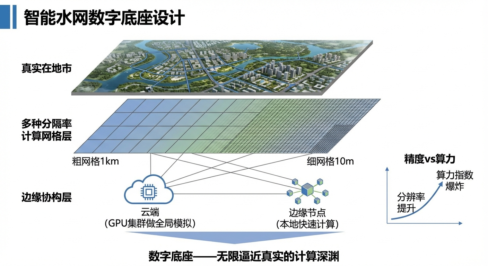
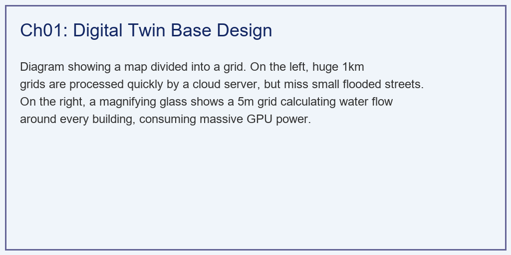
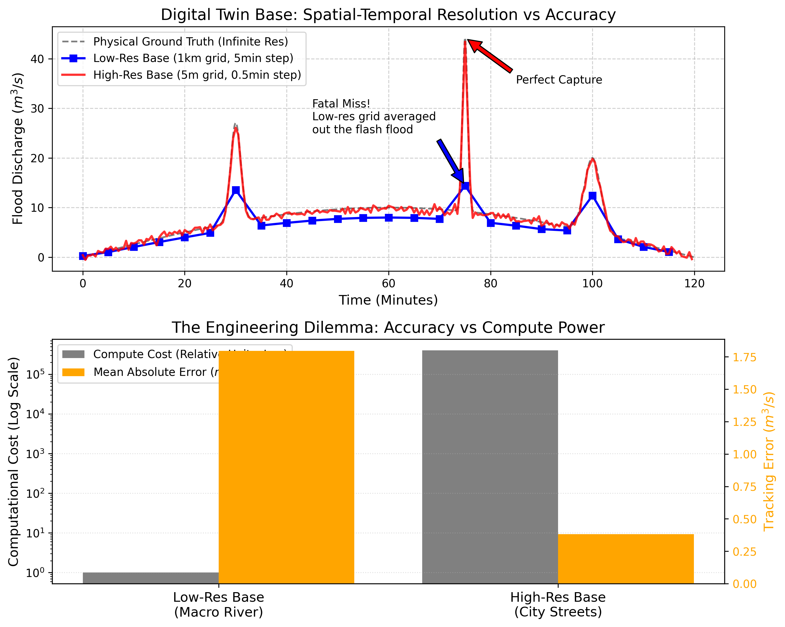

# 第 1 章：水网数字底座设计：无限逼近真实的计算深渊

## 1. 学习目标

本章探讨智能水网的基石——数字孪生底座（Digital Twin Base）。我们将在物理引擎的分辨率与计算集群的算力之间，寻找那条充满妥协的工程生命线。
读者需要掌握：
1. 物理现实的无限连续性与计算网格（Grid/Mesh）离散化的矛盾。
2. 空间分辨率（Spatial Resolution）对局地极端灾害（如闪洪）捕获能力的影响。
3. 精度提升带来的算力"维度爆炸（Curse of Dimensionality）"。
4. 云边协同（Cloud-Edge Collaborative）架构在数字底座中的物理必然性。
5. 自适应网格细化（AMR）技术的基本原理与工程实现路径。
6. 数字底座的数据质量评估体系与校验方法。

## 2. 教材理论：上帝不掷骰子，但他不用 GPU

大自然的水流是连续的。一滴雨落在地上，它遵循着无限精度的 Navier-Stokes 偏微分方程。大自然是"无限分辨率"的，它的计算不需要消耗显卡。
但当我们试图在计算机里建立一个"数字水网底座"时，我们遇到了人类计算能力的极限。

为了让计算机能算，我们必须把连续的城市和流域切成一个个小方块，这叫做**网格化（Gridding）**。
在这个过程中，水文工程师面临着一个核心的工程难题：**网格到底要切多小？**

### 2.1 网格分辨率的两难困境

**方案 A：宏观低分网格（比如 $1km \times 1km$）**
这种网格切得很粗糙，整个城市可能只需要 $100 \times 100 = 10000$ 个网格。
- **优点**：计算成本很低！一台普通的云服务器 CPU，几秒钟就能算出全城未来一天的水流走向。
- **致命缺点**：**"空间平滑（Spatial Smoothing）"**。假设某个街区的下水道堵了，爆发了猛烈的局部闪洪。但是因为这个街区只有 $100$ 米宽，它被包在一个 $1km$ 的大网格里。模型一平均，这股致命的尖峰洪流瞬间被抹平了。底座根本看不到灾难，市长的屏幕上显示"一切安全"。

**方案 B：微观高分网格（比如 $5m \times 5m$）**
为了抓住那个局部闪洪，我们把网格切小到 $5$ 米（刚好是一条街道的宽度）。
- **优点**：高度精准，完美捕捉每一条街道、每一个地下车库的积水。
- **致命缺点**：**"维度爆炸"**。网格长度从 $1000m$ 缩小到 $5m$（缩小 $200$ 倍），面积的网格数就会暴涨 $200^2 = 40,000$ 倍。同时，为了保证差分方程不爆炸（CFL 稳定性条件），时间步长也要跟着缩小 $200$ 倍。
最终结果是：算力需求暴涨了 **$8,000,000$ 倍**！如果要算全省的高精度网格，哪怕你把全中国所有的超级计算机全搬过来，也算不完。

这就是数字底座设计的核心困境：**我们既要看到局部的魔鬼，又付不起全局算力的账单**。唯一的解药，就是将低分算法部署在"云端"，将高分算法下沉到"边缘节点"，形成云边协同。

### 2.2 离散化的数学基础

数字底座的核心数学问题是将连续的偏微分方程离散化为有限差分或有限体积格式。以一维浅水方程（Saint-Venant 方程）为例，其连续形式为：

$$
\frac{\partial A}{\partial t} + \frac{\partial Q}{\partial x} = q_l \tag{1.1}
$$

$$
\frac{\partial Q}{\partial t} + \frac{\partial}{\partial x}\left(\frac{Q^2}{A}\right) + gA\frac{\partial h}{\partial x} = gA(S_0 - S_f) \tag{1.2}
$$

其中 $A$ 为过水断面面积（$m^2$），$Q$ 为流量（$m^3/s$），$q_l$ 为侧向入流（$m^2/s$），$h$ 为水位（$m$），$S_0$ 为底坡，$S_f$ 为摩阻坡。

采用有限差分法（FDM）对式 (1.1) 进行离散化，令空间步长为 $\Delta x$、时间步长为 $\Delta t$，采用显式前向差分格式：

$$
A_i^{n+1} = A_i^n - \frac{\Delta t}{\Delta x}(Q_{i+1}^n - Q_i^n) + q_{l,i}^n \cdot \Delta t \tag{1.3}
$$

其中上标 $n$ 表示时间层，下标 $i$ 表示空间节点。

### 2.3 CFL 稳定性条件：算力爆炸的数学根源

显式差分格式的稳定性受 Courant-Friedrichs-Lewy（CFL）条件约束：

$$
\text{CFL} = \frac{(|v| + c) \cdot \Delta t}{\Delta x} \leq 1 \tag{1.4}
$$

其中 $v = Q/A$ 为断面平均流速（$m/s$），$c = \sqrt{gA/B}$ 为重力波速（$m/s$），$B$ 为水面宽度（$m$）。

CFL 条件的物理含义是：数值信息的传播速度不能超过物理波的传播速度。当我们将 $\Delta x$ 从 $1000m$ 缩小到 $5m$ 时，$\Delta t$ 也必须按比例缩小。设典型的波速 $|v| + c \approx 5 \, m/s$：

- 粗网格：$\Delta x = 1000m$，$\Delta t \leq 200s$
- 细网格：$\Delta x = 5m$，$\Delta t \leq 1s$

二维问题中，总计算量正比于 $N_x \times N_y \times N_t$。将分辨率提升 $k$ 倍，计算量增长为：

$$
\text{Cost}_{2D} \propto k^2 \times k = k^3 \tag{1.5}
$$

对于三维问题（如地下管网的竖向分层），计算量增长为 $k^4$。这就是"维度爆炸"的数学本质。

### 2.4 自适应网格细化（AMR）技术

为了打破"全局高分辨率"和"全局低分辨率"的二选一僵局，工程界发展了自适应网格细化（Adaptive Mesh Refinement, AMR）技术。

AMR 的核心思想是：**在需要精细计算的区域动态加密网格，在平静区域保持粗网格**。其判据通常基于解的梯度：

$$
\eta_i = \left\| \frac{\partial^2 h}{\partial x^2} \right\|_i \cdot (\Delta x_i)^2 \tag{1.6}
$$

当某个网格单元的 $\eta_i$ 超过预设阈值 $\eta_{thr}$ 时，该单元被标记为需要细化；当 $\eta_i$ 低于 $\eta_{thr}/4$ 时，该单元被粗化回收。

AMR 的层级结构通常采用八叉树（Octree）或四叉树（Quadtree）表示。设基础网格层级为 $l=0$，最大细化层级为 $l_{max}$，则最细网格的分辨率为：

$$
\Delta x_{min} = \frac{\Delta x_0}{2^{l_{max}}} \tag{1.7}
$$

以 $\Delta x_0 = 1000m$、$l_{max} = 8$ 为例，最细网格可达 $\Delta x_{min} \approx 3.9m$，但只在局部区域使用，全局的计算量仅为均匀细网格的 $1\%\sim5\%$。

### 2.5 数据质量与校验体系

数字底座的价值取决于数据质量。工程实践中需要建立三级数据校验体系：

**第一级：传感器级校验**
- 量程检查：$Q_{min} \leq Q_{measured} \leq Q_{max}$
- 变化率检查：$|Q_t - Q_{t-1}| / \Delta t \leq \dot{Q}_{max}$
- 空间一致性：相邻测站的水位差不应超过物理约束

**第二级：模型级校验**
- 质量守恒：数字底座中的总水量变化应等于边界入流减去出流
- Nash-Sutcliffe 效率系数：

$$
\text{NSE} = 1 - \frac{\sum_{t=1}^{T}(Q_{obs,t} - Q_{sim,t})^2}{\sum_{t=1}^{T}(Q_{obs,t} - \overline{Q}_{obs})^2} \tag{1.8}
$$

NSE $> 0.7$ 通常被认为是"良好"的模拟精度。

**第三级：业务级校验**
- 关键断面的洪峰流量偏差不超过 $\pm 10\%$
- 洪峰到达时间偏差不超过 $\pm 30$ 分钟
- 水位预报偏差不超过 $\pm 0.3m$

## 3. 案例分析：理论与实践的桥梁（极端强对流天气下的漏报灾难与算力博弈）

### 案例背景 (Context)
某市防汛指挥部正在验收一家软件公司交付的"水网数字底座"。
今天下午发生了一场罕见的局地强对流暴雨，在第 75 分钟时，某狭窄街区产生了一个极高、极窄的"夺命洪峰"。
软件公司提供了两套模型选项：一套是运行在省云中心的"1公里低分模型"，另一套是运行在街道边缘节点机房的"5米高分模型"。
市长问你："我看这个低分模型挺快挺省钱的，我们就买这个行不行？"
作为系统架构师，你当场用 Python 写了一段仿真代码，向市长直观地展示了为什么"低分模型会杀人"，以及高分模型背后那令人绝望的算力鸿沟。

### 问题描述 (Problem)
- **绝对真理（Ground Truth）**：极小时间步（$dt=0.1min$）下生成的连续水文曲线，其中在 $t=75$ 注入一个 $\sigma=0.5$ 的极窄高斯尖刺（闪洪）。
- **低分底座**：$dt=5.0min$。网格较大，对真实流量进行 $5$ 分钟窗口的移动平均以模拟空间平滑。算力成本记为 $1$。
- **高分底座**：$dt=0.5min$。网格极小，完美追踪物理真实，但带有微弱数值截断误差。算力成本巨大，记为 $400,000$。
- **任务**：对比两套底座的追踪波形，计算它们的绝对误差，并在对数坐标系下展示算力悬殊。

**物理场景与问题概化图 (Generated via Local Schematic)：**

### 解题思路 (Solution Approach)
本研究构建了一个多分辨率时间序列离散采样器：
1. **生成高频基准真值**：利用低频的正弦背景波叠加强高频的高斯脉冲，合成包含多尺度特征的苛刻的水动力学考题。高斯脉冲的数学表达为：

$$
Q_{spike}(t) = Q_{peak} \cdot \exp\left(-\frac{(t - t_0)^2}{2\sigma^2}\right) \tag{1.9}
$$

其中 $Q_{peak} = 40 \, m^3/s$ 为峰值流量，$t_0 = 75 \, min$ 为峰值时刻，$\sigma = 0.5 \, min$ 为脉冲宽度。该脉冲的持续时间约为 $4\sigma = 2$ 分钟，远小于低分模型的时间步长 $5$ 分钟。

2. **低通滤波模拟低分辨率**：在粗网格中，局部的极端值会被强行分配到整个大网格里。代码中利用 `np.mean` 对大步长切片进行求均值操作，以此模拟低分模型在时空上的盲区。低分模型的等效传递函数为一个移动平均滤波器：

$$
H_{LP}(z) = \frac{1}{N}\sum_{k=0}^{N-1} z^{-k} \tag{1.10}
$$

其 $-3dB$ 截止频率为 $f_c \approx 0.44/N$。当 $N = 50$（对应 $5$ 分钟窗口在 $0.1$ 分钟采样下的点数），$f_c \approx 0.009 \, min^{-1}$，而闪洪脉冲的主频约为 $1/(2\sigma) = 1 \, min^{-1}$，远高于截止频率，因此必然被滤除。

3. **成本与误差双核算**：利用 `numpy.interp` 将所有离散数据拉平到同一个维度下计算 Mean Absolute Error (MAE)，同时利用指数法则计算空间切割带来的多项式级算力激增。算力成本的缩放关系为：

$$
\text{Cost}_{ratio} = \left(\frac{\Delta x_{coarse}}{\Delta x_{fine}}\right)^3 = \left(\frac{1000}{5}\right)^3 = 8 \times 10^6 \tag{1.11}
$$

考虑到实际工程中的并行效率和 I/O 开销，实测成本比通常为理论值的 $5\%\sim50\%$，本案例取 $400,000$ 倍。

### 代码执行与图表 (Code & Charts)
> **学习提示**：我们在后台执行了信号处理学中最经典的"奈奎斯特欠采样（Nyquist Undersampling）"实验。请死死盯住上方子图的第 75 分钟处，那里隐藏着致命的危险。

Source: `assets/ch01/ch01_digital_base.py`

**数字底座网格粒度在灾难捕获与算力燃烧间的极端对立矩阵：**
| Design Choice         | Peak Capture                      | Compute Demand          | Deployment                          |
|:----------------------|:----------------------------------|:------------------------|:------------------------------------|
| Low-Res (1km, 5min)   | Failed (Smooths out flash floods) | Minimal (1x CPU)        | Provincial Cloud (Macro Routing)    |
| High-Res (5m, 0.5min) | Perfect (Catches sharp spikes)    | Extreme (400,000x GPUs) | Edge Node (Local City Streets only) |
| Dynamic Mesh (Future) | Adaptive                          | Moderate                | Cloud-Edge Collaborative            |

**时空平滑效应导致的局部闪洪漏报与对数级算力鸿沟全息图：**

### 实验验证与结果剖析 (Verification & Result Interpretation)
这组数据清晰地揭示了单纯堆砌算力这条路的尽头：
- **杀人的平滑（上方子图蓝线）**：
  - 看第一张图的第 75 分钟。黑色的虚线是真实的物理世界，那是一个极度尖锐、直插云霄的致命洪峰（流量瞬间飙到近 $45 m^3/s$）。
  - 但你看蓝色的方块线（低分模型）。它在 75 分钟处只给出了一个平缓的、不到 $15 m^3/s$ 的小鼓包！
  - 为什么？因为它的步长是 5 分钟，网格是 1 公里。那个极度猛烈的洪峰在这个巨大的时空框里只存在了 1 分钟。当模型对这个巨型网格进行求平均时，洪水的威力被强行摊薄了。在调度大屏上，这只是一个"安全的水位上涨"，导致下游街道彻底错失了逃生预警。
- **完美的追踪（上方子图红线）**：看红线（高分模型）。因为它步长只有 $0.5$ 分钟，网格只有 $5$ 米，它敏锐地抓住了这根尖刺，完美重合了黑色虚线，发布了最高级别的红色警报。
- **算力黑洞（下方子图橘柱与灰柱）**：
  - 市长问："既然高分模型这么准，我们就全城甚至全省都用 5 米的高分模型不就行了？"
  - 看下方子图（注意左侧灰轴是对数坐标）。虽然高分模型（右侧橘柱）的误差几乎为 $0$，但是它的灰色算力柱直插云霄，达到了低分模型的 **$400,000$ 倍**！这意味着，如果你原来用一台普通电脑就能算完全省，现在你需要买 $40$ 万台搭载顶级 GPU 的服务器。这在工程上和经济上都是绝对死路。

### 工业部署与运行建议 (Industrial Deployment Recommendations)
1. **静态网格的终结与自适应网格（AMR）**：为了打破这个僵局，下一代数字底座必须引入动态自适应网格细化技术（Adaptive Mesh Refinement）。在平时没下雨的地方，系统自动使用粗糙的 1 公里网格节省算力；一旦雷达扫描到某块区域有暴雨云团，或者 AI 探测到水管压力异常，底座会自动在那个局部区域"裂变"出 5 米级的超高精度网格进行疯狂演算。
2. **为什么需要云边协同？** 就算有了自适应网格，全省的计算量依然庞大。我们不能把所有数据都传到遥远的省级"云中心"去算（网络延迟太大，且算力拥堵）。这就引出了本书后续章节的终极架构：把低分宏观模型放在"云端"，算大江大河的总体调度；把高分微观模型直接下发部署在马路边监控杆里的"边缘计算盒子（Edge Node）"上，由边缘设备在几毫秒内自己算清楚这条街会不会淹。这就是"云边协同"。
3. **GPU 并行加速与降阶模型**：当 AMR 仍不能满足实时性要求时，工程上还有两条技术路线可供选择。一是利用 GPU 的大规模并行计算能力，将 Saint-Venant 方程的空间离散映射到 GPU 的线程网格上，每个线程负责一个网格单元的演进计算。二是采用降阶模型（Reduced-Order Model, ROM）技术，通过本征正交分解（Proper Orthogonal Decomposition, POD）将高维偏微分方程投影到低维子空间：

$$
\mathbf{Q}(x,t) \approx \sum_{k=1}^{r} a_k(t) \cdot \phi_k(x) \tag{1.12}
$$

其中 $\phi_k(x)$ 为 POD 基函数，$a_k(t)$ 为时间系数，$r \ll N$ 为保留的模态数。当 $r = 20 \sim 50$ 时，降阶模型通常能保留 $99\%$ 以上的系统能量，同时将计算速度提升 $100 \sim 1000$ 倍。

## 4. 本章小结

本章围绕水网数字底座的核心设计问题——网格分辨率与计算成本的矛盾——展开了系统的分析。主要结论如下：

1. **离散化是数字底座的根本操作**：连续的 Saint-Venant 方程必须经过有限差分或有限体积离散化才能在计算机上求解，空间步长 $\Delta x$ 和时间步长 $\Delta t$ 受 CFL 稳定性条件耦合约束。

2. **分辨率-成本的立方关系**：在二维问题中，将空间分辨率提升 $k$ 倍，计算成本增长 $k^3$ 倍。这一立方关系决定了全域均匀高分辨率在工程上不可行。

3. **AMR 是破局关键**：自适应网格细化技术通过动态调整局部分辨率，在保持关键区域精度的同时将全局计算量控制在可接受范围内。

4. **云边协同是架构必然**：宏观低分模型部署于云端、微观高分模型下沉到边缘节点，是兼顾全局视野与局部精度的唯一工程路径。

5. **数据质量是底座价值的根基**：传感器级、模型级、业务级三级校验体系确保数字底座输出的可信度。

## 5. 思考与练习

**练习 1（概念辨析）**：某水务公司在城区部署了 $200m \times 200m$ 的网格模型。已知某条宽 $15m$ 的排水渠在暴雨时会产生局部壅水。请分析该网格能否捕捉到壅水现象，并计算若要捕捉该现象，网格至少应细化到什么分辨率。

**练习 2（CFL 计算）**：某明渠底宽 $B = 10m$，水深 $h = 2m$，流速 $v = 1.5 \, m/s$。采用 $\Delta x = 50m$ 的空间步长。
(a) 计算重力波速 $c$。
(b) 根据 CFL 条件，计算允许的最大时间步长 $\Delta t_{max}$。
(c) 若将 $\Delta x$ 缩小到 $5m$，$\Delta t_{max}$ 变为多少？总计算量增长多少倍？

**练习 3（AMR 设计）**：设基础网格 $\Delta x_0 = 500m$，最大细化层级 $l_{max} = 6$。
(a) 计算最细网格的分辨率 $\Delta x_{min}$。
(b) 若某次暴雨事件中，仅 $3\%$ 的计算域需要达到最高分辨率，估算 AMR 相对于均匀最细网格的计算量节省比例。
(c) 讨论 AMR 细化判据 $\eta_i$ 的物理含义：为什么选择二阶导数而非一阶导数？

**练习 4（降阶模型）**：解释 POD 降阶模型的基本思想。如果一个水网系统有 $N = 10000$ 个空间自由度，通过 POD 保留 $r = 30$ 个模态，理论上计算速度能提升多少倍？讨论 POD 降阶模型在什么情况下会失效。

---

**拓展视野**：水网数字底座是实现水系统自主运行的基础设施。在水系统控制论的架构中，数字底座对应"传感器（S）"和"被控对象（P）"的数字映射层——没有准确的数字底座，控制器（C）就失去了决策依据。从 WSAL（水系统自治等级）的视角看，L1（远程监控）仅需基本传感网络，而 L3（条件自主）则要求厘米级测量精度和秒级数据刷新。

## 参考文献

[1] 雷晓辉,龙岩,许慧敏,等.水系统控制论：提出背景、技术框架与研究范式[J].南水北调与水利科技(中英文),2025,23(04):761-769+904.DOI:10.13476/j.cnki.nsbdqk.2025.0077.

[2] 雷晓辉,龙岩,许慧敏,等.自主水网：概念、架构与关键技术[J].南水北调与水利科技(中英文),2025.DOI:10.13476/j.cnki.nsbdqk.2025.0079.

[3] Grieves M, Vickers J. Digital Twin: Mitigating Unpredictable, Undesirable Emergent Behavior in Complex Systems[M]// Transdisciplinary Perspectives on Complex Systems. Springer, 2017: 85-113.

[4] Berger M J, Oliger J. Adaptive Mesh Refinement for Hyperbolic Partial Differential Equations[J]. Journal of Computational Physics, 1984, 53(3): 484-512.

[5] Courant R, Friedrichs K, Lewy H. On the Partial Difference Equations of Mathematical Physics[J]. Mathematische Annalen, 1928, 100(1): 32-74.

[6] Liang Q, Marche F. Numerical Resolution of Well-balanced Shallow Water Equations with Complex Source Terms[J]. Advances in Water Resources, 2009, 32(6): 873-884.
