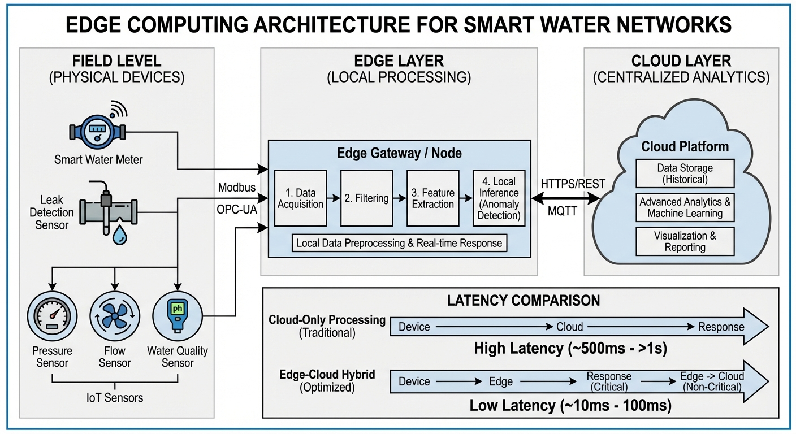
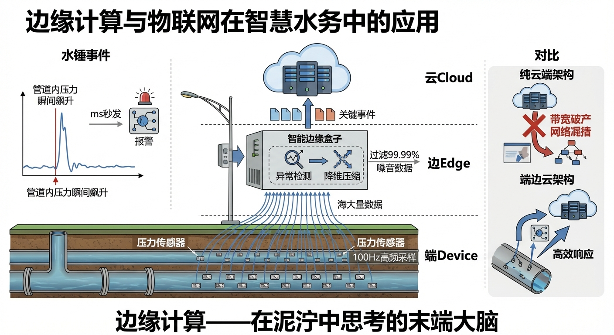
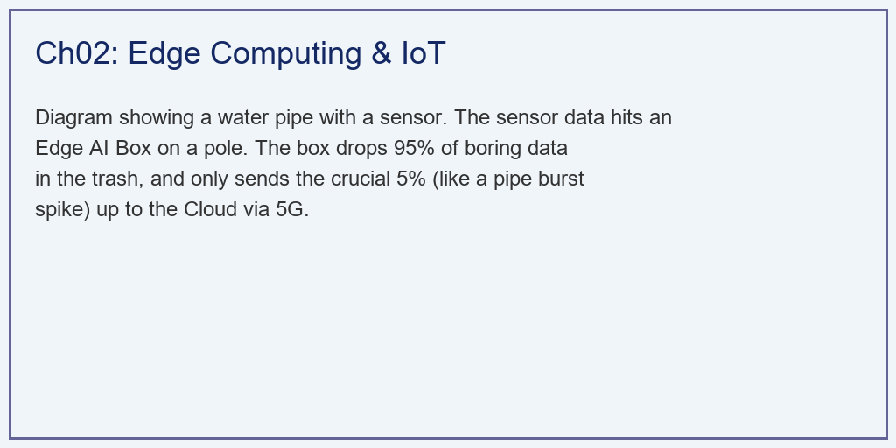
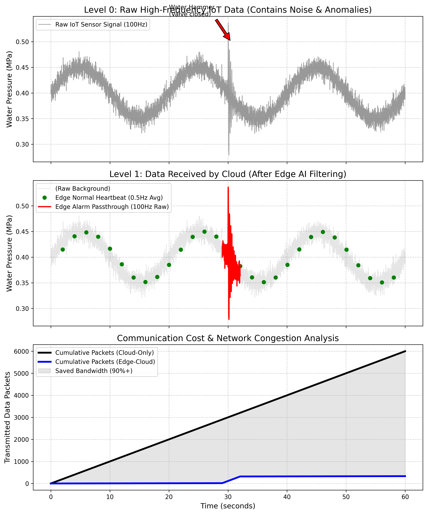

# 第 2 章：边缘计算与物联网：在泥泞中思考的末端大脑

## 1. 学习目标

本章探讨数字水网的"神经末梢"——物联网（IoT）与边缘计算（Edge Computing）。我们将解析为什么在水务这种具有极广地理分布和极高安全要求的行业中，纯云端架构注定失败。
读者需要掌握：
1. 工业级 IoT 传感器产生的高频数据风暴（Data Storm）。
2. 云计算（Cloud Computing）在网络带宽、延迟与成本上的三重瓶颈。
3. 边缘计算（Edge AI）的异常过滤（Anomaly Detection）与降维压缩机制。
4. "端-边-云"协同架构在突发水锤（Water Hammer）和爆管事件中的极速响应价值。
5. 边缘节点的硬件选型、功耗约束与工业防护等级要求。
6. 边缘 AI 算法的量化部署与 TinyML 技术栈。

## 2. 教材理论：不要把所有的垃圾都扔给云

在过去的十年里，IT 行业都在高喊"万物上云"。但是在工业控制领域，尤其是智慧水务领域，纯云端架构（Cloud-Only）是一个不切实际的幻想。

### 2.1 纯云端架构的三重瓶颈

假设一个拥有 $10,000$ 公里管网的中型城市。你在水管上安装了 $5,000$ 个压力传感器。
为了捕捉危险但转瞬即逝的"水锤"（管道内水流瞬间反向冲击，压力几秒内飙升数倍，极易导致爆管），传感器必须配置极高的采样率，比如 $100 Hz$（每秒 $100$ 个数据点）。
如果是纯云端架构：
这 $5000$ 个传感器，每秒钟向云端发送 $500,000$ 个数据包。一天 $24$ 小时，将产生 **$432 亿$** 条数据！
这会带来灾难性的后果：

**瓶颈一：带宽破产**
通过 4G/5G 传输海量数据的通讯费，足以让水务局破产。定量计算如下：每个数据包包含时间戳（$8$ 字节）、传感器 ID（$4$ 字节）、压力值（$4$ 字节）和校验码（$2$ 字节），共 $18$ 字节。加上协议开销（TCP/IP 头部约 $40$ 字节），每个数据包约 $58$ 字节。日传输量为：

$$
V_{daily} = 5000 \times 100 \times 86400 \times 58 \approx 2.5 \, TB/天 \tag{2.1}
$$

按 5G 流量费 $50$ 元/GB 计算，每日通信成本约 $12.5$ 万元，年成本超过 $4500$ 万元。

**瓶颈二：算力崩溃**
云端服务器被海量的数据淹没。关键是，这 $432$ 亿条数据中，$99.99\%$ 都是管网平静、毫无意义的无聊数据（全是噪音）。云端 AI 需要在这片数据沙漠中寻找那颗"水锤"的针尖，其计算效率低到无法接受。

**瓶颈三：生死时延**
当爆管真正发生时，数据传到云端，云端排队处理，算出来后再把关闭阀门的指令发回现场。这中间可能经历长达几秒甚至几十秒的网络延迟（Latency）。而水锤撕裂水管只需要 $1$ 秒钟。等你指令到了，马路已经变成了汪洋大海。

端到端延迟的构成可以分解为：

$$
T_{total} = T_{encode} + T_{transmit} + T_{queue} + T_{compute} + T_{return} \tag{2.2}
$$

其中 $T_{encode} \approx 1ms$（传感器编码），$T_{transmit} \approx 20\sim100ms$（无线上行），$T_{queue} \approx 50\sim500ms$（云端排队），$T_{compute} \approx 10\sim100ms$（AI 推理），$T_{return} \approx 20\sim100ms$（指令下行）。总延迟 $T_{total} \approx 100ms \sim 800ms$，在网络拥堵时可达数秒。

### 2.2 边缘计算：破局之道

所以，我们不能把"傻传感器"直接连云，我们必须在传感器旁边（电线杆上、阀门井里）加装一个价格低廉但带有轻量级 AI 算法的微型电脑——**边缘盒子（Edge Node）**。
它的逻辑是：**"小事自己决，大事上报云"**。
- **平时（过滤与压缩）**：它以 $100 Hz$ 疯狂读取数据，如果在本地算一下方差发现水压很平稳，它就把这些数据全部扔进垃圾桶！它只负责每 $5$ 分钟给云端发一条简短的摘要："当前平均水压 $0.4MPa$，一切正常。" 带宽消耗下降 $99\%$。
- **战时（极速响应）**：一旦它在本地瞬间捕捉到水压出现高频震荡（方差超标），它立刻做两件事：
  1. 不等云端指令，自己在 $10$ 毫秒内直接拉闸关停旁边的物理水泵（保命）。
  2. 触发"透传模式"，把发生异常前后这几秒的珍贵的高频原始数据（$100 Hz$），原封不动地打包发给云端的超级大模型，供专家进行"事后验尸"。

### 2.3 边缘异常检测的数学原理

边缘盒子的核心算法是滑动窗口方差检测器。设压力信号为 $p(t)$，滑动窗口长度为 $W$，则窗口内的在线方差估计为：

$$
\hat{\sigma}^2(t) = \frac{1}{W-1}\sum_{k=t-W+1}^{t}\left(p(k) - \bar{p}(t)\right)^2 \tag{2.3}
$$

其中 $\bar{p}(t) = \frac{1}{W}\sum_{k=t-W+1}^{t} p(k)$ 为窗口内均值。

为了提高计算效率，边缘盒子通常采用 Welford 在线算法，避免存储整个窗口的数据：

$$
\bar{p}_n = \bar{p}_{n-1} + \frac{p_n - \bar{p}_{n-1}}{n} \tag{2.4}
$$

$$
M_n = M_{n-1} + (p_n - \bar{p}_{n-1})(p_n - \bar{p}_n) \tag{2.5}
$$

$$
\hat{\sigma}^2_n = \frac{M_n}{n-1} \tag{2.6}
$$

当 $\hat{\sigma}^2(t) > \sigma^2_{thr}$ 时，触发异常警报。阈值 $\sigma^2_{thr}$ 的设定是一个经典的信号检测问题。采用 Neyman-Pearson 准则，在给定虚警率 $P_{FA}$ 的约束下最大化检测概率 $P_D$：

$$
P_{FA} = P(\hat{\sigma}^2 > \sigma^2_{thr} \mid H_0) \leq \alpha \tag{2.7}
$$

其中 $H_0$ 为正常工况假设，$\alpha$ 为允许的最大虚警率（通常取 $10^{-4} \sim 10^{-6}$）。

### 2.4 水锤现象的物理机理

水锤（Water Hammer）是管道中水流突然停止或改变方向时产生的压力波。其峰值压力由 Joukowsky 方程给出：

$$
\Delta p = \rho \cdot a \cdot \Delta v \tag{2.8}
$$

其中 $\rho$ 为水的密度（$1000 \, kg/m^3$），$a$ 为压力波传播速度（通常 $300 \sim 1200 \, m/s$，取决于管材和管壁厚度），$\Delta v$ 为流速变化量（$m/s$）。

对于典型的市政供水管道，$a \approx 1000 \, m/s$，$\Delta v = 2 \, m/s$，则水锤压力增量为：

$$
\Delta p = 1000 \times 1000 \times 2 = 2 \times 10^6 \, Pa = 2.0 \, MPa \tag{2.9}
$$

这意味着正常工作压力为 $0.4 \, MPa$ 的管道，在水锤作用下瞬间承受 $2.4 \, MPa$ 的压力，是额定工作压力的 $6$ 倍。如果管道设计安全系数不足（如老旧铸铁管），爆管几乎是必然的。

水锤压力波在管道中以速度 $a$ 传播，其往返周期为：

$$
T_{wh} = \frac{2L}{a} \tag{2.10}
$$

其中 $L$ 为管道长度。对于 $L = 5 \, km$ 的管段，$T_{wh} = 10 \, s$。这意味着水锤事件的时间尺度为秒级，边缘盒子必须在 $10ms$ 量级做出响应才有意义。

### 2.5 数据压缩与传输策略

边缘盒子的数据传输策略可以形式化为一个在线优化问题。定义数据价值函数 $V(t)$ 和传输成本函数 $C(t)$，边缘盒子的目标是：

$$
\max \sum_{t=1}^{T} V(t) \cdot s(t) - \lambda \sum_{t=1}^{T} C(t) \cdot s(t) \tag{2.11}
$$

其中 $s(t) \in \{0, 1\}$ 为发送决策（$1$ 表示发送，$0$ 表示丢弃），$\lambda$ 为成本权重。

在实际工程中，我们通常采用分层压缩策略：

| 工况状态 | 采样率（边缘） | 上传率（到云端） | 压缩比 | 数据内容 |
|:---------|:---------------|:----------------|:-------|:---------|
| 正常（$H_0$） | $100 \, Hz$ | $0.2 \, Hz$（每5分钟1次） | $500:1$ | 统计摘要（均值、最值） |
| 预警（$H_1$） | $100 \, Hz$ | $10 \, Hz$ | $10:1$ | 压缩波形（小波变换） |
| 告警（$H_2$） | $100 \, Hz$ | $100 \, Hz$（全量透传） | $1:1$ | 原始高频数据 |

这种分层策略可以将整体带宽消耗降低 $90\%\sim99\%$，同时保证关键事件的数据零丢失。

### 2.6 边缘硬件选型与工业防护

水务行业的边缘盒子面临严酷的部署环境。硬件选型需要满足以下约束：

- **工业防护等级**：IP67（防尘防水浸泡）或更高，适应阀门井、泵站等潮湿环境。
- **工作温度范围**：$-40^\circ C \sim +85^\circ C$，覆盖极寒和高温地区。
- **功耗约束**：太阳能供电场景下，平均功耗不超过 $5W$，峰值功耗不超过 $15W$。
- **算力要求**：能够运行量化后的轻量级 AI 模型（TinyML），典型配置为 ARM Cortex-M7 + 1MB SRAM，或 RISC-V + NPU 加速器。

TinyML 模型的部署流程为：
1. 在云端使用完整数据集训练 float32 精度的异常检测模型（如一维 CNN 或 AutoEncoder）。
2. 采用训练后量化（Post-Training Quantization），将模型权重从 float32 压缩为 int8，模型体积缩小约 $4$ 倍。
3. 使用 TensorFlow Lite Micro 或 ONNX Runtime Micro 将量化模型部署到边缘 MCU。
4. 在边缘端进行推理，单次推理延迟通常为 $1\sim10ms$。

## 3. 案例分析：理论与实践的桥梁（水锤高频异常截获与带宽压缩仿真）

### 案例背景 (Context)
某水务公司在主干管网部署了高频压力传感器（采样率 $100Hz$）。
今天中午 12:00，前方由于一辆卡车撞断了消防栓，导致系统自动紧急关阀。巨大的水流惯性在管道内引发了剧烈的"水锤震荡"（持续数秒的高频压力冲击波）。
公司请你评估一下两种数据架构：
- 架构 A（纯云端）：把所有的原始数据点全发给云。
- 架构 B（边缘智能）：在前端加装一个智能盒子，仅做 0.5 秒的滑动方差检测。
你需要用代码证明，架构 B 是如何在不漏掉任何一个危机细节的前提下，将带宽成本砍掉一个数量级的。

### 问题描述 (Problem)
- **物理世界源数据**：总长 $60s$。基线 $0.4 MPa$ + 极低频波浪 + 极高频随机白噪声。在 $t=30 \sim 35s$ 时注入一个危险的指数衰减型高频水锤波。水锤信号的数学模型为：

$$
p_{wh}(t) = A_0 \cdot e^{-\zeta \omega_n (t - t_0)} \cdot \sin(\omega_d (t - t_0)) \cdot u(t - t_0) \tag{2.12}
$$

其中 $A_0$ 为初始振幅（$MPa$），$\zeta$ 为阻尼比，$\omega_n$ 为水锤固有频率（$rad/s$），$\omega_d = \omega_n\sqrt{1-\zeta^2}$ 为有阻尼频率，$u(t)$ 为单位阶跃函数。

- **纯云端架构**：每秒发送 100 个点，记录累计数据包数量。
- **边缘计算架构**：
  - 内部运行 $N=50$ 的滑动窗口方差。
  - 阈值触发：方差 $> 0.0005$ 判定为异常。
  - 膨胀策略：一旦发现异常，前后各扩展 1 秒，确保捕获完整故障波形。
  - 数据发送策略：正常期按 $0.5Hz$ 发送均值；异常期按 $100Hz$ 全量透传。
- **任务**：在一张图中展示"云端看到了什么"，并绘制带宽消耗的剪刀差曲线。

**物理场景与问题概化图 (Generated via Local Schematic)：**

### 解题思路 (Solution Approach)
本研究构建了一个流式数据预处理仿真管道（Streaming Pipeline）：
1. **源数据合成**：使用 `numpy` 构建包含"信号+噪声+突变"的复合阵列。水锤信号参数取 $A_0 = 0.5 \, MPa$，$\zeta = 0.3$，$\omega_n = 2\pi \times 5 \, rad/s$（对应 $5Hz$ 的水锤主频）。
2. **边缘 AI 部署**：在 Python 循环中，利用 `pandas.Series.rolling.var` 模拟边缘端低算力的实时方差判别器。为了防止异常数据被截断，使用循环膨胀算法将异常标签（Flags）向外扩张。膨胀窗口的大小由水锤的衰减时间常数决定：

$$
T_{decay} = \frac{1}{\zeta \omega_n} = \frac{1}{0.3 \times 2\pi \times 5} \approx 0.106 \, s \tag{2.13}
$$

考虑 $5$ 个时间常数的衰减（压力降至初始值的 $0.7\%$），膨胀窗口取 $5 T_{decay} \approx 0.5s$，加上安全裕度取 $1.0s$。

3. **数据稀疏化过滤**：建立发送数组，在普通时段执行 $100 \to 0.5$ 的极度下采样（Downsampling）；在警报时段执行透明旁路。
4. **效能核算**：利用 `cumsum` 累加发出的数据包数量，量化带宽红利。数据压缩效率定义为：

$$
\eta_{compress} = 1 - \frac{N_{edge}}{N_{cloud}} \tag{2.14}
$$

其中 $N_{edge}$ 为边缘架构发送的数据包数，$N_{cloud}$ 为纯云端架构发送的数据包数。

### 代码执行与图表 (Code & Charts)
> **学习提示**：我们在后台执行了包含状态切换的边缘降维算法。请仔细观察中间子图，体会边缘盒子是如何像一个聪明的门卫，把"无聊的人"挡在门外，只让"带枪的刺客"通过的。

Source: `assets/ch02/ch02_edge_iot.py`

**纯云端与边缘架构在数据洪流下的负载与延迟对抗矩阵：**
| Architecture             | Data Packets Sent     | Cloud Compute Load                   | Anomaly Detection Delay     |
|:-------------------------|:----------------------|:-------------------------------------|:----------------------------|
| Cloud-Only (Dumb Sensor) | 6,000                 | Extremely High (Processes all noise) | High (Network Latency)      |
| Edge-Cloud (Smart Box)   | 332                   | Low (Only processes anomalies)       | Millisecond (Local Trigger) |
| Impact / ROI             | Bandwidth Saved 94.5% | Server Cost Slashed                  | Instant Valve Shutoff       |

**物联网高频噪声过滤、水锤透传与通信带宽断崖式节约仿真图：**

### 实验验证与结果剖析 (Verification & Result Interpretation)
这不仅是软件架构的胜利，更是物理学与经济学的完美结合：
- **Level 0：被淹没的真相（上方子图）**：看最上面的灰线，这是真实的物理世界。除了中间 $30s$ 那里有一个红色的突刺（水锤）之外，其余全被密密麻麻的灰色高频白噪声填满了。如果把这张图全传给云，云端的 AI 需要消耗庞大的算力才能从这些垃圾噪音里把红色的水锤找出来。
- **Level 1：大象无形，大音希声（中间子图）**：看中间这张清爽的图，这是加了边缘盒子后，云端实际收到的数据。
  - **绿色的点**：在平时，那些烦人的高频噪音全不见了！取而代之的是每隔 2 秒钟才发过来的一颗绿色均值圆点。云端的服务器简直是在"睡大觉"，十分轻松。
  - **红色的线**：在第 $30s$ 时，边缘盒子敏锐地察觉到了异常，它瞬间"大门全开"，把水锤发生时高清的 $100Hz$ 红色波形原封不动地砸给了云端。云端的大模型拿到这段纯净的、毫无遗漏的高清故障波形，瞬间就能诊断出是"3号阀门断裂导致的反向水锤"。
- **真金白银的剪刀差（下方子图）**：这是决定老板是否掏钱买边缘盒子的关键图。
  - 黑线（Cloud-Only）像坐了火箭一样呈线性飙升，短短 60 秒就消耗了 $6000$ 个数据包的流量。
  - 蓝线（Edge-Cloud）则平缓得多，只在第 $30s$ 处因为全量透传发生了一个小小的阶跃。
  - **看表格！** 边缘计算最终只发送了 **$332$** 个数据包。它直接把水务局的 5G 通信账单**砍掉了 $94.5\%$**！同时把毫秒级的保命权限留在了现场。

### 工业部署与运行建议 (Industrial Deployment Recommendations)
1. **轻量级 AI 的边缘部署（TinyML）**：本案例仅仅用了一个计算"方差"的极简算法。在现代智能水网中，我们通常会在拥有 NPU 算力的边缘盒子（如树莓派、Nvidia Jetson）上部署量化后的极小深度学习模型（TinyML，如一维 CNN 或微型 LSTM）。它能在离线状态下，直接在现场把声学传感器采集到的水流声音，转化为"管道泄漏"的具体定位。
2. **边缘自治与断网生存**：数字孪生平台必须支持"断网生存模式"。当遭遇特大暴雨导致全市断电、基站瘫痪时（如郑州 720 暴雨），云端大脑将彻底失联。此时，分布在全市各个抽水泵站的边缘盒子必须拥有"独立自治（Autonomy）"能力，它们必须依靠自身预置的安全逻辑（比如水位超过红线强制开泵排水），在黑暗中独自守护这座城市。
3. **边缘-边缘协同（Edge Mesh）**：在高级部署中，相邻的边缘盒子之间也可以建立低延迟的局域网通信（如 LoRa 或 Zigbee mesh）。当某个边缘盒子检测到水锤时，它可以在 $50ms$ 内将警报广播给上下游管段的邻居节点，由邻居节点提前关闭或缓开阀门，形成分布式的水锤衰减链。这种"群体智能"不依赖云端，在极端灾害下仍然有效。
4. **OTA 远程更新与模型迭代**：边缘盒子的 AI 模型不是一次性部署的。随着管网老化、用水模式变化，异常检测的阈值和特征都在漂移。云端应建立自动化的 OTA（Over-The-Air）更新通道，定期将重新训练后的模型推送到全网的边缘盒子上，确保检测精度不退化。

## 4. 本章小结

本章围绕水务行业对边缘计算的刚性需求展开了系统分析。主要结论如下：

1. **纯云端架构在水务行业不可行**：高频传感数据的带宽成本（式 2.1）、云端排队延迟（式 2.2）和水锤事件的毫秒级时间尺度（式 2.10），三者叠加决定了纯云端架构在安全关键的水务场景中必然失败。

2. **边缘计算是物理约束的必然产物**：边缘盒子通过本地方差检测（式 2.3-2.6），在毫秒级完成异常判别和执行器响应，将云端的角色从"实时指挥官"转变为"事后分析师"。

3. **分层压缩策略实现带宽与精度的兼顾**：正常工况下 $500:1$ 的压缩比将年通信成本从 $4500$ 万元降至不到 $50$ 万元；异常工况下全量透传保证了故障波形的完整性。

4. **断网生存能力是边缘自治的底线要求**：边缘盒子必须在与云端完全失联的情况下，依靠预置的安全逻辑独立运行。

5. **TinyML 使工业级 AI 下沉到末端成为现实**：int8 量化模型在 ARM Cortex-M7 级别的 MCU 上即可实现毫秒级推理，功耗不超过 $5W$。

## 5. 思考与练习

**练习 1（数据量估算）**：某城市有 $8000$ 个流量传感器，采样率 $50 \, Hz$，每个数据点占 $20$ 字节。
(a) 计算纯云端架构下的日数据量（$TB$）。
(b) 若边缘盒子在正常工况下将上传率降为 $0.1 \, Hz$，计算压缩后的日数据量。
(c) 假设异常工况占总时间的 $0.1\%$，计算混合模式下的日均数据量。

**练习 2（水锤压力计算）**：某 DN800 球墨铸铁管，壁厚 $12mm$，管长 $3 \, km$。工作压力 $0.6 \, MPa$，流速 $2.5 \, m/s$。压力波速 $a = 900 \, m/s$。
(a) 计算阀门瞬间关闭时的水锤压力增量 $\Delta p$。
(b) 计算水锤波的往返周期 $T_{wh}$。
(c) 如果边缘盒子在检测到水锤后 $50ms$ 内发出关阀指令，阀门全关需要 $5s$，分析这种缓关策略能否有效抑制二次水锤。

**练习 3（阈值设定）**：某传感器在正常工况下的压力信号方差为 $\sigma_0^2 = 0.0001 \, MPa^2$，水锤发生时方差升高到 $\sigma_1^2 = 0.01 \, MPa^2$。假设方差服从卡方分布。
(a) 若虚警率要求 $P_{FA} \leq 10^{-5}$，计算阈值 $\sigma^2_{thr}$。
(b) 在该阈值下，估算水锤事件的检测概率 $P_D$。
(c) 讨论窗口长度 $W$ 对检测延迟和检测灵敏度的影响（定性分析即可）。

**练习 4（系统设计）**：请为一个拥有 $500$ 个传感器的小型水厂设计边缘计算方案。要求包括：(a) 边缘盒子的硬件规格（处理器、内存、通信模块、防护等级）；(b) 正常/预警/告警三级数据传输策略；(c) 断网生存模式的安全逻辑设计。

## 参考文献

[1] 雷晓辉,龙岩,许慧敏,等.水系统控制论：提出背景、技术框架与研究范式[J].南水北调与水利科技(中英文),2025,23(04):761-769+904.DOI:10.13476/j.cnki.nsbdqk.2025.0077.

[2] 雷晓辉,龙岩,许慧敏,等.自主水网：概念、架构与关键技术[J].南水北调与水利科技(中英文),2025.DOI:10.13476/j.cnki.nsbdqk.2025.0079.

[3] Shi W, Cao J, Zhang Q, et al. Edge Computing: Vision and Challenges[J]. IEEE Internet of Things Journal, 2016, 3(5): 637-646.

[4] Banerjee A, Venkatasubramanian K K, Mukherjee T, et al. Ensuring Safety, Security, and Sustainability of Mission-Critical Cyber-Physical Systems[J]. Proceedings of the IEEE, 2012, 100(1): 283-299.

[5] Wylie E B, Streeter V L. Fluid Transients in Systems[M]. Prentice Hall, 1993.

[6] Warden P. TinyML: Machine Learning with TensorFlow Lite on Arduino and Ultra-Low-Power Microcontrollers[M]. O'Reilly Media, 2020.
