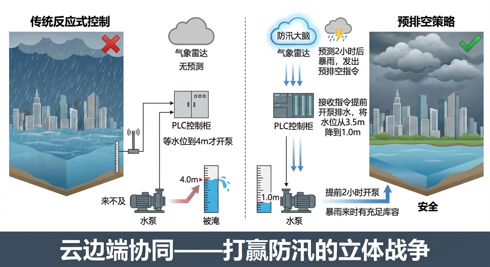
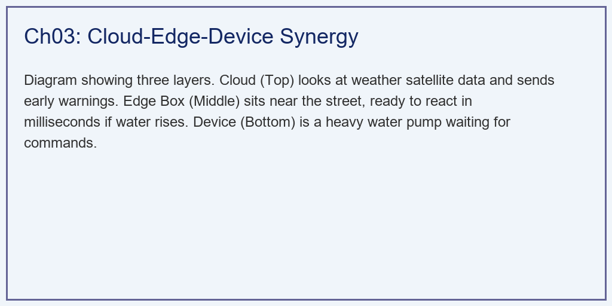
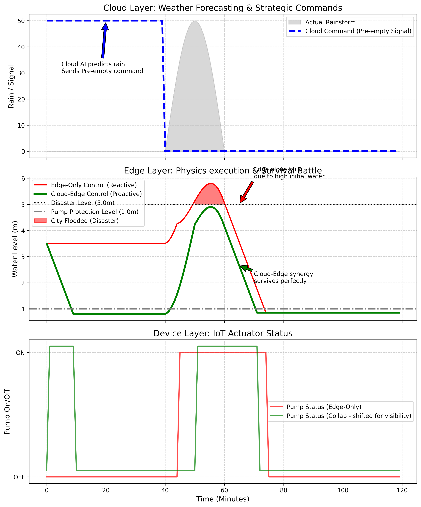

# 第 3 章：云边端协同调度：打赢防汛的"立体战争"

## 1. 学习目标

本章探讨数字水网系统中最宏大、最复杂的系统架构——"云-边-端"协同（Cloud-Edge-Device Synergy）。我们将揭示在面对特大自然灾害时，这三层架构是如何分工、互补，最终挽救一座城市的。
读者需要掌握：
1. 端层（Device）：水泵、闸门等物理执行机构的局限性。
2. 边层（Edge）：PLC 或智能边缘盒子的"绝对可靠性"与"短视"。
3. 云层（Cloud）：省级/市级防汛大脑的"上帝视角"与"网络脆弱性"。
4. **协同战术（预排空）**：如何利用云端的预知能力，打破边缘层的物理极限。
5. 模型预测控制（MPC）在预排空策略中的数学建模与求解。
6. 云边端三层架构的信息流设计与故障降级机制。

## 2. 教材理论：防汛是一场"信息战"

### 2.1 传统反应式控制的致命缺陷

在传统的城市防汛中，排水泵站是各自为战的。
一个装有水泵（**端 Device**）的地下车库，它的墙上挂着一个可靠的控制柜（**边 Edge**）。
这个控制柜的逻辑是写死的（叫做 Reactive Control 反应式控制）：
> "只有当车库水位漫过 $4.0m$ 时，我才开泵；当水位低于 $1.0m$ 时，我关泵防干烧。"

用控制论的语言描述，这是一个带有滞回特性的开关控制器：

$$
u(t) = \begin{cases} 1 & \text{if } h(t) \geq h_{on} = 4.0m \\ 0 & \text{if } h(t) \leq h_{off} = 1.0m \\ u(t^-) & \text{otherwise} \end{cases} \tag{3.1}
$$

其中 $u(t) \in \{0, 1\}$ 为水泵开关状态，$h(t)$ 为当前水位，$h_{on}$ 和 $h_{off}$ 分别为开泵和关泵阈值。$h_{on} - h_{off} = 3.0m$ 的滞回带用于防止水泵频繁启停。

这套"边缘逻辑"十分稳健，哪怕全市停电断网，只要有备用柴油发电机，它依然能忠诚地执行。
**但是，它的致命弱点是"短视"。**
如果今天下午将要爆发一场百年一遇的特大暴雨。因为还没下雨，当前水位是 $3.5m$（没到 $4.0m$ 的开泵线）。边缘控制柜觉得"岁月静好"，依然按兵不动。
当暴雨真的砸下来时，由于雨量太大（进水远远大于水泵的极限抽水能力），水位会在几分钟内瞬间从 $3.5m$ 飙升并击穿 $5.0m$ 的灾难红线。此时边缘控制柜虽然全功率开泵，但也无力回天，车库被淹。
这就好比：**你力气再大，如果等敌人的刀架在脖子上了才开始拔剑，就已经死定了。**

### 2.2 云端的"上帝视角"

在现代数字水网中，市防汛指挥部有一个超级大屏幕（云端大模型）。它虽然离车库几十公里远，且控制指令有网络延迟，但它拥有**"预知未来"**的能力。
它接入了气象卫星雷达，它在暴雨来临前 $40$ 分钟，就精准地预测到了这场灾难。
- **云端战略指令（Proactive Control）**：云端直接向全城所有泵站的边缘盒子下发强制性的"越权指令"——**"不管现在水位是多少，立刻给我全开水泵，把蓄水池全部抽干（预排空）！"**
- **边缘绝对服从**：边缘盒子接到指令，立刻开泵，在暴雨来临前把原本 $3.5m$ 的水位抽到了安全的底线 $1.0m$。
- **灾难降临**：暴雨如约而至，即使瞬间雨量超过了水泵极限，但因为系统提前腾出了整整 $2.5m$ 的巨大**"缓冲空间（Buffer Zone）"**。暴雨疯狂肆虐了半个小时，最高水位也仅仅涨到了 $4.9m$，刚好停在 $5.0m$ 的生死线之下！

这就是**"云边端协同"**。云端用大脑（预测）创造战略空间，边缘用脊髓（反射）死守物理底线。

### 2.3 预排空策略的 MPC 建模

预排空策略的本质是模型预测控制（Model Predictive Control, MPC）。云端需要求解一个有约束的优化问题。

**状态方程**：蓄水池的水量平衡为：

$$
V(t+1) = V(t) + \left[Q_{in}(t) - u(t) \cdot Q_{pump}\right] \cdot \Delta t \tag{3.2}
$$

其中 $V(t)$ 为蓄水池当前存储量（$m^3$），$Q_{in}(t)$ 为预测的入流量（$m^3/min$），$Q_{pump}$ 为水泵额定抽水能力（$m^3/min$），$u(t) \in [0, 1]$ 为水泵开度。

将存储量转换为水位：$h(t) = V(t) / A_{pool}$，其中 $A_{pool}$ 为蓄水池面积（$m^2$）。

**目标函数**：在预测时域 $N_p$ 内最小化淹没风险，同时考虑能耗：

$$
J = \sum_{k=0}^{N_p-1} \left[ w_1 \cdot \max(0, h(k) - h_{safe})^2 + w_2 \cdot u(k)^2 \cdot c_e(k) \right] \tag{3.3}
$$

其中 $h_{safe} = 4.5m$ 为安全水位上限，$c_e(k)$ 为时段 $k$ 的电价（元/度），$w_1$ 和 $w_2$ 为权重系数。

**约束条件**：

$$
0 \leq u(k) \leq 1, \quad \forall k \tag{3.4}
$$

$$
h_{min} \leq h(k) \leq h_{max}, \quad h_{min} = 0.5m, \quad h_{max} = 5.0m \tag{3.5}
$$

$$
|u(k) - u(k-1)| \leq \Delta u_{max} \tag{3.6}
$$

式 (3.6) 是执行器变化率约束，防止水泵频繁大幅度调节导致机械损伤。

**求解方法**：该优化问题可以通过二次规划（QP）求解器在云端实时计算。当预测时域 $N_p = 60$（对应未来 $60$ 分钟），控制时域 $N_c = 20$ 时，QP 问题的决策变量维数为 $20$，约束数量为 $3 \times 60 + 20 = 200$。现代 QP 求解器（如 OSQP）可以在 $10ms$ 内完成求解。

### 2.4 三层架构的信息流设计

云边端三层架构的信息流可以形式化为一个分层控制系统：

**云层（战略层）**：
- 输入：气象雷达数据、水文模型预测、全域传感器汇总
- 输出：各泵站的预排空指令、调度方案、优先级排序
- 时间尺度：$30min \sim 24h$
- 通信协议：HTTPS / MQTT over 5G

**边层（战术层）**：
- 输入：本地传感器数据（$100Hz$）、云端下发指令
- 输出：水泵启停、阀门开度、本地报警
- 时间尺度：$10ms \sim 5min$
- 通信协议：Modbus TCP / OPC-UA

**端层（执行层）**：
- 输入：边缘盒子的控制信号
- 输出：物理动作（电机转速、阀门位移）
- 时间尺度：$1ms \sim 100ms$
- 通信协议：4-20mA 模拟信号 / Profinet

三层之间的权限关系遵循严格的优先级规则：

$$
\text{Priority}: \quad L_0(\text{Safety}) > L_1(\text{Edge}) > L_2(\text{Cloud}) \tag{3.7}
$$

即安全保护层（硬连线联锁）拥有最高优先级，任何来自云端或边缘的指令都不能覆盖安全联锁。边缘层的反应式控制优先于云端的优化控制——这保证了即使云端决策错误，边缘层的物理保底逻辑仍然有效。

### 2.5 预排空的博弈论视角

当一个城市有多个排水泵站时，预排空策略面临一个更深层的挑战：**全局优化与局部利益的冲突**。

假设 A 泵站和 B 泵站共享同一条排水干管。如果云端命令两个泵站同时全功率排水，干管可能因为超负荷而倒灌。云端必须对多个泵站的排水时序进行全局协调。

这本质上是一个多智能体协调问题。设有 $N$ 个泵站，第 $i$ 个泵站的排水量为 $Q_i$，排水干管的最大承载能力为 $Q_{max}$。全局约束为：

$$
\sum_{i=1}^{N} Q_i(t) \leq Q_{max}, \quad \forall t \tag{3.8}
$$

云端的全局优化器需要在满足式 (3.8) 的前提下，为每个泵站分配排水配额。这可以通过分布式 MPC（DMPC）来实现：每个泵站的边缘控制器独立求解本地优化问题，同时通过与相邻泵站的信息交换来满足耦合约束。DMPC 的迭代格式为：

$$
u_i^{(l+1)} = \arg\min_{u_i} J_i(u_i) + \frac{\rho}{2}\left\| \sum_{j} A_{ij} u_j^{(l)} - b \right\|^2 \tag{3.9}
$$

其中 $l$ 为迭代轮次，$\rho$ 为惩罚参数，$A_{ij}$ 为耦合矩阵。当 $l \to \infty$ 时，DMPC 收敛到全局最优解。

## 3. 案例分析：理论与实践的桥梁（极端暴雨下的预排空与生死防线仿真）

### 案例背景 (Context)
某低洼的城市下穿隧道，配备了一台大型排水泵（容量 $300 m^3/min$）。隧道的淹水灾难线是 $5.0m$。
目前的积水较深，处于 $3.5m$。
气象局发出红色预警：在 $40$ 分钟后，将有一场短促但猛烈的特大暴雨（长达 20 分钟），它将带来每分钟高达数百立方的恐怖入流。
作为智慧城市的总架构师，你需要分别跑两套代码向市长证明：
1. 如果只靠传统的"看水位开泵"（Edge-Only），即使水泵完全没坏，隧道也必定会被淹没。
2. 如果接入"云边协同（Cloud-Edge）"，水泵的物理性能完全没变，仅仅是因为云端下发了一道"预排空"指令，就能保住隧道不被淹没。

### 问题描述 (Problem)
- **环境强迫**：$t=0 \sim 40$ 无雨；$t=40 \sim 60$ 爆发集中的钟形暴雨（导致水位剧烈拉升）。暴雨入流模型采用半正弦波：

$$
Q_{in}(t) = \begin{cases} 0 & 0 \leq t < 40 \\ Q_{peak} \cdot \sin\left(\frac{\pi(t - 40)}{20}\right) & 40 \leq t \leq 60 \end{cases} \tag{3.10}
$$

其中 $Q_{peak}$ 的取值使得暴雨总入水量刚好超过水泵 $20$ 分钟的总抽水量加 $1m$ 缓冲容积。

- **物理约束**：初始水位 $H=3.5m$。灾难红线 $5.0m$。水泵能力 $300 m^3/min$。水池面积 $1000 m^2$。
- **方案 A（Edge-Only）**：死板的滞后控制。$>4.0m$ 开泵，$<1.0m$ 关泵。水位动力学方程为：

$$
h(t+\Delta t) = h(t) + \frac{Q_{in}(t) - u(t) \cdot Q_{pump}}{A_{pool}} \cdot \Delta t \tag{3.11}
$$

- **方案 B（Cloud-Edge）**：
  - $0 \sim 40$ 分钟：云端强制接管，强行开泵直到水位降至 $1.1m$。
  - $40$ 分钟后：云端任务完成。边缘节点重新用它的死板逻辑接管暴雨中的乱局。
- **任务**：在一张图中重叠这两条截然不同的水位曲线，并标注出灾难的发生与避免。

**物理场景与问题概化图 (Generated via Local Schematic)：**

### 解题思路 (Solution Approach)
本研究构建了一个包含"指令介入（Command Override）"的离散水动力学演进模型：
1. **构建极具杀伤力的降雨序列**：在代码中用高频半正弦波，生成一个积分体积刚好大于"水泵 20 分钟总抽水量 + 1 米缓冲容积"的致命洪峰。这是考验架构的极限测试。降雨总量验证：

$$
V_{rain} = \int_{40}^{60} Q_{peak} \cdot \sin\left(\frac{\pi(t-40)}{20}\right) dt = \frac{2 \times 20 \times Q_{peak}}{\pi} \tag{3.12}
$$

令 $V_{rain} > Q_{pump} \times 20 + A_{pool} \times 1.0$，即 $V_{rain} > 300 \times 20 + 1000 = 7000 \, m^3$，解得 $Q_{peak} > 550 \, m^3/min$。

2. **边缘状态机（Reactive）**：编写简单的 `if-elif-else` 阈值触发器，代表底层坚不可摧的 PLC 逻辑。
3. **云端战略覆写（Proactive）**：建立一个最高优先级的 `cloud_command` 数组。在循环中，如果云指令为 $1$，则强行无视边缘的 $4.0m$ 触发线，直接激活水泵强制排水（防干烧下限除外）。
4. **可视化灾难区**：利用 `fill_between` 函数，将任何突破 $5.0m$ 警戒线的水位填成刺眼的红色，形成极具冲击力的视觉对比。

### 代码执行与图表 (Code & Charts)
> **学习提示**：我们在后台执行了这套带有宏观战略预判的动力学微分方程。请极度关注中间那张子图，体会"未雨绸缪"四个字在工程学上的千钧之力。

Source: `assets/ch03/ch03_cloud_edge.py`

**纯边缘被动防御与云边协同主动出击的生死对决矩阵：**
| Architecture           | Pre-storm Level        | Max Peak Level               | Flood Disaster        |
|:-----------------------|:-----------------------|:-----------------------------|:----------------------|
| Edge-Only (Reactive)   | 3.5 m                  | 5.80 m                       | YES (Overtopped)      |
| Cloud-Edge (Proactive) | 0.8 m                  | 4.90 m                       | NO (Safe Margin)      |
| Core Philosophy        | AI created buffer zone | Edge secured the bottom line | Systematic Resilience |

**上帝视角的预排空指令与底层水泵极限抽水的全息协同作战图：**

### 实验验证与结果剖析 (Verification & Result Interpretation)
通过仿真对比，我们揭示了云计算与边缘计算结合后产生的化学反应（即 $1+1 \gg 2$）：
- **云端的大脑（上方子图）**：看最上方的虚线（蓝线）。这是在第 $0 \sim 40$ 分钟、天上还没有下哪怕一滴雨的时候，云端大模型发出的果断的"预排空（Pre-empty）"指令。它像一个吹响战斗号角的指挥官。
- **边缘的悲剧与救赎（中间子图）**：
  - **红线（只有边缘节点）**：因为没有云端的通知，红线在前 $40$ 分钟心安理得地躺在 $3.5m$ 的位置睡觉。当第 $40$ 分钟恐怖的暴雨（灰色阴影）砸下来时，它虽然立刻觉醒开泵，但为时已晚。水泵根本抽不赢老天爷倒水的速度。红线像火箭一样飙升，在第 $50$ 分钟左右无可挽回地击穿了黑色虚线（$5.0m$ 的灾难水位），最高飙到了 $5.8m$。隧道彻底被淹（大片红色阴影）。
  - **绿线（云边协同的奇迹）**：看那条绿线！在云端蓝线指令的逼迫下，它在前 $40$ 分钟就开始疯狂抽水（你可以在最下方子图中看到绿色的水泵状态一直处于 ON）。等暴雨真正来临时，隧道里的水已经被抽干到了 $0.8m$！
  - 随后，虽然暴雨十分猛烈，绿线也跟着暴涨。但是！因为它拥有整整 $4.2m$ 的巨大缓冲空间，当暴雨停歇时，它的最高峰刚好停在了 $4.90m$！**就差 $10$ 厘米，它在绝境中守住了这条生死红线！**
- **设备层的忠诚（下方子图）**：看最下方的水泵启停图。红色的水泵（纯边缘）在暴雨来临前完全处于 OFF（浪费了整整 $40$ 分钟的宝贵抽水时间）。而绿色的水泵在云端的指挥下，充分利用了战前的和平时期。

### 定量效益分析

预排空策略的效益可以从以下几个维度定量评估：

**缓冲容积增益**：

$$
\Delta V_{buffer} = A_{pool} \times (h_{initial} - h_{pre-empty}) = 1000 \times (3.5 - 0.8) = 2700 \, m^3 \tag{3.13}
$$

这 $2700 \, m^3$ 的额外缓冲空间等效于增加了一个"隐形蓄水池"，而实际上没有增加任何物理基础设施的投资。

**能耗成本**：预排空阶段的电耗为 $Q_{pump} \times 40 \, min = 12000 \, m^3$ 的抽水量。按水泵效率 $\eta = 0.75$、扬程 $H_{lift} = 10m$、电价 $0.6$ 元/度计算：

$$
E_{pre-empty} = \frac{\rho g H_{lift} \cdot V_{pump}}{\eta} = \frac{1000 \times 9.81 \times 10 \times 12000}{0.75} = 1.57 \times 10^9 \, J \approx 436 \, kWh \tag{3.14}
$$

电费约 $261$ 元。而一次隧道被淹事故的直接经济损失通常在百万元以上，间接损失（交通中断、人员伤亡）更是无法估量。

### 工业部署与运行建议 (Industrial Deployment Recommendations)
1. **云端断网的"边缘退化（Graceful Degradation）"**：市长可能会问："如果暴雨太大，把 5G 基站冲毁了，云端失联了怎么办？" 在这套架构中，系统是安全的！一旦网络断开，边缘节点（Edge Box）会自动"退化"为一套独立的 PLC。虽然它失去了"提前排空"的超能力，但它依然会死板但可靠地执行"$>4.0m$ 强制开泵"的物理保命逻辑，绝不会因为云端失联而导致整个泵站死机。

   故障降级的数学表达为一个优先级选择器：

$$
u_{final}(t) = \begin{cases} u_{safety}(t) & \text{if safety interlock triggered} \\ u_{cloud}(t) & \text{if cloud connected and } t < t_{handoff} \\ u_{edge}(t) & \text{otherwise} \end{cases} \tag{3.15}
$$

2. **大模型的数字推演（Digital Rehearsal）**：在防汛前夜，云端的超级 AI 实际上会在内存里跑几十万遍这样的仿真。它不仅要算一个泵站，还要算全城 $500$ 个泵站同时开启时，会不会导致下游河流的瞬间决堤？如果发现下游承受不住，大模型甚至会下达更精细的指令："A 泵站先排，B 泵站憋水 30 分钟后再排"。这是单纯的底层硬件永远无法企及的文明高度。

3. **预测不确定性的处理**：气象预报本身存在不确定性。云端的 MPC 控制器应采用鲁棒优化或随机优化框架，考虑降雨预报的误差范围。设降雨量的预测区间为 $[Q_{in}^{low}, Q_{in}^{high}]$，鲁棒 MPC 要求在最恶劣的降雨情景下仍然满足安全约束：

$$
h(k) \leq h_{max}, \quad \forall Q_{in}(k) \in [Q_{in}^{low}(k), Q_{in}^{high}(k)] \tag{3.16}
$$

这意味着控制器会偏向保守的预排空策略——宁可多抽一些水、多花一些电费，也不冒淹没的风险。

## 4. 本章小结

本章通过一个防汛预排空的完整案例，系统阐述了云边端三层协同架构的设计原理和工程价值。主要结论如下：

1. **反应式控制在极端工况下必然失败**：纯边缘的开关控制器（式 3.1）因无法预见未来，在暴雨来临时已丧失行动窗口。

2. **预排空是 MPC 思想在防汛中的直接应用**：云端通过求解有约束优化问题（式 3.3-3.6），在暴雨前创造缓冲空间，本质上是"用时间换空间"。

3. **三层架构的优先级设计保证了系统鲁棒性**：安全联锁 > 边缘反应式控制 > 云端优化控制（式 3.7、3.15），确保了任何单层故障都不会导致系统性灾难。

4. **多泵站协调是分布式优化问题**：当多个泵站共享排水管网时，需要通过 DMPC（式 3.9）或集中式 QP 来协调排水时序，避免干管过载。

5. **预排空策略的经济效益显著**：案例中 $261$ 元的额外电费换取了价值百万元的灾害避免，投入产出比超过 $1:3000$。

## 5. 思考与练习

**练习 1（预排空时间计算）**：某蓄水池面积 $A = 2000 \, m^2$，当前水位 $h_0 = 4.0m$，目标水位 $h_{target} = 1.0m$。水泵额定流量 $Q_{pump} = 500 \, m^3/min$。不考虑入流。
(a) 计算预排空所需时间。
(b) 如果气象预报显示暴雨将在 $30$ 分钟后到达，判断预排空能否在暴雨前完成。
(c) 如果不能完成，计算预排空能将水位降低到多少？这个水位是否足以应对总入水量为 $8000 \, m^3$ 的暴雨？

**练习 2（MPC 建模）**：写出一个简化的 MPC 优化问题公式。蓄水池面积 $A = 1500 \, m^2$，水泵最大流量 $Q_{max} = 400 \, m^3/min$，预测时域 $N_p = 30$ 步（每步 $1$ 分钟），安全水位 $h_{safe} = 4.5m$，最高水位 $h_{max} = 5.0m$。给定一个预测的入流序列 $Q_{in}(0), Q_{in}(1), ..., Q_{in}(29)$，写出：
(a) 状态方程。
(b) 目标函数（包含安全惩罚项和能耗项）。
(c) 约束条件。

**练习 3（多泵站协调）**：三个泵站 A、B、C 的最大排水能力分别为 $200$、$300$、$250 \, m^3/min$。它们共享一条最大承载能力为 $500 \, m^3/min$ 的排水干管。假设三个泵站的当前水位分别为 $3.8m$、$4.2m$、$3.6m$，安全水位为 $5.0m$。
(a) 验证三个泵站能否同时以最大功率运行。
(b) 如果不能，设计一个排水时序方案，确保最危急的泵站优先排水。
(c) 讨论分布式 MPC 和集中式优化在该场景中的优缺点。

## 参考文献

[1] 雷晓辉,龙岩,许慧敏,等.水系统控制论：提出背景、技术框架与研究范式[J].南水北调与水利科技(中英文),2025,23(04):761-769+904.DOI:10.13476/j.cnki.nsbdqk.2025.0077.

[2] 雷晓辉,龙岩,许慧敏,等.自主水网：概念、架构与关键技术[J].南水北调与水利科技(中英文),2025.DOI:10.13476/j.cnki.nsbdqk.2025.0079.

[3] Camacho E F, Bordons C. Model Predictive Control[M]. 2nd ed. Springer, 2007.

[4] Litrico X, Fromion V. Modeling and Control of Hydrosystems[M]. Springer, 2009.

[5] Maestre J M, Negenborn R R. Distributed Model Predictive Control Made Easy[M]. Springer, 2014.

[6] Rawlings J B, Mayne D Q, Diehl M. Model Predictive Control: Theory, Computation, and Design[M]. 2nd ed. Nob Hill Publishing, 2017.
