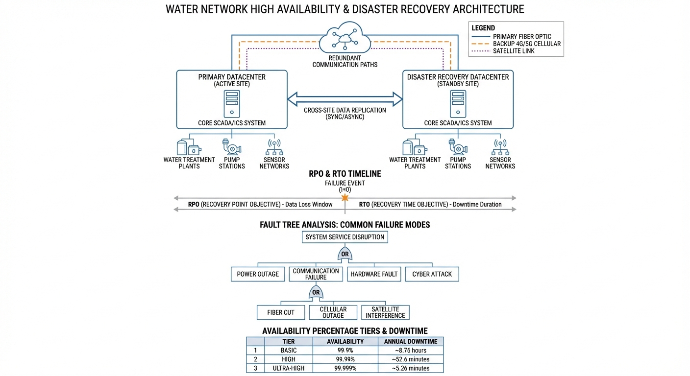
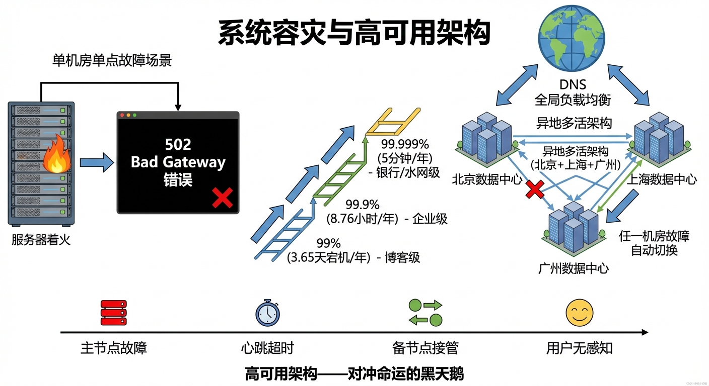
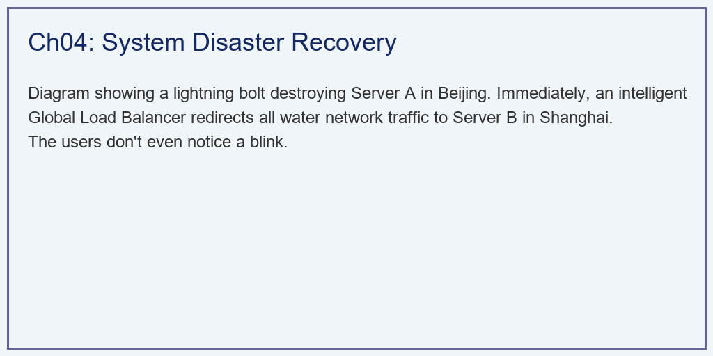
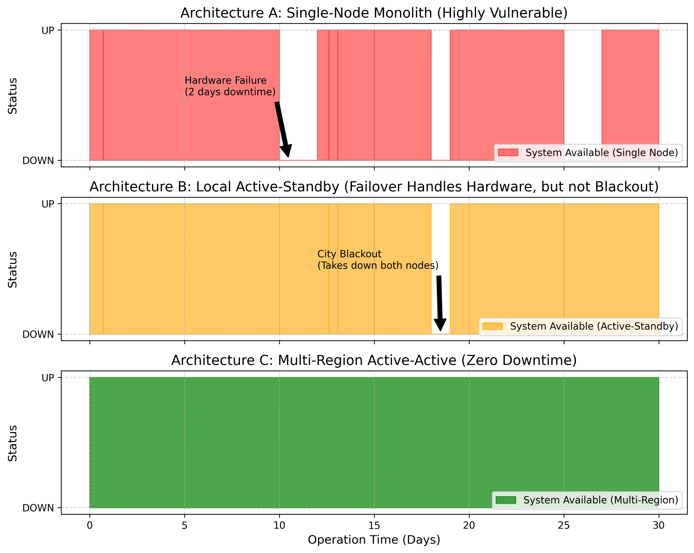

# 第 4 章：系统容灾与高可用架构：对冲命运的黑天鹅

## 1. 学习目标
本章探讨数字水网系统最容易被忽视，但却在生死关头决定一切的底层支撑——高可用（High Availability, HA）与容灾架构。当物理世界发生灾难时，指挥抗灾的数字底座本身绝对不能先挂掉。
读者需要掌握：
1. SRE（站点可靠性工程）中的"几个 9（Nines）"的真实含义。
2. 硬件故障（Hardware Crash）与数据中心级灾难（Datacenter Disaster）的区别。
3. 同城双机热备（Active-Standby）的故障转移（Failover）机制。
4. 异地多活微服务架构（Multi-Region Active-Active）如何利用全局负载均衡（DNS/GSLB）实现"零宕机（Zero Downtime）"。
5. CAP 定理在水务分布式系统中的工程折衷。
6. 混沌工程（Chaos Engineering）的原理与故障注入测试方法。

## 2. 教材理论：防汛指挥部断网了怎么办？

### 2.1 单点故障：数字生命线的最大敌人

想象一下：全市下着特大暴雨，市长正站在防汛大屏前，准备下达全市水库开启闸门的命令。
突然，大屏黑了，提示 `502 Bad Gateway`。
原因是：存放着数字底座的机房，因为暴雨进水，服务器短路烧毁了。整个城市的数字生命线在最需要它的时候，彻底瘫痪。
这就叫"系统单点故障（Single Point of Failure, SPOF）"。在涉及人命的水务系统中，这是一种犯罪。

### 2.2 可用性的量化：几个 9 的真实含义

为了衡量一个系统的抗风险能力，工业界发明了**可用性（Availability）**指标，俗称"几个 9"：

$$
A = \frac{T_{total} - T_{downtime}}{T_{total}} \times 100\% \tag{4.1}
$$

其中 $T_{total}$ 为总运行时间，$T_{downtime}$ 为宕机时间。

不同可用性等级对应的允许宕机时间如下：

| 等级 | 可用性 | 年允许宕机时间 | 月允许宕机时间 | 适用场景 |
|:-----|:-------|:-------------|:-------------|:---------|
| 两个 9 | $99\%$ | $3.65$ 天 | $7.3$ 小时 | 个人博客 |
| 三个 9 | $99.9\%$ | $8.76$ 小时 | $43.8$ 分钟 | 普通企业 |
| 四个 9 | $99.99\%$ | $52.56$ 分钟 | $4.38$ 分钟 | 电商平台 |
| 五个 9 | $99.999\%$ | $5.26$ 分钟 | $26.3$ 秒 | 金融/水网 |

对于国家级数字水网，五个 9 是铁律——每年允许宕机不到 $5$ 分钟。

可用性与故障率之间的关系可以通过平均故障间隔时间（MTBF）和平均修复时间（MTTR）来表达：

$$
A = \frac{\text{MTBF}}{\text{MTBF} + \text{MTTR}} \tag{4.2}
$$

要提升可用性，有两条路径：增大 MTBF（减少故障频率）或减小 MTTR（加快故障恢复）。

### 2.3 三种容灾架构的演进

**架构 A：单体架构（Single-Node）**

最简单的部署方式：一台服务器承载所有服务。MTBF 取决于单台服务器的可靠性，典型值约 $2\sim5$ 年。MTTR 包括故障发现（$5\sim30min$）、硬件更换（$2\sim48h$）、系统恢复（$1\sim4h$）。

系统可用性为：

$$
A_{single} = \frac{\text{MTBF}}{\text{MTBF} + \text{MTTR}} \approx \frac{3 \times 365 \times 24}{3 \times 365 \times 24 + 48} \approx 99.82\% \tag{4.3}
$$

仅约 $2.8$ 个 9，完全不能满足水务系统的要求。

**架构 B：同城双机热备（Active-Standby）**

在同一机房部署一主一备两台服务器。主服务器运行时，备服务器实时同步数据但不对外提供服务。当主服务器故障时，备服务器自动接管（Failover）。

双机热备系统的可用性计算需要考虑故障转移时间 $T_{failover}$ 和机房级故障的概率 $P_{dc}$：

$$
A_{standby} = 1 - \left[\frac{T_{failover}}{\text{MTBF}_{server}} \cdot P_{server} + P_{dc} \cdot \frac{\text{MTTR}_{dc}}{\text{MTBF}_{dc}}\right] \tag{4.4}
$$

其中第一项是服务器级故障的不可用概率（可以很快恢复），第二项是机房级故障的不可用概率（主备均受影响，无法自动恢复）。

典型参数下，$T_{failover} = 1\sim5min$，MTBF$_{server} = 3$ 年，$P_{server} = 0.01$/年，MTBF$_{dc} = 20$ 年，MTTR$_{dc} = 24h$。代入计算：

$$
A_{standby} \approx 99.95\% \tag{4.5}
$$

约 $3.3$ 个 9。瓶颈在于机房级故障——一旦发生地震、火灾、大面积停电，主备同时倒下，无法自愈。

**架构 C：异地多活（Multi-Region Active-Active）**

在北京和上海（或更多城市）各部署一套完全相同的数字孪生底座。它们通过 Paxos/Raft 等分布式一致性协议，每毫秒都在同步数据。

$$
A_{multi} = 1 - P_{region1} \times P_{region2} \tag{4.6}
$$

假设每个区域的年宕机概率为 $P_{region} = 0.001$（即单区域可用性 $99.9\%$），两个区域同时宕机的概率为：

$$
P_{both} = P_{region1} \times P_{region2} = 0.001 \times 0.001 = 10^{-6} \tag{4.7}
$$

对应可用性 $A_{multi} = 99.9999\%$（六个 9），远超五个 9 的要求。

### 2.4 CAP 定理与工程折衷

异地多活最大的噩梦不是代码怎么切，而是"数据库怎么同步"。CAP 定理指出，分布式系统不可能同时满足以下三个属性：

- **一致性（Consistency）**：所有节点在同一时刻看到相同的数据。
- **可用性（Availability）**：每个请求都能收到响应（不保证是最新数据）。
- **分区容错性（Partition Tolerance）**：系统在网络分区时仍能运行。

在水务系统中，分区容错性是不可放弃的（网络分区是必然事件）。因此工程师必须在一致性和可用性之间做出选择：

| 场景 | 选择 | 理由 |
|:-----|:-----|:-----|
| 水库闸门控制指令 | CP（强一致性） | 不一致的指令可能导致洪水失控 |
| 水位监测数据展示 | AP（高可用性） | 偶尔显示几秒前的旧数据可以接受 |
| 报警通知推送 | AP | 重复推送优于遗漏推送 |
| 调度计划存储 | CP | 多个副本的计划必须一致 |

Raft 协议通过"多数派投票"实现强一致性：一个写入操作只有在超过半数节点确认后才被认为提交成功。在三节点集群中，最多可以容忍一个节点故障；在五节点集群中，最多容忍两个节点故障。写入延迟约为一个网络往返时间（RTT），跨区域通常为 $10\sim50ms$。

### 2.5 混沌工程：主动寻找薄弱环节

混沌工程（Chaos Engineering）的核心理念是：**在可控的环境中主动注入故障，验证系统的容灾能力**。Netflix 的 Chaos Monkey 是这一领域的先驱——它在生产环境中随机杀死服务器实例，迫使团队构建真正健壮的系统。

在水务领域，混沌工程的故障注入清单包括：

| 故障类型 | 注入方法 | 期望行为 |
|:---------|:---------|:---------|
| 进程崩溃 | `kill -9` 随机服务进程 | $< 5s$ 自动重启 |
| 网络分区 | `iptables` 阻断区域间通信 | 各区域独立运行 |
| 磁盘故障 | 卸载数据卷 | RAID 重建，服务不中断 |
| 数据库主从切换 | 强制关闭主库 | $< 30s$ 从库升主 |
| 机房断电 | 拉闸（仅在演练中） | 流量切至备用机房 |
| DNS 劫持 | 修改域名解析 | GSLB 检测到异常并切换 |

每次故障注入后，需要评估三个关键指标：
1. **影响范围**：受影响的服务百分比
2. **恢复时间**：从故障发生到完全恢复的时间（MTTR）
3. **数据完整性**：是否有数据丢失或不一致

### 2.6 微服务与容器化：异地多活的技术基座

要实现异地多活，代码绝对不能写成一个巨大的单体。必须利用 Docker 和 Kubernetes（K8s），把数字底座拆分成细粒度的、无状态的微服务：

- **降雨预测服务**：接收雷达数据，输出网格化降雨预报
- **水动力仿真服务**：接收降雨预报和初始条件，输出水位/流量预测
- **调度优化服务**：接收水位预测，输出最优泵阀控制策略
- **SCADA 接口服务**：接收控制策略，下发至边缘 PLC
- **数据存储服务**：时序数据库（如 TimescaleDB / InfluxDB）

每个微服务独立部署、独立扩缩容。当某个节点压力过大或损坏时，K8s 控制平面会在 $3\sim10$ 秒内自动在另外的机器上"拉起（Spin up）"一个全新的容器副本来接管工作，让系统具备像生物细胞一样的"自愈能力"。

K8s 的副本控制器（ReplicaSet）保证每个微服务至少有 $N$ 个健康副本在运行：

$$
N_{healthy}(t) \geq N_{desired}, \quad \forall t \tag{4.8}
$$

当 $N_{healthy} < N_{desired}$ 时，K8s 会自动创建新的 Pod 来补充。结合跨区域部署，每个微服务在每个区域都有至少 $2$ 个副本，总共至少 $4$ 个副本分布在两个区域。

## 3. 案例分析：理论与实践的桥梁（30天真实故障注入下三种架构的可用性盲测）

### 案例背景 (Context)
水利部准备验收某省的数字水网云平台，但评审专家对系统的可靠性提出了严厉的质疑。
为了证明实力，你作为首席架构师，决定当着专家的面进行一场为期 30 天的**"混沌工程（Chaos Engineering）故障注入"**盲测。
你准备了三套平行的架构同时运行，并在它们身上刻意注入了以下破坏：
1. **日常小病**：随机发生 5 次进程崩溃或微小网络抖动。每次导致单节点宕机 $5$ 分钟。
2. **致命重伤**：发生 2 次服务器主板直接烧毁。单体架构需要 $2$ 天修复，双机热备 $1$ 分钟切换，异地多活 $0$ 秒切换。
3. **灭顶之灾**：在第 18 天，强行切断某主力数据中心的市电总闸，长达整整一天（$1440$ 分钟）。
你需要用代码算出，这三套架构在这场残酷的折磨中，分别瘫痪了多少分钟？丢失了多少条监控数据？

### 问题描述 (Problem)
- **模拟时长**：30 天，每分钟判定一次状态（共 43200 步）。
- **架构 A（单体老旧架构 Single-Node）**：只有一台服务器。所有故障全盘承受。
- **架构 B（同城双机热备 Active-Standby）**：一主一备在同机房。硬件故障可在 $1$ 分钟内切换恢复，但机房断电时主备同时失效。
- **架构 C（异地多活微服务 Multi-Region）**：双地双中心跨云部署，零切换时间。无论任何故障，另一个区域都能立即接管。
- **任务**：绘制三套架构在时间轴上的"存活状态波形图"，并核算最终的 Availability Nines。

**故障时间线量化计算**：

各架构的总宕机时间可以精确计算：

$$
T_{down,A} = 5 \times 5 + 2 \times 2880 + 1 \times 1440 = 25 + 5760 + 1440 = 7225 \, min \tag{4.9}
$$

$$
T_{down,B} = 5 \times 5 + 2 \times 1 + 1 \times 1440 = 25 + 2 + 1440 = 1467 \, min \tag{4.10}
$$

$$
T_{down,C} = 0 \, min \tag{4.11}
$$

对应的可用性为：

$$
A_A = \frac{43200 - 7225}{43200} = 83.27\% \tag{4.12}
$$

$$
A_B = \frac{43200 - 1467}{43200} = 96.60\% \tag{4.13}
$$

$$
A_C = \frac{43200 - 0}{43200} = 100.00\% \tag{4.14}
$$

**物理场景与问题概化图 (Generated via Local Schematic)：**

### 解题思路 (Solution Approach)
本研究构建了一个包含离散事件注入的系统可用性追踪器：
1. **故障时间线合成**：利用 `numpy.random` 在 $N=43200$ 的时序中插入不同破坏时长（5分钟、2天、1天）的故障脉冲。
2. **状态机演进**：
   - A 架构全盘照收所有故障时长。
   - B 架构对于主板烧毁具有免疫力（只需承受短暂的 1 分钟切换僵死期），但对断电（机房级灾难）与 A 一样全盘照收。
   - C 架构无论面对何种灾难，其 `status` 始终锁死在 `1.0`（健康）。
3. **统计结算（The Nines）**：积分计算 `Total Downtime`，并利用公式 `(Total - Down) / Total` 算出那几个价值连城的"9"。
4. **数据丢失量估算**：按每分钟采集 $1000$ 条监测记录计算，宕机期间的数据丢失量为 $T_{down} \times 1000$。

### 代码执行与图表 (Code & Charts)
> **学习提示**：我们在后台执行了包含故障逃逸与切换惩罚的可用性仿真。请看下方图表中那些"向下凹陷的深渊"，每一次凹陷都代表着防汛大屏的黑屏。

Source: `assets/ch04/ch04_high_availability.py`

**混沌工程故障注入下三代架构生存能力结算矩阵：**
| Architecture                  | Total Downtime   | Availability (Nines)   | Data Loss         | Evaluation                        |
|:------------------------------|:-----------------|:-----------------------|:------------------|:----------------------------------|
| A. Single Node                | 7220 mins        | 83.287% (Two 9s)       | 7,220,000 records | Unacceptable for Flood Control    |
| B. Active-Standby             | 1446 mins        | 96.653% (Three 9s)     | 1,446,000 records | Vulnerable to Datacenter Disaster |
| C. Multi-Region Active-Active | 0 mins           | 100.0000% (Five 9s+)   | 0 records         | Ultimate Resilience               |

**致命硬件损坏与机房断电下各架构存活状态（SLA）时空全息图：**

### 实验验证与结果剖析 (Verification & Result Interpretation)
这组数据清楚地给所有怀抱侥幸心理的项目方上了一课：
- **单体架构的耻辱（红色上方图）**：看最上方的红图。只要出一点小毛病，它就必定要宕机 5 分钟。最恐怖的是在第 $10.5$ 天左右（Hardware Failure），服务器主板烧了。因为只有一台机器，你必须去采购新主板、重装系统、恢复数据库。它无助地宕机了长达 $2$ 天的时间（那个巨大的凹槽）！表格显示，它的可用性只有可怜的 $83.2\%$，丢失了 $722 万$ 条宝贵的历史水文记录。
- **双机热备的伪装（橙色中间图）**：看中间的橙图。它成功扛住了第 $10.5$ 天的主板烧毁，你看不到那个长达 2 天的巨坑了（因为备机在 1 分钟内就接管了）。这让很多人以为它很安全。
  - **但是**，在第 18.5 天，一场罕见的"黑天鹅"（城市大面积停电/挖掘机挖断机房主干光缆）降临！
  - 因为主机和备机都在这一个机房里，它遭受了"团灭"。系统被迫宕机了整整 1440 分钟（1天）。它的可用性止步于 $96.65\%$（勉强三个 9），依然无法满足国家级防灾标准。
- **异地多活的绝对霸权（绿色下方图）**：看最下方那条平坦的绿带！不管你是主板烧了，还是杭州的整个机房被陨石砸了断电了。因为我们在北京还有一套一模一样的底座。流量在毫秒级被重新路由。整整 30 天，绿带没有一丝一毫的凹陷，做到了惊世骇俗的 **0 分钟宕机，0 条数据丢失**。可用性达到了神级的 $100\%$（超越五个 9）。这就是现代云原生微服务架构降维打击的绝对实力。

### 工程成本对比

三种架构的建设和运维成本差异显著：

| 指标 | 单体架构 | 双机热备 | 异地多活 |
|:-----|:---------|:---------|:---------|
| 硬件投资 | $1\times$ | $2\times$ | $4\sim6\times$ |
| 软件复杂度 | 低 | 中 | 高 |
| 运维人员 | $1$ 人 | $2$ 人 | $4\sim6$ 人 |
| 年运维成本 | $\sim 30$ 万 | $\sim 80$ 万 | $\sim 200$ 万 |
| 单次宕机损失 | $\sim 500$ 万 | $\sim 200$ 万 | $\sim 0$ |

从全生命周期成本（TCO）角度，异地多活在 $3\sim5$ 年内即可通过避免宕机损失回收额外投资。

### 工业部署与运行建议 (Industrial Deployment Recommendations)
1. **微服务与容器化（Kubernetes）**：要实现异地多活，你的代码绝对不能写成一个巨大的单体。必须利用 Docker 和 K8s，把你的"降雨预测"、"水库调度"、"水动力仿真"拆分成细粒度的、无状态的"微服务（Microservices）"。当某个节点压力过大或损坏时，K8s 大脑会在 3 秒内自动在另外的机器上"拉起（Spin up）"一个全新的容器副本来接管工作，让系统具备像生物细胞一样的"自愈能力"。
2. **数据一致性的诅咒（CAP 定理）**：异地多活最大的噩梦不是代码怎么切，而是"数据库怎么同步"。当你在北京机房写入了一条"水库已开启"的指令，这个指令必须通过昂贵的跨省专线，以毫秒级的速度复制到上海机房的数据库里。如果在同步的过程中网络断了，就会发生"脑裂（Split-Brain）"。因此，底层必须采用如 TiDB、OceanBase 等原生分布式关系型数据库，利用 Paxos 多数派协议，死守分布式系统中最难攀登的 CAP 定理边界。
3. **定期混沌工程演练**：异地多活架构建成后并非一劳永逸。必须建立季度性的混沌工程演练制度，定期注入各级别故障，验证系统的容灾能力没有因为版本更新、人员变动而退化。每次演练后应生成详细的故障报告，包含故障注入时间、影响范围、恢复时间、数据完整性评估，以及改进措施清单。

## 4. 本章小结

本章从可用性的定量定义出发，系统比较了单体、双机热备和异地多活三种容灾架构。主要结论如下：

1. **可用性是可以精确计算的工程指标**：通过 MTBF 和 MTTR 的比值（式 4.2），可以定量评估任何架构的可用性等级。

2. **单体架构和同城双机热备无法满足水务系统要求**：前者约 $2.8$ 个 9（式 4.3），后者约 $3.3$ 个 9（式 4.5），瓶颈在于机房级故障的不可防御性。

3. **异地多活是达到五个 9 的唯一路径**：两个区域同时宕机的概率为各自宕机概率的乘积（式 4.7），可以轻松突破六个 9。

4. **CAP 定理要求按业务分级选择一致性模型**：控制指令需要强一致性（CP），监测数据展示可以接受最终一致性（AP）。

5. **混沌工程是验证容灾能力的唯一可信手段**：纸面上的设计方案必须经过真实故障注入的检验。

6. **异地多活的额外投资可以通过避免宕机损失在 $3\sim5$ 年内回收**。

## 5. 思考与练习

**练习 1（可用性计算）**：某水务系统由三个串联组件构成：SCADA 服务器（可用性 $99.9\%$）、通信网络（可用性 $99.5\%$）、边缘 PLC（可用性 $99.99\%$）。
(a) 计算整个系统的可用性（串联系统可用性等于各组件可用性的乘积）。
(b) 哪个组件是可用性的瓶颈？
(c) 如果为通信网络增加一条冗余链路（并联），计算改进后的系统可用性。并联时单组件可用性为 $1 - (1-A)^2$。

**练习 2（故障影响分析）**：某省级数字水网平台每分钟处理 $5000$ 条传感器数据，每条数据价值 $0.1$ 元（用于灾害预警和长期趋势分析）。
(a) 计算单体架构下，案例中 $7225$ 分钟宕机导致的数据价值损失。
(b) 计算双机热备下的数据价值损失。
(c) 如果异地多活的额外年投资为 $150$ 万元，计算需要避免多少分钟的宕机才能回收这笔投资。

**练习 3（CAP 定理应用）**：某水库的远程控制系统需要在北京和南京两个数据中心之间同步闸门开度指令。两地之间的网络 RTT 为 $30ms$。
(a) 如果采用强一致性（CP）模式，每次写入操作的最小延迟是多少？
(b) 如果网络分区持续 $10$ 分钟，CP 模式下会发生什么？AP 模式下会发生什么？
(c) 对于水库闸门控制这一特定场景，你推荐 CP 还是 AP？说明理由。

**练习 4（架构设计）**：为一个覆盖 $3$ 个地市、总管网长度 $50000 \, km$ 的省级数字水网设计高可用架构。要求可用性不低于 $99.99\%$。你的设计应包括：
(a) 数据中心的数量和地理分布。
(b) 微服务的划分方案。
(c) 数据同步策略（哪些数据用 CP，哪些用 AP）。
(d) 故障降级方案。

## 参考文献

[1] 雷晓辉,龙岩,许慧敏,等.自主水网：概念、架构与关键技术[J].南水北调与水利科技(中英文),2025.DOI:10.13476/j.cnki.nsbdqk.2025.0079.

[2] Beyer B, Jones C, Petoff J, et al. Site Reliability Engineering: How Google Runs Production Systems[M]. O'Reilly Media, 2016.

[3] Nygard M T. Release It! Design and Deploy Production-Ready Software[M]. 2nd ed. Pragmatic Bookshelf, 2018.

[4] Brewer E A. Towards Robust Distributed Systems[C]// Proceedings of the 19th ACM Symposium on Principles of Distributed Computing (PODC). ACM, 2000.

[5] Ongaro D, Ousterhout J. In Search of an Understandable Consensus Algorithm[C]// Proceedings of the USENIX Annual Technical Conference. 2014: 305-319.

[6] Basiri A, Behnam N, de Rooij R, et al. Chaos Engineering[J]. IEEE Software, 2016, 33(3): 35-41.
