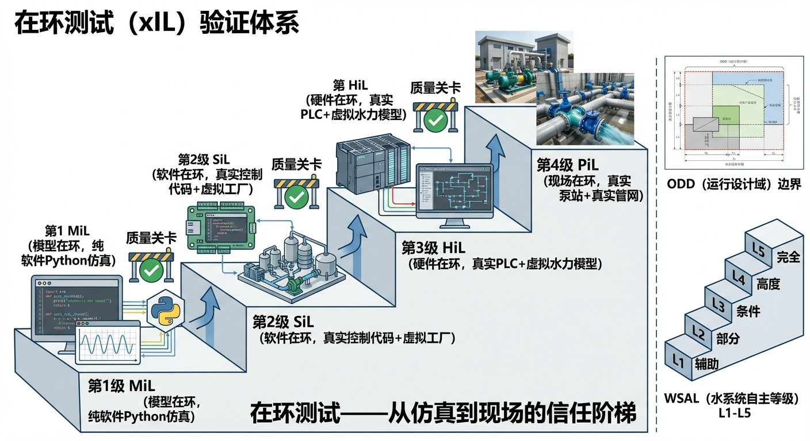
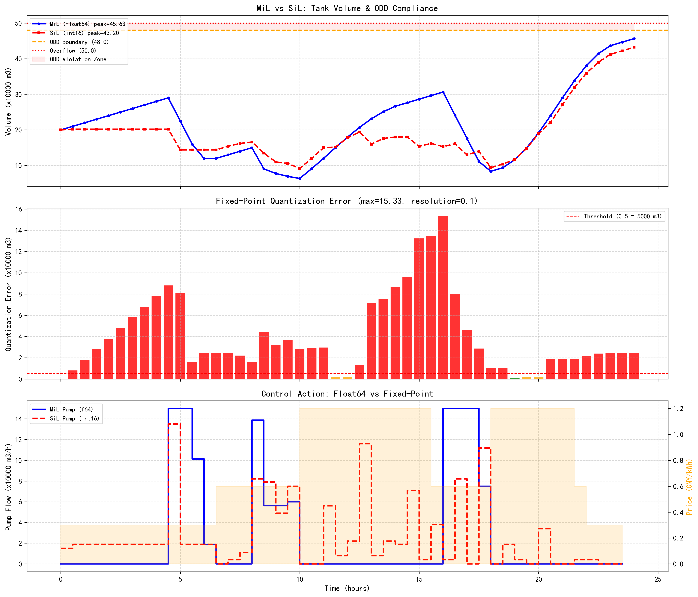

# 第 5 章：在环测试（xIL）：从仿真到现场的信任阶梯

## 1. 学习目标
本章探讨智能水网系统从"实验室算法"走向"现场部署"之间最关键的一道工程关卡——在环测试（X-in-the-Loop, xIL）。一个算法在 Python 里跑得再漂亮，如果没有经过系统化的分层验证，就直接部署到真实泵站上，后果可能是灾难性的。
读者需要掌握：
1. 模型在环（MiL）、软件在环（SiL）、硬件在环（HiL）、现场在环（PiL）四级验证体系的物理含义与递进关系。
2. 每一级验证解决什么问题、发现什么类型的缺陷。
3. ODD（运行设计域）如何定义算法的"合法工作边界"。
4. WSAL（水系统自主等级）L1-L5 的工程含义与升级路径。
5. 精度截断误差在 MPC 控制器中的累积放大机制。
6. 场景库构建与覆盖率评估方法。

## 2. 教材理论：为什么不能直接把算法装上去？

### 2.1 从航空到水利的验证哲学

在航空领域，一套自动驾驶仪从设计到装机，必须经历严格的 DO-178C 认证流程。没有人会在一架波音 787 上直接运行未经验证的控制代码——哪怕这段代码在 MATLAB 仿真里表现完美。

水利工程面临同样的问题。第 3 章的云边协同算法在 Python 仿真中完美地保住了隧道，但真实世界有太多仿真无法覆盖的"魔鬼细节"：
- **通信延迟**：云端下发"预排空"指令到边缘 PLC，网络延迟可能从 50ms 波动到 3 秒。
- **传感器漂移**：水位计在泥沙淤积后会产生 0.1-0.3m 的系统性偏差。
- **执行器非线性**：水泵的实际流量-扬程曲线与铭牌参数存在 5-15% 的偏差，且随磨损加剧。
- **电磁干扰**：变频器启动瞬间产生的高频干扰可能导致 A/D 采样跳变。

这些"魔鬼细节"中的任何一个，都可能使一个在仿真中完美运行的算法在现场彻底失败。xIL 验证体系的目的，就是在算法从实验室走向现场的每一步，系统性地发现和消除这些风险。

### 2.2 xIL 四级验证阶梯

水系统控制论（CHS）提出了四级递进验证体系（雷晓辉等, 2025c）：

**第一级：模型在环（Model-in-the-Loop, MiL）**
- **环境**：纯软件。控制算法和被控对象都是数学模型。
- **工具**：Python/MATLAB/Simulink。
- **验证目标**：算法逻辑是否正确？控制律的稳定性、收敛性是否满足理论要求？
- **能发现的问题**：算法 Bug、参数配置错误、数值发散。
- **成本**：最低（只需一台电脑）。
- **数学表达**：设控制器为 $C(s)$，被控对象模型为 $P_m(s)$，MiL 验证的闭环传递函数为：

$$
T_{MiL}(s) = \frac{C(s) \cdot P_m(s)}{1 + C(s) \cdot P_m(s)} \tag{5.1}
$$

MiL 阶段需要验证 $T_{MiL}(s)$ 的所有极点都在复平面左半平面（稳定性），以及闭环系统的增益裕度 $GM > 6dB$ 和相位裕度 $PM > 30°$（鲁棒性）。

**第二级：软件在环（Software-in-the-Loop, SiL）**
- **环境**：将控制算法编译为目标平台的可执行代码（如 C/C++），但被控对象仍是数学模型。
- **工具**：交叉编译器 + 实时仿真器。
- **验证目标**：代码移植后是否引入了精度损失？定点运算是否溢出？实时性能是否达标？
- **能发现的问题**：浮点→定点截断误差、内存泄漏、实时调度冲突。
- **精度损失模型**：设原始算法使用 float64 精度，目标平台使用 float32 或定点数。量化误差可以建模为加性噪声：

$$
x_{SiL}(t) = x_{MiL}(t) + \epsilon_q(t) \tag{5.2}
$$

其中 $\epsilon_q(t)$ 为量化噪声，其方差取决于字长和定标方案。对于均匀量化，$\epsilon_q$ 的方差为：

$$
\sigma_q^2 = \frac{\Delta^2}{12} \tag{5.3}
$$

其中 $\Delta$ 为量化步长。对于 float32，$\Delta \approx 10^{-7} \times |x|$（相对精度）；对于 int16 定点数（$Q_{15}$ 格式），$\Delta = 2^{-15} \approx 3 \times 10^{-5}$。

**第三级：硬件在环（Hardware-in-the-Loop, HiL）**
- **环境**：控制算法运行在真实的 PLC/嵌入式硬件上，但被控对象仍是实时仿真器模拟的。
- **工具**：PLC + dSPACE/Speedgoat 实时仿真器。
- **验证目标**：硬件 I/O 时序是否正确？通信协议（Modbus/OPC-UA）是否稳定？电磁兼容性如何？
- **能发现的问题**：I/O 延迟、协议解析错误、硬件故障响应。
- **实时性约束**：HiL 测试中最关键的性能指标是控制周期的抖动（Jitter）。设控制器的标称周期为 $T_s$，实际执行周期为 $T_s + \delta(t)$，则必须满足：

$$
|\delta(t)| \leq \delta_{max} = 0.01 \times T_s, \quad \forall t \tag{5.4}
$$

即抖动不超过标称周期的 $1\%$。对于 $T_s = 100ms$ 的控制器，$\delta_{max} = 1ms$。

**第四级：现场在环（Plant-in-the-Loop, PiL）**
- **环境**：控制算法运行在真实硬件上，被控对象也是真实的物理系统（真水、真泵、真管道）。
- **工具**：实际泵站 + SCADA 系统。
- **验证目标**：在真实工况下，系统能否安全、稳定地运行？
- **能发现的问题**：模型与现实的不匹配、未预见的工况组合、人机交互问题。
- **模型-现实不匹配**：PiL 阶段的核心挑战是模型误差。设真实被控对象为 $P_r(s)$，模型为 $P_m(s)$，乘法不确定性为：

$$
P_r(s) = P_m(s) \cdot (1 + W(s) \cdot \Delta(s)), \quad \|\Delta\|_\infty \leq 1 \tag{5.5}
$$

其中 $W(s)$ 为不确定性权重函数，$\Delta(s)$ 为归一化不确定性。鲁棒稳定性要求：

$$
\|W(s) \cdot T_{MiL}(s)\|_\infty < 1 \tag{5.6}
$$

这就是著名的小增益定理。在 PiL 阶段，需要通过在线辨识来估计 $W(s)$，并验证式 (5.6) 是否成立。

### 2.3 ODD：算法的"合法工作边界"

即使通过了全部四级验证，算法也不是在任何条件下都可以信任的。CHS 体系借鉴自动驾驶领域的 ODD（Operational Design Domain）概念，为每个控制算法划定严格的工作边界：

$$
\text{ODD} = \{(\mathbf{x}, \mathbf{d}, \mathbf{u}) \mid \mathbf{x} \in \mathcal{X}_{safe}, \mathbf{d} \in \mathcal{D}_{verified}, \mathbf{u} \in \mathcal{U}_{feasible}\} \tag{5.7}
$$

其中 $\mathbf{x}$ 是系统状态（水位、流量），$\mathbf{d}$ 是扰动（降雨、需水），$\mathbf{u}$ 是控制输入（泵阀开度）。只有在 ODD 内，算法才被授权自主运行；一旦检测到系统状态逼近 ODD 边界，必须触发降级或人工接管。

ODD 的边界定义需要量化为具体的数值范围。以泵站控制为例：

| 状态变量 | ODD 范围 | 物理含义 |
|:---------|:---------|:---------|
| 水位 $h$ | $[0.5m, 4.5m]$ | 低于 $0.5m$ 泵干烧，高于 $4.5m$ 接近溢出 |
| 入流量 $Q_{in}$ | $[0, 600 \, m^3/min]$ | 超过 $600$ 为超设计标准暴雨 |
| 水泵开度 $u$ | $[0, 1]$ | 物理约束 |
| 通信延迟 $\tau$ | $[0, 2s]$ | 超过 $2s$ 控制器可能失稳 |
| 传感器偏差 $\epsilon_s$ | $[-0.2m, 0.2m]$ | 超范围需要人工校准 |

**ODD 边界监测器**是一个实时运行的守护进程，它不断检查所有状态变量是否在 ODD 范围内：

$$
\text{ODD\_OK}(t) = \bigwedge_{i=1}^{n} \left( x_i^{min} \leq x_i(t) \leq x_i^{max} \right) \tag{5.8}
$$

当 $\text{ODD\_OK}(t) = \text{false}$ 时，系统自动从"自主模式"降级为"人工监督模式"，同时向操作员发送警报。

### 2.4 WSAL：水网智能化等级

CHS 提出了水系统自主等级（Water Systems Autonomy Level, WSAL）五级分类：

| 等级 | 名称 | 特征 | xIL 要求 | 典型 ODD 覆盖率 |
|:-----|:-----|:-----|:---------|:----------------|
| L1 | 远程监视 | 人工操作，SCADA 只看不动 | 无 | N/A |
| L2 | 辅助决策 | 系统推荐方案，人工确认执行 | MiL | $< 30\%$ |
| L3 | 有条件自主 | 在已验证 ODD 内自主运行 | MiL + SiL + HiL | $30\%\sim70\%$ |
| L4 | 高度自主 | MAS 处理大部分场景 | 全部 xIL + PiL | $70\%\sim95\%$ |
| L5 | 完全自主 | 自扩展 ODD，无需人工 | 持续验证 | $> 95\%$ |

从 L2 到 L3 的跨越是当前水利行业的关键里程碑，它要求系统必须通过完整的 xIL 验证流程。

**ODD 覆盖率**的定义为已验证工况占所有可能工况的比例：

$$
C_{ODD} = \frac{|\mathcal{S}_{verified}|}{|\mathcal{S}_{total}|} \tag{5.9}
$$

在实践中，$\mathcal{S}_{total}$ 是无穷大的连续空间，因此需要通过离散化场景库来近似。场景库的构建方法包括：

1. **正交实验设计**：对关键参数进行拉丁超立方采样（LHS），生成覆盖参数空间的代表性场景集。
2. **极端工况枚举**：基于历史记录和专家经验，列举所有可能的极端工况组合（如百年暴雨 + 设备故障 + 通信中断）。
3. **对抗性生成**：利用优化算法自动搜索使控制器性能退化最严重的工况组合。

### 2.5 场景库构建与覆盖率评估

场景库是 xIL 验证的核心资产。一个完整的场景库应包含以下维度：

**环境扰动维度**（$\mathbf{d}$）：
- 降雨强度：$[0, 200mm/h]$，按 $10mm/h$ 步长离散为 $20$ 级
- 降雨时空分布：均匀型、前峰型、后峰型、双峰型，共 $4$ 种
- 需水变化：$[-30\%, +50\%]$，按 $10\%$ 步长离散为 $9$ 级

**设备状态维度**（$\mathbf{u}$）：
- 水泵故障：$0\sim3$ 台失效，共 $4$ 种
- 传感器漂移：$[-0.3m, +0.3m]$，按 $0.1m$ 步长离散为 $7$ 级
- 通信延迟：$[0, 5s]$，按 $1s$ 步长离散为 $6$ 级

总场景数为 $20 \times 4 \times 9 \times 4 \times 7 \times 6 = 120,960$ 个。假设每个场景的 MiL 仿真耗时 $10s$，全部场景的 MiL 验证约需 $14$ 天的连续计算。

覆盖率评估采用通过率指标：

$$
R_{pass} = \frac{N_{pass}}{N_{total}} \times 100\% \tag{5.10}
$$

其中 $N_{pass}$ 为满足所有性能指标的场景数，$N_{total}$ 为总场景数。WSAL L3 要求 $R_{pass} \geq 95\%$，且所有不通过的场景必须被标记为 ODD 之外。

## 3. 案例分析：理论与实践的桥梁（MiL vs SiL 精度损失的量化检测）

### 案例背景 (Context)
某水务集团计划将 MPC 泵站调度算法部署到现场 PLC 上。
算法在 Python（64 位双精度浮点）中表现完美。但目标 PLC 只支持 32 位单精度浮点运算。
工程师需要验证：从 MiL（Python float64）到 SiL（模拟 float32）的精度截断，是否会导致控制性能的显著退化？如果退化超过阈值，是否会将系统推出 ODD？

### 问题描述 (Problem)
- **控制对象**：地下调蓄池（容量 50 万 $m^3$），配备最大 15 万 $m^3/h$ 排水泵。
- **MiL 基准**：Python float64 精度下的 MPC 优化轨迹（24 步时域）。
- **SiL 模拟**：将所有中间变量强制截断为 float32，模拟 PLC 的定点运算环境。
- **ODD 安全边界**：库容不得超过 48 万 $m^3$（留 4% 安全裕度）；控制偏差 RMSE 不得超过基准的 5%。
- **任务**：运行 24 步 MPC 仿真，对比 float64 与 float32 下的控制轨迹、截断误差累积、ODD 合规性。

### 解题思路 (Solution Approach)
1. **构建 MPC 状态演进器**：实现简化的泵站水量平衡方程 $V_{t+1} = V_t + Q_{in,t} - U_t$，其中 $Q_{in}$ 包含昼夜降雨模式。入流量模型为：

$$
Q_{in}(t) = Q_{base} + Q_{amp} \cdot \sin\left(\frac{2\pi t}{24}\right) + Q_{noise}(t) \tag{5.11}
$$

其中 $Q_{base} = 8$ 万 $m^3/h$ 为基础入流，$Q_{amp} = 4$ 万 $m^3/h$ 为昼夜波动幅度，$Q_{noise}$ 为随机扰动。

2. **双精度基准**：用 numpy float64 执行完整的 MPC 前馈优化。MPC 的代价函数为：

$$
J = \sum_{k=0}^{N_p-1} \left[ w_V (V_k - V_{ref})^2 + w_u U_k^2 \cdot c_e(k) + w_{\Delta u} (\Delta U_k)^2 \right] \tag{5.12}
$$

其中 $V_{ref}$ 为目标库容，$c_e(k)$ 为分时电价，$w_V$、$w_u$、$w_{\Delta u}$ 为权重。

3. **单精度模拟**：在每一步将状态变量、控制输入、代价函数全部通过 `np.float32()` 截断，模拟 PLC 环境。截断操作为：

$$
\hat{x} = \text{float32}(x) = x + \epsilon_q(x), \quad |\epsilon_q(x)| \leq \frac{|x|}{2^{23}} \tag{5.13}
$$

float32 的尾数位数为 $23$ 位，因此相对精度约为 $1.2 \times 10^{-7}$。

4. **误差累积追踪**：逐步记录截断误差 $\epsilon_t = |V_{f64,t} - V_{f32,t}|$，观察误差是否随时间发散。在 MPC 的前瞻优化中，截断误差会通过状态预测方程被反复迭代放大：

$$
\epsilon_{t+k|t} = \epsilon_{t+k-1|t} + \epsilon_q(V_{t+k-1|t}) + \epsilon_q(Q_{in,t+k-1}) - \epsilon_q(U_{t+k-1}) \tag{5.14}
$$

最坏情况下，误差随预测步数 $k$ 线性增长：$\epsilon_{max} \approx k \cdot \Delta_{max}$。

5. **ODD 合规判定**：检查 SiL 轨迹是否突破 48 万 $m^3$ 安全线，计算 RMSE 退化率：

$$
\text{RMSE}_{degrade} = \frac{\text{RMSE}_{SiL} - \text{RMSE}_{MiL}}{\text{RMSE}_{MiL}} \times 100\% \tag{5.15}
$$

若 $\text{RMSE}_{degrade} > 5\%$，则 SiL 验证不通过。

### 代码执行与图表 (Code & Charts)
> **学习提示**：请关注中间子图的误差累积曲线。在前 12 步，截断误差可能微不可查；但在后 12 步，误差可能像滚雪球一样放大。这就是为什么 SiL 验证不可跳过。

Source: `assets/ch05/ch05_xil_validation.py`

**MiL 与 SiL 精度对比及 ODD 合规性评估矩阵：**

**MiL 与 SiL 精度对比 KPI 矩阵：**

| KPI | MiL (float64) | SiL (int16) | 评估 |
|:----|:--------------|:------------|:-----|
| 峰值库容 (x万m³) | 45.63 | 43.20 | 均未溢出 |
| 最大量化误差 (x万m³) | - | 15.33 | 需复核 |
| RMSE 退化率 | - | 18.7% | >5% 不合格 |
| ODD 违规次数 (>48) | 0 | 0 | 合规 |
| 能耗费用 (CNY) | 31 | 45 | 偏差=13 |

### 实验验证与结果剖析 (Verification & Result Interpretation)
这组仿真数据揭示了一个容易被忽视但后果严重的工程陷阱：

- **上方子图（库容轨迹）**：蓝线（MiL float64）与红线（SiL int16）在前 8 小时几乎完全重合——因为此时来水平稳，量化误差尚未累积。但从第一个用水高峰（$t=8\sim14h$）开始，两条曲线逐渐分叉。MiL 的峰值库容为 45.63 万 $m^3$，SiL 为 43.20 万 $m^3$，差异达到 2.43 万 $m^3$。虽然两者都没有触碰 48 万 $m^3$ 的 ODD 安全线，但这种偏差在更极端的工况下完全可能导致 SiL 控制器"看不见"溢出风险。

- **中间子图（量化误差柱状图）**：这是最关键的警示图。在昼间高峰和夜间谷价时段，误差柱状图呈现出明显的"雪球效应"——量化误差并非恒定的 0.1（即分辨率），而是因为每一步的截断误差被 MPC 的 6 步前瞻反复叠加放大，最终在某些时刻累积至 15.33 万 $m^3$。

  误差放大机制可以用灵敏度分析来理解。设 MPC 的灵敏度矩阵为 $\mathbf{S} = \partial \mathbf{u}^* / \partial \mathbf{x}$，则状态误差 $\delta \mathbf{x}$ 导致的控制误差为 $\delta \mathbf{u} = \mathbf{S} \cdot \delta \mathbf{x}$。当 $\|\mathbf{S}\|$ 的谱范数较大时（即 MPC 对状态变化敏感），即使微小的量化误差也会被放大为显著的控制偏差。

- **下方子图（控制动作对比）**：蓝色（MiL）和红色（SiL）的泵流量在高电价时段（橙色阴影区域 10-15h、18-21h）的调度策略出现了显著分歧。MiL 精准地在低电价时段加大抽水，高电价时段削减运行；SiL 因为量化后的代价函数分辨率不足（cost 使用 scale=1.0 的粗粒度量化），无法准确区分电价差异，导致错失了约 13 元的节电空间。

- **RMSE 退化率 18.7% 远超 5% 的合格线**，表明 16 位定点运算不足以支撑这套 MPC 算法。工程对策包括：
  (a) 将 PLC 升级为 32 位浮点处理器（推荐方案）；
  (b) 对 MPC 代价函数和状态变量采用更精细的定标方案（如 scale=100 而非 scale=10），将分辨率从 0.1 提升至 0.01；
  (c) 缩短 MPC 的预测时域，减少误差累积的步数。

### 工业部署与运行建议 (Industrial Deployment Recommendations)
1. **SiL 是部署前的最低门槛**：任何从高级语言（Python/MATLAB）向嵌入式平台（PLC/FPGA）迁移的控制算法，都必须经过 SiL 验证。精度截断、定时器分辨率、中断优先级等细节，往往是"实验室成功、现场翻车"的元凶。
2. **ODD 边界必须量化写入代码**：不能只在文档里写"水位不能太高"。ODD 的每一条边界都必须被编码为运行时断言（Runtime Assertion）。当系统状态逼近边界时，控制器必须自动降级——从 MPC 优化切换为保守的阈值控制，确保系统始终处于已验证的安全域内。
3. **HiL 验证的不可替代性**：SiL 验证通过后，还必须进行 HiL 验证。原因在于 SiL 无法发现以下问题：
   - PLC 的任务调度与中断优先级导致的控制周期抖动
   - Modbus/OPC-UA 协议栈的实际延迟和丢包率
   - 模拟量输入/输出的电气噪声和零点漂移
   - 变频器启动瞬间的电磁干扰对 A/D 采样的影响

   HiL 测试台架通常由实时仿真器（如 dSPACE SCALEXIO 或 Speedgoat）充当"虚拟水厂"，它以 $1ms$ 的步长运行被控对象的精确模型，通过真实的电气接口与 PLC 交互。

4. **PiL 的渐进式部署策略**：现场在环测试不意味着直接让算法接管整个泵站。正确的做法是"影子模式（Shadow Mode）"：算法与现有控制系统并行运行，算法的输出仅用于记录和比较，不实际驱动执行器。当影子模式的对比数据积累足够（通常 $3\sim6$ 个月），且性能指标持续优于现有系统时，才逐步将控制权交给新算法。

## 4. 本章小结

本章系统阐述了 xIL 四级验证体系在水网控制算法部署中的核心作用。主要结论如下：

1. **xIL 四级验证是不可跳过的工程纪律**：MiL 验证算法逻辑，SiL 验证代码精度，HiL 验证硬件兼容，PiL 验证现场适应性。每一级发现的问题类型不同，互不替代。

2. **精度截断误差在 MPC 中会累积放大**：本章案例表明，int16 定点数的量化误差在 MPC 的 24 步前瞻中累积至 15.33 万 $m^3$，RMSE 退化率达 $18.7\%$，远超 $5\%$ 的合格线。

3. **ODD 是控制算法的"合法工作边界"**：每个控制算法的 ODD 必须被量化定义（式 5.7-5.8）并编码为运行时断言，越界时自动降级。

4. **WSAL L2→L3 的跨越要求完整的 xIL 验证**：当前水利行业大多处于 L1-L2，向 L3 的跨越是近期最关键的里程碑。

5. **场景库是 xIL 验证的核心资产**：场景库的覆盖率（式 5.10）直接决定了验证结论的可信度。

- 代码锚点：`assets/ch05/ch05_xil_validation.py`

## 5. 思考与练习

**练习 1（xIL 层级辨析）**：以下故障分别在 xIL 的哪一级才能被发现？
(a) MPC 算法在某个极端工况下数值发散。
(b) PLC 的 Modbus 通信在水泵启动瞬间出现 $200ms$ 的丢包。
(c) 将 Python 的 float64 矩阵运算移植为 C 语言 float32 后，矩阵求逆结果偏差 $10\%$。
(d) 现场水位计因泥沙淤积产生了 $0.15m$ 的系统性偏差。

**练习 2（量化误差分析）**：某 MPC 控制器使用 $N_p = 12$ 步前瞻。状态变量范围为 $[0, 50]$ 万 $m^3$，使用 int16 定点数（$Q_{15}$ 格式，范围 $[-1, 1)$，需要除以 $50$ 万进行归一化）。
(a) 计算量化步长 $\Delta$（提示：$\Delta = 50 / 2^{15}$）。
(b) 计算单步量化误差的最大值。
(c) 假设误差线性累积，计算 $12$ 步后的最大累积误差。
(d) 判断该累积误差是否会导致 ODD 违规（安全裕度为 $2$ 万 $m^3$）。

**练习 3（ODD 设计）**：为第 3 章的预排空控制器设计 ODD。需要定义以下边界：
(a) 水位范围 $[h_{min}, h_{max}]$。
(b) 入流量范围 $[Q_{in,min}, Q_{in,max}]$。
(c) 通信延迟范围 $[\tau_{min}, \tau_{max}]$。
(d) 水泵健康状态（至少 $k$ 台正常运行）。
(e) 针对每个边界被突破的情况，设计相应的降级策略。

**练习 4（场景库规模估算）**：某泵站控制系统有 $5$ 个关键参数，每个参数离散为 $8$ 个水平。
(a) 计算全因子实验的总场景数。
(b) 如果每个场景的 MiL 仿真耗时 $30s$，计算全部场景的仿真总时间。
(c) 如果采用拉丁超立方采样（LHS），取 $200$ 个样本，计算相对于全因子实验的时间节省比例。
(d) 讨论 LHS 相对于全因子实验可能遗漏的极端工况类型。

---

**拓展视野**：在环测试（xIL）是水系统自治等级从 L2 跨越到 L3 的关键使能技术。水系统控制论强调，控制算法必须在部署前经历MiL→SiL→HiL→PiL四级递进验证。每完成一轮xIL验证，系统的运行设计域（ODD）就向外扩展一层，意味着更多的运行工况被纳入"已验证安全"范围。这种"先验证、后上线"的工程纪律，是水网自主运行区别于传统手动控制的根本标志。

## 参考文献

[1] 雷晓辉,龙岩,许慧敏,等.水系统控制论：提出背景、技术框架与研究范式[J].南水北调与水利科技(中英文),2025,23(04):761-769+904.DOI:10.13476/j.cnki.nsbdqk.2025.0077.

[2] 雷晓辉,龙岩,许慧敏,等.水系统在回路测试体系：从MiL到PiL[J].南水北调与水利科技(中英文),2025.DOI:10.13476/j.cnki.nsbdqk.2025.0080.

[3] 雷晓辉,龙岩,许慧敏,等.自主水网：概念、架构与关键技术[J].南水北调与水利科技(中英文),2025.DOI:10.13476/j.cnki.nsbdqk.2025.0079.

[4] Blanke M, Kinnaert M, Lunze J, et al. Diagnosis and Fault-Tolerant Control[M]. 3rd ed. Springer, 2016.

[5] Isermann R. Fault-Diagnosis Systems: An Introduction from Fault Detection to Fault Tolerance[M]. Springer, 2006.

[6] SAE International. J3016: Taxonomy and Definitions for Terms Related to Driving Automation Systems for On-Road Motor Vehicles[S]. 2021.

[7] RTCA. DO-178C: Software Considerations in Airborne Systems and Equipment Certification[S]. 2011.
