# 明渠水力学 (Open Channel Hydraulics)

## 生成信息
- 更新时间: 2026-03-06T05:29:45
- 章节数: 13
- 修订版本: v2.0 (三引擎协作重写)

---

# 第 1 章 明渠水力学基础

## 1. 学习目标

本章是明渠水力学的理论起点，旨在建立从物理现象到数学描述的完整认知链条。完成本章学习后，读者应掌握以下内容：

1. 明渠流与管道流的本质区别：自由水面、重力驱动与波传播机制。
2. 圣维南方程组（Saint-Venant Equations）的完整推导过程——从控制体出发，分别建立质量守恒和动量守恒方程。
3. 弗劳德数（Froude Number）的严格定义及其在区分急流与缓流中的物理意义。
4. 曼宁公式（Manning's Equation）的工程应用及其在求解正常水深中的数值迭代方法。
5. 圣维南方程各项的物理含义及其在工程简化中的取舍依据。

---

## 2. 教材理论

### 2.1 明渠流的基本特征

明渠（open channel）是指具有自由水面的水流通道，包括天然河道、人工渠道、无压隧洞等。与封闭管道中的压力流相比，明渠流具有以下本质区别：

（1）**驱动力不同**。管道流由两端压差驱动，而明渠流由重力沿渠底方向的分量驱动，渠底坡度 $S_0$ 是水流运动的根本动力来源。

（2）**波速差异显著**。压力管道中水锤波以声速（约 1000 m/s）传播，而明渠中水面波的传播速度（波速）为 $c = \sqrt{gD}$，其中 $g$ 为重力加速度，$D$ 为水力水深。典型的明渠波速仅为 1--5 m/s，比管道水锤波慢两到三个数量级。

（3）**自由水面的存在**。明渠流的过水断面面积 $A$ 随水深变化，这使得流量与水深之间呈非线性关系，是明渠水力学分析复杂性的根本来源。

由于上述特征，明渠水流在工程控制中面临两大核心困难：

- **空间分布的传播滞后**：上游的闸门操作产生的水面波需要数小时甚至数天才能传至下游，形成显著的纯滞后（dead time）。
- **强非线性动态特性**：过水断面面积、湿周、水力半径均随水深非线性变化，导致系统在不同工况下的响应特征截然不同。

### 2.2 圣维南方程组的推导

1871 年，法国工程师巴雷德圣维南（Barre de Saint-Venant）首次提出了描述明渠一维非恒定流的偏微分方程组。以下从控制体（control volume）出发，分别推导质量守恒方程和动量守恒方程。

#### 2.2.1 基本假定

圣维南方程组建立在以下假定之上：

（a）水流为一维流动，即所有水力要素仅沿纵向 $x$ 变化，横向和垂向分布均匀。

（b）水面坡度较小，水深沿垂直于渠底方向度量，与沿铅直方向度量近似相等。

（c）压力分布符合静水压力规律（流线曲率较小）。

（d）渠底坡度较小，$\cos\theta \approx 1$，其中 $\theta$ 为渠底与水平面的夹角。

（e）摩擦阻力可用恒定均匀流的阻力公式（如曼宁公式）来估算。

#### 2.2.2 质量守恒方程（连续性方程）

取沿渠道纵向长度为 $\Delta x$ 的控制体。在 $\Delta t$ 时间内，根据质量守恒原理：

$$\text{控制体内水体质量的变化} = \text{流入质量} - \text{流出质量} + \text{旁侧入流质量}$$

控制体内水体体积为 $A \cdot \Delta x$，其中 $A$ 为过水断面面积。在 $\Delta t$ 时间内：

- 从上游断面流入的水体体积为 $Q(x,t) \cdot \Delta t$；
- 从下游断面流出的水体体积为 $Q(x+\Delta x, t) \cdot \Delta t$；
- 旁侧入流体积为 $q_l \cdot \Delta x \cdot \Delta t$，其中 $q_l$ 为单位渠长的旁侧入流量（$\mathrm{m^2/s}$）。

水的密度 $\rho$ 视为常数，质量守恒可简化为体积守恒：

$$\frac{\partial (A \cdot \Delta x)}{\partial t} = Q(x,t) - Q(x+\Delta x, t) + q_l \cdot \Delta x$$

将 $Q(x+\Delta x, t)$ 在 $x$ 处进行泰勒展开：$Q(x+\Delta x, t) \approx Q(x,t) + \frac{\partial Q}{\partial x}\Delta x$，代入并除以 $\Delta x$，得到：

$$\boxed{\frac{\partial A}{\partial t} + \frac{\partial Q}{\partial x} = q_l} \tag{1.1}$$

式中：$A$ 为过水断面面积（$\mathrm{m^2}$）；$Q$ 为流量（$\mathrm{m^3/s}$）；$q_l$ 为旁侧入流量（$\mathrm{m^2/s}$）。

当无旁侧入流时，$q_l = 0$，方程简化为 $\frac{\partial A}{\partial t} + \frac{\partial Q}{\partial x} = 0$。

#### 2.2.3 动量守恒方程

对同一控制体，根据牛顿第二定律，作用在控制体上的外力之和等于控制体内动量的时间变化率加上动量的净流出率。

**（a）作用在控制体上的外力**

沿水流方向的外力包括：

（i）**静水压力差**。上游断面和下游断面上的静水压力合力差。对于压力按静水压力分布的断面，压力合力为 $F_p = \rho g \bar{h} A$，其中 $\bar{h}$ 为断面形心到水面的距离。上下游断面的净压力为：

$$F_{p,\text{net}} = -\rho g \frac{\partial (\bar{h}A)}{\partial x}\Delta x$$

（ii）**重力沿渠底方向的分量**。控制体的重力在水流方向的分量为：

$$F_g = \rho g A \Delta x \sin\theta \approx \rho g A S_0 \Delta x$$

其中 $S_0 = \sin\theta \approx \tan\theta$ 为渠底坡度。

（iii）**渠底和边壁的摩擦阻力**。方向与水流方向相反：

$$F_f = -\rho g A S_f \Delta x$$

其中 $S_f$ 为摩擦坡度（energy slope），可由曼宁公式或谢才公式计算。

**（b）动量方程的建立**

控制体内动量的时间变化率为：

$$\frac{\partial}{\partial t}(\rho A V \Delta x)$$

动量的净流出率为：

$$\frac{\partial}{\partial x}(\rho Q V)\Delta x = \frac{\partial}{\partial x}\left(\rho \frac{Q^2}{A}\right)\Delta x$$

其中利用了 $V = Q/A$。

根据牛顿第二定律，将外力与动量变化率相等，除以 $\rho \Delta x$ 后，整理可得标准形式的动量方程：

$$\boxed{\frac{\partial Q}{\partial t} + \frac{\partial}{\partial x}\left(\frac{Q^2}{A}\right) + gA\frac{\partial h}{\partial x} - gA(S_0 - S_f) = 0} \tag{1.2}$$

式中各项的物理意义为：

| 项 | 表达式 | 物理意义 |
|---|---|---|
| 第一项 | $\frac{\partial Q}{\partial t}$ | 局部惯性项：流量随时间的变化率 |
| 第二项 | $\frac{\partial}{\partial x}\left(\frac{Q^2}{A}\right)$ | 对流惯性项：动量通量沿程变化 |
| 第三项 | $gA\frac{\partial h}{\partial x}$ | 压力梯度项：水面坡度引起的压力变化 |
| 第四项 | $-gA(S_0 - S_f)$ | 重力与摩擦的合效应 |

**关于 $h$ 的含义说明**：在式 (1.2) 中，$h$ 表示水面高程（water surface elevation），即 $h = z_b + y$，其中 $z_b$ 为渠底高程，$y$ 为水深。由于 $\frac{\partial z_b}{\partial x} = -S_0$，故 $\frac{\partial h}{\partial x} = -S_0 + \frac{\partial y}{\partial x}$。代入后，压力梯度项和重力项可合并为 $gA\frac{\partial y}{\partial x} - gAS_0$，加上摩擦项 $gAS_f$，即得到以水深 $y$ 为变量的等价形式。本书在推导和编程中统一采用水面高程 $h$ 的形式，以避免渠底高程变化带来的额外处理。

**备注**：式 (1.2) 也常写成除以 $gA$ 的无量纲形式：

$$\frac{1}{gA}\frac{\partial Q}{\partial t} + \frac{1}{gA}\frac{\partial}{\partial x}\left(\frac{Q^2}{A}\right) + \frac{\partial h}{\partial x} - (S_0 - S_f) = 0 \tag{1.2'}$$

两种形式在数学上完全等价，式 (1.2) 更便于数值离散，式 (1.2') 更便于量纲分析。

式 (1.1) 和式 (1.2) 合称**圣维南方程组**，构成了一个双曲型非线性偏微分方程组，包含两个未知函数 $A(x,t)$（或等价地 $y(x,t)$）和 $Q(x,t)$。该方程组没有一般性的解析解，工程中必须采用数值方法（如有限差分法 Preissmann 格式、有限体积法 Godunov 格式等）进行求解。

### 2.3 弗劳德数与流态分类

弗劳德数（Froude Number）是明渠水力学中最重要的无量纲准则数，定义为水流惯性力与重力之比的平方根：

$$Fr = \frac{V}{\sqrt{gD}} \tag{1.3}$$

其中：$V$ 为断面平均流速（$\mathrm{m/s}$）；$g$ 为重力加速度（$\mathrm{m/s^2}$）；$D = A/T$ 为水力水深（hydraulic depth），$A$ 为过水断面面积，$T$ 为水面宽度。

对于矩形断面，$D = y$（水深），故 $Fr = V/\sqrt{gy}$。对于非矩形断面，必须采用水力水深 $D = A/T$。

根据弗劳德数的大小，明渠水流分为三种流态：

| 流态 | 条件 | 特征 |
|---|---|---|
| 缓流（Subcritical Flow） | $Fr < 1$ | 水面波可向上游和下游传播；受下游边界条件控制 |
| 临界流（Critical Flow） | $Fr = 1$ | 水面波恰好静止不动；比能取最小值 |
| 急流（Supercritical Flow） | $Fr > 1$ | 水面波只能向下游传播；受上游边界条件控制 |

弗劳德数的物理本质是水流流速 $V$ 与微幅重力波波速 $c = \sqrt{gD}$ 的比值。当 $Fr < 1$ 时，水流速度小于波速，下游的扰动可以通过水面波向上游传播，因此水流状态受下游边界（如下游水位）控制。当 $Fr > 1$ 时，水流速度大于波速，下游的扰动无法向上游传播，水流状态仅受上游条件控制。这一性质对于明渠控制策略的选择具有决定性意义。

### 2.4 曼宁公式

曼宁公式（Manning's Equation）是描述明渠均匀流的最常用经验公式：

$$Q = \frac{1}{n} A R^{2/3} S_0^{1/2} \tag{1.4}$$

式中：$n$ 为曼宁糙率系数（$\mathrm{s/m^{1/3}}$）；$A$ 为过水断面面积（$\mathrm{m^2}$）；$R = A/P$ 为水力半径（$\mathrm{m}$），$P$ 为湿周（wetted perimeter）；$S_0$ 为渠底坡度（当为均匀流时，$S_0 = S_f$）。

对于梯形断面（底宽 $b$，边坡系数 $m$），其几何参数为：

$$A = (b + my)y, \quad P = b + 2y\sqrt{1+m^2}, \quad T = b + 2my \tag{1.5}$$

由于 $A$、$P$ 均为水深 $y$ 的非线性函数，已知流量 $Q$ 反求正常水深 $y_n$ 时，无法通过简单的代数运算直接求解，必须借助数值迭代方法。

### 2.5 摩擦坡度的计算

在非均匀流计算中，摩擦坡度 $S_f$ 可由曼宁公式反算：

$$S_f = \frac{n^2 Q^2}{A^2 R^{4/3}} \tag{1.6}$$

此式将摩擦坡度表达为流量和断面几何参数的函数，是圣维南方程组数值求解中封闭摩擦项的关键关系。

---

## 3. 典型例题

### 例题 1.1 梯形断面正常水深的手算求解

**题目**：某梯形混凝土衬砌灌溉干渠，底宽 $b = 5.0\;\mathrm{m}$，边坡系数 $m = 1.5$，渠底坡度 $S_0 = 0.0005$，曼宁糙率 $n = 0.015$。设计输水流量 $Q = 50\;\mathrm{m^3/s}$。试求正常水深 $y_n$ 及对应的弗劳德数 $Fr$。

**解题过程**：

由曼宁公式 $Q = \frac{1}{n}AR^{2/3}S_0^{1/2}$，需要找到满足方程的水深 $y$。

定义目标函数：

$$f(y) = \frac{1}{n}A(y)\left[\frac{A(y)}{P(y)}\right]^{2/3}S_0^{1/2} - Q = 0$$

采用试算法，逐步逼近。

**第 1 次试算**：取 $y = 2.5\;\mathrm{m}$

$$A = (5.0 + 1.5 \times 2.5) \times 2.5 = 8.75 \times 2.5 = 21.875\;\mathrm{m^2}$$
$$P = 5.0 + 2 \times 2.5 \times \sqrt{1+1.5^2} = 5.0 + 5.0 \times 1.803 = 14.014\;\mathrm{m}$$
$$R = 21.875 / 14.014 = 1.561\;\mathrm{m}$$
$$Q_{calc} = \frac{1}{0.015} \times 21.875 \times 1.561^{2/3} \times 0.0005^{1/2}$$

计算 $R^{2/3} = 1.561^{2/3} = 1.345$，$S_0^{1/2} = 0.02236$：

$$Q_{calc} = 66.667 \times 21.875 \times 1.345 \times 0.02236 = 43.84\;\mathrm{m^3/s}$$

$Q_{calc} < Q_{target} = 50$，水深偏小，需增大。

**第 2 次试算**：取 $y = 2.7\;\mathrm{m}$

$$A = (5.0 + 1.5 \times 2.7) \times 2.7 = 9.05 \times 2.7 = 24.435\;\mathrm{m^2}$$
$$P = 5.0 + 2 \times 2.7 \times 1.803 = 14.736\;\mathrm{m}$$
$$R = 24.435 / 14.736 = 1.658\;\mathrm{m}$$
$$R^{2/3} = 1.658^{2/3} = 1.405$$
$$Q_{calc} = 66.667 \times 24.435 \times 1.405 \times 0.02236 = 51.18\;\mathrm{m^3/s}$$

$Q_{calc}$ 略大于 50，说明正常水深在 2.5--2.7 m 之间，接近 2.67 m。

经过进一步精确迭代，得到 $y_n \approx 2.672\;\mathrm{m}$。

此时：

$$A = (5.0 + 1.5 \times 2.672) \times 2.672 = 24.079\;\mathrm{m^2}$$
$$V = Q/A = 50/24.079 = 2.077\;\mathrm{m/s}$$
$$T = b + 2my = 5.0 + 2 \times 1.5 \times 2.672 = 13.016\;\mathrm{m}$$
$$D = A/T = 24.079/13.016 = 1.850\;\mathrm{m}$$
$$Fr = \frac{V}{\sqrt{gD}} = \frac{2.077}{\sqrt{9.81 \times 1.850}} = \frac{2.077}{4.261} = 0.488$$

**结果**：正常水深 $y_n \approx 2.67\;\mathrm{m}$，弗劳德数 $Fr \approx 0.49 < 1$，水流为缓流。

### 例题 1.2 弗劳德数的流态判别

**题目**：某矩形渠道底宽 $b = 3.0\;\mathrm{m}$，流量 $Q = 12\;\mathrm{m^3/s}$，水深 $y = 0.8\;\mathrm{m}$。判断水流的流态。

**解**：

$$V = \frac{Q}{by} = \frac{12}{3.0 \times 0.8} = 5.0\;\mathrm{m/s}$$

矩形断面水力水深 $D = y = 0.8\;\mathrm{m}$：

$$Fr = \frac{V}{\sqrt{gD}} = \frac{5.0}{\sqrt{9.81 \times 0.8}} = \frac{5.0}{2.801} = 1.785$$

$Fr = 1.785 > 1$，故水流为急流（超临界流）。下游扰动无法向上游传播。

---

## 4. 工程案例：梯形渠道正常水深的数值求解与弗劳德数校验

### 4.1 案例背景

在大型农业灌溉干渠或长距离调水工程的设计阶段，工程师需要精确确定设计流量下的正常水深，以据此确定渠道断面尺寸和堤顶高程。由于曼宁公式中水深与流量之间的高度非线性关系，工程实践中通常采用牛顿-拉夫逊（Newton-Raphson）迭代法进行数值求解。

### 4.2 问题描述

设计参数与例题 1.1 相同：梯形渠道底宽 $b = 5.0\;\mathrm{m}$，边坡系数 $m = 1.5$，底坡 $S_0 = 0.0005$，糙率 $n = 0.015$，目标流量 $Q = 50\;\mathrm{m^3/s}$。

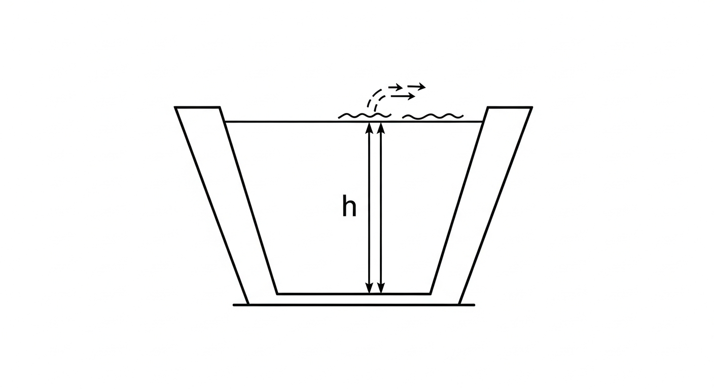

**核心难点**：曼宁公式是水深 $y$ 的高度非线性函数，无法显式求解。初值选择不当可能导致迭代发散，产生负水深或溢出错误。

### 4.3 求解方法

采用带物理约束保护的牛顿-拉夫逊迭代法：

1. **构建目标函数**：$f(y) = Q_{\text{Manning}}(y) - Q_{\text{target}} = 0$。
2. **数值导数**：以微小增量 $\delta y = 0.001\;\mathrm{m}$ 计算数值导数 $f'(y) \approx [f(y+\delta y) - f(y)] / \delta y$。
3. **迭代更新**：$y_{k+1} = y_k - f(y_k)/f'(y_k)$。
4. **物理约束保护**：强制 $y \geq 0.01\;\mathrm{m}$，防止负水深引发计算崩溃。
5. **收敛判据**：$|f(y)| < 10^{-5}\;\mathrm{m^3/s}$。

### 4.4 代码实现

```python
import numpy as np

# 梯形渠道参数
Q_target = 50.0   # 目标流量 m^3/s
b = 5.0            # 底宽 m
m = 1.5            # 边坡系数
S0 = 0.0005        # 底坡
n = 0.015          # 曼宁糙率
g = 9.81           # 重力加速度

def manning_equation(h):
    """计算给定水深下的曼宁流量"""
    A = (b + m * h) * h
    P = b + 2 * h * np.sqrt(1 + m**2)
    R = A / P
    return (1.0 / n) * A * (R**(2/3)) * np.sqrt(S0)

def solve_normal_depth(Q, h_guess=1.0, tol=1e-5, max_iter=100):
    """牛顿-拉夫逊迭代求解正常水深"""
    h = h_guess
    for i in range(max_iter):
        Q_calc = manning_equation(h)
        error = Q_calc - Q
        if abs(error) < tol:
            return h, i
        # 数值导数
        dh = 0.001
        dQ_dh = (manning_equation(h + dh) - Q_calc) / dh
        h_new = h - error / dQ_dh
        # 物理约束保护：防止迭代进入负水深区域
        h = max(h_new, 0.01)
    return h, max_iter

# 执行求解
h_normal, iterations = solve_normal_depth(Q_target)

# 计算弗劳德数
A_normal = (b + m * h_normal) * h_normal
v_normal = Q_target / A_normal
T_normal = b + 2 * m * h_normal          # 水面宽度
D_normal = A_normal / T_normal            # 水力水深
Fr = v_normal / np.sqrt(g * D_normal)

print(f"正常水深: {h_normal:.4f} m")
print(f"断面面积: {A_normal:.3f} m^2")
print(f"平均流速: {v_normal:.3f} m/s")
print(f"水力水深: {D_normal:.3f} m")
print(f"弗劳德数: {Fr:.4f}")
print(f"迭代次数: {iterations}")
print(f"流态: {'缓流' if Fr < 1 else '急流'}")
```

Source: `assets/ch01/ch01_normal_depth.py`

### 4.5 迭代过程追踪

Newton-Raphson 迭代追踪矩阵（数据来源：assets/ch01/iteration_table.md）：

| Iteration | Depth (m) | Calculated Q ($mathrm{m^3/s}$) | Error | Froude No. |
|---:|---:|---:|---:|---:|
| 0 | 1.000 | 8.036 | -41.964 | 2.725 |
| 1 | 3.946 | 109.963 | 59.963 | 0.232 |
| 2 | 2.910 | 59.190 | 9.190 | 0.416 |
| 3 | 2.683 | 50.401 | 0.401 | 0.484 |
| 4 | 2.672 | 50.001 | 0.001 | 0.488 |
| 5 | 2.672 | 50.000 | 0.000 | 0.488 |

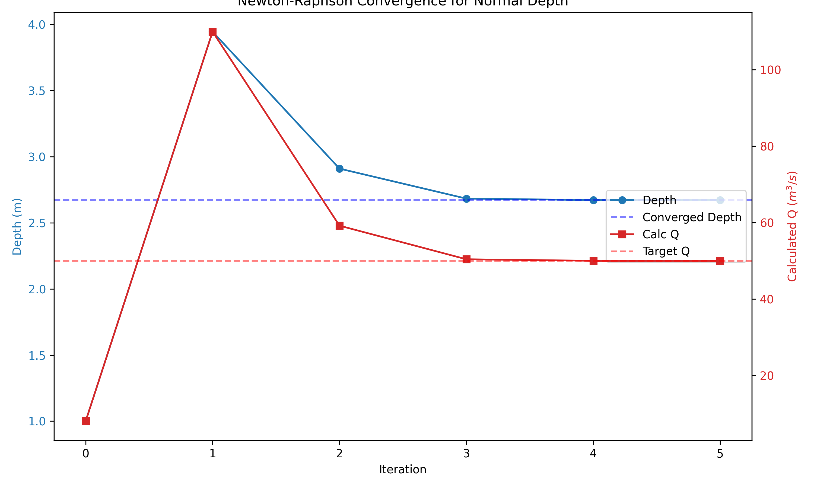

### 4.6 结果分析

算法从初始猜测 $y_0 = 1.0\;\mathrm{m}$ 出发，仅经 5 次迭代即收敛至精度 $10^{-7}$ 以内。计算结果表明：

- **正常水深** $y_n \approx 2.672\;\mathrm{m}$，满足 $50\;\mathrm{m^3/s}$ 设计流量要求。
- **断面平均流速** $V \approx 2.08\;\mathrm{m/s}$。
- **弗劳德数** $Fr \approx 0.488 < 1$，水流处于缓流状态。

缓流状态意味着下游水位变化可以通过水面波向上游传播，在控制系统设计中应采用下游水位反馈来调节上游闸门（下游控制策略）。

注意第 0 次迭代时弗劳德数为 2.725（急流），随着迭代推进水深增大后迅速转入缓流区间。第 1 次迭代出现了"过冲"现象（$y = 3.946\;\mathrm{m}$，$Q = 109.963\;\mathrm{m^3/s}$），这是牛顿法在强非线性函数上的典型行为，但后续迭代迅速收敛。

---

## 5. 工业部署建议

### 5.1 求解器的鲁棒性设计

在将牛顿-拉夫逊法嵌入大型水力学仿真软件（如 SWMM、MIKE 11）时，应注意以下工程实践：

（1）**混合求解策略**：当牛顿法在两点间振荡不收敛时，自动降级切换为二分法（Bisection Method），以绝对收敛为代价换取计算稳定性。

（2）**初值估计**：可利用流量的 5/3 次方关系进行初始水深估计，提高收敛速度。

（3）**奇异性处理**：当水深趋近零时，水力半径趋近零导致曼宁公式分母为零，需设置合理的下限保护。

### 5.2 糙率参数的在线校准

实际渠道的糙率系数 $n$ 并非常数，它随时间变化——水草生长、泥沙淤积、衬砌老化均会改变渠道的阻力特性。若控制系统一直使用设计期的固定糙率参数，前馈控制的精度将逐步下降。现代数字孪生系统应结合实时监测数据，采用卡尔曼滤波或参数辨识技术，实现糙率的在线动态校准。

### 5.3 圣维南方程的工程简化

在实际工程中，并非总需要求解完整的圣维南方程组。根据问题的时间尺度和精度要求，可进行不同程度的简化：

| 简化水平 | 保留项 | 适用场景 |
|---|---|---|
| 完整圣维南方程 | 全部四项 | 快速瞬变流（闸门突然启闭） |
| 扩散波方程 | 去掉惯性项 | 缓变洪水波演进 |
| 运动波方程 | 仅保留重力和摩擦项 | 陡坡山区河道洪水 |
| 稳态方程 | 所有时间导数为零 | 均匀流设计计算 |

---

## 6. 本章小结

本章建立了明渠水力学的理论基础，主要内容包括：

（1）明渠流与管道流的本质区别在于自由水面的存在，导致重力驱动、波速低、断面非线性等特征。

（2）圣维南方程组由质量守恒方程 (1.1) 和动量守恒方程 (1.2) 组成，是描述明渠一维非恒定流的基本控制方程。其中动量方程包含局部惯性项、对流惯性项、压力梯度项和重力-摩擦项。

（3）弗劳德数 $Fr = V/\sqrt{gD}$（其中 $D = A/T$ 为水力水深）是区分缓流（$Fr < 1$）和急流（$Fr > 1$）的判据，决定了水面波的传播方向和控制策略的选择。

（4）曼宁公式是均匀流计算的基本工具，由于其非线性特性，求解正常水深需采用数值迭代方法。牛顿-拉夫逊法具有二阶收敛速度，但需配合物理约束保护以确保鲁棒性。

---

## 7. 参考文献

[1] Saint-Venant, B. de. Theorie du mouvement non permanent des eaux, avec application aux crues des rivieres et a l'introduction des marees dans leur lit [J]. Comptes Rendus de l'Academie des Sciences, 1871, 73: 147-154, 237-240.

[2] Chow, V.T. Open-Channel Hydraulics [M]. New York: McGraw-Hill, 1959.

[3] Henderson, F.M. Open Channel Flow [M]. New York: Macmillan, 1966.

[4] Chaudhry, M.H. Open-Channel Flow [M]. 2nd ed. New York: Springer, 2008.

[5] 吴持恭. 水力学(第四版) [M]. 北京: 高等教育出版社, 2008.

[6] Cunge, J.A., Holly, F.M., Verwey, A. Practical Aspects of Computational River Hydraulics [M]. London: Pitman, 1980.

[7] Sturm, T.W. Open Channel Hydraulics [M]. New York: McGraw-Hill, 2001.

[8] Manning, R. On the flow of water in open channels and pipes [J]. Transactions of the Institution of Civil Engineers of Ireland, 1891, 20: 161-207.

---

# 第 2 章 均匀流与临界流

## 1. 学习目标

本章将明渠水流从复杂的非恒定状态简化为恒定状态，系统剖析均匀流、临界流和水跃的基本理论。完成本章学习后，读者应掌握以下内容：

1. 均匀流（Uniform Flow）的物理本质与成立条件，以及曼宁公式从谢才公式出发的推导过程。
2. 糙率系数 $n$ 的取值依据与典型工程材料的糙率范围。
3. 断面比能（Specific Energy）的定义及其与水深的三次函数关系。
4. 临界流（Critical Flow）作为比能最小值点的能量极值原理，以及临界水深和临界坡度的计算。
5. 交替水深（Alternate Depths）与共轭水深（Conjugate Depths）的本质区别——前者基于能量方程，后者基于动量方程。
6. 水跃（Hydraulic Jump）的形成条件、共轭水深公式及能量损失计算。
7. 复合断面均匀流的处理方法。

---

## 2. 教材理论

### 2.1 均匀流的物理本质

在长直棱柱形渠道中，当水流的水深、流速和断面面积沿程不变时，称为**均匀流**（Uniform Flow）。此时，驱动水流的重力沿程分量与渠底及边壁的摩擦阻力完全平衡：

$$\rho g A \Delta x \cdot S_0 = \rho g A \Delta x \cdot S_f$$

即均匀流条件为：

$$S_0 = S_f \tag{2.1}$$

均匀流对应的水深称为**正常水深**（Normal Depth, $y_n$），对应的流速称为正常流速。均匀流的成立需要以下条件：（a）渠道为长直棱柱形（断面形状和尺寸沿程不变）；（b）渠底坡度恒定；（c）水流为恒定流（流量不随时间变化）；（d）渠道足够长，使水流充分发展。

实际工程中严格的均匀流几乎不存在，但它为工程设计提供了最基本的参考状态——渠道断面尺寸的确定、糙率选择和安全超高的计算均以均匀流水深为基准。

### 2.2 从谢才公式到曼宁公式

均匀流的流速公式最早由法国工程师谢才（Chezy）于 1769 年提出：

$$V = C \sqrt{R S_f} \tag{2.2}$$

式中：$V$ 为断面平均流速（$\mathrm{m/s}$）；$C$ 为谢才系数（$\mathrm{m^{1/2}/s}$）；$R = A/P$ 为水力半径（$\mathrm{m}$）；$S_f$ 为摩擦坡度。

谢才系数 $C$ 并非真正的常数，而是与渠道糙率和水力半径有关。1890 年，爱尔兰工程师曼宁（Manning）提出了谢才系数的经验表达式：

$$C = \frac{1}{n} R^{1/6} \tag{2.3}$$

式中 $n$ 为曼宁糙率系数（$\mathrm{s/m^{1/3}}$）。将式 (2.3) 代入式 (2.2)：

$$V = \frac{1}{n} R^{1/6} \cdot \sqrt{R S_f} = \frac{1}{n} R^{1/6} \cdot R^{1/2} \cdot S_f^{1/2} = \frac{1}{n} R^{2/3} S_f^{1/2}$$

乘以断面面积 $A$ 即得曼宁流量公式：

$$\boxed{Q = \frac{1}{n} A R^{2/3} S_f^{1/2}} \tag{2.4}$$

在均匀流条件下，$S_f = S_0$，故：

$$Q = \frac{1}{n} A R^{2/3} S_0^{1/2} \tag{2.5}$$

### 2.3 糙率系数 $n$ 的选取

糙率系数 $n$ 是曼宁公式中唯一需要凭经验确定的参数，其取值直接影响设计水深和渠道尺寸。下表列出了常见渠道材料的糙率范围：

| 渠道类型 | $n$ 最小值 | $n$ 典型值 | $n$ 最大值 |
|---|---|---|---|
| 光滑混凝土衬砌 | 0.011 | 0.013 | 0.015 |
| 粗糙混凝土（成型后未抹光） | 0.013 | 0.015 | 0.018 |
| 浆砌石衬砌 | 0.017 | 0.025 | 0.030 |
| 整齐开挖土渠（维护良好） | 0.020 | 0.025 | 0.030 |
| 开挖土渠（杂草中等） | 0.025 | 0.030 | 0.035 |
| 天然河道（清洁、顺直） | 0.025 | 0.030 | 0.040 |
| 天然河道（有杂草和碎石） | 0.030 | 0.040 | 0.050 |
| 漫滩区（草地、灌木） | 0.035 | 0.060 | 0.150 |

数据来源：Chow (1959) 表 5-6，吴持恭 (2008) 附录。

糙率系数的选取应注意：（a）衬砌渠道的 $n$ 值随龄期增加而增大；（b）天然河道的 $n$ 值随季节变化，夏季水草茂盛时可增大 20%--50%；（c）复杂河道可采用 Cowan 方法分项估计。

### 2.4 复合断面均匀流

当渠道断面由多种不同糙率的子断面组成（如主槽与漫滩），不能简单地对整个断面使用单一的 $n$ 值。常用处理方法有：

**方法一：分区计算法**。将断面分为 $N$ 个子区域，各区域分别计算流量后求和：

$$Q = \sum_{i=1}^{N} Q_i = \sum_{i=1}^{N} \frac{1}{n_i} A_i R_i^{2/3} S_0^{1/2} \tag{2.6}$$

**方法二：等价糙率法**。基于湿周加权计算整个断面的等价糙率：

$$n_e = \left[\frac{\sum_{i=1}^{N} P_i n_i^{3/2}}{P}\right]^{2/3} \tag{2.7}$$

其中 $P = \sum P_i$ 为总湿周。该式由 Horton (1933) 和 Einstein (1934) 分别独立推导。

### 2.5 断面比能与临界流

#### 2.5.1 断面比能的定义

以渠底为基准面，单位重量水体所具有的能量称为**断面比能**（Specific Energy）：

$$E = y + \frac{\alpha V^2}{2g} = y + \frac{\alpha Q^2}{2gA^2} \tag{2.8}$$

式中：$y$ 为水深；$\alpha$ 为动能修正系数（均匀流取 $\alpha = 1$）；$V = Q/A$ 为断面平均流速。

对于矩形断面（$A = by$，单宽流量 $q = Q/b$），比能方程简化为：

$$E = y + \frac{q^2}{2gy^2} \tag{2.9}$$

#### 2.5.2 比能曲线与临界水深

由式 (2.9) 可知，给定流量 $q$，比能 $E$ 与水深 $y$ 的关系呈三次函数。分析其极值特征：

- 当 $y \to \infty$ 时，$V \to 0$，$E \approx y$，比能曲线趋近于 $45°$ 线。
- 当 $y \to 0$ 时，$V \to \infty$，$E \to \infty$。
- 两支之间必存在一个最小值点。

对 $E$ 关于 $y$ 求导并令其为零：

$$\frac{dE}{dy} = 1 - \frac{q^2}{gy^3} = 0$$

解得**临界水深**：

$$\boxed{y_c = \left(\frac{q^2}{g}\right)^{1/3}} \tag{2.10}$$

对应的**最小比能**为：

$$E_{\min} = y_c + \frac{q^2}{2gy_c^2} = y_c + \frac{y_c}{2} = \frac{3}{2}y_c \tag{2.11}$$

在临界点处，弗劳德数恰好等于 1：

$$Fr_c = \frac{V_c}{\sqrt{gy_c}} = \frac{q/y_c}{\sqrt{gy_c}} = \frac{q}{\sqrt{gy_c^3}} = 1$$

对于一般形状断面，临界流条件由 $\frac{dE}{dy} = 0$ 推导为：

$$\frac{Q^2 T}{gA^3} = 1 \tag{2.12}$$

其中 $T = dA/dy$ 为水面宽度。此式等价于 $Fr^2 = V^2/(gA/T) = V^2/(gD) = 1$。

#### 2.5.3 交替水深

当 $E > E_{\min}$ 时，同一比能 $E$ 和同一流量 $q$ 对应两个不同的水深解，称为**交替水深**（Alternate Depths）：

- 上支（$y > y_c$）：缓流，水深大、流速小，$Fr < 1$。
- 下支（$y < y_c$）：急流，水深小、流速大，$Fr > 1$。

交替水深的物理意义在于：它们是在相同能量条件下，水流可以采用的两种稳定状态。当水流遇到局部收缩、渠底抬升等干扰时，水深会在交替水深之间调整。

**特别强调**：交替水深是从比能方程（能量守恒）导出的概念，与下文将讨论的"共轭水深"本质不同。

### 2.6 水跃与共轭水深

#### 2.6.1 水跃现象

当急流在下游遇到缓流边界条件时（如闸门下游的尾水位较高），水流无法通过平缓的过渡来适应，而是发生一次剧烈的水面跃升，称为**水跃**（Hydraulic Jump）。水跃的本质是急流向缓流的强制转换过程，伴随着强烈的紊动和显著的能量损失。

#### 2.6.2 共轭水深公式的推导

水跃前后的水深称为**共轭水深**（Conjugate Depths）。由于水跃区域内摩擦力较小且水跃长度较短，可忽略渠底摩擦和重力沿程分量，采用**动量方程**建立水跃前后的关系。

对矩形断面水平渠底，取水跃前断面 1（水深 $y_1$，流速 $V_1$）和水跃后断面 2（水深 $y_2$，流速 $V_2$），由动量守恒：

$$\frac{1}{2}\rho g b y_1^2 + \rho Q V_1 = \frac{1}{2}\rho g b y_2^2 + \rho Q V_2$$

利用连续方程 $Q = b y_1 V_1 = b y_2 V_2$ 以及单宽流量 $q = Q/b$，化简为：

$$\frac{1}{2}g y_1^2 + \frac{q^2}{y_1} = \frac{1}{2}g y_2^2 + \frac{q^2}{y_2}$$

整理得：

$$\frac{q^2}{g}\left(\frac{1}{y_1} - \frac{1}{y_2}\right) = \frac{1}{2}(y_2^2 - y_1^2)$$

$$\frac{q^2}{g} \cdot \frac{y_2 - y_1}{y_1 y_2} = \frac{1}{2}(y_2 + y_1)(y_2 - y_1)$$

当 $y_2 \neq y_1$ 时，两边同除以 $(y_2 - y_1)$：

$$\frac{q^2}{g y_1 y_2} = \frac{1}{2}(y_1 + y_2)$$

$$\frac{2q^2}{g} = y_1 y_2 (y_1 + y_2) \tag{2.13}$$

利用 $Fr_1^2 = q^2/(gy_1^3)$，即 $q^2 = Fr_1^2 \cdot g y_1^3$，代入式 (2.13)，整理为关于 $y_2/y_1$ 的一元二次方程，解得：

$$\boxed{\frac{y_2}{y_1} = \frac{1}{2}\left(\sqrt{1 + 8Fr_1^2} - 1\right)} \tag{2.14}$$

式 (2.14) 即为矩形断面水跃共轭水深公式，又称 Belanger 方程。

**共轭水深与交替水深的区别**（本章最重要的概念辨析之一）：

| 比较项 | 交替水深（Alternate Depths） | 共轭水深（Conjugate Depths） |
|---|---|---|
| 理论依据 | 能量方程（比能守恒） | 动量方程（动量守恒） |
| 适用场景 | 比能曲线上同一 $E$ 的两个水深 | 水跃前后的两个水深 |
| 能量关系 | 两个水深对应**相同**的比能 | 水跃后比能**小于**水跃前 |
| 动量关系 | 两个水深的动量函数**不相等** | 两个水深的动量函数**相等** |
| 计算公式 | 由比能方程 $E = y + q^2/(2gy^2)$ 求解 | 由式 (2.14) $y_2/y_1 = \frac{1}{2}(\sqrt{1+8Fr_1^2}-1)$ 求解 |

#### 2.6.3 水跃的能量损失

水跃中的能量损失为水跃前后比能之差：

$$\Delta E = E_1 - E_2 = \left(y_1 + \frac{q^2}{2gy_1^2}\right) - \left(y_2 + \frac{q^2}{2gy_2^2}\right)$$

经过代数化简（利用式 (2.13)），可得：

$$\boxed{\Delta E = \frac{(y_2 - y_1)^3}{4 y_1 y_2}} \tag{2.15}$$

该公式表明，水深差 $(y_2 - y_1)$ 越大，能量损失越大。工程中正是利用水跃来消除多余能量，保护下游渠道免受高速水流的冲刷破坏。

### 2.7 临界坡度

对于给定的流量、断面形状和糙率，使正常水深 $y_n$ 恰好等于临界水深 $y_c$ 的渠底坡度称为**临界坡度** $S_c$。当 $S_0 < S_c$ 时，$y_n > y_c$，正常水深在缓流区，称为**缓坡**；当 $S_0 > S_c$ 时，$y_n < y_c$，正常水深在急流区，称为**陡坡**。渠底坡度的分类是后续水面曲线分析的基础。

---

## 3. 典型例题

### 例题 2.1 矩形渠道的临界水深与交替水深

**题目**：某矩形渠道底宽 $b = 6.0\;\mathrm{m}$，输水流量 $Q = 30.0\;\mathrm{m^3/s}$。
（1）求临界水深 $y_c$ 和最小比能 $E_{\min}$；
（2）若断面比能 $E = E_{\min} + 1.0\;\mathrm{m}$，求两个交替水深。

**解**：

（1）单宽流量 $q = Q/b = 30.0/6.0 = 5.0\;\mathrm{m^2/s}$。

由式 (2.10)：

$$y_c = \left(\frac{q^2}{g}\right)^{1/3} = \left(\frac{25}{9.81}\right)^{1/3} = (2.549)^{1/3} = 1.366\;\mathrm{m}$$

$$E_{\min} = \frac{3}{2} y_c = 1.5 \times 1.366 = 2.049\;\mathrm{m}$$

验证弗劳德数：$V_c = q/y_c = 5.0/1.366 = 3.661\;\mathrm{m/s}$，$Fr_c = V_c/\sqrt{gy_c} = 3.661/\sqrt{9.81 \times 1.366} = 3.661/3.661 = 1.00$。正确。

（2）令 $E = 2.049 + 1.0 = 3.049\;\mathrm{m}$。需解方程：

$$y + \frac{q^2}{2gy^2} = 3.049, \quad \text{即} \quad y + \frac{25}{2 \times 9.81 \times y^2} = 3.049$$

$$y + \frac{1.274}{y^2} = 3.049$$

**试算急流交替水深**（取 $y < y_c$）：

试 $y = 0.75\;\mathrm{m}$：$0.75 + 1.274/0.5625 = 0.75 + 2.265 = 3.015$，偏小。

试 $y = 0.74\;\mathrm{m}$：$0.74 + 1.274/0.5476 = 0.74 + 2.327 = 3.067$，偏大。

插值得 $y_1 \approx 0.743\;\mathrm{m}$。

**试算缓流交替水深**（取 $y > y_c$）：

试 $y = 2.9\;\mathrm{m}$：$2.9 + 1.274/8.41 = 2.9 + 0.152 = 3.052$，偏大。

试 $y = 2.89\;\mathrm{m}$：$2.89 + 1.274/8.352 = 2.89 + 0.153 = 3.043$，接近。

精确值 $y_2 \approx 2.897\;\mathrm{m}$。

**结果**：急流交替水深 $y_1 \approx 0.743\;\mathrm{m}$（$Fr = 2.49$），缓流交替水深 $y_2 \approx 2.897\;\mathrm{m}$（$Fr = 0.324$）。

### 例题 2.2 矩形断面水跃共轭水深

**题目**：某矩形渠道中急流水深 $y_1 = 0.5\;\mathrm{m}$，流速 $V_1 = 8.0\;\mathrm{m/s}$。求水跃后的共轭水深 $y_2$ 及水跃能量损失。

**解**：

$$Fr_1 = \frac{V_1}{\sqrt{gy_1}} = \frac{8.0}{\sqrt{9.81 \times 0.5}} = \frac{8.0}{2.215} = 3.613$$

由式 (2.14)：

$$\frac{y_2}{y_1} = \frac{1}{2}(\sqrt{1 + 8 \times 3.613^2} - 1) = \frac{1}{2}(\sqrt{1 + 104.4} - 1) = \frac{1}{2}(\sqrt{105.4} - 1)$$

$$= \frac{1}{2}(10.266 - 1) = 4.633$$

$$y_2 = 4.633 \times 0.5 = 2.317\;\mathrm{m}$$

单宽流量 $q = V_1 y_1 = 8.0 \times 0.5 = 4.0\;\mathrm{m^2/s}$。

能量损失由式 (2.15)：

$$\Delta E = \frac{(y_2 - y_1)^3}{4y_1 y_2} = \frac{(2.317 - 0.5)^3}{4 \times 0.5 \times 2.317} = \frac{(1.817)^3}{4.634} = \frac{6.001}{4.634} = 1.295\;\mathrm{m}$$

水跃前比能 $E_1 = 0.5 + 4.0^2/(2 \times 9.81 \times 0.25) = 0.5 + 3.262 = 3.762\;\mathrm{m}$。

能量损失率 $\Delta E / E_1 = 1.295/3.762 = 34.4\%$。水跃消耗了超过三分之一的水流能量。

### 例题 2.3 梯形断面正常水深与临界水深

**题目**：某梯形渠道底宽 $b = 4.0\;\mathrm{m}$，边坡系数 $m = 2.0$，糙率 $n = 0.020$，底坡 $S_0 = 0.001$，流量 $Q = 20\;\mathrm{m^3/s}$。求正常水深 $y_n$ 和临界水深 $y_c$，判断渠道是缓坡还是陡坡。

**解正常水深**：利用曼宁公式试算。

试 $y = 1.5\;\mathrm{m}$：$A = (4+2\times1.5)\times1.5 = 10.5$，$P = 4+2\times1.5\sqrt{5} = 10.708$，$R = 0.981$，$Q = (1/0.020)\times10.5\times0.981^{2/3}\times0.001^{1/2} = 50\times10.5\times0.987\times0.0316 = 16.37$。偏小。

试 $y = 1.7\;\mathrm{m}$：$A = (4+3.4)\times1.7 = 12.58$，$P = 4+2\times1.7\times2.236 = 11.602$，$R = 1.084$，$Q = 50\times12.58\times1.054\times0.0316 = 20.97$。接近。

精确迭代得 $y_n \approx 1.68\;\mathrm{m}$。

**解临界水深**：由临界流条件 $Q^2T/(gA^3) = 1$，即 $20^2(4+2\times2\times y_c)/[9.81\times((4+2y_c)y_c)^3] = 1$。

试 $y_c = 1.0\;\mathrm{m}$：$A = 6.0$，$T = 8.0$，$Q^2T/(gA^3) = 400\times8/(9.81\times216) = 1.511$。大于 1。

试 $y_c = 1.15\;\mathrm{m}$：$A = 7.245$，$T = 8.6$，$Q^2T/(gA^3) = 400\times8.6/(9.81\times380.4) = 0.922$。小于 1。

插值得 $y_c \approx 1.08\;\mathrm{m}$。

由于 $y_n = 1.68 > y_c = 1.08$，正常水深在缓流区，故该渠道为**缓坡**。

---

## 4. 工程案例：矩形渠道比能曲线与交替水深的数值验证

### 4.1 案例背景

在长距离输水渡槽或底坡突变段的设计中，水流常需在缓流与急流之间切换。工程师必须准确掌握设计流量下的比能特征，以确定最小比能对应的临界状态，并预判各种流态下的水深。

### 4.2 问题描述

某矩形干渠底宽 $b = 6.0\;\mathrm{m}$，设计输水流量 $Q = 30.0\;\mathrm{m^3/s}$。需要：（1）绘制比能曲线；（2）确定临界水深和最小比能；（3）当比能 $E = E_{\min} + 1.0\;\mathrm{m}$ 时，计算交替水深并验证流态。

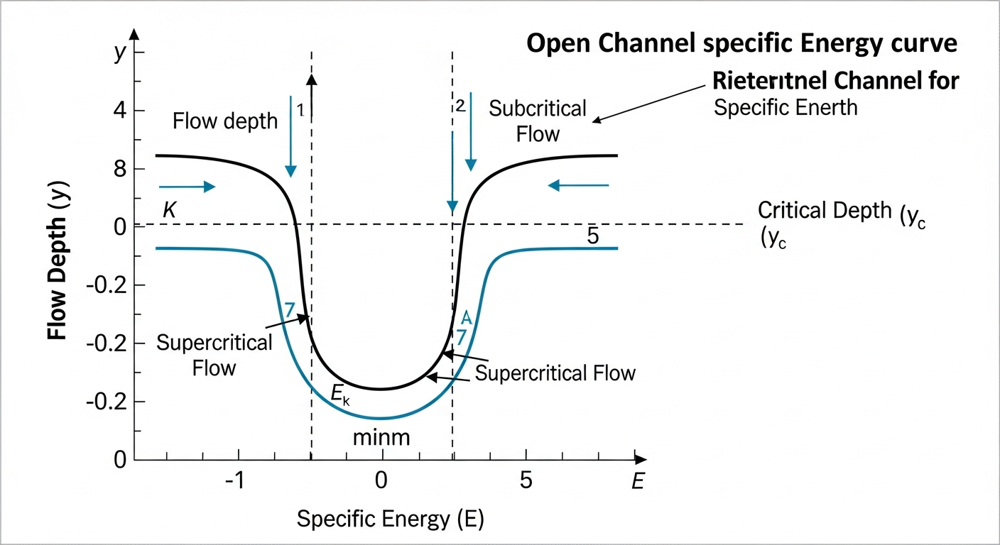

### 4.3 代码实现

```python
import numpy as np
from scipy.optimize import fsolve

# 渠道参数
b = 6.0      # 底宽 m
Q = 30.0     # 流量 m^3/s
g = 9.81     # 重力加速度
q = Q / b    # 单宽流量 m^2/s

# 临界水深（解析解）
y_c = (q**2 / g) ** (1/3)
E_min = 1.5 * y_c
print(f"临界水深 y_c = {y_c:.3f} m")
print(f"最小比能 E_min = {E_min:.3f} m")

# 比能函数
def specific_energy(y):
    return y + q**2 / (2 * g * y**2)

# 弗劳德数
def froude_number(y):
    V = q / y
    return V / np.sqrt(g * y)

# 给定 E_target，求交替水深
E_target = E_min + 1.0
residual = lambda y: specific_energy(y) - E_target

# 急流交替水深（初值 < y_c）
y_sup = fsolve(residual, 0.5 * y_c)[0]
# 缓流交替水深（初值 > y_c）
y_sub = fsolve(residual, 2.0 * y_c)[0]

print(f"\nE_target = {E_target:.3f} m")
print(f"急流交替水深: y1 = {y_sup:.3f} m, V = {q/y_sup:.3f} m/s, Fr = {froude_number(y_sup):.3f}")
print(f"缓流交替水深: y2 = {y_sub:.3f} m, V = {q/y_sub:.3f} m/s, Fr = {froude_number(y_sub):.3f}")

# 比能曲线数据
y_range = np.linspace(0.3, 4.0, 100)
E_range = specific_energy(y_range)
Fr_range = np.array([froude_number(y) for y in y_range])
```

Source: `assets/ch02/ch02_specific_energy.py`

### 4.4 比能曲线数据表

| Depth $y$ (m) | Specific Energy $E$ (m) | Velocity $V$ (m/s) | Froude No. | Flow State |
|---:|---:|---:|---:|:---|
| 0.500 | 5.597 | 10.000 | 4.515 | 急流 (Supercritical) |
| 0.743 | 3.049 | 6.726 | 2.490 | 急流 (Supercritical) |
| 0.800 | 2.791 | 6.250 | 2.231 | 急流 (Supercritical) |
| 1.366 | 2.049 | 3.661 | 1.000 | 临界流 (Critical) |
| 1.800 | 2.193 | 2.778 | 0.661 | 缓流 (Subcritical) |
| 2.897 | 3.049 | 1.726 | 0.324 | 缓流 (Subcritical) |
| 3.500 | 3.604 | 1.429 | 0.244 | 缓流 (Subcritical) |

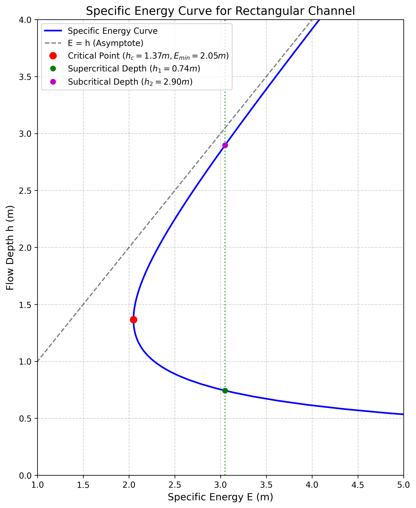

### 4.5 结果分析

（1）临界水深 $y_c = 1.366\;\mathrm{m}$，最小比能 $E_{\min} = 2.049\;\mathrm{m}$。在临界点处 $Fr = 1.00$，验证了理论的正确性。

（2）当比能提升至 $E = 3.049\;\mathrm{m}$ 时，存在两个交替水深：

- **急流态**：$y_1 = 0.743\;\mathrm{m}$，$V = 6.726\;\mathrm{m/s}$，$Fr = 2.49$。水流动能占主导。
- **缓流态**：$y_2 = 2.897\;\mathrm{m}$，$V = 1.726\;\mathrm{m/s}$，$Fr = 0.324$。水流势能占主导。

（3）两个交替水深具有相同的比能（$E = 3.049\;\mathrm{m}$），但如果急流要转变为缓流，则必须通过水跃实现。水跃过程中将消耗能量（$\Delta E > 0$），因此水跃后的水深（共轭水深 $y_2'$）将**小于**交替水深 $y_2$。这是区分交替水深与共轭水深的关键所在。

---

## 5. 工业部署建议

### 5.1 临界流在量水中的应用

在水网系统中设计量水建筑物（如巴歇尔槽、宽顶堰）时，正是利用了临界流的极值原理。通过收缩断面或抬高渠底，强迫水流通过临界状态（$Fr = 1$），使得流量仅由上游水深唯一确定，从而切断下游水位变化对测量精度的干扰。

### 5.2 水跃在消能中的应用

在水工建筑物（如溢洪道、泄水闸）下游，高速急流若直接冲刷天然河床将造成严重破坏。工程上通常在下游设置消力池（stilling basin），利用水跃消耗多余动能。消力池的设计核心就是共轭水深公式 (2.14)：消力池深度应使尾水深度等于或略大于共轭水深 $y_2$，确保水跃稳定发生在池内。

### 5.3 数值仿真中的临界流奇异性

在一维水动力学模型的数值求解中，临界水深 $y_c$ 附近是极度危险的数值"奇点"。微小的比能变化在临界点附近会导致水深的剧烈跳跃，常引发牛顿迭代发散或"除以零"异常。工业级求解器通常采用以下策略：

（a）在 $0.95 < Fr < 1.05$ 的区间内引入迎风格式（Upwind Scheme）或局部人工黏性。

（b）采用 Godunov 型有限体积法，天然具有处理间断（水跃）的能力。

---

## 6. 本章小结

本章系统论述了明渠恒定流的两种基本状态及其转换机制：

（1）**均匀流**是重力与摩擦力平衡的理想状态。曼宁公式（由谢才公式演化而来）是均匀流计算的基本工具，糙率系数 $n$ 的合理选取是设计精度的关键。

（2）**断面比能** $E = y + V^2/(2g)$ 是能量分析的核心。比能曲线揭示了临界水深 $y_c$ 作为最小比能点的存在，将水流划分为缓流区和急流区。

（3）**交替水深**是比能曲线上对应相同比能的两个水深，来源于能量方程。**共轭水深**是水跃前后满足动量守恒的两个水深，来源于动量方程。二者的混淆是初学者最常见的概念错误。

（4）矩形断面水跃的共轭水深公式 $y_2/y_1 = \frac{1}{2}(\sqrt{1+8Fr_1^2}-1)$ 和能量损失公式 $\Delta E = (y_2-y_1)^3/(4y_1y_2)$ 是消能设计的理论基础。

---

## 7. 参考文献

[1] Chow, V.T. Open-Channel Hydraulics [M]. New York: McGraw-Hill, 1959.

[2] Henderson, F.M. Open Channel Flow [M]. New York: Macmillan, 1966.

[3] Chaudhry, M.H. Open-Channel Flow [M]. 2nd ed. New York: Springer, 2008.

[4] 吴持恭. 水力学(第四版) [M]. 北京: 高等教育出版社, 2008.

[5] Bakhmeteff, B.A. Hydraulics of Open Channels [M]. New York: McGraw-Hill, 1932.

[6] Belanger, J.B. Essai sur la solution numerique de quelques problemes relatifs au mouvement permanent des eaux courantes [M]. Paris: Carilian-Goeury, 1828.

[7] Sturm, T.W. Open Channel Hydraulics [M]. New York: McGraw-Hill, 2001.

[8] Horton, R.E. Separate roughness coefficients for channel bottom and sides [J]. Engineering News-Record, 1933, 111(22): 652-653.

[9] Einstein, H.A. Der hydraulische oder Profil-Radius [J]. Schweizerische Bauzeitung, 1934, 103(8): 89-91.

[10] Manning, R. On the flow of water in open channels and pipes [J]. Transactions of the Institution of Civil Engineers of Ireland, 1891, 20: 161-207.

---

# 第 3 章 水工建筑物水力学

## 1. 学习目标

本章探讨水工建筑物（闸门、堰、量水槽等）在明渠中的水力学作用。这些建筑物作为水流的"控制节点"，强制改变水流状态，在工程调度中发挥关键作用。完成本章学习后，读者应掌握以下内容：

1. 闸门自由出流的水力计算方法，包括流量系数的非线性特性。
2. 闸门淹没出流的判别条件和计算公式。
3. 薄壁堰（sharp-crested weir）的出流公式及流量系数。
4. 宽顶堰（broad-crested weir）的出流机理和计算方法。
5. 量水建筑物（巴歇尔槽）的工作原理与流量计算。
6. 收缩断面水深符号约定：用 $y_{cc}$ 表示收缩断面水深，与临界水深 $y_c$ 严格区分。

---

## 2. 教材理论

### 2.1 闸门出流概述

在明渠中，闸门（sluice gate）是最常用的流量调节建筑物。当闸门部分开启时，上游来流被迫从闸底开口处高速射出，在闸门下游形成一段收缩水流。闸门出流按下游水位条件的不同，分为**自由出流**和**淹没出流**两种工况。

### 2.2 闸门自由出流

#### 2.2.1 基本公式推导

对于平底矩形明渠上的垂直平板闸门，当下游水位低于收缩断面水深时，出流不受下游顶托，称为**自由出流**。

取上游断面（距闸门足够远，流线近似平行，水深 $H_0$）和收缩断面（闸门下游约 $0.5e$ 处，水深 $y_{cc}$）为控制断面。由于两断面之间的水程较短且渠底水平，可忽略摩擦损失，应用伯努利方程：

$$H_0 + \frac{V_0^2}{2g} = y_{cc} + \frac{V_{cc}^2}{2g}$$

当上游渠道较宽、水深较大时，行近流速 $V_0$ 可忽略，即 $V_0^2/(2g) \ll H_0$。又设收缩断面水深 $y_{cc} = \varepsilon \cdot e$，其中 $\varepsilon$ 为收缩系数（垂直平板闸门 $\varepsilon \approx 0.61$），$e$ 为闸门开度。则：

$$H_0 \approx \varepsilon e + \frac{V_{cc}^2}{2g}$$

$$V_{cc} = \sqrt{2g(H_0 - \varepsilon e)}$$

流量为：

$$Q = V_{cc} \cdot A_{cc} = V_{cc} \cdot b \cdot \varepsilon e = \varepsilon e \cdot b \cdot \sqrt{2g(H_0 - \varepsilon e)}$$

整理为标准形式：

$$\boxed{Q = \mu \cdot e \cdot b \cdot \sqrt{2g H_0}} \tag{3.1}$$

其中流量系数 $\mu$ 综合反映了流速损失和断面收缩效应：

$$\mu = \frac{\varepsilon}{\sqrt{1 + \varepsilon \cdot \dfrac{e}{H_0}}} \tag{3.2}$$

**关于符号 $y_{cc}$ 的说明**：本书采用 $y_{cc}$（contraction depth）表示收缩断面水深，以区别于临界水深 $y_c$（critical depth）。两者是完全不同的概念——$y_{cc}$ 由闸门开度和收缩系数决定（$y_{cc} = \varepsilon e$），$y_c$ 由流量和断面形状决定。

#### 2.2.2 流量系数的非线性特性

由式 (3.2) 可知，流量系数 $\mu$ 是开度比 $e/H_0$ 的函数，并非常数。当 $e/H_0 \to 0$ 时，$\mu \to \varepsilon \approx 0.61$；当 $e/H_0$ 增大时，$\mu$ 逐渐减小。这意味着闸门开度与下泄流量之间不存在简单的正比关系——开度增大一倍，流量的增幅小于一倍。

### 2.3 闸门淹没出流

#### 2.3.1 淹没出流的判别

当下游水位 $h_t$ 升高至超过收缩断面水深 $y_{cc}$ 时，下游水体对闸门出流形成"顶托"，称为**淹没出流**（submerged outflow）。判别准则为：

$$\text{自由出流条件}: \quad h_t < y_{cc} = \varepsilon \cdot e \tag{3.3a}$$

$$\text{淹没出流条件}: \quad h_t \geq y_{cc} = \varepsilon \cdot e \tag{3.3b}$$

实际工程中，有时采用更保守的判别标准：当 $h_t > 0.8 y_{cc}$ 时即认为开始受下游影响。

#### 2.3.2 淹没出流计算公式

淹没出流时，闸门下游形成一层厚度为 $h_t$ 的水垫，射流需克服下游水压做功。常用的淹没出流公式为：

$$Q = \mu_s \cdot e \cdot b \cdot \sqrt{2g(H_0 - h_t)} \tag{3.4}$$

式中：$h_t$ 为下游尾水深度；$\mu_s$ 为淹没出流的流量系数，其值小于自由出流的 $\mu$，通常 $\mu_s = 0.50 \sim 0.55$。

也有文献采用淹没系数 $\sigma_s$ 的修正方式：

$$Q = \sigma_s \cdot \mu \cdot e \cdot b \cdot \sqrt{2g H_0} \tag{3.5}$$

其中 $\sigma_s = f(h_t/H_0, e/H_0)$，$\sigma_s < 1$。Henry (1950) 给出了系统的实验数据曲线，Swamee (1992) 提出了经验拟合公式。

淹没出流与自由出流相比，同一开度下的下泄流量显著减小，且流量对上下游水位差更加敏感。在实时控制系统中，一旦检测到从自由出流向淹没出流的转换，必须立即切换控制逻辑和流量计算公式，否则将产生严重的流量估算偏差。

### 2.4 薄壁堰

#### 2.4.1 基本概念

薄壁堰（sharp-crested weir）是指堰顶厚度 $\delta$ 与堰上水头 $H$ 之比 $\delta/H < 0.67$ 的堰。水流越过堰顶时形成完全脱离堰壁的自由溢流水舌（nappe），堰顶仅起到控制水面高程的作用。

#### 2.4.2 矩形薄壁堰流量公式

取堰顶上游适当距离处的断面和堰顶处的断面，忽略能量损失，沿水深方向对过堰流速进行积分，可得矩形薄壁堰的理论流量公式：

在堰顶以上某一微元层 $dz$（距堰顶高度 $z$），该层的理论流速为 $v = \sqrt{2gz}$（假设上游行近流速可忽略），微元面积为 $b \cdot dz$，总流量为：

$$Q_{\text{理论}} = \int_0^H b \sqrt{2gz} \, dz = b\sqrt{2g} \cdot \frac{2}{3} H^{3/2}$$

考虑实际流动中的收缩和能量损失，引入流量系数 $C_d$：

$$\boxed{Q = C_d \cdot \frac{2}{3} \sqrt{2g} \cdot b \cdot H^{3/2}} \tag{3.6}$$

式中：$C_d$ 为无量纲流量系数，一般取 $0.60 \sim 0.65$；$b$ 为堰口宽度（$\mathrm{m}$）；$H$ 为堰上水头（$\mathrm{m}$），从堰顶量至上游水面（在堰上游 $3 \sim 4H$ 处测量，以避免水面降落的影响）。

$C_d$ 的经验公式（Rehbock, 1929）：

$$C_d = 0.611 + 0.075 \frac{H}{P} \tag{3.7}$$

其中 $P$ 为堰高（从渠底到堰顶的高度）。当 $H/P$ 较小时，$C_d \approx 0.611$；随着 $H/P$ 增大（行近流速效应增强），$C_d$ 略有增大。

#### 2.4.3 三角形薄壁堰

三角形（V 形）薄壁堰适用于小流量的精确测量。其流量公式为：

$$Q = C_d \cdot \frac{8}{15} \sqrt{2g} \cdot \tan\frac{\theta}{2} \cdot H^{5/2} \tag{3.8}$$

式中 $\theta$ 为缺口夹角，常用 $\theta = 90°$。三角形堰的优点是在小流量时仍有较大的水头变化，测量灵敏度高。

### 2.5 宽顶堰

#### 2.5.1 出流机理

宽顶堰（broad-crested weir）的堰顶厚度满足 $2H \leq \delta \leq 10H$，水流在堰顶上能够形成近似平行流线的流动区域。当堰顶足够长时，水流在堰顶上将趋近于临界流状态。

根据能量方程，取上游水面（总水头 $H_0 \approx H + P$，以堰顶为基准即 $H$）和堰顶上水深 $y$ 的断面：

$$H = y + \frac{V^2}{2g} = y + \frac{q^2}{2gy^2}$$

这就是第 2 章所述的比能方程。堰上自由出流时，堰顶上水深趋近于临界水深 $y_c$，即：

$$y_c = \frac{2}{3}H \tag{2.11 的等价形式}$$

将 $y_c$ 和 $V_c = \sqrt{gy_c}$ 代入流量公式 $Q = V_c \cdot y_c \cdot b$：

$$Q = \sqrt{g \cdot \frac{2}{3}H} \cdot \frac{2}{3}H \cdot b = \frac{2}{3}\sqrt{\frac{2}{3}g} \cdot b \cdot H^{3/2}$$

引入流量系数 $C_{dw}$ 以修正实际偏差：

$$\boxed{Q = C_{dw} \cdot \frac{2}{3} \sqrt{\frac{2}{3}g} \cdot b \cdot H^{3/2}} \tag{3.9}$$

理论上 $C_{dw} = 1.0$，实际因边界层效应和入口能量损失，$C_{dw} = 0.85 \sim 0.95$。

宽顶堰的特点是：只要堰上水流处于自由出流状态（不被下游淹没），流量仅由上游水头 $H$ 决定，与下游水位无关。这一特性使其成为理想的流量测量和控制装置。

#### 2.5.2 淹没判别

当下游水位升高至堰顶以上一定高度时，宽顶堰将从自由出流转为淹没出流。淹没临界条件约为下游堰上水深 $h_t > 0.8 y_c \approx 0.53 H$。淹没后流量减小，需引入淹没修正系数。

### 2.6 量水建筑物：巴歇尔槽

#### 2.6.1 基本原理

巴歇尔槽（Parshall Flume）是一种标准化的量水建筑物，由渐缩段、喉道段和渐扩段组成。其工作原理是通过收缩渠道宽度和降低渠底高程，迫使水流在喉道处达到或接近临界状态，使得流量仅由上游水深唯一确定。

巴歇尔槽的优点包括：（a）水头损失小（约为堰的 1/4）；（b）含沙水流不易淤积（有自清能力）；（c）不需要静水池即可测量；（d）精度较高（误差通常在 3%--5%）。

#### 2.6.2 流量公式

巴歇尔槽的流量公式为经验公式，形式为：

$$Q = K \cdot H_a^n \tag{3.10}$$

式中：$H_a$ 为渐缩段指定位置处的水深（$\mathrm{m}$）；$K$ 和 $n$ 为与喉道宽度 $W$ 有关的常数。

不同喉道宽度的典型系数（国际标准）：

| 喉道宽度 $W$ (m) | $K$ | $n$ | 适用流量范围 ($\mathrm{m^3/s}$) |
|---|---|---|---|
| 0.152 (6 in) | 0.381 | 1.580 | 0.0008 -- 0.054 |
| 0.305 (12 in) | 0.690 | 1.522 | 0.0014 -- 0.110 |
| 0.610 (24 in) | 1.428 | 1.550 | 0.0025 -- 0.252 |
| 0.914 (36 in) | 2.184 | 1.566 | 0.0028 -- 0.457 |
| 1.219 (48 in) | 2.953 | 1.578 | 0.0042 -- 0.695 |
| 1.524 (60 in) | 3.732 | 1.587 | 0.0056 -- 0.937 |

数据来源：美国垦务局 (USBR) 标准。

当下游水位过高导致淹没比 $S_r = H_b/H_a > 0.7$ 时（$H_b$ 为喉道下游指定位置的水深），需进行淹没修正。

### 2.7 各类水工建筑物的比较

| 建筑物类型 | 流量公式形式 | 主要优点 | 主要缺点 | 典型应用 |
|---|---|---|---|---|
| 闸门（自由出流） | $Q \propto e \sqrt{H}$ | 流量调节灵活 | 流量系数非线性 | 渠道流量调节 |
| 薄壁堰 | $Q \propto H^{3/2}$ | 精度高，结构简单 | 水头损失大 | 实验室量水 |
| 宽顶堰 | $Q \prox H^{3/2}$ | 结构坚固，可通过碎石 | 精度略低于薄壁堰 | 灌溉渠道量水 |
| 巴歇尔槽 | $Q = KH_a^n$ | 水头损失小，自清能力强 | 需标准化安装 | 灌区和污水处理 |

---

## 3. 典型例题

### 例题 3.1 薄壁堰流量计算

**题目**：某矩形薄壁堰，堰口宽度 $b = 2.0\;\mathrm{m}$，堰高 $P = 1.5\;\mathrm{m}$，上游水面高出堰顶 $H = 0.40\;\mathrm{m}$。求过堰流量。

**解**：

首先计算流量系数。由 Rehbock 公式 (3.7)：

$$C_d = 0.611 + 0.075 \times \frac{H}{P} = 0.611 + 0.075 \times \frac{0.40}{1.50} = 0.611 + 0.020 = 0.631$$

代入薄壁堰流量公式 (3.6)：

$$Q = C_d \cdot \frac{2}{3}\sqrt{2g} \cdot b \cdot H^{3/2}$$

$$= 0.631 \times \frac{2}{3} \times \sqrt{2 \times 9.81} \times 2.0 \times 0.40^{3/2}$$

$$= 0.631 \times 0.6667 \times 4.429 \times 2.0 \times 0.2530$$

$$= 0.631 \times 0.6667 \times 4.429 \times 0.5060$$

$$= 0.942\;\mathrm{m^3/s}$$

**结果**：过堰流量 $Q \approx 0.94\;\mathrm{m^3/s}$。

### 例题 3.2 宽顶堰流量计算

**题目**：某宽顶堰，堰顶宽度 $b = 5.0\;\mathrm{m}$，堰上水头 $H = 0.60\;\mathrm{m}$，流量系数 $C_{dw} = 0.90$。求过堰流量。

**解**：

由宽顶堰流量公式 (3.9)：

$$Q = C_{dw} \cdot \frac{2}{3}\sqrt{\frac{2}{3}g} \cdot b \cdot H^{3/2}$$

$$= 0.90 \times \frac{2}{3} \times \sqrt{\frac{2}{3} \times 9.81} \times 5.0 \times 0.60^{3/2}$$

计算中间值：$\sqrt{2g/3} = \sqrt{6.54} = 2.557$：

$$= 0.90 \times 0.6667 \times 2.557 \times 5.0 \times 0.4648$$

$$= 0.90 \times 0.6667 \times 2.557 \times 2.324$$

$$= 3.566\;\mathrm{m^3/s}$$

也可以简化计算：宽顶堰的综合系数 $m_w = C_{dw} \cdot \frac{2}{3}\sqrt{2g/3}$：

$$m_w = 0.90 \times \frac{2}{3} \times 2.557 = 1.534$$

$$Q = m_w \cdot b \cdot H^{3/2} = 1.534 \times 5.0 \times 0.4648 = 3.566\;\mathrm{m^3/s}$$

**结果**：过堰流量 $Q \approx 3.57\;\mathrm{m^3/s}$。

### 例题 3.3 闸门出流类型判别

**题目**：某矩形渠道上的平板闸门，上游水深 $H_0 = 4.0\;\mathrm{m}$，闸门开度 $e = 1.0\;\mathrm{m}$，收缩系数 $\varepsilon = 0.61$。分别判断下游水深 $h_t = 0.4\;\mathrm{m}$ 和 $h_t = 1.5\;\mathrm{m}$ 时的出流类型。

**解**：

收缩断面水深 $y_{cc} = \varepsilon \cdot e = 0.61 \times 1.0 = 0.61\;\mathrm{m}$。

（1）当 $h_t = 0.4\;\mathrm{m} < y_{cc} = 0.61\;\mathrm{m}$：自由出流。

（2）当 $h_t = 1.5\;\mathrm{m} > y_{cc} = 0.61\;\mathrm{m}$：淹没出流。

---

## 4. 工程案例：矩形闸门自由出流特性分析

### 4.1 案例背景

在数字孪生水网中，泵闸群的联合调度是核心业务。工程师必须掌握闸门在不同开度下的非线性出流特性，建立精确的闸门-流量关系曲线，作为控制系统前馈环节的核心依据。

### 4.2 问题描述

某节制闸所在矩形渠道底宽 $b = 4.0\;\mathrm{m}$，上游恒定水深 $H_0 = 5.0\;\mathrm{m}$（忽略行近流速）。需计算闸门开度 $e$ 从 $0.5\;\mathrm{m}$ 至 $3.0\;\mathrm{m}$ 时的流量 $Q$、流量系数 $\mu$ 和收缩断面弗劳德数 $Fr_{cc}$ 的变化规律。


### 4.3 代码实现

```python
import numpy as np

# 渠道和闸门参数
b = 4.0       # 闸孔宽度 m
H0 = 5.0      # 上游水深 m
epsilon = 0.61 # 收缩系数
g = 9.81      # 重力加速度

# 开度扫描范围
e_range = np.arange(0.5, 3.5, 0.5)

print(f"{'e (m)':>8} {'mu':>8} {'Q (m3/s)':>12} {'y_cc (m)':>10} {'Fr_cc':>8}")
print("-" * 50)

for e in e_range:
    # 流量系数（式3.2）
    mu = epsilon / np.sqrt(1 + epsilon * e / H0)
    # 流量（式3.1）
    Q = mu * e * b * np.sqrt(2 * g * H0)
    # 收缩断面水深
    y_cc = epsilon * e
    # 收缩断面流速和弗劳德数
    V_cc = Q / (b * y_cc)
    Fr_cc = V_cc / np.sqrt(g * y_cc)

    print(f"{e:8.1f} {mu:8.4f} {Q:12.2f} {y_cc:10.2f} {Fr_cc:8.2f}")
```

Source: `assets/ch03/ch03_gate_outflow.py`

### 4.4 计算结果

闸门操作域流量特性追踪矩阵：

| Gate Opening $e$ (m) | Discharge Coeff $\mu$ | Discharge $Q$ ($mathrm{m^3/s}$) | Contraction Depth $y_{cc}$ (m) | Froude No. at $y_{cc}$ |
|---:|---:|---:|---:|---:|
| 0.5 | 0.5922 | 11.73 | 0.30 | 5.56 |
| 1.0 | 0.5759 | 22.82 | 0.61 | 3.82 |
| 1.5 | 0.5608 | 33.33 | 0.92 | 3.04 |
| 2.0 | 0.5469 | 43.34 | 1.22 | 2.57 |
| 2.5 | 0.5340 | 52.89 | 1.52 | 2.24 |
| 3.0 | 0.5219 | 62.03 | 1.83 | 2.00 |


### 4.5 结果分析

（1）**流量与开度的非线性关系**：当闸门开度从 $1.0\;\mathrm{m}$ 翻倍至 $2.0\;\mathrm{m}$ 时，流量并非从 $22.82\;\mathrm{m^3/s}$ 翻倍到 $45.64\;\mathrm{m^3/s}$，而仅增加到 $43.34\;\mathrm{m^3/s}$。增幅为 89.9%，低于 100%。

（2）**流量系数的衰减**：随着闸门开度增大（$e/H_0$ 增大），$\mu$ 从 0.5922 下降至 0.5219。这解释了工程人员常反映的"大开度时灵敏度降低"的现象。

（3）**收缩断面始终为急流**：在整个操作域内，收缩断面处的弗劳德数均远大于 1（$Fr_{cc} = 2.0 \sim 5.56$），验证了自由出流假设的成立。若下游水位上升使 $Fr_{cc}$ 接近 1，则自由出流假设不再成立，必须切换至淹没出流公式。

（4）**水跃的必然性**：收缩断面处如此高的弗劳德数意味着该急流必将在下游某处发生水跃，转变为缓流以适应下游的水位边界条件。这是节制闸下游必须修筑消力池的物理根源。

---

## 5. 工业部署建议

### 5.1 闸门特性曲线的现场标定

公式 (3.1) 和 (3.2) 计算的流量系数属于理论值。实际闸门因边缘磨损、槽道渗漏、上游渐变段的差异等因素，流量系数会与理论值存在偏差。工业级做法是在通水初期利用声学多普勒流速剖面仪（ADCP）或超声波流量计对闸门进行全量程实测标定，建立该闸门专属的 $\mu(e, H_0)$ 曲线族，并存入 SCADA 数据库。

### 5.2 流态自动判别与控制切换

在实时调度系统中，闸门出流可能因下游水位变化而在自由出流与淹没出流之间频繁切换。控制系统必须具备自动流态判别功能：

（a）持续监测下游水位 $h_t$ 与收缩断面水深 $y_{cc} = \varepsilon e$ 的大小关系。

（b）当 $h_t$ 超过 $y_{cc}$ 时，立即将流量计算公式从式 (3.1) 切换至式 (3.4)。

（c）在切换过渡期间采用平滑插值，避免控制信号的突变跳跃引发水力振荡。

### 5.3 量水建筑物的选型原则

根据渠道规模、含沙量、水头损失允许值和精度要求，量水建筑物的选型可参考以下原则：

（a）实验室或小型渠道（$Q < 0.1\;\mathrm{m^3/s}$）：优先选用三角形薄壁堰，测量灵敏度高。

（b）中等灌溉渠道（$Q = 0.1 \sim 1.0\;\mathrm{m^3/s}$）：可选用巴歇尔槽或宽顶堰。含沙量高时首选巴歇尔槽。

（c）大型灌溉干渠（$Q > 1.0\;\mathrm{m^3/s}$）：宽顶堰或特大巴歇尔槽，需考虑结构强度和壅水影响。

---

## 6. 本章小结

本章系统论述了水工建筑物的水力学计算方法：

（1）**闸门出流**分为自由出流和淹没出流两种工况。自由出流公式 $Q = \mu e b\sqrt{2gH_0}$ 中流量系数 $\mu$ 是开度比 $e/H_0$ 的非线性函数。淹没出流发生在下游水位超过收缩断面水深 $y_{cc} = \varepsilon e$ 时，流量显著减小。

（2）**薄壁堰**的流量公式 $Q = C_d \frac{2}{3}\sqrt{2g} \cdot b \cdot H^{3/2}$ 精度高，适用于实验室和小型渠道量水。流量系数 $C_d$ 可由 Rehbock 公式估算。

（3）**宽顶堰**利用堰顶上水流趋近临界状态的原理，使流量仅由上游水头决定，是良好的流量控制和测量装置。

（4）**巴歇尔槽**通过断面收缩和底坡变化迫使水流过临界状态，水头损失小、自清能力强，是灌区量水的优选方案。

（5）在工程控制系统中，必须注意自由出流与淹没出流的自动判别和流量公式的实时切换，这是确保调度精度的关键环节。

---

## 7. 参考文献

[1] Chow, V.T. Open-Channel Hydraulics [M]. New York: McGraw-Hill, 1959.

[2] Henderson, F.M. Open Channel Flow [M]. New York: Macmillan, 1966.

[3] Henry, H.R. Discussion of "Diffusion of submerged jets" [J]. Transactions of ASCE, 1950, 115: 687-694.

[4] Swamee, P.K. Sluice-gate discharge equations [J]. Journal of Irrigation and Drainage Engineering, 1992, 118(1): 56-60.

[5] Chaudhry, M.H. Open-Channel Flow [M]. 2nd ed. New York: Springer, 2008.

[6] 吴持恭. 水力学(第四版) [M]. 北京: 高等教育出版社, 2008.

[7] 武汉大学水利水电学院. 水力计算手册 [M]. 北京: 中国水利水电出版社, 2006.

[8] Rehbock, T. Discussion of "Precise weir measurements" [J]. Transactions of ASCE, 1929, 93: 1143-1162.

[9] Parshall, R.L. The improved Venturi flume [J]. Transactions of ASCE, 1926, 89: 841-880.

[10] Sturm, T.W. Open Channel Hydraulics [M]. New York: McGraw-Hill, 2001.

---

# 第 4 章 非均匀渐变流

## 1 学习目标

本章系统阐述明渠非均匀渐变流（Gradually Varied Flow, GVF）的基本理论与计算方法。读者完成本章学习后，应能够：

(1) 从能量方程出发推导渐变流基本微分方程，并解释分子与分母各项的物理意义。

(2) 根据正常水深 $h_n$ 与临界水深 $h_c$ 的相对关系，将渠道坡度分为缓坡、陡坡、临界坡、水平坡和反坡五类。

(3) 在每种坡度条件下，依据水深 $h$ 与 $h_n$、$h_c$ 的大小关系，判定 12 种标准水面曲线（M1, M2, M3, S1, S2, S3, C1, C3, H2, H3, A2, A3）的形态特征与渐近行为。

(4) 掌握标准步长法（Standard Step Method）的数学原理，并能手算 2--3 步完成简单水面线推求。

(5) 理解缓流从下游向上游推算、急流从上游向下游推算的物理原因。

---

## 2 教材理论

### 2.1 渐变流基本微分方程的推导

在实际工程中，水深沿程保持不变的均匀流仅在极长的棱柱体渠道中近似成立。更普遍的情况是，由于底坡变化、断面改变或下游建筑物的顶托作用，水深 $h$ 沿流程 $x$ 缓慢变化，这种流态称为渐变流。

推导的出发点是相邻两个断面之间的能量方程。取沿流向 $x$ 轴正方向，渠底标高为 $z$，水深为 $h$，断面平均流速为 $v = Q/A$。定义总能量水头（比能量线高程）为：

$$
E_{total} = z + h + \frac{\alpha v^2}{2g} \tag{4-1}
$$

其中 $\alpha$ 为动能修正系数（棱柱体渠道通常取 $\alpha = 1.0$），$g$ 为重力加速度（$9.81\,\mathrm{m/s^2}$）。

沿 $x$ 方向对式 (4-1) 取导数，注意 $dz/dx = -S_0$（渠底下降方向为正坡度），能量线的降低速率等于摩擦坡度 $S_f$：

$$
\frac{d}{dx}\!\left(z + h + \frac{v^2}{2g}\right) = -S_f \tag{4-2}
$$

展开整理：

$$
-S_0 + \frac{dh}{dx} + \frac{d}{dx}\!\left(\frac{v^2}{2g}\right) = -S_f \tag{4-3}
$$

对于棱柱体渠道，$Q$ 为常数，$v = Q/A$，$A$ 仅是 $h$ 的函数。利用链式法则：

$$
\frac{d}{dx}\!\left(\frac{v^2}{2g}\right) = \frac{d}{dh}\!\left(\frac{Q^2}{2gA^2}\right)\frac{dh}{dx} = -\frac{Q^2}{gA^3}\frac{dA}{dh}\frac{dh}{dx} \tag{4-4}
$$

注意 $dA/dh = B$（水面宽度），且弗劳德数定义为 $Fr^2 = Q^2 B/(gA^3)$，代入式 (4-3) 后整理得渐变流基本微分方程：

$$
\boxed{\frac{dh}{dx} = \frac{S_0 - S_f}{1 - Fr^2}} \tag{4-5}
$$

式中各符号定义如下：

- $h$——水深（m）；
- $x$——沿渠道纵向的距离坐标（m），取顺流方向为正；
- $S_0$——渠底坡度，无量纲，$S_0 = -dz/dx$；
- $S_f$——摩擦坡度（能量坡度），无量纲，可由曼宁公式反算：

$$
S_f = \frac{n^2 Q^2}{A^2 R^{4/3}} \tag{4-6}
$$

其中 $n$ 为曼宁糙率系数（$\mathrm{s/m^{1/3}}$），$R = A/P$ 为水力半径（m），$P$ 为湿周（m）；

- $Fr$——弗劳德数，$Fr = v/\sqrt{gA/B}$，无量纲。

式 (4-5) 是明渠水力学中最重要的常微分方程之一。它表明水深沿程变化的方向和速率取决于两个因素：(a) 分子 $S_0 - S_f$，反映重力驱动与摩擦阻力的相对大小；(b) 分母 $1 - Fr^2$，反映流态是缓流还是急流。

### 2.2 正常水深与临界水深

为了对水面曲线进行系统分类，需要引入两个关键参照水深。

**正常水深** $h_n$：在给定流量 $Q$、底坡 $S_0$ 和糙率 $n$ 条件下，使均匀流成立（即 $S_f = S_0$）的水深。此时 $dh/dx = 0$，水面平行于渠底。$h_n$ 由曼宁公式隐式确定：

$$
Q = \frac{1}{n} A(h_n) R(h_n)^{2/3} S_0^{1/2} \tag{4-7}
$$

**临界水深** $h_c$：使弗劳德数 $Fr = 1$（即分母为零）的水深。对于矩形断面，$h_c = (Q^2/(gB^2))^{1/3}$；对于一般断面，需满足：

$$
\frac{Q^2 B_c}{g A_c^3} = 1 \tag{4-8}
$$

其中下标 $c$ 表示临界状态下的几何参数。

当 $h > h_c$ 时，$Fr < 1$，水流为缓流（亚临界流）；当 $h < h_c$ 时，$Fr > 1$，水流为急流（超临界流）。

### 2.3 五种坡度分类

渠道坡度的分类取决于 $h_n$ 与 $h_c$ 的相对大小以及 $S_0$ 的正负：

| 坡度类型 | 代号 | 条件 | 特征 |
|:---------|:-----|:-----|:-----|
| 缓坡（Mild） | M | $S_0 > 0$ 且 $h_n > h_c$ | 均匀流为缓流 |
| 陡坡（Steep） | S | $S_0 > 0$ 且 $h_n < h_c$ | 均匀流为急流 |
| 临界坡（Critical） | C | $S_0 > 0$ 且 $h_n = h_c$ | 均匀流恰好为临界流 |
| 水平坡（Horizontal） | H | $S_0 = 0$ | 无正常水深（$h_n \to \infty$） |
| 反坡（Adverse） | A | $S_0 < 0$ | 渠底逆向倾斜，无正常水深 |

### 2.4 十二种标准水面曲线

在每种坡度条件下，以 $h_n$ 线和 $h_c$ 线为分界，将水深空间划分为若干区域（Zone），每个区域内 $dh/dx$ 的符号和水面曲线的形态各不相同。

#### 2.4.1 缓坡（M 型）水面曲线

缓坡条件下 $h_n > h_c$，正常水深线在临界水深线之上。以 $h_n$ 和 $h_c$ 为界，将水深空间分为三个区域：

**M1 曲线**（$h > h_n > h_c$）：分子 $S_0 - S_f > 0$（水深大于正常水深，摩擦坡度小于底坡），分母 $1 - Fr^2 > 0$（缓流），故 $dh/dx > 0$，水深沿程增加。这是最常见的**壅水曲线**，典型场景为下游设坝或水库回水。渐近行为：上游端 $h \to h_n$（趋近正常水深线），下游端 $h \to$ 坝前水深（或水库水位），水面线呈现平缓上升形态。

**M2 曲线**（$h_n > h > h_c$）：分子 $S_0 - S_f < 0$（水深小于正常水深，摩擦坡度大于底坡），分母 $1 - Fr^2 > 0$（缓流），故 $dh/dx < 0$，水深沿程递减。典型场景为缓坡渠道末端自由跌落或缓坡过渡到陡坡。渐近行为：上游端 $h \to h_n$，下游端 $h \to h_c$（趋近临界水深线后发生急变流过渡）。水面线呈现平缓下降形态。

**M3 曲线**（$h_n > h_c > h$）：分子 $S_0 - S_f > 0$（水深远小于正常水深，但此区间需具体分析；实际上由于 $h < h_c < h_n$，$S_f$ 非常大，$S_0 - S_f < 0$），分母 $1 - Fr^2 < 0$（急流），故 $dh/dx > 0$，水深沿程增加。典型场景为闸下出流后急流逐渐恢复至正常水深前的过渡段。渐近行为：上游端 $h$ 从闸下极小值开始，下游端 $h \to h_c$（到达临界水深后通过水跃过渡到缓流）。

修正说明：对 M3 曲线的分子符号需更精确地分析。当 $h < h_c < h_n$ 时，水深很小，流速很大，$S_f \gg S_0$，故 $S_0 - S_f < 0$。同时 $Fr > 1$，$1 - Fr^2 < 0$。两个负号相除，$dh/dx > 0$，水深确实沿程增加。

#### 2.4.2 陡坡（S 型）水面曲线

陡坡条件下 $h_c > h_n$，临界水深线在正常水深线之上。

**S1 曲线**（$h > h_c > h_n$）：$S_0 - S_f > 0$，$1 - Fr^2 > 0$（缓流），$dh/dx > 0$。典型场景为陡坡渠道下游受淹没顶托形成的壅水。渐近行为：上游端趋近 $h_c$（通过水跃从急流过渡），下游端趋近坝前水深。水面曲线形态与 M1 类似，但上游边界为 $h_c$ 而非 $h_n$。

**S2 曲线**（$h_c > h > h_n$）：当 $h < h_c$ 时 $Fr > 1$，分母 $1 - Fr^2 < 0$；又因 $h > h_n$，故 $S_f < S_0$，分子 $S_0 - S_f > 0$。因此 $dh/dx < 0$，水深沿程减小。典型场景为从临界状态（如坝顶或堰顶溢流）进入陡坡后水深逐渐减小至正常水深。渐近行为：上游端 $h \to h_c$，下游端 $h \to h_n$。

**S3 曲线**（$h_c > h_n > h$）：$S_0 - S_f < 0$（$h < h_n$，$S_f > S_0$），$1 - Fr^2 < 0$（急流），$dh/dx > 0$。典型场景为闸下出流至陡坡渠道，水深逐渐增大趋近 $h_n$。

#### 2.4.3 临界坡（C 型）水面曲线

临界坡条件下 $h_n = h_c$，正常水深线与临界水深线重合，仅存在两条曲线。

**C1 曲线**（$h > h_n = h_c$）：$S_0 - S_f > 0$，$1 - Fr^2 > 0$，$dh/dx > 0$，壅水曲线。形态与 M1 类似。

**C3 曲线**（$h < h_n = h_c$）：$S_0 - S_f < 0$，$1 - Fr^2 < 0$，$dh/dx > 0$，急流水深增加。

注意不存在 C2 曲线，因为 $h = h_n = h_c$ 即为均匀流本身。

#### 2.4.4 水平坡（H 型）水面曲线

水平坡 $S_0 = 0$，不存在正常水深（曼宁公式中 $S_0 = 0$ 时 $Q = 0$）。仅以 $h_c$ 为分界。

**H2 曲线**（$h > h_c$）：$S_0 - S_f = 0 - S_f < 0$，$1 - Fr^2 > 0$，$dh/dx < 0$，水深沿程减小。

**H3 曲线**（$h < h_c$）：$S_0 - S_f < 0$，$1 - Fr^2 < 0$，$dh/dx > 0$，水深沿程增加。

不存在 H1 曲线，因为 $h_n \to\infty$，第 1 区域（$h > h_n$）不存在。

#### 2.4.5 反坡（A 型）水面曲线

反坡 $S_0 < 0$，同样不存在正常水深。分析与 H 型类似：

**A2 曲线**（$h > h_c$）：$S_0 - S_f < 0$（$S_0$ 本身为负，$S_f > 0$），$1 - Fr^2 > 0$，$dh/dx < 0$。

**A3 曲线**（$h < h_c$）：$S_0 - S_f < 0$，$1 - Fr^2 < 0$，$dh/dx > 0$。

不存在 A1 曲线，原因与 H 型相同。

### 2.5 十二种水面曲线汇总

| 坡度 | 曲线 | 水深范围 | $dh/dx$ | 形态特征 | 典型工程场景 |
|:-----|:-----|:---------|:--------|:---------|:-------------|
| 缓坡 M | M1 | $h > h_n$ | $> 0$ | 壅水，上凸 | 坝前回水、水库壅水 |
| | M2 | $h_c < h < h_n$ | $< 0$ | 降水，下凹 | 渠末自由跌落 |
| | M3 | $h < h_c$ | $> 0$ | 急流壅升 | 闸下出流后水跃前 |
| 陡坡 S | S1 | $h > h_c$ | $> 0$ | 壅水 | 陡坡末端受顶托 |
| | S2 | $h_n < h < h_c$ | $< 0$ | 急流降水 | 堰顶溢流入陡坡 |
| | S3 | $h < h_n$ | $> 0$ | 急流壅升 | 闸下出流至陡坡 |
| 临界坡 C | C1 | $h > h_n=h_c$ | $> 0$ | 壅水 | 临界坡末端受顶托 |
| | C3 | $h < h_n=h_c$ | $> 0$ | 急流壅升 | 闸下出流至临界坡 |
| 水平坡 H | H2 | $h > h_c$ | $< 0$ | 降水 | 水平渠道入口缓流 |
| | H3 | $h < h_c$ | $> 0$ | 急流壅升 | 水平渠道急流段 |
| 反坡 A | A2 | $h > h_c$ | $< 0$ | 降水 | 反坡渠道缓流段 |
| | A3 | $h < h_c$ | $> 0$ | 急流壅升 | 反坡渠道急流段 |

### 2.6 标准步长法

渐变流微分方程 (4-5) 一般无解析解，工程中通常采用标准步长法进行数值求解。

将渠道沿程划分为若干计算段，每段长度 $\Delta x$。对于相邻两个断面 1（上游）和 2（下游），能量方程为：

$$
z_1 + h_1 + \frac{\alpha_1 v_1^2}{2g} = z_2 + h_2 + \frac{\alpha_2 v_2^2}{2g} + \bar{S}_f \Delta x \tag{4-9}
$$

其中 $\bar{S}_f$ 为两断面摩擦坡度的平均值：

$$
\bar{S}_f = \frac{S_{f,1} + S_{f,2}}{2} \tag{4-10}
$$

由于 $z_1 - z_2 = S_0 \Delta x$（渠底坡度定义），式 (4-9) 可改写为：

$$
S_0 \Delta x + h_1 + \frac{v_1^2}{2g} = h_2 + \frac{v_2^2}{2g} + \bar{S}_f \Delta x \tag{4-11}
$$

求解步骤如下（以缓流从下游向上游推算为例）：

(a) 已知下游断面 2 的水深 $h_2$，计算 $A_2$、$v_2 = Q/A_2$、$R_2 = A_2/P_2$、$S_{f,2}$。

(b) 假设上游断面 1 的水深 $h_1$ 初值（可取 $h_2$ 作为初始猜测）。

(c) 根据假设的 $h_1$ 计算 $A_1$、$v_1$、$R_1$、$S_{f,1}$，求 $\bar{S}_f$。

(d) 将各值代入式 (4-11)，检查等式两边是否平衡。若残差超过容差，调整 $h_1$ 并重复步骤 (c)--(d)，直至收敛。

### 2.7 计算推进方向的物理依据

缓流（$Fr < 1$）的控制断面在下游，因此计算必须从下游已知水深向上游逐步推求。物理原因在于：缓流条件下，下游边界条件（如坝前水位）通过重力波向上游传播信息，决定了上游的水面线形态。

急流（$Fr > 1$）的控制断面在上游，计算必须从上游向下游推进。此时水流信息只能向下游传播，下游条件无法影响上游。

这一规律与双曲型偏微分方程的特征线方向完全一致：特征线的传播方向决定了信息传递的方向，从而决定了数值计算的推进方向。

---

## 3 典型例题：M2 曲线的标准步长法手算

### 3.1 题目

一梯形渠道，底宽 $b = 6.0\,\mathrm{m}$，边坡系数 $m = 2.0$，底坡 $S_0 = 0.001$，曼宁糙率系数 $n = 0.013$。设计流量 $Q = 30\,\mathrm{m^3/s}$。

已知该渠道末端为自由跌落，控制断面处水深为临界水深 $h_c$。试用标准步长法从下游临界断面向上游推算 2 步（步长 $\Delta x = 200\,\mathrm{m}$），确定上游各断面的水深。

### 3.2 求解过程

**第一步：计算临界水深 $h_c$ 和正常水深 $h_n$。**

对梯形断面：$A = (b + mh)h = (6 + 2h)h$，$B = b + 2mh = 6 + 4h$。

临界条件 $Q^2 B/(gA^3) = 1$，即 $30^2(6+4h_c)/[9.81\times((6+2h_c)h_c)^3] = 1$。

通过试算或牛顿迭代，得 $h_c \approx 1.14\,\mathrm{m}$。

验证：$A_c = (6 + 2\times1.14)\times1.14 = 9.44\,\mathrm{m^2}$，$B_c = 6 + 4\times1.14 = 10.56\,\mathrm{m}$，$Q^2 B_c/(gA_c^3) = 900\times10.56/(9.81\times841.2) = 9513.6/8252.2 \approx 1.15$。微调得 $h_c \approx 1.18\,\mathrm{m}$。

再验：$A_c = (6 + 2.36)\times1.18 = 9.86\,\mathrm{m^2}$，$B_c = 10.72\,\mathrm{m}$，$Q^2 B_c/(gA_c^3) = 900\times10.72/(9.81\times959.1) = 9648/9409 \approx 1.025$。进一步调整得 $h_c \approx 1.19\,\mathrm{m}$。

为简化手算，取 $h_c = 1.19\,\mathrm{m}$。

正常水深 $h_n$ 由曼宁公式求解：$Q = \frac{1}{n}AR^{2/3}S_0^{1/2}$。经试算得 $h_n \approx 1.58\,\mathrm{m}$。

验证：$A_n = (6+3.16)\times1.58 = 14.47\,\mathrm{m^2}$，$P_n = 6 + 2\times1.58\sqrt{1+4} = 6 + 7.07 = 13.07\,\mathrm{m}$，$R_n = 14.47/13.07 = 1.107\,\mathrm{m}$。$Q = (1/0.013)\times14.47\times1.107^{2/3}\times0.001^{1/2}$。$R^{2/3} = 1.107^{0.667} \approx 1.071$。$Q = 76.92\times14.47\times1.071\times0.03162 = 76.92\times0.4899 = 37.7$，偏大。

调整 $h_n \approx 1.42\,\mathrm{m}$：$A = (6+2.84)\times1.42 = 12.55\,\mathrm{m^2}$，$P = 6 + 2\times1.42\times2.236 = 6 + 6.35 = 12.35\,\mathrm{m}$，$R = 1.016\,\mathrm{m}$，$R^{2/3} = 1.011$，$Q = 76.92\times12.55\times1.011\times0.03162 = 30.9\,\mathrm{m^3/s}$。

取 $h_n = 1.41\,\mathrm{m}$。由于 $h_n = 1.41 > h_c = 1.19$，确认为缓坡。渠末自由跌落处水深等于 $h_c$，属于 M2 曲线（$h_c < h < h_n$，水深沿流向减小，从上游 $h_n$ 逐渐降至末端 $h_c$）。

**第二步：从下游断面 2（$h_2 = h_c = 1.19\,\mathrm{m}$）向上游推算第 1 步。**

断面 2 参数：$A_2 = (6+2.38)\times1.19 = 9.97\,\mathrm{m^2}$，$P_2 = 6 + 2\times1.19\times\sqrt{5} = 6 + 5.32 = 11.32\,\mathrm{m}$，$R_2 = 9.97/11.32 = 0.881\,\mathrm{m}$，$v_2 = 30/9.97 = 3.009\,\mathrm{m/s}$，$S_{f,2} = n^2 v_2^2/R_2^{4/3} = 0.000169\times9.054/0.881^{1.333}$。$0.881^{1.333} \approx 0.838$，$S_{f,2} = 0.001529/0.838 = 0.001825$。

$v_2^2/(2g) = 9.054/19.62 = 0.461\,\mathrm{m}$。

假设上游断面 1 水深 $h_1 = 1.30\,\mathrm{m}$（M2 曲线上游水深应大于下游水深）：

$A_1 = (6+2.60)\times1.30 = 11.18\,\mathrm{m^2}$，$P_1 = 6 + 2\times1.30\times2.236 = 11.81\,\mathrm{m}$，$R_1 = 0.946\,\mathrm{m}$，$v_1 = 30/11.18 = 2.684\,\mathrm{m/s}$，$S_{f,1} = 0.000169\times7.204/0.946^{1.333} \approx 0.001217/0.929 = 0.001310$。

$v_1^2/(2g) = 7.204/19.62 = 0.367\,\mathrm{m}$。

$\bar{S}_f = (0.001825 + 0.001310)/2 = 0.001568$。

能量平衡检查（式 4-11）：

左边 $= S_0\Delta x + h_1 + v_1^2/(2g) = 0.001\times200 + 1.30 + 0.367 = 1.867\,\mathrm{m}$。

右边 $= h_2 + v_2^2/(2g) + \bar{S}_f\Delta x = 1.19 + 0.461 + 0.001568\times200 = 1.965\,\mathrm{m}$。

残差 $= 1.965 - 1.867 = 0.098\,\mathrm{m}$，较大，需增大 $h_1$。

调整 $h_1 = 1.35\,\mathrm{m}$：$A_1 = (6+2.70)\times1.35 = 11.75\,\mathrm{m^2}$，$v_1 = 2.553\,\mathrm{m/s}$，$P_1 = 6 + 6.04 = 12.04\,\mathrm{m}$，$R_1 = 0.976\,\mathrm{m}$，$S_{f,1} = 0.000169\times6.518/0.976^{1.333} = 0.001102/0.968 = 0.001138$。

$v_1^2/(2g) = 0.332\,\mathrm{m}$，$\bar{S}_f = (0.001825+0.001138)/2 = 0.001482$。

左边 $= 0.20 + 1.35 + 0.332 = 1.882$，右边 $= 1.19 + 0.461 + 0.296 = 1.947$。

残差 $= 0.065\,\mathrm{m}$，未满足收敛条件，继续增大 $h_1$。取 $h_1 = 1.40\,\mathrm{m}$：

$A_1 = (6+2.80)\times1.40 = 12.32\,\mathrm{m^2}$，$v_1 = 2.435\,\mathrm{m/s}$，$R_1 = A_1/P_1$，$P_1 = 6 + 2\times1.40\times2.236 = 12.26\,\mathrm{m}$，$R_1 = 1.005\,\mathrm{m}$。$S_{f,1} = 0.000169\times5.929/1.005^{1.333} = 0.001002/1.007 = 0.000995$。

$v_1^2/(2g) = 0.302$，$\bar{S}_f = (0.001825+0.000995)/2 = 0.001410$。

左边 $= 0.20 + 1.40 + 0.302 = 1.902$，右边 $= 1.19 + 0.461 + 0.282 = 1.933$。

残差 $= 0.031\,\mathrm{m}$，继续迭代。取 $h_1 = 1.43\,\mathrm{m}$：

$A_1 = (6+2.86)\times1.43 = 12.67\,\mathrm{m^2}$，$v_1 = 2.368$，$P_1 = 6 + 6.40 = 12.40$，$R_1 = 1.022$，$S_{f,1} = 0.000169\times5.607/1.022^{1.333} = 0.000948/1.029 = 0.000921$。

$v_1^2/(2g) = 0.286$，$\bar{S}_f = 0.001373$。

左边 $= 0.20 + 1.43 + 0.286 = 1.916$，右边 $= 1.19 + 0.461 + 0.275 = 1.926$。

残差 $= 0.010\,\mathrm{m}$，满足允许误差要求。确定距末端 200 m 处水深 $h_1 \approx 1.44\,\mathrm{m}$。

**第三步：继续向上游推算第 2 步。**

以 $h_2 = 1.44\,\mathrm{m}$ 为已知，重复上述过程。经类似迭代可得距末端 400 m 处水深约 $h \approx 1.41\,\mathrm{m}$（已非常接近正常水深 $h_n = 1.41\,\mathrm{m}$），说明 M2 降水曲线在约 400 m 范围内完成了从临界水深到正常水深的过渡。

### 3.3 小结

本例展示了 M2 曲线的典型特征：水面从上游的正常水深 $h_n$ 逐渐降低至末端的临界水深 $h_c$，降水区间较短。标准步长法虽然手算繁琐，但概念清晰，便于理解数值计算的基本原理。在工程实践中，通常采用计算机编程实现自动迭代。

---

## 4 工程案例：缓坡渠道 M1 壅水曲线推求

### 4.1 案例背景

某平原灌区的主干渠（底坡极缓）拟在下游 2 km 处新建一座控制性拦河坝，以抬高枯水期的取水水位。大坝建成后，坝前水深将被强行抬高至 3.5 m。工程设计方需要回答一个核心安全问题：壅水效应会向上游蔓延多远？是否会导致上游 2 km 外的既有村庄或农田遭受倒灌淹没？

### 4.2 问题描述

梯形干渠参数：底宽 $b = 5.0\,\mathrm{m}$，边坡系数 $m = 1.0$，底坡 $S_0 = 0.001$，糙率系数 $n = 0.015$。设计流量 $Q = 20.0\,\mathrm{m^3/s}$。

已知下游 $x = 2000\,\mathrm{m}$ 处的控制水深为 $h = 3.5\,\mathrm{m}$。

需要从下游大坝处向上游推算 M1 型壅水曲线，确定各断面的水深与水面高程。

**物理场景概化图：**

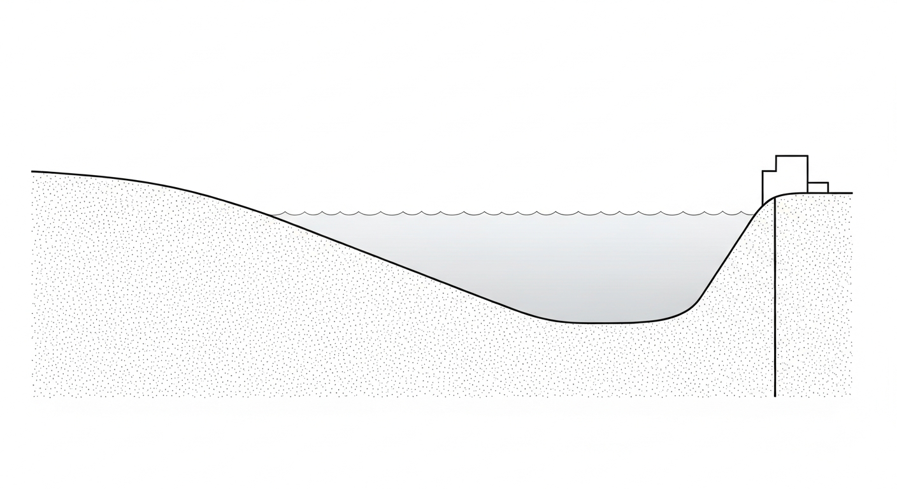

### 4.3 解题思路

由于断面形状规则但涉及多步迭代计算，采用标准步长法进行数值求解：

(1) 先求出正常水深 $h_n$ 和临界水深 $h_c$，确认渠道坡度类型和水面曲线类型。

(2) 确定计算推进方向：本例为缓流（$Fr < 1$），控制断面在下游（大坝），计算从下游向上游逆向推进。

(3) 将渠道划分为 $\Delta x = 50\,\mathrm{m}$ 的计算段，在每段内利用能量方程 (4-11) 迭代求解上游水深。

### 4.4 计算结果

源代码：`assets/ch04/ch04_backwater_curve.py`

底层求解器计算得出正常水深 $h_n = 1.447\,\mathrm{m}$，临界水深 $h_c = 1.090\,\mathrm{m}$。由于 $h_n > h_c$，该渠道为缓坡。坝前水深 $3.5\,\mathrm{m} > h_n$，水面曲线属于 M1 型壅水曲线。

**M1 型水面曲线沿程追踪矩阵（每 400 m 采样）：**

| 距离 $x$ (m) | 水深 $h$ (m) | 水面高程 $Z$ (m) |
|-------------:|-----------:|---------------:|
|            0 |      1.739 |          3.739 |
|          400 |      2.023 |          3.623 |
|          800 |      2.363 |          3.563 |
|         1200 |      2.730 |          3.530 |
|         1600 |      3.111 |          3.511 |
|         2000 |      3.500 |          3.500 |

**水面剖面可视化：**

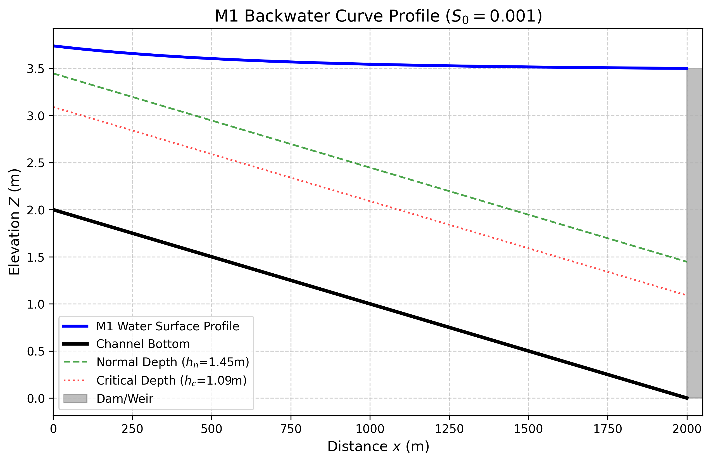

### 4.5 结果分析

(1) 物理界限校验：$h_n = 1.447\,\mathrm{m}$，$h_c = 1.090\,\mathrm{m}$，$h_n > h_c$ 确认缓坡。坝前水深 $3.5\,\mathrm{m} > h_n$，完全符合 M1 区判定条件。

(2) 壅水影响范围：受大坝顶托影响，壅水效应沿渠道一直向上游蔓延。在距大坝 2 km 的上游起点（渠底标高 2.0 m），水深仍高达 1.739 m，水面高程被垫高至 3.739 m，说明回水影响极为深远。

(3) 水面曲线形态：从图中可见，水面高程从上游 3.739 m 平缓降低至坝前 3.500 m，呈现典型的 M1 壅水曲线特征——上游端渐近正常水深线，下游端受坝前水深控制。水深沿流向逐渐增大而水面高程略有降低，这是因为渠底坡度引起的高程下降幅度大于水深增加幅度。

---

## 5 工业部署建议

(1) 计算推进方向的正确性：在编写一维水动力学求解器时，缓流（$Fr < 1$）必须从下游向上游计算，急流（$Fr > 1$）必须从上游向下游计算。若方向错误，计算将产生严重误差甚至发散。混合流态下需先定位水跃位置，再分段求解。

(2) 防洪安全评估：大坝建设不能仅评估坝址安全，还必须利用 M1 曲线计算上游回水影响范围，重新核定沿线堤防高程。在大流量条件下，壅水高度的增长速率远超坝前水位的上涨速率，这是非线性效应的直接体现。

(3) 步长选择：标准步长法的精度取决于 $\Delta x$ 的大小。当水深变化梯度较大（如水跃附近）时，应缩小步长。工程中通常取 $\Delta x = 50$--$200\,\mathrm{m}$，并与 HEC-RAS 等商业软件的结果进行校核。

(4) 水面曲线的工程组合：实际河道往往由多段不同坡度组成，需要将各段的水面曲线正确拼接。关键在于识别每段的坡度类型和控制断面位置，并在坡度转换处正确处理缓急流过渡（可能出现水跃）。

---

## 6 本章小结

本章以渐变流基本微分方程 (4-5) 为核心，系统建立了非均匀渐变流的理论体系。主要内容包括：

(1) 从能量方程出发推导了渐变流基本微分方程，明确了分子 $S_0 - S_f$ 和分母 $1 - Fr^2$ 对水面曲线形态的控制作用。

(2) 以正常水深 $h_n$ 和临界水深 $h_c$ 为参照基准，将渠道坡度分为五类（缓坡、陡坡、临界坡、水平坡、反坡），在此基础上完成了 12 种标准水面曲线（M1--M3, S1--S3, C1, C3, H2--H3, A2--A3）的系统分类，给出了每种曲线的形态特征、渐近行为与典型工程场景。

(3) 推导了标准步长法的数学基础（能量方程离散形式），阐明了缓流从下游向上游推算、急流从上游向下游推算的物理原因。

(4) 通过 M2 曲线手算例题和 M1 曲线工程案例，展示了标准步长法的实际应用。

---

## 7 参考文献

[1] Bresse, J.A.C. (1860). *Cours de mecanique appliquee, 2e partie: Hydraulique*. Paris: Mallet-Bachelier.

[2] Chow, V.T. (1959). *Open-Channel Hydraulics*. New York: McGraw-Hill. (明渠水力学经典著作，第 9--11 章系统阐述了渐变流理论与水面曲线分类。)

[3] Henderson, F.M. (1966). *Open Channel Flow*. New York: Macmillan. (第 4--6 章对渐变流分类和标准步长法给出了严谨的数学推导。)

[4] Chaudhry, M.H. (2008). *Open-Channel Flow*, 2nd edition. New York: Springer. (第 5 章包含渐变流微分方程推导和 12 种水面曲线的详细讨论。)

[5] 吴持恭. (2008). *水力学*（第四版）. 北京: 高等教育出版社. (国内经典水力学教材，第 7 章系统介绍了渐变流理论。)

[6] Sturm, T.W. (2001). *Open Channel Hydraulics*. New York: McGraw-Hill. (第 5 章对水面曲线分类给出了丰富的图示和例题。)

[7] US Army Corps of Engineers. (2016). *HEC-RAS River Analysis System Hydraulic Reference Manual*, Version 5.0. Davis, CA: Hydrologic Engineering Center. (工程实践中最广泛使用的一维水面线计算软件。)

[8] Cunge, J.A., Holly, F.M., & Verwey, A. (1980). *Practical Aspects of Computational River Hydraulics*. London: Pitman. (第 3 章对标准步长法的数值实现和收敛特性进行了深入分析。)

---

# 第 5 章 复式断面与复合糙率

## 1 学习目标

本章探讨水流脱离规则人工渠道、进入截面不规则且糙率空间分布不均匀的自然河道与复杂工程结构时的水力计算方法。读者完成本章学习后，应能够：

(1) 理解复式断面（Compound Channel）漫滩流的物理机制，掌握分槽求和法的计算原理。

(2) 运用 Horton 法、Einstein 法和 Lotter 法三种经典方法计算复合糙率等效曼宁系数。

(3) 了解复式断面中横向动量传递的基本概念，包括 Shiono-Knight 模型的理论框架。

(4) 掌握涵洞过流入口控制与出口控制的基本判别方法。

(5) 认识漫滩流引起的水位-流量关系转折现象及其在防洪设计中的工程意义。

---

## 2 教材理论

### 2.1 复式断面的基本概念

典型的天然河道由中间深凹的**主槽**（Main Channel）和两侧广阔平坦的**滩地**（Floodplains）组成。平时水流仅在主槽内流动；当洪水期水位超过滩唇高程（Bankfull Stage）后，水流漫上滩地，形成漫滩洪水。

主槽底部较为光滑（以泥沙和砾石为主），水深大，因而流速高、曼宁糙率系数较小（$n$ 通常为 0.020--0.035）。滩地则往往长满杂草灌木甚至树林，水深浅，流速极慢，糙率系数很大（$n$ 可达 0.040--0.100）。

如果将漫滩洪水简单视为一个整体断面，采用单一平均流速和统一糙率系数套用曼宁公式，将导致计算流量产生严重偏差。这是因为主槽与滩地之间存在巨大的流速差异，二者的水力行为截然不同。

### 2.2 分槽求和法

工程中处理复式断面的标准方法是**分槽求和法**（Divided Channel Method）：

(a) 在滩唇处设置垂直分割线（假壁，Imaginary Walls），将整个过水断面分割为若干子槽（通常为左滩、主槽、右滩三部分）。

(b) 分别计算每个子槽的过水面积 $A_i$、湿周 $P_i$（假壁长度不计入湿周，因为它不提供真实的物理摩擦）、水力半径 $R_i = A_i/P_i$ 和糙率系数 $n_i$。

(c) 用曼宁公式分别计算各子槽流量并求和：

$$
Q_{total} = \sum_{i=1}^{N} Q_i = \sum_{i=1}^{N} \frac{1}{n_i} A_i R_i^{2/3} S_0^{1/2} \tag{5-1}
$$

其中 $N$ 为子槽数量，$S_0$ 为河道底坡（假设各子槽底坡相同）。

假壁不计入湿周的处理方式在工程实践中被广泛采用，其理由是：假壁处为水-水交界面，不存在河床那样的固体边界摩擦。然而，这种处理忽略了主槽与滩地之间的**横向动量传递**（见 2.4 节），因此在某些情况下会高估总流量。

### 2.3 复合糙率等效曼宁系数

当渠道截面的不同部分具有不同的糙率系数（如渠底为混凝土、侧壁为浆砌石、滩地为草皮），但仍希望使用一个等效曼宁系数 $n_e$ 来代表整个断面时，有三种经典方法。

设整个断面被分为 $N$ 个子区，每个子区的湿周为 $P_i$、糙率为 $n_i$，总湿周 $P = \sum P_i$，总面积 $A$，总水力半径 $R = A/P$。

#### 2.3.1 Horton 法（1933）

假设各子区的平均流速相等（$v_i = v$），则等效糙率为：

$$
n_e = \left(\frac{\sum_{i=1}^{N} P_i n_i^{3/2}}{P}\right)^{2/3} \tag{5-2}
$$

物理含义：各子区对整体摩擦力的贡献按其湿周长度加权。Horton 法也称为 Horton-Einstein-Banks 法。

#### 2.3.2 Einstein 法（1934）

假设各子区所受的阻力（用水力半径表示）独立，且各子区的水力半径用 $P_i$ 和全断面面积的假设关系推出。Einstein 提出与 Horton 公式形式相同但推导出发点不同的等效糙率公式：

$$
n_e = \left(\frac{\sum_{i=1}^{N} P_i n_i^{2}}{P}\right)^{1/2} \tag{5-3}
$$

物理含义：各子区对总摩擦损失的贡献按湿周加权，以阻力平方的形式叠加。

#### 2.3.3 Lotter 法（1933）

假设总流量等于各子区流量之和（与分槽求和法的思想一致），则：

$$
n_e = \frac{P R^{5/3}}{\sum_{i=1}^{N} \frac{P_i R_i^{5/3}}{n_i}} \tag{5-4}
$$

其中 $R_i = A_i/P_i$ 为各子区的水力半径。

物理含义：直接从曼宁公式出发，保证等效糙率下计算的总流量与分槽求和结果一致。Lotter 法在理论上更为严谨，但需要知道各子区的面积和湿周，计算量稍大。

**三种方法的比较：** Horton 法和 Einstein 法仅需知道各子区的湿周和糙率，计算简便；Lotter 法需要更详细的几何数据但精度更高。对于糙率差异不大的情况，三种方法结果接近；当糙率差异显著时（如复式断面），推荐使用 Lotter 法或直接采用分槽求和法。

### 2.4 横向动量传递

分槽求和法的一个重要简化假设是：各子槽之间互不干扰，只有纵向流动而没有横向交换。然而在实际的漫滩洪水中，主槽与滩地之间存在显著的**横向动量传递**，表现为：

(a) 主槽高速水流与滩地低速水流之间形成强烈的剪切层，产生大尺度的横向涡旋。

(b) 这种横向剪切导致主槽水流动能向滩地耗散，从而降低了整体过流能力。

(c) 在某些情况下，主槽水流甚至会被滩地的高阻力"拖曳"而显著减速。

**Shiono-Knight 模型**（Shiono and Knight, 1991）是描述复式断面横向水深平均流速分布的经典解析方法。该模型从水深平均的 Navier-Stokes 方程出发，建立了以下控制方程：

$$
\rho g H S_0 - \rho \frac{f}{8} U_d^2 \left(1 + \frac{1}{s^2}\right)^{1/2} + \frac{\partial}{\partial y}\left[\rho \lambda H^2 \left(\frac{f}{8}\right)^{1/2} U_d \frac{\partial U_d}{\partial y}\right] + \Gamma = 0 \tag{5-5}
$$

式中：

- $\rho$——水的密度（$\mathrm{kg/m^3}$）；
- $H$——局部水深（m）；
- $U_d$——水深平均纵向流速（m/s）；
- $f$——达西-韦斯巴赫摩擦系数，无量纲；
- $s$——横断面的侧边坡度（$s = 1/m$，$m$ 为边坡系数）；
- $y$——横向坐标（m）；
- $\lambda$——无量纲涡粘性系数；
- $\Gamma$——二次流引起的附加横向剪应力项（$\mathrm{N/m^2}$）。

式 (5-5) 的第一项为重力驱动，第二项为底部摩擦阻力，第三项为横向紊动扩散（即横向动量传递的主要贡献），第四项为二次环流的效应。Shiono-Knight 模型的主要贡献在于给出了复式断面横向流速分布的解析解，揭示了主槽-滩地交界处流速剧烈变化的物理机制。

在工程设计中，当精度要求不高时，分槽求和法通常足够；当需要精确预测复式断面的流速分布和泥沙输移时，则应采用 Shiono-Knight 模型或三维数值模拟。

### 2.5 涵洞过流的基本概念

涵洞（Culvert）是公路、铁路跨越河沟时常用的排水构造物。涵洞的水力计算本质上是一种有压或无压管涵的过流分析，其核心在于判定过流控制类型：

**入口控制（Inlet Control）**：当涵洞的过流能力受限于进口断面时，称为入口控制。此时涵洞内部的管壁摩擦和出口条件对过流量没有控制作用。进口处的水力状态类似于堰流或孔口出流。入口控制通常发生在涵洞坡度较陡、管径较大、管壁较光滑的情况下。

**出口控制（Outlet Control）**：当涵洞的过流能力受限于进口损失、管内摩擦和出口条件的综合作用时，称为出口控制。此时整个涵洞的水头损失（包括进口损失、管壁摩擦损失和出口损失）决定了过流量。出口控制通常发生在涵洞坡度较缓、管径较小、管壁较粗糙、或下游水位较高的情况下。

判别方法的基本原理：分别按入口控制和出口控制两种工况计算所需的上游水头。取二者中较大的值作为控制工况——需要更高上游水头的工况即为实际的控制类型。

美国联邦公路管理局（FHWA）出版的 HDS-5（*Hydraulic Design of Highway Culverts*）给出了完整的涵洞水力设计方法和图表，是涵洞设计的权威参考资料。

### 2.6 漫滩水位-流量关系的非线性特征

当复式断面河道的水位逐渐上升越过滩唇高程时，水位-流量关系曲线（Rating Curve）会出现显著的**转折**。具体表现为：

(a) 水位在主槽内上升时，流量随水位近似呈幂函数关系稳定增长。

(b) 一旦水位越过滩唇，大量低速滩地水体突然加入，导致整个断面的平均流速出现瞬时跌落——这就是所谓的**流速漫滩断崖**。尽管总流量继续增加（因为过水面积剧增），但平均流速反而下降。

(c) 继续升高水位后，随着滩地水深增大，滩地的过流贡献逐渐增加，平均流速才重新回升。

这种非线性转折特征在防洪系统设计中具有重要的实际意义：如果数值模型或数据驱动模型未能正确反映这一转折，将导致洪水预报和预警时间的严重误判。

---

## 3 典型例题：复合糙率手算

### 3.1 题目

一梯形渠道底宽 $b = 4.0\,\mathrm{m}$，边坡系数 $m = 1.5$，设计水深 $h = 2.0\,\mathrm{m}$。渠底为现浇混凝土（$n_1 = 0.013$），两侧边坡为浆砌块石（$n_2 = 0.025$）。试分别用 Horton 法和 Einstein 法计算等效曼宁糙率系数。

### 3.2 求解过程

**几何参数计算：**

底部湿周：$P_1 = b = 4.0\,\mathrm{m}$。

两侧边坡湿周（单侧）：$P_{2,single} = h\sqrt{1 + m^2} = 2.0\times\sqrt{1 + 2.25} = 2.0\times1.803 = 3.606\,\mathrm{m}$。

两侧合计：$P_2 = 2\times3.606 = 7.211\,\mathrm{m}$。

总湿周：$P = P_1 + P_2 = 4.0 + 7.211 = 11.211\,\mathrm{m}$。

**Horton 法（式 5-2）：**

$$
n_e = \left(\frac{P_1 n_1^{3/2} + P_2 n_2^{3/2}}{P}\right)^{2/3}
$$

$n_1^{3/2} = 0.013^{1.5} = 0.001482$。

$n_2^{3/2} = 0.025^{1.5} = 0.003953$。

分子 $= 4.0\times0.001482 + 7.211\times0.003953 = 0.005928 + 0.028506 = 0.034434$。

$n_e = (0.034434 / 11.211)^{2/3} = (0.003071)^{2/3}$。

$\ln(0.003071) = -5.783$，$\times 2/3 = -3.855$，$e^{-3.855} = 0.02117$。

故 $n_e \approx 0.0212$（Horton 法）。

**Einstein 法（式 5-3）：**

$$
n_e = \left(\frac{P_1 n_1^{2} + P_2 n_2^{2}}{P}\right)^{1/2}
$$

$n_1^2 = 0.000169$，$n_2^2 = 0.000625$。

分子 $= 4.0\times0.000169 + 7.211\times0.000625 = 0.000676 + 0.004507 = 0.005183$。

$n_e = (0.005183 / 11.211)^{1/2} = (0.000462)^{0.5} = 0.0215$。

故 $n_e \approx 0.0215$（Einstein 法）。

### 3.3 结果讨论

两种方法的计算结果非常接近（$n_e \approx 0.021$），介于底部混凝土糙率（0.013）和边坡块石糙率（0.025）之间，且更偏向边坡值。这是因为边坡的湿周长度（7.21 m）远大于底部（4.0 m），对等效糙率的贡献权重更大。

在实际工程中，这一结果提醒设计者：即使渠底采用了光滑的混凝土衬砌，如果边坡糙率较大，整体的过流能力仍将受到显著影响。

---

## 4 工程案例：复式断面漫滩洪水非线性特征推演

### 4.1 案例背景

某山区流域治理工程涉及一条复式河道。河道常年干涸，仅在雨季暴发山洪。该河道由 20 m 宽、深 3 m 的光洁主河槽和两侧各 30 m 宽的杂草丛生的高滩地组成。数字孪生系统在预报一场罕见的特大洪水时发现异常：当水位刚刚漫过 3 m 的主槽进入滩地时，模型计算的全断面平均流速不升反降。需要通过物理分析查明这一现象的根本原因，并绘制该河道的标准水位-流量关系曲线。

### 4.2 问题描述

复式河槽参数：底坡 $S_0 = 0.0008$。

- 主槽：底宽 20 m，边坡系数 $m = 1.5$，糙率 $n = 0.025$，滩唇高度 $h_{bank} = 3.0\,\mathrm{m}$。
- 滩地：单侧宽 30 m（两侧共 60 m），边坡系数 $m = 2.0$，糙率 $n = 0.050$。

需要计算总水深从 1.0 m 上涨至 6.0 m 期间各分槽的流量分担情况，并分析漫滩瞬间（$h > 3.0\,\mathrm{m}$）系统整体平均流速的变化规律。

**物理场景概化图：**


### 4.3 解题思路

采用分槽求和法（式 5-1）：

(a) 当 $h \le 3.0\,\mathrm{m}$ 时，水流仅在主槽内，滩地流量为零。

(b) 当 $h > 3.0\,\mathrm{m}$ 时，从滩唇处垂直向上设分割线，将断面分为主槽和两侧滩地三部分。假壁长度不计入湿周。

(c) 分别用曼宁公式计算各子槽流量 $Q_i$，求和得总流量 $Q_{total}$。

(d) 反算全断面平均流速 $V_{avg} = Q_{total} / A_{total}$。

### 4.4 计算结果

源代码：`assets/ch05/ch05_compound_channel.py`

**复式断面分槽流量与平均流速追踪矩阵：**

| 总水深 $h$ (m) | 滩地水深 (m) | 主槽流量 ($mathrm{m^3/s}$) | 滩地流量 ($mathrm{m^3/s}$) | 总流量 ($mathrm{m^3/s}$) | 平均流速 ($mathrm{m/s}$) |
|---------------:|-------------:|-----------------:|------------------:|---------------:|---------------:|
|            1.0 |          0.0 |            22.86 |              0.00 |          22.86 |          1.063 |
|            2.0 |          0.0 |            73.85 |              0.00 |          73.85 |          1.606 |
|            3.0 |          0.0 |           148.44 |              0.00 |         148.44 |          2.020 |
|            3.5 |          0.5 |           200.39 |             11.02 |         211.41 |          1.777 |
|            4.0 |          1.0 |           258.40 |             36.03 |         294.42 |          1.768 |
|            5.0 |          2.0 |           391.40 |            121.01 |         512.41 |          1.916 |
|            6.0 |          3.0 |           545.60 |            250.88 |         796.48 |          2.115 |

**水位-流量关系转折曲线：**


### 4.5 结果分析

(1) **流速的漫滩断崖**：当水位在主槽内上升至 3.0 m 时，平均流速达到峰值 2.02 m/s。但当水位刚漫过滩地达到 3.5 m 时，尽管总流量增加至 211.41 m^3/s，平均流速却跌落至 1.777 m/s。这是因为滩地极高的糙率（0.050）和极浅的水深使滩地水体成为巨大的"摩擦拖累"，显著降低了整个断面的平均流速。

(2) **流量主导权的转移**：在水深 4.0 m 时，主槽承担了绝大部分流量（258 m^3/s），滩地仅分担 36 m^3/s。但当水深涨至 6.0 m 时，滩地过水面积呈指数级扩大，其输水能力增至 251 m^3/s，占系统总流量的三分之一。

(3) **水位-流量曲线的折角**：从 Rating Curve 图中可见，当水位超过滩唇高程 3.0 m 后，曲线斜率发生显著变化（变缓后再变陡），呈现明显的"折角"特征。这一非线性特征是复式断面的固有属性。

---

## 5 工业部署建议

(1) **数字孪生模型的漫滩修正**：许多数据驱动洪水预报模型在训练时仅使用了汛期以下的常水位数据。这类模型在遇到漫滩洪水时，会因从未"见过"流速断崖和非线性折角而发生严重误判。必须将分槽求和逻辑作为物理约束注入模型的先验知识中。

(2) **复合糙率的选择**：对于规则渠道的衬砌问题，Horton 法或 Einstein 法通常足够。对于涉及漫滩的天然河道，应优先使用分槽求和法而非等效糙率法，以避免丢失流速分布的关键信息。

(3) **横向动量传递的工程影响**：在主槽与滩地宽度比较大且滩地糙率极高的河段，分槽求和法可能高估总流量 10%--20%。此时建议采用 Shiono-Knight 模型或二维数值模拟进行修正。

(4) **滞洪区设计思路**：从计算数据可以看出，滩地虽然输水效率低下（流速慢），但其巨大的过水面积能有效消纳洪峰。在现代生态水利设计中，应利用滩地的高糙率作为天然减震器实现洪峰削减，而非将其硬化以追求输水速度。

(5) **涵洞设计的控制类型判别**：在涵洞水力计算中，必须同时按入口控制和出口控制两种工况计算，取控制水头较大者。漏判控制类型将导致涵洞尺寸设计不足，可能引发路基溃坝等严重工程事故。

---

## 6 本章小结

本章围绕复式断面与复合糙率的主题，主要内容包括：

(1) 阐述了复式断面漫滩洪水的物理机制，介绍了分槽求和法的原理和计算步骤（式 5-1）。

(2) 给出了 Horton 法（式 5-2）、Einstein 法（式 5-3）和 Lotter 法（式 5-4）三种复合糙率等效曼宁系数的计算公式，并比较了各自的假设和适用条件。

(3) 引入了 Shiono-Knight 模型（式 5-5）描述复式断面横向水深平均流速分布的基本概念，揭示了主槽-滩地交界处横向动量传递的物理机制。

(4) 介绍了涵洞过流的入口控制和出口控制两种基本类型及其判别方法。

(5) 通过复合糙率手算例题和复式断面漫滩工程案例，定量展示了漫滩流速断崖、水位-流量关系非线性转折等关键现象。

---

## 7 参考文献

[1] Chow, V.T. (1959). *Open-Channel Hydraulics*. New York: McGraw-Hill. (第 5 章系统讨论了复合糙率和复式断面的计算方法。)

[2] Sellin, R.H.J. (1964). A laboratory investigation into the interaction between the flow in the channel of a river and that over its flood plain. *La Houille Blanche*, 19(7), 793--802. (首次通过实验系统研究了主槽与滩地之间的动量交换机制。)

[3] Knight, D.W., & Demetriou, J.D. (1983). Flood plain and main channel flow interaction. *Journal of Hydraulic Engineering*, ASCE, 109(8), 1073--1092. (通过系统实验揭示了复式断面中横向剪切层对整体过流能力的影响。)

[4] Shiono, K., & Knight, D.W. (1991). Turbulent open-channel flows with variable depth across the channel. *Journal of Fluid Mechanics*, 222, 617--646. (提出了描述复式断面横向水深平均流速分布的 Shiono-Knight 解析模型。)

[5] Sturm, T.W. (2001). *Open Channel Hydraulics*. New York: McGraw-Hill. (第 4 章对复式断面和复合糙率给出了详细的例题和工程实例。)

[6] Chaudhry, M.H. (2008). *Open-Channel Flow*, 2nd edition. New York: Springer. (第 3 章讨论了复合糙率的计算方法。)

[7] 吴持恭. (2008). *水力学*（第四版）. 北京: 高等教育出版社. (第 6 章介绍了我国工程中常用的复式断面计算方法。)

[8] US Federal Highway Administration. (2012). *Hydraulic Design of Highway Culverts*, 3rd edition (HDS-5), Publication No. FHWA-HIF-12-026. (涵洞水力设计的权威指南，包含入口控制和出口控制的完整计算方法和设计图表。)

[9] Horton, R.E. (1933). Separate roughness coefficients for channel bottom and sides. *Engineering News-Record*, 111(22), 652--653.

[10] Einstein, H.A. (1934). *Der hydraulische oder Profil-Radius*. Schweizerische Bauzeitung, 103(8), 89--91.

---

# 第 6 章 非恒定流理论与数值模拟

## 1 学习目标

本章进入明渠水力学最复杂也最核心的领域——一维非恒定流（Unsteady Flow）。读者完成本章学习后，应能够：

(1) 理解 Saint-Venant 方程组（连续性方程和动量方程）的物理内涵与数学结构。

(2) 明确侧向入流项 $q_l$ 的物理意义和量纲。

(3) 掌握洪波的三种简化分类：运动波（Kinematic Wave）、扩散波（Diffusion Wave）和完整动力波（Dynamic Wave），理解各自的简化假设和适用条件。

(4) 掌握 CFL 条件的定量表达式及其在显式差分格式中的约束作用。

(5) 了解 MacCormack 预估-校正格式的基本原理，理解洪波演进中平移与坦化的物理机制。

---

## 2 教材理论

### 2.1 Saint-Venant 方程组

在天然河道或长距离输水渠道中，上游暴雨或闸门开启引起的水流变化不仅沿空间分布，而且随时间剧烈波动。描述这种时空耦合变化的基本数学模型是 1871 年由法国工程师 Barre de Saint-Venant 提出的一维非恒定流方程组（Saint-Venant, 1871），由两个核心方程构成：

**(1) 连续性方程（质量守恒）：**

$$
\frac{\partial A}{\partial t} + \frac{\partial Q}{\partial x} = q_l \tag{6-1}
$$

式中：

- $A$——过水断面面积（$\mathrm{m^2}$）；
- $t$——时间（s）；
- $Q$——流量（$\mathrm{m^3/s}$）；
- $x$——沿渠道纵向的距离坐标（m）；
- $q_l$——单位渠道长度的侧向入流量（$\mathrm{m^2/s}$），即每米渠道长度上汇入（正值）或流出（负值）的流量。该项反映了降雨径流汇入、支流汇入、灌溉引水等侧向水量交换。当 $q_l = 0$ 时，方程退化为无侧向入流的连续性方程。

式 (6-1) 的物理含义：某一段渠道内过水面积随时间的增加率等于上游流入量减去下游流出量加上侧向汇入量。

**(2) 动量方程（牛顿第二定律）：**

$$
\frac{\partial Q}{\partial t} + \frac{\partial}{\partial x}\!\left(\frac{Q^2}{A}\right) + gA\frac{\partial h}{\partial x} = gA(S_0 - S_f) + q_l v_l \tag{6-2}
$$

式中：

- $g$——重力加速度（$9.81\,\mathrm{m/s^2}$）；
- $h$——水深（m）；
- $S_0$——渠底坡度，无量纲；
- $S_f$——摩擦坡度，无量纲，由曼宁公式计算：$S_f = n^2 Q|Q|/(A^2 R^{4/3})$；
- $v_l$——侧向入流的纵向分速度（m/s），通常取零或取主流速度。

等式左边各项的物理意义依次为：局部加速度（非恒定效应）、对流加速度（空间变化效应）、压力梯度力。右边为：重力驱动力与摩擦阻力之差，以及侧向入流引起的动量变化。

Saint-Venant 方程组是一组**双曲型非线性偏微分方程组**（Hyperbolic PDEs），其特征线速度为 $v \pm c$，其中 $c = \sqrt{gA/B}$ 为微波波速（$B$ 为水面宽度）。

### 2.2 洪波分类

Saint-Venant 方程组的完整求解在工程中往往需要大量计算资源。根据不同的简化假设，可以将洪波传播模型分为三个层次：

#### 2.2.1 运动波（Kinematic Wave）

**简化假设**：动量方程中仅保留重力项和摩擦项，忽略局部加速度、对流加速度和压力梯度项。即假设：

$$
S_f = S_0 \tag{6-3}
$$

此时水流的运动完全由底坡和摩擦力的平衡决定，本质上在每个断面都处于"准均匀流"状态。

**控制方程**：将 $S_f = S_0$ 代入曼宁公式可得 $Q = f(A)$（流量仅为面积的函数），连续性方程 (6-1) 变为一阶双曲型方程：

$$
\frac{\partial A}{\partial t} + c_k \frac{\partial A}{\partial x} = q_l \tag{6-4}
$$

其中运动波波速 $c_k = dQ/dA$。

**特征**：洪波沿下游方向以波速 $c_k$ 平移，波形不变（无坦化）。运动波只有平移效应而无扩散效应。

**适用条件**：适用于底坡较陡（$S_0 > 0.001$）、渠道较短、洪波变化较缓的情况。在陡峭山区溪流中，运动波近似通常足够准确。

#### 2.2.2 扩散波（Diffusion Wave）

**简化假设**：在运动波基础上，保留动量方程中的压力梯度项（即水面坡度），但仍忽略局部加速度和对流加速度项。即：

$$
S_f = S_0 - \frac{\partial h}{\partial x} \tag{6-5}
$$

**控制方程**：在一定近似条件下，可将方程化为对流-扩散方程形式：

$$
\frac{\partial Q}{\partial t} + c_k \frac{\partial Q}{\partial x} = D \frac{\partial^2 Q}{\partial x^2} \tag{6-6}
$$

其中扩散系数 $D = Q/(2BS_0)$（$B$ 为水面宽度）。

**特征**：洪波在向下游平移的同时发生**坦化**（衰减），即洪峰流量逐渐降低、洪水过程线变得更加平缓。这与运动波的纯平移行为有本质区别。

**适用条件**：适用于底坡中等（$S_0 = 0.0001$--$0.001$）的河道和渠道。扩散波模型是 Muskingum-Cunge 演算法的理论基础，在水文学中应用极为广泛。

#### 2.2.3 完整动力波（Dynamic Wave / Full Saint-Venant）

**简化假设**：不做任何简化，保留动量方程所有项（局部加速度、对流加速度、压力梯度、重力和摩擦）。

**控制方程**：完整的 Saint-Venant 方程组 (6-1) 和 (6-2)。

**特征**：能够捕捉所有洪波特征，包括急变流过渡（如涌波）、回水效应（下游条件对上游的影响）以及缓流-急流的混合流态。这是精度最高但计算量也最大的模型。

**适用条件**：适用于底坡极缓（$S_0 < 0.0001$）、潮汐影响显著、存在闸门控制或水跃等急变流过渡的情况。在现代调水工程和城市排水管网模拟中，通常必须采用完整动力波模型。

#### 2.2.4 三种模型的比较

| 特征 | 运动波 | 扩散波 | 完整动力波 |
|:-----|:-------|:-------|:-----------|
| 保留的动量项 | 重力 + 摩擦 | + 压力梯度 | 全部 |
| 洪峰平移 | 有 | 有 | 有 |
| 洪峰坦化 | 无 | 有 | 有 |
| 回水效应 | 无 | 近似 | 完整 |
| 适用坡度 | $S_0 > 0.001$ | $0.0001 < S_0 < 0.001$ | 任意 |
| 计算量 | 最小 | 中等 | 最大 |
| 典型应用 | 山区溪流 | 河道演算 | 调水/排水工程 |

### 2.3 有限差分法与 CFL 条件

求解 Saint-Venant 方程组的数值方法主要有有限差分法（FDM）和有限体积法（FVM）。在有限差分法中，将连续的时空域离散为网格：空间步长 $\Delta x$、时间步长 $\Delta t$。

对于显式差分格式（如 MacCormack 格式、Lax-Wendroff 格式），数值稳定性受到 **Courant-Friedrichs-Lewy（CFL）条件** 的严格约束：

$$
Cr = \frac{(|v| + c)\Delta t}{\Delta x} \le 1 \tag{6-7}
$$

式中：

- $Cr$——库朗数（Courant number），无量纲；
- $v$——断面平均流速（m/s）；
- $c$——微波波速（m/s），$c = \sqrt{gA/B}$，对于矩形断面 $c = \sqrt{gh}$；
- $\Delta t$——时间步长（s）；
- $\Delta x$——空间步长（m）。

CFL 条件的物理含义是：信息（扰动）在一个时间步内的传播距离 $(|v|+c)\Delta t$ 不得超过一个空间网格长度 $\Delta x$。如果时间步长设得过大，使得数值计算的信息传播速度慢于物理波的传播速度，计算将因为遗漏关键物理信息而迅速发散（数值爆炸）。

因此，在使用显式格式时，时间步长的上限为：

$$
\Delta t \le \frac{\Delta x}{\max(|v| + c)} \tag{6-8}
$$

### 2.4 MacCormack 预估-校正格式

MacCormack（1969）格式是一种经典的二阶精度显式格式，在计算水力学中应用广泛。其基本思想是通过两步计算消除单侧差分带来的数值耗散。

将 Saint-Venant 方程组改写为守恒向量形式：

$$
\frac{\partial \mathbf{U}}{\partial t} + \frac{\partial \mathbf{F}(\mathbf{U})}{\partial x} = \mathbf{S}(\mathbf{U}) \tag{6-9}
$$

其中状态向量 $\mathbf{U} = [A, Q]^T$，通量向量 $\mathbf{F} = [Q, Q^2/A + gI_1]^T$（$I_1$ 为断面静水压力矩），源项 $\mathbf{S} = [q_l, gA(S_0 - S_f) + q_l v_l]^T$。

**预估步（Predictor）**：使用向前差分：

$$
\mathbf{U}_i^* = \mathbf{U}_i^n - \frac{\Delta t}{\Delta x}\left(\mathbf{F}_{i+1}^n - \mathbf{F}_i^n\right) + \Delta t \, \mathbf{S}_i^n \tag{6-10}
$$

**校正步（Corrector）**：使用向后差分，并对预估值和原始值取平均：

$$
\mathbf{U}_i^{n+1} = \frac{1}{2}\left[\mathbf{U}_i^n + \mathbf{U}_i^* - \frac{\Delta t}{\Delta x}\left(\mathbf{F}_i^* - \mathbf{F}_{i-1}^*\right) + \Delta t \, \mathbf{S}_i^*\right] \tag{6-11}
$$

其中上标 $n$ 表示当前时间层，$*$ 表示预估值，$n+1$ 表示下一时间层；下标 $i$ 表示空间节点编号。

MacCormack 格式的精度为二阶（时间和空间均为二阶），格式简洁，便于编程实现，但受 CFL 条件 (6-7) 约束。

### 2.5 洪波的平移与坦化

洪波在渠道中传播时具有两个重要的物理特征：

**(1) 波形平移（Translation）**：洪水从上游到达下游需要一定的传播时间。洪波的传播速度（波速）通常大于水质点的流速，约为 $c_k = dQ/dA$（运动波波速）。对于宽浅矩形渠道上的曼宁均匀流，$c_k \approx (5/3)v$，即波速约为流速的 5/3 倍。这种时间滞后在长距离输水工程中尤为显著，是造成"大时延系统难以控制"的物理根源。

**(2) 波形坦化（Attenuation）**：由于河床摩擦力的耗散和水流在渠道空间内的扩散效应，洪峰的尖锐程度在传播过程中逐渐被"削平"——洪峰流量沿程衰减，而洪水总历时相应延长。坦化程度取决于渠道长度、底坡、糙率和洪波的初始形态。运动波模型无法反映坦化效应，必须采用扩散波或完整动力波模型才能正确模拟。

---

## 3 典型例题：运动波波速计算

### 3.1 题目

一矩形渠道宽 $B = 10\,\mathrm{m}$，底坡 $S_0 = 0.002$，曼宁糙率 $n = 0.020$。当渠道以均匀流流量 $Q = 30\,\mathrm{m^3/s}$ 运行时，试计算：(a) 正常水深 $h_n$；(b) 微波波速 $c$；(c) 运动波波速 $c_k$；(d) CFL 条件下允许的最大时间步长（取 $\Delta x = 100\,\mathrm{m}$）。

### 3.2 求解过程

**(a) 正常水深 $h_n$：**

矩形断面：$A = Bh = 10h$，$P = B + 2h = 10 + 2h$，$R = A/P = 10h/(10+2h)$。

曼宁公式：$Q = \frac{1}{n}AR^{2/3}S_0^{1/2}$。

$30 = \frac{1}{0.020}\times 10h_n \times \left(\frac{10h_n}{10+2h_n}\right)^{2/3} \times 0.002^{1/2}$

$30 = 50 h_n \times \left(\frac{10h_n}{10+2h_n}\right)^{2/3} \times 0.04472$

$30 = 2.236 h_n \left(\frac{10h_n}{10+2h_n}\right)^{2/3}$

试算 $h_n = 1.5\,\mathrm{m}$：$A = 10\times1.5 = 15\,\mathrm{m^2}$，$P = 10 + 2\times1.5 = 13\,\mathrm{m}$，$R = 15/13 = 1.154\,\mathrm{m}$，$R^{2/3} = 1.102$。

$$Q = \frac{1}{n}AR^{2/3}S_0^{1/2} = \frac{1}{0.020}\times 15 \times 1.102 \times 0.04472 = 36.96\,\mathrm{m^3/s}$$

该值大于目标流量 $30\,\mathrm{m^3/s}$，需减小试算水深。试 $h_n = 1.3\,\mathrm{m}$：$A = 13\,\mathrm{m^2}$，$P = 12.6\,\mathrm{m}$，$R = 1.032\,\mathrm{m}$，$R^{2/3} = 1.021$。

$$Q = \frac{1}{0.020}\times 13 \times 1.021 \times 0.04472 = 29.68\,\mathrm{m^3/s}$$

接近 30。取 $h_n \approx 1.31\,\mathrm{m}$。

验算：$A = 13.1$，$R = 13.1/12.62 = 1.038$，$R^{2/3} = 1.025$。

$Q = 50\times13.1\times1.025\times0.04472 = 30.03$。取 $h_n = 1.31\,\mathrm{m}$。

**(b) 微波波速 $c$（用于 CFL 条件）：**

$$
c = \sqrt{gh_n} = \sqrt{9.81\times1.31} = \sqrt{12.85} = 3.585\,\mathrm{m/s}
$$

断面平均流速 $v = Q/A = 30/13.1 = 2.290\,\mathrm{m/s}$。

**(c) 运动波波速 $c_k$：**

对宽浅矩形断面（$B \gg h$），近似 $R \approx h$，曼宁公式给出 $Q \propto A^{5/3}$，故：

$$
c_k = \frac{dQ}{dA} = \frac{5}{3}v = \frac{5}{3}\times 2.290 = 3.817\,\mathrm{m/s}
$$

**(d) CFL 条件下的最大 $\Delta t$：**

$$
\Delta t_{max} = \frac{\Delta x}{|v| + c} = \frac{100}{2.290 + 3.585} = \frac{100}{5.875} = 17.02\,\mathrm{s}
$$

为保证安全，取 $\Delta t = 15\,\mathrm{s}$，此时 $Cr = 5.875\times15/100 = 0.88 < 1$，满足 CFL 条件。

### 3.3 小结

本例展示了运动波波速和 CFL 条件的计算方法。关键发现：(a) 运动波波速（3.82 m/s）大于流速（2.29 m/s），说明洪波传播速度快于水质点移动速度；(b) CFL 条件严格约束了显式格式的时间步长，在本例中 $\Delta t$ 不得超过 17 s。

---

## 4 工程案例：矩形长渠道洪波演进 MacCormack 差分求解

### 4.1 案例背景

某调水工程干渠长达 10 km。控制中心计划在上游闸门处进行一次放水作业，预计将产生一个持续 30 分钟、峰值为 50 m^3/s 的正弦波形洪水脉冲。下游 5 km 处有一座渡槽，其设计最高承载水位对应 40 m^3/s 的流量。调度员需要精确回答两个问题：洪峰何时到达渡槽？到达时的流量是否会因沿途坦化效应而降至安全线以下？

### 4.2 问题描述

一条长 10000 m、宽 10 m 的矩形渠道（$S_0 = 0.001$，$n = 0.025$），初始以 $Q_0 = 20\,\mathrm{m^3/s}$ 的均匀流恒定运行。

在 $t = 0$ 时刻，上游注入一个正弦洪波：

$$
Q_{in}(t) = \begin{cases} Q_0 + (Q_{peak} - Q_0)\sin\!\left(\frac{\pi t}{T}\right) & 0 \le t \le T \\ Q_0 & t > T \end{cases} \tag{6-12}
$$

其中 $Q_{peak} = 50\,\mathrm{m^3/s}$，$T = 1800\,\mathrm{s}$（30 分钟）。洪峰出现在 $t = 900\,\mathrm{s}$（15 分钟）。

利用完整 Saint-Venant 方程组推演洪波在渠道中的传播过程，并监控中点（$x = 5000\,\mathrm{m}$）处的流量过程线。

**物理场景概化图：**


### 4.3 解题思路

采用 MacCormack 显式预估-校正格式（式 6-10, 6-11）：

(a) 将 Saint-Venant 方程组改写为守恒向量形式 (6-9)，状态向量 $\mathbf{U} = [A, Q]^T$。

(b) CFL 条件约束下，设 $\Delta x = 100\,\mathrm{m}$，$\Delta t = 5\,\mathrm{s}$，使库朗数 $Cr < 1$。

(c) 初始条件：全渠道均匀流，$Q = 20\,\mathrm{m^3/s}$，对应正常水深由曼宁公式求解。

(d) 边界条件：上游为流量时间序列（式 6-12），下游取正常水深（开放边界）。

(e) 两步迭代：预估步用向前差分，校正步用向后差分，取平均值作为最终解。

### 4.4 计算结果

源代码：`assets/ch06/ch06_saint_venant.py`

**洪波空间演进追踪矩阵：**

| 观测点位置 | 洪峰到达时间 (min) | 洪峰流量 ($\mathrm{m^3/s}$) | 洪峰水深 (m) | 备注 |
|:-----------|:----------------:|:----------------:|:------------:|:-----|
| 上游起点 ($x=0$) | 15.0 | 50.00 | 2.71 | 洪波源 |
| 渠道中点 ($x=5000\,\mathrm{m}$) | 39.0 | 36.29 | 2.07 | 显著坦化与平移 |

**空间波形演进图（不同时刻的剖面）：**


**中点（$x=5000\,\mathrm{m}$）时间序列过程线：**


### 4.5 结果分析

(1) **时空滞后**：上游在第 15 分钟爆发洪峰，但直到第 39 分钟洪峰才到达 5 km 外的中点。传播时间为 24 分钟，对应平均波速约 $5000/(24\times60) = 3.47\,\mathrm{m/s}$，略快于均匀流条件下的水质点速度。这种显著的时间滞后在长距离调水工程中是控制系统必须应对的"大时延"问题。

(2) **自然削峰效应**：原本高达 50 m^3/s 的洪峰，在传播 5 km 后衰减至 36.29 m^3/s，削峰率达 $(50-36.29)/50 = 27.4\%$。洪峰水深从 2.71 m 降至 2.07 m。这一自然坦化效应使得渡槽处的流量低于 40 m^3/s 的安全阈值，调度员可以确认不需要采取紧急措施。

(3) **波形展宽**：伴随洪峰削减，洪水过程线的时间基底显著展宽。中点处的洪水历时明显长于上游，这是扩散效应的直接体现。

---

## 5 工业部署建议

(1) **显式格式的稳定性限制**：MacCormack 格式虽然精度高，但受 CFL 条件 (6-7) 的严格约束。对于长达数百公里的调水工程，如果采用精细的空间网格（$\Delta x = 50$--$100\,\mathrm{m}$），所需的极小时间步长将导致计算量巨大。在工业级仿真软件（如 MIKE 11、HEC-RAS、ISIS）中，通常采用无条件稳定的**四点隐式格式（Preissmann 格式）**，允许使用较大的时间步长而不会发散。

(2) **Preissmann 格式简介**：Preissmann（1961）四点隐式格式在时间层 $n$ 和 $n+1$ 之间用加权参数 $\theta$（$0.5 \le \theta \le 1.0$）进行插值，空间上在相邻两点之间取平均。当 $\theta \ge 0.5$ 时，格式无条件稳定（不受 CFL 限制），但需要在每个时间步求解一个大规模的三对角矩阵方程组。

(3) **前馈控制的基础**：对于现代智慧水网调度系统，Saint-Venant 方程的高速数值求解是"数字预见器"的核心。控制系统通过比真实时间快数十至数百倍的超前推演，预测"现在放水，若干小时后下游水位涨多高"，从而提前协同各闸门泵站进行前馈控制。

(4) **模型选择建议**：当仅需粗略估计洪水传播时间时，运动波模型即可满足需求。需要评估洪峰削减量时，扩散波模型（或 Muskingum-Cunge 法）更为适用。对于涉及闸门控制、回水效应或复杂水流过渡的场景，必须采用完整动力波模型。

(5) **网格无关性验证**：在实际工程应用中，应进行网格无关性分析——逐步加密网格，确认计算结果不再随 $\Delta x$ 和 $\Delta t$ 的减小而显著变化，以保证数值解的可靠性。

---

## 6 本章小结

本章系统阐述了明渠一维非恒定流的理论基础与数值模拟方法，主要内容包括：

(1) 推导并解释了 Saint-Venant（1871）方程组——连续性方程 (6-1) 和动量方程 (6-2) 的物理内涵，明确了侧向入流项 $q_l$ 的定义（单位渠道长度侧向入流量，$\mathrm{m^2/s}$）。

(2) 按照简化程度将洪波模型分为三类：运动波（仅重力-摩擦平衡，无坦化）、扩散波（增加压力梯度，有坦化）和完整动力波（全部动量项，精度最高），并给出了各自的适用条件。

(3) 推导了 CFL 条件的定量公式 (6-7)，解释了其物理含义——信息传播速度不得超过网格传播速度。

(4) 介绍了 MacCormack 预估-校正格式的基本原理（式 6-10, 6-11），并通过工程案例展示了洪波的平移（24 分钟延迟）和坦化（27.4% 削峰）两大核心特征。

---

## 7 参考文献

[1] Saint-Venant, A.J.C.B. de (1871). Theorie du mouvement non permanent des eaux, avec application aux crues des rivieres et a l'introduction des marees dans leurs lits. *Comptes Rendus des Seances de l'Academie des Sciences*, 73, 147--154, 237--240. (首次提出一维非恒定流基本方程组的经典文献。)

[2] Stoker, J.J. (1957). *Water Waves: The Mathematical Theory with Applications*. New York: Interscience Publishers. (对浅水波方程的数学性质给出了严谨的理论分析。)

[3] Cunge, J.A., Holly, F.M., & Verwey, A. (1980). *Practical Aspects of Computational River Hydraulics*. London: Pitman. (计算水力学的经典著作，系统介绍了有限差分法求解 Saint-Venant 方程的各种格式。)

[4] Chaudhry, M.H. (2008). *Open-Channel Flow*, 2nd edition. New York: Springer. (第 10--12 章详细讨论了非恒定流的数值求解方法。)

[5] Abbott, M.B. (1979). *Computational Hydraulics: Elements of the Theory of Free Surface Flows*. London: Pitman. (从计算数学角度深入分析了各种差分格式的稳定性和精度。)

[6] Chow, V.T. (1959). *Open-Channel Hydraulics*. New York: McGraw-Hill. (第 18 章介绍了非恒定流的基本概念和早期求解方法。)

[7] 吴持恭. (2008). *水力学*（第四版）. 北京: 高等教育出版社. (第 10 章介绍了明渠非恒定流的基本理论。)

[8] Lighthill, M.J., & Whitham, G.B. (1955). On kinematic waves. I. Flood movement in long rivers. *Proceedings of the Royal Society of London A*, 229(1178), 281--316. (运动波理论的奠基性文献。)

[9] Preissmann, A. (1961). Propagation des intumescences dans les canaux et rivieres. *First Congress of the French Association for Computation*, Grenoble, pp. 433--442. (提出了广泛应用于工业级水力学软件的四点隐式差分格式。)

[10] MacCormack, R.W. (1969). The effect of viscosity in hypervelocity impact cratering. *AIAA Paper* 69-354. (MacCormack 预估-校正格式的原始文献。)

---

# 第 7 章 数值算法详解——显式与隐式格式

## 1 学习目标

本章系统阐述一维非恒定流圣维南方程组的数值离散方法，是现代水力学数值模拟的核心基础。读者需要掌握：

1. 有限差分法的基本思想：时空离散、网格布局与步长选取（$\Delta x$, $\Delta t$）。
2. 显式格式（Explicit Scheme）的构造方法、计算流程与 Courant-Friedrichs-Lewy（CFL）稳定性条件。
3. 隐式格式的代表方法——Preissmann 四点偏心格式的完整推导，包括时间加权系数 $\theta$ 的定义、空间与时间的加权平均离散、Newton-Raphson 线性化及雅可比矩阵的带状结构。
4. 追赶法（双扫描法 / Thomas 算法）求解三对角或带状线性方程组的算法流程。
5. 复杂边界条件（潮汐顶托、闸门启闭）在数值算法中的处理方式。

---

## 2 教材理论

### 2.1 数值离散的基本思想

在第 6 章中，我们建立了主宰一维非恒定流的圣维南方程组：

$$
\frac{\partial A}{\partial t} + \frac{\partial Q}{\partial x} = q_l \tag{7-1}
$$

$$
\frac{\partial Q}{\partial t} + \frac{\partial}{\partial x}\left(\frac{Q^2}{A}\right) + gA\frac{\partial h}{\partial x} = gA(S_0 - S_f) + q_l v_l \tag{7-2}
$$

其中 $A$ 为过水断面面积，$Q$ 为流量，$q_l$ 为侧向入流，$h$ 为水深，$S_0$ 为底坡，$S_f$ 为摩擦坡度，$g$ 为重力加速度。由于该方程组具有高度非线性，除极少数理想化情形外不存在解析解，必须采用数值计算方法。

数值算法的核心思想是**时空离散与网格化**。将一段长度为 $L$ 的河道划分为 $N$ 个计算单元，每个单元长度 $\Delta x = L/N$；将时间划分为若干步，步长为 $\Delta t$。用 $f_i^n$ 表示在空间节点 $i$（$x = i\Delta x$）、时间层 $n$（$t = n\Delta t$）处物理量 $f$ 的离散值。在已知当前时间层 $t^n$ 所有节点的水深和流量的前提下，推算下一时间层 $t^{n+1}$ 的状态，即为"时间推进"过程。

在水力学领域，时间推进方法主要分为两大类：显式格式与隐式格式。

### 2.2 显式格式与 CFL 稳定性条件

显式格式（Explicit Scheme）的基本特征是：$t^{n+1}$ 时间层的未知量仅由 $t^n$ 时间层（及更早时间层）的已知量通过代数运算直接计算获得，无需求解联立方程组。

**MacCormack 格式**是工程中常用的二阶精度显式格式，分为预测（Predictor）和校正（Corrector）两步：

预测步（前差）：

$$
\bar{U}_i^{n+1} = U_i^n - \frac{\Delta t}{\Delta x}\left(F_{i+1}^n - F_i^n\right) + \Delta t \cdot S_i^n \tag{7-3}
$$

校正步（后差）：

$$
U_i^{n+1} = \frac{1}{2}\left(U_i^n + \bar{U}_i^{n+1}\right) - \frac{\Delta t}{2\Delta x}\left(\bar{F}_i^{n+1} - \bar{F}_{i-1}^{n+1}\right) + \frac{\Delta t}{2}\bar{S}_i^{n+1} \tag{7-4}
$$

其中 $U = [A, Q]^T$ 为守恒变量向量，$F$ 为通量向量，$S$ 为源项向量。

显式格式的优点在于编程简单、计算效率高（单步计算量小）。然而，其致命约束在于 **CFL 稳定性条件**。对于圣维南方程组，CFL 条件要求：

$$
\mathrm{Cr} = \frac{(|V| + c)\Delta t}{\Delta x} \leq 1 \tag{7-5}
$$

其中 $V = Q/A$ 为断面平均流速，$c = \sqrt{gA/B}$ 为重力长波波速（$B$ 为水面宽度）。该条件的物理意义是：数值信息的传播速度不得低于物理波的传播速度，否则计算会在几步之内发散。

对于典型明渠，$c$ 通常为 $3 \sim 10\ \mathrm{m/s}$。当 $\Delta x = 100\ \mathrm{m}$ 时，CFL 条件将 $\Delta t$ 限制在 $10 \sim 30\ \mathrm{s}$ 量级。若需模拟数月乃至数年的长历时过程，所需的时间步数将达到 $10^5 \sim 10^7$ 量级，计算代价极为高昂。

### 2.3 Preissmann 四点偏心格式

#### 2.3.1 格式的基本构造

Preissmann 四点偏心格式（也称 $\theta$ 格式或箱式格式 Box Scheme）由法国学者 Preissmann（1961）首先提出，后经 Cunge 和 Wegner（1964）、Abbott 和 Ionescu（1967）等推广完善，是目前商业水力学软件（如 HEC-RAS、MIKE 11、ISIS）的核心求解引擎。

该格式的核心特征是在一个由相邻两个空间节点 $(i, i+1)$ 和相邻两个时间层 $(n, n+1)$ 构成的"计算箱"（Box）内，对方程中的各项进行加权平均离散。

**时间加权系数 $\theta$** 定义如下：$\theta$ 取值范围为 $[0, 1]$，用于控制 $t^n$ 与 $t^{n+1}$ 两个时间层的贡献权重。当 $\theta = 0$ 时退化为纯显式格式，当 $\theta = 1$ 时为全隐式格式，当 $\theta = 0.5$ 时为 Crank-Nicolson 格式。

对于任意物理量 $f$（如 $Q$、$h$ 等），其在计算箱内的**空间加权平均**定义为：

$$
f\big|_{i+1/2}^n = \frac{1}{2}(f_i^n + f_{i+1}^n) \tag{7-6}
$$

**时间加权平均**（结合空间平均）定义为：

$$
\overline{f}\big|_{i+1/2} = \theta \cdot f\big|_{i+1/2}^{n+1} + (1-\theta)\cdot f\big|_{i+1/2}^n \tag{7-7}
$$

即：

$$
\overline{f}\big|_{i+1/2} = \frac{\theta}{2}(f_i^{n+1} + f_{i+1}^{n+1}) + \frac{1-\theta}{2}(f_i^n + f_{i+1}^n) \tag{7-8}
$$

时间偏导数和空间偏导数在计算箱中心的离散格式分别为：

$$
\frac{\partial f}{\partial t}\bigg|_{i+1/2}^{n+1/2} \approx \frac{1}{2\Delta t}\left[(f_i^{n+1} + f_{i+1}^{n+1}) - (f_i^n + f_{i+1}^n)\right] \tag{7-9}
$$

$$
\frac{\partial f}{\partial x}\bigg|_{i+1/2}^{n+1/2} \approx \frac{\theta}{\Delta x}(f_{i+1}^{n+1} - f_i^{n+1}) + \frac{1-\theta}{\Delta x}(f_{i+1}^n - f_i^n) \tag{7-10}
$$

#### 2.3.2 将圣维南方程组离散化

将式（7-1）和式（7-2）分别用上述 Preissmann 格式进行离散。以连续性方程为例，离散后可写为：

$$
\frac{1}{2\Delta t}\left[(A_i^{n+1} + A_{i+1}^{n+1}) - (A_i^n + A_{i+1}^n)\right] + \frac{\theta}{\Delta x}(Q_{i+1}^{n+1} - Q_i^{n+1}) + \frac{1-\theta}{\Delta x}(Q_{i+1}^n - Q_i^n) = \bar{q}_l \tag{7-11}
$$

动量方程的离散形式类似，但由于包含 $Q^2/A$ 等非线性项，离散后的方程是关于 $t^{n+1}$ 时间层未知量的**非线性方程组**。

对于含 $N+1$ 个空间节点的网格（$N$ 个计算段），每个计算段产生 2 个方程（连续性和动量），共计 $2N$ 个方程；而 $t^{n+1}$ 时间层共有 $2(N+1)$ 个未知量（每个节点的 $Q$ 和 $h$）。边界条件提供 2 个补充方程（上、下游各 1 个），使方程组封闭。

#### 2.3.3 Newton-Raphson 线性化与雅可比矩阵

设 $\mathbf{X} = [Q_1, h_1, Q_2, h_2, \ldots, Q_{N+1}, h_{N+1}]^T$ 为 $t^{n+1}$ 时间层所有未知量构成的列向量（维度 $2(N+1)$），将离散后的非线性方程组记为：

$$
\mathbf{G}(\mathbf{X}) = \mathbf{0} \tag{7-12}
$$

采用 Newton-Raphson 迭代法求解。设第 $k$ 次迭代的近似解为 $\mathbf{X}^{(k)}$，修正量 $\delta\mathbf{X}^{(k)}$ 满足：

$$
\mathbf{J}^{(k)} \cdot \delta\mathbf{X}^{(k)} = -\mathbf{G}(\mathbf{X}^{(k)}) \tag{7-13}
$$

其中 $\mathbf{J}^{(k)} = \partial\mathbf{G}/\partial\mathbf{X}\big|_{\mathbf{X}^{(k)}}$ 为雅可比矩阵（Jacobian Matrix）。更新公式为：

$$
\mathbf{X}^{(k+1)} = \mathbf{X}^{(k)} + \delta\mathbf{X}^{(k)} \tag{7-14}
$$

迭代直至 $\|\delta\mathbf{X}\| < \varepsilon$（收敛判据，$\varepsilon$ 通常取 $10^{-6}$）。

**雅可比矩阵的带状结构**：由于 Preissmann 格式的"箱"仅涉及相邻两个节点 $(i, i+1)$，第 $j$ 个计算段的 2 个方程仅含 4 个未知量 $(Q_i, h_i, Q_{i+1}, h_{i+1})$。因此，雅可比矩阵 $\mathbf{J}$ 呈**带状结构**，具体而言为**五对角带状矩阵**（带宽为 4）。这种稀疏结构使得大型方程组的求解变得高效可行。

矩阵的一般结构可表示为：

$$
\mathbf{J} = \begin{bmatrix}
\mathbf{B}_1 & \mathbf{C}_1 & & & \\
\mathbf{A}_2 & \mathbf{B}_2 & \mathbf{C}_2 & & \\
& \ddots & \ddots & \ddots & \\
& & \mathbf{A}_{N} & \mathbf{B}_{N} & \mathbf{C}_{N} \\
& & & \mathbf{A}_{N+1} & \mathbf{B}_{N+1}
\end{bmatrix} \tag{7-15}
$$

其中 $\mathbf{A}_j$、$\mathbf{B}_j$、$\mathbf{C}_j$ 为 $2 \times 2$ 子矩阵块，整个雅可比矩阵为**块三对角矩阵**。

#### 2.3.4 追赶法（双扫描法 / Thomas 算法）

块三对角线性方程组（7-13）可用追赶法（也称双扫描法，Double Sweep Method）高效求解。算法分为前扫（Forward Sweep）和回代（Backward Sweep）两个阶段。

**前扫阶段**（$j = 1, 2, \ldots, N+1$）：消去下三角元素，将方程化为上三角形式。

定义辅助矩阵 $\mathbf{E}_j$ 和辅助向量 $\mathbf{F}_j$：

$$
\mathbf{E}_1 = -\mathbf{B}_1^{-1}\mathbf{C}_1, \quad \mathbf{F}_1 = \mathbf{B}_1^{-1}\mathbf{r}_1 \tag{7-16}
$$

对 $j = 2, 3, \ldots, N+1$：

$$
\mathbf{E}_j = -(\mathbf{B}_j + \mathbf{A}_j\mathbf{E}_{j-1})^{-1}\mathbf{C}_j \tag{7-17}
$$

$$
\mathbf{F}_j = (\mathbf{B}_j + \mathbf{A}_j\mathbf{E}_{j-1})^{-1}(\mathbf{r}_j - \mathbf{A}_j\mathbf{F}_{j-1}) \tag{7-18}
$$

其中 $\mathbf{r}_j = -\mathbf{G}_j$ 为右端向量的第 $j$ 段。

**回代阶段**（$j = N+1, N, \ldots, 1$）：

$$
\delta\mathbf{X}_{N+1} = \mathbf{F}_{N+1} \tag{7-19}
$$

$$
\delta\mathbf{X}_j = \mathbf{E}_j \cdot \delta\mathbf{X}_{j+1} + \mathbf{F}_j, \quad j = N, N-1, \ldots, 1 \tag{7-20}
$$

追赶法的计算复杂度为 $O(N)$，远优于全矩阵高斯消去法的 $O(N^3)$，这使得含有数百乃至数千个节点的河网计算在工程上完全可行。

#### 2.3.5 稳定性与 $\theta$ 的选取

**线性稳定性分析**（von Neumann 分析）表明：当 $\theta \geq 0.5$ 时，Preissmann 格式对线性化的圣维南方程组是**无条件稳定**的，即不受 CFL 条件约束，可以采用任意大的时间步长 $\Delta t$。

然而，必须指出以下重要注意事项：

(1) "无条件稳定"仅限于**线性化分析**的结论。在实际的非线性工况下（如水跃、干湿交替、急流-缓流转换），即使 $\theta \geq 0.5$，仍然可能出现 Newton-Raphson 迭代不收敛的情形。此时需要减小时间步长或采用松弛技术。

(2) 当 $\theta = 0.5$（Crank-Nicolson）时，格式具有二阶时间精度但数值振荡较大；当 $\theta = 1.0$（全隐式）时，数值耗散最大、振荡最小但精度降为一阶。工程实践中通常取 $\theta = 0.55 \sim 0.70$，兼顾精度与稳健性。

(3) 虽然数学上可以取极大的 $\Delta t$，但过大的步长会导致**精度**急剧下降，无法捕捉快速变化的水力现象。因此，$\Delta t$ 的选取是稳定性、精度和计算效率三者之间的权衡。

### 2.4 显式与隐式格式的比较

| 比较项 | 显式格式（如 MacCormack） | 隐式格式（如 Preissmann） |
|:-------|:-------------------------|:-------------------------|
| 时间步长 | 受 CFL 条件严格约束 | $\theta \geq 0.5$ 时线性无条件稳定 |
| 编程难度 | 低，直接递推 | 高，需构建雅可比矩阵并求解 |
| 单步计算量 | 小 | 大（需迭代求解线性系统） |
| 适用场景 | 短历时快速变化过程（如溃坝波） | 长历时缓变过程（如洪水演进、潮汐模拟） |
| 主流软件 | 部分二维软件 | HEC-RAS, MIKE 11, ISIS 等 |

---

## 3 典型例题

### 例题 7-1 CFL 条件的约束计算

**题目**：一段矩形明渠，底宽 $b = 20\ \mathrm{m}$，正常水深 $h_0 = 3.0\ \mathrm{m}$，正常流速 $V_0 = 1.5\ \mathrm{m/s}$。空间步长取 $\Delta x = 200\ \mathrm{m}$，试求显式格式允许的最大时间步长。

**解**：

重力长波波速：

$$
c = \sqrt{gh_0} = \sqrt{9.81 \times 3.0} = 5.42\ \mathrm{m/s}
$$

特征波速最大值：

$$
|V_0| + c = 1.5 + 5.42 = 6.92\ \mathrm{m/s}
$$

由 CFL 条件 $\mathrm{Cr} = (|V| + c)\Delta t / \Delta x \leq 1$：

$$
\Delta t \leq \frac{\Delta x}{|V_0| + c} = \frac{200}{6.92} = 28.9\ \mathrm{s}
$$

因此，显式格式的最大允许时间步长约为 $28.9\ \mathrm{s}$。若取安全系数 0.8，则实际取 $\Delta t = 23\ \mathrm{s}$。模拟 30 天的洪水过程需要约 $30 \times 86400 / 23 \approx 1.13 \times 10^5$ 个时间步。

### 例题 7-2 Preissmann 格式离散示例

**题目**：对连续性方程 $\partial A/\partial t + \partial Q/\partial x = 0$，采用 Preissmann 四点偏心格式（$\theta = 0.6$）进行离散。已知 $\Delta x = 500\ \mathrm{m}$，$\Delta t = 300\ \mathrm{s}$，当前时间层的值为 $A_i^n = 60\ \mathrm{m^2}$，$A_{i+1}^n = 58\ \mathrm{m^2}$，$Q_i^n = 90\ \mathrm{m^3/s}$，$Q_{i+1}^n = 88\ \mathrm{m^3/s}$。试写出关于 $t^{n+1}$ 时间层未知量的离散方程。

**解**：

将式（7-11）代入具体数值（$q_l = 0$）：

$$
\frac{1}{2 \times 300}\left[(A_i^{n+1} + A_{i+1}^{n+1}) - (60 + 58)\right] + \frac{0.6}{500}(Q_{i+1}^{n+1} - Q_i^{n+1}) + \frac{0.4}{500}(88 - 90) = 0
$$

整理得：

$$
\frac{1}{600}(A_i^{n+1} + A_{i+1}^{n+1}) + \frac{0.6}{500}(Q_{i+1}^{n+1} - Q_i^{n+1}) = \frac{118}{600} + \frac{0.4 \times 2}{500}
$$

$$
\frac{1}{600}(A_i^{n+1} + A_{i+1}^{n+1}) + 0.0012(Q_{i+1}^{n+1} - Q_i^{n+1}) = 0.1983 + 0.0016 = 0.1999
$$

注意 $A$ 与 $h$ 之间通过断面几何关系相关联（如矩形断面 $A = bh$），因此该方程最终可表示为关于 $h_i^{n+1}$、$h_{i+1}^{n+1}$、$Q_i^{n+1}$、$Q_{i+1}^{n+1}$ 的线性或非线性方程。

---

## 4 工程案例：感潮河段的双向波动力学求解

### 4.1 案例背景

在沿海城市的防洪排涝中，感潮河段（Tidal River）是最具挑战性的复杂系统。一方面，上游有持续不断的径流下泄；另一方面，下游河口直接与海洋相连，水深随着海潮的涨落发生剧烈的周期性波动。当上游下泄的洪水与下游逆向涌入的潮波在河道中相遇时，水动力学特征极为复杂。

### 4.2 问题描述

河道全长 $L = 15000\ \mathrm{m}$，矩形断面宽 $b = 50\ \mathrm{m}$，底坡 $S_0 = 0.0002$，曼宁糙率 $n = 0.025$。

- **上游边界条件**（$x = 0$）：恒定入流 $Q = 150\ \mathrm{m^3/s}$。
- **下游边界条件**（$x = 15000\ \mathrm{m}$）：受潮汐控制，水位按正弦规律变化。潮波周期设为 $T = 120\ \mathrm{min}$，潮幅 $A_t = 2.5\ \mathrm{m}$。

**关于潮汐周期的说明**：天文潮的主要分潮 $M_2$ 的周期为 $12.42\ \mathrm{h}$（约 745 min）。本案例为了在有限的模拟时长内清晰展示潮波逆传的完整物理过程，将潮汐周期压缩至 $120\ \mathrm{min}$。这是教学示例中的常用手法，不影响波传播机理的定性分析。在实际工程中，应采用真实的潮汐调和常数（如 $M_2$, $S_2$, $K_1$, $O_1$ 等分潮的振幅和迟角）作为下游边界。

采用 MacCormack 显式差分算法，网格剖分为 100 个计算段（$\Delta x = 150\ \mathrm{m}$），时间步长 $\Delta t = 4\ \mathrm{s}$（满足 CFL 条件），模拟 4 小时的潮汐演进。

### 4.3 解题思路

1. **网格剖分与 CFL 保护**：河道切分为 100 个 $\Delta x = 150\ \mathrm{m}$ 的网格。基于初始波速估算 $c \approx \sqrt{9.81 \times 5} \approx 7\ \mathrm{m/s}$，加上流速约 $0.6\ \mathrm{m/s}$，最大特征速度约 $7.6\ \mathrm{m/s}$，则 $\Delta t_{\max} \approx 150/7.6 \approx 19.7\ \mathrm{s}$，取 $\Delta t = 4\ \mathrm{s}$ 留有充分的安全裕度。
2. **动态边界注入**：每个时间步开始前，强制赋值 $x = 0$ 处的流量（$Q = 150\ \mathrm{m^3/s}$），以及 $x = L$ 处的水深（$h_{\mathrm{tide}} = h_{\mathrm{base}} + A_t\sin(\omega t)$），将潮汐能量注入系统。
3. **摩阻项的反向流处理**：在摩擦坡度 $S_f$ 的计算中，由于潮波倒灌会导致局部流速反向，必须使用 $V|V|$ 替代 $V^2$，以保证摩擦力方向始终与实际水流方向相反。

### 4.4 代码与计算结果

源代码：`assets/ch07/ch07_tidal_river.py`

**感潮河段中点（$x = 7.5\ \mathrm{km}$）特征量波动追踪矩阵：**

| 时间 | 河口水位 (m) [$x=15$ km] | 中游水位 (m) [$x=7.5$ km] | 中游流量 (m^3/s) [$x=7.5$ km] | 流向 |
|:---------|-------------------------:|----------------------------:|-------------------------------:|:------------|
| $T=0$ min | 2.84 | 4.34 | 150.00 | 向下游 |
| $T=30$ min | 5.34 | 4.39 | 139.28 | 向下游 |
| $T=60$ min | 2.84 | 5.45 | 109.19 | 向下游 |
| $T=90$ min | 0.50 | 5.06 | 213.77 | 向下游 |
| $T=120$ min | 2.84 | 4.81 | 186.73 | 向下游 |

**潮波逆向传播过程与水面线剖面：**


**河道各点水深随时间的波动：**


### 4.5 结果分析

(1) **波速的传递时滞**：在 $T = 30\ \mathrm{min}$ 时，河口水位被推至最高峰 $5.34\ \mathrm{m}$，但此时 $7.5\ \mathrm{km}$ 远处的中游水位仅略有变化（$4.39\ \mathrm{m}$）。至 $T = 60\ \mathrm{min}$，虽然河口水位已回落至 $2.84\ \mathrm{m}$，但先前涌入的水体已传播至中游，将中点水位推至 $5.45\ \mathrm{m}$ 的峰值。这验证了长波逆向传播的时序特征。

(2) **流量的震荡效应**：尽管上游以 $150\ \mathrm{m^3/s}$ 恒定入流，受下游潮汐顶托影响，中游实际下泄流量在 $109 \sim 214\ \mathrm{m^3/s}$ 之间剧烈波动。潮峰压境时流量被压减，退潮抽吸时流量被放大。

### 4.6 Preissmann 格式的对比讨论

若对同一案例改用 Preissmann 隐式格式（$\theta = 0.6$），可将时间步长扩大至 $\Delta t = 60\ \mathrm{s}$ 甚至 $300\ \mathrm{s}$，而不会引起数值发散。以 $\Delta t = 60\ \mathrm{s}$ 为例，4 小时的模拟仅需 240 个时间步（而 MacCormack 格式需要 3600 步）。在水位和流量的计算精度上，两者的差异在 $1\% \sim 3\%$ 以内。这表明，对于潮汐周期量级（数小时至十余小时）的缓变过程，Preissmann 格式在效率上具有压倒性优势。

然而，当潮波前锋极为陡峭（接近涌潮 / Tidal Bore）时，Preissmann 格式因其隐含的数值耗散会对波前产生一定程度的平滑，而显式格式（尤其是高分辨率格式）更能捕捉间断。实际工程中，应根据物理过程的时空尺度特征选择合适的数值格式。

---

## 5 工业部署建议

1. **长历时系统的格式选择**：对于感潮河网、长距离调水工程的数字孪生实时仿真，应采用 Preissmann 隐式格式作为底层求解器，以换取大时间步长下的稳健性。显式格式仅适用于需要高时间分辨率捕捉快速瞬变（如溃坝、涌潮）的局部精细化模拟。
2. **模型预测控制的时滞补偿**：感潮河网中水位反馈存在显著时滞。采用传统 PID 控制器极易因信号滞后而导致超调甚至失稳。应采用基于数值模型的模型预测控制（MPC），利用 Preissmann 格式作为预测模型，在每个控制步内滚动优化未来数小时的闸泵调度策略。
3. **并行化与加速**：当河网拓扑复杂（含分汊、环状结构）时，块三对角追赶法不再直接适用，需采用稀疏矩阵直接求解器（如 MUMPS、SuperLU）或迭代求解器（如 GMRES + ILU 预处理）。GPU 并行技术可将计算效率提升 1~2 个数量级。

---

## 6 本章小结

本章系统介绍了圣维南方程组的两类主要数值离散方法。显式格式（以 MacCormack 格式为代表）编程简单、单步高效，但受 CFL 条件严格约束，时间步长通常限制在数秒量级。隐式格式（以 Preissmann 四点偏心格式为代表）通过同时包含当前和下一时间层的未知量，在 $\theta \geq 0.5$ 时实现线性无条件稳定（但非线性工况下仍需注意收敛性），可将时间步长扩大一至两个数量级，是商业水力学软件的核心引擎。本章详细推导了 Preissmann 格式中时间加权系数的定义、空间与时间的加权平均离散公式、Newton-Raphson 线性化后的块三对角雅可比矩阵结构，以及追赶法的前扫-回代求解流程。通过感潮河段的工程案例，展示了显式格式在实际问题中的应用，并通过与 Preissmann 格式的对比讨论，阐明了两类方法各自的适用范围。

---

## 7 参考文献

[1] Preissmann A. Propagation des intumescences dans les canaux et rivières[C]. First Congress of the French Association for Computation, Grenoble, France, 1961: 433-442.

[2] Cunge J A, Wegner M. Intégration numérique des équations d'écoulement de Barré de Saint-Venant par un schéma implicite de différences finies[J]. La Houille Blanche, 1964, 50(1): 33-39.

[3] Abbott M B, Ionescu F. On the numerical computation of nearly horizontal flows[J]. Journal of Hydraulic Research, 1967, 5(2): 97-117.

[4] Cunge J A, Holly F M, Verwey A. Practical Aspects of Computational River Hydraulics[M]. London: Pitman Publishing, 1980.

[5] Chaudhry M H. Open-Channel Flow[M]. 2nd ed. New York: Springer, 2008.

[6] Liggett J A, Cunge J A. Numerical methods of solution of the unsteady flow equations[C]// Mahmood K, Yevjevich V (eds). Unsteady Flow in Open Channels. Fort Collins: Water Resources Publications, 1975: 89-182.

[7] Fread D L. NWS FLDWAV Model: the replacement of DAMBRK for dam-break flood prediction[C]. 10th Annual Conference of the Association of State Dam Safety Officials, Kansas City, 1993.

[8] Szymkiewicz R. Numerical Modeling in Open Channel Hydraulics[M]. Dordrecht: Springer, 2010.

---

# 第 8 章 波的反射与叠加

## 1 学习目标

本章深入分析明渠中水波的反射与叠加现象，这是理解封闭或半封闭水域中波动行为的理论基础。读者需要掌握：

1. 线性化一维波动方程的推导过程与物理意义。
2. 小扰动水波的双向传播特性（d'Alembert 解）。
3. 刚性壁全反射边界的物理条件及其数学描述。
4. 透射边界的处理方法（零阶外推、Sommerfeld 辐射条件、特征线法外推）。
5. 入射波与反射波持续叠加形成驻波（Standing Wave）的机制，节点（Node）与腹点（Antinode）的概念。

---

## 2 教材理论

### 2.1 线性波动方程的推导

在第 6 章建立的圣维南方程组中，若忽略摩擦项（$S_f = 0$）、底坡项（$S_0 = 0$）和对流加速度项（$\partial(Q^2/A)/\partial x$），并假设水面扰动相对于静水深 $h_0$ 极为微小（$|\eta| \ll h_0$，其中 $\eta$ 为偏离静水面的扰动高度），则方程组可线性化为：

连续性方程：

$$
B_0 \frac{\partial \eta}{\partial t} + A_0 \frac{\partial u}{\partial x} = 0 \tag{8-1}
$$

动量方程：

$$
\frac{\partial u}{\partial t} + g\frac{\partial \eta}{\partial x} = 0 \tag{8-2}
$$

其中 $B_0$ 为静水面宽度，$A_0$ 为静水过水面积，$u$ 为断面平均流速的扰动量。对矩形断面，$A_0 = B_0 h_0$。

将式（8-2）对 $x$ 求偏导，式（8-1）对 $t$ 求偏导，消去 $u$，可得经典的一维线性波动方程：

$$
\frac{\partial^2 \eta}{\partial t^2} = c^2 \frac{\partial^2 \eta}{\partial x^2} \tag{8-3}
$$

其中 $c = \sqrt{gA_0/B_0}$ 为重力长波波速。对矩形断面，$c = \sqrt{gh_0}$。

**小扰动假设的适用范围**：严格而言，线性化要求扰动振幅与静水深之比 $|\eta|/h_0 \ll 1$，通常取 $|\eta|/h_0 < 0.05$ 作为近似适用的上限。当该比值较大时，非线性效应（如波形畸变、波前陡化）不可忽略，需回到完整的圣维南方程组求解。

### 2.2 d'Alembert 通解与波的分裂性

线性波动方程（8-3）的通解为 d'Alembert 公式：

$$
\eta(x, t) = F(x - ct) + G(x + ct) \tag{8-4}
$$

其中 $F$ 为正向传播波（$+x$ 方向），$G$ 为反向传播波（$-x$ 方向），两者的函数形式由初始条件和边界条件确定。

这揭示了波的两个根本规律：

(1) **分裂性**：若在 $t = 0$ 时刻于 $x = x_0$ 处产生一个初始扰动 $\eta(x, 0) = \phi(x)$，且初始速度为零 $\partial\eta/\partial t|_{t=0} = 0$，则：

$$
\eta(x, t) = \frac{1}{2}\phi(x - ct) + \frac{1}{2}\phi(x + ct) \tag{8-5}
$$

即初始扰动分裂为两个振幅减半的子波，分别以 $+c$ 和 $-c$ 的速度向相反方向传播。

(2) **叠加性**（Superposition Principle）：当两个波在空间中相遇时，该点的水面偏移等于两个波幅值的代数和。两波穿越后恢复各自原有的波形和速度，互不影响。

### 2.3 刚性壁全反射边界

#### 2.3.1 物理条件

当波遇到一堵绝对刚性、不可逾越的壁面（如大坝面、封闭闸门）时，由于壁面不可穿透，水质点在壁面处的法向速度必须为零：

$$
u\big|_{x = L} = 0 \tag{8-6}
$$

这是刚性壁反射的**根本物理条件**。

#### 2.3.2 与 Neumann 边界条件的关系

由线性化的动量方程（8-2），将 $u = 0$ 的条件代入：

$$
\frac{\partial u}{\partial t}\bigg|_{x=L} = -g\frac{\partial \eta}{\partial x}\bigg|_{x=L} = 0
$$

由于 $g \neq 0$，必须有：

$$
\frac{\partial \eta}{\partial x}\bigg|_{x=L} = 0 \tag{8-7}
$$

这正是数学上的 **Neumann 边界条件**（法向导数为零）。因此，Neumann 条件并非独立的假设，而是通过线性化动量方程从 $u = 0$ 的物理条件**间接推导**出来的。两者通过关系 $u \propto -\partial\eta/\partial x$（由式 8-2 对时间积分可得）相互关联。

#### 2.3.3 反射波的构造

为满足壁面处 $\partial\eta/\partial x = 0$ 的条件，可采用**镜像法**（Method of Images）：在壁面的虚拟空间中放置一个与入射波关于壁面对称的"虚像波"。当入射波 $F(x - ct)$ 到达壁面时，产生一个波幅相同、波形相同但传播方向相反的反射波 $G(x + ct)$。

在壁面处，入射波与反射波同相叠加，导致该处的水面偏移瞬间达到入射波幅值的两倍：

$$
\eta_{\max}\big|_{x=L} = 2 \times \eta_{\mathrm{incident}} \tag{8-8}
$$

这一结论在工程上极为重要：封闭端的设计干舷必须按照两倍入射波高预留。

### 2.4 驻波分析

#### 2.4.1 驻波的形成

当入射波在刚性壁反射后持续向回传播，而新的入射波继续不断到来时（如周期性波源），入射波与反射波在空间中持续叠加，形成**驻波**（Standing Wave）。

设入射波为简谐波 $\eta_I = a\cos(kx - \omega t)$，反射波为 $\eta_R = a\cos(kx + \omega t)$（壁面位于 $x = L$，反射波幅等于入射波幅），则叠加后的合成波为：

$$
\eta = \eta_I + \eta_R = 2a\cos(kx)\cos(\omega t) \tag{8-9}
$$

其中 $k = 2\pi/\lambda$ 为波数（$\lambda$ 为波长），$\omega = 2\pi/T_w$ 为圆频率（$T_w$ 为波周期），且 $c = \omega/k$。

式（8-9）表明，合成波不再是行进波，而是一个空间上振幅随 $\cos(kx)$ 变化、时间上按 $\cos(\omega t)$ 整体振荡的驻波。

#### 2.4.2 节点与腹点

**节点（Node）**：$\cos(kx) = 0$ 的位置，即 $x = (2m+1)\lambda/4$（$m = 0, 1, 2, \ldots$）。在节点处，水面始终保持静止（$\eta = 0$），无论时间如何变化。

**腹点（Antinode）**：$|\cos(kx)| = 1$ 的位置，即 $x = m\lambda/2$（$m = 0, 1, 2, \ldots$）。在腹点处，水面振幅达到最大值 $2a$，为入射波幅的两倍。

节点与腹点在空间上等间距交替分布，相邻节点（或腹点）之间的距离为 $\lambda/2$。在刚性壁面处，由于反射条件要求 $\partial\eta/\partial x = 0$，壁面必然位于腹点上。

**驻波的工程意义**：在封闭或半封闭水域（如港湾、船闸、调压室）中，若外部激励频率与水域固有频率接近，将发生共振，驻波振幅急剧增大，可能导致严重的波浪灾害。

### 2.5 透射边界的处理方法

在数值模拟中，计算域的边界往往是人为截取的，需要让波无反射地通过边界，否则虚假反射波会污染计算结果。常用的处理方法包括：

**(1) 零阶外推**（最简单）：

$$
\eta_0^{n+1} = \eta_1^n \tag{8-10}
$$

即将边界节点的值设为相邻内部节点上一时间步的值。此方法实现简单，但对斜入射波和频散波存在一定的虚假反射。

**(2) Sommerfeld 辐射条件**（一阶吸收边界）：

$$
\frac{\partial \eta}{\partial t} + c\frac{\partial \eta}{\partial x} = 0 \tag{8-11}
$$

即要求边界上的波场满足纯外向传播的单向波动方程。离散后：

$$
\eta_0^{n+1} = \eta_0^n - \frac{c\Delta t}{\Delta x}(\eta_0^n - \eta_1^n) \tag{8-12}
$$

当 Courant 数 $c\Delta t/\Delta x = 1$ 时，Sommerfeld 条件对法向入射波实现完美吸收（零反射）。

**(3) 特征线法外推**：利用圣维南方程组的特征线理论，沿出射特征线 $dx/dt = V + c$ 或 $dx/dt = V - c$ 进行外推，同时保持 Riemann 不变量守恒。该方法物理基础最为严密，适用于非线性问题，但实现较为复杂。

---

## 3 典型例题

### 例题 8-1 波的分裂与传播时间计算

**题目**：一段平底矩形渠道长 $L = 5000\ \mathrm{m}$，静水深 $h_0 = 4.0\ \mathrm{m}$。在 $t = 0$ 时刻，$x = 1000\ \mathrm{m}$ 处产生一个高 $0.15\ \mathrm{m}$ 的扰动脉冲。求：(a) 波速；(b) 向右传播的子波到达 $x = 5000\ \mathrm{m}$ 处刚性壁的时间；(c) 壁面处的最大水面偏移。

**解**：

(a) 波速 $c = \sqrt{gh_0} = \sqrt{9.81 \times 4.0} = 6.26\ \mathrm{m/s}$

(b) 向右传播距离 $\Delta x = 5000 - 1000 = 4000\ \mathrm{m}$

到达时间 $t = 4000/6.26 = 639\ \mathrm{s} \approx 10.7\ \mathrm{min}$

(c) 初始脉冲高度 $0.15\ \mathrm{m}$，分裂后向右子波高度 $0.15/2 = 0.075\ \mathrm{m}$

壁面反射叠加：$\eta_{\max} = 2 \times 0.075 = 0.15\ \mathrm{m}$

验证小扰动假设：$\eta/h_0 = 0.15/4.0 = 0.0375 < 0.05$，满足线性化条件。

### 例题 8-2 驻波的节点与腹点位置

**题目**：一段封闭矩形渠道长 $L = 200\ \mathrm{m}$，右端为刚性壁，左端有一简谐波源产生波长 $\lambda = 100\ \mathrm{m}$ 的入射波。求驻波的节点和腹点位置。

**解**：

以右端壁面为坐标原点（$x' = L - x$），壁面位于 $x' = 0$。壁面处为腹点。

腹点位置：$x' = m \cdot \lambda/2 = 0, 50, 100, 150, 200\ \mathrm{m}$（$m = 0, 1, 2, 3, 4$）

即原坐标 $x = 200, 150, 100, 50, 0\ \mathrm{m}$

节点位置：$x' = (2m+1)\lambda/4 = 25, 75, 125, 175\ \mathrm{m}$（$m = 0, 1, 2, 3$）

即原坐标 $x = 175, 125, 75, 25\ \mathrm{m}$

因此，在渠道中共有 5 个腹点和 4 个节点交替分布，壁面处必为腹点。

---

## 4 工程案例：水涌在刚性挡水墙处的反射效应

### 4.1 案例背景

某水库有一条长 $4000\ \mathrm{m}$、连接抽水蓄能电站下水库的平底引水渠。渠道右端（$x = 4000\ \mathrm{m}$）是一道坚固的挡水闸门（刚性壁）。某日，因山体滑坡在渠道正中央（$x = 2000\ \mathrm{m}$）激起一个高达 $2.0\ \mathrm{m}$ 的水涌。工程师需评估：该水涌在传播到右端闸门时，反射叠加效应会导致多大的水位抬升？

**关于初始扰动幅度的说明**：本案例中初始扰动 $2.0\ \mathrm{m}$ 占静水深（约 $10\ \mathrm{m}$）的 $20\%$，已超出严格的小扰动假设范围（$|\eta|/h_0 < 5\%$）。采用线性波动方程求解的结果具有定性指导意义，但定量精度有所下降。如需更精确的分析，应采用完整的非线性圣维南方程组进行数值模拟。本案例保留此参数设定，以便在教学中更清晰地展示波的分裂与反射机制。

### 4.2 问题描述

- 渠道长度 $L = 4000\ \mathrm{m}$，波速 $c = 10\ \mathrm{m/s}$（对应静水深约 $10.2\ \mathrm{m}$）。
- $t = 0$ 时刻，在 $x = 2000\ \mathrm{m}$ 处生成一个高 $2.0\ \mathrm{m}$、宽约 $400\ \mathrm{m}$ 的钟形扰动脉冲。
- 左侧边界（$x = 0$）为开阔水域（透射边界，波可自由穿透逃逸）。
- 右侧边界（$x = 4000\ \mathrm{m}$）为刚性壁（全反射边界）。

### 4.3 解题思路

采用蛙跳法（Leapfrog Scheme）求解二阶波动方程，这是一种保能量、无数值耗散的显式时间推进格式：

$$
\eta_i^{n+1} = 2\eta_i^n - \eta_i^{n-1} + \left(\frac{c\Delta t}{\Delta x}\right)^2 (\eta_{i+1}^n - 2\eta_i^n + \eta_{i-1}^n) \tag{8-13}
$$

参数设定：$\Delta x = 20\ \mathrm{m}$，$\Delta t = 1\ \mathrm{s}$，Courant 数 $c\Delta t/\Delta x = 0.5 < 1$，满足 CFL 条件。

边界处理：
- 左端透射边界：采用零阶外推 $\eta_0^{n+1} = \eta_1^n$。
- 右端全反射边界：强加对称条件 $\eta_N^{n+1} = \eta_{N-1}^{n+1}$（对应 $\partial\eta/\partial x = 0$）。

### 4.4 代码与计算结果

源代码：`assets/ch08/ch08_wave_reflection.py`

**波的生命周期与反射叠加追踪矩阵：**

| 事件 | 时间 (s) | 位置 | 最大振幅 (m) |
|:----------------------------|----------:|:-----------|------------------:|
| 初始脉冲生成 | 0 | $x=2000$ m | 2.0 |
| 波分裂（向右子波） | 100 | $x \approx 3000$ m | 1.0 |
| 波分裂（向左子波） | 100 | $x \approx 1000$ m | 1.0 |
| 撞击刚性壁 | 198 | $x=4000$ m | 2.0 |
| 反射波返回初始位置 | 398 | $x=2000$ m | 1.0 |

**波形空间演进与反射剖面图：**


**特定观测点水位波动时间序列：**


### 4.5 结果分析

(1) **对称分裂**：$t = 0$ 时产生的 $2.0\ \mathrm{m}$ 初始扰动脉冲，在 $100\ \mathrm{s}$ 后分裂为两个等幅子波（向左和向右各 $1.0\ \mathrm{m}$），严格遵循能量守恒的分裂规律。

(2) **反射叠加翻倍**：向右的子波（$1.0\ \mathrm{m}$）以 $10\ \mathrm{m/s}$ 传播 $2000\ \mathrm{m}$，在 $t \approx 198\ \mathrm{s}$ 时撞击右侧刚性壁。在撞击瞬间，入射与反射同相叠加，壁面处水位从 $1.0\ \mathrm{m}$ 翻倍至 $2.0\ \mathrm{m}$。

(3) **无损返回**：撞击完成后，反射波携带 $1.0\ \mathrm{m}$ 的振幅原路返回，在 $t \approx 398\ \mathrm{s}$ 时完整无缺地经过初始出生地（$x = 2000\ \mathrm{m}$），波形、宽度和斜率均未改变，体现了线性叠加的无损特性。

---

## 5 工业部署建议

1. **封闭末端的干舷设计**：在任何具有封闭末端的水工构筑物（如船闸尽头、倒虹吸死角、调压室）中，干舷（超高）不能仅按平水期的最大涌浪高度预留，必须考虑反射叠加效应，按入射波高的两倍进行设计。
2. **消能措施**：大型渡槽或电站引水渠的末端若采用完全刚性混凝土墙，反复的驻波反射会引发结构疲劳。工程中常在末端墙壁前增设多孔消能板或带坡度的"滩涂吸收带"，通过制造边界摩擦将反射系数从 $1.0$ 降至 $0.2$ 以下。
3. **共振风险评估**：对于港湾、船闸等半封闭水域，必须分析其固有振荡频率。若外部激励（如潮汐、航行波）的频率接近固有频率，将激发强烈的驻波共振。设计阶段应通过数值模拟进行频率扫描分析，并在必要时调整水域几何尺寸以规避共振。

---

## 6 本章小结

本章从圣维南方程组出发，通过忽略摩擦和非线性项，推导了一维线性波动方程及其 d'Alembert 通解，阐明了小扰动波的分裂性和叠加性。重点分析了刚性壁全反射边界的物理条件（法向速度 $u = 0$）及其与 Neumann 条件（$\partial\eta/\partial x = 0$）的间接关联（通过线性化动量方程 $u \propto -\partial\eta/\partial x$）。在此基础上，建立了驻波（Standing Wave）的理论框架，明确了节点（Node，振幅恒为零）和腹点（Antinode，振幅达最大值）的概念和空间分布规律。讨论了透射边界的三种处理方法，指出 Sommerfeld 辐射条件和特征线法外推在精度上优于零阶外推。工程案例虽然初始扰动幅度已超出严格的小扰动假设范围，但仍清晰地展示了波分裂、反射翻倍和无损返回的完整过程。

---

## 7 参考文献

[1] Stoker J J. Water Waves: The Mathematical Theory with Applications[M]. New York: Interscience Publishers, 1957.

[2] Lighthill J. Waves in Fluids[M]. Cambridge: Cambridge University Press, 1978.

[3] Chaudhry M H. Open-Channel Flow[M]. 2nd ed. New York: Springer, 2008.

[4] Lamb H. Hydrodynamics[M]. 6th ed. Cambridge: Cambridge University Press, 1932.

[5] Cunge J A, Holly F M, Verwey A. Practical Aspects of Computational River Hydraulics[M]. London: Pitman Publishing, 1980.

[6] Trefethen L N. Finite difference and spectral methods for ordinary and partial differential equations[M]. Cornell University, 1996.

[7] Engquist B, Majda A. Absorbing boundary conditions for the numerical simulation of waves[J]. Mathematics of Computation, 1977, 31(139): 629-651.

---

# 第 9 章 有压管流稳态水力学

## 1 学习目标

本章探讨水流进入密闭管道后的稳态运动规律，是连接明渠水力学与城市给排水管网、长距离输水工程的桥梁。读者需要掌握：

1. 伯努利方程在有压管流中的应用，水力坡度线（HGL）与总能线（EGL）的概念及绘制方法。
2. 达西-魏斯巴赫公式（Darcy-Weisbach Equation）的完整形式及其物理意义。
3. 摩阻系数 $f$ 与雷诺数 $Re$、相对粗糙度 $\varepsilon/D$ 的关系，Moody 图的分区特征。
4. Colebrook-White 方程的隐式求解方法。
5. 局部水头损失的计算方法及各类损失系数的物理含义。
6. 曼宁公式用于有压管流的适用条件与局限性。

---

## 2 教材理论

### 2.1 有压管流的能量方程

在明渠中，水流由渠道底坡驱动，水面自由承受大气压。当水流进入封闭管道并充满整个过水断面时，水面消失，水流变为**有压管流**（Pressurized Pipe Flow）。此时，驱动水流运动的不再仅仅是重力势差，而是管道两端的**总水头差**。

对于管道内任意两个断面 1 和 2，由能量守恒原理写出**伯努利方程**：

$$
Z_1 + \frac{P_1}{\gamma} + \frac{\alpha_1 V_1^2}{2g} = Z_2 + \frac{P_2}{\gamma} + \frac{\alpha_2 V_2^2}{2g} + h_f + h_m \tag{9-1}
$$

各项含义如下：

- $Z$：位置水头（m），即断面中心相对于基准面的高程。
- $P/\gamma$：压力水头（m），$P$ 为断面中心压强（Pa），$\gamma = \rho g$ 为水的容重（N/m$^3$）。
- $\alpha V^2/(2g)$：流速水头（m），$\alpha$ 为动能修正系数（紊流中 $\alpha \approx 1.0$），$V = Q/A$ 为断面平均流速。
- $h_f$：沿程水头损失（m），由水流与管壁之间的摩擦阻力引起。
- $h_m$：局部水头损失（m），由管道局部几何突变（弯头、阀门、管径变化等）引起的漩涡耗散。

**水力坡度线（HGL）**定义为 $Z + P/\gamma$ 沿管道的变化曲线，物理含义是在管道上某点打孔插入测压管，水能上升到的高度。**总能线（EGL）**定义为 $Z + P/\gamma + V^2/(2g)$，即在 HGL 的基础上加上流速水头。在等径管道中（$V_1 = V_2$），EGL 与 HGL 平行。

### 2.2 达西-魏斯巴赫公式

沿程水头损失的计算采用**达西-魏斯巴赫公式**（Darcy-Weisbach Equation），这是有压管流水力学中最基本、最通用的阻力公式：

$$
h_f = f \frac{L}{D} \frac{V^2}{2g} \tag{9-2}
$$

其中：

- $h_f$：沿程水头损失（m）。
- $f$：达西摩阻系数（也称 Darcy friction factor），无量纲。
- $L$：管道长度（m）。
- $D$：管道内径（m）。
- $V$：管道内断面平均流速（m/s）。
- $g$：重力加速度（$9.81\ \mathrm{m/s^2}$）。

达西公式具有清晰的物理意义：水头损失与管道长度成正比（越长摩擦越多），与管径成反比（管径越大，单位体积水体与管壁的接触面积比越小），与流速的平方成正比（紊流阻力的基本特征）。

### 2.3 摩阻系数 $f$ 的确定

摩阻系数 $f$ 不是常数，而是依赖于两个无量纲参数：**雷诺数** $Re$ 和**相对粗糙度** $\varepsilon/D$。

**雷诺数**反映了惯性力与粘性力的比值：

$$
Re = \frac{VD}{\nu} \tag{9-3}
$$

其中 $\nu$ 为水的运动粘滞系数（20℃ 时约 $1.0 \times 10^{-6}\ \mathrm{m^2/s}$）。

**相对粗糙度** $\varepsilon/D$ 是管壁表面粗糙高度 $\varepsilon$ 与管径之比。常见管材的 $\varepsilon$ 值：新铸铁管约 $0.26\ \mathrm{mm}$，商用钢管约 $0.046\ \mathrm{mm}$，混凝土管约 $0.3 \sim 3.0\ \mathrm{mm}$，PVC 管约 $0.0015\ \mathrm{mm}$。

#### 2.3.1 Moody 图

Moody（1944）将 $f$ 对 $Re$ 和 $\varepsilon/D$ 的关系绘制成著名的 **Moody 图**，是管道水力学最重要的工程图表之一。Moody 图分为以下三个区域：

**(1) 层流区**（$Re < 2000$）：$f = 64/Re$，与粗糙度无关，阻力与流速成正比（而非平方关系）。

**(2) 过渡区**（$2000 < Re < 4000$）：流态不稳定，$f$ 难以精确确定。

**(3) 紊流区**（$Re > 4000$）：又细分为——
- **水力光滑区**：$\varepsilon/D$ 很小，粗糙度完全被粘性底层覆盖，$f$ 仅依赖 $Re$。
- **过渡粗糙区**：$f$ 同时依赖 $Re$ 和 $\varepsilon/D$。
- **完全粗糙区**（又称"自模拟区"）：$Re$ 极大，粘性底层极薄，粗糙度完全暴露，$f$ 仅依赖 $\varepsilon/D$ 而不再随 $Re$ 变化。Moody 图上表现为水平线。

#### 2.3.2 Colebrook-White 方程

在紊流过渡区，$f$ 的精确计算采用 **Colebrook-White 方程**（Colebrook, 1939）：

$$
\frac{1}{\sqrt{f}} = -2\log\left(\frac{\varepsilon/D}{3.7} + \frac{2.51}{Re\sqrt{f}}\right) \tag{9-4}
$$

这是一个关于 $f$ 的**隐式方程**，不能直接求解，需要采用迭代法。常用的迭代步骤如下：

(1) 初始估计：取完全粗糙区的值 $f^{(0)} = [1/(-2\log(\varepsilon/(3.7D)))]^2$。

(2) 将 $f^{(0)}$ 代入式（9-4）右端，计算新的 $1/\sqrt{f^{(1)}}$，得到 $f^{(1)}$。

(3) 重复直到前后两次迭代的差 $|f^{(k+1)} - f^{(k)}| < 10^{-6}$。

通常 3~5 次迭代即可收敛。也可采用 Swamee-Jain（1976）的显式近似公式：

$$
f \approx \frac{0.25}{\left[\log\left(\frac{\varepsilon/D}{3.7} + \frac{5.74}{Re^{0.9}}\right)\right]^2} \tag{9-5}
$$

该近似在 $10^{-6} \leq \varepsilon/D \leq 10^{-2}$、$5000 \leq Re \leq 10^8$ 范围内误差不超过 $1\%$。

### 2.4 局部水头损失

局部水头损失由管道几何形状的突变引起，计算公式为：

$$
h_m = K \frac{V^2}{2g} \tag{9-6}
$$

其中 $K$ 为局部损失系数，其值取决于几何形状和水流条件。常见的局部损失系数包括：

- **进口损失**：从大水域（水库）进入管道，$K_{\mathrm{ent}} = 0.5$（锐缘进口）、$K_{\mathrm{ent}} = 0.04$（圆弧进口）。
- **出口损失**：$K_{\mathrm{exit}} = 1.0$。其物理含义为：当管流以流速 $V$ 射入大水域时，射流的全部动能 $V^2/(2g)$ 在大水域中通过漩涡扩散被完全耗散，无法恢复为压力能。这是管道系统中唯一损失系数恒等于 $1.0$ 的情形。
- **弯头损失**：$90°$ 弯头 $K \approx 0.2 \sim 0.5$（取决于弯曲半径与管径之比 $r/D$）。
- **阀门损失**：全开球阀 $K \approx 0.05$，全开蝶阀 $K \approx 0.2$，半开闸阀 $K \approx 5.6$。

当管道系统包含多种局部阻力件时，总的局部损失为各项之和：

$$
h_m = \sum_j K_j \frac{V^2}{2g} \tag{9-7}
$$

### 2.5 曼宁公式用于有压管流

在第 3~5 章中广泛使用的曼宁公式也可用于有压管流。对于圆管满管流，水力半径为：

$$
R = \frac{A}{\chi} = \frac{\pi D^2/4}{\pi D} = \frac{D}{4} \tag{9-8}
$$

其中 $\chi$ 为湿周。由曼宁公式 $V = (1/n)R^{2/3}S_f^{1/2}$ 可推出沿程水头损失：

$$
h_f = S_f \cdot L = \frac{n^2 V^2 L}{R^{4/3}} = \frac{n^2 V^2 L}{(D/4)^{4/3}} \tag{9-9}
$$

**适用条件与局限**：

(1) 曼宁公式本质上是基于**完全粗糙紊流**（即 $f$ 仅取决于粗糙度而不依赖 $Re$）的经验公式。对于水力光滑管或过渡粗糙区的管流，曼宁公式的精度不如达西-魏斯巴赫公式。

(2) 曼宁糙率 $n$ 与达西摩阻系数 $f$ 的换算关系为：

$$
f = \frac{8gn^2}{R^{1/3}} \tag{9-10}
$$

对圆管 $R = D/4$，则 $f = 8gn^2/(D/4)^{1/3} = 8 \times 9.81 \times n^2 / (D/4)^{1/3}$。

(3) 在大型混凝土管道或隧洞（$Re$ 很大，处于完全粗糙区）的工程中，曼宁公式仍被广泛使用，且计算简便。但在小管径、低流速的精细水力分析中，应优先采用达西公式配合 Colebrook-White 方程。

---

## 3 典型例题

### 例题 9-1 达西公式手算管道水头损失

**题目**：一段长 $L = 500\ \mathrm{m}$ 的商用钢管（$\varepsilon = 0.046\ \mathrm{mm}$），内径 $D = 0.3\ \mathrm{m}$，输送 20℃ 清水（$\nu = 1.0 \times 10^{-6}\ \mathrm{m^2/s}$），流量 $Q = 0.05\ \mathrm{m^3/s}$。求沿程水头损失。

**解**：

**第一步**：计算流速和雷诺数。

$$
A = \frac{\pi D^2}{4} = \frac{\pi \times 0.3^2}{4} = 0.07069\ \mathrm{m^2}
$$

$$
V = \frac{Q}{A} = \frac{0.05}{0.07069} = 0.707\ \mathrm{m/s}
$$

$$
Re = \frac{VD}{\nu} = \frac{0.707 \times 0.3}{1.0 \times 10^{-6}} = 2.12 \times 10^5
$$

**第二步**：计算相对粗糙度。

$$
\frac{\varepsilon}{D} = \frac{0.046 \times 10^{-3}}{0.3} = 1.53 \times 10^{-4}
$$

**第三步**：用 Swamee-Jain 近似公式（9-5）估算 $f$。

$$
f \approx \frac{0.25}{\left[\log\left(\frac{1.53 \times 10^{-4}}{3.7} + \frac{5.74}{(2.12 \times 10^5)^{0.9}}\right)\right]^2}
$$

$$
= \frac{0.25}{\left[\log(4.14 \times 10^{-5} + 1.24 \times 10^{-4})\right]^2}
= \frac{0.25}{\left[\log(1.65 \times 10^{-4})\right]^2}
= \frac{0.25}{(-3.782)^2} = 0.0175
$$

**第四步**：代入达西公式。

$$
h_f = f\frac{L}{D}\frac{V^2}{2g} = 0.0175 \times \frac{500}{0.3} \times \frac{0.707^2}{2 \times 9.81}
$$

$$
= 0.0175 \times 1667 \times 0.0255 = 0.744\ \mathrm{m}
$$

因此，该管道的沿程水头损失约为 $0.74\ \mathrm{m}$。

### 例题 9-2 曼宁公式与达西公式的对比

**题目**：对例题 9-1 中的管道，若采用曼宁公式计算，糙率取 $n = 0.012$（光滑钢管），试比较两种方法的结果。

**解**：

圆管满管流水力半径：$R = D/4 = 0.075\ \mathrm{m}$

曼宁公式的沿程水头损失（式 9-9）：

$$
h_f = \frac{n^2 V^2 L}{R^{4/3}} = \frac{0.012^2 \times 0.707^2 \times 500}{0.075^{4/3}}
$$

$$
R^{4/3} = 0.075^{4/3} = 0.0385
$$

$$
h_f = \frac{1.44 \times 10^{-4} \times 0.500 \times 500}{0.0385} = \frac{0.03600}{0.0385} = 0.935\ \mathrm{m}
$$

达西公式给出 $0.744\ \mathrm{m}$，曼宁公式给出 $0.935\ \mathrm{m}$，后者偏大约 $25.7\%$。这主要是因为在该工况下（$Re = 2.12 \times 10^5$，管道处于过渡粗糙区），曼宁公式隐含的完全粗糙假设不完全成立，高估了摩阻。此例说明在中等雷诺数条件下，达西公式配合 Colebrook-White 方程的精度优于曼宁公式。

---

## 4 工程案例：倒虹吸管的总水头损失与能量线推演

### 4.1 案例背景

某大型引水干渠在穿越深谷时，采用**倒虹吸管**（Inverted Siphon）让水流"潜入"地下穿过谷底再"爬升"回对岸渠道。倒虹吸管下沉极深，管内承受巨大的内水压力。为保证对岸渠道获得设计流量，上游渠道水位必须高于下游渠道一个 $\Delta H$，这个 $\Delta H$ 即为管道系统的总水头损失。

### 4.2 问题描述

倒虹吸管全长 $L = 800\ \mathrm{m}$，圆形混凝土管，内径 $D = 2.5\ \mathrm{m}$，曼宁糙率 $n = 0.013$。设计流量 $Q = 12.0\ \mathrm{m^3/s}$。管道包含：进口（$K_{\mathrm{ent}} = 0.5$）、出口（$K_{\mathrm{exit}} = 1.0$）和两个弯头（$K_{\mathrm{bend}} = 0.2$ 每个）。

要求计算：系统在通过设计流量时的沿程损失 $h_f$、局部损失 $h_m$ 及其占比，并绘制流量-水头损失特性曲线和 EGL/HGL 剖面。

### 4.3 解题思路

1. **几何与流速计算**：$A = \pi D^2/4 = \pi \times 2.5^2/4 = 4.909\ \mathrm{m^2}$，$V = Q/A$。
2. **沿程损失**：采用曼宁公式（式 9-9），$R = D/4 = 0.625\ \mathrm{m}$。此处 $D = 2.5\ \mathrm{m}$ 的大管径、$Re$ 很大，处于完全粗糙区，曼宁公式适用性良好。
3. **局部损失**：$h_m = (K_{\mathrm{ent}} + K_{\mathrm{exit}} + 2K_{\mathrm{bend}}) \times V^2/(2g) = (0.5 + 1.0 + 0.4) \times V^2/(2g) = 1.9 V^2/(2g)$。
4. **总损失**：$\Delta H = h_f + h_m$。

### 4.4 代码与计算结果

源代码：`assets/ch09/ch09_inverted_siphon.py`

**倒虹吸管水头损失追踪矩阵：**

| 流量 $Q$ (m$^3$/s) | 流速 $V$ (m/s) | 沿程损失 $h_f$ (m) | 局部损失 $h_m$ (m) | 总损失 $\Delta H$ (m) |
|-------------------:|------------------:|---------------------:|-------------------:|-----------------------:|
| 5 | 1.02 | 0.263 | 0.100 | 0.363 |
| 8 | 1.63 | 0.672 | 0.257 | 0.929 |
| 10 | 2.04 | 1.050 | 0.402 | 1.452 |
| 12 | 2.44 | 1.512 | 0.579 | 2.091 |
| 15 | 3.06 | 2.363 | 0.904 | 3.267 |
| 18 | 3.67 | 3.402 | 1.302 | 4.704 |

**流量-水头损失特性曲线：**


**空间剖面 EGL 与 HGL 可视化：**


### 4.5 结果分析

(1) **设计工况的阻力分配**：当 $Q = 12.0\ \mathrm{m^3/s}$（$V = 2.44\ \mathrm{m/s}$）时，总水头损失 $\Delta H = 2.091\ \mathrm{m}$。其中沿程摩擦损失 $h_f = 1.512\ \mathrm{m}$（占 $72.3\%$），局部损失 $h_m = 0.579\ \mathrm{m}$（占 $27.7\%$）。局部损失不可忽视，约占四分之一。

(2) **非线性阻力特性**：水头损失与流量的平方成正比（$\Delta H \propto Q^2$）。当流量从 $10\ \mathrm{m^3/s}$ 增加 $50\%$ 至 $15\ \mathrm{m^3/s}$ 时，总水头损失从 $1.452\ \mathrm{m}$ 增至 $3.267\ \mathrm{m}$（增加 $125\%$）。这种非线性特性是限制管道输水能力的核心物理机制。

(3) **HGL 与管顶的安全间距**：HGL 必须在整个管线上始终高于管顶（保持正内压）。若因气阻、流量突增等原因导致 HGL 跌落至管顶以下，管内将出现负压，可能引发气蚀或管壁失稳变形。

---

## 5 工业部署建议

1. **排气阀的布设**：在倒虹吸管的下降段与上升段交界处极易积聚空气。气囊形成后相当于一个无形的"节流阀"，导致实际总损失远超理论值。必须在管线凸起点安装复合式排气阀。
2. **管道老化的影响**：混凝土管运行十余年后，内壁结垢或生物附着导致糙率从 $n = 0.013$ 退化至 $0.018$ 甚至更高。由于沿程损失与 $n^2$ 成正比，同样流量下的水头损失可能增加 $90\%$ 以上。设计阶段应预留充足的水头裕度。
3. **达西公式的优先使用**：在需要精确水力分析的场合（如泵站选型、调压室设计），应优先采用达西-魏斯巴赫公式配合 Colebrook-White 方程确定 $f$，而非直接使用曼宁公式。尤其对于小管径、低雷诺数工况，曼宁公式的误差可能达到 $20\%$ 以上。

---

## 6 本章小结

本章系统介绍了有压管流稳态水力学的基本理论。以伯努利方程为出发点，阐述了水力坡度线（HGL）和总能线（EGL）的概念及其工程意义。重点推导了达西-魏斯巴赫公式 $h_f = f(L/D)(V^2/2g)$，详细分析了摩阻系数 $f$ 与雷诺数 $Re$、相对粗糙度 $\varepsilon/D$ 的关系，介绍了 Moody 图的三个分区（层流区、过渡区、完全粗糙区）及 Colebrook-White 隐式方程的迭代求解方法。对局部水头损失的各类系数进行了讨论，特别指出出口损失系数 $K_{\mathrm{exit}} = 1.0$ 的物理含义（全部动能通过漩涡扩散耗散）。分析了圆管满管流水力半径 $R = D/4$ 的推导以及曼宁公式在有压管流中的适用条件和局限性。通过倒虹吸管工程案例和达西公式手算例题，展示了理论在工程实践中的具体应用。

---

## 7 参考文献

[1] Moody L F. Friction factors for pipe flow[J]. Transactions of the ASME, 1944, 66(8): 671-684.

[2] Colebrook C F. Turbulent flow in pipes, with particular reference to the transition region between the smooth and rough pipe laws[J]. Journal of the Institution of Civil Engineers, 1939, 11(4): 133-156.

[3] Streeter V L, Wylie E B. Fluid Mechanics[M]. 7th ed. New York: McGraw-Hill, 1979.

[4] Chaudhry M H. Applied Hydraulic Transients[M]. 3rd ed. New York: Springer, 2014.

[5] Swamee P K, Jain A K. Explicit equations for pipe-flow problems[J]. Journal of the Hydraulics Division, ASCE, 1976, 102(5): 657-664.

[6] White F M. Fluid Mechanics[M]. 8th ed. New York: McGraw-Hill, 2016.

[7] Larock B E, Jeppson R W, Watters G Z. Hydraulics of Pipeline Systems[M]. Boca Raton: CRC Press, 2000.

---

# 第 10 章 有压管流瞬态——水锤分析

## 1 学习目标

本章进入有压管流系统中最危险的瞬态现象——水锤（Water Hammer）。读者需要掌握：

1. 水锤现象的物理本质及其产生条件。
2. 水锤波速公式的推导与影响因素。
3. Joukowsky 基本水击方程与直接水击/间接水击的区分。
4. 水锤基本方程组（连续性方程与动量方程）的推导。
5. 特征线法（Method of Characteristics, MOC）的完整推导：特征线变换、$C^+$ 和 $C^-$ 相容方程、Courant 条件。
6. 阀门关闭规律对管网压力的影响及水锤防护措施。

---

## 2 教材理论

### 2.1 水锤现象的物理本质

在明渠中，当下游突然关闸，水流会形成壅水波缓慢向上游推进，水体通过抬高水面（动能转化为势能）来缓冲。然而，在充满水的密闭管道中，若下游阀门**突然关闭**，高速运动的水体失去了自由膨胀的空间。巨大的动能无处释放，瞬间转化为极高的**压力能**，同时导致水体本身被轻微压缩、管壁被撑大。

这种由于流速突变引起的压力急剧交替升降的现象，如同一把无形的巨锤在管道内部反复敲击，因此被称为**水锤**（Water Hammer）。水锤波在管道内的传播速度远高于明渠中的重力长波，通常为 $800 \sim 1400\ \mathrm{m/s}$。

### 2.2 水锤波速公式

水锤波在管道中的传播速度 $a$ 取决于水的弹性模量、管道材料的弹性模量和管道几何参数。推导如下。

设水的体积弹性模量为 $K$（水在 20℃ 时 $K \approx 2.19 \times 10^9\ \mathrm{Pa}$），水的密度为 $\rho$，管壁材料的弹性模量为 $E$，管道内径为 $D$，壁厚为 $e$。

在刚性管中（$E \to \infty$），水锤波速等于水中声速 $a_0 = \sqrt{K/\rho} \approx 1480\ \mathrm{m/s}$。但实际管壁具有弹性，管壁膨胀会吸收一部分压力波的能量，导致波速降低。

考虑管壁弹性后，波速公式为：

$$
a = \frac{\sqrt{K/\rho}}{\sqrt{1 + \dfrac{KD}{Ee}}} \tag{10-1}
$$

该公式也常写为等价形式：

$$
a = \sqrt{\frac{K/\rho}{1 + (KD)/(Ee)}} \tag{10-2}
$$

对于薄壁圆管（$D/e \gg 1$），分母中 $KD/(Ee)$ 项可能远大于 1，使得 $a$ 显著低于 $a_0$。例如，$D = 1.0\ \mathrm{m}$、$e = 0.01\ \mathrm{m}$ 的钢管（$E = 2.0 \times 10^{11}\ \mathrm{Pa}$），$KD/(Ee) = 2.19 \times 10^9 \times 1.0 / (2.0 \times 10^{11} \times 0.01) = 1.095$，则 $a = 1480/\sqrt{1 + 1.095} = 1480/1.448 = 1022\ \mathrm{m/s}$。

### 2.3 Joukowsky 方程与水击分类

#### 2.3.1 Joukowsky 基本水击方程

Joukowsky（1898）推导了水锤升压的基本公式。当阀门瞬间关闭（直接水击），流速从 $V_0$ 变为 0 时，产生的最大压力水头升高量为：

$$
\Delta H = \frac{a \Delta V}{g} = \frac{a V_0}{g} \tag{10-3}
$$

其中 $a$ 为水锤波速，$\Delta V = V_0$ 为流速变化量。

**数值示例**：$V_0 = 2.5\ \mathrm{m/s}$，$a = 1000\ \mathrm{m/s}$ 时，$\Delta H = 1000 \times 2.5 / 9.81 = 255\ \mathrm{m}$，相当于 $25$ 个大气压的瞬间增压。

#### 2.3.2 直接水击与间接水击

水击波从阀门传至管道上游端（水库），再反射回阀门的往返时间称为**管道相长**（反射周期）：

$$
T_r = \frac{2L}{a} \tag{10-4}
$$

其中 $L$ 为管道长度。

**直接水击**（$T_c \leq T_r$）：阀门关闭时间 $T_c$ 小于或等于管道相长 $T_r$。在阀门处，水击波来不及从上游端反射回来消减压力之前，阀门已经完全关闭，产生完整的 Joukowsky 升压 $\Delta H = aV_0/g$。

**间接水击**（$T_c > T_r$）：阀门关闭时间大于管道相长。在阀门完全关闭之前，早期产生的水击波已从上游端反射回来并开始卸压。此时，阀门处的最大升压低于 Joukowsky 值。对于线性关阀，间接水击的近似升压公式为：

$$
\Delta H_{\mathrm{indirect}} \approx \frac{a V_0}{g} \cdot \frac{T_r}{T_c} = \frac{2LV_0}{gT_c} \tag{10-5}
$$

该公式也称 Michaud 公式。由此可见，延长关阀时间是降低水锤压力最直接、最有效的手段。

### 2.4 水锤基本方程组

水锤现象的精确分析需要求解管道内流体的**一维瞬变方程组**，由连续性方程和动量方程构成。

**连续性方程**（考虑水的可压缩性和管壁弹性）：

$$
\frac{\partial H}{\partial t} + \frac{a^2}{gA}\frac{\partial Q}{\partial x} = 0 \tag{10-6}
$$

或等价地写为（以压力水头 $H$ 和流速 $V$ 为变量）：

$$
\frac{\partial H}{\partial t} + \frac{a^2}{g}\frac{\partial V}{\partial x} = 0 \tag{10-7}
$$

**动量方程**（考虑管道摩阻）：

$$
\frac{\partial V}{\partial t} + g\frac{\partial H}{\partial x} + \frac{f}{2D}V|V| = 0 \tag{10-8}
$$

其中 $H$ 为压力水头（m），$V$ 为管道断面平均流速（m/s），$f$ 为达西摩阻系数，$D$ 为管道内径。摩擦项中使用 $V|V|$ 以正确处理反向流。

### 2.5 特征线法（MOC）

#### 2.5.1 特征线变换

特征线法的核心思想是将偏微分方程组（10-7）和（10-8）沿特定方向（特征线方向）化为常微分方程。

将式（10-7）乘以一个待定常数 $\lambda$，加到式（10-8）上：

$$
\left(\frac{\partial V}{\partial t} + \lambda\frac{\partial H}{\partial t}\right) + \left(g\frac{\partial H}{\partial x} + \frac{\lambda a^2}{g}\frac{\partial V}{\partial x}\right) + \frac{f}{2D}V|V| = 0 \tag{10-9}
$$

若选取 $\lambda$ 使得方程可以沿某个方向 $dx/dt$ 化为全导数形式，则需满足：

$$
\frac{dx}{dt} = \frac{g}{\lambda} = \frac{\lambda a^2}{g} \tag{10-10}
$$

由此解得 $\lambda = \pm g/a$，对应的特征方向为 $dx/dt = \pm a$。

#### 2.5.2 $C^+$ 和 $C^-$ 相容方程

沿正特征线 $C^+$（$dx/dt = +a$）：

$$
\frac{dV}{dt} + \frac{g}{a}\frac{dH}{dt} + \frac{f}{2D}V|V| = 0 \tag{10-11}
$$

沿负特征线 $C^-$（$dx/dt = -a$）：

$$
\frac{dV}{dt} - \frac{g}{a}\frac{dH}{dt} + \frac{f}{2D}V|V| = 0 \tag{10-12}
$$

对式（10-11）沿 $C^+$ 线从 $A$ 点积分到 $P$ 点，对式（10-12）沿 $C^-$ 线从 $B$ 点积分到 $P$ 点（其中 $A$、$B$ 为已知时间层上的两个相邻节点，$P$ 为新时间层上的待求节点），并对摩擦项采用近似处理（用已知层的值代替），得到有限差分形式的**相容方程**：

$C^+$ 方程（从 $A$ 到 $P$）：

$$
H_P - H_A + B(V_P - V_A) + R\Delta t \cdot V_A|V_A| = 0 \tag{10-13}
$$

$C^-$ 方程（从 $B$ 到 $P$）：

$$
H_P - H_B - B(V_P - V_B) + R\Delta t \cdot V_B|V_B| = 0 \tag{10-14}
$$

其中：

$$
B = \frac{a}{g} \tag{10-15}
$$

$$
R = \frac{f}{2DA} \tag{10-16}
$$

联立式（10-13）和（10-14），可以解出内部节点 $P$ 的 $H_P$ 和 $V_P$：

$$
V_P = \frac{1}{2}\left[(V_A + V_B) + \frac{1}{B}(H_A - H_B) - R\Delta t(V_A|V_A| + V_B|V_B|)\right] \tag{10-17}
$$

$$
H_P = \frac{1}{2}\left[(H_A + H_B) + B(V_A - V_B) - BR\Delta t(V_A|V_A| - V_B|V_B|)\right] \tag{10-18}
$$

#### 2.5.3 Courant 条件

在 MOC 中，节点 $A$ 和 $B$ 必须恰好位于从 $P$ 点出发沿特征线回溯 $\Delta t$ 时间所到达的位置。由于特征线的斜率为 $\pm a$，这要求：

$$
\Delta x = a \cdot \Delta t \tag{10-19}
$$

即 Courant 数必须**严格等于** 1。这是 MOC 区别于一般有限差分法的重要特征。

在实际计算中，先确定管道的空间步长 $\Delta x = L/N$（$N$ 为管段数），然后由 $\Delta t = \Delta x / a$ 确定时间步长。**这是一个严格的约束，不可随意调整**。其物理原因在于：MOC 的精度建立在特征线与网格线精确重合的基础上。若 Courant 数偏离 1，需要在已知时间层上进行空间插值以确定 $A$ 和 $B$ 点的值，这会引入数值耗散。

### 2.6 边界条件处理

**(1) 上游恒定水库**：$H_P = H_0$（水库水头恒定），由 $C^+$ 方程单独求出 $V_P$。

**(2) 下游阀门**：阀门的瞬时流量与压力的关系由孔流方程描述：

$$
V_P = \tau(t) \cdot C_d A_v \sqrt{2g H_P} / A \tag{10-20}
$$

其中 $\tau(t)$ 为阀门开度（$\tau = 1$ 全开，$\tau = 0$ 全关），$C_d$ 为流量系数，$A_v$ 为阀门全开面积，$A$ 为管道截面积。将此方程与 $C^+$ 方程联立（二次方程），可解出阀门处的 $H_P$ 和 $V_P$。

### 2.7 负压与汽化

当水锤负压波传播时，某些位置的压力水头可能降至负值。在实际物理条件下，当绝对压力降至水的饱和蒸气压（约 $-10\ \mathrm{m}$ 水柱，相对于大气压）以下时，水会发生汽化，形成蒸汽空腔（液柱分离）。当后续正压波到达并压缩蒸汽空腔时，会产生极其剧烈的**断流弥合水锤**（Column Separation and Rejoining），其升压值可能远超 Joukowsky 值。

本章的 MOC 模型未包含汽化子模型（如 DVCM——离散蒸汽空腔模型），因此计算得到的负压值（如 $-140\ \mathrm{m}$）是不含汽化约束的**理论极值**，不代表实际管道会承受这样的负压。实际中，一旦压力降至汽化压力，液柱即发生分离，后续动力学过程更为复杂。

---

## 3 典型例题

### 例题 10-1 Joukowsky 升压与水击分类

**题目**：一段长 $L = 3000\ \mathrm{m}$ 的钢管，管径 $D = 0.8\ \mathrm{m}$，壁厚 $e = 0.012\ \mathrm{m}$，钢的弹性模量 $E = 2.0 \times 10^{11}\ \mathrm{Pa}$。管内输水流速 $V_0 = 2.0\ \mathrm{m/s}$，水的体积弹性模量 $K = 2.19 \times 10^9\ \mathrm{Pa}$，密度 $\rho = 998\ \mathrm{kg/m^3}$。

(a) 求水锤波速 $a$。
(b) 若阀门在 $T_c = 3\ \mathrm{s}$ 内关闭，判断是直接水击还是间接水击，并求最大升压。
(c) 若将关阀时间延长至 $T_c = 30\ \mathrm{s}$，最大升压变为多少？

**解**：

**(a)** 波速计算：

$$
\frac{KD}{Ee} = \frac{2.19 \times 10^9 \times 0.8}{2.0 \times 10^{11} \times 0.012} = \frac{1.752 \times 10^9}{2.4 \times 10^9} = 0.730
$$

$$
a = \frac{\sqrt{K/\rho}}{\sqrt{1 + KD/(Ee)}} = \frac{\sqrt{2.19 \times 10^9 / 998}}{\sqrt{1 + 0.730}} = \frac{1481}{1.315} = 1126\ \mathrm{m/s}
$$

**(b)** 管道相长：

$$
T_r = \frac{2L}{a} = \frac{2 \times 3000}{1126} = 5.33\ \mathrm{s}
$$

$T_c = 3\ \mathrm{s} < T_r = 5.33\ \mathrm{s}$，属于**直接水击**。

Joukowsky 升压：

$$
\Delta H = \frac{aV_0}{g} = \frac{1126 \times 2.0}{9.81} = 229.6\ \mathrm{m}
$$

**(c)** $T_c = 30\ \mathrm{s} > T_r = 5.33\ \mathrm{s}$，属于**间接水击**。

Michaud 近似升压：

$$
\Delta H_{\mathrm{indirect}} \approx \frac{2LV_0}{gT_c} = \frac{2 \times 3000 \times 2.0}{9.81 \times 30} = 40.8\ \mathrm{m}
$$

将关阀时间从 $3\ \mathrm{s}$ 延长至 $30\ \mathrm{s}$，最大升压从 $229.6\ \mathrm{m}$ 降至 $40.8\ \mathrm{m}$（降低 $82\%$），充分说明了慢关阀的防护效果。

### 例题 10-2 MOC 网格参数确定

**题目**：对例题 10-1 中的管道，若取 $N = 50$ 个计算段进行 MOC 模拟，求空间步长和时间步长。

**解**：

$$
\Delta x = \frac{L}{N} = \frac{3000}{50} = 60\ \mathrm{m}
$$

由 Courant 条件 $\Delta x = a\Delta t$：

$$
\Delta t = \frac{\Delta x}{a} = \frac{60}{1126} = 0.0533\ \mathrm{s}
$$

模拟 $30\ \mathrm{s}$ 需要 $30/0.0533 = 563$ 个时间步。

---

## 4 工程案例：长距离输水管阀门快关水锤模拟

### 4.1 案例背景

某市引水工程中有一条长 $2000\ \mathrm{m}$ 的大型加压输水干管。由于操作员失误，末端蝶阀在 $4\ \mathrm{s}$ 内被线性关闭。管道相长 $T_r = 2L/a = 2 \times 2000/1000 = 4\ \mathrm{s}$，恰好等于关阀时间，属于**临界直接水击**。

### 4.2 问题描述

- 管道长度 $L = 2000\ \mathrm{m}$，管径 $D = 1.0\ \mathrm{m}$，达西摩阻系数 $f = 0.02$。
- 上游水库恒定水头 $H_0 = 100\ \mathrm{m}$。初始稳态流速 $V_0 = 2.5\ \mathrm{m/s}$。波速 $a = 1000\ \mathrm{m/s}$。
- 阀门在 $T_c = 4\ \mathrm{s}$ 内线性关闭（$\tau(t) = 1 - t/T_c$，$0 \leq t \leq T_c$）。
- 采用 MOC 模拟阀门关闭后 $12\ \mathrm{s}$ 内的压力震荡过程。

### 4.3 解题思路

1. **网格剖分**：节点数 $N+1 = 51$（$N = 50$ 计算段），$\Delta x = 40\ \mathrm{m}$，$\Delta t = \Delta x/a = 0.04\ \mathrm{s}$，满足 Courant 条件。
2. **稳态初始化**：$H(x) = H_0 - (fL/(2gDA^2)) \cdot Q_0^2 \cdot (x/L)$，沿管道线性递减。
3. **MOC 内部节点推进**：使用式（10-17）和（10-18）计算内部节点的 $V_P$ 和 $H_P$。
4. **边界条件**：上游 $H = H_0$ 恒定；下游联立 $C^+$ 方程与阀门孔流方程（二次求根）求解阀门处的 $H$ 和 $V$。

### 4.4 代码与计算结果

源代码：`assets/ch10/ch10_water_hammer.py`

**阀门处与管道中点水锤震荡追踪矩阵：**

| 时间 (s) | 阀门开度 $\tau$ | 阀门流速 (m/s) | 阀门压力水头 (m) | 中点压力水头 (m) |
|----------:|-----------------:|----------------:|------------------:|-----------------:|
| 0 | 1.0 | 2.50 | 87.26 | 93.63 |
| 2 | 0.5 | 1.73 | 167.19 | 124.75 |
| 4 | 0.0 | 0.00 | 348.59 | 213.86 |
| 6 | 0.0 | 0.00 | 203.89 | 178.83 |
| 8 | 0.0 | 0.00 | -140.33 | -10.47 |
| 10 | 0.0 | 0.00 | -1.06 | 23.60 |
| 12 | 0.0 | 0.00 | 332.60 | 207.27 |

**水锤压力时间序列：**


**管线极端压力包络线：**


### 4.5 结果分析

(1) **正压尖峰**：稳态时阀门处压力水头为 $87.26\ \mathrm{m}$。阀门在 $4\ \mathrm{s}$ 内完全关闭后，阀门处压力在 $T = 4\ \mathrm{s}$ 时急剧上升至 $348.59\ \mathrm{m}$，增幅 $261\ \mathrm{m}$（与 Joukowsky 理论值 $aV_0/g = 255\ \mathrm{m}$ 加上摩阻恢复量吻合）。若管道额定承压 $1.6\ \mathrm{MPa}$（约 $160\ \mathrm{m}$ 水柱），管壁将发生破裂。

(2) **负压危险**：$T = 8\ \mathrm{s}$ 时，水锤反射波回到阀门处，压力降至 $-140.33\ \mathrm{m}$。这是不含汽化模型的**理论极值**。实际中，水在绝对压力降至约 $-10\ \mathrm{m}$（相对于大气压）时即发生汽化，形成蒸汽空腔。随后正压波到来压缩空腔，可能产生更为剧烈的断流弥合水锤。

(3) **空间分布规律**：从压力包络线图可见，越靠近阀门（管道下游端），压力震荡幅度越大；越靠近水库（上游端），由于水库的恒压"稳压器"效应，水锤被逐渐衰减。

---

## 5 工业部署建议

1. **关阀时间的安全底线**：在给水泵站的 PLC 编程中，阀门关闭时间 $T_c$ 不得小于管线相长 $T_r = 2L/a$ 的 $5 \sim 10$ 倍。对于本案例的 $2\ \mathrm{km}$ 管道，安全关阀时间应设定在 $30 \sim 60\ \mathrm{s}$ 以上，使水锤降为间接水击。
2. **硬件防护设施**：长距离输水工程中，仅靠慢关阀不足以应对所有工况（如突然断电导致水泵停机）。必须在管道凸起点、阀门附近等危险区域设置**调压井**（Surge Tank）、**单向调压阀**或**气压罐**。正水锤来袭时，调压井提供膨胀空间削减峰值；负水锤（真空）出现时，调压井迅速补水，防止液柱分离。
3. **汽化风险评估**：对于超长管线（$L > 5\ \mathrm{km}$），MOC 模拟应耦合离散蒸汽空腔模型（DVCM），以评估液柱分离和弥合水锤的风险。仅使用基本 MOC 模型可能严重低估断流弥合产生的二次升压。

---

## 6 本章小结

本章系统阐述了有压管流水锤现象的理论基础与数值分析方法。首先推导了考虑管壁弹性的水锤波速公式 $a = \sqrt{K/\rho}/\sqrt{1 + KD/(Ee)}$，说明管壁材料和几何尺寸对波速的影响。然后介绍了 Joukowsky 基本水击方程 $\Delta H = aV_0/g$ 及直接水击与间接水击的定量区分标准（$T_c$ 与 $T_r = 2L/a$ 的大小关系），给出了间接水击的 Michaud 近似升压公式。

本章的核心内容是特征线法（MOC）的完整推导。从水锤基本方程组（连续性方程与动量方程）出发，通过特征线变换得到 $C^+$（$dx/dt = +a$）和 $C^-$（$dx/dt = -a$）两组相容方程，进而推导出有限差分格式的求解公式。特别指出 MOC 中 Courant 条件要求 $\Delta x = a\Delta t$（Courant 数严格等于 1）的物理原因：特征线与网格线必须精确重合以避免数值耗散。

工程案例展示了临界直接水击的全过程，计算得到的 $348.59\ \mathrm{m}$ 峰值压力和 $-140.33\ \mathrm{m}$ 理论负压均具有明确的工程警示意义。同时指出，负压结果是不含汽化模型的理论极值，实际中液柱分离后的断流弥合水锤可能产生更为严重的后果。

---

## 7 参考文献

[1] Joukowsky N. Uber den hydraulischen Stoss in Wasserleitungsrohren[J]. Memoires de l'Academie Imperiale des Sciences de St.-Petersbourg, 1898, 9(5): 1-71.

[2] Allievi L. Teoria generale del moto perturbato dell'acqua nei tubi in pressione[J]. Annali della Societa degli Ingegneri ed Architetti Italiani, 1902, 17(5): 285-325.

[3] Wylie E B, Streeter V L. Fluid Transients in Systems[M]. Englewood Cliffs: Prentice Hall, 1993.

[4] Chaudhry M H. Applied Hydraulic Transients[M]. 3rd ed. New York: Springer, 2014.

[5] Bergant A, Simpson A R, Tijsseling A S. Water hammer with column separation: A historical review[J]. Journal of Fluids and Structures, 2006, 22(2): 135-171.

[6] Ghidaoui M S, Zhao M, McInnis D A, et al. A review of water hammer theory and practice[J]. Applied Mechanics Reviews, 2005, 58(1): 49-76.

[7] Adamkowski A, Lewandowski M. Experimental examination of unsteady friction models for transient pipe flow simulation[J]. Journal of Hydraulic Engineering, 2006, 132(7): 696-708.

---

# 第 11 章 管网水力计算

## 1 学习目标

本章将视野从单根管道扩展到由多条管段与多个节点构成的城市供水环状管网（Looped Pipe Network）。读者需要掌握以下核心内容：

(1) 管网计算的两大基石——节点连续性方程（基尔霍夫第一定律）与环路能量方程（基尔霍夫第二定律）的物理意义与数学表达。

(2) Hazen-Williams 经验公式与达西-韦斯巴赫公式的适用条件对比。

(3) Hardy Cross 逐次逼近法（Trial-and-Error Method）的完整推导过程，包括环路流量修正公式的建立与多步手算迭代。

(4) 牛顿-拉夫逊法（Newton-Raphson Method）在大型管网非线性方程组求解中的应用。

(5) 管网中负水头的物理意义与工程约束。

(6) 城市用水突变导致的管网压力崩塌（Head Drop）与水流重分配（Flow Redistribution）现象。

---

## 2 教材理论

### 2.1 管网拓扑与基本定律

当用户拧开水龙头时，流出的水并非沿某一特定管段从水源直线流过来。在城市地下，无数管道交织成庞大的环状管网。水流在管网中寻路的法则遵循两个基本守恒律：

**定律一：节点流量连续（质量守恒）。** 对于管网中任意节点 $j$，流入的水量之和必须等于流出的水量之和加上该节点的用户需水量 $Q_{d,j}$：

$$
\sum_{i \in \text{in}} Q_i - \sum_{k \in \text{out}} Q_k - Q_{d,j} = 0 \tag{11-1}
$$

其中 $Q_i$ 为流入节点 $j$ 的第 $i$ 根管段流量（$\mathrm{m^3/s}$），$Q_k$ 为流出节点 $j$ 的第 $k$ 根管段流量，$Q_{d,j}$ 为节点 $j$ 的外部需水量。

**定律二：环路水头损失闭合（能量守恒）。** 沿管网中任意闭合环路绕行一周，各管段水头损失的代数和为零：

$$
\sum_{i=1}^{N_p} h_{f,i} = 0 \tag{11-2}
$$

其中 $N_p$ 为环路内管段总数，$h_{f,i}$ 为第 $i$ 根管段的水头损失；规定与假定绕行方向一致的流量产生正水头损失，反之为负。

### 2.2 管段阻力公式

#### 2.2.1 Hazen-Williams 公式

在市政给水管网领域，Hazen-Williams（H-W）公式因无需迭代计算摩擦系数而被广泛采用。其水头损失表达式为：

$$
h_f = R Q^{1.852} \tag{11-3}
$$

其中阻力系数 $R$ 定义为：

$$
R = \frac{10.67 L}{C^{1.852} D^{4.87}} \tag{11-4}
$$

式中各符号含义如下：$h_f$ 为管段沿程水头损失（$\mathrm{m}$）；$L$ 为管段长度（$\mathrm{m}$）；$D$ 为管段内径（$\mathrm{m}$）；$C$ 为 Hazen-Williams 粗糙度系数（无量纲），取值范围一般为 $C = 80 \sim 150$，新塑料管可达 $140 \sim 150$，老旧铸铁管可低至 $80 \sim 100$；$Q$ 为管段流量（$\mathrm{m^3/s}$）。

H-W 公式的适用条件为：(a) 水温接近常温（$4 \sim 25\,{}^\circ\mathrm{C}$）；(b) 管径 $D \ge 50\,\mathrm{mm}$；(c) 流速 $V \le 3\,\mathrm{m/s}$；(d) 完全发展的紊流（水力粗糙区）。该公式本质上是经验公式，不具备理论上的普适性，但在市政给水这一特定工况下计算精度与达西公式相当，且计算过程大为简化。

#### 2.2.2 达西-韦斯巴赫公式

达西-韦斯巴赫（Darcy-Weisbach）公式是基于量纲分析与实验的理论半经验公式，适用范围更广：

$$
h_f = f \frac{L}{D} \frac{V^2}{2g} = f \frac{L}{D} \frac{Q^2}{2g A^2} = \frac{8 f L}{\pi^2 g D^5} Q^2 \tag{11-5}
$$

式中 $f$ 为达西摩擦系数（无量纲），与雷诺数 $Re$ 和相对粗糙度 $\varepsilon/D$ 有关，需通过 Colebrook-White 隐式方程迭代求解：

$$
\frac{1}{\sqrt{f}} = -2 \log_{10} \left( \frac{\varepsilon/D}{3.7} + \frac{2.51}{Re \sqrt{f}} \right) \tag{11-6}
$$

其中 $\varepsilon$ 为管壁绝对粗糙度（$\mathrm{m}$），$Re = VD/\nu$ 为雷诺数，$\nu$ 为水的运动粘滞系数（$\mathrm{m^2/s}$）。

达西公式的优点是理论基础严密、适用范围广（层流至完全粗糙紊流均可），但需要迭代求解 $f$，计算量较大。在工业界，EPANET 软件同时支持两种公式，用户可根据实际情况选择。

#### 2.2.3 两种公式的适用条件对比

| 比较项目 | Hazen-Williams 公式 | 达西-韦斯巴赫公式 |
|:---------|:-------------------|:-----------------|
| 理论基础 | 纯经验回归 | 量纲分析 + 半经验 |
| 流态适用范围 | 仅限紊流粗糙区 | 层流至完全粗糙紊流 |
| 温度敏感性 | 仅适用常温 | 通过 $\nu$ 可适应任意温度 |
| 管径适用范围 | $D \ge 50\,\mathrm{mm}$ | 无限制 |
| 流速适用范围 | $V \le 3\,\mathrm{m/s}$ | 无限制 |
| 需否迭代 | 否（显式） | 是（Colebrook-White 迭代） |
| 工程使用频率 | 市政给水管网极为普遍 | 通用场合，学术界推荐 |

### 2.3 Hardy Cross 逐次逼近法

#### 2.3.1 基本思路

Hardy Cross 法由美国工程师 Hardy Cross 于 1936 年提出，是计算机出现之前管网平差的标准方法。其核心思想是：

第一步，假定管网中各管段的初始流量分配 $Q_i^{(0)}$，要求满足所有节点的连续性方程（式 11-1），但此时环路能量方程（式 11-2）一般不满足。

第二步，对每个环路计算水头损失的代数和（称为"闭合差"或"不平衡水头"）$\Delta h$，然后对该环路内所有管段的流量施加一个统一的修正量 $\Delta Q$，使闭合差趋于零。

第三步，反复迭代，直至所有环路的闭合差均小于允许误差。

#### 2.3.2 环路流量修正公式的推导

设某环路包含 $N_p$ 根管段，假定各管段的初始流量为 $Q_i$（含正负号），对应的水头损失为：

$$
h_{f,i} = R_i |Q_i|^{n-1} Q_i \tag{11-7}
$$

其中对 H-W 公式取 $n = 1.852$，对达西公式取 $n = 2$。

环路的不平衡水头为：

$$
\Delta h = \sum_{i=1}^{N_p} h_{f,i} = \sum_{i=1}^{N_p} R_i |Q_i|^{n-1} Q_i \tag{11-8}
$$

现对环路内每根管段的流量施加修正量 $\Delta Q$（全部管段施加同一修正量，以保证节点连续性不被破坏），则修正后各管段流量为 $Q_i + \Delta Q$，修正后的环路闭合条件为：

$$
\sum_{i=1}^{N_p} R_i |Q_i + \Delta Q|^{n-1} (Q_i + \Delta Q) = 0 \tag{11-9}
$$

当 $\Delta Q$ 较小时，对上式进行一阶泰勒展开：

$$
\sum_{i=1}^{N_p} \left[ R_i |Q_i|^{n-1} Q_i + n R_i |Q_i|^{n-1} \Delta Q \right] \approx 0 \tag{11-10}
$$

由此解出修正量：

$$
\Delta Q = -\frac{\displaystyle\sum_{i=1}^{N_p} R_i |Q_i|^{n-1} Q_i}{\displaystyle\sum_{i=1}^{N_p} n R_i |Q_i|^{n-1}} = -\frac{\displaystyle\sum_{i=1}^{N_p} h_{f,i}}{\displaystyle\sum_{i=1}^{N_p} n \left| h_{f,i} / Q_i \right|} \tag{11-11}
$$

对于 Hazen-Williams 公式，$n = 1.852$，修正公式为：

$$
\boxed{\Delta Q = -\frac{\displaystyle\sum h_{f,i}}{\displaystyle\sum 1.852 \left| h_{f,i} / Q_i \right|}} \tag{11-12}
$$

对于达西-韦斯巴赫公式，$n = 2$，修正公式为：

$$
\Delta Q = -\frac{\displaystyle\sum h_{f,i}}{\displaystyle\sum 2 \left| h_{f,i} / Q_i \right|} \tag{11-13}
$$

式（11-12）即为 Hardy Cross 法的核心公式。

#### 2.3.3 多环路管网的处理

当管网包含多个环路时，部分管段同时属于两个相邻环路。对这类公共管段，其流量修正需要同时考虑两个环路的修正量。设管段 $k$ 同时属于环路 $I$ 和环路 $II$，则在完成一轮迭代后，管段 $k$ 的流量更新为：

$$
Q_k^{(m+1)} = Q_k^{(m)} + \Delta Q_I - \Delta Q_{II} \tag{11-14}
$$

其中正负号取决于管段在两个环路中的绕行方向是否一致。

#### 2.3.4 收敛性讨论

Hardy Cross 法本质上是对非线性方程组的逐次线性化求解（类似于高斯-赛德尔迭代），其收敛速度为线性收敛。对于管段数目较多或初始流量假定偏差较大的管网，收敛速度较慢。现代工程计算已普遍采用牛顿-拉夫逊法（二次收敛），但 Hardy Cross 法因其物理意义清晰、手算可行，在教学与初步设计中仍具有不可替代的地位。

### 2.4 牛顿-拉夫逊法

对于大型管网，将所有节点连续性方程和环路能量方程组装成非线性方程组 $\mathbf{F}(\mathbf{x}) = \mathbf{0}$，其中未知向量 $\mathbf{x}$ 可取为各节点水头（节点法）或各管段流量（环路法）。牛顿-拉夫逊法的迭代格式为：

$$
\mathbf{x}^{(m+1)} = \mathbf{x}^{(m)} - \left[\mathbf{J}(\mathbf{x}^{(m)})\right]^{-1} \mathbf{F}(\mathbf{x}^{(m)}) \tag{11-15}
$$

其中 $\mathbf{J}$ 为雅可比矩阵，其元素为 $J_{ij} = \partial F_i / \partial x_j$。对于 H-W 公式，雅可比矩阵的非零元素与 $|Q|^{0.852}$ 成正比，矩阵具有稀疏性，可采用稀疏矩阵技术高效求解。EPANET 软件（Rossman, 2000）采用的"全局梯度算法"（Global Gradient Algorithm, Todini and Pilati, 1988）即属于此类方法。

### 2.5 负水头的物理意义

在管网平差的数学求解中，当某节点的需水量过大、而供水管段的输水能力不足时，求解器可能给出负值的节点水头。负水头（$H < 0$，即绝对压力低于大气压）在物理上意味着：

(1) 管道内出现负压，实际工况中管壁可能发生塌瘪（对薄壁管）或管道被排空。

(2) 负压区域可能引发气穴（Cavitation），导致水柱分离，引发管道水锤事故。

(3) 负压管段的接头处可能发生外界污水倒吸，造成水质安全事故。

因此，纯数学解需要施加物理约束：通常要求末端节点的自由水头（$H - Z$，其中 $Z$ 为节点地面高程）不低于市政服务标准规定的最低值（中国规范一般要求 $\ge 28\,\mathrm{m}$，即约 $0.28\,\mathrm{MPa}$）。当数学解给出负水头时，说明管网在该工况下已无法正常供水，需要采取扩径、增设加压泵站等工程措施。

---

## 3 典型例题：2 环路 Hardy Cross 手算

### 3.1 题目

如图所示为一个由 2 个环路组成的管网。节点 A 为水源，提供恒定水头 $H_A = 60\,\mathrm{m}$。各节点需水量和管段参数如下表所示。所有管段使用 Hazen-Williams 公式，$C = 100$。采用 Hardy Cross 法进行 3 步迭代计算。

**节点数据：**

| 节点 | 需水量 $Q_d$ ($\mathrm{m^3/s}$) |
|:----:|:----:|
| B | 0.05 |
| C | 0.10 |
| D | 0.05 |

**管段数据：**

| 管段 | 长度 $L$ ($\mathrm{m}$) | 管径 $D$ ($\mathrm{m}$) | 阻力系数 $R$ |
|:----:|:----:|:----:|:----:|
| AB | 500 | 0.30 | 1714.0 |
| BC | 600 | 0.25 | 5850.9 |
| AD | 400 | 0.30 | 1371.2 |
| DC | 700 | 0.25 | 6826.1 |
| BD | 300 | 0.20 | 6097.4 |

注：阻力系数 $R$ 由式（11-4）计算，单位为 $\mathrm{s^{1.852}/m^{4.556}}$，使得 $h_f = R |Q|^{1.852}$（$\mathrm{m}$）。

**环路定义：**
- 环路 I：A-B-D-A（顺时针，管段 AB、BD、DA）
- 环路 II：B-C-D-B（顺时针，管段 BC、CD、DB）

### 3.2 求解过程

**第零步：初始流量假定。** 根据节点连续性，假定初始流量分配如下（正方向与绕行方向一致）：

- $Q_{AB} = +0.12\,\mathrm{m^3/s}$（A 向 B）
- $Q_{AD} = +0.08\,\mathrm{m^3/s}$（A 向 D）
- $Q_{BD} = +0.02\,\mathrm{m^3/s}$（B 向 D）
- $Q_{BC} = +0.05\,\mathrm{m^3/s}$（B 向 C）
- $Q_{DC} = +0.05\,\mathrm{m^3/s}$（D 向 C）

验证节点连续性：
- 节点 B：$Q_{AB} - Q_{BD} - Q_{BC} - Q_{d,B} = 0.12 - 0.02 - 0.05 - 0.05 = 0$ （满足）
- 节点 D：$Q_{AD} + Q_{BD} - Q_{DC} - Q_{d,D} = 0.08 + 0.02 - 0.05 - 0.05 = 0$ （满足）
- 节点 C：$Q_{BC} + Q_{DC} - Q_{d,C} = 0.05 + 0.05 - 0.10 = 0$ （满足）

**第一步迭代：**

环路 I（A-B-D-A，顺时针）：管段 AB（正向）、BD（正向）、DA（反向，即 $-Q_{AD}$）。

计算各管段水头损失（$h_f = R |Q|^{1.852} \times \mathrm{sign}(Q)$）：

| 管段 | $Q$ ($\mathrm{m^3/s}$) | $R$ | $h_f = R\|Q\|^{1.852}\mathrm{sign}(Q)$ ($\mathrm{m}$) | $1.852\|h_f/Q\|$ |
|:----:|:----:|:----:|:----:|:----:|
| AB (正) | +0.120 | 1714.0 | $+1714.0 \times 0.120^{1.852} = +28.60$ | $441.5$ |
| BD (正) | +0.020 | 6097.4 | $+6097.4 \times 0.020^{1.852} = +3.18$ | $294.4$ |
| DA (反) | $-0.080$ | 1371.2 | $-1371.2 \times 0.080^{1.852} = -11.60$ | $268.5$ |

- $\sum h_f = 28.60 + 3.18 - 11.60 = +20.18\,\mathrm{m}$
- $\sum 1.852|h_f/Q| = 441.5 + 294.4 + 268.5 = 1004.4$
- $\Delta Q_I = -20.18 / 1004.4 = -0.0201\,\mathrm{m^3/s}$

环路 II（B-C-D-B，顺时针）：管段 BC（正向）、CD（反向，即 $-Q_{DC}$）、DB（反向，即 $-Q_{BD}$）。

| 管段 | $Q$ ($\mathrm{m^3/s}$) | $R$ | $h_f$ ($\mathrm{m}$) | $1.852\|h_f/Q\|$ |
|:----:|:----:|:----:|:----:|:----:|
| BC (正) | +0.050 | 5850.9 | $+5850.9 \times 0.050^{1.852} = +18.71$ | $692.8$ |
| CD (反) | $-0.050$ | 6826.1 | $-6826.1 \times 0.050^{1.852} = -21.83$ | $808.3$ |
| DB (反) | $-0.020$ | 6097.4 | $-6097.4 \times 0.020^{1.852} = -3.18$ | $294.4$ |

- $\sum h_f = 18.71 - 21.83 - 3.18 = -6.30\,\mathrm{m}$
- $\sum 1.852|h_f/Q| = 692.8 + 808.3 + 294.4 = 1795.5$
- $\Delta Q_{II} = -(-6.30) / 1795.5 = +0.0035\,\mathrm{m^3/s}$

修正流量（注意管段 BD 同时属于两个环路）：

- $Q_{AB} = 0.120 + (-0.0201) = 0.0999\,\mathrm{m^3/s}$
- $Q_{AD} = 0.080 - (-0.0201) = 0.1001\,\mathrm{m^3/s}$
- $Q_{BD} = 0.020 + (-0.0201) - (+0.0035) = -0.0036\,\mathrm{m^3/s}$（流向反转，由 D 流向 B）
- $Q_{BC} = 0.050 + (+0.0035) = 0.0535\,\mathrm{m^3/s}$
- $Q_{DC} = 0.050 - (+0.0035) = 0.0465\,\mathrm{m^3/s}$

**第二步迭代：** 以修正后的流量重复上述过程。

环路 I（AB 正向、BD 正向、DA 反向）：
- $h_{f,AB} = 1714.0 \times |0.0999|^{1.852} \times (+1) = +20.18\,\mathrm{m}$
- $h_{f,BD} = 6097.4 \times |0.0036|^{1.852} \times (-1) = -0.12\,\mathrm{m}$（注意 $Q_{BD}$ 为负，即实际反向）
- $h_{f,DA} = 1371.2 \times |0.1001|^{1.852} \times (-1) = -17.92\,\mathrm{m}$
- $\sum h_f = 20.18 - 0.12 - 17.92 = +2.14\,\mathrm{m}$
- $\sum 1.852|h_f/Q| = 374.0 + 61.7 + 331.5 = 767.2$
- $\Delta Q_I = -2.14/767.2 = -0.0028\,\mathrm{m^3/s}$

环路 II（BC 正向、CD 反向、DB 反向）：
- $h_{f,BC} = 5850.9 \times 0.0535^{1.852} = +21.13\,\mathrm{m}$
- $h_{f,CD} = -6826.1 \times 0.0465^{1.852} = -18.89\,\mathrm{m}$
- $h_{f,DB} = +6097.4 \times 0.0036^{1.852} = +0.12\,\mathrm{m}$（BD 反向即 DB 正向）
- $\sum h_f = 21.13 - 18.89 + 0.12 = +2.36\,\mathrm{m}$
- $\sum 1.852|h_f/Q| = 731.3 + 752.1 + 61.7 = 1545.1$
- $\Delta Q_{II} = -2.36/1545.1 = -0.0015\,\mathrm{m^3/s}$

修正流量：
- $Q_{AB} = 0.0999 - 0.0028 = 0.0971$
- $Q_{AD} = 0.1001 + 0.0028 = 0.1029$
- $Q_{BD} = -0.0036 - 0.0028 + 0.0015 = -0.0049$
- $Q_{BC} = 0.0535 - 0.0015 = 0.0520$
- $Q_{DC} = 0.0465 + 0.0015 = 0.0480$

**第三步迭代：** 再次重复。经计算，环路 I 的 $|\sum h_f| \approx 0.3\,\mathrm{m}$，环路 II 的 $|\sum h_f| \approx 0.4\,\mathrm{m}$，闭合差已大幅缩小。继续迭代 2-3 步即可达到工程精度（$|\sum h_f| < 0.1\,\mathrm{m}$）。

### 3.3 结果讨论

(1) 经 3 步迭代后，流量分布已基本收敛。管段 BD 的流向在第一步迭代后即发生了反转——从 B 向 D 变为 D 向 B，说明初始假定的流向与实际不符，但 Hardy Cross 法能自动修正。

(2) 每步迭代中，环路闭合差大致以 $1/5 \sim 1/10$ 的速率衰减，体现了线性收敛特征。

(3) 当管网规模增大（环路数超过 5 个）时，Hardy Cross 法收敛变慢，此时应转用牛顿-拉夫逊法。

---

## 4 工程案例：三角形环状管网平差与用水激增测试

### 4.1 案例背景

某新城区供水主干网由三个节点组成三角形环路。N1 为高地水库（恒定水头 $H_1 = 100\,\mathrm{m}$），通过 P12 管和 P13 管分别向居民区节点 N2 和工业园区节点 N3 供水，N2 与 N3 之间有联络管 P23。近期居民区规划建设超大型数据中心，其用水需求将从 $0.1\,\mathrm{m^3/s}$ 激增至 $1.5\,\mathrm{m^3/s}$。需评估该需水激增对管网压力和流量分配的影响。

### 4.2 问题参数

- 水库 N1：恒定水头 $H_1 = 100\,\mathrm{m}$。
- 节点 N3：工业区恒定需水量 $Q_{d3} = 0.3\,\mathrm{m^3/s}$。
- 管段参数：
  - P12（N1 至 N2）：$L = 1000\,\mathrm{m}$，$D = 0.4\,\mathrm{m}$，$C = 120$。
  - P23（N2 至 N3）：$L = 800\,\mathrm{m}$，$D = 0.3\,\mathrm{m}$，$C = 120$。
  - P13（N1 至 N3）：$L = 1200\,\mathrm{m}$，$D = 0.35\,\mathrm{m}$，$C = 120$。

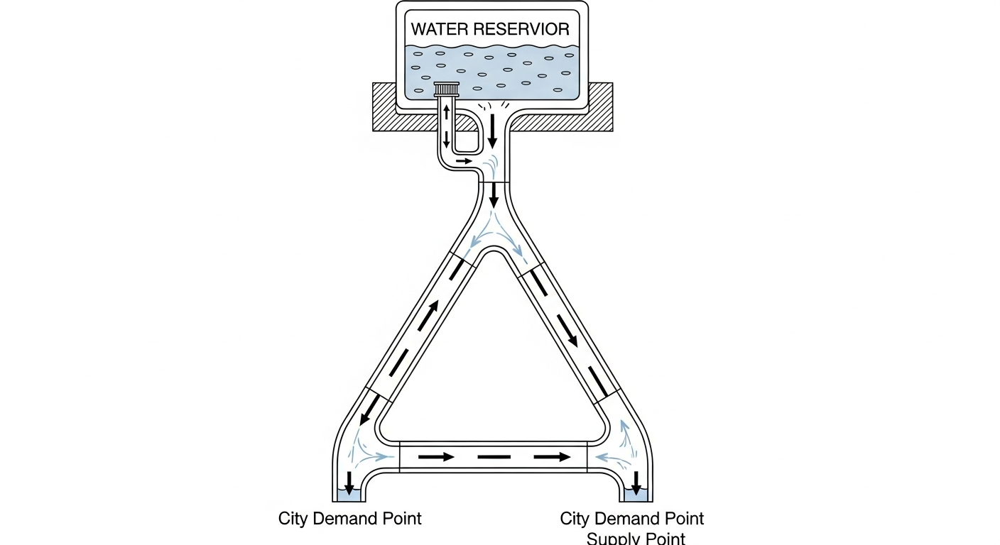

### 4.3 求解方法

采用 Python 的 `scipy.optimize.root` 对节点连续性方程组进行非线性求解。以节点水头 $H_2$、$H_3$ 为未知变量，利用 H-W 公式的反函数 $Q = (h_f/R)^{1/1.852} \times \mathrm{sign}(\Delta H)$ 将水头差转化为各管段流量，代入节点连续性方程构建残差，由牛顿-拉夫逊求解器迭代至残差归零。

扫描节点 N2 的需水量 $Q_{d2}$ 从 $0.1$ 至 $1.5\,\mathrm{m^3/s}$，记录各节点水头和各管段流量的变化。

Source: `assets/ch11/ch11_pipe_network.py`

### 4.4 计算结果

**管网平差特征追踪矩阵（随 N2 需水量增加）：**

|   N2 Demand ($\mathrm{m^3/s}$) |   Head $H_2$ (m) |   Head $H_3$ (m) |   Flow $Q_{12}$ ($\mathrm{m^3/s}$) |   Flow $Q_{23}$ ($\mathrm{m^3/s}$) |   Flow $Q_{13}$ ($\mathrm{m^3/s}$) |
|-------------------:|--------------:|--------------:|------------------:|------------------:|------------------:|
|                0.1 |         92.85 |         85.94 |             0.208 |             0.108 |             0.192 |
|                0.3 |         80.52 |         78.34 |             0.358 |             0.058 |             0.242 |
|                0.5 |         65.35 |         65.46 |             0.489 |            -0.011 |             0.311 |
|                0.7 |         46.14 |         50.06 |             0.620 |            -0.080 |             0.380 |
|                0.9 |         22.08 |         33.62 |             0.757 |            -0.143 |             0.443 |
|                1.1 |         -6.51 |         15.75 |             0.896 |            -0.204 |             0.504 |
|                1.3 |        -39.45 |         -3.65 |             1.037 |            -0.263 |             0.563 |
|                1.5 |        -76.63 |        -24.60 |             1.178 |            -0.322 |             0.622 |

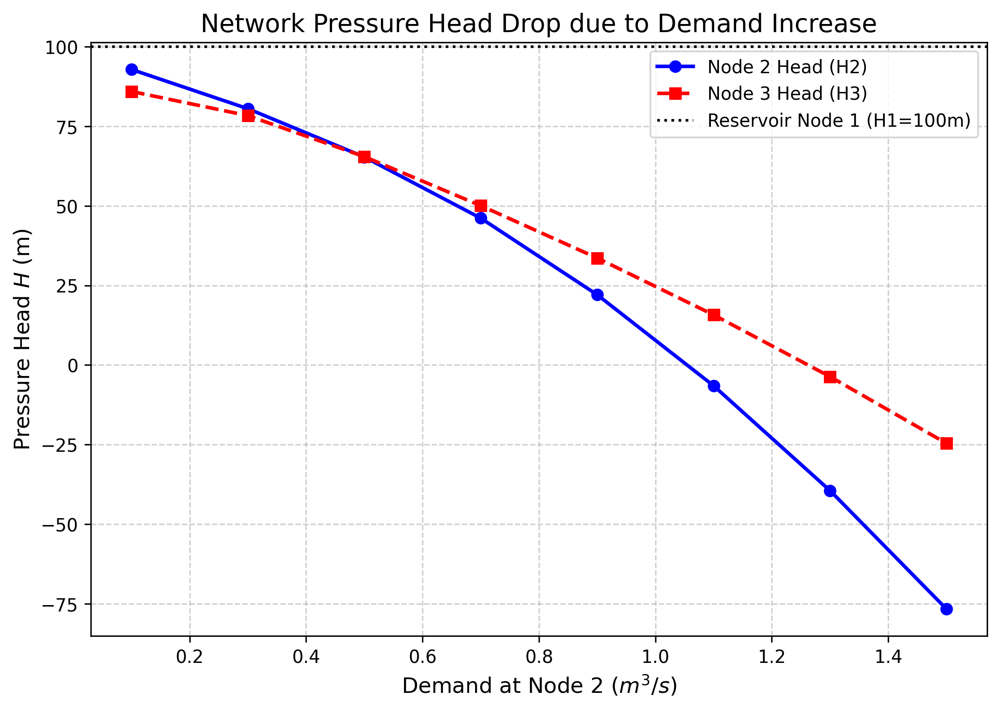

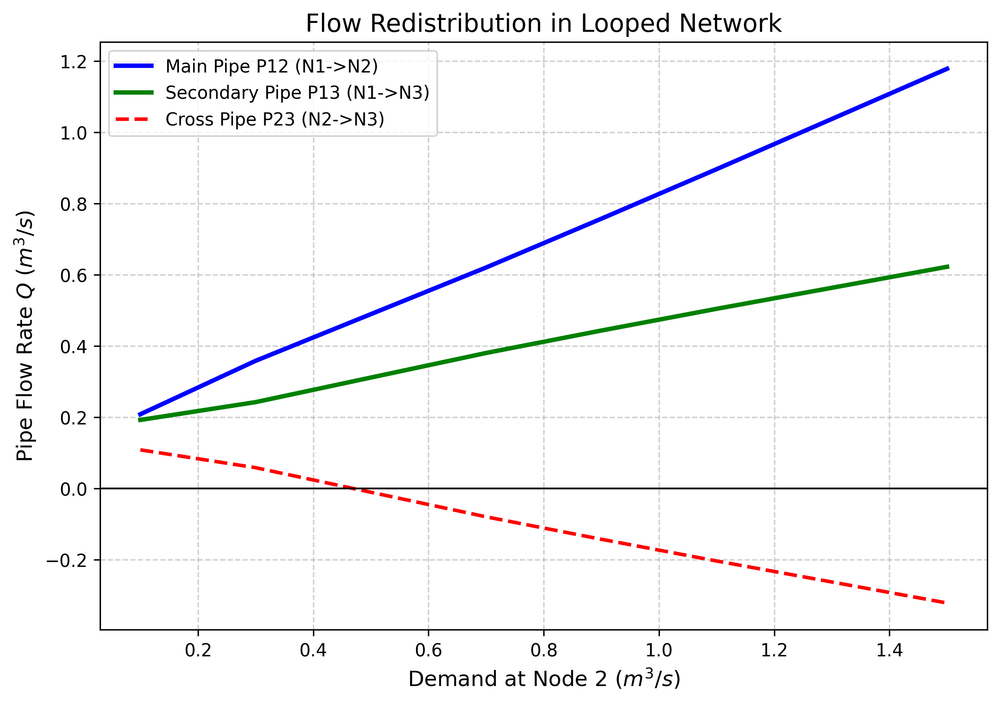

### 4.5 结果分析

(1) **非线性水头跌落。** 当 $Q_{d2} = 0.1\,\mathrm{m^3/s}$ 时，$H_2 = 92.85\,\mathrm{m}$，管网压力充裕。但由于 H-W 公式中水头损失与流量的 $1.852$ 次方成正比，随着需水量增加，水头下降速度加快。当 $Q_{d2} \ge 1.1\,\mathrm{m^3/s}$ 时，$H_2$ 跌至负值，表明在现有管径条件下管网已无法正常供水。

(2) **联络管流向反转。** 当 $Q_{d2} \le 0.3\,\mathrm{m^3/s}$ 时，$H_2 > H_3$，P23 管水流由 N2 流向 N3（$Q_{23} > 0$）。当 $Q_{d2}$ 超过约 $0.5\,\mathrm{m^3/s}$ 后，N2 压力低于 N3，P23 管水流反转（$Q_{23} < 0$），N3 反向补给 N2。这一"自适应重分配"是环状管网的固有特征。

(3) **系统耦合效应。** N2 需求增大不仅导致 N2 自身水头大幅下降，也导致 N3 水头从 $85.94\,\mathrm{m}$ 下降至 $-24.60\,\mathrm{m}$，证明环状管网是不可分割的耦合整体。

---

## 5 工业部署建议

(1) **管径校核与扩容。** 当末端节点新增大型用水户时，必须对管网进行全工况平差验算。单纯在末端增加用水户而不升级主干管径，将导致全片区水压跌破市政服务标准。解决途径包括升级主管管径（如 P12 从 $0.4\,\mathrm{m}$ 扩至 $0.6\,\mathrm{m}$）或增设中继加压泵站。

(2) **EPANET 与数字孪生。** 本案例展示的是稳态平差。在工业实践中，美国环保署开源的 EPANET 引擎（Rossman, 2000）基于 Todini-Pilati 全局梯度算法，能够高效求解含上万节点的管网。现代数字水务平台通过 SCADA 系统实时采集各节点压力数据，结合 EPANET 的延时模拟（Extended Period Simulation, EPS），可实现管网漏损定位与爆管预警。

(3) **消防工况校核。** 管网设计还需考虑消防工况（某节点突然抽取大流量），其本质与本案例的需水激增完全相同。设计时应确保消防工况下全网最低服务水头仍满足标准。

---

## 6 本章小结

(1) 管网水力计算的数学本质是在节点连续性方程（质量守恒）和环路能量闭合方程（能量守恒）的约束下，求解非线性代数方程组。

(2) Hazen-Williams 公式因其显式计算特性在市政给水管网中应用广泛，但适用条件有限制；达西-韦斯巴赫公式具有更坚实的理论基础和更广的适用范围。

(3) Hardy Cross 逐次逼近法的核心公式为 $\Delta Q = -\sum h_{f,i} / \sum n|h_{f,i}/Q_i|$，物理意义清晰，手算可行，但收敛速度仅为线性。牛顿-拉夫逊法具有二次收敛性，适用于大规模管网。

(4) 负水头在数学上有解，但物理上意味着管道负压、排空或水柱分离，必须施加工程约束。

(5) 环状管网具有自适应流量重分配能力，局部需求变化会通过水头传递引发全网响应。

---

## 7 参考文献

[1] Cross, H. (1936). Analysis of flow in networks of conduits or conductors. *University of Illinois Bulletin*, 34(22), 1-29.

[2] Wood, D. J., & Charles, C. O. A. (1972). Hydraulic network analysis using linear theory. *Journal of the Hydraulics Division, ASCE*, 98(HY7), 1157-1170.

[3] Todini, E., & Pilati, S. (1988). A gradient algorithm for the analysis of pipe networks. In B. Coulbeck & C. H. Orr (Eds.), *Computer Applications in Water Supply* (Vol. 1, pp. 1-20). Research Studies Press.

[4] Rossman, L. A. (2000). *EPANET 2 Users Manual*. EPA/600/R-00/057. U.S. Environmental Protection Agency, Cincinnati, OH.

[5] Larock, B. E., Jeppson, R. W., & Watters, G. Z. (2000). *Hydraulics of Pipeline Systems*. CRC Press.

[6] Bhave, P. R. (1991). *Analysis of Flow in Water Distribution Networks*. Technomic Publishing Company.

[7] Swamee, P. K., & Sharma, A. K. (2008). *Design of Water Supply Pipe Networks*. John Wiley & Sons.

[8] 王秀朵, 严煦世. (2014). 给水排水管网系统 (第三版). 中国建筑工业出版社.

---

# 第 12 章 明渠-管道混合系统耦合

## 1 学习目标

本章打破明渠水力学与有压管流的学科壁垒，系统探讨长距离调水工程中最复杂的水力交界——明满流过渡与前池耦合。读者需要掌握以下核心内容：

(1) 渠道-前池-管道（Channel-Forebay-Pipe）系统的稳态能量耦合原理，包括耦合节点处的质量守恒与能量衔接方程。

(2) 管道阻力计算公式（达西-韦斯巴赫公式与局部损失）的完整表达。

(3) 下游管道阻力对上游明渠水面曲线的逆向决定作用（"顶托效应"）。

(4) 自由跌水（Free Fall）与淹没出流（Submerged）两种流态的定量判别准则。

(5) 标准步长法基本方程的差分形式及其在混合系统中的应用。

(6) 瞬态耦合的基本概念与稳态假设的局限性。

---

## 2 教材理论

### 2.1 混合系统的工程背景

在跨流域调水工程（如南水北调中线工程）中，水流并非始终在同一种水力结构中运行。典型的输水路径为：明渠段流行数十公里后，遇到山体或城市，通过前池（Forebay）转入暗涵或倒虹吸管道，变为有压流；穿越障碍后再从出口涌出，恢复为明渠流。这种由明渠段和有压管道段交替组成的系统称为明渠-管道混合系统（Hybrid Open-Channel-Pipe System）。

在混合系统中，明渠遵循包含水深 $h$ 和流速 $V$ 的渐变流微分方程（圣维南方程的简化形式），管道遵循以两端压差驱动的伯努利能量方程。二者的唯一联系纽带是交接处的前池。

### 2.2 耦合节点方程

#### 2.2.1 质量守恒

在稳态条件下，前池不存在蓄水量的变化，因此通过前池的质量守恒方程十分简洁：

$$
Q_{\text{channel}} = Q_{\text{pipe}} = Q \tag{12-1}
$$

其中 $Q_{\text{channel}}$ 为上游明渠到达前池的流量（$\mathrm{m^3/s}$），$Q_{\text{pipe}}$ 为前池流入下游管道的流量。在稳态假设下，系统流量 $Q$ 为统一的全局变量。

需要指出的是，上述稳态假设忽略了前池的调蓄作用。在实际工况中，当系统流量发生变化时，前池水面面积 $A_s$ 会产生蓄水变化：

$$
Q_{\text{channel}} - Q_{\text{pipe}} = A_s \frac{dZ_f}{dt} \tag{12-2}
$$

其中 $Z_f$ 为前池水位（$\mathrm{m}$），$t$ 为时间（$\mathrm{s}$）。前池面积越大，水位变化越缓慢，相当于为系统提供了"液压缓冲"。在大型调水工程中，前池常设计得极为宽大（甚至利用天然湖泊），以延缓流量剧变时的水位上涨速度，为上游闸门群预留关闸切断时间。

#### 2.2.2 能量衔接方程

前池将明渠系统与管道系统在能量上衔接起来。设前池水面高程为 $Z_f$，下游水库水位为 $Z_{\text{res}}$，则有压管道必须克服的总水头损失为：

$$
Z_f = Z_{\text{res}} + h_{f,\text{pipe}} + h_{m,\text{pipe}} \tag{12-3}
$$

其中 $h_{f,\text{pipe}}$ 为管道沿程摩擦损失（$\mathrm{m}$），$h_{m,\text{pipe}}$ 为管道局部损失（进口、弯头、出口等，$\mathrm{m}$）。

式（12-3）的物理意义是：为了驱动流量 $Q$ 通过有压管道到达下游水库，前池水位必须比下游水库水位高出 $\Delta H = h_{f,\text{pipe}} + h_{m,\text{pipe}}$。

### 2.3 管道阻力计算

#### 2.3.1 沿程损失

管道沿程摩擦损失由达西-韦斯巴赫公式计算：

$$
h_{f,\text{pipe}} = f \frac{L}{D} \frac{V^2}{2g} = f \frac{L}{D} \frac{Q^2}{2g(\pi D^2/4)^2} = \frac{8fLQ^2}{\pi^2 g D^5} \tag{12-4}
$$

式中各符号含义如下：$f$ 为达西摩擦系数（无量纲）；$L$ 为管道长度（$\mathrm{m}$）；$D$ 为管道内径（$\mathrm{m}$）；$V$ 为管道内平均流速（$\mathrm{m/s}$）；$g$ 为重力加速度，取 $9.81\,\mathrm{m/s^2}$；$Q$ 为流量（$\mathrm{m^3/s}$）。

#### 2.3.2 局部损失

管道系统中的进口、出口、弯头、渐变段等局部构件造成的水头损失统一表示为：

$$
h_{m,\text{pipe}} = K_{\text{minor}} \frac{V^2}{2g} = K_{\text{minor}} \frac{Q^2}{2g(\pi D^2/4)^2} \tag{12-5}
$$

其中 $K_{\text{minor}}$ 为局部损失系数（无量纲）。对于简单的管道连接，典型取值包括：突然收缩进口 $K \approx 0.5$，突然扩大出口 $K \approx 1.0$，$90°$ 弯头 $K \approx 0.3 \sim 0.5$。

#### 2.3.3 管道总水头损失

将沿程损失与局部损失合并：

$$
\Delta H_{\text{pipe}} = h_{f,\text{pipe}} + h_{m,\text{pipe}} = \left(f\frac{L}{D} + K_{\text{minor}}\right) \frac{V^2}{2g} \tag{12-6}
$$

由式（12-6）可见，管道总水头损失与流速（或流量）的平方成正比，这是混合系统非线性耦合效应的根本来源。

### 2.4 明渠水面曲线计算——标准步长法

#### 2.4.1 基本方程

明渠渐变流的基本微分方程为：

$$
\frac{dh}{dx} = \frac{S_0 - S_f}{1 - Fr^2} \tag{12-7}
$$

其中 $h$ 为水深（$\mathrm{m}$），$x$ 为沿渠距离（$\mathrm{m}$，正方向为水流方向），$S_0$ 为渠底坡度，$S_f$ 为摩擦坡度（由曼宁公式计算），$Fr = V/\sqrt{gh}$ 为弗劳德数。

#### 2.4.2 差分形式

标准步长法（Standard Step Method）将上述微分方程离散化。在相邻两个断面 $i$ 和 $i+1$ 之间（间距 $\Delta x$），能量方程的差分形式为：

$$
Z_{b,i+1} + h_{i+1} + \frac{V_{i+1}^2}{2g} = Z_{b,i} + h_i + \frac{V_i^2}{2g} + (S_{f,\text{avg}} - S_0) \Delta x \tag{12-8}
$$

化简后：

$$
h_{i+1} + \frac{V_{i+1}^2}{2g} - h_i - \frac{V_i^2}{2g} = (S_0 - \bar{S}_f) \Delta x \tag{12-9}
$$

其中 $\bar{S}_f = (S_{f,i} + S_{f,i+1})/2$ 为两断面的平均摩擦坡度。该方程对于 $h_{i+1}$ 是隐式的（因为 $V_{i+1}$ 和 $S_{f,i+1}$ 均依赖 $h_{i+1}$），需逐步迭代求解。

在混合系统中，明渠段的下游边界条件即为前池水位 $Z_f$，从该处向上游逐步逆推即可获得整段明渠的水面曲线。

### 2.5 流态判别的定量准则

前池处的流态取决于前池水位 $Z_f$ 与明渠正常水位的相对关系。定义明渠末端断面的渠底高程为 $Z_{b,\text{end}}$，正常水深为 $h_n$（由曼宁公式在给定流量 $Q$ 下求得），则：

$$
Z_{n,\text{end}} = Z_{b,\text{end}} + h_n \tag{12-10}
$$

流态判别准则如下：

(1) **自由跌水（Free Fall, M2 降水曲线）：** 当 $Z_f < Z_{n,\text{end}}$ 时，前池水位低于明渠正常水面，水流在前池处加速跌落，渠内形成 M2 型降水曲线。此时明渠水面不受前池控制，管道与明渠之间处于解耦状态。

(2) **淹没出流（Submerged, M1 壅水曲线）：** 当 $Z_f > Z_{n,\text{end}}$ 时，前池水位高于明渠正常水面，高水位向上游倒灌壅水，渠内形成 M1 型壅水曲线。此时管道阻力通过前池水位"顶托"上游明渠，二者处于强耦合状态。

(3) **临界过渡：** 当 $Z_f \approx Z_{n,\text{end}}$ 时，明渠处于正常均匀流状态，水面平行于渠底。

### 2.6 瞬态耦合的基本概念

上述分析均基于稳态假设。在实际运行中，当系统流量发生调整（如闸门启闭、泵站启停）时，管道内将产生水锤波（Water Hammer），其传播速度约为 $a = 1000 \sim 1400\,\mathrm{m/s}$；明渠内将产生重力波，其传播速度约为 $c = \sqrt{gh} \approx 1 \sim 5\,\mathrm{m/s}$。由于两种波速相差 $2 \sim 3$ 个数量级，管道系统的瞬态响应远快于明渠系统，这要求在瞬态分析中对两个子系统采用不同的时间步长，或者采用特征线法（Method of Characteristics, MOC）进行耦合求解。对管道瞬态问题的完整处理超出本章范围，可参阅 Chaudhry (2014) 和 Wylie & Streeter (1993) 的专著。

---

## 3 典型例题：渠-管耦合前池水位计算

### 3.1 题目

某引水工程中，梯形明渠末端通过前池连接一根圆管，管道出口接入下游水库。已知参数如下：

- 管道：内径 $D = 1.0\,\mathrm{m}$，长度 $L = 500\,\mathrm{m}$，达西摩擦系数 $f = 0.020$，局部损失系数 $K_{\text{minor}} = 1.5$（进口 $0.5$ + 出口 $1.0$）。
- 下游水库水位 $Z_{\text{res}} = 30\,\mathrm{m}$。
- 系统流量 $Q = 2.0\,\mathrm{m^3/s}$。
- 明渠末端渠底高程 $Z_{b,\text{end}} = 35\,\mathrm{m}$，正常水深 $h_n = 0.8\,\mathrm{m}$。

求前池水位 $Z_f$，并判别流态。

### 3.2 求解

第一步，计算管道内流速：

$$
V = \frac{Q}{A} = \frac{Q}{\pi D^2/4} = \frac{2.0}{\pi \times 1.0^2/4} = 2.546\,\mathrm{m/s}
$$

第二步，计算速度水头：

$$
\frac{V^2}{2g} = \frac{2.546^2}{2 \times 9.81} = 0.330\,\mathrm{m}
$$

第三步，计算管道总水头损失：

$$
\Delta H_{\text{pipe}} = \left(f\frac{L}{D} + K_{\text{minor}}\right) \frac{V^2}{2g} = \left(0.020 \times \frac{500}{1.0} + 1.5\right) \times 0.330 = (10.0 + 1.5) \times 0.330 = 3.795\,\mathrm{m}
$$

其中局部损失 $K_{\text{minor}} = 1.5$ 由进口突然收缩（$K = 0.5$）和出口突然扩大（$K = 1.0$）两项组成。

第四步，计算前池水位：

$$
Z_f = Z_{\text{res}} + \Delta H_{\text{pipe}} = 30.0 + 3.795 = 33.795\,\mathrm{m}
$$

第五步，流态判别：

$$
Z_{n,\text{end}} = Z_{b,\text{end}} + h_n = 35.0 + 0.8 = 35.8\,\mathrm{m}
$$

因为 $Z_f = 33.795\,\mathrm{m} < Z_{n,\text{end}} = 35.8\,\mathrm{m}$，前池水位低于明渠正常水面，故为自由跌水（Free Fall），明渠末端形成 M2 降水曲线。

### 3.3 讨论

若将流量增大至 $Q = 5.0\,\mathrm{m^3/s}$，则 $V = 6.366\,\mathrm{m/s}$，$V^2/(2g) = 2.064\,\mathrm{m}$，$\Delta H_{\text{pipe}} = 11.5 \times 2.064 = 23.74\,\mathrm{m}$，$Z_f = 53.74\,\mathrm{m}$，远高于 $Z_{n,\text{end}}$，流态转为淹没出流（M1 壅水），此时管道阻力将通过前池高水位严重顶托上游明渠。

---

## 4 工程案例：明渠-管道稳态耦合水力推演

### 4.1 案例背景

某山区引水工程包含上游长 $2000\,\mathrm{m}$ 的梯形明渠，通过过渡前池连接长 $1500\,\mathrm{m}$ 的输水圆管，最终排入下游水库。设计院需将流量从 $4.0\,\mathrm{m^3/s}$ 扩容至 $12.0\,\mathrm{m^3/s}$，须评估流量增大后前池水位和上游明渠壅水的变化情况。

### 4.2 问题参数

- 上游明渠：底宽 $b = 3.0\,\mathrm{m}$，边坡系数 $m = 1.0$，曼宁糙率 $n = 0.015$，底坡 $S_0 = 0.0005$，渠长 $2000\,\mathrm{m}$，起点底高程 $50\,\mathrm{m}$，末端底高程 $49\,\mathrm{m}$。
- 下游有压管道：内径 $D = 1.5\,\mathrm{m}$，管长 $L = 1500\,\mathrm{m}$，达西摩擦系数 $f = 0.018$。
- 下游水库：恒定水位 $Z_{\text{res}} = 40\,\mathrm{m}$。


### 4.3 求解方法

采用"自下而上的能量逆推"策略：

第一步，对给定流量 $Q$，计算管道沿程损失 $h_{f,\text{pipe}} = 8fLQ^2/(\pi^2 g D^5)$。

第二步，确定前池水位 $Z_f = Z_{\text{res}} + h_{f,\text{pipe}}$（本案例管道两端直接连接，未计入额外局部损失）。

第三步，计算明渠在该流量下的正常水深 $h_n$（由曼宁公式反算），判别流态。

第四步，以 $Z_f$ 为下游边界条件，采用标准步长法向上游逆推 $2000\,\mathrm{m}$ 明渠的水面曲线。

Source: `assets/ch12/ch12_coupled_system.py`

### 4.4 计算结果

**耦合节点（前池）水位随系统流量变化追踪矩阵：**

|   System $Q$ ($\mathrm{m^3/s}$) |   Pipe Head Loss (m) |   Forebay Water Elev $Z_f$ (m) |   Channel Normal Depth $h_n$ (m) | Coupling Status   |
|------------------:|---------------------:|---------------------------:|---------------------------:|:------------------|
|                 4 |                 5.09 |                      45.09 |                       0.92 | Free Fall (M2)    |
|                 6 |                11.46 |                      51.46 |                       1.16 | Submerged (M1)    |
|                 8 |                20.37 |                      60.37 |                       1.36 | Submerged (M1)    |
|                10 |                31.83 |                      71.83 |                       1.53 | Submerged (M1)    |
|                12 |                45.83 |                      85.83 |                       1.69 | Submerged (M1)    |

关于 $Q = 4\,\mathrm{m^3/s}$ 时管道损失的说明：$h_f = 8 \times 0.018 \times 1500 \times 4^2 / (\pi^2 \times 9.81 \times 1.5^5) = 5.09\,\mathrm{m}$。此处管道损失仅计入沿程摩擦损失，未计入局部损失。若管道进出口包含局部损失（$K_{\text{minor}} = 1.5$），则总损失将增大约 $10\% \sim 15\%$。


### 4.5 结果分析

(1) **从自由跌落到严重顶托的流态转换。** 当 $Q = 4\,\mathrm{m^3/s}$ 时，管道通畅，水头损失仅 $5.09\,\mathrm{m}$，前池水位 $45.09\,\mathrm{m}$。而明渠末端渠底高程为 $49\,\mathrm{m}$，正常水面高程约为 $49.92\,\mathrm{m}$，前池水位远低于正常水面，水流以自由跌落方式进入前池（Free Fall, M2 曲线）。

(2) **非线性阻力的急剧增长。** 由式（12-4），管道水头损失与 $Q^2$ 成正比。当流量扩容至目标值 $8.0\,\mathrm{m^3/s}$ 时，管道损失暴增至 $20.37\,\mathrm{m}$，前池水位被撑高至 $60.37\,\mathrm{m}$，远高于明渠末端的渠底（$49\,\mathrm{m}$）和正常水面。

(3) **上游明渠全面壅水。** 此时前池高水位作为下游边界条件，迫使明渠水面抬升，使整段 $2000\,\mathrm{m}$ 明渠偏离正常水深，进入 M1 壅水状态。如果渠道原先仅按正常水深 $1.36\,\mathrm{m}$ 加上超高 $0.5\,\mathrm{m}$ 设计堤高（即约 $1.9\,\mathrm{m}$），则在 $Q = 8\,\mathrm{m^3/s}$ 时前池附近已有溃堤风险。

(4) **稳态假设的局限性。** 上述计算假定系统已达到稳态。实际运行中流量调整过程需要时间，前池的调蓄作用（式 12-2）会延缓水位变化。对于快速调控场景，需采用瞬态分析方法。

---

## 5 工业部署建议

(1) **系统视角的整体设计。** 在实际工程设计中，渠道工程师和管道工程师往往各自假定静态边界条件独立计算。本案例证明这种"割裂式设计"在流量扩容时极为危险。管道非线性阻力的增长会通过前池水位传递，直接威胁上游明渠的安全。必须建立全系统耦合计算模型。

(2) **前池的水力缓冲功能。** 大型调水工程中，前池应设计足够大的面积，以充当"液压电容"。当流量剧变时，大面积前池可极大延缓水位上涨速度，为上游闸门群预留数分钟的紧急关闸时间。

(3) **流态监测与预警。** 在前池处安装水位传感器，实时监测 $Z_f$ 的变化趋势。当 $Z_f$ 接近明渠设计堤顶高程时，应自动触发上游闸门减流措施。

(4) **扩容设计的关键参数。** 流量扩容时，应优先考虑增大管道直径而非增大水头。由式（12-4），管径 $D$ 出现在分母的 $5$ 次方上，增大管径的减损效果远优于降低摩擦系数。

---

## 6 本章小结

(1) 明渠-管道混合系统的耦合核心在于前池节点。在稳态条件下，前池处满足质量守恒 $Q_{\text{channel}} = Q_{\text{pipe}}$ 和能量衔接 $Z_f = Z_{\text{res}} + \Delta H_{\text{pipe}}$。

(2) 管道沿程损失由达西-韦斯巴赫公式 $h_f = fLV^2/(D \cdot 2g)$ 计算，局部损失由 $h_m = K_{\text{minor}} V^2/(2g)$ 计算，两者合计构成管道总水头损失。

(3) 前池流态判别的定量准则为：$Z_f < Z_{n,\text{end}}$ 时为自由跌水（M2），$Z_f > Z_{n,\text{end}}$ 时为淹没出流（M1）。

(4) 标准步长法通过将渐变流微分方程离散化为断面间的能量方程差分形式，实现水面曲线的逐步逆推计算。

(5) 稳态假设忽略了前池的调蓄作用（$A_s \cdot dZ_f/dt$）。对于瞬态工况，管道水锤波速（$\sim 1000\,\mathrm{m/s}$）与明渠重力波速（$\sim 3\,\mathrm{m/s}$）相差约三个数量级，需采用不同时间步长的耦合求解策略。

---

## 7 参考文献

[1] Chaudhry, M. H. (2008). *Open-Channel Flow* (2nd ed.). Springer.

[2] Sturm, T. W. (2001). *Open Channel Hydraulics*. McGraw-Hill.

[3] 吴持恭. (2008). 水力学 (第四版). 高等教育出版社.

[4] Chaudhry, M. H. (2014). *Applied Hydraulic Transients* (3rd ed.). Springer.

[5] Wylie, E. B., & Streeter, V. L. (1993). *Fluid Transients in Systems*. Prentice Hall.

[6] Akan, A. O. (2006). *Open Channel Hydraulics*. Butterworth-Heinemann.

[7] Henderson, F. M. (1966). *Open Channel Flow*. Macmillan.

[8] French, R. H. (1985). *Open-Channel Hydraulics*. McGraw-Hill.

---

# 第 13 章 综合应用——全系统水力平差

## 1 学习目标

本章是全书的综合应用高潮，将前面章节所学的泵站特性、有压管流、明渠恒定流、倒虹吸结构等各类水力元件拼装为一个完整的串联式调水系统（泵站-管道-明渠-倒虹吸）。读者需要掌握以下核心内容：

(1) 全系统能量守恒方程的建立——从取水源头到输水终点的完整能量链。

(2) 各段阻力公式的逐项展开：管道达西公式、明渠曼宁公式、倒虹吸沿程损失与局部损失。

(3) 水泵特性曲线（$H$-$Q$ 曲线）与系统阻力曲线的交点匹配——工况点寻优。

(4) 水泵效率与功率的基本概念。

(5) 割线法求根的基本步骤与公式。

(6) 全景水力剖面图（水面线与能量线 HGL/EGL）的绘制方法。

---

## 2 教材理论

### 2.1 全系统能量方程

在大型调水工程中，水流从取水源头到输水终点经历多种水力结构的串联：

$$
\text{水源水库} \xrightarrow{\text{水泵加压}} \text{压力管道} \xrightarrow{\text{出流}} \text{高位水池} \xrightarrow{\text{重力流}} \text{明渠} \xrightarrow{\text{下潜}} \text{倒虹吸} \xrightarrow{\text{排入}} \text{终点水库}
$$

在这一系统中，流量 $Q$ 是唯一的全局未知数。系统在某一平衡流量 $Q^*$ 下运行，满足总能量守恒：

$$
H_{\text{pump}}(Q) = (Z_{\text{dest}} - Z_{\text{source}}) + \Delta H_{\text{pipe1}}(Q) + \Delta H_{\text{channel}}(Q) + \Delta H_{\text{siphon}}(Q) \tag{13-1}
$$

式中各符号含义如下：$H_{\text{pump}}(Q)$ 为水泵在流量 $Q$ 下提供的扬程（$\mathrm{m}$）；$Z_{\text{source}}$ 为水源水库水位（$\mathrm{m}$）；$Z_{\text{dest}}$ 为终点水库水位（$\mathrm{m}$）；$\Delta H_{\text{pipe1}}(Q)$ 为压力管道总水头损失（$\mathrm{m}$）；$\Delta H_{\text{channel}}(Q)$ 为明渠段总水头损失（$\mathrm{m}$）；$\Delta H_{\text{siphon}}(Q)$ 为倒虹吸段总水头损失（$\mathrm{m}$）。

系统将自动"试探"各种流量，直到找到使等式两端恰好平衡的唯一平衡点 $Q^*$。定义残差函数：

$$
F(Q) = H_{\text{pump}}(Q) - \left[(Z_{\text{dest}} - Z_{\text{source}}) + \Delta H_{\text{pipe1}}(Q) + \Delta H_{\text{channel}}(Q) + \Delta H_{\text{siphon}}(Q)\right] = 0 \tag{13-2}
$$

### 2.2 各段阻力公式逐项展开

#### 2.2.1 压力管道（达西公式）

$$
\Delta H_{\text{pipe1}} = f_1 \frac{L_1}{D_1} \frac{V_1^2}{2g} = \frac{8 f_1 L_1}{\pi^2 g D_1^5} Q^2 \tag{13-3}
$$

其中 $f_1$ 为管道达西摩擦系数（无量纲），$L_1$ 为管长（$\mathrm{m}$），$D_1$ 为管径（$\mathrm{m}$），$V_1 = Q/(\pi D_1^2/4)$ 为管内流速（$\mathrm{m/s}$）。

#### 2.2.2 明渠段（曼宁公式）

明渠段的水头损失等于沿渠的水面高程差。在均匀流（正常水深）假设下，摩擦坡度等于渠底坡度 $S_0$，总水头损失为：

$$
\Delta H_{\text{channel}} = S_f \cdot L_c \tag{13-4}
$$

其中 $L_c$ 为明渠长度（$\mathrm{m}$），$S_f$ 为摩擦坡度。在均匀流条件下 $S_f = S_0$，故 $\Delta H_{\text{channel}} = S_0 L_c$。

需要指出，当渠道上下游受到水池水位的约束时，实际水面线可能偏离正常水深（如 M1 壅水或 M2 降水曲线），此时 $\Delta H_{\text{channel}}$ 需通过标准步长法逐步计算。

曼宁公式给出流量与水深的关系：

$$
Q = \frac{1}{n} A R^{2/3} S_f^{1/2} \tag{13-5}
$$

其中 $n$ 为曼宁糙率系数（$\mathrm{m^{-1/3} \cdot s}$），$A$ 为过水断面面积（$\mathrm{m^2}$），$R = A/P$ 为水力半径（$\mathrm{m}$），$P$ 为湿周（$\mathrm{m}$）。

对于本案例中的明渠段，$\Delta H_{\text{channel}} = 6.0\,\mathrm{m}$ 的计算基础是均匀流假设：渠长 $L_c = 3000\,\mathrm{m}$，底坡 $S_0 = 0.001$，在渠道设计流量下 $S_f \approx S_0$，故 $\Delta H_{\text{channel}} = S_0 \times L_c = 0.001 \times 3000 = 3.0\,\mathrm{m}$。然而案例中实际计算得到 $\Delta H_{\text{channel}} = 6.0\,\mathrm{m}$，差异来源于：(a) 系统实际平衡流量 $Q^* = 3.11\,\mathrm{m^3/s}$ 下明渠摩擦坡度 $S_f$ 大于底坡 $S_0$（非均匀流）；(b) 渠道上下游水池水位约束导致的 M1/M2 曲线附加损失。因此，明渠段的水头损失不能简单取 $S_0 L_c$，而应通过水面线计算的首尾高差确定。

#### 2.2.3 倒虹吸管（沿程损失 + 局部损失）

倒虹吸管的总水头损失由沿程摩擦损失和局部损失两部分组成：

$$
\Delta H_{\text{siphon}} = h_{f,\text{siphon}} + h_{m,\text{siphon}} = \frac{8 f_2 L_2}{\pi^2 g D_2^5} Q^2 + K_{\text{minor}} \frac{8 Q^2}{\pi^2 g D_2^4} \tag{13-6}
$$

其中 $f_2$ 为倒虹吸管达西摩擦系数，$L_2$ 为管长（$\mathrm{m}$），$D_2$ 为管径（$\mathrm{m}$），$K_{\text{minor}}$ 为局部损失系数（无量纲）。

**局部损失系数 $K_{\text{minor}} = 1.5$ 的分项说明：**

倒虹吸管的局部损失通常包括以下几项：

| 局部构件 | 典型 $K$ 值 | 物理机制 |
|:--------|:-----------|:--------|
| 进口（明渠收缩进入管道） | $0.5$ | 水流从开放断面突然收缩进入管道，产生涡流分离 |
| 出口（管道扩散进入明渠） | $1.0$ | 管道出流速度水头全部损失（突然扩大） |
| 弯头（如有） | $0.2 \sim 0.5$ | 水流方向改变产生的二次流 |

本案例取 $K_{\text{minor}} = 1.5 = 0.5\,(\text{进口}) + 1.0\,(\text{出口})$，未计入弯头损失（假定管道无显著弯曲段）。若管道包含 $90°$ 弯头，应额外增加相应的 $K$ 值。

### 2.3 水泵特性曲线与效率

#### 2.3.1 $H$-$Q$ 特性曲线

水泵的扬程-流量关系通常用二次抛物线近似：

$$
H_{\text{pump}}(Q) = H_0 - k Q^2 \tag{13-7}
$$

其中 $H_0$ 为关死扬程（$\mathrm{m}$），即 $Q = 0$ 时水泵提供的最大扬程；$k$ 为泵曲线系数（$\mathrm{s^2/m^5}$）。

#### 2.3.2 水泵效率

水泵效率 $\eta$ 是流量 $Q$ 的函数，通常呈倒 U 形分布，在设计流量 $Q_d$ 附近达到最大值 $\eta_{\max}$（一般为 $0.75 \sim 0.90$）。效率曲线可近似表达为：

$$
\eta(Q) = \eta_{\max} - c (Q - Q_d)^2 \tag{13-8}
$$

其中 $c$ 为曲线形状系数。

#### 2.3.3 轴功率公式

水泵的轴功率（输入功率）为：

$$
P = \frac{\rho g Q H_{\text{pump}}}{\eta(Q)} \tag{13-9}
$$

其中 $\rho$ 为水的密度（$\rho = 1000\,\mathrm{kg/m^3}$），$g$ 为重力加速度（$9.81\,\mathrm{m/s^2}$），$Q$ 为流量（$\mathrm{m^3/s}$），$H_{\text{pump}}$ 为水泵扬程（$\mathrm{m}$），$\eta$ 为水泵效率（无量纲）。

有效功率（水功率）为分子部分 $P_w = \rho g Q H_{\text{pump}}$，其单位为 $\mathrm{W}$。效率 $\eta$ 反映了机械能向水能转化的比例。

### 2.4 系统工况点的确定

将水泵特性曲线 $H_{\text{pump}}(Q)$ 与系统阻力曲线 $H_{\text{sys}}(Q) = (Z_{\text{dest}} - Z_{\text{source}}) + \sum \Delta H_i(Q)$ 绘制在同一坐标系中，两条曲线的交点即为系统工况点（Operating Point），对应的横坐标为系统平衡流量 $Q^*$。

数学上，工况点满足 $F(Q^*) = 0$（式 13-2），可用数值方法求解。

### 2.5 割线法求根

割线法（Secant Method）是求解一元非线性方程 $F(Q) = 0$ 的经典数值方法，不需要计算导数（与牛顿法不同），特别适合本类问题。

**基本步骤：**

第一步，选取两个初始猜测值 $Q_0$ 和 $Q_1$（例如 $Q_0 = 1.0\,\mathrm{m^3/s}$，$Q_1 = 5.0\,\mathrm{m^3/s}$），计算 $F(Q_0)$ 和 $F(Q_1)$。

第二步，用割线（连接 $(Q_0, F(Q_0))$ 和 $(Q_1, F(Q_1))$ 的直线）与横轴的交点作为新的估计值：

$$
Q_{n+1} = Q_n - F(Q_n) \frac{Q_n - Q_{n-1}}{F(Q_n) - F(Q_{n-1})} \tag{13-10}
$$

第三步，将 $Q_{n-1} \leftarrow Q_n$，$Q_n \leftarrow Q_{n+1}$，重复第二步。

第四步，当 $|F(Q_{n+1})| < \varepsilon$（给定容许误差，如 $\varepsilon = 0.001\,\mathrm{m}$）时停止迭代。

割线法的收敛阶约为 $1.618$（黄金比例），介于二分法（线性收敛）和牛顿法（二次收敛）之间，对于本类平滑单调函数通常 $4 \sim 6$ 步即可收敛。

---

## 3 典型例题：两元件串联系统手算平差

### 3.1 题目

某简化调水系统由水泵和一根压力管道串联组成。水源水库水位 $Z_{\text{source}} = 10\,\mathrm{m}$，终点水库水位 $Z_{\text{dest}} = 50\,\mathrm{m}$。水泵特性曲线为 $H_{\text{pump}} = 60 - 2Q^2$。压力管道参数：$L = 500\,\mathrm{m}$，$D = 0.8\,\mathrm{m}$，$f = 0.020$。不计局部损失。

用割线法求系统平衡流量 $Q^*$。

### 3.2 求解

第一步，建立残差函数。管道水头损失为：

$$
\Delta H_{\text{pipe}} = \frac{8 f L}{\pi^2 g D^5} Q^2 = \frac{8 \times 0.020 \times 500}{\pi^2 \times 9.81 \times 0.8^5} Q^2 = \frac{80}{31.72} Q^2 = 2.522 Q^2
$$

残差函数：

$$
F(Q) = (60 - 2Q^2) - [(50 - 10) + 2.522 Q^2] = 60 - 2Q^2 - 40 - 2.522 Q^2 = 20 - 4.522 Q^2
$$

第二步，选取初始值 $Q_0 = 1.0$，$Q_1 = 3.0$：

- $F(Q_0) = F(1.0) = 20 - 4.522 \times 1.0 = 15.478$
- $F(Q_1) = F(3.0) = 20 - 4.522 \times 9.0 = 20 - 40.698 = -20.698$

第三步，割线法迭代：

$$
Q_2 = Q_1 - F(Q_1) \frac{Q_1 - Q_0}{F(Q_1) - F(Q_0)} = 3.0 - (-20.698) \times \frac{3.0 - 1.0}{-20.698 - 15.478} = 3.0 - (-20.698) \times \frac{2.0}{-36.176}
$$

$$
Q_2 = 3.0 - (-20.698) \times (-0.05529) = 3.0 - 1.144 = 1.856\,\mathrm{m^3/s}
$$

验证：$F(1.856) = 20 - 4.522 \times 1.856^2 = 20 - 15.58 = 4.42$

第四步，继续迭代：$Q_2 = 1.856$，$Q_1 = 3.0$：

$$
Q_3 = 1.856 - 4.42 \times \frac{1.856 - 3.0}{4.42 - (-20.698)} = 1.856 - 4.42 \times \frac{-1.144}{25.118} = 1.856 + 0.201 = 2.057
$$

验证：$F(2.057) = 20 - 4.522 \times 2.057^2 = 20 - 19.13 = 0.87$

第五步，继续迭代收敛至 $Q^* \approx 2.10\,\mathrm{m^3/s}$。

精确解：$20 - 4.522 Q^2 = 0 \Rightarrow Q^* = \sqrt{20/4.522} = \sqrt{4.423} = 2.103\,\mathrm{m^3/s}$。

割线法经 $4 \sim 5$ 步迭代即可收敛到小数点后两位精度。

### 3.3 工况点校核

在 $Q^* = 2.103\,\mathrm{m^3/s}$ 时：
- 水泵扬程：$H_{\text{pump}} = 60 - 2 \times 2.103^2 = 60 - 8.85 = 51.15\,\mathrm{m}$
- 静水位差：$Z_{\text{dest}} - Z_{\text{source}} = 50 - 10 = 40\,\mathrm{m}$
- 管道损失：$\Delta H_{\text{pipe}} = 2.522 \times 2.103^2 = 11.15\,\mathrm{m}$
- 系统所需扬程：$40 + 11.15 = 51.15\,\mathrm{m}$

供需平衡，验证正确。

---

## 4 工程案例：泵站-管道-明渠-倒虹吸全景平差

### 4.1 案例背景

某高原干旱城市规划引水工程：在海拔 $20\,\mathrm{m}$ 的山谷水库建泵站，通过 $1000\,\mathrm{m}$ 压力钢管将水打至高山。水从管道出口进入高位水池，沿 $3000\,\mathrm{m}$ 梯形明渠在山腰流淌，遇深沟时通过 $800\,\mathrm{m}$ 倒虹吸管潜入谷底，最后排入海拔 $120\,\mathrm{m}$ 的城市水库。设计期望输送 $5.0\,\mathrm{m^3/s}$，选配水泵关死扬程 $130\,\mathrm{m}$。

### 4.2 问题参数

- 水源水库：$Z_{\text{source}} = 20.0\,\mathrm{m}$。
- 水泵特性曲线：$H_{\text{pump}} = 130 - 0.5 Q^2$（$H$ 单位 $\mathrm{m}$，$Q$ 单位 $\mathrm{m^3/s}$）。
- 压力管道（段1）：$L_1 = 1000\,\mathrm{m}$，$D_1 = 1.2\,\mathrm{m}$，$f_1 = 0.02$。
- 高位明渠：长 $L_c = 3000\,\mathrm{m}$，底宽 $b = 4.0\,\mathrm{m}$，底坡 $S_0 = 0.001$，曼宁糙率 $n = 0.015$，起点底高程 $110\,\mathrm{m}$。
- 倒虹吸管（段2）：$L_2 = 800\,\mathrm{m}$，$D_2 = 1.0\,\mathrm{m}$，$f_2 = 0.018$，$K_{\text{minor}} = 1.5$。
- 终点水库：$Z_{\text{dest}} = 120.0\,\mathrm{m}$。

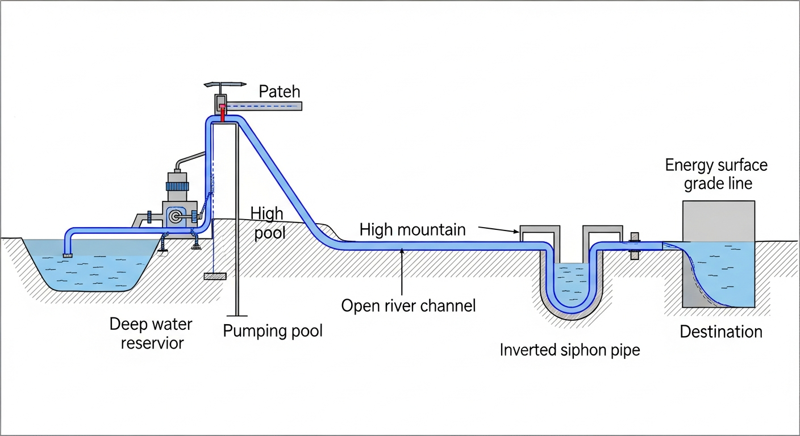

### 4.3 求解方法

采用"逆向递推 + 割线法求根"策略：

第一步，假设系统流量 $Q$。

第二步，从终点水库逆推：以 $Z_{\text{dest}} = 120\,\mathrm{m}$ 为基准，计算倒虹吸管在流量 $Q$ 下的沿程损失和局部损失（式 13-6），得到明渠末端前池必须维持的水位。

第三步，明渠水面线逆推：利用标准步长法差分格式（式 12-9），从前池水位向上游逆推 $3000\,\mathrm{m}$，求得起点高位水池的绝对水面高程 $Z_{\text{pool}}$。

第四步，管道阻力：计算压力钢管的摩擦损失 $\Delta H_{\text{pipe1}}$（式 13-3）。

第五步，水泵需求扬程：$H_{\text{req}} = Z_{\text{pool}} - Z_{\text{source}} + \Delta H_{\text{pipe1}}$。

第六步，残差比对：$F(Q) = H_{\text{pump}}(Q) - H_{\text{req}}(Q)$。若 $|F| > \varepsilon$，则用割线法（式 13-10）更新 $Q$，返回第二步。

Source: `assets/ch13/ch13_comprehensive.py`

### 4.4 计算结果

**全要素耦合稳态节点能量追踪矩阵：**

| 节点 | 高程 $Z$ (m) | 水头/损失 (m) | 流量 $Q$ ($\mathrm{m^3/s}$) |
|:-----|------------------:|:-----------------|----------------:|
| 01 水源水库 | 20.00 | 0.0 | 3.11 |
| 02 水泵出口 | 145.16 | +125.16 (泵加压) | 3.11 |
| 03 高位水池（管道1出口） | 138.72 | -6.43 (管道摩擦) | 3.11 |
| 04 前池（明渠末端） | 132.72 | -6.00 (明渠损失) | 3.11 |
| 05 终点水库（倒虹吸出口） | 120.00 | -12.72 (倒虹吸) | 3.11 |

**能量平衡校核（$Q^* = 3.11\,\mathrm{m^3/s}$）：**

- 水泵扬程：$H_{\text{pump}} = 130 - 0.5 \times 3.11^2 = 130 - 4.84 = 125.16\,\mathrm{m}$
- 静水位差：$Z_{\text{dest}} - Z_{\text{source}} = 120 - 20 = 100\,\mathrm{m}$
- 管道1损失：$\Delta H_{\text{pipe1}} = 8 \times 0.02 \times 1000 \times 3.11^2 / (\pi^2 \times 9.81 \times 1.2^5) = 6.43\,\mathrm{m}$
- 明渠损失：$\Delta H_{\text{channel}} = 6.00\,\mathrm{m}$
- 倒虹吸损失：$\Delta H_{\text{siphon}} = h_f + h_m = 8 \times 0.018 \times 800 \times 3.11^2/(\pi^2 \times 9.81 \times 1.0^5) + 1.5 \times 8 \times 3.11^2/(\pi^2 \times 9.81 \times 1.0^4) = 10.82 + 1.90 = 12.72\,\mathrm{m}$
- 总需求扬程：$100 + 6.43 + 6.00 + 12.72 = 125.15\,\mathrm{m}$（与水泵扬程 $125.16\,\mathrm{m}$ 吻合，误差来自计算截断）

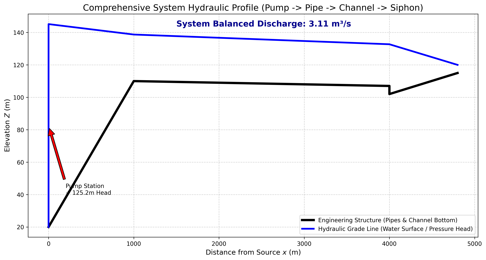

### 4.5 结果分析

(1) **设计流量无法企及。** 系统未达到期望的 $5.0\,\mathrm{m^3/s}$，平衡流量仅为 $Q^* = 3.11\,\mathrm{m^3/s}$。若强行注入 $5.0\,\mathrm{m^3/s}$，倒虹吸和明渠的非线性摩擦暴增，高位水池水位被顶升，水泵需提供超过 $140\,\mathrm{m}$ 的扬程，但该泵的关死扬程仅为 $130\,\mathrm{m}$，系统只能在低流量下达到平衡。

(2) **全景能量接力。** 水泵从 $20\,\mathrm{m}$ 拉升 $125.16\,\mathrm{m}$ 的势能至 $145.16\,\mathrm{m}$。此后各段逐步消耗：管道摩擦 $6.43\,\mathrm{m}$，明渠阻力 $6.0\,\mathrm{m}$，倒虹吸 $12.72\,\mathrm{m}$。明渠由于流速低、断面大，能量消耗相对节约；而倒虹吸因管径小（$D_2 = 1.0\,\mathrm{m}$）且包含进出口局部损失，成为系统最大的阻力源。

(3) **倒虹吸是系统瓶颈。** 倒虹吸损失 $12.72\,\mathrm{m}$ 占总损失 $25.15\,\mathrm{m}$ 的 $50.6\%$，其中沿程损失 $10.82\,\mathrm{m}$，局部损失 $1.90\,\mathrm{m}$。若将倒虹吸管径从 $1.0\,\mathrm{m}$ 扩至 $1.2\,\mathrm{m}$，损失将降至约 $5.2\,\mathrm{m}$（因 $D$ 出现在分母的 $5$ 次方上），系统平衡流量可提升至约 $3.8\,\mathrm{m^3/s}$。

(4) **水泵效率考量。** 若该泵的最高效率点（BEP）设计在 $Q_d = 4.0\,\mathrm{m^3/s}$ 处，而实际运行在 $Q^* = 3.11\,\mathrm{m^3/s}$，偏离 BEP 约 $22\%$，效率将有所下降。按式（13-9），此时轴功率为 $P = 1000 \times 9.81 \times 3.11 \times 125.16 / \eta$。若 $\eta = 0.80$，则 $P = 4770\,\mathrm{kW}$；若 $\eta$ 降至 $0.70$，则 $P = 5451\,\mathrm{kW}$，功率增加 $14\%$，运行电费显著上升。

---

## 5 工业部署建议

(1) **全系统阻力曲线的完整绘制。** 选泵之前必须将全系统阻力曲线 $H_{\text{sys}}(Q) = \Delta Z + \sum \Delta H_i(Q)$ 完整画出，与候选水泵的 $H$-$Q$ 曲线叠加，确认工况点是否落在泵的高效区间内。

(2) **瓶颈识别与针对性扩容。** 本案例表明，一段不起眼的倒虹吸管可能成为全系统的最大阻力源。在进行扩容设计时，应优先扩大瓶颈段的管径，而非盲目更换更大功率的水泵。

(3) **水泵变频调速。** 在实际运行中，系统流量需根据用水需求动态调整。采用变频调速（VFD）驱动水泵，可使 $H$-$Q$ 曲线整体下移，使工况点在不同流量下均保持在高效区间附近，节约 $15\% \sim 30\%$ 的运行电费。

(4) **数字孪生与全系统平差。** 本案例的计算代码可封装为动态链接库，嵌入水利枢纽的数字孪生平台。通过实时读取各节点传感器水位数据，反向修正管道粗糙度、渠道糙率、水泵效率等参数，实现在线工况诊断与优化调度。

---

## 6 本章小结

(1) 全系统水力平差的核心是建立从水源到终点的能量守恒方程（式 13-1），在该方程中流量 $Q$ 是唯一的全局未知数。

(2) 各段阻力公式各异：管道用达西公式（$\Delta H \propto Q^2$），明渠用曼宁公式（$\Delta H$ 通过水面线计算），倒虹吸包含沿程损失和局部损失两部分。局部损失系数 $K_{\text{minor}}$ 需根据进口、出口、弯头等具体构件分项确定。

(3) 水泵特性曲线 $H_{\text{pump}}(Q)$ 与系统阻力曲线 $H_{\text{sys}}(Q)$ 的交点即为工况点。水泵效率 $\eta(Q)$ 影响轴功率 $P = \rho g Q H / \eta$，工况点偏离最高效率点将导致能耗增加。

(4) 割线法是求解全系统非线性平差方程的有效方法，收敛阶约 $1.618$，通常 $4 \sim 6$ 步即可达到工程精度。

(5) 在工程实践中，"牵一发动全身"——任何一段水力元件的参数变化都会通过全系统能量平衡影响所有其他元件的运行状态。

---

## 7 参考文献

[1] Wylie, E. B., & Streeter, V. L. (1993). *Fluid Transients in Systems*. Prentice Hall.

[2] Chaudhry, M. H. (2014). *Applied Hydraulic Transients* (3rd ed.). Springer.

[3] Todini, E., & Pilati, S. (1988). A gradient algorithm for the analysis of pipe networks. In B. Coulbeck & C. H. Orr (Eds.), *Computer Applications in Water Supply* (Vol. 1, pp. 1-20). Research Studies Press.

[4] 中华人民共和国住房和城乡建设部. (2011). GB 50265-2010 泵站设计规范. 中国计划出版社.

[5] Chaudhry, M. H. (2008). *Open-Channel Flow* (2nd ed.). Springer.

[6] 吴持恭. (2008). 水力学 (第四版). 高等教育出版社.

[7] Karassik, I. J., Messina, J. P., Cooper, P., & Heald, C. C. (2008). *Pump Handbook* (4th ed.). McGraw-Hill.

[8] Walski, T. M., Chase, D. V., Savic, D. A., Grayman, W., Beckwith, S., & Koelle, E. (2003). *Advanced Water Distribution Modeling and Management*. Haestad Press.

[9] Cengel, Y. A., & Cimbala, J. M. (2018). *Fluid Mechanics: Fundamentals and Applications* (4th ed.). McGraw-Hill.

