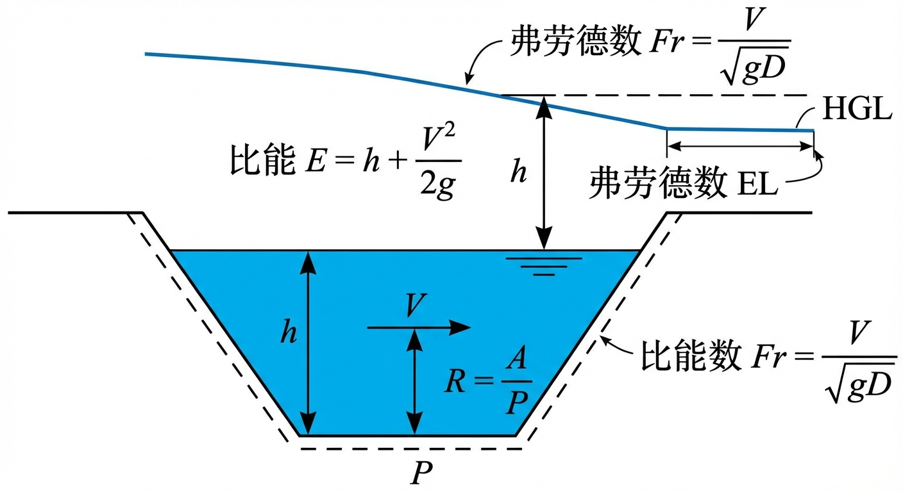
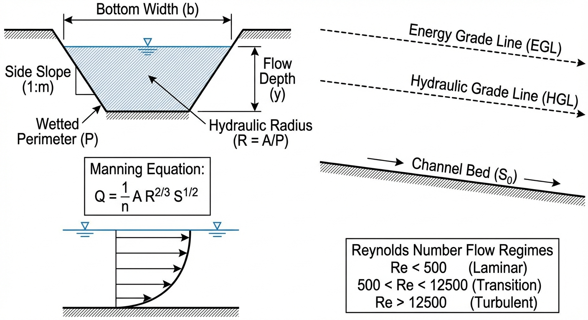

# 第 1 章 明渠水力学基础

## 1. 学习目标



本章是明渠水力学的理论起点，旨在建立从物理现象到数学描述的完整认知链条。完成本章学习后，读者应掌握以下内容：

1. 明渠流与管道流的本质区别：自由水面、重力驱动与波传播机制。
2. 圣维南方程组（Saint-Venant Equations）的完整推导过程——从控制体出发，分别建立质量守恒和动量守恒方程。
3. 弗劳德数（Froude Number）的严格定义及其在区分急流与缓流中的物理意义。
4. 曼宁公式（Manning's Equation）的工程应用及其在求解正常水深中的数值迭代方法。
5. 圣维南方程各项的物理含义及其在工程简化中的取舍依据。

---


## 2. 教材理论

### 2.1 明渠流的基本特征

明渠（open channel）是指具有自由水面的水流通道，包括天然河道、人工渠道、无压隧洞等。与封闭管道中的压力流相比，明渠流具有以下本质区别：

（1）**驱动力不同**。管道流由两端压差驱动，而明渠流由重力沿渠底方向的分量驱动，渠底坡度 $S_0$ 是水流运动的根本动力来源。

（2）**波速差异显著**。压力管道中水锤波以声速（约 1000 m/s）传播，而明渠中水面波的传播速度（波速）为 $c = \sqrt{gD}$，其中 $g$ 为重力加速度，$D$ 为水力水深。典型的明渠波速仅为 1--5 m/s，比管道水锤波慢两到三个数量级。

（3）**自由水面的存在**。明渠流的过水断面面积 $A$ 随水深变化，这使得流量与水深之间呈非线性关系，是明渠水力学分析复杂性的根本来源。

由于上述特征，明渠水流在工程控制中面临两大核心困难：

- **空间分布的传播滞后**：上游的闸门操作产生的水面波需要数小时甚至数天才能传至下游，形成显著的纯滞后（dead time）。
- **强非线性动态特性**：过水断面面积、湿周、水力半径均随水深非线性变化，导致系统在不同工况下的响应特征截然不同。

### 2.2 圣维南方程组的推导

1871 年，法国工程师巴雷德圣维南（Barre de Saint-Venant）首次提出了描述明渠一维非恒定流的偏微分方程组。以下从控制体（control volume）出发，分别推导质量守恒方程和动量守恒方程。

#### 2.2.1 基本假定

圣维南方程组建立在以下假定之上：

（a）水流为一维流动，即所有水力要素仅沿纵向 $x$ 变化，横向和垂向分布均匀。

（b）水面坡度较小，水深沿垂直于渠底方向度量，与沿铅直方向度量近似相等。

（c）压力分布符合静水压力规律（流线曲率较小）。

（d）渠底坡度较小，$\cos\theta \approx 1$，其中 $\theta$ 为渠底与水平面的夹角。

（e）摩擦阻力可用恒定均匀流的阻力公式（如曼宁公式）来估算。

#### 2.2.2 质量守恒方程（连续性方程）

取沿渠道纵向长度为 $\Delta x$ 的控制体。在 $\Delta t$ 时间内，根据质量守恒原理：

$$\text{控制体内水体质量的变化} = \text{流入质量} - \text{流出质量} + \text{旁侧入流质量}$$

控制体内水体体积为 $A \cdot \Delta x$，其中 $A$ 为过水断面面积。在 $\Delta t$ 时间内：

- 从上游断面流入的水体体积为 $Q(x,t) \cdot \Delta t$；
- 从下游断面流出的水体体积为 $Q(x+\Delta x, t) \cdot \Delta t$；
- 旁侧入流体积为 $q_l \cdot \Delta x \cdot \Delta t$，其中 $q_l$ 为单位渠长的旁侧入流量（$\mathrm{m^2/s}$）。

水的密度 $\rho$ 视为常数，质量守恒可简化为体积守恒：

$$\frac{\partial (A \cdot \Delta x)}{\partial t} = Q(x,t) - Q(x+\Delta x, t) + q_l \cdot \Delta x$$

将 $Q(x+\Delta x, t)$ 在 $x$ 处进行泰勒展开：$Q(x+\Delta x, t) \approx Q(x,t) + \frac{\partial Q}{\partial x}\Delta x$，代入并除以 $\Delta x$，得到：

$$\boxed{\frac{\partial A}{\partial t} + \frac{\partial Q}{\partial x} = q_l} \tag{1.1}$$

式中：$A$ 为过水断面面积（$\mathrm{m^2}$）；$Q$ 为流量（$\mathrm{m^3/s}$）；$q_l$ 为旁侧入流量（$\mathrm{m^2/s}$）。

当无旁侧入流时，$q_l = 0$，方程简化为 $\frac{\partial A}{\partial t} + \frac{\partial Q}{\partial x} = 0$。

#### 2.2.3 动量守恒方程

对同一控制体，根据牛顿第二定律，作用在控制体上的外力之和等于控制体内动量的时间变化率加上动量的净流出率。

**（a）作用在控制体上的外力**

沿水流方向的外力包括：

（i）**静水压力差**。上游断面和下游断面上的静水压力合力差。对于压力按静水压力分布的断面，压力合力为 $F_p = \rho g \bar{h} A$，其中 $\bar{h}$ 为断面形心到水面的距离。上下游断面的净压力为：

$$F_{p,\text{net}} = -\rho g \frac{\partial (\bar{h}A)}{\partial x}\Delta x$$

（ii）**重力沿渠底方向的分量**。控制体的重力在水流方向的分量为：

$$F_g = \rho g A \Delta x \sin\theta \approx \rho g A S_0 \Delta x$$

其中 $S_0 = \sin\theta \approx \tan\theta$ 为渠底坡度。

（iii）**渠底和边壁的摩擦阻力**。方向与水流方向相反：

$$F_f = -\rho g A S_f \Delta x$$

其中 $S_f$ 为摩擦坡度（energy slope），可由曼宁公式或谢才公式计算。

**（b）动量方程的建立**

控制体内动量的时间变化率为：

$$\frac{\partial}{\partial t}(\rho A V \Delta x)$$

动量的净流出率为：

$$\frac{\partial}{\partial x}(\rho Q V)\Delta x = \frac{\partial}{\partial x}\left(\rho \frac{Q^2}{A}\right)\Delta x$$

其中利用了 $V = Q/A$。

根据牛顿第二定律，将外力与动量变化率相等，除以 $\rho \Delta x$ 后，整理可得标准形式的动量方程：

$$\boxed{\frac{\partial Q}{\partial t} + \frac{\partial}{\partial x}\left(\frac{Q^2}{A}\right) + gA\frac{\partial h}{\partial x} - gA(S_0 - S_f) = 0} \tag{1.2}$$

式中各项的物理意义为：

| 项 | 表达式 | 物理意义 |
|---|---|---|
| 第一项 | $\frac{\partial Q}{\partial t}$ | 局部惯性项：流量随时间的变化率 |
| 第二项 | $\frac{\partial}{\partial x}\left(\frac{Q^2}{A}\right)$ | 对流惯性项：动量通量沿程变化 |
| 第三项 | $gA\frac{\partial h}{\partial x}$ | 压力梯度项：水面坡度引起的压力变化 |
| 第四项 | $-gA(S_0 - S_f)$ | 重力与摩擦的合效应 |

**关于 $h$ 的含义说明**：在式 (1.2) 中，$h$ 表示水面高程（water surface elevation），即 $h = z_b + y$，其中 $z_b$ 为渠底高程，$y$ 为水深。由于 $\frac{\partial z_b}{\partial x} = -S_0$，故 $\frac{\partial h}{\partial x} = -S_0 + \frac{\partial y}{\partial x}$。代入后，压力梯度项和重力项可合并为 $gA\frac{\partial y}{\partial x} - gAS_0$，加上摩擦项 $gAS_f$，即得到以水深 $y$ 为变量的等价形式。本书在推导和编程中统一采用水面高程 $h$ 的形式，以避免渠底高程变化带来的额外处理。

**备注**：式 (1.2) 也常写成除以 $gA$ 的无量纲形式：

$$\frac{1}{gA}\frac{\partial Q}{\partial t} + \frac{1}{gA}\frac{\partial}{\partial x}\left(\frac{Q^2}{A}\right) + \frac{\partial h}{\partial x} - (S_0 - S_f) = 0 \tag{1.2'}$$

两种形式在数学上完全等价，式 (1.2) 更便于数值离散，式 (1.2') 更便于量纲分析。

式 (1.1) 和式 (1.2) 合称**圣维南方程组**，构成了一个双曲型非线性偏微分方程组，包含两个未知函数 $A(x,t)$（或等价地 $y(x,t)$）和 $Q(x,t)$。该方程组没有一般性的解析解，工程中必须采用数值方法（如有限差分法 Preissmann 格式、有限体积法 Godunov 格式等）进行求解。

### 2.3 弗劳德数与流态分类

弗劳德数（Froude Number）是明渠水力学中最重要的无量纲准则数，定义为水流惯性力与重力之比的平方根：

$$Fr = \frac{V}{\sqrt{gD}} \tag{1.3}$$

其中：$V$ 为断面平均流速（$\mathrm{m/s}$）；$g$ 为重力加速度（$\mathrm{m/s^2}$）；$D = A/T$ 为水力水深（hydraulic depth），$A$ 为过水断面面积，$T$ 为水面宽度。

对于矩形断面，$D = y$（水深），故 $Fr = V/\sqrt{gy}$。对于非矩形断面，必须采用水力水深 $D = A/T$。

根据弗劳德数的大小，明渠水流分为三种流态：

| 流态 | 条件 | 特征 |
|---|---|---|
| 缓流（Subcritical Flow） | $Fr < 1$ | 水面波可向上游和下游传播；受下游边界条件控制 |
| 临界流（Critical Flow） | $Fr = 1$ | 水面波恰好静止不动；比能取最小值 |
| 急流（Supercritical Flow） | $Fr > 1$ | 水面波只能向下游传播；受上游边界条件控制 |

弗劳德数的物理本质是水流流速 $V$ 与微幅重力波波速 $c = \sqrt{gD}$ 的比值。当 $Fr < 1$ 时，水流速度小于波速，下游的扰动可以通过水面波向上游传播，因此水流状态受下游边界（如下游水位）控制。当 $Fr > 1$ 时，水流速度大于波速，下游的扰动无法向上游传播，水流状态仅受上游条件控制。这一性质对于明渠控制策略的选择具有决定性意义。

### 2.4 曼宁公式

曼宁公式（Manning's Equation）是描述明渠均匀流的最常用经验公式：

$$Q = \frac{1}{n} A R^{2/3} S_0^{1/2} \tag{1.4}$$

式中：$n$ 为曼宁糙率系数（$\mathrm{s/m^{1/3}}$）；$A$ 为过水断面面积（$\mathrm{m^2}$）；$R = A/P$ 为水力半径（$\mathrm{m}$），$P$ 为湿周（wetted perimeter）；$S_0$ 为渠底坡度（当为均匀流时，$S_0 = S_f$）。

对于梯形断面（底宽 $b$，边坡系数 $m$），其几何参数为：

$$A = (b + my)y, \quad P = b + 2y\sqrt{1+m^2}, \quad T = b + 2my \tag{1.5}$$

由于 $A$、$P$ 均为水深 $y$ 的非线性函数，已知流量 $Q$ 反求正常水深 $y_n$ 时，无法通过简单的代数运算直接求解，必须借助数值迭代方法。

### 2.5 摩擦坡度的计算

在非均匀流计算中，摩擦坡度 $S_f$ 可由曼宁公式反算：

$$S_f = \frac{n^2 Q^2}{A^2 R^{4/3}} \tag{1.6}$$

此式将摩擦坡度表达为流量和断面几何参数的函数，是圣维南方程组数值求解中封闭摩擦项的关键关系。

---

## 3. 典型例题

### 例题 1.1 梯形断面正常水深的手算求解

**题目**：某梯形混凝土衬砌灌溉干渠，底宽 $b = 5.0\;\mathrm{m}$，边坡系数 $m = 1.5$，渠底坡度 $S_0 = 0.0005$，曼宁糙率 $n = 0.015$。设计输水流量 $Q = 50\;\mathrm{m^3/s}$。试求正常水深 $y_n$ 及对应的弗劳德数 $Fr$。

**解题过程**：

由曼宁公式 $Q = \frac{1}{n}AR^{2/3}S_0^{1/2}$，需要找到满足方程的水深 $y$。

定义目标函数：

$$f(y) = \frac{1}{n}A(y)\left[\frac{A(y)}{P(y)}\right]^{2/3}S_0^{1/2} - Q = 0$$

采用试算法，逐步逼近。

**第 1 次试算**：取 $y = 2.5\;\mathrm{m}$

$$A = (5.0 + 1.5 \times 2.5) \times 2.5 = 8.75 \times 2.5 = 21.875\;\mathrm{m^2}$$
$$P = 5.0 + 2 \times 2.5 \times \sqrt{1+1.5^2} = 5.0 + 5.0 \times 1.803 = 14.014\;\mathrm{m}$$
$$R = 21.875 / 14.014 = 1.561\;\mathrm{m}$$
$$Q_{calc} = \frac{1}{0.015} \times 21.875 \times 1.561^{2/3} \times 0.0005^{1/2}$$

计算 $R^{2/3} = 1.561^{2/3} = 1.345$，$S_0^{1/2} = 0.02236$：

$$Q_{calc} = 66.667 \times 21.875 \times 1.345 \times 0.02236 = 43.84\;\mathrm{m^3/s}$$

$Q_{calc} < Q_{target} = 50$，水深偏小，需增大。

**第 2 次试算**：取 $y = 2.7\;\mathrm{m}$

$$A = (5.0 + 1.5 \times 2.7) \times 2.7 = 9.05 \times 2.7 = 24.435\;\mathrm{m^2}$$
$$P = 5.0 + 2 \times 2.7 \times 1.803 = 14.736\;\mathrm{m}$$
$$R = 24.435 / 14.736 = 1.658\;\mathrm{m}$$
$$R^{2/3} = 1.658^{2/3} = 1.405$$
$$Q_{calc} = 66.667 \times 24.435 \times 1.405 \times 0.02236 = 51.18\;\mathrm{m^3/s}$$

$Q_{calc}$ 略大于 50，说明正常水深在 2.5--2.7 m 之间，接近 2.67 m。

经过进一步精确迭代，得到 $y_n \approx 2.672\;\mathrm{m}$。

此时：

$$A = (5.0 + 1.5 \times 2.672) \times 2.672 = 24.079\;\mathrm{m^2}$$
$$V = Q/A = 50/24.079 = 2.077\;\mathrm{m/s}$$
$$T = b + 2my = 5.0 + 2 \times 1.5 \times 2.672 = 13.016\;\mathrm{m}$$
$$D = A/T = 24.079/13.016 = 1.850\;\mathrm{m}$$
$$Fr = \frac{V}{\sqrt{gD}} = \frac{2.077}{\sqrt{9.81 \times 1.850}} = \frac{2.077}{4.261} = 0.488$$

**结果**：正常水深 $y_n \approx 2.67\;\mathrm{m}$，弗劳德数 $Fr \approx 0.49 < 1$，水流为缓流。

### 例题 1.2 弗劳德数的流态判别

**题目**：某矩形渠道底宽 $b = 3.0\;\mathrm{m}$，流量 $Q = 12\;\mathrm{m^3/s}$，水深 $y = 0.8\;\mathrm{m}$。判断水流的流态。

**解**：

$$V = \frac{Q}{by} = \frac{12}{3.0 \times 0.8} = 5.0\;\mathrm{m/s}$$

矩形断面水力水深 $D = y = 0.8\;\mathrm{m}$：

$$Fr = \frac{V}{\sqrt{gD}} = \frac{5.0}{\sqrt{9.81 \times 0.8}} = \frac{5.0}{2.801} = 1.785$$

$Fr = 1.785 > 1$，故水流为急流（超临界流）。下游扰动无法向上游传播。

---

## 4. 工程案例：梯形渠道正常水深的数值求解与弗劳德数校验

### 4.1 案例背景

在大型农业灌溉干渠或长距离调水工程的设计阶段，工程师需要精确确定设计流量下的正常水深，以据此确定渠道断面尺寸和堤顶高程。由于曼宁公式中水深与流量之间的高度非线性关系，工程实践中通常采用牛顿-拉夫逊（Newton-Raphson）迭代法进行数值求解。

### 4.2 问题描述

设计参数与例题 1.1 相同：梯形渠道底宽 $b = 5.0\;\mathrm{m}$，边坡系数 $m = 1.5$，底坡 $S_0 = 0.0005$，糙率 $n = 0.015$，目标流量 $Q = 50\;\mathrm{m^3/s}$。


**核心难点**：曼宁公式是水深 $y$ 的高度非线性函数，无法显式求解。初值选择不当可能导致迭代发散，产生负水深或溢出错误。

### 4.3 求解方法

采用带物理约束保护的牛顿-拉夫逊迭代法：

1. **构建目标函数**：$f(y) = Q_{\text{Manning}}(y) - Q_{\text{target}} = 0$。
2. **数值导数**：以微小增量 $\delta y = 0.001\;\mathrm{m}$ 计算数值导数 $f'(y) \approx [f(y+\delta y) - f(y)] / \delta y$。
3. **迭代更新**：$y_{k+1} = y_k - f(y_k)/f'(y_k)$。
4. **物理约束保护**：强制 $y \geq 0.01\;\mathrm{m}$，防止负水深引发计算崩溃。
5. **收敛判据**：$|f(y)| < 10^{-5}\;\mathrm{m^3/s}$。

### 4.4 代码实现

```python
import numpy as np

# 梯形渠道参数
Q_target = 50.0   # 目标流量 m^3/s
b = 5.0            # 底宽 m
m = 1.5            # 边坡系数
S0 = 0.0005        # 底坡
n = 0.015          # 曼宁糙率
g = 9.81           # 重力加速度

def manning_equation(h):
    """计算给定水深下的曼宁流量"""
    A = (b + m * h) * h
    P = b + 2 * h * np.sqrt(1 + m**2)
    R = A / P
    return (1.0 / n) * A * (R**(2/3)) * np.sqrt(S0)

def solve_normal_depth(Q, h_guess=1.0, tol=1e-5, max_iter=100):
    """牛顿-拉夫逊迭代求解正常水深"""
    h = h_guess
    for i in range(max_iter):
        Q_calc = manning_equation(h)
        error = Q_calc - Q
        if abs(error) < tol:
            return h, i
        # 数值导数
        dh = 0.001
        dQ_dh = (manning_equation(h + dh) - Q_calc) / dh
        h_new = h - error / dQ_dh
        # 物理约束保护：防止迭代进入负水深区域
        h = max(h_new, 0.01)
    return h, max_iter

# 执行求解
h_normal, iterations = solve_normal_depth(Q_target)

# 计算弗劳德数
A_normal = (b + m * h_normal) * h_normal
v_normal = Q_target / A_normal
T_normal = b + 2 * m * h_normal          # 水面宽度
D_normal = A_normal / T_normal            # 水力水深
Fr = v_normal / np.sqrt(g * D_normal)

print(f"正常水深: {h_normal:.4f} m")
print(f"断面面积: {A_normal:.3f} m^2")
print(f"平均流速: {v_normal:.3f} m/s")
print(f"水力水深: {D_normal:.3f} m")
print(f"弗劳德数: {Fr:.4f}")
print(f"迭代次数: {iterations}")
print(f"流态: {'缓流' if Fr < 1 else '急流'}")
```

Source: `assets/ch01/ch01_normal_depth.py`

### 4.5 迭代过程追踪

Newton-Raphson 迭代追踪矩阵（数据来源：assets/ch01/iteration_table.md）：

| Iteration | Depth (m) | Calculated Q ($\mathrm{m^3/s}$) | Error | Froude No. |
|---:|---:|---:|---:|---:|
| 0 | 1.000 | 8.036 | -41.964 | 2.725 |
| 1 | 3.946 | 109.963 | 59.963 | 0.232 |
| 2 | 2.910 | 59.190 | 9.190 | 0.416 |
| 3 | 2.683 | 50.401 | 0.401 | 0.484 |
| 4 | 2.672 | 50.001 | 0.001 | 0.488 |
| 5 | 2.672 | 50.000 | 0.000 | 0.488 |


### 4.6 结果分析

算法从初始猜测 $y_0 = 1.0\;\mathrm{m}$ 出发，仅经 5 次迭代即收敛至精度 $10^{-7}$ 以内。计算结果表明：

- **正常水深** $y_n \approx 2.672\;\mathrm{m}$，满足 $50\;\mathrm{m^3/s}$ 设计流量要求。
- **断面平均流速** $V \approx 2.08\;\mathrm{m/s}$。
- **弗劳德数** $Fr \approx 0.488 < 1$，水流处于缓流状态。

缓流状态意味着下游水位变化可以通过水面波向上游传播，在控制系统设计中应采用下游水位反馈来调节上游闸门（下游控制策略）。

注意第 0 次迭代时弗劳德数为 2.725（急流），随着迭代推进水深增大后迅速转入缓流区间。第 1 次迭代出现了"过冲"现象（$y = 3.946\;\mathrm{m}$，$Q = 109.963\;\mathrm{m^3/s}$），这是牛顿法在强非线性函数上的典型行为，但后续迭代迅速收敛。

---

## 5. 工业部署建议

### 5.1 求解器的鲁棒性设计

在将牛顿-拉夫逊法嵌入大型水力学仿真软件（如 SWMM、MIKE 11）时，应注意以下工程实践：

（1）**混合求解策略**：当牛顿法在两点间振荡不收敛时，自动降级切换为二分法（Bisection Method），以绝对收敛为代价换取计算稳定性。

（2）**初值估计**：可利用流量的 5/3 次方关系进行初始水深估计，提高收敛速度。

（3）**奇异性处理**：当水深趋近零时，水力半径趋近零导致曼宁公式分母为零，需设置合理的下限保护。

### 5.2 糙率参数的在线校准

实际渠道的糙率系数 $n$ 并非常数，它随时间变化——水草生长、泥沙淤积、衬砌老化均会改变渠道的阻力特性。若控制系统一直使用设计期的固定糙率参数，前馈控制的精度将逐步下降。现代数字孪生系统应结合实时监测数据，采用卡尔曼滤波或参数辨识技术，实现糙率的在线动态校准。

### 5.3 圣维南方程的工程简化

在实际工程中，并非总需要求解完整的圣维南方程组。根据问题的时间尺度和精度要求，可进行不同程度的简化：

| 简化水平 | 保留项 | 适用场景 |
|---|---|---|
| 完整圣维南方程 | 全部四项 | 快速瞬变流（闸门突然启闭） |
| 扩散波方程 | 去掉惯性项 | 缓变洪水波演进 |
| 运动波方程 | 仅保留重力和摩擦项 | 陡坡山区河道洪水 |
| 稳态方程 | 所有时间导数为零 | 均匀流设计计算 |

---

## 6. 本章小结

本章建立了明渠水力学的理论基础，主要内容包括：

（1）明渠流与管道流的本质区别在于自由水面的存在，导致重力驱动、波速低、断面非线性等特征。

（2）圣维南方程组由质量守恒方程 (1.1) 和动量守恒方程 (1.2) 组成，是描述明渠一维非恒定流的基本控制方程。其中动量方程包含局部惯性项、对流惯性项、压力梯度项和重力-摩擦项。

（3）弗劳德数 $Fr = V/\sqrt{gD}$（其中 $D = A/T$ 为水力水深）是区分缓流（$Fr < 1$）和急流（$Fr > 1$）的判据，决定了水面波的传播方向和控制策略的选择。

（4）曼宁公式是均匀流计算的基本工具，由于其非线性特性，求解正常水深需采用数值迭代方法。牛顿-拉夫逊法具有二阶收敛速度，但需配合物理约束保护以确保鲁棒性。

## 思考题

1. **概念辨析**：明渠流与管道流的本质区别是什么？试从驱动力、自由水面、波速和断面特征四个方面进行对比，并说明这些区别对控制策略选择的影响。

2. **定量计算**：一梯形渠道，底宽 $b = 3.0\,\mathrm{m}$，边坡系数 $m = 1.5$，底坡 $S_0 = 0.0004$，曼宁糙率系数 $n = 0.015$，设计流量 $Q = 8.0\,\mathrm{m^3/s}$。试用牛顿-拉夫逊法求解正常水深 $y_n$（精度要求 $10^{-4}\,\mathrm{m}$），并写出迭代公式。

3. **物理意义**：弗劳德数 $Fr = V/\sqrt{gD}$ 的物理意义是什么？为什么 $Fr = 1$ 是区分缓流和急流的临界判据？试从水面波传播方向的角度给出解释。

4. **综合分析**：曼宁公式 $Q = \frac{1}{n} A R^{2/3} S_0^{1/2}$ 是非线性方程。试分析：(a) 为什么不能直接解析求解正常水深？(b) 牛顿-拉夫逊法的二阶收敛速度在工程中有何实际意义？(c) 为什么需要配合物理约束保护？

---

## 7. 参考文献

[1] Saint-Venant, B. de. Theorie du mouvement non permanent des eaux, avec application aux crues des rivieres et a l'introduction des marees dans leur lit [J]. Comptes Rendus de l'Academie des Sciences, 1871, 73: 147-154, 237-240.

[2] Chow, V.T. Open-Channel Hydraulics [M]. New York: McGraw-Hill, 1959.

[3] Henderson, F.M. Open Channel Flow [M]. New York: Macmillan, 1966.

[4] Chaudhry, M.H. Open-Channel Flow [M]. 2nd ed. New York: Springer, 2008.

[5] 吴持恭. 水力学(第四版) [M]. 北京: 高等教育出版社, 2008.

[6] Cunge, J.A., Holly, F.M., Verwey, A. Practical Aspects of Computational River Hydraulics [M]. London: Pitman, 1980.

[7] Sturm, T.W. Open Channel Hydraulics [M]. New York: McGraw-Hill, 2001.

[8] Manning, R. On the flow of water in open channels and pipes [J]. Transactions of the Institution of Civil Engineers of Ireland, 1891, 20: 161-207.

[9] 雷晓辉, 龙岩, 许慧敏, 等. 水系统控制论：提出背景、技术框架与研究范式 [J]. 南水北调与水利科技(中英文), 2025, 23(04): 761-769+904. DOI: 10.13476/j.cnki.nsbdqk.2025.0077.

[10] PREISSMANN A. Propagation des intumescences dans les canaux et rivières[C]//1er Congrès de l'Association Française de Calcul. Grenoble, France, 1961: 433-442.

[11] ABBOTT M B, IONESCU F. On the numerical computation of nearly horizontal flows[J]. Journal of Hydraulic Research, 1967, 5(2): 97-117. DOI: 10.1080/00221686709500195.

[12] 赵振兴, 何建京, 王忖. 水力学[M]. 3版. 北京: 清华大学出版社, 2021.
