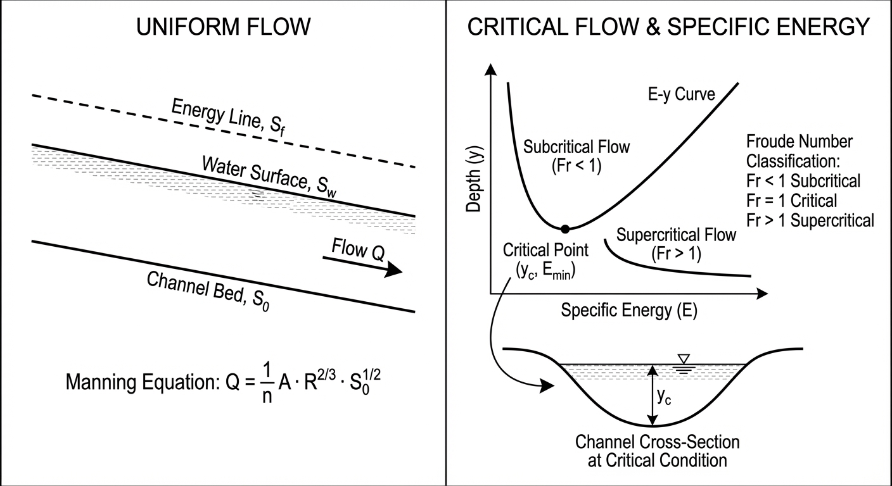

# 第 2 章 均匀流与临界流

## 1. 学习目标



本章将明渠水流从复杂的非恒定状态简化为恒定状态，系统剖析均匀流、临界流和水跃的基本理论。完成本章学习后，读者应掌握以下内容：

1. 均匀流（Uniform Flow）的物理本质与成立条件，以及曼宁公式从谢才公式出发的推导过程。
2. 糙率系数 $n$ 的取值依据与典型工程材料的糙率范围。
3. 断面比能（Specific Energy）的定义及其与水深的三次函数关系。
4. 临界流（Critical Flow）作为比能最小值点的能量极值原理，以及临界水深和临界坡度的计算。
5. 交替水深（Alternate Depths）与共轭水深（Conjugate Depths）的本质区别——前者基于能量方程，后者基于动量方程。
6. 水跃（Hydraulic Jump）的形成条件、共轭水深公式及能量损失计算。
7. 复合断面均匀流的处理方法。

---


## 2. 教材理论

### 2.1 均匀流的物理本质

在长直棱柱形渠道中，当水流的水深、流速和断面面积沿程不变时，称为**均匀流**（Uniform Flow）。此时，驱动水流的重力沿程分量与渠底及边壁的摩擦阻力完全平衡：

$$\rho g A \Delta x \cdot S_0 = \rho g A \Delta x \cdot S_f$$

即均匀流条件为：

$$S_0 = S_f \tag{2.1}$$

均匀流对应的水深称为**正常水深**（Normal Depth, $y_n$），对应的流速称为正常流速。均匀流的成立需要以下条件：（a）渠道为长直棱柱形（断面形状和尺寸沿程不变）；（b）渠底坡度恒定；（c）水流为恒定流（流量不随时间变化）；（d）渠道足够长，使水流充分发展。

实际工程中严格的均匀流几乎不存在，但它为工程设计提供了最基本的参考状态——渠道断面尺寸的确定、糙率选择和安全超高的计算均以均匀流水深为基准。在长距离输水渠道中，只要渠道足够长且断面形状一致，距离入口或出口较远的中间段水流通常可近似为均匀流。

### 2.2 从谢才公式到曼宁公式

均匀流的流速公式最早由法国工程师谢才（Chezy）于 1769 年提出：

$$V = C \sqrt{R S_f} \tag{2.2}$$

式中：$V$ 为断面平均流速（$\mathrm{m/s}$）；$C$ 为谢才系数（$\mathrm{m^{1/2}/s}$）；$R = A/P$ 为水力半径（$\mathrm{m}$）；$S_f$ 为摩擦坡度。

谢才系数 $C$ 并非真正的常数，而是与渠道糙率和水力半径有关。1890 年，爱尔兰工程师曼宁（Manning）提出了谢才系数的经验表达式：

$$C = \frac{1}{n} R^{1/6} \tag{2.3}$$

式中 $n$ 为曼宁糙率系数（$\mathrm{s/m^{1/3}}$）。将式 (2.3) 代入式 (2.2)：

$$V = \frac{1}{n} R^{1/6} \cdot \sqrt{R S_f} = \frac{1}{n} R^{1/6} \cdot R^{1/2} \cdot S_f^{1/2} = \frac{1}{n} R^{2/3} S_f^{1/2}$$

乘以断面面积 $A$ 即得曼宁流量公式：

$$\boxed{Q = \frac{1}{n} A R^{2/3} S_f^{1/2}} \tag{2.4}$$

在均匀流条件下，$S_f = S_0$，故：

$$Q = \frac{1}{n} A R^{2/3} S_0^{1/2} \tag{2.5}$$

### 2.3 糙率系数 $n$ 的选取

糙率系数 $n$ 是曼宁公式中唯一需要凭经验确定的参数，其取值直接影响设计水深和渠道尺寸。下表列出了常见渠道材料的糙率范围：

| 渠道类型 | $n$ 最小值 | $n$ 典型值 | $n$ 最大值 |
|---|---|---|---|
| 光滑混凝土衬砌 | 0.011 | 0.013 | 0.015 |
| 粗糙混凝土（成型后未抹光） | 0.013 | 0.015 | 0.018 |
| 浆砌石衬砌 | 0.017 | 0.025 | 0.030 |
| 整齐开挖土渠（维护良好） | 0.020 | 0.025 | 0.030 |
| 开挖土渠（杂草中等） | 0.025 | 0.030 | 0.035 |
| 天然河道（清洁、顺直） | 0.025 | 0.030 | 0.040 |
| 天然河道（有杂草和碎石） | 0.030 | 0.040 | 0.050 |
| 漫滩区（草地、灌木） | 0.035 | 0.060 | 0.150 |

数据来源：Chow (1959) 表 5-6，吴持恭 (2008) 附录。

糙率系数的选取应注意：（a）衬砌渠道的 $n$ 值随龄期增加而增大；（b）天然河道的 $n$ 值随季节变化，夏季水草茂盛时可增大 20%--50%；（c）复杂河道可采用 Cowan 方法分项估计。

### 2.4 复合断面均匀流

当渠道断面由多种不同糙率的子断面组成（如主槽与漫滩），不能简单地对整个断面使用单一的 $n$ 值。常用处理方法有：

**方法一：分区计算法**。将断面分为 $N$ 个子区域，各区域分别计算流量后求和：

$$Q = \sum_{i=1}^{N} Q_i = \sum_{i=1}^{N} \frac{1}{n_i} A_i R_i^{2/3} S_0^{1/2} \tag{2.6}$$

**方法二：等价糙率法**。基于湿周加权计算整个断面的等价糙率：

$$n_e = \left[\frac{\sum_{i=1}^{N} P_i n_i^{3/2}}{P}\right]^{2/3} \tag{2.7}$$

其中 $P = \sum P_i$ 为总湿周。该式由 Horton (1933) 和 Einstein (1934) 分别独立推导。

### 2.5 断面比能与临界流

#### 2.5.1 断面比能的定义

以渠底为基准面，单位重量水体所具有的能量称为**断面比能**（Specific Energy）：

$$E = y + \frac{\alpha V^2}{2g} = y + \frac{\alpha Q^2}{2gA^2} \tag{2.8}$$

式中：$y$ 为水深；$\alpha$ 为动能修正系数（均匀流取 $\alpha = 1$）；$V = Q/A$ 为断面平均流速。

对于矩形断面（$A = by$，单宽流量 $q = Q/b$），比能方程简化为：

$$E = y + \frac{q^2}{2gy^2} \tag{2.9}$$

#### 2.5.2 比能曲线与临界水深

由式 (2.9) 可知，给定流量 $q$，比能 $E$ 与水深 $y$ 的关系呈三次函数。分析其极值特征：

- 当 $y \to \infty$ 时，$V \to 0$，$E \approx y$，比能曲线趋近于 $45°$ 线。
- 当 $y \to 0$ 时，$V \to \infty$，$E \to \infty$。
- 两支之间必存在一个最小值点。

对 $E$ 关于 $y$ 求导并令其为零：

$$\frac{dE}{dy} = 1 - \frac{q^2}{gy^3} = 0$$

解得**临界水深**：

$$\boxed{y_c = \left(\frac{q^2}{g}\right)^{1/3}} \tag{2.10}$$

对应的**最小比能**为：

$$E_{\min} = y_c + \frac{q^2}{2gy_c^2} = y_c + \frac{y_c}{2} = \frac{3}{2}y_c \tag{2.11}$$

在临界点处，弗劳德数恰好等于 1：

$$Fr_c = \frac{V_c}{\sqrt{gy_c}} = \frac{q/y_c}{\sqrt{gy_c}} = \frac{q}{\sqrt{gy_c^3}} = 1$$

对于一般形状断面，临界流条件由 $\frac{dE}{dy} = 0$ 推导为：

$$\frac{Q^2 T}{gA^3} = 1 \tag{2.12}$$

其中 $T = dA/dy$ 为水面宽度。此式等价于 $Fr^2 = V^2/(gA/T) = V^2/(gD) = 1$。

#### 2.5.3 交替水深

当 $E > E_{\min}$ 时，同一比能 $E$ 和同一流量 $q$ 对应两个不同的水深解，称为**交替水深**（Alternate Depths）：

- 上支（$y > y_c$）：缓流，水深大、流速小，$Fr < 1$。
- 下支（$y < y_c$）：急流，水深小、流速大，$Fr > 1$。

交替水深的物理意义在于：它们是在相同能量条件下，水流可以采用的两种稳定状态。当水流遇到局部收缩、渠底抬升等干扰时，水深会在交替水深之间调整。

**特别强调**：交替水深是从比能方程（能量守恒）导出的概念，与下文将讨论的"共轭水深"本质不同。

### 2.6 水跃与共轭水深

#### 2.6.1 水跃现象

当急流在下游遇到缓流边界条件时（如闸门下游的尾水位较高），水流无法通过平缓的过渡来适应，而是发生一次剧烈的水面跃升，称为**水跃**（Hydraulic Jump）。水跃的本质是急流向缓流的强制转换过程，伴随着强烈的紊动和显著的能量损失。

#### 2.6.2 共轭水深公式的推导

水跃前后的水深称为**共轭水深**（Conjugate Depths）。由于水跃区域内摩擦力较小且水跃长度较短，可忽略渠底摩擦和重力沿程分量，采用**动量方程**建立水跃前后的关系。

对矩形断面水平渠底，取水跃前断面 1（水深 $y_1$，流速 $V_1$）和水跃后断面 2（水深 $y_2$，流速 $V_2$），由动量守恒：

$$\frac{1}{2}\rho g b y_1^2 + \rho Q V_1 = \frac{1}{2}\rho g b y_2^2 + \rho Q V_2$$

利用连续方程 $Q = b y_1 V_1 = b y_2 V_2$ 以及单宽流量 $q = Q/b$，化简为：

$$\frac{1}{2}g y_1^2 + \frac{q^2}{y_1} = \frac{1}{2}g y_2^2 + \frac{q^2}{y_2}$$

整理得：

$$\frac{q^2}{g}\left(\frac{1}{y_1} - \frac{1}{y_2}\right) = \frac{1}{2}(y_2^2 - y_1^2)$$

$$\frac{q^2}{g} \cdot \frac{y_2 - y_1}{y_1 y_2} = \frac{1}{2}(y_2 + y_1)(y_2 - y_1)$$

当 $y_2 \neq y_1$ 时，两边同除以 $(y_2 - y_1)$：

$$\frac{q^2}{g y_1 y_2} = \frac{1}{2}(y_1 + y_2)$$

$$\frac{2q^2}{g} = y_1 y_2 (y_1 + y_2) \tag{2.13}$$

利用 $Fr_1^2 = q^2/(gy_1^3)$，即 $q^2 = Fr_1^2 \cdot g y_1^3$，代入式 (2.13)，整理为关于 $y_2/y_1$ 的一元二次方程，解得：

$$\boxed{\frac{y_2}{y_1} = \frac{1}{2}\left(\sqrt{1 + 8Fr_1^2} - 1\right)} \tag{2.14}$$

式 (2.14) 即为矩形断面水跃共轭水深公式，又称 Belanger 方程。

**共轭水深与交替水深的区别**（本章最重要的概念辨析之一）：

| 比较项 | 交替水深（Alternate Depths） | 共轭水深（Conjugate Depths） |
|---|---|---|
| 理论依据 | 能量方程（比能守恒） | 动量方程（动量守恒） |
| 适用场景 | 比能曲线上同一 $E$ 的两个水深 | 水跃前后的两个水深 |
| 能量关系 | 两个水深对应**相同**的比能 | 水跃后比能**小于**水跃前 |
| 动量关系 | 两个水深的动量函数**不相等** | 两个水深的动量函数**相等** |
| 计算公式 | 由比能方程 $E = y + q^2/(2gy^2)$ 求解 | 由式 (2.14) $y_2/y_1 = \frac{1}{2}(\sqrt{1+8Fr_1^2}-1)$ 求解 |

#### 2.6.3 水跃的能量损失

水跃中的能量损失为水跃前后比能之差：

$$\Delta E = E_1 - E_2 = \left(y_1 + \frac{q^2}{2gy_1^2}\right) - \left(y_2 + \frac{q^2}{2gy_2^2}\right)$$

经过代数化简（利用式 (2.13)），可得：

$$\boxed{\Delta E = \frac{(y_2 - y_1)^3}{4 y_1 y_2}} \tag{2.15}$$

该公式表明，水深差 $(y_2 - y_1)$ 越大，能量损失越大。由于分子为三次方，即使水深差不大，能量损失也可能相当可观。工程中正是利用水跃来消除多余能量，保护下游渠道免受高速水流的冲刷破坏。

### 2.7 临界坡度

对于给定的流量、断面形状和糙率，使正常水深 $y_n$ 恰好等于临界水深 $y_c$ 的渠底坡度称为**临界坡度** $S_c$。当 $S_0 < S_c$ 时，$y_n > y_c$，正常水深在缓流区，称为**缓坡**；当 $S_0 > S_c$ 时，$y_n < y_c$，正常水深在急流区，称为**陡坡**。渠底坡度的分类是后续水面曲线分析的基础。

---

## 3. 典型例题

### 例题 2.1 矩形渠道的临界水深与交替水深

**题目**：某矩形渠道底宽 $b = 6.0\;\mathrm{m}$，输水流量 $Q = 30.0\;\mathrm{m^3/s}$。
（1）求临界水深 $y_c$ 和最小比能 $E_{\min}$；
（2）若断面比能 $E = E_{\min} + 1.0\;\mathrm{m}$，求两个交替水深。

**解**：

（1）单宽流量 $q = Q/b = 30.0/6.0 = 5.0\;\mathrm{m^2/s}$。

由式 (2.10)：

$$y_c = \left(\frac{q^2}{g}\right)^{1/3} = \left(\frac{25}{9.81}\right)^{1/3} = (2.549)^{1/3} = 1.366\;\mathrm{m}$$

$$E_{\min} = \frac{3}{2} y_c = 1.5 \times 1.366 = 2.049\;\mathrm{m}$$

验证弗劳德数：$V_c = q/y_c = 5.0/1.366 = 3.661\;\mathrm{m/s}$，$Fr_c = V_c/\sqrt{gy_c} = 3.661/\sqrt{9.81 \times 1.366} = 3.661/3.661 = 1.00$。正确。

（2）令 $E = 2.049 + 1.0 = 3.049\;\mathrm{m}$。需解方程：

$$y + \frac{q^2}{2gy^2} = 3.049, \quad \text{即} \quad y + \frac{25}{2 \times 9.81 \times y^2} = 3.049$$

$$y + \frac{1.274}{y^2} = 3.049$$

**试算急流交替水深**（取 $y < y_c$）：

试 $y = 0.75\;\mathrm{m}$：$0.75 + 1.274/0.5625 = 0.75 + 2.265 = 3.015$，偏小。

试 $y = 0.74\;\mathrm{m}$：$0.74 + 1.274/0.5476 = 0.74 + 2.327 = 3.067$，偏大。

插值得 $y_1 \approx 0.743\;\mathrm{m}$。

**试算缓流交替水深**（取 $y > y_c$）：

试 $y = 2.9\;\mathrm{m}$：$2.9 + 1.274/8.41 = 2.9 + 0.152 = 3.052$，偏大。

试 $y = 2.89\;\mathrm{m}$：$2.89 + 1.274/8.352 = 2.89 + 0.153 = 3.043$，接近。

精确值 $y_2 \approx 2.897\;\mathrm{m}$。

**结果**：急流交替水深 $y_1 \approx 0.743\;\mathrm{m}$（$Fr = 2.49$），缓流交替水深 $y_2 \approx 2.897\;\mathrm{m}$（$Fr = 0.324$）。

### 例题 2.2 矩形断面水跃共轭水深

**题目**：某矩形渠道中急流水深 $y_1 = 0.5\;\mathrm{m}$，流速 $V_1 = 8.0\;\mathrm{m/s}$。求水跃后的共轭水深 $y_2$ 及水跃能量损失。

**解**：

$$Fr_1 = \frac{V_1}{\sqrt{gy_1}} = \frac{8.0}{\sqrt{9.81 \times 0.5}} = \frac{8.0}{2.215} = 3.613$$

由式 (2.14)：

$$\frac{y_2}{y_1} = \frac{1}{2}(\sqrt{1 + 8 \times 3.613^2} - 1) = \frac{1}{2}(\sqrt{1 + 104.4} - 1) = \frac{1}{2}(\sqrt{105.4} - 1)$$

$$= \frac{1}{2}(10.266 - 1) = 4.633$$

$$y_2 = 4.633 \times 0.5 = 2.317\;\mathrm{m}$$

单宽流量 $q = V_1 y_1 = 8.0 \times 0.5 = 4.0\;\mathrm{m^2/s}$。

能量损失由式 (2.15)：

$$\Delta E = \frac{(y_2 - y_1)^3}{4y_1 y_2} = \frac{(2.317 - 0.5)^3}{4 \times 0.5 \times 2.317} = \frac{(1.817)^3}{4.634} = \frac{6.001}{4.634} = 1.295\;\mathrm{m}$$

水跃前比能 $E_1 = 0.5 + 4.0^2/(2 \times 9.81 \times 0.25) = 0.5 + 3.262 = 3.762\;\mathrm{m}$。

能量损失率 $\Delta E / E_1 = 1.295/3.762 = 34.4\%$。水跃消耗了超过三分之一的水流能量。

### 例题 2.3 梯形断面正常水深与临界水深

**题目**：某梯形渠道底宽 $b = 4.0\;\mathrm{m}$，边坡系数 $m = 2.0$，糙率 $n = 0.020$，底坡 $S_0 = 0.001$，流量 $Q = 20\;\mathrm{m^3/s}$。求正常水深 $y_n$ 和临界水深 $y_c$，判断渠道是缓坡还是陡坡。

**解正常水深**：利用曼宁公式试算。

试 $y = 1.5\;\mathrm{m}$：$A = (4+2\times1.5)\times1.5 = 10.5$，$P = 4+2\times1.5\sqrt{5} = 10.708$，$R = 0.981$，$Q = (1/0.020)\times10.5\times0.981^{2/3}\times0.001^{1/2} = 50\times10.5\times0.987\times0.0316 = 16.37$。偏小。

试 $y = 1.7\;\mathrm{m}$：$A = (4+3.4)\times1.7 = 12.58$，$P = 4+2\times1.7\times2.236 = 11.602$，$R = 1.084$，$Q = 50\times12.58\times1.054\times0.0316 = 20.97$。接近。

精确迭代得 $y_n \approx 1.68\;\mathrm{m}$。

**解临界水深**：由临界流条件 $Q^2T/(gA^3) = 1$，即 $20^2(4+2\times2\times y_c)/[9.81\times((4+2y_c)y_c)^3] = 1$。

试 $y_c = 1.0\;\mathrm{m}$：$A = 6.0$，$T = 8.0$，$Q^2T/(gA^3) = 400\times8/(9.81\times216) = 1.511$。大于 1。

试 $y_c = 1.15\;\mathrm{m}$：$A = 7.245$，$T = 8.6$，$Q^2T/(gA^3) = 400\times8.6/(9.81\times380.4) = 0.922$。小于 1。

插值得 $y_c \approx 1.08\;\mathrm{m}$。

由于 $y_n = 1.68 > y_c = 1.08$，正常水深在缓流区，故该渠道为**缓坡**。

---

## 4. 工程案例：矩形渠道比能曲线与交替水深的数值验证

### 4.1 案例背景

在长距离输水渡槽或底坡突变段的设计中，水流常需在缓流与急流之间切换。工程师必须准确掌握设计流量下的比能特征，以确定最小比能对应的临界状态，并预判各种流态下的水深。

### 4.2 问题描述

某矩形干渠底宽 $b = 6.0\;\mathrm{m}$，设计输水流量 $Q = 30.0\;\mathrm{m^3/s}$。需要：（1）绘制比能曲线；（2）确定临界水深和最小比能；（3）当比能 $E = E_{\min} + 1.0\;\mathrm{m}$ 时，计算交替水深并验证流态。


### 4.3 代码实现

```python
import numpy as np
from scipy.optimize import fsolve

# 渠道参数
b = 6.0      # 底宽 m
Q = 30.0     # 流量 m^3/s
g = 9.81     # 重力加速度
q = Q / b    # 单宽流量 m^2/s

# 临界水深（解析解）
y_c = (q**2 / g) ** (1/3)
E_min = 1.5 * y_c
print(f"临界水深 y_c = {y_c:.3f} m")
print(f"最小比能 E_min = {E_min:.3f} m")

# 比能函数
def specific_energy(y):
    return y + q**2 / (2 * g * y**2)

# 弗劳德数
def froude_number(y):
    V = q / y
    return V / np.sqrt(g * y)

# 给定 E_target，求交替水深
E_target = E_min + 1.0
residual = lambda y: specific_energy(y) - E_target

# 急流交替水深（初值 < y_c）
y_sup = fsolve(residual, 0.5 * y_c)[0]
# 缓流交替水深（初值 > y_c）
y_sub = fsolve(residual, 2.0 * y_c)[0]

print(f"\nE_target = {E_target:.3f} m")
print(f"急流交替水深: y1 = {y_sup:.3f} m, V = {q/y_sup:.3f} m/s, Fr = {froude_number(y_sup):.3f}")
print(f"缓流交替水深: y2 = {y_sub:.3f} m, V = {q/y_sub:.3f} m/s, Fr = {froude_number(y_sub):.3f}")

# 比能曲线数据
y_range = np.linspace(0.3, 4.0, 100)
E_range = specific_energy(y_range)
Fr_range = np.array([froude_number(y) for y in y_range])
```

Source: `assets/ch02/ch02_specific_energy.py`

### 4.4 比能曲线数据表

| Depth $y$ (m) | Specific Energy $E$ (m) | Velocity $V$ (m/s) | Froude No. | Flow State |
|---:|---:|---:|---:|:---|
| 0.500 | 5.597 | 10.000 | 4.515 | 急流 (Supercritical) |
| 0.743 | 3.049 | 6.726 | 2.490 | 急流 (Supercritical) |
| 0.800 | 2.791 | 6.250 | 2.231 | 急流 (Supercritical) |
| 1.366 | 2.049 | 3.661 | 1.000 | 临界流 (Critical) |
| 1.800 | 2.193 | 2.778 | 0.661 | 缓流 (Subcritical) |
| 2.897 | 3.049 | 1.726 | 0.324 | 缓流 (Subcritical) |
| 3.500 | 3.604 | 1.429 | 0.244 | 缓流 (Subcritical) |


### 4.5 结果分析

（1）临界水深 $y_c = 1.366\;\mathrm{m}$，最小比能 $E_{\min} = 2.049\;\mathrm{m}$。在临界点处 $Fr = 1.00$，验证了理论的正确性。

（2）当比能提升至 $E = 3.049\;\mathrm{m}$ 时，存在两个交替水深：

- **急流态**：$y_1 = 0.743\;\mathrm{m}$，$V = 6.726\;\mathrm{m/s}$，$Fr = 2.49$。水流动能占主导。
- **缓流态**：$y_2 = 2.897\;\mathrm{m}$，$V = 1.726\;\mathrm{m/s}$，$Fr = 0.324$。水流势能占主导。

（3）两个交替水深具有相同的比能（$E = 3.049\;\mathrm{m}$），但如果急流要转变为缓流，则必须通过水跃实现。水跃过程中将消耗能量（$\Delta E > 0$），因此水跃后的水深（共轭水深 $y_2'$）将**小于**交替水深 $y_2$。这是区分交替水深与共轭水深的关键所在。

---

## 5. 工业部署建议

### 5.1 临界流在量水中的应用

在水网系统中设计量水建筑物（如巴歇尔槽、宽顶堰）时，正是利用了临界流的极值原理。通过收缩断面或抬高渠底，强迫水流通过临界状态（$Fr = 1$），使得流量仅由上游水深唯一确定，从而切断下游水位变化对测量精度的干扰。

### 5.2 水跃在消能中的应用

在水工建筑物（如溢洪道、泄水闸）下游，高速急流若直接冲刷天然河床将造成严重破坏。工程上通常在下游设置消力池（stilling basin），利用水跃消耗多余动能。消力池的设计核心就是共轭水深公式 (2.14)：消力池深度应使尾水深度等于或略大于共轭水深 $y_2$，确保水跃稳定发生在池内。

### 5.3 数值仿真中的临界流奇异性

在一维水动力学模型的数值求解中，临界水深 $y_c$ 附近是极度危险的数值"奇点"。微小的比能变化在临界点附近会导致水深的剧烈跳跃，常引发牛顿迭代发散或"除以零"异常。工业级求解器通常采用以下策略：

（a）在 $0.95 < Fr < 1.05$ 的区间内引入迎风格式（Upwind Scheme）或局部人工黏性。

（b）采用 Godunov 型有限体积法，天然具有处理间断（水跃）的能力。

---

## 6. 本章小结

本章系统论述了明渠恒定流的两种基本状态及其转换机制：

（1）**均匀流**是重力与摩擦力平衡的理想状态。曼宁公式（由谢才公式演化而来）是均匀流计算的基本工具，糙率系数 $n$ 的合理选取是设计精度的关键。

（2）**断面比能** $E = y + V^2/(2g)$ 是能量分析的核心。比能曲线揭示了临界水深 $y_c$ 作为最小比能点的存在，将水流划分为缓流区和急流区。

（3）**交替水深**是比能曲线上对应相同比能的两个水深，来源于能量方程。**共轭水深**是水跃前后满足动量守恒的两个水深，来源于动量方程。二者的混淆是初学者最常见的概念错误。

（4）矩形断面水跃的共轭水深公式 $y_2/y_1 = \frac{1}{2}(\sqrt{1+8Fr_1^2}-1)$ 和能量损失公式 $\Delta E = (y_2-y_1)^3/(4y_1y_2)$ 是消能设计的理论基础。

## 思考题

1. **概念辨析**：交替水深与共轭水深的物理含义有何不同？它们分别来源于哪个守恒方程？在什么条件下二者的数值相同？

2. **定量计算**：一矩形明渠，宽度 $b = 4.0\,\mathrm{m}$，流量 $Q = 12.0\,\mathrm{m^3/s}$。(a) 求临界水深 $y_c$；(b) 若上游水深 $y_1 = 0.5\,\mathrm{m}$，求水跃后的共轭水深 $y_2$；(c) 计算水跃的能量损失 $\Delta E$。

3. **比能曲线分析**：绘制矩形断面的比能曲线 $E$-$y$ 示意图，标出临界水深、缓流区和急流区。试解释：(a) 为什么临界水深对应最小比能？(b) 当渠底局部抬高 $\Delta z$ 时，比能曲线如何帮助判断水面是上升还是下降？

4. **定量计算**：一梯形渠道，底宽 $b = 2.5\,\mathrm{m}$，边坡系数 $m = 1.0$，流量 $Q = 5.0\,\mathrm{m^3/s}$。试用试算法求临界水深 $y_c$（提示：令 $Q^2 T/(g A^3) = 1$）。

---

## 7. 参考文献

[1] Chow, V.T. Open-Channel Hydraulics [M]. New York: McGraw-Hill, 1959.

[2] Henderson, F.M. Open Channel Flow [M]. New York: Macmillan, 1966.

[3] Chaudhry, M.H. Open-Channel Flow [M]. 2nd ed. New York: Springer, 2008.

[4] 吴持恭. 水力学(第四版) [M]. 北京: 高等教育出版社, 2008.

[5] Bakhmeteff, B.A. Hydraulics of Open Channels [M]. New York: McGraw-Hill, 1932.

[6] Belanger, J.B. Essai sur la solution numerique de quelques problemes relatifs au mouvement permanent des eaux courantes [M]. Paris: Carilian-Goeury, 1828.

[7] Sturm, T.W. Open Channel Hydraulics [M]. New York: McGraw-Hill, 2001.

[8] Horton, R.E. Separate roughness coefficients for channel bottom and sides [J]. Engineering News-Record, 1933, 111(22): 652-653.

[9] Einstein, H.A. Der hydraulische oder Profil-Radius [J]. Schweizerische Bauzeitung, 1934, 103(8): 89-91.

[10] Manning, R. On the flow of water in open channels and pipes [J]. Transactions of the Institution of Civil Engineers of Ireland, 1891, 20: 161-207.
