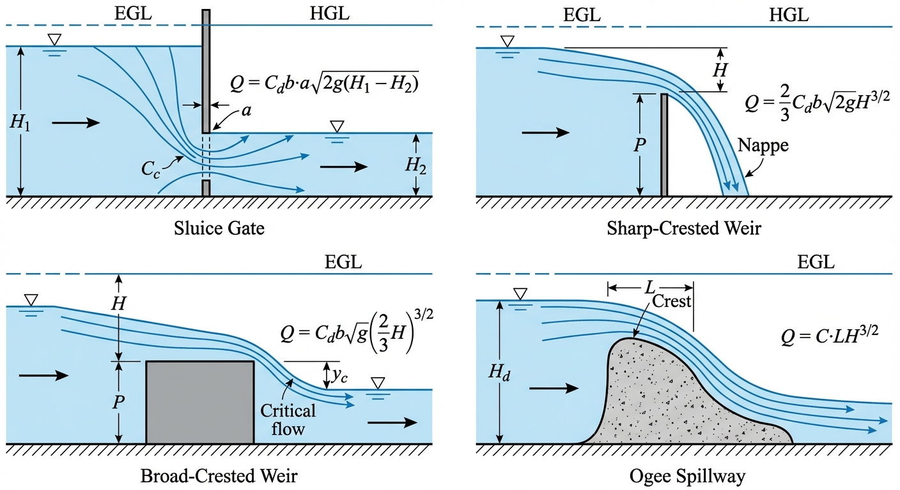
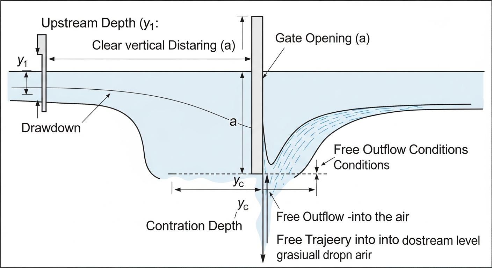
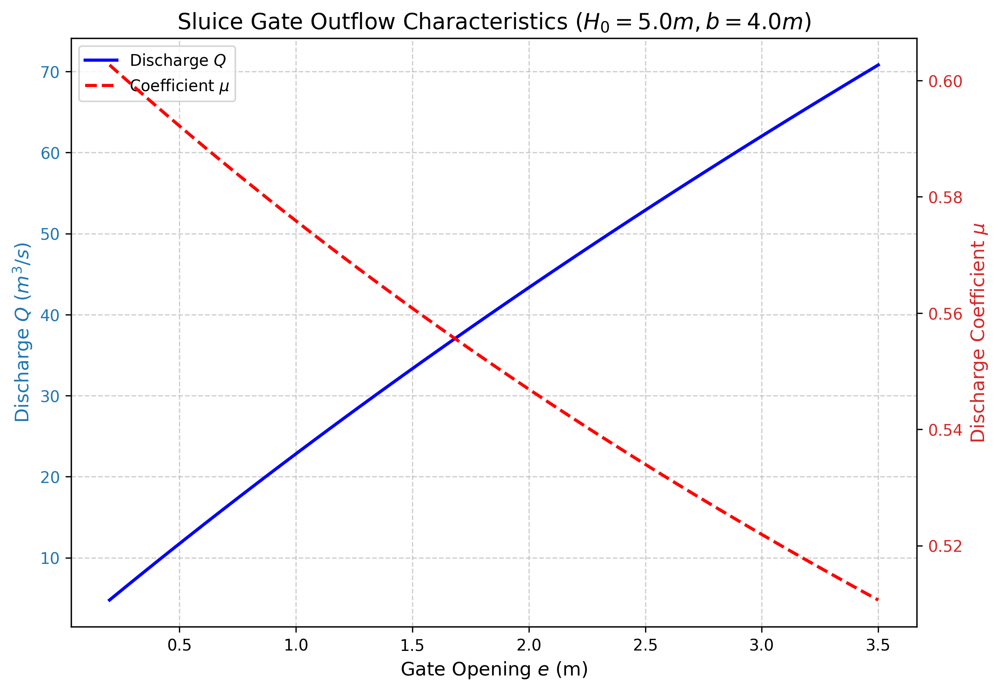

# 第 3 章 水工建筑物水力学

## 1. 学习目标



本章探讨水工建筑物（闸门、堰、量水槽等）在明渠中的水力学作用。这些建筑物作为水流的"控制节点"，强制改变水流状态，在工程调度中发挥关键作用。完成本章学习后，读者应掌握以下内容：

1. 闸门自由出流的水力计算方法，包括流量系数的非线性特性。
2. 闸门淹没出流的判别条件和计算公式。
3. 薄壁堰（sharp-crested weir）的出流公式及流量系数。
4. 宽顶堰（broad-crested weir）的出流机理和计算方法。
5. 量水建筑物（巴歇尔槽）的工作原理与流量计算。
6. 收缩断面水深符号约定：用 $y_{cc}$ 表示收缩断面水深，与临界水深 $y_c$ 严格区分。

---


## 2. 教材理论

### 2.1 闸门出流概述

在明渠中，闸门（sluice gate）是最常用的流量调节建筑物。当闸门部分开启时，上游来流被迫从闸底开口处高速射出，在闸门下游形成一段收缩水流。闸门出流按下游水位条件的不同，分为**自由出流**和**淹没出流**两种工况。

### 2.2 闸门自由出流

#### 2.2.1 基本公式推导

对于平底矩形明渠上的垂直平板闸门，当下游水位低于收缩断面水深时，出流不受下游顶托，称为**自由出流**。

取上游断面（距闸门足够远，流线近似平行，水深 $H_0$）和收缩断面（闸门下游约 $0.5e$ 处，水深 $y_{cc}$）为控制断面。由于两断面之间的水程较短且渠底水平，可忽略摩擦损失，应用伯努利方程：

$$H_0 + \frac{V_0^2}{2g} = y_{cc} + \frac{V_{cc}^2}{2g}$$

当上游渠道较宽、水深较大时，行近流速 $V_0$ 可忽略，即 $V_0^2/(2g) \ll H_0$。又设收缩断面水深 $y_{cc} = \varepsilon \cdot e$，其中 $\varepsilon$ 为收缩系数（垂直平板闸门 $\varepsilon \approx 0.61$），$e$ 为闸门开度。则：

$$H_0 \approx \varepsilon e + \frac{V_{cc}^2}{2g}$$

$$V_{cc} = \sqrt{2g(H_0 - \varepsilon e)}$$

流量为：

$$Q = V_{cc} \cdot A_{cc} = V_{cc} \cdot b \cdot \varepsilon e = \varepsilon e \cdot b \cdot \sqrt{2g(H_0 - \varepsilon e)}$$

整理为标准形式：

$$\boxed{Q = \mu \cdot e \cdot b \cdot \sqrt{2g H_0}} \tag{3.1}$$

其中流量系数 $\mu$ 综合反映了流速损失和断面收缩效应：

$$\mu = \frac{\varepsilon}{\sqrt{1 + \varepsilon \cdot \dfrac{e}{H_0}}} \tag{3.2}$$

**关于符号 $y_{cc}$ 的说明**：本书采用 $y_{cc}$（contraction depth）表示收缩断面水深，以区别于临界水深 $y_c$（critical depth）。两者是完全不同的概念——$y_{cc}$ 由闸门开度和收缩系数决定（$y_{cc} = \varepsilon e$），$y_c$ 由流量和断面形状决定。

#### 2.2.2 流量系数的非线性特性

由式 (3.2) 可知，流量系数 $\mu$ 是开度比 $e/H_0$ 的函数，并非常数。当 $e/H_0 \to 0$ 时，$\mu \to \varepsilon \approx 0.61$；当 $e/H_0$ 增大时，$\mu$ 逐渐减小。这意味着闸门开度与下泄流量之间不存在简单的正比关系——开度增大一倍，流量的增幅小于一倍。

### 2.3 闸门淹没出流

#### 2.3.1 淹没出流的判别

当下游水位 $h_t$ 升高至超过收缩断面水深 $y_{cc}$ 时，下游水体对闸门出流形成"顶托"，称为**淹没出流**（submerged outflow）。判别准则为：

$$\text{自由出流条件}: \quad h_t < y_{cc} = \varepsilon \cdot e \tag{3.3a}$$

$$\text{淹没出流条件}: \quad h_t \geq y_{cc} = \varepsilon \cdot e \tag{3.3b}$$

实际工程中，有时采用更保守的判别标准：当 $h_t > 0.8 y_{cc}$ 时即认为开始受下游影响。

#### 2.3.2 淹没出流计算公式

淹没出流时，闸门下游形成一层厚度为 $h_t$ 的水垫，射流需克服下游水压做功。常用的淹没出流公式为：

$$Q = \mu_s \cdot e \cdot b \cdot \sqrt{2g(H_0 - h_t)} \tag{3.4}$$

式中：$h_t$ 为下游尾水深度；$\mu_s$ 为淹没出流的流量系数，其值小于自由出流的 $\mu$，通常 $\mu_s = 0.50 \sim 0.55$。

也有文献采用淹没系数 $\sigma_s$ 的修正方式：

$$Q = \sigma_s \cdot \mu \cdot e \cdot b \cdot \sqrt{2g H_0} \tag{3.5}$$

其中 $\sigma_s = f(h_t/H_0, e/H_0)$，$\sigma_s < 1$。Henry (1950) 给出了系统的实验数据曲线，Swamee (1992) 提出了经验拟合公式。

淹没出流与自由出流相比，同一开度下的下泄流量显著减小，且流量对上下游水位差更加敏感。在实时控制系统中，一旦检测到从自由出流向淹没出流的转换，必须立即切换控制逻辑和流量计算公式，否则将产生严重的流量估算偏差。

### 2.4 薄壁堰

#### 2.4.1 基本概念

薄壁堰（sharp-crested weir）是指堰顶厚度 $\delta$ 与堰上水头 $H$ 之比 $\delta/H < 0.67$ 的堰。水流越过堰顶时形成完全脱离堰壁的自由溢流水舌（nappe），堰顶仅起到控制水面高程的作用。

#### 2.4.2 矩形薄壁堰流量公式

取堰顶上游适当距离处的断面和堰顶处的断面，忽略能量损失，沿水深方向对过堰流速进行积分，可得矩形薄壁堰的理论流量公式：

在堰顶以上某一微元层 $dz$（距堰顶高度 $z$），该层的理论流速为 $v = \sqrt{2gz}$（假设上游行近流速可忽略），微元面积为 $b \cdot dz$，总流量为：

$$Q_{\text{理论}} = \int_0^H b \sqrt{2gz} \, dz = b\sqrt{2g} \cdot \frac{2}{3} H^{3/2}$$

考虑实际流动中的收缩和能量损失，引入流量系数 $C_d$：

$$\boxed{Q = C_d \cdot \frac{2}{3} \sqrt{2g} \cdot b \cdot H^{3/2}} \tag{3.6}$$

式中：$C_d$ 为无量纲流量系数，一般取 $0.60 \sim 0.65$；$b$ 为堰口宽度（$\mathrm{m}$）；$H$ 为堰上水头（$\mathrm{m}$），从堰顶量至上游水面（在堰上游 $3 \sim 4H$ 处测量，以避免水面降落的影响）。

$C_d$ 的经验公式（Rehbock, 1929）：

$$C_d = 0.611 + 0.075 \frac{H}{P} \tag{3.7}$$

其中 $P$ 为堰高（从渠底到堰顶的高度）。当 $H/P$ 较小时，$C_d \approx 0.611$；随着 $H/P$ 增大（行近流速效应增强），$C_d$ 略有增大。

#### 2.4.3 三角形薄壁堰

三角形（V 形）薄壁堰适用于小流量的精确测量。其流量公式为：

$$Q = C_d \cdot \frac{8}{15} \sqrt{2g} \cdot \tan\frac{\theta}{2} \cdot H^{5/2} \tag{3.8}$$

式中 $\theta$ 为缺口夹角，常用 $\theta = 90°$。三角形堰的优点是在小流量时仍有较大的水头变化，测量灵敏度高。

### 2.5 宽顶堰

#### 2.5.1 出流机理

宽顶堰（broad-crested weir）的堰顶厚度满足 $2H \leq \delta \leq 10H$，水流在堰顶上能够形成近似平行流线的流动区域。当堰顶足够长时，水流在堰顶上将趋近于临界流状态。

根据能量方程，取上游水面（总水头 $H_0 \approx H + P$，以堰顶为基准即 $H$）和堰顶上水深 $y$ 的断面：

$$H = y + \frac{V^2}{2g} = y + \frac{q^2}{2gy^2}$$

这就是第 2 章所述的比能方程。堰上自由出流时，堰顶上水深趋近于临界水深 $y_c$，即：

$$y_c = \frac{2}{3}H \tag{2.11 的等价形式}$$

将 $y_c$ 和 $V_c = \sqrt{gy_c}$ 代入流量公式 $Q = V_c \cdot y_c \cdot b$：

$$Q = \sqrt{g \cdot \frac{2}{3}H} \cdot \frac{2}{3}H \cdot b = \frac{2}{3}\sqrt{\frac{2}{3}g} \cdot b \cdot H^{3/2}$$

引入流量系数 $C_{dw}$ 以修正实际偏差：

$$\boxed{Q = C_{dw} \cdot \frac{2}{3} \sqrt{\frac{2}{3}g} \cdot b \cdot H^{3/2}} \tag{3.9}$$

理论上 $C_{dw} = 1.0$，实际因边界层效应和入口能量损失，$C_{dw} = 0.85 \sim 0.95$。

宽顶堰的特点是：只要堰上水流处于自由出流状态（不被下游淹没），流量仅由上游水头 $H$ 决定，与下游水位无关。这一特性使其成为理想的流量测量和控制装置。

#### 2.5.2 淹没判别

当下游水位升高至堰顶以上一定高度时，宽顶堰将从自由出流转为淹没出流。淹没临界条件约为下游堰上水深 $h_t > 0.8 y_c \approx 0.53 H$。淹没后流量减小，需引入淹没修正系数。

### 2.6 量水建筑物：巴歇尔槽

#### 2.6.1 基本原理

巴歇尔槽（Parshall Flume）是一种标准化的量水建筑物，由渐缩段、喉道段和渐扩段组成。其工作原理是通过收缩渠道宽度和降低渠底高程，迫使水流在喉道处达到或接近临界状态，使得流量仅由上游水深唯一确定。

巴歇尔槽的优点包括：（a）水头损失小（约为堰的 1/4）；（b）含沙水流不易淤积（有自清能力）；（c）不需要静水池即可测量；（d）精度较高（误差通常在 3%--5%）。

#### 2.6.2 流量公式

巴歇尔槽的流量公式为经验公式，形式为：

$$Q = K \cdot H_a^n \tag{3.10}$$

式中：$H_a$ 为渐缩段指定位置处的水深（$\mathrm{m}$）；$K$ 和 $n$ 为与喉道宽度 $W$ 有关的常数。

不同喉道宽度的典型系数（国际标准）：

| 喉道宽度 $W$ (m) | $K$ | $n$ | 适用流量范围 ($\mathrm{m^3/s}$) |
|---|---|---|---|
| 0.152 (6 in) | 0.381 | 1.580 | 0.0008 -- 0.054 |
| 0.305 (12 in) | 0.690 | 1.522 | 0.0014 -- 0.110 |
| 0.610 (24 in) | 1.428 | 1.550 | 0.0025 -- 0.252 |
| 0.914 (36 in) | 2.184 | 1.566 | 0.0028 -- 0.457 |
| 1.219 (48 in) | 2.953 | 1.578 | 0.0042 -- 0.695 |
| 1.524 (60 in) | 3.732 | 1.587 | 0.0056 -- 0.937 |

数据来源：美国垦务局 (USBR) 标准。

当下游水位过高导致淹没比 $S_r = H_b/H_a > 0.7$ 时（$H_b$ 为喉道下游指定位置的水深），需进行淹没修正。

### 2.7 各类水工建筑物的比较

| 建筑物类型 | 流量公式形式 | 主要优点 | 主要缺点 | 典型应用 |
|---|---|---|---|---|
| 闸门（自由出流） | $Q \propto e \sqrt{H}$ | 流量调节灵活 | 流量系数非线性 | 渠道流量调节 |
| 薄壁堰 | $Q \propto H^{3/2}$ | 精度高，结构简单 | 水头损失大 | 实验室量水 |
| 宽顶堰 | $Q \propto H^{3/2}$ | 结构坚固，可通过碎石 | 精度略低于薄壁堰 | 灌溉渠道量水 |
| 巴歇尔槽 | $Q = KH_a^n$ | 水头损失小，自清能力强 | 需标准化安装 | 灌区和污水处理 |

---

## 3. 典型例题

### 例题 3.1 薄壁堰流量计算

**题目**：某矩形薄壁堰，堰口宽度 $b = 2.0\;\mathrm{m}$，堰高 $P = 1.5\;\mathrm{m}$，上游水面高出堰顶 $H = 0.40\;\mathrm{m}$。求过堰流量。

**解**：

首先计算流量系数。由 Rehbock 公式 (3.7)：

$$C_d = 0.611 + 0.075 \times \frac{H}{P} = 0.611 + 0.075 \times \frac{0.40}{1.50} = 0.611 + 0.020 = 0.631$$

代入薄壁堰流量公式 (3.6)：

$$Q = C_d \cdot \frac{2}{3}\sqrt{2g} \cdot b \cdot H^{3/2}$$

$$= 0.631 \times \frac{2}{3} \times \sqrt{2 \times 9.81} \times 2.0 \times 0.40^{3/2}$$

$$= 0.631 \times 0.6667 \times 4.429 \times 2.0 \times 0.2530$$

$$= 0.631 \times 0.6667 \times 4.429 \times 0.5060$$

$$= 0.942\;\mathrm{m^3/s}$$

**结果**：过堰流量 $Q \approx 0.94\;\mathrm{m^3/s}$。

### 例题 3.2 宽顶堰流量计算

**题目**：某宽顶堰，堰顶宽度 $b = 5.0\;\mathrm{m}$，堰上水头 $H = 0.60\;\mathrm{m}$，流量系数 $C_{dw} = 0.90$。求过堰流量。

**解**：

由宽顶堰流量公式 (3.9)：

$$Q = C_{dw} \cdot \frac{2}{3}\sqrt{\frac{2}{3}g} \cdot b \cdot H^{3/2}$$

$$= 0.90 \times \frac{2}{3} \times \sqrt{\frac{2}{3} \times 9.81} \times 5.0 \times 0.60^{3/2}$$

计算中间值：$\sqrt{2g/3} = \sqrt{6.54} = 2.557$：

$$= 0.90 \times 0.6667 \times 2.557 \times 5.0 \times 0.4648$$

$$= 0.90 \times 0.6667 \times 2.557 \times 2.324$$

$$= 3.566\;\mathrm{m^3/s}$$

也可以简化计算：宽顶堰的综合系数 $m_w = C_{dw} \cdot \frac{2}{3}\sqrt{2g/3}$：

$$m_w = 0.90 \times \frac{2}{3} \times 2.557 = 1.534$$

$$Q = m_w \cdot b \cdot H^{3/2} = 1.534 \times 5.0 \times 0.4648 = 3.566\;\mathrm{m^3/s}$$

**结果**：过堰流量 $Q \approx 3.57\;\mathrm{m^3/s}$。

### 例题 3.3 闸门出流类型判别

**题目**：某矩形渠道上的平板闸门，上游水深 $H_0 = 4.0\;\mathrm{m}$，闸门开度 $e = 1.0\;\mathrm{m}$，收缩系数 $\varepsilon = 0.61$。分别判断下游水深 $h_t = 0.4\;\mathrm{m}$ 和 $h_t = 1.5\;\mathrm{m}$ 时的出流类型。

**解**：

收缩断面水深 $y_{cc} = \varepsilon \cdot e = 0.61 \times 1.0 = 0.61\;\mathrm{m}$。

（1）当 $h_t = 0.4\;\mathrm{m} < y_{cc} = 0.61\;\mathrm{m}$：自由出流。

（2）当 $h_t = 1.5\;\mathrm{m} > y_{cc} = 0.61\;\mathrm{m}$：淹没出流。

---

## 4. 工程案例：矩形闸门自由出流特性分析

### 4.1 案例背景

在数字孪生水网中，泵闸群的联合调度是核心业务。工程师必须掌握闸门在不同开度下的非线性出流特性，建立精确的闸门-流量关系曲线，作为控制系统前馈环节的核心依据。

### 4.2 问题描述

某节制闸所在矩形渠道底宽 $b = 4.0\;\mathrm{m}$，上游恒定水深 $H_0 = 5.0\;\mathrm{m}$（忽略行近流速）。需计算闸门开度 $e$ 从 $0.5\;\mathrm{m}$ 至 $3.0\;\mathrm{m}$ 时的流量 $Q$、流量系数 $\mu$ 和收缩断面弗劳德数 $Fr_{cc}$ 的变化规律。



### 4.3 代码实现

```python
import numpy as np

# 渠道和闸门参数
b = 4.0       # 闸孔宽度 m
H0 = 5.0      # 上游水深 m
epsilon = 0.61 # 收缩系数
g = 9.81      # 重力加速度

# 开度扫描范围
e_range = np.arange(0.5, 3.5, 0.5)

print(f"{'e (m)':>8} {'mu':>8} {'Q (m3/s)':>12} {'y_cc (m)':>10} {'Fr_cc':>8}")
print("-" * 50)

for e in e_range:
    # 流量系数（式3.2）
    mu = epsilon / np.sqrt(1 + epsilon * e / H0)
    # 流量（式3.1）
    Q = mu * e * b * np.sqrt(2 * g * H0)
    # 收缩断面水深
    y_cc = epsilon * e
    # 收缩断面流速和弗劳德数
    V_cc = Q / (b * y_cc)
    Fr_cc = V_cc / np.sqrt(g * y_cc)

    print(f"{e:8.1f} {mu:8.4f} {Q:12.2f} {y_cc:10.2f} {Fr_cc:8.2f}")
```

Source: `assets/ch03/ch03_gate_outflow.py`

### 4.4 计算结果

闸门操作域流量特性追踪矩阵：

| Gate Opening $e$ (m) | Discharge Coeff $\mu$ | Discharge $Q$ ($\mathrm{m^3/s}$) | Contraction Depth $y_{cc}$ (m) | Froude No. at $y_{cc}$ |
|---:|---:|---:|---:|---:|
| 0.5 | 0.5922 | 11.73 | 0.30 | 5.56 |
| 1.0 | 0.5759 | 22.82 | 0.61 | 3.82 |
| 1.5 | 0.5608 | 33.33 | 0.92 | 3.04 |
| 2.0 | 0.5469 | 43.34 | 1.22 | 2.57 |
| 2.5 | 0.5340 | 52.89 | 1.52 | 2.24 |
| 3.0 | 0.5219 | 62.03 | 1.83 | 2.00 |



### 4.5 结果分析

（1）**流量与开度的非线性关系**：当闸门开度从 $1.0\;\mathrm{m}$ 翻倍至 $2.0\;\mathrm{m}$ 时，流量并非从 $22.82\;\mathrm{m^3/s}$ 翻倍到 $45.64\;\mathrm{m^3/s}$，而仅增加到 $43.34\;\mathrm{m^3/s}$。增幅为 89.9%，低于 100%。

（2）**流量系数的衰减**：随着闸门开度增大（$e/H_0$ 增大），$\mu$ 从 0.5922 下降至 0.5219。这解释了工程人员常反映的"大开度时灵敏度降低"的现象。

（3）**收缩断面始终为急流**：在整个操作域内，收缩断面处的弗劳德数均远大于 1（$Fr_{cc} = 2.0 \sim 5.56$），验证了自由出流假设的成立。若下游水位上升使 $Fr_{cc}$ 接近 1，则自由出流假设不再成立，必须切换至淹没出流公式。

（4）**水跃的必然性**：收缩断面处如此高的弗劳德数意味着该急流必将在下游某处发生水跃，转变为缓流以适应下游的水位边界条件。这是节制闸下游必须修筑消力池的物理根源。

---

## 5. 工业部署建议

### 5.1 闸门特性曲线的现场标定

公式 (3.1) 和 (3.2) 计算的流量系数属于理论值。实际闸门因边缘磨损、槽道渗漏、上游渐变段的差异等因素，流量系数会与理论值存在偏差。工业级做法是在通水初期利用声学多普勒流速剖面仪（ADCP）或超声波流量计对闸门进行全量程实测标定，建立该闸门专属的 $\mu(e, H_0)$ 曲线族，并存入 SCADA 数据库。

### 5.2 流态自动判别与控制切换

在实时调度系统中，闸门出流可能因下游水位变化而在自由出流与淹没出流之间频繁切换。控制系统必须具备自动流态判别功能：

（a）持续监测下游水位 $h_t$ 与收缩断面水深 $y_{cc} = \varepsilon e$ 的大小关系。

（b）当 $h_t$ 超过 $y_{cc}$ 时，立即将流量计算公式从式 (3.1) 切换至式 (3.4)。

（c）在切换过渡期间采用平滑插值，避免控制信号的突变跳跃引发水力振荡。

### 5.3 量水建筑物的选型原则

根据渠道规模、含沙量、水头损失允许值和精度要求，量水建筑物的选型可参考以下原则：

（a）实验室或小型渠道（$Q < 0.1\;\mathrm{m^3/s}$）：优先选用三角形薄壁堰，测量灵敏度高。

（b）中等灌溉渠道（$Q = 0.1 \sim 1.0\;\mathrm{m^3/s}$）：可选用巴歇尔槽或宽顶堰。含沙量高时首选巴歇尔槽。

（c）大型灌溉干渠（$Q > 1.0\;\mathrm{m^3/s}$）：宽顶堰或特大巴歇尔槽，需考虑结构强度和壅水影响。

---

## 6. 本章小结

本章系统论述了水工建筑物的水力学计算方法：

（1）**闸门出流**分为自由出流和淹没出流两种工况。自由出流公式 $Q = \mu e b\sqrt{2gH_0}$ 中流量系数 $\mu$ 是开度比 $e/H_0$ 的非线性函数。淹没出流发生在下游水位超过收缩断面水深 $y_{cc} = \varepsilon e$ 时，流量显著减小。

（2）**薄壁堰**的流量公式 $Q = C_d \frac{2}{3}\sqrt{2g} \cdot b \cdot H^{3/2}$ 精度高，适用于实验室和小型渠道量水。流量系数 $C_d$ 可由 Rehbock 公式估算。

（3）**宽顶堰**利用堰顶上水流趋近临界状态的原理，使流量仅由上游水头决定，是良好的流量控制和测量装置。

（4）**巴歇尔槽**通过断面收缩和底坡变化迫使水流过临界状态，水头损失小、自清能力强，是灌区量水的优选方案。

（5）在工程控制系统中，必须注意自由出流与淹没出流的自动判别和流量公式的实时切换，这是确保调度精度的关键环节。

## 思考题

1. **概念辨析**：闸门自由出流与淹没出流的判别条件是什么？在工程控制系统中，为什么必须对这两种工况进行自动判别和流量公式实时切换？

2. **定量计算**：一平板闸门，宽度 $b = 3.0\,\mathrm{m}$，开度 $e = 0.4\,\mathrm{m}$，上游水深 $H_0 = 2.5\,\mathrm{m}$，流量系数 $\mu = 0.61$，收缩系数 $\varepsilon = 0.625$。(a) 计算自由出流条件下的流量；(b) 若下游水位升高至 $y_t = 0.35\,\mathrm{m}$，判断是否发生淹没出流。

3. **对比分析**：薄壁堰和宽顶堰的流量公式分别是什么？试从流量系数精度、适用范围、水头损失三个方面比较二者作为量水建筑物的优缺点。

4. **定量计算**：一矩形薄壁堰，堰宽 $b = 1.5\,\mathrm{m}$，堰上水头 $H = 0.30\,\mathrm{m}$，堰高 $P = 0.60\,\mathrm{m}$。试用 Rehbock 公式估算流量系数 $C_d$，进而计算堰流流量。

5. **工程应用**：巴歇尔槽为什么特别适合灌区量水？试从自清能力、水头损失和安装要求三个方面分析其工程优势。

---

## 7. 参考文献

[1] Chow, V.T. Open-Channel Hydraulics [M]. New York: McGraw-Hill, 1959.

[2] Henderson, F.M. Open Channel Flow [M]. New York: Macmillan, 1966.

[3] Henry, H.R. Discussion of "Diffusion of submerged jets" [J]. Transactions of ASCE, 1950, 115: 687-694.

[4] Swamee, P.K. Sluice-gate discharge equations [J]. Journal of Irrigation and Drainage Engineering, 1992, 118(1): 56-60.

[5] Chaudhry, M.H. Open-Channel Flow [M]. 2nd ed. New York: Springer, 2008.

[6] 吴持恭. 水力学(第四版) [M]. 北京: 高等教育出版社, 2008.

[7] 武汉大学水利水电学院. 水力计算手册 [M]. 北京: 中国水利水电出版社, 2006.

[8] Rehbock, T. Discussion of "Precise weir measurements" [J]. Transactions of ASCE, 1929, 93: 1143-1162.

[9] Parshall, R.L. The improved Venturi flume [J]. Transactions of ASCE, 1926, 89: 841-880.

[10] Sturm, T.W. Open Channel Hydraulics [M]. New York: McGraw-Hill, 2001.

[11] 赵振兴, 何建京, 王忖. 水力学[M]. 3版. 北京: 清华大学出版社, 2021.
