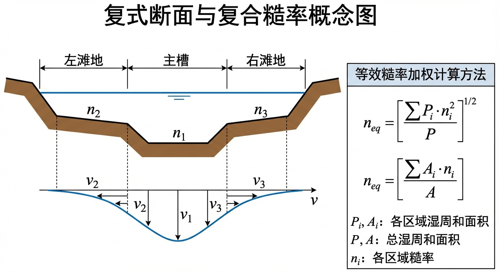
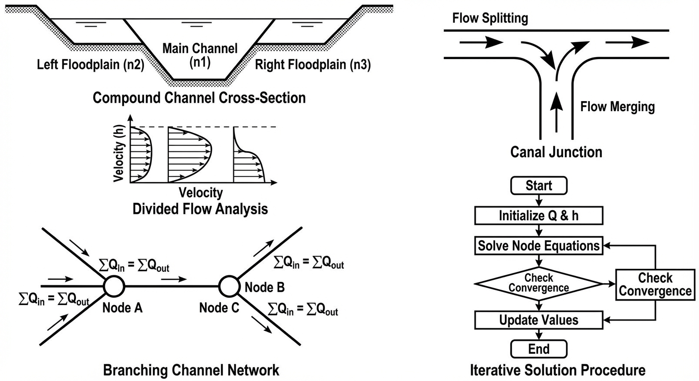
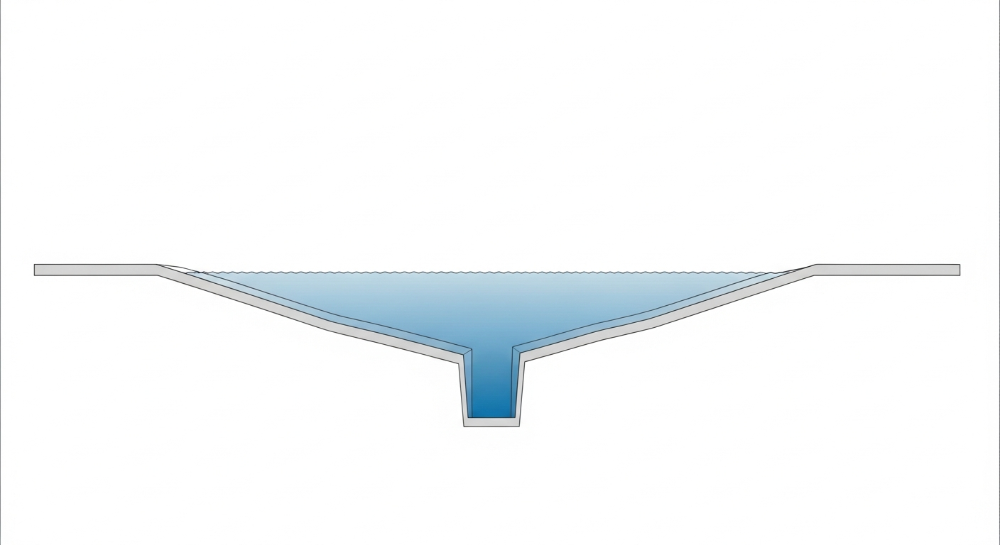
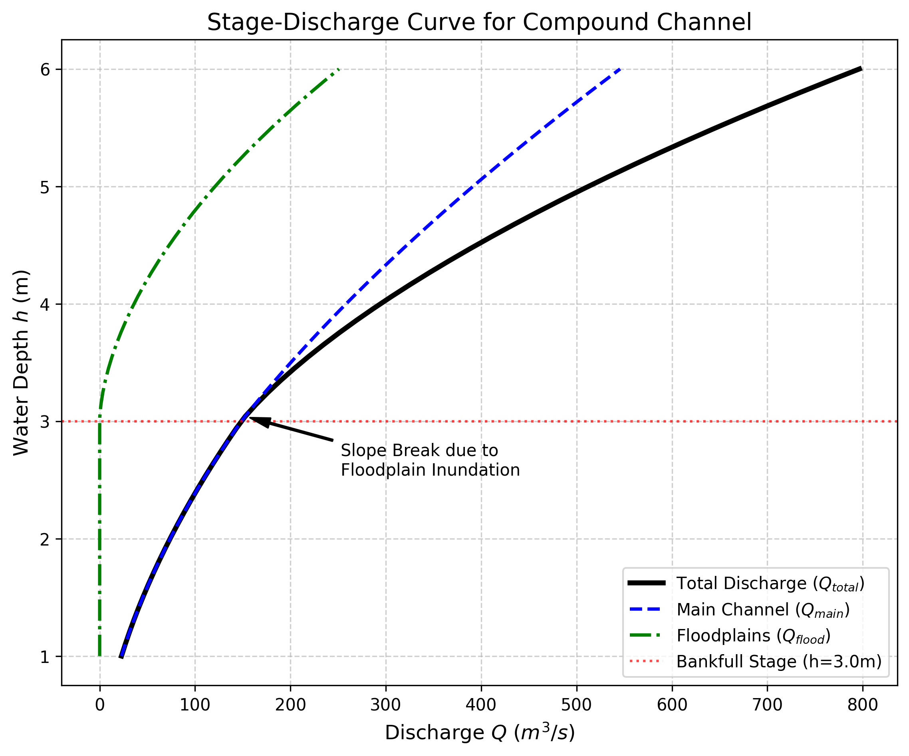

# 第 5 章 复式断面与复合糙率

## 1 学习目标

本章探讨水流脱离规则人工渠道、进入截面不规则且糙率空间分布不均匀的自然河道与复杂工程结构时的水力计算方法。读者完成本章学习后，应能够：

(1) 理解复式断面（Compound Channel）漫滩流的物理机制，掌握分槽求和法的计算原理。

(2) 运用 Horton 法、Einstein 法和 Lotter 法三种经典方法计算复合糙率等效曼宁系数。

(3) 了解复式断面中横向动量传递的基本概念，包括 Shiono-Knight 模型的理论框架。

(4) 掌握涵洞过流入口控制与出口控制的基本判别方法。

(5) 认识漫滩流引起的水位-流量关系转折现象及其在防洪设计中的工程意义。

---

## 2 教材理论

### 2.1 复式断面的基本概念

典型的天然河道由中间深凹的**主槽**（Main Channel）和两侧广阔平坦的**滩地**（Floodplains）组成。平时水流仅在主槽内流动；当洪水期水位超过滩唇高程（Bankfull Stage）后，水流漫上滩地，形成漫滩洪水。

主槽底部较为光滑（以泥沙和砾石为主），水深大，因而流速高、曼宁糙率系数较小（$n$ 通常为 0.020--0.035）。滩地则往往长满杂草灌木甚至树林，水深浅，流速极慢，糙率系数很大（$n$ 可达 0.040--0.100）。

如果将漫滩洪水简单视为一个整体断面，采用单一平均流速和统一糙率系数套用曼宁公式，将导致计算流量产生严重偏差。这是因为主槽与滩地之间存在巨大的流速差异，二者的水力行为截然不同。

### 2.2 分槽求和法

工程中处理复式断面的标准方法是**分槽求和法**（Divided Channel Method）：

(a) 在滩唇处设置垂直分割线（假壁，Imaginary Walls），将整个过水断面分割为若干子槽（通常为左滩、主槽、右滩三部分）。

(b) 分别计算每个子槽的过水面积 $A_i$、湿周 $P_i$（假壁长度不计入湿周，因为它不提供真实的物理摩擦）、水力半径 $R_i = A_i/P_i$ 和糙率系数 $n_i$。

(c) 用曼宁公式分别计算各子槽流量并求和：

$$
Q_{total} = \sum_{i=1}^{N} Q_i = \sum_{i=1}^{N} \frac{1}{n_i} A_i R_i^{2/3} S_0^{1/2} \tag{5-1}
$$

其中 $N$ 为子槽数量，$S_0$ 为河道底坡（假设各子槽底坡相同）。

假壁不计入湿周的处理方式在工程实践中被广泛采用，其理由是：假壁处为水-水交界面，不存在河床那样的固体边界摩擦。然而，这种处理忽略了主槽与滩地之间的**横向动量传递**（见 2.4 节），因此在某些情况下会高估总流量。

### 2.3 复合糙率等效曼宁系数

当渠道截面的不同部分具有不同的糙率系数（如渠底为混凝土、侧壁为浆砌石、滩地为草皮），但仍希望使用一个等效曼宁系数 $n_e$ 来代表整个断面时，有三种经典方法。

设整个断面被分为 $N$ 个子区，每个子区的湿周为 $P_i$、糙率为 $n_i$，总湿周 $P = \sum P_i$，总面积 $A$，总水力半径 $R = A/P$。

#### 2.3.1 Horton 法（1933）

假设各子区的平均流速相等（$v_i = v$），则等效糙率为：

$$
n_e = \left(\frac{\sum_{i=1}^{N} P_i n_i^{3/2}}{P}\right)^{2/3} \tag{5-2}
$$

物理含义：各子区对整体摩擦力的贡献按其湿周长度加权。Horton 法也称为 Horton-Einstein-Banks 法。

#### 2.3.2 Einstein 法（1934）

假设各子区所受的阻力（用水力半径表示）独立，且各子区的水力半径用 $P_i$ 和全断面面积的假设关系推出。Einstein 提出与 Horton 公式形式相同但推导出发点不同的等效糙率公式：

$$
n_e = \left(\frac{\sum_{i=1}^{N} P_i n_i^{2}}{P}\right)^{1/2} \tag{5-3}
$$

物理含义：各子区对总摩擦损失的贡献按湿周加权，以阻力平方的形式叠加。

#### 2.3.3 Lotter 法（1933）

假设总流量等于各子区流量之和（与分槽求和法的思想一致），则：

$$
n_e = \frac{P R^{5/3}}{\sum_{i=1}^{N} \frac{P_i R_i^{5/3}}{n_i}} \tag{5-4}
$$

其中 $R_i = A_i/P_i$ 为各子区的水力半径。

物理含义：直接从曼宁公式出发，保证等效糙率下计算的总流量与分槽求和结果一致。Lotter 法在理论上更为严谨，但需要知道各子区的面积和湿周，计算量稍大。

**三种方法的比较：** Horton 法和 Einstein 法仅需知道各子区的湿周和糙率，计算简便；Lotter 法需要更详细的几何数据但精度更高。对于糙率差异不大的情况，三种方法结果接近；当糙率差异显著时（如复式断面），推荐使用 Lotter 法或直接采用分槽求和法。

### 2.4 横向动量传递

分槽求和法的一个重要简化假设是：各子槽之间互不干扰，只有纵向流动而没有横向交换。然而在实际的漫滩洪水中，主槽与滩地之间存在显著的**横向动量传递**，表现为：

(a) 主槽高速水流与滩地低速水流之间形成强烈的剪切层，产生大尺度的横向涡旋。

(b) 这种横向剪切导致主槽水流动能向滩地耗散，从而降低了整体过流能力。

(c) 在某些情况下，主槽水流甚至会被滩地的高阻力"拖曳"而显著减速。

**Shiono-Knight 模型**（Shiono and Knight, 1991）是描述复式断面横向水深平均流速分布的经典解析方法。该模型从水深平均的 Navier-Stokes 方程出发，建立了以下控制方程：

$$
\rho g H S_0 - \rho \frac{f}{8} U_d^2 \left(1 + \frac{1}{s^2}\right)^{1/2} + \frac{\partial}{\partial y}\left[\rho \lambda H^2 \left(\frac{f}{8}\right)^{1/2} U_d \frac{\partial U_d}{\partial y}\right] + \Gamma = 0 \tag{5-5}
$$

式中：

- $\rho$——水的密度（$\mathrm{kg/m^3}$）；
- $H$——局部水深（m）；
- $U_d$——水深平均纵向流速（m/s）；
- $f$——达西-韦斯巴赫摩擦系数，无量纲；
- $s$——横断面的侧边坡度（$s = 1/m$，$m$ 为边坡系数）；
- $y$——横向坐标（m）；
- $\lambda$——无量纲涡粘性系数；
- $\Gamma$——二次流引起的附加横向剪应力项（$\mathrm{N/m^2}$）。

式 (5-5) 的第一项为重力驱动，第二项为底部摩擦阻力，第三项为横向紊动扩散（即横向动量传递的主要贡献），第四项为二次环流的效应。Shiono-Knight 模型的主要贡献在于给出了复式断面横向流速分布的解析解，揭示了主槽-滩地交界处流速剧烈变化的物理机制。

在工程设计中，当精度要求不高时，分槽求和法通常足够；当需要精确预测复式断面的流速分布和泥沙输移时，则应采用 Shiono-Knight 模型或三维数值模拟。

### 2.5 涵洞过流的基本概念

涵洞（Culvert）是公路、铁路跨越河沟时常用的排水构造物。涵洞的水力计算本质上是一种有压或无压管涵的过流分析，其核心在于判定过流控制类型：

**入口控制（Inlet Control）**：当涵洞的过流能力受限于进口断面时，称为入口控制。此时涵洞内部的管壁摩擦和出口条件对过流量没有控制作用。进口处的水力状态类似于堰流或孔口出流。入口控制通常发生在涵洞坡度较陡、管径较大、管壁较光滑的情况下。

**出口控制（Outlet Control）**：当涵洞的过流能力受限于进口损失、管内摩擦和出口条件的综合作用时，称为出口控制。此时整个涵洞的水头损失（包括进口损失、管壁摩擦损失和出口损失）决定了过流量。出口控制通常发生在涵洞坡度较缓、管径较小、管壁较粗糙、或下游水位较高的情况下。

判别方法的基本原理：分别按入口控制和出口控制两种工况计算所需的上游水头。取二者中较大的值作为控制工况——需要更高上游水头的工况即为实际的控制类型。

美国联邦公路管理局（FHWA）出版的 HDS-5（*Hydraulic Design of Highway Culverts*）给出了完整的涵洞水力设计方法和图表，是涵洞设计的权威参考资料。

### 2.6 漫滩水位-流量关系的非线性特征

当复式断面河道的水位逐渐上升越过滩唇高程时，水位-流量关系曲线（Rating Curve）会出现显著的**转折**。具体表现为：

(a) 水位在主槽内上升时，流量随水位近似呈幂函数关系稳定增长。

(b) 一旦水位越过滩唇，大量低速滩地水体突然加入，导致整个断面的平均流速出现瞬时跌落——这就是所谓的**流速漫滩断崖**。尽管总流量继续增加（因为过水面积剧增），但平均流速反而下降。

(c) 继续升高水位后，随着滩地水深增大，滩地的过流贡献逐渐增加，平均流速才重新回升。

这种非线性转折特征在防洪系统设计中具有重要的实际意义：如果数值模型或数据驱动模型未能正确反映这一转折，将导致洪水预报和预警时间的严重误判。

---

## 3 典型例题：复合糙率手算

### 3.1 题目

一梯形渠道底宽 $b = 4.0\,\mathrm{m}$，边坡系数 $m = 1.5$，设计水深 $h = 2.0\,\mathrm{m}$。渠底为现浇混凝土（$n_1 = 0.013$），两侧边坡为浆砌块石（$n_2 = 0.025$）。试分别用 Horton 法和 Einstein 法计算等效曼宁糙率系数。

### 3.2 求解过程

**几何参数计算：**

底部湿周：$P_1 = b = 4.0\,\mathrm{m}$。

两侧边坡湿周（单侧）：$P_{2,single} = h\sqrt{1 + m^2} = 2.0\times\sqrt{1 + 2.25} = 2.0\times1.803 = 3.606\,\mathrm{m}$。

两侧合计：$P_2 = 2\times3.606 = 7.211\,\mathrm{m}$。

总湿周：$P = P_1 + P_2 = 4.0 + 7.211 = 11.211\,\mathrm{m}$。

**Horton 法（式 5-2）：**

$$
n_e = \left(\frac{P_1 n_1^{3/2} + P_2 n_2^{3/2}}{P}\right)^{2/3}
$$

$n_1^{3/2} = 0.013^{1.5} = 0.001482$。

$n_2^{3/2} = 0.025^{1.5} = 0.003953$。

分子 $= 4.0\times0.001482 + 7.211\times0.003953 = 0.005928 + 0.028506 = 0.034434$。

$n_e = (0.034434 / 11.211)^{2/3} = (0.003071)^{2/3}$。

$\ln(0.003071) = -5.783$，$\times 2/3 = -3.855$，$e^{-3.855} = 0.02117$。

故 $n_e \approx 0.0212$（Horton 法）。

**Einstein 法（式 5-3）：**

$$
n_e = \left(\frac{P_1 n_1^{2} + P_2 n_2^{2}}{P}\right)^{1/2}
$$

$n_1^2 = 0.000169$，$n_2^2 = 0.000625$。

分子 $= 4.0\times0.000169 + 7.211\times0.000625 = 0.000676 + 0.004507 = 0.005183$。

$n_e = (0.005183 / 11.211)^{1/2} = (0.000462)^{0.5} = 0.0215$。

故 $n_e \approx 0.0215$（Einstein 法）。

### 3.3 结果讨论

两种方法的计算结果非常接近（$n_e \approx 0.021$），介于底部混凝土糙率（0.013）和边坡块石糙率（0.025）之间，且更偏向边坡值。这是因为边坡的湿周长度（7.21 m）远大于底部（4.0 m），对等效糙率的贡献权重更大。

在实际工程中，这一结果提醒设计者：即使渠底采用了光滑的混凝土衬砌，如果边坡糙率较大，整体的过流能力仍将受到显著影响。

---

## 4 工程案例：复式断面漫滩洪水非线性特征推演

### 4.1 案例背景

某山区流域治理工程涉及一条复式河道。河道常年干涸，仅在雨季暴发山洪。该河道由 20 m 宽、深 3 m 的光洁主河槽和两侧各 30 m 宽的杂草丛生的高滩地组成。数字孪生系统在预报一场罕见的特大洪水时发现异常：当水位刚刚漫过 3 m 的主槽进入滩地时，模型计算的全断面平均流速不升反降。需要通过物理分析查明这一现象的根本原因，并绘制该河道的标准水位-流量关系曲线。

### 4.2 问题描述

复式河槽参数：底坡 $S_0 = 0.0008$。

- 主槽：底宽 20 m，边坡系数 $m = 1.5$，糙率 $n = 0.025$，滩唇高度 $h_{bank} = 3.0\,\mathrm{m}$。
- 滩地：单侧宽 30 m（两侧共 60 m），边坡系数 $m = 2.0$，糙率 $n = 0.050$。

需要计算总水深从 1.0 m 上涨至 6.0 m 期间各分槽的流量分担情况，并分析漫滩瞬间（$h > 3.0\,\mathrm{m}$）系统整体平均流速的变化规律。

**物理场景概化图：**

### 4.3 解题思路

采用分槽求和法（式 5-1）：

(a) 当 $h \le 3.0\,\mathrm{m}$ 时，水流仅在主槽内，滩地流量为零。

(b) 当 $h > 3.0\,\mathrm{m}$ 时，从滩唇处垂直向上设分割线，将断面分为主槽和两侧滩地三部分。假壁长度不计入湿周。

(c) 分别用曼宁公式计算各子槽流量 $Q_i$，求和得总流量 $Q_{total}$。

(d) 反算全断面平均流速 $V_{avg} = Q_{total} / A_{total}$。

### 4.4 计算结果

源代码：`assets/ch05/ch05_compound_channel.py`

**复式断面分槽流量与平均流速追踪矩阵：**

| 总水深 $h$ (m) | 滩地水深 (m) | 主槽流量 ($\mathrm{m^3/s}$) | 滩地流量 ($\mathrm{m^3/s}$) | 总流量 ($\mathrm{m^3/s}$) | 平均流速 ($\mathrm{m/s}$) |
|---------------:|-------------:|-----------------:|------------------:|---------------:|---------------:|
|            1.0 |          0.0 |            22.86 |              0.00 |          22.86 |          1.063 |
|            2.0 |          0.0 |            73.85 |              0.00 |          73.85 |          1.606 |
|            3.0 |          0.0 |           148.44 |              0.00 |         148.44 |          2.020 |
|            3.5 |          0.5 |           200.39 |             11.02 |         211.41 |          1.777 |
|            4.0 |          1.0 |           258.40 |             36.03 |         294.42 |          1.768 |
|            5.0 |          2.0 |           391.40 |            121.01 |         512.41 |          1.916 |
|            6.0 |          3.0 |           545.60 |            250.88 |         796.48 |          2.115 |

**水位-流量关系转折曲线：**

### 4.5 结果分析

(1) **流速的漫滩断崖**：当水位在主槽内上升至 3.0 m 时，平均流速达到峰值 2.02 m/s。但当水位刚漫过滩地达到 3.5 m 时，尽管总流量增加至 211.41 m^3/s，平均流速却跌落至 1.777 m/s。这是因为滩地极高的糙率（0.050）和极浅的水深使滩地水体成为巨大的"摩擦拖累"，显著降低了整个断面的平均流速。

(2) **流量主导权的转移**：在水深 4.0 m 时，主槽承担了绝大部分流量（258 m^3/s），滩地仅分担 36 m^3/s。但当水深涨至 6.0 m 时，滩地过水面积呈指数级扩大，其输水能力增至 251 m^3/s，占系统总流量的三分之一。

(3) **水位-流量曲线的折角**：从 Rating Curve 图中可见，当水位超过滩唇高程 3.0 m 后，曲线斜率发生显著变化（变缓后再变陡），呈现明显的"折角"特征。这一非线性特征是复式断面的固有属性。

---

## 5 工业部署建议

(1) **数字孪生模型的漫滩修正**：许多数据驱动洪水预报模型在训练时仅使用了汛期以下的常水位数据。这类模型在遇到漫滩洪水时，会因从未"见过"流速断崖和非线性折角而发生严重误判。必须将分槽求和逻辑作为物理约束注入模型的先验知识中。

(2) **复合糙率的选择**：对于规则渠道的衬砌问题，Horton 法或 Einstein 法通常足够。对于涉及漫滩的天然河道，应优先使用分槽求和法而非等效糙率法，以避免丢失流速分布的关键信息。

(3) **横向动量传递的工程影响**：在主槽与滩地宽度比较大且滩地糙率极高的河段，分槽求和法可能高估总流量 10%--20%。此时建议采用 Shiono-Knight 模型或二维数值模拟进行修正。

(4) **滞洪区设计思路**：从计算数据可以看出，滩地虽然输水效率低下（流速慢），但其巨大的过水面积能有效消纳洪峰。在现代生态水利设计中，应利用滩地的高糙率作为天然减震器实现洪峰削减，而非将其硬化以追求输水速度。

(5) **涵洞设计的控制类型判别**：在涵洞水力计算中，必须同时按入口控制和出口控制两种工况计算，取控制水头较大者。漏判控制类型将导致涵洞尺寸设计不足，可能引发路基溃坝等严重工程事故。

---

## 6 本章小结

本章围绕复式断面与复合糙率的主题，主要内容包括：

(1) 阐述了复式断面漫滩洪水的物理机制，介绍了分槽求和法的原理和计算步骤（式 5-1）。

(2) 给出了 Horton 法（式 5-2）、Einstein 法（式 5-3）和 Lotter 法（式 5-4）三种复合糙率等效曼宁系数的计算公式，并比较了各自的假设和适用条件。

(3) 引入了 Shiono-Knight 模型（式 5-5）描述复式断面横向水深平均流速分布的基本概念，揭示了主槽-滩地交界处横向动量传递的物理机制。

(4) 介绍了涵洞过流的入口控制和出口控制两种基本类型及其判别方法。

(5) 通过复合糙率手算例题和复式断面漫滩工程案例，定量展示了漫滩流速断崖、水位-流量关系非线性转折等关键现象。

## 思考题

1. **概念辨析**：复式断面分槽求和法的基本假设是什么？这一假设在什么条件下可能导致较大误差？Shiono-Knight 模型相比分槽求和法的优势在哪里？

2. **定量计算**：一复式断面渠道分为主槽和左、右滩地三部分。主槽底宽 $b = 6\,\mathrm{m}$，糙率 $n_1 = 0.025$，湿周 $P_1 = 8.4\,\mathrm{m}$，面积 $A_1 = 12\,\mathrm{m^2}$；左滩地 $n_2 = 0.040$，$P_2 = 15\,\mathrm{m}$，$A_2 = 9\,\mathrm{m^2}$；右滩地 $n_3 = 0.035$，$P_3 = 12\,\mathrm{m}$，$A_3 = 7.2\,\mathrm{m^2}$。分别用 Horton 法和 Einstein 法计算等价曼宁糙率系数，并比较二者的差异。

3. **物理机制**：为什么漫滩洪水的水位-流量关系在滩地刚开始过水时会出现"流速断崖"和非线性转折？这一现象对防洪调度有何影响？

4. **工程应用**：涵洞过流的入口控制和出口控制分别适用于什么条件？如何判断一个涵洞在给定水头下处于哪种控制类型？

---

## 7 参考文献

[1] Chow, V.T. (1959). *Open-Channel Hydraulics*. New York: McGraw-Hill. (第 5 章系统讨论了复合糙率和复式断面的计算方法。)

[2] Sellin, R.H.J. (1964). A laboratory investigation into the interaction between the flow in the channel of a river and that over its flood plain. *La Houille Blanche*, 19(7), 793--802. (首次通过实验系统研究了主槽与滩地之间的动量交换机制。)

[3] Knight, D.W., & Demetriou, J.D. (1983). Flood plain and main channel flow interaction. *Journal of Hydraulic Engineering*, ASCE, 109(8), 1073--1092. (通过系统实验揭示了复式断面中横向剪切层对整体过流能力的影响。)

[4] Shiono, K., & Knight, D.W. (1991). Turbulent open-channel flows with variable depth across the channel. *Journal of Fluid Mechanics*, 222, 617--646. (提出了描述复式断面横向水深平均流速分布的 Shiono-Knight 解析模型。)

[5] Sturm, T.W. (2001). *Open Channel Hydraulics*. New York: McGraw-Hill. (第 4 章对复式断面和复合糙率给出了详细的例题和工程实例。)

[6] Chaudhry, M.H. (2008). *Open-Channel Flow*, 2nd edition. New York: Springer. (第 3 章讨论了复合糙率的计算方法。)

[7] 吴持恭. (2008). *水力学*（第四版）. 北京: 高等教育出版社. (第 6 章介绍了我国工程中常用的复式断面计算方法。)

[8] US Federal Highway Administration. (2012). *Hydraulic Design of Highway Culverts*, 3rd edition (HDS-5), Publication No. FHWA-HIF-12-026. (涵洞水力设计的权威指南，包含入口控制和出口控制的完整计算方法和设计图表。)

[9] Horton, R.E. (1933). Separate roughness coefficients for channel bottom and sides. *Engineering News-Record*, 111(22), 652--653.

[10] Einstein, H.A. (1934). *Der hydraulische oder Profil-Radius*. Schweizerische Bauzeitung, 103(8), 89--91.
