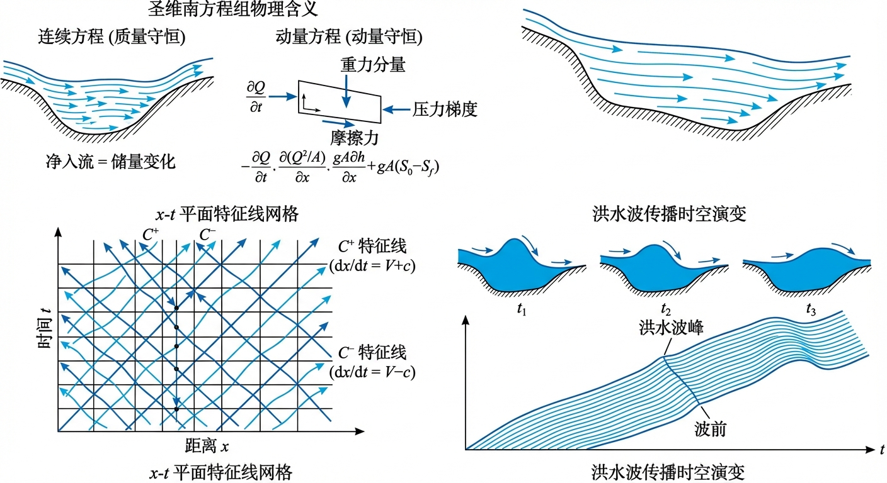
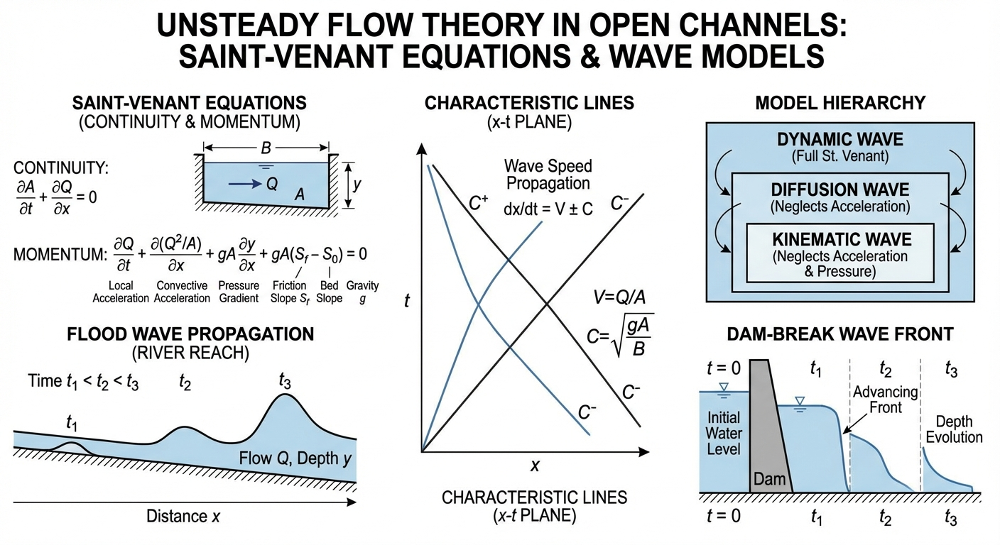
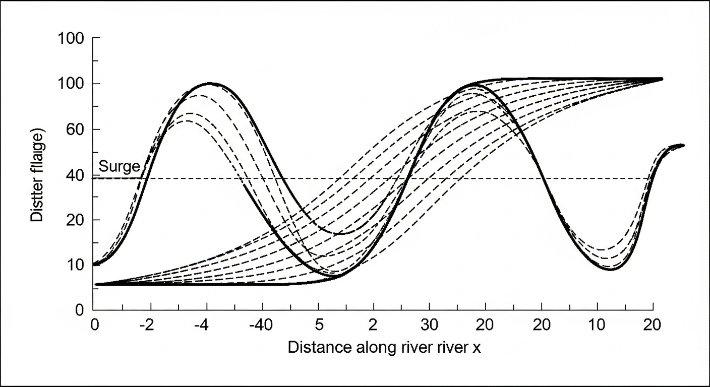
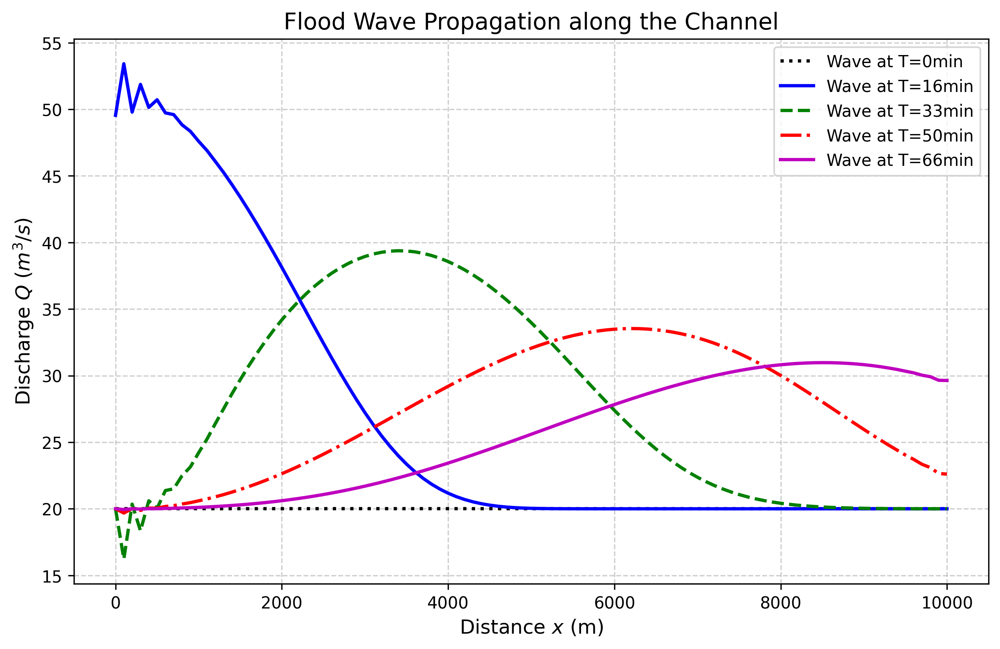
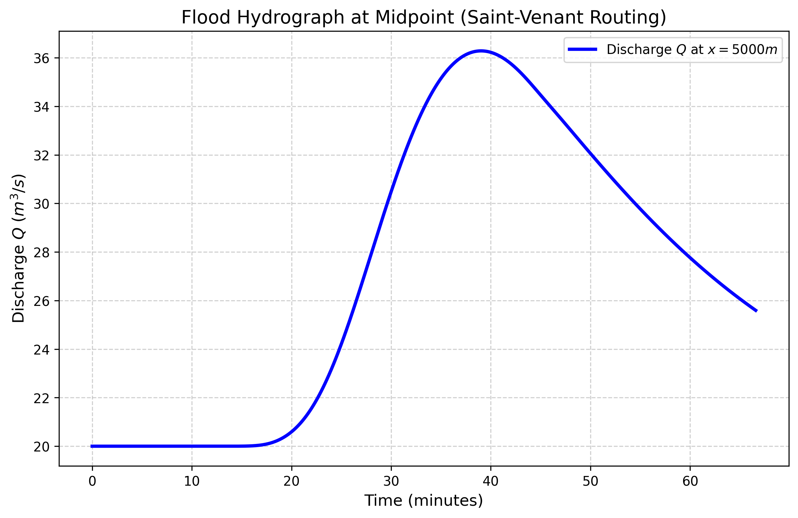

# 第 6 章 非恒定流理论与数值模拟

## 1 学习目标

本章进入明渠水力学最复杂也最核心的领域——一维非恒定流（Unsteady Flow）。读者完成本章学习后，应能够：

(1) 理解 Saint-Venant 方程组（连续性方程和动量方程）的物理内涵与数学结构。

(2) 明确侧向入流项 $q_l$ 的物理意义和量纲。

(3) 掌握洪波的三种简化分类：运动波（Kinematic Wave）、扩散波（Diffusion Wave）和完整动力波（Dynamic Wave），理解各自的简化假设和适用条件。

(4) 掌握 CFL 条件的定量表达式及其在显式差分格式中的约束作用。

(5) 了解 MacCormack 预估-校正格式的基本原理，理解洪波演进中平移与坦化的物理机制。

---

## 2 教材理论

### 2.1 Saint-Venant 方程组

在天然河道或长距离输水渠道中，上游暴雨或闸门开启引起的水流变化不仅沿空间分布，而且随时间剧烈波动。描述这种时空耦合变化的基本数学模型是 1871 年由法国工程师 Barre de Saint-Venant 提出的一维非恒定流方程组（Saint-Venant, 1871），由两个核心方程构成：

**(1) 连续性方程（质量守恒）：**

$$
\frac{\partial A}{\partial t} + \frac{\partial Q}{\partial x} = q_l \tag{6-1}
$$

式中：

- $A$——过水断面面积（$\mathrm{m^2}$）；
- $t$——时间（s）；
- $Q$——流量（$\mathrm{m^3/s}$）；
- $x$——沿渠道纵向的距离坐标（m）；
- $q_l$——单位渠道长度的侧向入流量（$\mathrm{m^2/s}$），即每米渠道长度上汇入（正值）或流出（负值）的流量。该项反映了降雨径流汇入、支流汇入、灌溉引水等侧向水量交换。当 $q_l = 0$ 时，方程退化为无侧向入流的连续性方程。

式 (6-1) 的物理含义：某一段渠道内过水面积随时间的增加率等于上游流入量减去下游流出量加上侧向汇入量。

**(2) 动量方程（牛顿第二定律）：**

$$
\frac{\partial Q}{\partial t} + \frac{\partial}{\partial x}\!\left(\frac{Q^2}{A}\right) + gA\frac{\partial h}{\partial x} = gA(S_0 - S_f) + q_l v_l \tag{6-2}
$$

式中：

- $g$——重力加速度（$9.81\,\mathrm{m/s^2}$）；
- $h$——水深（m）；
- $S_0$——渠底坡度，无量纲；
- $S_f$——摩擦坡度，无量纲，由曼宁公式计算：$S_f = n^2 Q|Q|/(A^2 R^{4/3})$；
- $v_l$——侧向入流的纵向分速度（m/s），通常取零或取主流速度。

等式左边各项的物理意义依次为：局部加速度（非恒定效应）、对流加速度（空间变化效应）、压力梯度力。右边为：重力驱动力与摩擦阻力之差，以及侧向入流引起的动量变化。

Saint-Venant 方程组是一组**双曲型非线性偏微分方程组**（Hyperbolic PDEs），其特征线速度为 $v \pm c$，其中 $c = \sqrt{gA/B}$ 为微波波速（$B$ 为水面宽度）。

### 2.2 洪波分类

Saint-Venant 方程组的完整求解在工程中往往需要大量计算资源。根据不同的简化假设，可以将洪波传播模型分为三个层次：

#### 2.2.1 运动波（Kinematic Wave）

**简化假设**：动量方程中仅保留重力项和摩擦项，忽略局部加速度、对流加速度和压力梯度项。即假设：

$$
S_f = S_0 \tag{6-3}
$$

此时水流的运动完全由底坡和摩擦力的平衡决定，本质上在每个断面都处于"准均匀流"状态。

**控制方程**：将 $S_f = S_0$ 代入曼宁公式可得 $Q = f(A)$（流量仅为面积的函数），连续性方程 (6-1) 变为一阶双曲型方程：

$$
\frac{\partial A}{\partial t} + c_k \frac{\partial A}{\partial x} = q_l \tag{6-4}
$$

其中运动波波速 $c_k = dQ/dA$。

**特征**：洪波沿下游方向以波速 $c_k$ 平移，波形不变（无坦化）。运动波只有平移效应而无扩散效应。

**适用条件**：适用于底坡较陡（$S_0 > 0.001$）、渠道较短、洪波变化较缓的情况。在陡峭山区溪流中，运动波近似通常足够准确。

#### 2.2.2 扩散波（Diffusion Wave）

**简化假设**：在运动波基础上，保留动量方程中的压力梯度项（即水面坡度），但仍忽略局部加速度和对流加速度项。即：

$$
S_f = S_0 - \frac{\partial h}{\partial x} \tag{6-5}
$$

**控制方程**：在一定近似条件下，可将方程化为对流-扩散方程形式：

$$
\frac{\partial Q}{\partial t} + c_k \frac{\partial Q}{\partial x} = D \frac{\partial^2 Q}{\partial x^2} \tag{6-6}
$$

其中扩散系数 $D = Q/(2BS_0)$（$B$ 为水面宽度）。

**特征**：洪波在向下游平移的同时发生**坦化**（衰减），即洪峰流量逐渐降低、洪水过程线变得更加平缓。这与运动波的纯平移行为有本质区别。

**适用条件**：适用于底坡中等（$S_0 = 0.0001$--$0.001$）的河道和渠道。扩散波模型是 Muskingum-Cunge 演算法的理论基础，在水文学中应用极为广泛。

#### 2.2.3 完整动力波（Dynamic Wave / Full Saint-Venant）

**简化假设**：不做任何简化，保留动量方程所有项（局部加速度、对流加速度、压力梯度、重力和摩擦）。

**控制方程**：完整的 Saint-Venant 方程组 (6-1) 和 (6-2)。

**特征**：能够捕捉所有洪波特征，包括急变流过渡（如涌波）、回水效应（下游条件对上游的影响）以及缓流-急流的混合流态。这是精度最高但计算量也最大的模型。

**适用条件**：适用于底坡极缓（$S_0 < 0.0001$）、潮汐影响显著、存在闸门控制或水跃等急变流过渡的情况。在现代调水工程和城市排水管网模拟中，通常必须采用完整动力波模型。

#### 2.2.4 三种模型的比较

| 特征 | 运动波 | 扩散波 | 完整动力波 |
|:-----|:-------|:-------|:-----------|
| 保留的动量项 | 重力 + 摩擦 | + 压力梯度 | 全部 |
| 洪峰平移 | 有 | 有 | 有 |
| 洪峰坦化 | 无 | 有 | 有 |
| 回水效应 | 无 | 近似 | 完整 |
| 适用坡度 | $S_0 > 0.001$ | $0.0001 < S_0 < 0.001$ | 任意 |
| 计算量 | 最小 | 中等 | 最大 |
| 典型应用 | 山区溪流 | 河道演算 | 调水/排水工程 |

### 2.3 有限差分法与 CFL 条件

求解 Saint-Venant 方程组的数值方法主要有有限差分法（FDM）和有限体积法（FVM）。在有限差分法中，将连续的时空域离散为网格：空间步长 $\Delta x$、时间步长 $\Delta t$。

对于显式差分格式（如 MacCormack 格式、Lax-Wendroff 格式），数值稳定性受到 **Courant-Friedrichs-Lewy（CFL）条件** 的严格约束：

$$
Cr = \frac{(|v| + c)\Delta t}{\Delta x} \le 1 \tag{6-7}
$$

式中：

- $Cr$——库朗数（Courant number），无量纲；
- $v$——断面平均流速（m/s）；
- $c$——微波波速（m/s），$c = \sqrt{gA/B}$，对于矩形断面 $c = \sqrt{gh}$；
- $\Delta t$——时间步长（s）；
- $\Delta x$——空间步长（m）。

CFL 条件的物理含义是：信息（扰动）在一个时间步内的传播距离 $(|v|+c)\Delta t$ 不得超过一个空间网格长度 $\Delta x$。如果时间步长设得过大，使得数值计算的信息传播速度慢于物理波的传播速度，计算将因为遗漏关键物理信息而迅速发散（数值爆炸）。

因此，在使用显式格式时，时间步长的上限为：

$$
\Delta t \le \frac{\Delta x}{\max(|v| + c)} \tag{6-8}
$$

### 2.4 MacCormack 预估-校正格式

MacCormack（1969）格式是一种经典的二阶精度显式格式，在计算水力学中应用广泛。其基本思想是通过两步计算消除单侧差分带来的数值耗散。

将 Saint-Venant 方程组改写为守恒向量形式：

$$
\frac{\partial \mathbf{U}}{\partial t} + \frac{\partial \mathbf{F}(\mathbf{U})}{\partial x} = \mathbf{S}(\mathbf{U}) \tag{6-9}
$$

其中状态向量 $\mathbf{U} = [A, Q]^T$，通量向量 $\mathbf{F} = [Q, Q^2/A + gI_1]^T$（$I_1$ 为断面静水压力矩），源项 $\mathbf{S} = [q_l, gA(S_0 - S_f) + q_l v_l]^T$。

**预估步（Predictor）**：使用向前差分：

$$
\mathbf{U}_i^* = \mathbf{U}_i^n - \frac{\Delta t}{\Delta x}\left(\mathbf{F}_{i+1}^n - \mathbf{F}_i^n\right) + \Delta t \, \mathbf{S}_i^n \tag{6-10}
$$

**校正步（Corrector）**：使用向后差分，并对预估值和原始值取平均：

$$
\mathbf{U}_i^{n+1} = \frac{1}{2}\left[\mathbf{U}_i^n + \mathbf{U}_i^* - \frac{\Delta t}{\Delta x}\left(\mathbf{F}_i^* - \mathbf{F}_{i-1}^*\right) + \Delta t \, \mathbf{S}_i^*\right] \tag{6-11}
$$

其中上标 $n$ 表示当前时间层，$*$ 表示预估值，$n+1$ 表示下一时间层；下标 $i$ 表示空间节点编号。

MacCormack 格式的精度为二阶（时间和空间均为二阶），格式简洁，便于编程实现，但受 CFL 条件 (6-7) 约束。

### 2.5 洪波的平移与坦化

洪波在渠道中传播时具有两个重要的物理特征：

**(1) 波形平移（Translation）**：洪水从上游到达下游需要一定的传播时间。洪波的传播速度（波速）通常大于水质点的流速，约为 $c_k = dQ/dA$（运动波波速）。对于宽浅矩形渠道上的曼宁均匀流，$c_k \approx (5/3)v$，即波速约为流速的 5/3 倍。这种时间滞后在长距离输水工程中尤为显著，是造成"大时延系统难以控制"的物理根源。

**(2) 波形坦化（Attenuation）**：由于河床摩擦力的耗散和水流在渠道空间内的扩散效应，洪峰的尖锐程度在传播过程中逐渐被"削平"——洪峰流量沿程衰减，而洪水总历时相应延长。坦化程度取决于渠道长度、底坡、糙率和洪波的初始形态。运动波模型无法反映坦化效应，必须采用扩散波或完整动力波模型才能正确模拟。

---

## 3 典型例题：运动波波速计算

### 3.1 题目

一矩形渠道宽 $B = 10\,\mathrm{m}$，底坡 $S_0 = 0.002$，曼宁糙率 $n = 0.020$。当渠道以均匀流流量 $Q = 30\,\mathrm{m^3/s}$ 运行时，试计算：(a) 正常水深 $h_n$；(b) 微波波速 $c$；(c) 运动波波速 $c_k$；(d) CFL 条件下允许的最大时间步长（取 $\Delta x = 100\,\mathrm{m}$）。

### 3.2 求解过程

**(a) 正常水深 $h_n$：**

矩形断面：$A = Bh = 10h$，$P = B + 2h = 10 + 2h$，$R = A/P = 10h/(10+2h)$。

曼宁公式：$Q = \frac{1}{n}AR^{2/3}S_0^{1/2}$。

$30 = \frac{1}{0.020}\times 10h_n \times \left(\frac{10h_n}{10+2h_n}\right)^{2/3} \times 0.002^{1/2}$

$30 = 50 h_n \times \left(\frac{10h_n}{10+2h_n}\right)^{2/3} \times 0.04472$

$30 = 2.236 h_n \left(\frac{10h_n}{10+2h_n}\right)^{2/3}$

试算 $h_n = 1.5\,\mathrm{m}$：$A = 10\times1.5 = 15\,\mathrm{m^2}$，$P = 10 + 2\times1.5 = 13\,\mathrm{m}$，$R = 15/13 = 1.154\,\mathrm{m}$，$R^{2/3} = 1.102$。

$$Q = \frac{1}{n}AR^{2/3}S_0^{1/2} = \frac{1}{0.020}\times 15 \times 1.102 \times 0.04472 = 36.96\,\mathrm{m^3/s}$$

该值大于目标流量 $30\,\mathrm{m^3/s}$，需减小试算水深。试 $h_n = 1.3\,\mathrm{m}$：$A = 13\,\mathrm{m^2}$，$P = 12.6\,\mathrm{m}$，$R = 1.032\,\mathrm{m}$，$R^{2/3} = 1.021$。

$$Q = \frac{1}{0.020}\times 13 \times 1.021 \times 0.04472 = 29.68\,\mathrm{m^3/s}$$

接近 30。取 $h_n \approx 1.31\,\mathrm{m}$。

验算：$A = 13.1$，$R = 13.1/12.62 = 1.038$，$R^{2/3} = 1.025$。

$Q = 50\times13.1\times1.025\times0.04472 = 30.03$。取 $h_n = 1.31\,\mathrm{m}$。

**(b) 微波波速 $c$（用于 CFL 条件）：**

$$
c = \sqrt{gh_n} = \sqrt{9.81\times1.31} = \sqrt{12.85} = 3.585\,\mathrm{m/s}
$$

断面平均流速 $v = Q/A = 30/13.1 = 2.290\,\mathrm{m/s}$。

**(c) 运动波波速 $c_k$：**

对宽浅矩形断面（$B \gg h$），近似 $R \approx h$，曼宁公式给出 $Q \propto A^{5/3}$，故：

$$
c_k = \frac{dQ}{dA} = \frac{5}{3}v = \frac{5}{3}\times 2.290 = 3.817\,\mathrm{m/s}
$$

**(d) CFL 条件下的最大 $\Delta t$：**

$$
\Delta t_{max} = \frac{\Delta x}{|v| + c} = \frac{100}{2.290 + 3.585} = \frac{100}{5.875} = 17.02\,\mathrm{s}
$$

为保证安全，取 $\Delta t = 15\,\mathrm{s}$，此时 $Cr = 5.875\times15/100 = 0.88 < 1$，满足 CFL 条件。

### 3.3 小结

本例展示了运动波波速和 CFL 条件的计算方法。关键发现：(a) 运动波波速（3.82 m/s）大于流速（2.29 m/s），说明洪波传播速度快于水质点移动速度；(b) CFL 条件严格约束了显式格式的时间步长，在本例中 $\Delta t$ 不得超过 17 s。

---

## 4 工程案例：矩形长渠道洪波演进 MacCormack 差分求解

### 4.1 案例背景

某调水工程干渠长达 10 km。控制中心计划在上游闸门处进行一次放水作业，预计将产生一个持续 30 分钟、峰值为 50 m^3/s 的正弦波形洪水脉冲。下游 5 km 处有一座渡槽，其设计最高承载水位对应 40 m^3/s 的流量。调度员需要精确回答两个问题：洪峰何时到达渡槽？到达时的流量是否会因沿途坦化效应而降至安全线以下？

### 4.2 问题描述

一条长 10000 m、宽 10 m 的矩形渠道（$S_0 = 0.001$，$n = 0.025$），初始以 $Q_0 = 20\,\mathrm{m^3/s}$ 的均匀流恒定运行。

在 $t = 0$ 时刻，上游注入一个正弦洪波：

$$
Q_{in}(t) = \begin{cases} Q_0 + (Q_{peak} - Q_0)\sin\!\left(\frac{\pi t}{T}\right) & 0 \le t \le T \\ Q_0 & t > T \end{cases} \tag{6-12}
$$

其中 $Q_{peak} = 50\,\mathrm{m^3/s}$，$T = 1800\,\mathrm{s}$（30 分钟）。洪峰出现在 $t = 900\,\mathrm{s}$（15 分钟）。

利用完整 Saint-Venant 方程组推演洪波在渠道中的传播过程，并监控中点（$x = 5000\,\mathrm{m}$）处的流量过程线。

**物理场景概化图：**

### 4.3 解题思路

采用 MacCormack 显式预估-校正格式（式 6-10, 6-11）：

(a) 将 Saint-Venant 方程组改写为守恒向量形式 (6-9)，状态向量 $\mathbf{U} = [A, Q]^T$。

(b) CFL 条件约束下，设 $\Delta x = 100\,\mathrm{m}$，$\Delta t = 5\,\mathrm{s}$，使库朗数 $Cr < 1$。

(c) 初始条件：全渠道均匀流，$Q = 20\,\mathrm{m^3/s}$，对应正常水深由曼宁公式求解。

(d) 边界条件：上游为流量时间序列（式 6-12），下游取正常水深（开放边界）。

(e) 两步迭代：预估步用向前差分，校正步用向后差分，取平均值作为最终解。

### 4.4 计算结果

源代码：`assets/ch06/ch06_saint_venant.py`

**洪波空间演进追踪矩阵：**

| 观测点位置 | 洪峰到达时间 (min) | 洪峰流量 ($\mathrm{m^3/s}$) | 洪峰水深 (m) | 备注 |
|:-----------|:----------------:|:----------------:|:------------:|:-----|
| 上游起点 ($x=0$) | 15.0 | 50.00 | 2.71 | 洪波源 |
| 渠道中点 ($x=5000\,\mathrm{m}$) | 39.0 | 36.29 | 2.07 | 显著坦化与平移 |

**空间波形演进图（不同时刻的剖面）：**

**中点（$x=5000\,\mathrm{m}$）时间序列过程线：**

### 4.5 结果分析

(1) **时空滞后**：上游在第 15 分钟爆发洪峰，但直到第 39 分钟洪峰才到达 5 km 外的中点。传播时间为 24 分钟，对应平均波速约 $5000/(24\times60) = 3.47\,\mathrm{m/s}$，略快于均匀流条件下的水质点速度。这种显著的时间滞后在长距离调水工程中是控制系统必须应对的"大时延"问题。

(2) **自然削峰效应**：原本高达 50 m^3/s 的洪峰，在传播 5 km 后衰减至 36.29 m^3/s，削峰率达 $(50-36.29)/50 = 27.4\%$。洪峰水深从 2.71 m 降至 2.07 m。这一自然坦化效应使得渡槽处的流量低于 40 m^3/s 的安全阈值，调度员可以确认不需要采取紧急措施。

(3) **波形展宽**：伴随洪峰削减，洪水过程线的时间基底显著展宽。中点处的洪水历时明显长于上游，这是扩散效应的直接体现。

---

## 5 工业部署建议

(1) **显式格式的稳定性限制**：MacCormack 格式虽然精度高，但受 CFL 条件 (6-7) 的严格约束。对于长达数百公里的调水工程，如果采用精细的空间网格（$\Delta x = 50$--$100\,\mathrm{m}$），所需的极小时间步长将导致计算量巨大。在工业级仿真软件（如 MIKE 11、HEC-RAS、ISIS）中，通常采用无条件稳定的**四点隐式格式（Preissmann 格式）**，允许使用较大的时间步长而不会发散。

(2) **Preissmann 格式简介**：Preissmann（1961）四点隐式格式在时间层 $n$ 和 $n+1$ 之间用加权参数 $\theta$（$0.5 \le \theta \le 1.0$）进行插值，空间上在相邻两点之间取平均。当 $\theta \ge 0.5$ 时，格式无条件稳定（不受 CFL 限制），但需要在每个时间步求解一个大规模的三对角矩阵方程组。

(3) **前馈控制的基础**：对于现代智慧水网调度系统，Saint-Venant 方程的高速数值求解是"数字预见器"的核心。控制系统通过比真实时间快数十至数百倍的超前推演，预测"现在放水，若干小时后下游水位涨多高"，从而提前协同各闸门泵站进行前馈控制。

(4) **模型选择建议**：当仅需粗略估计洪水传播时间时，运动波模型即可满足需求。需要评估洪峰削减量时，扩散波模型（或 Muskingum-Cunge 法）更为适用。对于涉及闸门控制、回水效应或复杂水流过渡的场景，必须采用完整动力波模型。

(5) **网格无关性验证**：在实际工程应用中，应进行网格无关性分析——逐步加密网格，确认计算结果不再随 $\Delta x$ 和 $\Delta t$ 的减小而显著变化，以保证数值解的可靠性。

---

## 6 本章小结

本章系统阐述了明渠一维非恒定流的理论基础与数值模拟方法，主要内容包括：

(1) 推导并解释了 Saint-Venant（1871）方程组——连续性方程 (6-1) 和动量方程 (6-2) 的物理内涵，明确了侧向入流项 $q_l$ 的定义（单位渠道长度侧向入流量，$\mathrm{m^2/s}$）。

(2) 按照简化程度将洪波模型分为三类：运动波（仅重力-摩擦平衡，无坦化）、扩散波（增加压力梯度，有坦化）和完整动力波（全部动量项，精度最高），并给出了各自的适用条件。

(3) 推导了 CFL 条件的定量公式 (6-7)，解释了其物理含义——信息传播速度不得超过网格传播速度。

(4) 介绍了 MacCormack 预估-校正格式的基本原理（式 6-10, 6-11），并通过工程案例展示了洪波的平移（24 分钟延迟）和坦化（27.4% 削峰）两大核心特征。

## 思考题

1. **概念辨析**：运动波、扩散波和完整动力波三种洪水波模型的区别是什么？各自忽略了圣维南方程中的哪些项？在什么条件下可以安全地使用简化模型？

2. **定量计算**：一明渠长 $L = 10\,\mathrm{km}$，底坡 $S_0 = 0.0005$，曼宁糙率 $n = 0.025$，正常水深 $y_n = 2.0\,\mathrm{m}$，底宽 $b = 8.0\,\mathrm{m}$（矩形断面）。(a) 计算运动波速 $c_k = \frac{5}{3}V$；(b) 若时间步长 $\Delta t = 60\,\mathrm{s}$，空间步长 $\Delta x = 500\,\mathrm{m}$，检验 CFL 条件 $\Delta t \leq \Delta x / (V + \sqrt{gy})$ 是否满足。

3. **物理分析**：圣维南方程中的局部惯性项 $\partial V/\partial t$ 和对流惯性项 $V \partial V/\partial x$ 在什么工况下可以忽略？试举出实际工程中需要保留完整动量方程的场景。

4. **综合题**：洪波在传播过程中表现出"平移"和"坦化"两大特征。(a) 这两个特征分别对应圣维南方程中的哪些物理机制？(b) 运动波模型能否描述坦化现象？为什么？

---

## 7 参考文献

[1] Saint-Venant, A.J.C.B. de (1871). Theorie du mouvement non permanent des eaux, avec application aux crues des rivieres et a l'introduction des marees dans leurs lits. *Comptes Rendus des Seances de l'Academie des Sciences*, 73, 147--154, 237--240. (首次提出一维非恒定流基本方程组的经典文献。)

[2] Stoker, J.J. (1957). *Water Waves: The Mathematical Theory with Applications*. New York: Interscience Publishers. (对浅水波方程的数学性质给出了严谨的理论分析。)

[3] Cunge, J.A., Holly, F.M., & Verwey, A. (1980). *Practical Aspects of Computational River Hydraulics*. London: Pitman. (计算水力学的经典著作，系统介绍了有限差分法求解 Saint-Venant 方程的各种格式。)

[4] Chaudhry, M.H. (2008). *Open-Channel Flow*, 2nd edition. New York: Springer. (第 10--12 章详细讨论了非恒定流的数值求解方法。)

[5] Abbott, M.B. (1979). *Computational Hydraulics: Elements of the Theory of Free Surface Flows*. London: Pitman. (从计算数学角度深入分析了各种差分格式的稳定性和精度。)

[6] Chow, V.T. (1959). *Open-Channel Hydraulics*. New York: McGraw-Hill. (第 18 章介绍了非恒定流的基本概念和早期求解方法。)

[7] 吴持恭. (2008). *水力学*（第四版）. 北京: 高等教育出版社. (第 10 章介绍了明渠非恒定流的基本理论。)

[8] Lighthill, M.J., & Whitham, G.B. (1955). On kinematic waves. I. Flood movement in long rivers. *Proceedings of the Royal Society of London A*, 229(1178), 281--316. (运动波理论的奠基性文献。)

[9] Preissmann, A. (1961). Propagation des intumescences dans les canaux et rivieres. *First Congress of the French Association for Computation*, Grenoble, pp. 433--442. (提出了广泛应用于工业级水力学软件的四点隐式差分格式。)

[10] MacCormack, R.W. (1969). The effect of viscosity in hypervelocity impact cratering. *AIAA Paper* 69-354. (MacCormack 预估-校正格式的原始文献。)

[11] 雷晓辉, 龙岩, 许慧敏, 等. 水系统控制论：提出背景、技术框架与研究范式 [J]. 南水北调与水利科技(中英文), 2025, 23(04): 761-769+904. DOI: 10.13476/j.cnki.nsbdqk.2025.0077.

[12] 雷晓辉, 许慧敏, 何中政, 等. 水资源系统分析学科展望：从静态平衡到动态控制 [J]. 南水北调与水利科技(中英文), 2025, 23(04): 770-777. DOI: 10.13476/j.cnki.nsbdqk.2025.0078.
