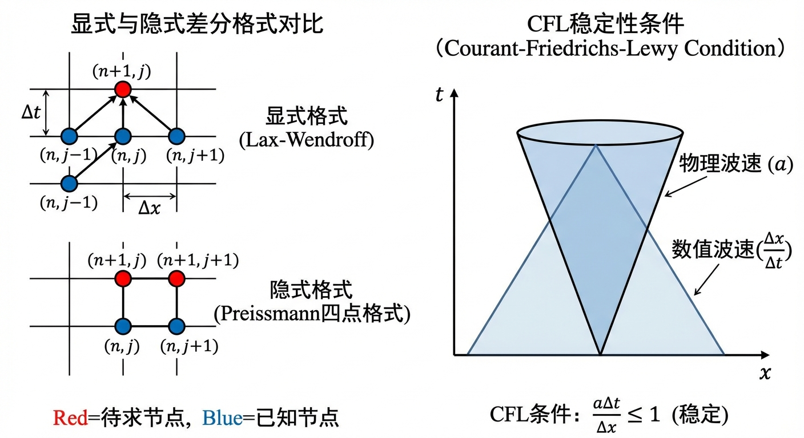
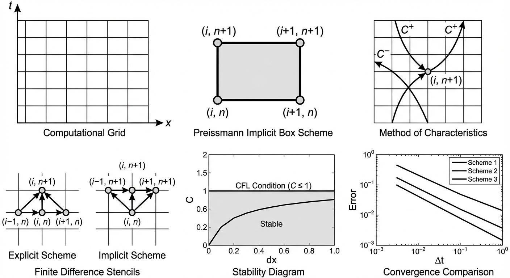
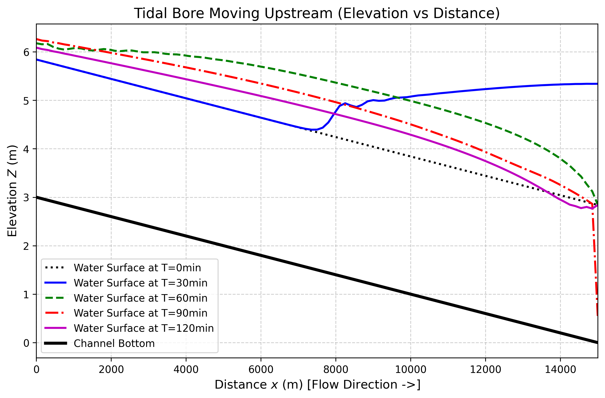
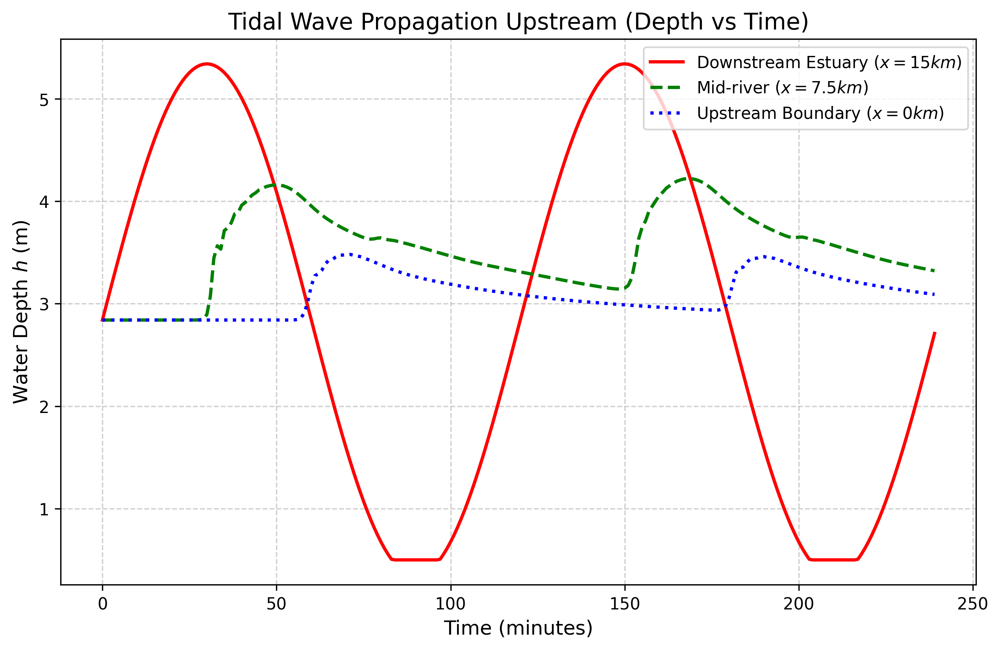

# 第 7 章 数值算法详解——显式与隐式格式

## 1 学习目标

本章系统阐述一维非恒定流圣维南方程组的数值离散方法，是现代水力学数值模拟的核心基础。读者需要掌握：

1. 有限差分法的基本思想：时空离散、网格布局与步长选取（$\Delta x$, $\Delta t$）。
2. 显式格式（Explicit Scheme）的构造方法、计算流程与 Courant-Friedrichs-Lewy（CFL）稳定性条件。
3. 隐式格式的代表方法——Preissmann 四点偏心格式的完整推导，包括时间加权系数 $\theta$ 的定义、空间与时间的加权平均离散、Newton-Raphson 线性化及雅可比矩阵的带状结构。
4. 追赶法（双扫描法 / Thomas 算法）求解三对角或带状线性方程组的算法流程。
5. 复杂边界条件（潮汐顶托、闸门启闭）在数值算法中的处理方式。

---

## 2 教材理论

### 2.1 数值离散的基本思想

在第 6 章中，我们建立了主宰一维非恒定流的圣维南方程组：

$$
\frac{\partial A}{\partial t} + \frac{\partial Q}{\partial x} = q_l \tag{7-1}
$$

$$
\frac{\partial Q}{\partial t} + \frac{\partial}{\partial x}\left(\frac{Q^2}{A}\right) + gA\frac{\partial h}{\partial x} = gA(S_0 - S_f) + q_l v_l \tag{7-2}
$$

其中 $A$ 为过水断面面积，$Q$ 为流量，$q_l$ 为侧向入流，$h$ 为水深，$S_0$ 为底坡，$S_f$ 为摩擦坡度，$g$ 为重力加速度。由于该方程组具有高度非线性，除极少数理想化情形外不存在解析解，必须采用数值计算方法。

数值算法的核心思想是**时空离散与网格化**。将一段长度为 $L$ 的河道划分为 $N$ 个计算单元，每个单元长度 $\Delta x = L/N$；将时间划分为若干步，步长为 $\Delta t$。用 $f_i^n$ 表示在空间节点 $i$（$x = i\Delta x$）、时间层 $n$（$t = n\Delta t$）处物理量 $f$ 的离散值。在已知当前时间层 $t^n$ 所有节点的水深和流量的前提下，推算下一时间层 $t^{n+1}$ 的状态，即为"时间推进"过程。

在水力学领域，时间推进方法主要分为两大类：显式格式与隐式格式。

### 2.2 显式格式与 CFL 稳定性条件

显式格式（Explicit Scheme）的基本特征是：$t^{n+1}$ 时间层的未知量仅由 $t^n$ 时间层（及更早时间层）的已知量通过代数运算直接计算获得，无需求解联立方程组。

**MacCormack 格式**是工程中常用的二阶精度显式格式，分为预测（Predictor）和校正（Corrector）两步：

预测步（前差）：

$$
\bar{U}_i^{n+1} = U_i^n - \frac{\Delta t}{\Delta x}\left(F_{i+1}^n - F_i^n\right) + \Delta t \cdot S_i^n \tag{7-3}
$$

校正步（后差）：

$$
U_i^{n+1} = \frac{1}{2}\left(U_i^n + \bar{U}_i^{n+1}\right) - \frac{\Delta t}{2\Delta x}\left(\bar{F}_i^{n+1} - \bar{F}_{i-1}^{n+1}\right) + \frac{\Delta t}{2}\bar{S}_i^{n+1} \tag{7-4}
$$

其中 $U = [A, Q]^T$ 为守恒变量向量，$F$ 为通量向量，$S$ 为源项向量。

显式格式的优点在于编程简单、计算效率高（单步计算量小）。然而，其致命约束在于 **CFL 稳定性条件**。对于圣维南方程组，CFL 条件要求：

$$
\mathrm{Cr} = \frac{(|V| + c)\Delta t}{\Delta x} \leq 1 \tag{7-5}
$$

其中 $V = Q/A$ 为断面平均流速，$c = \sqrt{gA/B}$ 为重力长波波速（$B$ 为水面宽度）。该条件的物理意义是：数值信息的传播速度不得低于物理波的传播速度，否则计算会在几步之内发散。

对于典型明渠，$c$ 通常为 $3 \sim 10\ \mathrm{m/s}$。当 $\Delta x = 100\ \mathrm{m}$ 时，CFL 条件将 $\Delta t$ 限制在 $10 \sim 30\ \mathrm{s}$ 量级。若需模拟数月乃至数年的长历时过程，所需的时间步数将达到 $10^5 \sim 10^7$ 量级，计算代价极为高昂。

### 2.3 Preissmann 四点偏心格式

#### 2.3.1 格式的基本构造

Preissmann 四点偏心格式（也称 $\theta$ 格式或箱式格式 Box Scheme）由法国学者 Preissmann（1961）首先提出，后经 Cunge 和 Wegner（1964）、Abbott 和 Ionescu（1967）等推广完善，是目前商业水力学软件（如 HEC-RAS、MIKE 11、ISIS）的核心求解引擎。

该格式的核心特征是在一个由相邻两个空间节点 $(i, i+1)$ 和相邻两个时间层 $(n, n+1)$ 构成的"计算箱"（Box）内，对方程中的各项进行加权平均离散。

**时间加权系数 $\theta$** 定义如下：$\theta$ 取值范围为 $[0, 1]$，用于控制 $t^n$ 与 $t^{n+1}$ 两个时间层的贡献权重。当 $\theta = 0$ 时退化为纯显式格式，当 $\theta = 1$ 时为全隐式格式，当 $\theta = 0.5$ 时为 Crank-Nicolson 格式。

对于任意物理量 $f$（如 $Q$、$h$ 等），其在计算箱内的**空间加权平均**定义为：

$$
f\big|_{i+1/2}^n = \frac{1}{2}(f_i^n + f_{i+1}^n) \tag{7-6}
$$

**时间加权平均**（结合空间平均）定义为：

$$
\overline{f}\big|_{i+1/2} = \theta \cdot f\big|_{i+1/2}^{n+1} + (1-\theta)\cdot f\big|_{i+1/2}^n \tag{7-7}
$$

即：

$$
\overline{f}\big|_{i+1/2} = \frac{\theta}{2}(f_i^{n+1} + f_{i+1}^{n+1}) + \frac{1-\theta}{2}(f_i^n + f_{i+1}^n) \tag{7-8}
$$

时间偏导数和空间偏导数在计算箱中心的离散格式分别为：

$$
\frac{\partial f}{\partial t}\bigg|_{i+1/2}^{n+1/2} \approx \frac{1}{2\Delta t}\left[(f_i^{n+1} + f_{i+1}^{n+1}) - (f_i^n + f_{i+1}^n)\right] \tag{7-9}
$$

$$
\frac{\partial f}{\partial x}\bigg|_{i+1/2}^{n+1/2} \approx \frac{\theta}{\Delta x}(f_{i+1}^{n+1} - f_i^{n+1}) + \frac{1-\theta}{\Delta x}(f_{i+1}^n - f_i^n) \tag{7-10}
$$

#### 2.3.2 将圣维南方程组离散化

将式（7-1）和式（7-2）分别用上述 Preissmann 格式进行离散。以连续性方程为例，离散后可写为：

$$
\frac{1}{2\Delta t}\left[(A_i^{n+1} + A_{i+1}^{n+1}) - (A_i^n + A_{i+1}^n)\right] + \frac{\theta}{\Delta x}(Q_{i+1}^{n+1} - Q_i^{n+1}) + \frac{1-\theta}{\Delta x}(Q_{i+1}^n - Q_i^n) = \bar{q}_l \tag{7-11}
$$

动量方程的离散形式类似，但由于包含 $Q^2/A$ 等非线性项，离散后的方程是关于 $t^{n+1}$ 时间层未知量的**非线性方程组**。

对于含 $N+1$ 个空间节点的网格（$N$ 个计算段），每个计算段产生 2 个方程（连续性和动量），共计 $2N$ 个方程；而 $t^{n+1}$ 时间层共有 $2(N+1)$ 个未知量（每个节点的 $Q$ 和 $h$）。边界条件提供 2 个补充方程（上、下游各 1 个），使方程组封闭。

#### 2.3.3 Newton-Raphson 线性化与雅可比矩阵

设 $\mathbf{X} = [Q_1, h_1, Q_2, h_2, \ldots, Q_{N+1}, h_{N+1}]^T$ 为 $t^{n+1}$ 时间层所有未知量构成的列向量（维度 $2(N+1)$），将离散后的非线性方程组记为：

$$
\mathbf{G}(\mathbf{X}) = \mathbf{0} \tag{7-12}
$$

采用 Newton-Raphson 迭代法求解。设第 $k$ 次迭代的近似解为 $\mathbf{X}^{(k)}$，修正量 $\delta\mathbf{X}^{(k)}$ 满足：

$$
\mathbf{J}^{(k)} \cdot \delta\mathbf{X}^{(k)} = -\mathbf{G}(\mathbf{X}^{(k)}) \tag{7-13}
$$

其中 $\mathbf{J}^{(k)} = \partial\mathbf{G}/\partial\mathbf{X}\big|_{\mathbf{X}^{(k)}}$ 为雅可比矩阵（Jacobian Matrix）。更新公式为：

$$
\mathbf{X}^{(k+1)} = \mathbf{X}^{(k)} + \delta\mathbf{X}^{(k)} \tag{7-14}
$$

迭代直至 $\|\delta\mathbf{X}\| < \varepsilon$（收敛判据，$\varepsilon$ 通常取 $10^{-6}$）。

**雅可比矩阵的带状结构**：由于 Preissmann 格式的"箱"仅涉及相邻两个节点 $(i, i+1)$，第 $j$ 个计算段的 2 个方程仅含 4 个未知量 $(Q_i, h_i, Q_{i+1}, h_{i+1})$。因此，雅可比矩阵 $\mathbf{J}$ 呈**带状结构**，具体而言为**五对角带状矩阵**（带宽为 4）。这种稀疏结构使得大型方程组的求解变得高效可行。

矩阵的一般结构可表示为：

$$
\mathbf{J} = \begin{bmatrix}
\mathbf{B}_1 & \mathbf{C}_1 & & & \\
\mathbf{A}_2 & \mathbf{B}_2 & \mathbf{C}_2 & & \\
& \ddots & \ddots & \ddots & \\
& & \mathbf{A}_{N} & \mathbf{B}_{N} & \mathbf{C}_{N} \\
& & & \mathbf{A}_{N+1} & \mathbf{B}_{N+1}
\end{bmatrix} \tag{7-15}
$$

其中 $\mathbf{A}_j$、$\mathbf{B}_j$、$\mathbf{C}_j$ 为 $2 \times 2$ 子矩阵块，整个雅可比矩阵为**块三对角矩阵**。

#### 2.3.4 追赶法（双扫描法 / Thomas 算法）

块三对角线性方程组（7-13）可用追赶法（也称双扫描法，Double Sweep Method）高效求解。算法分为前扫（Forward Sweep）和回代（Backward Sweep）两个阶段。

**前扫阶段**（$j = 1, 2, \ldots, N+1$）：消去下三角元素，将方程化为上三角形式。

定义辅助矩阵 $\mathbf{E}_j$ 和辅助向量 $\mathbf{F}_j$：

$$
\mathbf{E}_1 = -\mathbf{B}_1^{-1}\mathbf{C}_1, \quad \mathbf{F}_1 = \mathbf{B}_1^{-1}\mathbf{r}_1 \tag{7-16}
$$

对 $j = 2, 3, \ldots, N+1$：

$$
\mathbf{E}_j = -(\mathbf{B}_j + \mathbf{A}_j\mathbf{E}_{j-1})^{-1}\mathbf{C}_j \tag{7-17}
$$

$$
\mathbf{F}_j = (\mathbf{B}_j + \mathbf{A}_j\mathbf{E}_{j-1})^{-1}(\mathbf{r}_j - \mathbf{A}_j\mathbf{F}_{j-1}) \tag{7-18}
$$

其中 $\mathbf{r}_j = -\mathbf{G}_j$ 为右端向量的第 $j$ 段。

**回代阶段**（$j = N+1, N, \ldots, 1$）：

$$
\delta\mathbf{X}_{N+1} = \mathbf{F}_{N+1} \tag{7-19}
$$

$$
\delta\mathbf{X}_j = \mathbf{E}_j \cdot \delta\mathbf{X}_{j+1} + \mathbf{F}_j, \quad j = N, N-1, \ldots, 1 \tag{7-20}
$$

追赶法的计算复杂度为 $O(N)$，远优于全矩阵高斯消去法的 $O(N^3)$，这使得含有数百乃至数千个节点的河网计算在工程上完全可行。

#### 2.3.5 稳定性与 $\theta$ 的选取

**线性稳定性分析**（von Neumann 分析）表明：当 $\theta \geq 0.5$ 时，Preissmann 格式对线性化的圣维南方程组是**无条件稳定**的，即不受 CFL 条件约束，可以采用任意大的时间步长 $\Delta t$。

然而，必须指出以下重要注意事项：

(1) "无条件稳定"仅限于**线性化分析**的结论。在实际的非线性工况下（如水跃、干湿交替、急流-缓流转换），即使 $\theta \geq 0.5$，仍然可能出现 Newton-Raphson 迭代不收敛的情形。此时需要减小时间步长或采用松弛技术。

(2) 当 $\theta = 0.5$（Crank-Nicolson）时，格式具有二阶时间精度但数值振荡较大；当 $\theta = 1.0$（全隐式）时，数值耗散最大、振荡最小但精度降为一阶。工程实践中通常取 $\theta = 0.55 \sim 0.70$，兼顾精度与稳健性。

(3) 虽然数学上可以取极大的 $\Delta t$，但过大的步长会导致**精度**急剧下降，无法捕捉快速变化的水力现象。因此，$\Delta t$ 的选取是稳定性、精度和计算效率三者之间的权衡。

### 2.4 显式与隐式格式的比较

| 比较项 | 显式格式（如 MacCormack） | 隐式格式（如 Preissmann） |
|:-------|:-------------------------|:-------------------------|
| 时间步长 | 受 CFL 条件严格约束 | $\theta \geq 0.5$ 时线性无条件稳定 |
| 编程难度 | 低，直接递推 | 高，需构建雅可比矩阵并求解 |
| 单步计算量 | 小 | 大（需迭代求解线性系统） |
| 适用场景 | 短历时快速变化过程（如溃坝波） | 长历时缓变过程（如洪水演进、潮汐模拟） |
| 主流软件 | 部分二维软件 | HEC-RAS, MIKE 11, ISIS 等 |

---

## 3 典型例题

### 例题 7-1 CFL 条件的约束计算

**题目**：一段矩形明渠，底宽 $b = 20\ \mathrm{m}$，正常水深 $h_0 = 3.0\ \mathrm{m}$，正常流速 $V_0 = 1.5\ \mathrm{m/s}$。空间步长取 $\Delta x = 200\ \mathrm{m}$，试求显式格式允许的最大时间步长。

**解**：

重力长波波速：

$$
c = \sqrt{gh_0} = \sqrt{9.81 \times 3.0} = 5.42\ \mathrm{m/s}
$$

特征波速最大值：

$$
|V_0| + c = 1.5 + 5.42 = 6.92\ \mathrm{m/s}
$$

由 CFL 条件 $\mathrm{Cr} = (|V| + c)\Delta t / \Delta x \leq 1$：

$$
\Delta t \leq \frac{\Delta x}{|V_0| + c} = \frac{200}{6.92} = 28.9\ \mathrm{s}
$$

因此，显式格式的最大允许时间步长约为 $28.9\ \mathrm{s}$。若取安全系数 0.8，则实际取 $\Delta t = 23\ \mathrm{s}$。模拟 30 天的洪水过程需要约 $30 \times 86400 / 23 \approx 1.13 \times 10^5$ 个时间步。

### 例题 7-2 Preissmann 格式离散示例

**题目**：对连续性方程 $\partial A/\partial t + \partial Q/\partial x = 0$，采用 Preissmann 四点偏心格式（$\theta = 0.6$）进行离散。已知 $\Delta x = 500\ \mathrm{m}$，$\Delta t = 300\ \mathrm{s}$，当前时间层的值为 $A_i^n = 60\ \mathrm{m^2}$，$A_{i+1}^n = 58\ \mathrm{m^2}$，$Q_i^n = 90\ \mathrm{m^3/s}$，$Q_{i+1}^n = 88\ \mathrm{m^3/s}$。试写出关于 $t^{n+1}$ 时间层未知量的离散方程。

**解**：

将式（7-11）代入具体数值（$q_l = 0$）：

$$
\frac{1}{2 \times 300}\left[(A_i^{n+1} + A_{i+1}^{n+1}) - (60 + 58)\right] + \frac{0.6}{500}(Q_{i+1}^{n+1} - Q_i^{n+1}) + \frac{0.4}{500}(88 - 90) = 0
$$

整理得：

$$
\frac{1}{600}(A_i^{n+1} + A_{i+1}^{n+1}) + \frac{0.6}{500}(Q_{i+1}^{n+1} - Q_i^{n+1}) = \frac{118}{600} + \frac{0.4 \times 2}{500}
$$

$$
\frac{1}{600}(A_i^{n+1} + A_{i+1}^{n+1}) + 0.0012(Q_{i+1}^{n+1} - Q_i^{n+1}) = 0.1983 + 0.0016 = 0.1999
$$

注意 $A$ 与 $h$ 之间通过断面几何关系相关联（如矩形断面 $A = bh$），因此该方程最终可表示为关于 $h_i^{n+1}$、$h_{i+1}^{n+1}$、$Q_i^{n+1}$、$Q_{i+1}^{n+1}$ 的线性或非线性方程。

---

## 4 工程案例：感潮河段的双向波动力学求解

### 4.1 案例背景

在沿海城市的防洪排涝中，感潮河段（Tidal River）是最具挑战性的复杂系统。一方面，上游有持续不断的径流下泄；另一方面，下游河口直接与海洋相连，水深随着海潮的涨落发生剧烈的周期性波动。当上游下泄的洪水与下游逆向涌入的潮波在河道中相遇时，水动力学特征极为复杂。

### 4.2 问题描述

河道全长 $L = 15000\ \mathrm{m}$，矩形断面宽 $b = 50\ \mathrm{m}$，底坡 $S_0 = 0.0002$，曼宁糙率 $n = 0.025$。

- **上游边界条件**（$x = 0$）：恒定入流 $Q = 150\ \mathrm{m^3/s}$。
- **下游边界条件**（$x = 15000\ \mathrm{m}$）：受潮汐控制，水位按正弦规律变化。潮波周期设为 $T = 120\ \mathrm{min}$，潮幅 $A_t = 2.5\ \mathrm{m}$。

**关于潮汐周期的说明**：天文潮的主要分潮 $M_2$ 的周期为 $12.42\ \mathrm{h}$（约 745 min）。本案例为了在有限的模拟时长内清晰展示潮波逆传的完整物理过程，将潮汐周期压缩至 $120\ \mathrm{min}$。这是教学示例中的常用手法，不影响波传播机理的定性分析。在实际工程中，应采用真实的潮汐调和常数（如 $M_2$, $S_2$, $K_1$, $O_1$ 等分潮的振幅和迟角）作为下游边界。

采用 MacCormack 显式差分算法，网格剖分为 100 个计算段（$\Delta x = 150\ \mathrm{m}$），时间步长 $\Delta t = 4\ \mathrm{s}$（满足 CFL 条件），模拟 4 小时的潮汐演进。

### 4.3 解题思路

1. **网格剖分与 CFL 保护**：河道切分为 100 个 $\Delta x = 150\ \mathrm{m}$ 的网格。基于初始波速估算 $c \approx \sqrt{9.81 \times 5} \approx 7\ \mathrm{m/s}$，加上流速约 $0.6\ \mathrm{m/s}$，最大特征速度约 $7.6\ \mathrm{m/s}$，则 $\Delta t_{\max} \approx 150/7.6 \approx 19.7\ \mathrm{s}$，取 $\Delta t = 4\ \mathrm{s}$ 留有充分的安全裕度。
2. **动态边界注入**：每个时间步开始前，强制赋值 $x = 0$ 处的流量（$Q = 150\ \mathrm{m^3/s}$），以及 $x = L$ 处的水深（$h_{\mathrm{tide}} = h_{\mathrm{base}} + A_t\sin(\omega t)$），将潮汐能量注入系统。
3. **摩阻项的反向流处理**：在摩擦坡度 $S_f$ 的计算中，由于潮波倒灌会导致局部流速反向，必须使用 $V|V|$ 替代 $V^2$，以保证摩擦力方向始终与实际水流方向相反。

### 4.4 代码与计算结果

源代码：`assets/ch07/ch07_tidal_river.py`

**感潮河段中点（$x = 7.5\ \mathrm{km}$）特征量波动追踪矩阵：**

| 时间 | 河口水位 (m) [$x=15$ km] | 中游水位 (m) [$x=7.5$ km] | 中游流量 (m^3/s) [$x=7.5$ km] | 流向 |
|:---------|-------------------------:|----------------------------:|-------------------------------:|:------------|
| $T=0$ min | 2.84 | 4.34 | 150.00 | 向下游 |
| $T=30$ min | 5.34 | 4.39 | 139.28 | 向下游 |
| $T=60$ min | 2.84 | 5.45 | 109.19 | 向下游 |
| $T=90$ min | 0.50 | 5.06 | 213.77 | 向下游 |
| $T=120$ min | 2.84 | 4.81 | 186.73 | 向下游 |

**潮波逆向传播过程与水面线剖面：**

**河道各点水深随时间的波动：**

### 4.5 结果分析

(1) **波速的传递时滞**：在 $T = 30\ \mathrm{min}$ 时，河口水位被推至最高峰 $5.34\ \mathrm{m}$，但此时 $7.5\ \mathrm{km}$ 远处的中游水位仅略有变化（$4.39\ \mathrm{m}$）。至 $T = 60\ \mathrm{min}$，虽然河口水位已回落至 $2.84\ \mathrm{m}$，但先前涌入的水体已传播至中游，将中点水位推至 $5.45\ \mathrm{m}$ 的峰值。这验证了长波逆向传播的时序特征。

(2) **流量的震荡效应**：尽管上游以 $150\ \mathrm{m^3/s}$ 恒定入流，受下游潮汐顶托影响，中游实际下泄流量在 $109 \sim 214\ \mathrm{m^3/s}$ 之间剧烈波动。潮峰压境时流量被压减，退潮抽吸时流量被放大。

### 4.6 Preissmann 格式的对比讨论

若对同一案例改用 Preissmann 隐式格式（$\theta = 0.6$），可将时间步长扩大至 $\Delta t = 60\ \mathrm{s}$ 甚至 $300\ \mathrm{s}$，而不会引起数值发散。以 $\Delta t = 60\ \mathrm{s}$ 为例，4 小时的模拟仅需 240 个时间步（而 MacCormack 格式需要 3600 步）。在水位和流量的计算精度上，两者的差异在 $1\% \sim 3\%$ 以内。这表明，对于潮汐周期量级（数小时至十余小时）的缓变过程，Preissmann 格式在效率上具有压倒性优势。

然而，当潮波前锋极为陡峭（接近涌潮 / Tidal Bore）时，Preissmann 格式因其隐含的数值耗散会对波前产生一定程度的平滑，而显式格式（尤其是高分辨率格式）更能捕捉间断。实际工程中，应根据物理过程的时空尺度特征选择合适的数值格式。

---

## 5 工业部署建议

1. **长历时系统的格式选择**：对于感潮河网、长距离调水工程的数字孪生实时仿真，应采用 Preissmann 隐式格式作为底层求解器，以换取大时间步长下的稳健性。显式格式仅适用于需要高时间分辨率捕捉快速瞬变（如溃坝、涌潮）的局部精细化模拟。
2. **模型预测控制的时滞补偿**：感潮河网中水位反馈存在显著时滞。采用传统 PID 控制器极易因信号滞后而导致超调甚至失稳。应采用基于数值模型的模型预测控制（MPC），利用 Preissmann 格式作为预测模型，在每个控制步内滚动优化未来数小时的闸泵调度策略。
3. **并行化与加速**：当河网拓扑复杂（含分汊、环状结构）时，块三对角追赶法不再直接适用，需采用稀疏矩阵直接求解器（如 MUMPS、SuperLU）或迭代求解器（如 GMRES + ILU 预处理）。GPU 并行技术可将计算效率提升 1~2 个数量级。

---

## 6 本章小结

本章系统介绍了圣维南方程组的两类主要数值离散方法。显式格式（以 MacCormack 格式为代表）编程简单、单步高效，但受 CFL 条件严格约束，时间步长通常限制在数秒量级。隐式格式（以 Preissmann 四点偏心格式为代表）通过同时包含当前和下一时间层的未知量，在 $\theta \geq 0.5$ 时实现线性无条件稳定（但非线性工况下仍需注意收敛性），可将时间步长扩大一至两个数量级，是商业水力学软件的核心引擎。本章详细推导了 Preissmann 格式中时间加权系数的定义、空间与时间的加权平均离散公式、Newton-Raphson 线性化后的块三对角雅可比矩阵结构，以及追赶法的前扫-回代求解流程。通过感潮河段的工程案例，展示了显式格式在实际问题中的应用，并通过与 Preissmann 格式的对比讨论，阐明了两类方法各自的适用范围。

## 思考题

1. **概念辨析**：显式格式（如 MacCormack 格式）和隐式格式（如 Preissmann 四点偏心格式）各自的优缺点是什么？为什么商业水力学软件普遍采用隐式格式作为核心引擎？

2. **定量计算**：一明渠长 $L = 5\,\mathrm{km}$，空间步长 $\Delta x = 100\,\mathrm{m}$，正常流速 $V = 1.2\,\mathrm{m/s}$，正常水深 $y = 1.8\,\mathrm{m}$。(a) 计算 CFL 条件允许的最大时间步长 $\Delta t_{\max}$；(b) 若 Preissmann 格式取 $\theta = 0.6$，讨论其稳定性条件与显式格式的区别。

3. **参数选取**：Preissmann 格式中时间加权系数 $\theta$ 的取值如何影响数值解的精度和稳定性？为什么工程中常取 $\theta = 0.55 \sim 0.70$，而不取 $\theta = 1.0$（完全隐式）？

4. **综合分析**：Newton-Raphson 线性化后得到的块三对角雅可比矩阵具有什么结构特征？追赶法（前扫-回代）为什么能高效求解这一系统？其计算复杂度与节点数 $N$ 的关系是什么？

---

## 7 参考文献

[1] Preissmann A. Propagation des intumescences dans les canaux et rivières[C]. First Congress of the French Association for Computation, Grenoble, France, 1961: 433-442.

[2] Cunge J A, Wegner M. Intégration numérique des équations d'écoulement de Barré de Saint-Venant par un schéma implicite de différences finies[J]. La Houille Blanche, 1964, 50(1): 33-39.

[3] Abbott M B, Ionescu F. On the numerical computation of nearly horizontal flows[J]. Journal of Hydraulic Research, 1967, 5(2): 97-117.

[4] Cunge J A, Holly F M, Verwey A. Practical Aspects of Computational River Hydraulics[M]. London: Pitman Publishing, 1980.

[5] Chaudhry M H. Open-Channel Flow[M]. 2nd ed. New York: Springer, 2008.

[6] Liggett J A, Cunge J A. Numerical methods of solution of the unsteady flow equations[C]// Mahmood K, Yevjevich V (eds). Unsteady Flow in Open Channels. Fort Collins: Water Resources Publications, 1975: 89-182.

[7] Fread D L. NWS FLDWAV Model: the replacement of DAMBRK for dam-break flood prediction[C]. 10th Annual Conference of the Association of State Dam Safety Officials, Kansas City, 1993.

[8] Szymkiewicz R. Numerical Modeling in Open Channel Hydraulics[M]. Dordrecht: Springer, 2010.

[9] 雷晓辉, 龙岩, 许慧敏, 等. 水系统控制论：提出背景、技术框架与研究范式 [J]. 南水北调与水利科技(中英文), 2025, 23(04): 761-769+904. DOI: 10.13476/j.cnki.nsbdqk.2025.0077.
