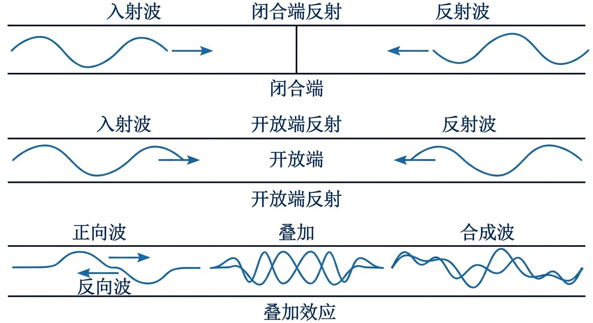
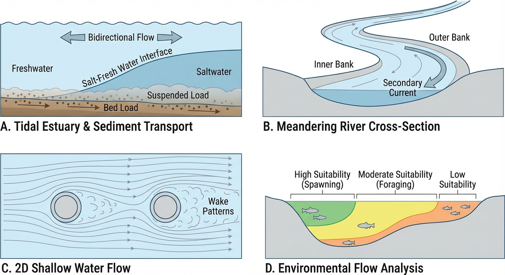
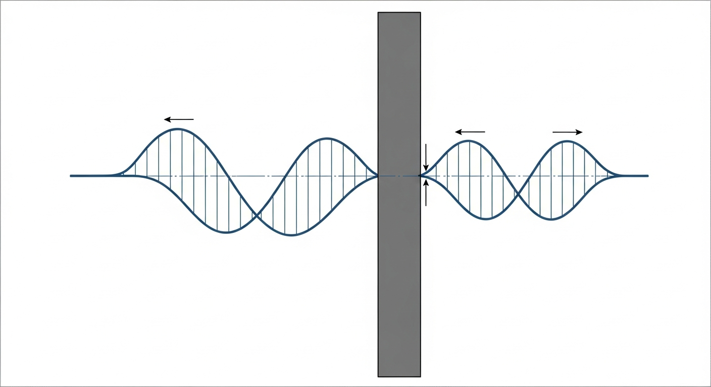
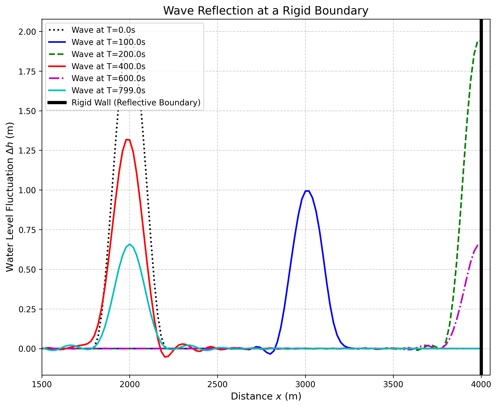
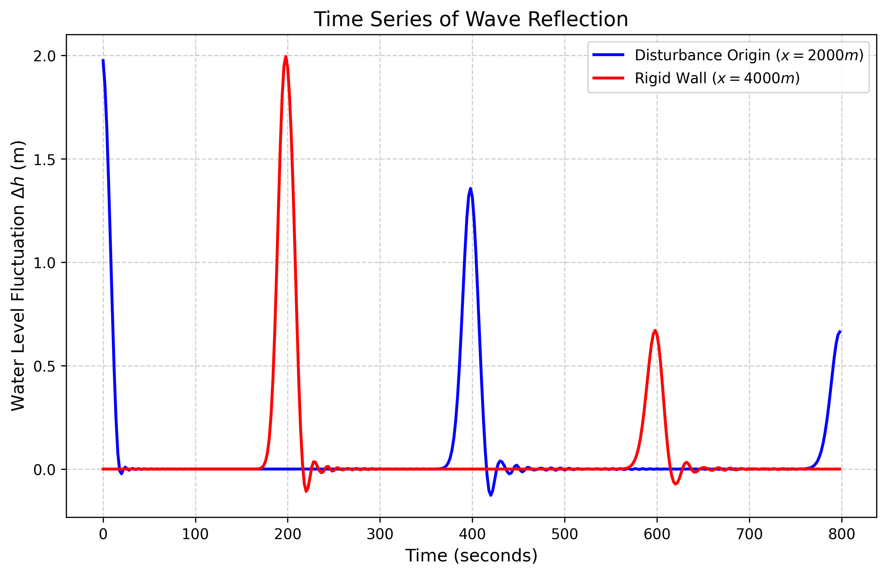

# 第 8 章 波的反射与叠加

## 1 学习目标

本章深入分析明渠中水波的反射与叠加现象，这是理解封闭或半封闭水域（如船闸闸室、调压室、港湾）中波动行为的理论基础。读者需要掌握：

1. 线性化一维波动方程的推导过程与物理意义。
2. 小扰动水波的双向传播特性（d'Alembert 解）。
3. 刚性壁全反射边界的物理条件及其数学描述。
4. 透射边界的处理方法（零阶外推、Sommerfeld 辐射条件、特征线法外推）。
5. 入射波与反射波持续叠加形成驻波（Standing Wave）的机制，节点（Node）与腹点（Antinode）的概念。

---

## 2 教材理论

### 2.1 线性波动方程的推导

在第 6 章建立的圣维南方程组中，若忽略摩擦项（$S_f = 0$）、底坡项（$S_0 = 0$）和对流加速度项（$\partial(Q^2/A)/\partial x$），并假设水面扰动相对于静水深 $h_0$ 极为微小（$|\eta| \ll h_0$，其中 $\eta$ 为偏离静水面的扰动高度），则方程组可线性化为：

连续性方程：

$$
B_0 \frac{\partial \eta}{\partial t} + A_0 \frac{\partial u}{\partial x} = 0 \tag{8-1}
$$

动量方程：

$$
\frac{\partial u}{\partial t} + g\frac{\partial \eta}{\partial x} = 0 \tag{8-2}
$$

其中 $B_0$ 为静水面宽度，$A_0$ 为静水过水面积，$u$ 为断面平均流速的扰动量。对矩形断面，$A_0 = B_0 h_0$。

将式（8-2）对 $x$ 求偏导，式（8-1）对 $t$ 求偏导，消去 $u$，可得经典的一维线性波动方程：

$$
\frac{\partial^2 \eta}{\partial t^2} = c^2 \frac{\partial^2 \eta}{\partial x^2} \tag{8-3}
$$

其中 $c = \sqrt{gA_0/B_0}$ 为重力长波波速。对矩形断面，$c = \sqrt{gh_0}$。该波速仅取决于静水深，与扰动的振幅和形状无关，这是线性化假设的直接结果。在典型明渠水深条件下（$h_0 = 1 \sim 5\ \mathrm{m}$），重力长波波速约为 $3 \sim 7\ \mathrm{m/s}$，远低于有压管道中的水锤波速。

**小扰动假设的适用范围**：严格而言，线性化要求扰动振幅与静水深之比 $|\eta|/h_0 \ll 1$，通常取 $|\eta|/h_0 < 0.05$ 作为近似适用的上限。当该比值较大时，非线性效应（如波形畸变、波前陡化）不可忽略，需回到完整的圣维南方程组求解。

### 2.2 d'Alembert 通解与波的分裂性

线性波动方程（8-3）的通解为 d'Alembert 公式：

$$
\eta(x, t) = F(x - ct) + G(x + ct) \tag{8-4}
$$

其中 $F$ 为正向传播波（$+x$ 方向），$G$ 为反向传播波（$-x$ 方向），两者的函数形式由初始条件和边界条件确定。

这揭示了波的两个根本规律：

(1) **分裂性**：若在 $t = 0$ 时刻于 $x = x_0$ 处产生一个初始扰动 $\eta(x, 0) = \phi(x)$，且初始速度为零 $\partial\eta/\partial t|_{t=0} = 0$，则：

$$
\eta(x, t) = \frac{1}{2}\phi(x - ct) + \frac{1}{2}\phi(x + ct) \tag{8-5}
$$

即初始扰动分裂为两个振幅减半的子波，分别以 $+c$ 和 $-c$ 的速度向相反方向传播。这一分裂过程严格遵守能量守恒：两个子波各携带原始扰动能量的一半。

(2) **叠加性**（Superposition Principle）：当两个波在空间中相遇时，该点的水面偏移等于两个波幅值的代数和。两波穿越后恢复各自原有的波形和速度，互不影响。

### 2.3 刚性壁全反射边界

#### 2.3.1 物理条件

当波遇到一堵绝对刚性、不可逾越的壁面（如大坝面、封闭闸门）时，由于壁面不可穿透，水质点在壁面处的法向速度必须为零：

$$
u\big|_{x = L} = 0 \tag{8-6}
$$

这是刚性壁反射的**根本物理条件**。该条件的物理含义十分直观：壁面不允许水体穿透，因此壁面处的水流只能沿壁面做切向运动，法向分量必须为零。

#### 2.3.2 与 Neumann 边界条件的关系

由线性化的动量方程（8-2），将 $u = 0$ 的条件代入：

$$
\frac{\partial u}{\partial t}\bigg|_{x=L} = -g\frac{\partial \eta}{\partial x}\bigg|_{x=L} = 0
$$

由于 $g \neq 0$，必须有：

$$
\frac{\partial \eta}{\partial x}\bigg|_{x=L} = 0 \tag{8-7}
$$

这正是数学上的 **Neumann 边界条件**（法向导数为零）。因此，Neumann 条件并非独立的假设，而是通过线性化动量方程从 $u = 0$ 的物理条件**间接推导**出来的。两者通过关系 $u \propto -\partial\eta/\partial x$（由式 8-2 对时间积分可得）相互关联，本质上是同一物理约束的不同数学表达形式。

#### 2.3.3 反射波的构造

为满足壁面处 $\partial\eta/\partial x = 0$ 的条件，可采用**镜像法**（Method of Images）：在壁面的虚拟空间中放置一个与入射波关于壁面对称的"虚像波"。当入射波 $F(x - ct)$ 到达壁面时，产生一个波幅相同、波形相同但传播方向相反的反射波 $G(x + ct)$。

在壁面处，入射波与反射波同相叠加，导致该处的水面偏移瞬间达到入射波幅值的两倍：

$$
\eta_{\max}\big|_{x=L} = 2 \times \eta_{\mathrm{incident}} \tag{8-8}
$$

这一结论在工程上极为重要：封闭端的设计干舷（超高）必须按照两倍入射波高预留，否则将面临越浪甚至漫顶的风险。

### 2.4 驻波分析

#### 2.4.1 驻波的形成

当入射波在刚性壁反射后持续向回传播，而新的入射波继续不断到来时（如周期性波源），入射波与反射波在空间中持续叠加，形成**驻波**（Standing Wave）。

设入射波为简谐波 $\eta_I = a\cos(kx - \omega t)$，反射波为 $\eta_R = a\cos(kx + \omega t)$（壁面位于 $x = L$，反射波幅等于入射波幅），则叠加后的合成波为：

$$
\eta = \eta_I + \eta_R = 2a\cos(kx)\cos(\omega t) \tag{8-9}
$$

其中 $k = 2\pi/\lambda$ 为波数（$\lambda$ 为波长），$\omega = 2\pi/T_w$ 为圆频率（$T_w$ 为波周期），且 $c = \omega/k$。

式（8-9）表明，合成波不再是行进波，而是一个空间上振幅随 $\cos(kx)$ 变化、时间上按 $\cos(\omega t)$ 整体振荡的驻波。

#### 2.4.2 节点与腹点

**节点（Node）**：$\cos(kx) = 0$ 的位置，即 $x = (2m+1)\lambda/4$（$m = 0, 1, 2, \ldots$）。在节点处，水面始终保持静止（$\eta = 0$），无论时间如何变化。

**腹点（Antinode）**：$|\cos(kx)| = 1$ 的位置，即 $x = m\lambda/2$（$m = 0, 1, 2, \ldots$）。在腹点处，水面振幅达到最大值 $2a$，为入射波幅的两倍。

节点与腹点在空间上等间距交替分布，相邻节点（或腹点）之间的距离为 $\lambda/2$。在刚性壁面处，由于反射条件要求 $\partial\eta/\partial x = 0$，壁面必然位于腹点上。

**驻波的工程意义**：在封闭或半封闭水域（如港湾、船闸、调压室）中，若外部激励频率与水域固有频率接近，将发生共振，驻波振幅急剧增大，可能导致严重的波浪灾害。封闭水域长度为 $L$ 时，基频振荡周期为 $T_1 = 2L/c$，即水波在水域内完成一次完整往返所需的时间。高阶振荡频率为基频的整数倍。

### 2.5 透射边界的处理方法

在数值模拟中，计算域的边界往往是人为截取的，需要让波无反射地通过边界，否则虚假反射波会污染计算结果。常用的处理方法包括：

**(1) 零阶外推**（最简单）：

$$
\eta_0^{n+1} = \eta_1^n \tag{8-10}
$$

即将边界节点的值设为相邻内部节点上一时间步的值。此方法实现简单，但对斜入射波和频散波存在一定的虚假反射。

**(2) Sommerfeld 辐射条件**（一阶吸收边界）：

$$
\frac{\partial \eta}{\partial t} + c\frac{\partial \eta}{\partial x} = 0 \tag{8-11}
$$

即要求边界上的波场满足纯外向传播的单向波动方程。离散后：

$$
\eta_0^{n+1} = \eta_0^n - \frac{c\Delta t}{\Delta x}(\eta_0^n - \eta_1^n) \tag{8-12}
$$

当 Courant 数 $c\Delta t/\Delta x = 1$ 时，Sommerfeld 条件对法向入射波实现完美吸收（零反射）。在实际计算中，由于 Courant 数通常略小于 $1$，仍会产生微小的虚假反射，但其量级远优于零阶外推。

**(3) 特征线法外推**：利用圣维南方程组的特征线理论，沿出射特征线 $dx/dt = V + c$ 或 $dx/dt = V - c$ 进行外推，同时保持 Riemann 不变量守恒。该方法物理基础最为严密，适用于非线性问题，但实现较为复杂。

---

## 3 典型例题

### 例题 8-1 波的分裂与传播时间计算

**题目**：一段平底矩形渠道长 $L = 5000\ \mathrm{m}$，静水深 $h_0 = 4.0\ \mathrm{m}$。在 $t = 0$ 时刻，$x = 1000\ \mathrm{m}$ 处产生一个高 $0.15\ \mathrm{m}$ 的扰动脉冲。求：(a) 波速；(b) 向右传播的子波到达 $x = 5000\ \mathrm{m}$ 处刚性壁的时间；(c) 壁面处的最大水面偏移。

**解**：

(a) 波速 $c = \sqrt{gh_0} = \sqrt{9.81 \times 4.0} = 6.26\ \mathrm{m/s}$

(b) 向右传播距离 $\Delta x = 5000 - 1000 = 4000\ \mathrm{m}$

到达时间 $t = 4000/6.26 = 639\ \mathrm{s} \approx 10.7\ \mathrm{min}$

(c) 初始脉冲高度 $0.15\ \mathrm{m}$，分裂后向右子波高度 $0.15/2 = 0.075\ \mathrm{m}$

壁面反射叠加：$\eta_{\max} = 2 \times 0.075 = 0.15\ \mathrm{m}$

验证小扰动假设：$\eta/h_0 = 0.15/4.0 = 0.0375 < 0.05$，满足线性化条件。

### 例题 8-2 驻波的节点与腹点位置

**题目**：一段封闭矩形渠道长 $L = 200\ \mathrm{m}$，右端为刚性壁，左端有一简谐波源产生波长 $\lambda = 100\ \mathrm{m}$ 的入射波。求驻波的节点和腹点位置。

**解**：

以右端壁面为坐标原点（$x' = L - x$），壁面位于 $x' = 0$。壁面处为腹点。

腹点位置：$x' = m \cdot \lambda/2 = 0, 50, 100, 150, 200\ \mathrm{m}$（$m = 0, 1, 2, 3, 4$）

即原坐标 $x = 200, 150, 100, 50, 0\ \mathrm{m}$

节点位置：$x' = (2m+1)\lambda/4 = 25, 75, 125, 175\ \mathrm{m}$（$m = 0, 1, 2, 3$）

即原坐标 $x = 175, 125, 75, 25\ \mathrm{m}$

因此，在渠道中共有 5 个腹点和 4 个节点交替分布，壁面处必为腹点。

---

## 4 工程案例：水涌在刚性挡水墙处的反射效应

### 4.1 案例背景

某水库有一条长 $4000\ \mathrm{m}$、连接抽水蓄能电站下水库的平底引水渠。渠道右端（$x = 4000\ \mathrm{m}$）是一道坚固的挡水闸门（刚性壁）。某日，因山体滑坡在渠道正中央（$x = 2000\ \mathrm{m}$）激起一个高达 $2.0\ \mathrm{m}$ 的水涌。工程师需评估：该水涌在传播到右端闸门时，反射叠加效应会导致多大的水位抬升？

**关于初始扰动幅度的说明**：本案例中初始扰动 $2.0\ \mathrm{m}$ 占静水深（约 $10\ \mathrm{m}$）的 $20\%$，已超出严格的小扰动假设范围（$|\eta|/h_0 < 5\%$）。采用线性波动方程求解的结果具有定性指导意义，但定量精度有所下降。如需更精确的分析，应采用完整的非线性圣维南方程组进行数值模拟。本案例保留此参数设定，以便在教学中更清晰地展示波的分裂与反射机制。

### 4.2 问题描述

- 渠道长度 $L = 4000\ \mathrm{m}$，波速 $c = 10\ \mathrm{m/s}$（对应静水深约 $10.2\ \mathrm{m}$）。
- $t = 0$ 时刻，在 $x = 2000\ \mathrm{m}$ 处生成一个高 $2.0\ \mathrm{m}$、宽约 $400\ \mathrm{m}$ 的钟形扰动脉冲。
- 左侧边界（$x = 0$）为开阔水域（透射边界，波可自由穿透逃逸）。
- 右侧边界（$x = 4000\ \mathrm{m}$）为刚性壁（全反射边界）。

### 4.3 解题思路

采用蛙跳法（Leapfrog Scheme）求解二阶波动方程，这是一种保能量、无数值耗散的显式时间推进格式：

$$
\eta_i^{n+1} = 2\eta_i^n - \eta_i^{n-1} + \left(\frac{c\Delta t}{\Delta x}\right)^2 (\eta_{i+1}^n - 2\eta_i^n + \eta_{i-1}^n) \tag{8-13}
$$

参数设定：$\Delta x = 20\ \mathrm{m}$，$\Delta t = 1\ \mathrm{s}$，Courant 数 $c\Delta t/\Delta x = 0.5 < 1$，满足 CFL 条件。

边界处理：
- 左端透射边界：采用零阶外推 $\eta_0^{n+1} = \eta_1^n$。
- 右端全反射边界：强加对称条件 $\eta_N^{n+1} = \eta_{N-1}^{n+1}$（对应 $\partial\eta/\partial x = 0$）。

### 4.4 代码与计算结果

源代码：`assets/ch08/ch08_wave_reflection.py`

**波的生命周期与反射叠加追踪矩阵：**

| 事件 | 时间 (s) | 位置 | 最大振幅 (m) |
|:----------------------------|----------:|:-----------|------------------:|
| 初始脉冲生成 | 0 | $x=2000$ m | 2.0 |
| 波分裂（向右子波） | 100 | $x \approx 3000$ m | 1.0 |
| 波分裂（向左子波） | 100 | $x \approx 1000$ m | 1.0 |
| 撞击刚性壁 | 198 | $x=4000$ m | 2.0 |
| 反射波返回初始位置 | 398 | $x=2000$ m | 1.0 |

**波形空间演进与反射剖面图：**

**特定观测点水位波动时间序列：**

### 4.5 结果分析

(1) **对称分裂**：$t = 0$ 时产生的 $2.0\ \mathrm{m}$ 初始扰动脉冲，在 $100\ \mathrm{s}$ 后分裂为两个等幅子波（向左和向右各 $1.0\ \mathrm{m}$），严格遵循能量守恒的分裂规律。

(2) **反射叠加翻倍**：向右的子波（$1.0\ \mathrm{m}$）以 $10\ \mathrm{m/s}$ 传播 $2000\ \mathrm{m}$，在 $t \approx 198\ \mathrm{s}$ 时撞击右侧刚性壁。在撞击瞬间，入射与反射同相叠加，壁面处水位从 $1.0\ \mathrm{m}$ 翻倍至 $2.0\ \mathrm{m}$。

(3) **无损返回**：撞击完成后，反射波携带 $1.0\ \mathrm{m}$ 的振幅原路返回，在 $t \approx 398\ \mathrm{s}$ 时完整无缺地经过初始出生地（$x = 2000\ \mathrm{m}$），波形、宽度和斜率均未改变，体现了线性叠加的无损特性。需要指出的是，这种无耗散传播是忽略摩擦后的理想结果；实际渠道中的底壁摩擦和紊动会逐渐削弱波幅，使反射波在长距离传播后显著衰减。

---

## 5 工业部署建议

1. **封闭末端的干舷设计**：在任何具有封闭末端的水工构筑物（如船闸尽头、倒虹吸死角、调压室）中，干舷（超高）不能仅按平水期的最大涌浪高度预留，必须考虑反射叠加效应，按入射波高的两倍进行设计。
2. **消能措施**：大型渡槽或电站引水渠的末端若采用完全刚性混凝土墙，反复的驻波反射会引发结构疲劳。工程中常在末端墙壁前增设多孔消能板或带坡度的"滩涂吸收带"，通过制造边界摩擦将反射系数从 $1.0$ 降至 $0.2$ 以下。
3. **共振风险评估**：对于港湾、船闸等半封闭水域，必须分析其固有振荡频率。若外部激励（如潮汐、航行波）的频率接近固有频率，将激发强烈的驻波共振。设计阶段应通过数值模拟进行频率扫描分析，并在必要时调整水域几何尺寸以规避共振。
4. **数值模拟中的边界选择**：在工程级水动力学数值模型中，计算域边界的处理对模拟精度影响显著。对于需要模拟长时间过程的工况，推荐采用特征线法外推或 Sommerfeld 辐射条件处理开放边界，避免零阶外推引起的虚假反射在长时间积累后污染整个计算域的结果。

---

## 6 本章小结

本章从圣维南方程组出发，通过忽略摩擦和非线性项，推导了一维线性波动方程及其 d'Alembert 通解，阐明了小扰动波的分裂性和叠加性。重点分析了刚性壁全反射边界的物理条件（法向速度 $u = 0$）及其与 Neumann 条件（$\partial\eta/\partial x = 0$）的间接关联（通过线性化动量方程 $u \propto -\partial\eta/\partial x$）。在此基础上，建立了驻波（Standing Wave）的理论框架，明确了节点（Node，振幅恒为零）和腹点（Antinode，振幅达最大值）的概念和空间分布规律。讨论了透射边界的三种处理方法，指出 Sommerfeld 辐射条件和特征线法外推在精度上优于零阶外推。工程案例虽然初始扰动幅度已超出严格的小扰动假设范围，但仍清晰地展示了波分裂、反射翻倍和无损返回的完整过程。从控制工程的视角看，波的反射与叠加效应是长距离输水渠道自动控制中必须考虑的动态特性——闸门调节产生的水力扰动会在渠道两端之间往复反射，如果控制器的采样周期与波的往返周期产生共振，将严重威胁系统稳定性。

## 思考题

1. **概念辨析**：驻波中的"节点"（Node）和"腹点"（Antinode）分别有什么物理特征？它们在空间上如何分布？一根长度为 $L$ 的封闭渠道中，基频驻波的波长是多少？

2. **定量计算**：一矩形明渠长 $L = 2000\,\mathrm{m}$，水深 $y = 3.0\,\mathrm{m}$。(a) 计算浅水长波波速 $c = \sqrt{gy}$；(b) 若在渠道一端产生小扰动，计算波到达另一端并反射回到出发点的时间；(c) 计算基频驻波的振荡周期。

3. **波的叠加**：用 d'Alembert 通解解释为什么一个行波在刚性壁全反射后会产生"振幅翻倍"现象。这对输水渠道的安全运行有何工程意义？

4. **边界条件**：比较 Sommerfeld 辐射条件、特征线法外推和零阶外推三种透射边界处理方法的精度和适用场景。为什么零阶外推在工程中精度最低？

---

## 7 参考文献

[1] Stoker J J. Water Waves: The Mathematical Theory with Applications[M]. New York: Interscience Publishers, 1957.

[2] Lighthill J. Waves in Fluids[M]. Cambridge: Cambridge University Press, 1978.

[3] Chaudhry M H. Open-Channel Flow[M]. 2nd ed. New York: Springer, 2008.

[4] Lamb H. Hydrodynamics[M]. 6th ed. Cambridge: Cambridge University Press, 1932.

[5] Cunge J A, Holly F M, Verwey A. Practical Aspects of Computational River Hydraulics[M]. London: Pitman Publishing, 1980.

[6] Trefethen L N. Finite difference and spectral methods for ordinary and partial differential equations[M]. Cornell University, 1996.

[7] Engquist B, Majda A. Absorbing boundary conditions for the numerical simulation of waves[J]. Mathematics of Computation, 1977, 31(139): 629-651.

[8] HENDERSON F M. Open channel flow[M]. New York: Macmillan, 1966.

[9] 赵振兴, 何建京, 王忖. 水力学[M]. 3版. 北京: 清华大学出版社, 2021.
