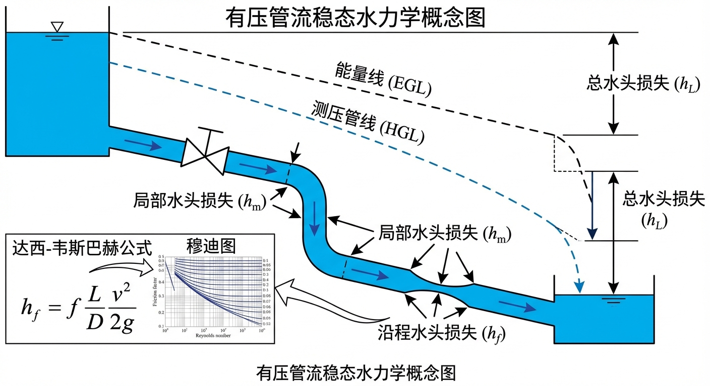
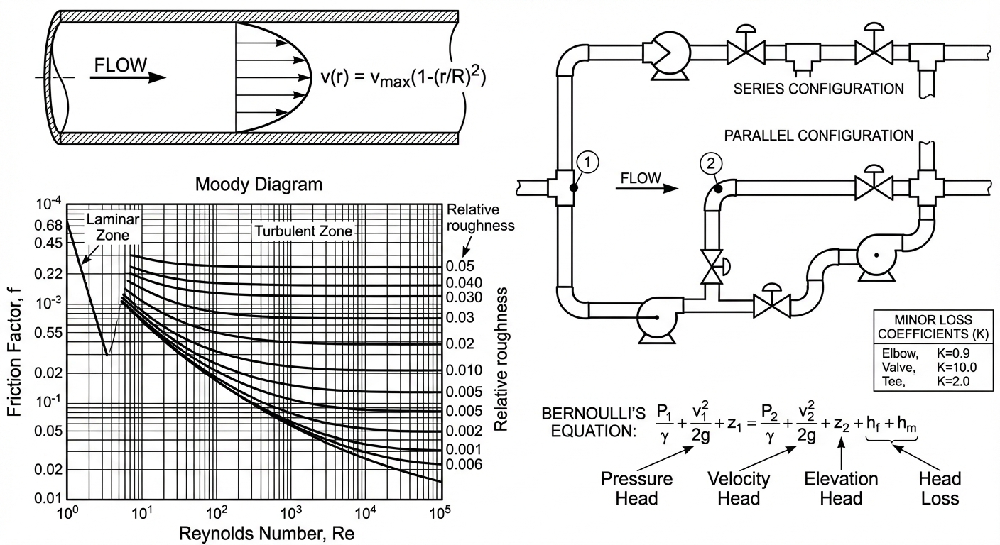
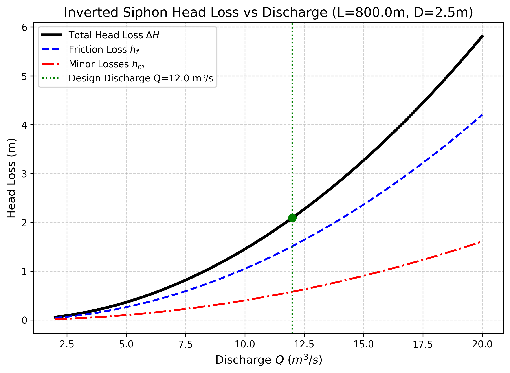
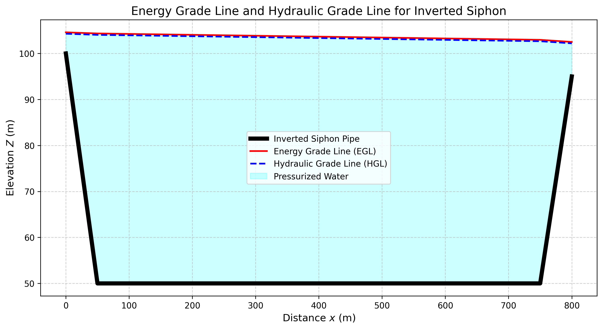

# 第 9 章 有压管流稳态水力学

## 1 学习目标

本章探讨水流进入密闭管道后的稳态运动规律，是连接明渠水力学与城市给排水管网、长距离输水工程的重要桥梁。掌握有压管流的基本理论对于工程设计至关重要。读者需要掌握：

1. 伯努利方程在有压管流中的应用，水力坡度线（HGL）与总能线（EGL）的概念及绘制方法。
2. 达西-魏斯巴赫公式（Darcy-Weisbach Equation）的完整形式及其物理意义。
3. 摩阻系数 $f$ 与雷诺数 $Re$、相对粗糙度 $\varepsilon/D$ 的关系，Moody 图的分区特征。
4. Colebrook-White 方程的隐式求解方法。
5. 局部水头损失的计算方法及各类损失系数的物理含义。
6. 曼宁公式用于有压管流的适用条件与局限性。

---

## 2 教材理论

### 2.1 有压管流的能量方程

在明渠中，水流由渠道底坡驱动，水面自由承受大气压。当水流进入封闭管道并充满整个过水断面时，水面消失，水流变为**有压管流**（Pressurized Pipe Flow）。此时，驱动水流运动的不再仅仅是重力势差，而是管道两端的**总水头差**，包括位置水头、压力水头和流速水头的综合作用。

对于管道内任意两个断面 1 和 2，由能量守恒原理写出**伯努利方程**：

$$
Z_1 + \frac{P_1}{\gamma} + \frac{\alpha_1 V_1^2}{2g} = Z_2 + \frac{P_2}{\gamma} + \frac{\alpha_2 V_2^2}{2g} + h_f + h_m \tag{9-1}
$$

各项含义如下：

- $Z$：位置水头（m），即断面中心相对于基准面的高程。
- $P/\gamma$：压力水头（m），$P$ 为断面中心压强（Pa），$\gamma = \rho g$ 为水的容重（N/m$^3$）。
- $\alpha V^2/(2g)$：流速水头（m），$\alpha$ 为动能修正系数（紊流中 $\alpha \approx 1.0$），$V = Q/A$ 为断面平均流速。
- $h_f$：沿程水头损失（m），由水流与管壁之间的摩擦阻力引起。
- $h_m$：局部水头损失（m），由管道局部几何突变（弯头、阀门、管径变化、分叉等）引起的漩涡耗散。

**水力坡度线（HGL）**定义为 $Z + P/\gamma$ 沿管道的变化曲线，物理含义是在管道上某点打孔插入测压管，水能上升到的高度。**总能线（EGL）**定义为 $Z + P/\gamma + V^2/(2g)$，即在 HGL 的基础上加上流速水头。在等径管道中（$V_1 = V_2$），EGL 与 HGL 平行，两线之间的竖直距离恒等于流速水头 $V^2/(2g)$。EGL 沿程持续下降（能量只减不增），HGL 则可能因管道高程变化而局部升降。

### 2.2 达西-魏斯巴赫公式

沿程水头损失的计算采用**达西-魏斯巴赫公式**（Darcy-Weisbach Equation），这是有压管流水力学中最基本、最通用的阻力公式：

$$
h_f = f \frac{L}{D} \frac{V^2}{2g} \tag{9-2}
$$

其中：

- $h_f$：沿程水头损失（m）。
- $f$：达西摩阻系数（也称 Darcy friction factor），无量纲。
- $L$：管道长度（m）。
- $D$：管道内径（m）。
- $V$：管道内断面平均流速（m/s）。
- $g$：重力加速度（$9.81\ \mathrm{m/s^2}$）。

达西公式具有清晰的物理意义：水头损失与管道长度成正比（越长摩擦越多），与管径成反比（管径越大，单位体积水体与管壁的接触面积比越小），与流速的平方成正比（紊流阻力的基本特征）。值得注意的是，若将流速用流量表示（$V = 4Q/(\pi D^2)$），则水头损失与管径的五次方成反比（$h_f \propto Q^2/D^5$），这意味着管径的微小增大就能显著降低水头损失，是管道设计中最重要的经验法则之一。

### 2.3 摩阻系数 $f$ 的确定

摩阻系数 $f$ 不是常数，而是依赖于两个无量纲参数：**雷诺数** $Re$ 和**相对粗糙度** $\varepsilon/D$。

**雷诺数**反映了惯性力与粘性力的比值：

$$
Re = \frac{VD}{\nu} \tag{9-3}
$$

其中 $\nu$ 为水的运动粘滞系数（20℃ 时约 $1.0 \times 10^{-6}\ \mathrm{m^2/s}$）。

**相对粗糙度** $\varepsilon/D$ 是管壁表面粗糙高度 $\varepsilon$ 与管径之比。常见管材的 $\varepsilon$ 值：新铸铁管约 $0.26\ \mathrm{mm}$，商用钢管约 $0.046\ \mathrm{mm}$，混凝土管约 $0.3 \sim 3.0\ \mathrm{mm}$，PVC 管约 $0.0015\ \mathrm{mm}$。需要注意的是，管道运行若干年后，内壁因腐蚀、结垢或生物附着会使实际粗糙度显著增大，老旧铸铁管的 $\varepsilon$ 可达到新管的 $5 \sim 10$ 倍。

#### 2.3.1 Moody 图

Moody（1944）将 $f$ 对 $Re$ 和 $\varepsilon/D$ 的关系绘制成著名的 **Moody 图**，是管道水力学最重要的工程图表之一。Moody 图分为以下三个区域：

**(1) 层流区**（$Re < 2000$）：$f = 64/Re$，与粗糙度无关，阻力与流速成正比（而非平方关系）。

**(2) 过渡区**（$2000 < Re < 4000$）：流态在层流与紊流之间不稳定地交替转换，$f$ 难以精确确定。工程设计中通常尽量避免管道工作在该区间。

**(3) 紊流区**（$Re > 4000$）：又细分为——
- **水力光滑区**：$\varepsilon/D$ 很小，粗糙度完全被粘性底层覆盖，$f$ 仅依赖 $Re$。
- **过渡粗糙区**：$f$ 同时依赖 $Re$ 和 $\varepsilon/D$。
- **完全粗糙区**（又称"自模拟区"）：$Re$ 极大，粘性底层极薄，粗糙度完全暴露，$f$ 仅依赖 $\varepsilon/D$ 而不再随 $Re$ 变化。Moody 图上表现为水平线。

#### 2.3.2 Colebrook-White 方程

在紊流过渡区，$f$ 的精确计算采用 **Colebrook-White 方程**（Colebrook, 1939）：

$$
\frac{1}{\sqrt{f}} = -2\log\left(\frac{\varepsilon/D}{3.7} + \frac{2.51}{Re\sqrt{f}}\right) \tag{9-4}
$$

这是一个关于 $f$ 的**隐式方程**，不能直接求解，需要采用迭代法。常用的迭代步骤如下：

(1) 初始估计：取完全粗糙区的值 $f^{(0)} = [1/(-2\log(\varepsilon/(3.7D)))]^2$。

(2) 将 $f^{(0)}$ 代入式（9-4）右端，计算新的 $1/\sqrt{f^{(1)}}$，得到 $f^{(1)}$。

(3) 重复直到前后两次迭代的差 $|f^{(k+1)} - f^{(k)}| < 10^{-6}$。

通常 3~5 次迭代即可收敛。也可采用 Swamee-Jain（1976）的显式近似公式：

$$
f \approx \frac{0.25}{\left[\log\left(\frac{\varepsilon/D}{3.7} + \frac{5.74}{Re^{0.9}}\right)\right]^2} \tag{9-5}
$$

该近似在 $10^{-6} \leq \varepsilon/D \leq 10^{-2}$、$5000 \leq Re \leq 10^8$ 范围内误差不超过 $1\%$，覆盖了绝大多数工程应用场景。在编程计算中，该显式公式可以替代迭代求解，大幅提高计算效率。

### 2.4 局部水头损失

局部水头损失由管道几何形状的突变引起，计算公式为：

$$
h_m = K \frac{V^2}{2g} \tag{9-6}
$$

其中 $K$ 为局部损失系数，其值取决于几何形状和水流条件。常见的局部损失系数包括：

- **进口损失**：从大水域（水库）进入管道，$K_{\mathrm{ent}} = 0.5$（锐缘进口）、$K_{\mathrm{ent}} = 0.04$（圆弧进口）。
- **出口损失**：$K_{\mathrm{exit}} = 1.0$。其物理含义为：当管流以流速 $V$ 射入大水域时，射流的全部动能 $V^2/(2g)$ 在大水域中通过漩涡扩散被完全耗散，无法恢复为压力能。这是管道系统中唯一损失系数恒等于 $1.0$ 的情形。
- **弯头损失**：$90°$ 弯头 $K \approx 0.2 \sim 0.5$（取决于弯曲半径与管径之比 $r/D$，$r/D$ 越大弯头越平缓，损失系数越小）。
- **阀门损失**：全开球阀 $K \approx 0.05$，全开蝶阀 $K \approx 0.2$，半开闸阀 $K \approx 5.6$。

当管道系统包含多种局部阻力件时，总的局部损失为各项之和（假设各阻力件之间间距足够大，互不干扰）：

$$
h_m = \sum_j K_j \frac{V^2}{2g} \tag{9-7}
$$

### 2.5 曼宁公式用于有压管流

在第 3~5 章中广泛使用的曼宁公式也可用于有压管流。对于圆管满管流，水力半径为：

$$
R = \frac{A}{\chi} = \frac{\pi D^2/4}{\pi D} = \frac{D}{4} \tag{9-8}
$$

其中 $\chi$ 为湿周。由曼宁公式 $V = (1/n)R^{2/3}S_f^{1/2}$ 可推出沿程水头损失：

$$
h_f = S_f \cdot L = \frac{n^2 V^2 L}{R^{4/3}} = \frac{n^2 V^2 L}{(D/4)^{4/3}} \tag{9-9}
$$

**适用条件与局限**：

(1) 曼宁公式本质上是基于**完全粗糙紊流**（即 $f$ 仅取决于粗糙度而不依赖 $Re$）的经验公式。对于水力光滑管或过渡粗糙区的管流，曼宁公式的精度不如达西-魏斯巴赫公式。

(2) 曼宁糙率 $n$ 与达西摩阻系数 $f$ 的换算关系为：

$$
f = \frac{8gn^2}{R^{1/3}} \tag{9-10}
$$

对圆管 $R = D/4$，则 $f = 8gn^2/(D/4)^{1/3} = 8 \times 9.81 \times n^2 / (D/4)^{1/3}$。

(3) 在大型混凝土管道或隧洞（$Re$ 很大，处于完全粗糙区）的工程中，曼宁公式仍被广泛使用，且计算简便。但在小管径、低流速的精细水力分析中，应优先采用达西公式配合 Colebrook-White 方程。

---

## 3 典型例题

### 例题 9-1 达西公式手算管道水头损失

**题目**：一段长 $L = 500\ \mathrm{m}$ 的商用钢管（$\varepsilon = 0.046\ \mathrm{mm}$），内径 $D = 0.3\ \mathrm{m}$，输送 20℃ 清水（$\nu = 1.0 \times 10^{-6}\ \mathrm{m^2/s}$），流量 $Q = 0.05\ \mathrm{m^3/s}$。求沿程水头损失。

**解**：

**第一步**：计算流速和雷诺数。

$$
A = \frac{\pi D^2}{4} = \frac{\pi \times 0.3^2}{4} = 0.07069\ \mathrm{m^2}
$$

$$
V = \frac{Q}{A} = \frac{0.05}{0.07069} = 0.707\ \mathrm{m/s}
$$

$$
Re = \frac{VD}{\nu} = \frac{0.707 \times 0.3}{1.0 \times 10^{-6}} = 2.12 \times 10^5
$$

**第二步**：计算相对粗糙度。

$$
\frac{\varepsilon}{D} = \frac{0.046 \times 10^{-3}}{0.3} = 1.53 \times 10^{-4}
$$

**第三步**：用 Swamee-Jain 近似公式（9-5）估算 $f$。

$$
f \approx \frac{0.25}{\left[\log\left(\frac{1.53 \times 10^{-4}}{3.7} + \frac{5.74}{(2.12 \times 10^5)^{0.9}}\right)\right]^2}
$$

$$
= \frac{0.25}{\left[\log(4.14 \times 10^{-5} + 1.24 \times 10^{-4})\right]^2}
= \frac{0.25}{\left[\log(1.65 \times 10^{-4})\right]^2}
= \frac{0.25}{(-3.782)^2} = 0.0175
$$

**第四步**：代入达西公式。

$$
h_f = f\frac{L}{D}\frac{V^2}{2g} = 0.0175 \times \frac{500}{0.3} \times \frac{0.707^2}{2 \times 9.81}
$$

$$
= 0.0175 \times 1667 \times 0.0255 = 0.744\ \mathrm{m}
$$

因此，该管道的沿程水头损失约为 $0.74\ \mathrm{m}$。

### 例题 9-2 曼宁公式与达西公式的对比

**题目**：对例题 9-1 中的管道，若采用曼宁公式计算，糙率取 $n = 0.012$（光滑钢管），试比较两种方法的结果。

**解**：

圆管满管流水力半径：$R = D/4 = 0.075\ \mathrm{m}$

曼宁公式的沿程水头损失（式 9-9）：

$$
h_f = \frac{n^2 V^2 L}{R^{4/3}} = \frac{0.012^2 \times 0.707^2 \times 500}{0.075^{4/3}}
$$

$$
R^{4/3} = 0.075^{4/3} = 0.0385
$$

$$
h_f = \frac{1.44 \times 10^{-4} \times 0.500 \times 500}{0.0385} = \frac{0.03600}{0.0385} = 0.935\ \mathrm{m}
$$

达西公式给出 $0.744\ \mathrm{m}$，曼宁公式给出 $0.935\ \mathrm{m}$，后者偏大约 $25.7\%$。这主要是因为在该工况下（$Re = 2.12 \times 10^5$，管道处于过渡粗糙区），曼宁公式隐含的完全粗糙假设不完全成立，高估了摩阻。此例说明在中等雷诺数条件下，达西公式配合 Colebrook-White 方程的精度优于曼宁公式。

---

## 4 工程案例：倒虹吸管的总水头损失与能量线推演

### 4.1 案例背景

某大型引水干渠在穿越深谷时，采用**倒虹吸管**（Inverted Siphon）让水流"潜入"地下穿过谷底再"爬升"回对岸渠道。倒虹吸管下沉极深，管内承受巨大的内水压力。为保证对岸渠道获得设计流量，上游渠道水位必须高于下游渠道一个 $\Delta H$，这个 $\Delta H$ 即为管道系统的总水头损失。

### 4.2 问题描述

倒虹吸管全长 $L = 800\ \mathrm{m}$，圆形混凝土管，内径 $D = 2.5\ \mathrm{m}$，曼宁糙率 $n = 0.013$。设计流量 $Q = 12.0\ \mathrm{m^3/s}$。管道包含：进口（$K_{\mathrm{ent}} = 0.5$）、出口（$K_{\mathrm{exit}} = 1.0$）和两个弯头（$K_{\mathrm{bend}} = 0.2$ 每个）。

要求计算：系统在通过设计流量时的沿程损失 $h_f$、局部损失 $h_m$ 及其占比，并绘制流量-水头损失特性曲线和 EGL/HGL 剖面。

### 4.3 解题思路

1. **几何与流速计算**：$A = \pi D^2/4 = \pi \times 2.5^2/4 = 4.909\ \mathrm{m^2}$，$V = Q/A$。
2. **沿程损失**：采用曼宁公式（式 9-9），$R = D/4 = 0.625\ \mathrm{m}$。此处 $D = 2.5\ \mathrm{m}$ 的大管径、$Re$ 很大，处于完全粗糙区，曼宁公式适用性良好。
3. **局部损失**：$h_m = (K_{\mathrm{ent}} + K_{\mathrm{exit}} + 2K_{\mathrm{bend}}) \times V^2/(2g) = (0.5 + 1.0 + 0.4) \times V^2/(2g) = 1.9 V^2/(2g)$。
4. **总损失**：$\Delta H = h_f + h_m$。

### 4.4 代码与计算结果

源代码：`assets/ch09/ch09_inverted_siphon.py`

**倒虹吸管水头损失追踪矩阵：**

| 流量 $Q$ (m$^3$/s) | 流速 $V$ (m/s) | 沿程损失 $h_f$ (m) | 局部损失 $h_m$ (m) | 总损失 $\Delta H$ (m) |
|-------------------:|------------------:|---------------------:|-------------------:|-----------------------:|
| 5 | 1.02 | 0.263 | 0.100 | 0.363 |
| 8 | 1.63 | 0.672 | 0.257 | 0.929 |
| 10 | 2.04 | 1.050 | 0.402 | 1.452 |
| 12 | 2.44 | 1.512 | 0.579 | 2.091 |
| 15 | 3.06 | 2.363 | 0.904 | 3.267 |
| 18 | 3.67 | 3.402 | 1.302 | 4.704 |

**流量-水头损失特性曲线：**

**空间剖面 EGL 与 HGL 可视化：**

### 4.5 结果分析

(1) **设计工况的阻力分配**：当 $Q = 12.0\ \mathrm{m^3/s}$（$V = 2.44\ \mathrm{m/s}$）时，总水头损失 $\Delta H = 2.091\ \mathrm{m}$。其中沿程摩擦损失 $h_f = 1.512\ \mathrm{m}$（占 $72.3\%$），局部损失 $h_m = 0.579\ \mathrm{m}$（占 $27.7\%$）。局部损失不可忽视，约占四分之一。在初步设计阶段，工程师常将局部损失按沿程损失的 $20\% \sim 30\%$ 估算，本案例的结果与此经验法则吻合。

(2) **非线性阻力特性**：水头损失与流量的平方成正比（$\Delta H \propto Q^2$）。当流量从 $10\ \mathrm{m^3/s}$ 增加 $50\%$ 至 $15\ \mathrm{m^3/s}$ 时，总水头损失从 $1.452\ \mathrm{m}$ 增至 $3.267\ \mathrm{m}$（增加 $125\%$）。这种非线性特性是限制管道输水能力的核心物理机制。

(3) **HGL 与管顶的安全间距**：HGL 必须在整个管线上始终高于管顶（保持正内压）。若因气阻、流量突增等原因导致 HGL 跌落至管顶以下，管内将出现负压，可能引发气蚀或管壁失稳变形。在工程设计中，通常要求 HGL 高于管顶至少 $2 \sim 3\ \mathrm{m}$ 作为安全裕度。

(4) **曼宁公式与达西公式的适用分界**：本案例的对比分析表明，在中等雷诺数的过渡粗糙区，曼宁公式隐含的完全粗糙假设高估了摩阻系数。因此，对于需要精确水力设计的工况，应首选达西公式配合 Moody 图或 Colebrook-White 方程确定摩阻系数，将曼宁公式作为工程估算的辅助手段。

---

## 5 工业部署建议

1. **排气阀的布设**：在倒虹吸管的下降段与上升段交界处极易积聚空气。气囊形成后相当于一个无形的"节流阀"，导致实际总损失远超理论值。必须在管线凸起点安装复合式排气阀，运行期间定期检查排气阀工作状态，确保积气能及时排出。
2. **管道老化的影响**：混凝土管运行十余年后，内壁结垢或生物附着导致糙率从 $n = 0.013$ 退化至 $0.018$ 甚至更高。由于沿程损失与 $n^2$ 成正比，同样流量下的水头损失可能增加 $90\%$ 以上。设计阶段应预留充足的水头裕度。
3. **达西公式的优先使用**：在需要精确水力分析的场合（如泵站选型、调压室设计），应优先采用达西-魏斯巴赫公式配合 Colebrook-White 方程确定 $f$，而非直接使用曼宁公式。尤其对于小管径、低雷诺数工况，曼宁公式的误差可能达到 $20\%$ 以上，这将直接影响泵站扬程选择和运行成本估算的准确性。

---

## 6 本章小结

本章系统介绍了有压管流稳态水力学的基本理论。以伯努利方程为出发点，阐述了水力坡度线（HGL）和总能线（EGL）的概念及其工程意义。重点推导了达西-魏斯巴赫公式 $h_f = f(L/D)(V^2/2g)$，详细分析了摩阻系数 $f$ 与雷诺数 $Re$、相对粗糙度 $\varepsilon/D$ 的关系，介绍了 Moody 图的三个分区（层流区、过渡区、完全粗糙区）及 Colebrook-White 隐式方程的迭代求解方法。对局部水头损失的各类系数进行了讨论，特别指出出口损失系数 $K_{\mathrm{exit}} = 1.0$ 的物理含义（全部动能通过漩涡扩散耗散）。分析了圆管满管流水力半径 $R = D/4$ 的推导以及曼宁公式在有压管流中的适用条件和局限性——在大管径完全粗糙区曼宁公式精度尚可，但在中小管径过渡粗糙区应优先采用达西公式。通过倒虹吸管工程案例和达西公式手算例题，展示了理论在工程实践中的具体应用。值得强调的是，管流水力学与明渠水力学虽然在物理形态上差异显著，但在数学描述上共享相同的基本守恒定律（质量守恒和动量守恒）。这种深层的数学统一性为建立跨体系的通用水力模型提供了理论基础。

## 思考题

1. **概念辨析**：达西-韦斯巴赫公式与曼宁公式在有压管流中各自的适用条件和局限性是什么？在什么情况下两者可以互相换算？推导圆管满管流条件下二者的换算关系。

2. **定量计算**：一钢管，内径 $D = 0.8\,\mathrm{m}$，长度 $L = 3000\,\mathrm{m}$，绝对粗糙度 $\varepsilon = 0.045\,\mathrm{mm}$，流量 $Q = 0.5\,\mathrm{m^3/s}$，水温 $20°\mathrm{C}$（运动粘滞系数 $\nu = 1.003 \times 10^{-6}\,\mathrm{m^2/s}$）。(a) 计算雷诺数 $Re$，判断流态；(b) 用 Swamee-Jain 显式公式估算摩阻系数 $f$；(c) 计算沿程水头损失 $h_f$。

3. **Moody 图分析**：Moody 图的三个分区（层流区、过渡区、完全粗糙区）各有什么特征？为什么在完全粗糙区摩阻系数 $f$ 仅与相对粗糙度 $\varepsilon/D$ 有关而与雷诺数无关？

4. **工程应用**：一倒虹吸管需要计算总水头损失。试列出需要考虑的全部水头损失项（沿程损失和各类局部损失），并解释出口损失系数 $K_{\mathrm{exit}} = 1.0$ 的物理含义。

---

## 7 参考文献

[1] Moody L F. Friction factors for pipe flow[J]. Transactions of the ASME, 1944, 66(8): 671-684.

[2] Colebrook C F. Turbulent flow in pipes, with particular reference to the transition region between the smooth and rough pipe laws[J]. Journal of the Institution of Civil Engineers, 1939, 11(4): 133-156.

[3] Streeter V L, Wylie E B. Fluid Mechanics[M]. 7th ed. New York: McGraw-Hill, 1979.

[4] Chaudhry M H. Applied Hydraulic Transients[M]. 3rd ed. New York: Springer, 2014.

[5] Swamee P K, Jain A K. Explicit equations for pipe-flow problems[J]. Journal of the Hydraulics Division, ASCE, 1976, 102(5): 657-664.

[6] White F M. Fluid Mechanics[M]. 8th ed. New York: McGraw-Hill, 2016.

[7] Larock B E, Jeppson R W, Watters G Z. Hydraulics of Pipeline Systems[M]. Boca Raton: CRC Press, 2000.
