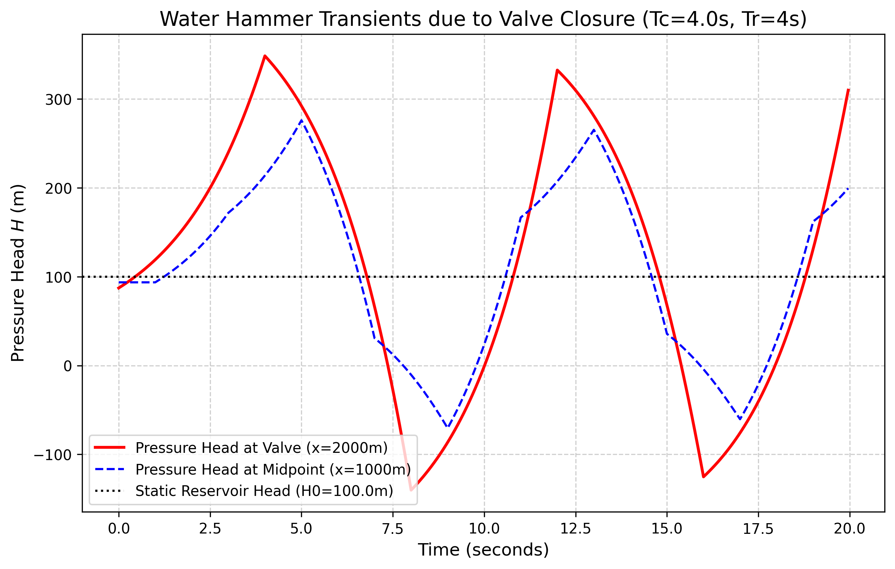
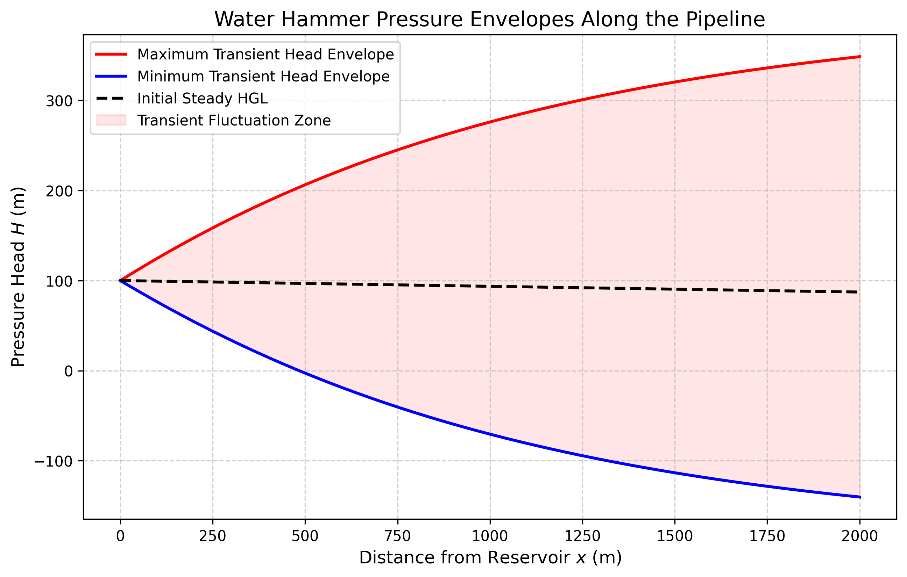

# 第 10 章 有压管流瞬态——水锤分析

## 1 学习目标

本章进入有压管流系统中最危险的瞬态现象——水锤（Water Hammer），这是管道安全设计与运行管理的核心问题。读者需要掌握：

1. 水锤现象的物理本质及其产生条件。
2. 水锤波速公式的推导与影响因素。
3. Joukowsky 基本水击方程与直接水击/间接水击的区分。
4. 水锤基本方程组（连续性方程与动量方程）的推导。
5. 特征线法（Method of Characteristics, MOC）的完整推导：特征线变换、$C^+$ 和 $C^-$ 相容方程、Courant 条件。
6. 阀门关闭规律对管网压力的影响及水锤防护措施。

---

## 2 教材理论

### 2.1 水锤现象的物理本质

在明渠中，当下游突然关闸，水流会形成壅水波缓慢向上游推进，水体通过抬高水面（动能转化为势能）来缓冲。然而，在充满水的密闭管道中，若下游阀门**突然关闭**，高速运动的水体失去了自由膨胀的空间。巨大的动能无处释放，瞬间转化为极高的**压力能**，同时导致水体本身被轻微压缩、管壁被径向撑大。

这种由于流速突变引起的压力急剧交替升降的现象，如同一把无形的巨锤在管道内部反复敲击，因此被称为**水锤**（Water Hammer）。水锤波在管道内的传播速度远高于明渠中的重力长波，通常为 $800 \sim 1400\ \mathrm{m/s}$，比明渠重力波速高出两个数量级以上。正因如此，水锤事故往往在极短时间内发生，给操作人员留下的反应时间极为有限。

### 2.2 水锤波速公式

水锤波在管道中的传播速度 $a$ 取决于水的弹性模量、管道材料的弹性模量和管道几何参数。推导如下。

设水的体积弹性模量为 $K$（水在 20℃ 时 $K \approx 2.19 \times 10^9\ \mathrm{Pa}$），水的密度为 $\rho$，管壁材料的弹性模量为 $E$，管道内径为 $D$，壁厚为 $e$。

在刚性管中（$E \to \infty$），水锤波速等于水中声速 $a_0 = \sqrt{K/\rho} \approx 1480\ \mathrm{m/s}$。但实际管壁具有弹性，管壁在压力波作用下会发生径向膨胀，吸收一部分压力波的能量，导致波速降低。

考虑管壁弹性后，波速公式为：

$$
a = \frac{\sqrt{K/\rho}}{\sqrt{1 + \dfrac{KD}{Ee}}} \tag{10-1}
$$

该公式也常写为等价形式：

$$
a = \sqrt{\frac{K/\rho}{1 + (KD)/(Ee)}} \tag{10-2}
$$

对于薄壁圆管（$D/e \gg 1$），分母中 $KD/(Ee)$ 项可能远大于 1，使得 $a$ 显著低于 $a_0$。例如，$D = 1.0\ \mathrm{m}$、$e = 0.01\ \mathrm{m}$ 的钢管（$E = 2.0 \times 10^{11}\ \mathrm{Pa}$），$KD/(Ee) = 2.19 \times 10^9 \times 1.0 / (2.0 \times 10^{11} \times 0.01) = 1.095$，则 $a = 1480/\sqrt{1 + 1.095} = 1480/1.448 = 1022\ \mathrm{m/s}$。若管道材料换为刚度更低的塑料管（如 HDPE，$E \approx 1.0 \times 10^9\ \mathrm{Pa}$），波速将大幅降至约 $200 \sim 400\ \mathrm{m/s}$，对应的水锤升压也相应减小。

### 2.3 Joukowsky 方程与水击分类

#### 2.3.1 Joukowsky 基本水击方程

Joukowsky（1898）推导了水锤升压的基本公式。当阀门瞬间关闭（直接水击），流速从 $V_0$ 变为 0 时，产生的最大压力水头升高量为：

$$
\Delta H = \frac{a \Delta V}{g} = \frac{a V_0}{g} \tag{10-3}
$$

其中 $a$ 为水锤波速，$\Delta V = V_0$ 为流速变化量。

**数值示例**：$V_0 = 2.5\ \mathrm{m/s}$，$a = 1000\ \mathrm{m/s}$ 时，$\Delta H = 1000 \times 2.5 / 9.81 = 255\ \mathrm{m}$，相当于 $25$ 个大气压的瞬间增压。这一数值远远超过大多数管道的额定承压能力，足以造成管壁破裂或接头脱开等严重事故。

#### 2.3.2 直接水击与间接水击

水击波从阀门传至管道上游端（水库），再反射回阀门的往返时间称为**管道相长**（反射周期）：

$$
T_r = \frac{2L}{a} \tag{10-4}
$$

其中 $L$ 为管道长度。

**直接水击**（$T_c \leq T_r$）：阀门关闭时间 $T_c$ 小于或等于管道相长 $T_r$。在阀门处，水击波来不及从上游端反射回来消减压力之前，阀门已经完全关闭，产生完整的 Joukowsky 升压 $\Delta H = aV_0/g$。

**间接水击**（$T_c > T_r$）：阀门关闭时间大于管道相长。在阀门完全关闭之前，早期产生的水击波已从上游端反射回来并开始卸压。此时，阀门处的最大升压低于 Joukowsky 值。对于线性关阀，间接水击的近似升压公式为：

$$
\Delta H_{\mathrm{indirect}} \approx \frac{a V_0}{g} \cdot \frac{T_r}{T_c} = \frac{2LV_0}{gT_c} \tag{10-5}
$$

该公式也称 Michaud 公式，由法国工程师 Michaud 于 1878 年首次提出。由此可见，延长关阀时间是降低水锤压力最直接、最有效的手段。在工程实践中，合理的关阀规律设计是水锤防护的第一道防线。

### 2.4 水锤基本方程组

水锤现象的精确分析需要求解管道内流体的**一维瞬变方程组**，由连续性方程和动量方程构成。

**连续性方程**（考虑水的可压缩性和管壁弹性）：

$$
\frac{\partial H}{\partial t} + \frac{a^2}{gA}\frac{\partial Q}{\partial x} = 0 \tag{10-6}
$$

或等价地写为（以压力水头 $H$ 和流速 $V$ 为变量）：

$$
\frac{\partial H}{\partial t} + \frac{a^2}{g}\frac{\partial V}{\partial x} = 0 \tag{10-7}
$$

**动量方程**（考虑管道摩阻）：

$$
\frac{\partial V}{\partial t} + g\frac{\partial H}{\partial x} + \frac{f}{2D}V|V| = 0 \tag{10-8}
$$

其中 $H$ 为压力水头（m），$V$ 为管道断面平均流速（m/s），$f$ 为达西摩阻系数，$D$ 为管道内径。摩擦项中使用 $V|V|$ 以正确处理反向流。

### 2.5 特征线法（MOC）

#### 2.5.1 特征线变换

特征线法的核心思想是将偏微分方程组（10-7）和（10-8）沿特定方向（特征线方向）化为常微分方程。

将式（10-7）乘以一个待定常数 $\lambda$，加到式（10-8）上：

$$
\left(\frac{\partial V}{\partial t} + \lambda\frac{\partial H}{\partial t}\right) + \left(g\frac{\partial H}{\partial x} + \frac{\lambda a^2}{g}\frac{\partial V}{\partial x}\right) + \frac{f}{2D}V|V| = 0 \tag{10-9}
$$

若选取 $\lambda$ 使得方程可以沿某个方向 $dx/dt$ 化为全导数形式，则需满足：

$$
\frac{dx}{dt} = \frac{g}{\lambda} = \frac{\lambda a^2}{g} \tag{10-10}
$$

由此解得 $\lambda = \pm g/a$，对应的特征方向为 $dx/dt = \pm a$。

#### 2.5.2 $C^+$ 和 $C^-$ 相容方程

沿正特征线 $C^+$（$dx/dt = +a$）：

$$
\frac{dV}{dt} + \frac{g}{a}\frac{dH}{dt} + \frac{f}{2D}V|V| = 0 \tag{10-11}
$$

沿负特征线 $C^-$（$dx/dt = -a$）：

$$
\frac{dV}{dt} - \frac{g}{a}\frac{dH}{dt} + \frac{f}{2D}V|V| = 0 \tag{10-12}
$$

对式（10-11）沿 $C^+$ 线从 $A$ 点积分到 $P$ 点，对式（10-12）沿 $C^-$ 线从 $B$ 点积分到 $P$ 点（其中 $A$、$B$ 为已知时间层上的两个相邻节点，$P$ 为新时间层上的待求节点），并对摩擦项采用近似处理（用已知层的值代替），得到有限差分形式的**相容方程**：

$C^+$ 方程（从 $A$ 到 $P$）：

$$
H_P - H_A + B(V_P - V_A) + R\Delta t \cdot V_A|V_A| = 0 \tag{10-13}
$$

$C^-$ 方程（从 $B$ 到 $P$）：

$$
H_P - H_B - B(V_P - V_B) + R\Delta t \cdot V_B|V_B| = 0 \tag{10-14}
$$

其中：

$$
B = \frac{a}{g} \tag{10-15}
$$

$$
R = \frac{f}{2DA} \tag{10-16}
$$

联立式（10-13）和（10-14），可以解出内部节点 $P$ 的 $H_P$ 和 $V_P$：

$$
V_P = \frac{1}{2}\left[(V_A + V_B) + \frac{1}{B}(H_A - H_B) - R\Delta t(V_A|V_A| + V_B|V_B|)\right] \tag{10-17}
$$

$$
H_P = \frac{1}{2}\left[(H_A + H_B) + B(V_A - V_B) - BR\Delta t(V_A|V_A| - V_B|V_B|)\right] \tag{10-18}
$$

#### 2.5.3 Courant 条件

在 MOC 中，节点 $A$ 和 $B$ 必须恰好位于从 $P$ 点出发沿特征线回溯 $\Delta t$ 时间所到达的位置。由于特征线的斜率为 $\pm a$，这要求：

$$
\Delta x = a \cdot \Delta t \tag{10-19}
$$

即 Courant 数必须**严格等于** 1。这是 MOC 区别于一般有限差分法的重要特征。

在实际计算中，先确定管道的空间步长 $\Delta x = L/N$（$N$ 为管段数），然后由 $\Delta t = \Delta x / a$ 确定时间步长。**这是一个严格的约束，不可随意调整，否则将导致计算结果失真**。其物理原因在于：MOC 的精度建立在特征线与网格线精确重合的基础上。若 Courant 数偏离 1，需要在已知时间层上进行空间插值以确定 $A$ 和 $B$ 点的值，这会引入数值耗散。

### 2.6 边界条件处理

**(1) 上游恒定水库**：$H_P = H_0$（水库水头恒定），由 $C^+$ 方程单独求出 $V_P$。

**(2) 下游阀门**：阀门的瞬时流量与压力的关系由孔流方程描述：

$$
V_P = \tau(t) \cdot C_d A_v \sqrt{2g H_P} / A \tag{10-20}
$$

其中 $\tau(t)$ 为阀门开度（$\tau = 1$ 全开，$\tau = 0$ 全关），$C_d$ 为流量系数，$A_v$ 为阀门全开面积，$A$ 为管道截面积。将此方程与 $C^+$ 方程联立（二次方程），可解出阀门处的 $H_P$ 和 $V_P$。

### 2.7 负压与汽化

当水锤负压波传播时，某些位置的压力水头可能降至负值。在实际物理条件下，当绝对压力降至水的饱和蒸气压（约 $-10\ \mathrm{m}$ 水柱，相对于大气压）以下时，水会发生汽化，形成蒸汽空腔（液柱分离）。当后续正压波到达并压缩蒸汽空腔时，会产生极其剧烈的**断流弥合水锤**（Column Separation and Rejoining），其升压值可能远超 Joukowsky 值。

本章的 MOC 模型未包含汽化子模型（如 DVCM——离散蒸汽空腔模型），因此计算得到的负压值（如 $-140\ \mathrm{m}$）是不含汽化约束的**理论极值**，不代表实际管道会承受这样的负压。实际中，一旦压力降至汽化压力，液柱即发生分离，后续动力学过程更为复杂。

---

## 3 典型例题

### 例题 10-1 Joukowsky 升压与水击分类

**题目**：一段长 $L = 3000\ \mathrm{m}$ 的钢管，管径 $D = 0.8\ \mathrm{m}$，壁厚 $e = 0.012\ \mathrm{m}$，钢的弹性模量 $E = 2.0 \times 10^{11}\ \mathrm{Pa}$。管内输水流速 $V_0 = 2.0\ \mathrm{m/s}$，水的体积弹性模量 $K = 2.19 \times 10^9\ \mathrm{Pa}$，密度 $\rho = 998\ \mathrm{kg/m^3}$。

(a) 求水锤波速 $a$。
(b) 若阀门在 $T_c = 3\ \mathrm{s}$ 内关闭，判断是直接水击还是间接水击，并求最大升压。
(c) 若将关阀时间延长至 $T_c = 30\ \mathrm{s}$，最大升压变为多少？

**解**：

**(a)** 波速计算：

$$
\frac{KD}{Ee} = \frac{2.19 \times 10^9 \times 0.8}{2.0 \times 10^{11} \times 0.012} = \frac{1.752 \times 10^9}{2.4 \times 10^9} = 0.730
$$

$$
a = \frac{\sqrt{K/\rho}}{\sqrt{1 + KD/(Ee)}} = \frac{\sqrt{2.19 \times 10^9 / 998}}{\sqrt{1 + 0.730}} = \frac{1481}{1.315} = 1126\ \mathrm{m/s}
$$

**(b)** 管道相长：

$$
T_r = \frac{2L}{a} = \frac{2 \times 3000}{1126} = 5.33\ \mathrm{s}
$$

$T_c = 3\ \mathrm{s} < T_r = 5.33\ \mathrm{s}$，属于**直接水击**。

Joukowsky 升压：

$$
\Delta H = \frac{aV_0}{g} = \frac{1126 \times 2.0}{9.81} = 229.6\ \mathrm{m}
$$

**(c)** $T_c = 30\ \mathrm{s} > T_r = 5.33\ \mathrm{s}$，属于**间接水击**。

Michaud 近似升压：

$$
\Delta H_{\mathrm{indirect}} \approx \frac{2LV_0}{gT_c} = \frac{2 \times 3000 \times 2.0}{9.81 \times 30} = 40.8\ \mathrm{m}
$$

将关阀时间从 $3\ \mathrm{s}$ 延长至 $30\ \mathrm{s}$，最大升压从 $229.6\ \mathrm{m}$ 降至 $40.8\ \mathrm{m}$（降低 $82\%$），充分说明了慢关阀的防护效果。这一数值对比清晰地表明，在管道系统设计中，合理控制阀门关闭时间是成本最低、效果最显著的水锤防护措施。

### 例题 10-2 MOC 网格参数确定

**题目**：对例题 10-1 中的管道，若取 $N = 50$ 个计算段进行 MOC 模拟，求空间步长和时间步长。

**解**：

$$
\Delta x = \frac{L}{N} = \frac{3000}{50} = 60\ \mathrm{m}
$$

由 Courant 条件 $\Delta x = a\Delta t$：

$$
\Delta t = \frac{\Delta x}{a} = \frac{60}{1126} = 0.0533\ \mathrm{s}
$$

模拟 $30\ \mathrm{s}$ 需要 $30/0.0533 = 563$ 个时间步。

---

## 4 工程案例：长距离输水管阀门快关水锤模拟

### 4.1 案例背景

某市引水工程中有一条长 $2000\ \mathrm{m}$ 的大型加压输水干管。由于操作员失误，末端蝶阀在 $4\ \mathrm{s}$ 内被线性关闭。管道相长 $T_r = 2L/a = 2 \times 2000/1000 = 4\ \mathrm{s}$，恰好等于关阀时间，属于**临界直接水击**。

### 4.2 问题描述

- 管道长度 $L = 2000\ \mathrm{m}$，管径 $D = 1.0\ \mathrm{m}$，达西摩阻系数 $f = 0.02$。
- 上游水库恒定水头 $H_0 = 100\ \mathrm{m}$。初始稳态流速 $V_0 = 2.5\ \mathrm{m/s}$。波速 $a = 1000\ \mathrm{m/s}$。
- 阀门在 $T_c = 4\ \mathrm{s}$ 内线性关闭（$\tau(t) = 1 - t/T_c$，$0 \leq t \leq T_c$）。
- 采用 MOC 模拟阀门关闭后 $12\ \mathrm{s}$ 内的压力震荡过程。

### 4.3 解题思路

1. **网格剖分**：节点数 $N+1 = 51$（$N = 50$ 计算段），$\Delta x = 40\ \mathrm{m}$，$\Delta t = \Delta x/a = 0.04\ \mathrm{s}$，满足 Courant 条件。
2. **稳态初始化**：$H(x) = H_0 - (fL/(2gDA^2)) \cdot Q_0^2 \cdot (x/L)$，沿管道线性递减。
3. **MOC 内部节点推进**：使用式（10-17）和（10-18）计算内部节点的 $V_P$ 和 $H_P$。
4. **边界条件**：上游 $H = H_0$ 恒定；下游联立 $C^+$ 方程与阀门孔流方程（二次求根）求解阀门处的 $H$ 和 $V$。

### 4.4 代码与计算结果

源代码：`assets/ch10/ch10_water_hammer.py`

**阀门处与管道中点水锤震荡追踪矩阵：**

| 时间 (s) | 阀门开度 $\tau$ | 阀门流速 (m/s) | 阀门压力水头 (m) | 中点压力水头 (m) |
|----------:|-----------------:|----------------:|------------------:|-----------------:|
| 0 | 1.0 | 2.50 | 87.26 | 93.63 |
| 2 | 0.5 | 1.73 | 167.19 | 124.75 |
| 4 | 0.0 | 0.00 | 348.59 | 213.86 |
| 6 | 0.0 | 0.00 | 203.89 | 178.83 |
| 8 | 0.0 | 0.00 | -140.33 | -10.47 |
| 10 | 0.0 | 0.00 | -1.06 | 23.60 |
| 12 | 0.0 | 0.00 | 332.60 | 207.27 |

**水锤压力时间序列：**

**管线极端压力包络线：**

### 4.5 结果分析

(1) **正压尖峰**：稳态时阀门处压力水头为 $87.26\ \mathrm{m}$。阀门在 $4\ \mathrm{s}$ 内完全关闭后，阀门处压力在 $T = 4\ \mathrm{s}$ 时急剧上升至 $348.59\ \mathrm{m}$，增幅 $261\ \mathrm{m}$（与 Joukowsky 理论值 $aV_0/g = 255\ \mathrm{m}$ 加上摩阻恢复量吻合）。若管道额定承压 $1.6\ \mathrm{MPa}$（约 $160\ \mathrm{m}$ 水柱），管壁将发生破裂。

(2) **负压危险**：$T = 8\ \mathrm{s}$ 时，水锤反射波回到阀门处，压力降至 $-140.33\ \mathrm{m}$。这是不含汽化模型的**理论极值**。实际中，水在绝对压力降至约 $-10\ \mathrm{m}$（相对于大气压）时即发生汽化，形成蒸汽空腔。随后正压波到来压缩空腔，可能产生更为剧烈的断流弥合水锤。

(3) **空间分布规律**：从压力包络线图可见，越靠近阀门（管道下游端），压力震荡幅度越大；越靠近水库（上游端），由于水库的恒压"稳压器"效应，水锤被逐渐衰减。这一规律为管道沿线的压力监测点布设和防护设施选址提供了重要依据——关键监测设备应优先部署在阀门附近。

---

## 5 工业部署建议

1. **关阀时间的安全底线**：在给水泵站和输水管线的 PLC 编程中，阀门关闭时间 $T_c$ 不得小于管线相长 $T_r = 2L/a$ 的 $5 \sim 10$ 倍。对于本案例的 $2\ \mathrm{km}$ 管道，安全关阀时间应设定在 $30 \sim 60\ \mathrm{s}$ 以上，使水锤降为间接水击。
2. **硬件防护设施**：长距离输水工程中，仅靠慢关阀不足以应对所有工况（如突然断电导致水泵停机）。必须在管道凸起点、阀门附近等危险区域设置**调压井**（Surge Tank）、**单向调压阀**或**气压罐**。正水锤来袭时，调压井提供膨胀空间削减峰值；负水锤（真空）出现时，调压井迅速补水，防止液柱分离。
3. **汽化风险评估**：对于超长管线（$L > 5\ \mathrm{km}$），MOC 模拟应耦合离散蒸汽空腔模型（DVCM），以评估液柱分离和弥合水锤的风险。仅使用基本 MOC 模型可能严重低估断流弥合产生的二次升压。历史上多起大型管道事故（如输水干管爆裂）的根本原因正是忽略了汽化后弥合水锤的破坏力。

---

## 6 本章小结

本章系统阐述了有压管流水锤现象的理论基础与数值分析方法。首先推导了考虑管壁弹性的水锤波速公式 $a = \sqrt{K/\rho}/\sqrt{1 + KD/(Ee)}$，说明管壁材料和几何尺寸对波速的影响。然后介绍了 Joukowsky 基本水击方程 $\Delta H = aV_0/g$ 及直接水击与间接水击的定量区分标准（$T_c$ 与 $T_r = 2L/a$ 的大小关系），给出了间接水击的 Michaud 近似升压公式。

本章的核心内容是特征线法（MOC）的完整推导。从水锤基本方程组（连续性方程与动量方程）出发，通过特征线变换得到 $C^+$（$dx/dt = +a$）和 $C^-$（$dx/dt = -a$）两组相容方程，进而推导出有限差分格式的求解公式。特别指出 MOC 中 Courant 条件要求 $\Delta x = a\Delta t$（Courant 数严格等于 1）的物理原因：特征线与网格线必须精确重合以避免数值耗散。

工程案例展示了临界直接水击的全过程，计算得到的 $348.59\ \mathrm{m}$ 峰值压力和 $-140.33\ \mathrm{m}$ 理论负压均具有明确的工程警示意义。同时指出，负压结果是不含汽化模型的理论极值，实际中液柱分离后的断流弥合水锤可能产生更为严重的后果，需要引起设计和运行人员的高度重视。

## 思考题

1. **概念辨析**：直接水击与间接水击的定量区分标准是什么？Joukowsky 公式 $\Delta H = aV_0/g$ 适用于哪种工况？对于间接水击，应使用什么近似公式？

2. **定量计算**：一钢管，内径 $D = 1.0\,\mathrm{m}$，壁厚 $e = 12\,\mathrm{mm}$，管长 $L = 5000\,\mathrm{m}$，稳态流速 $V_0 = 2.0\,\mathrm{m/s}$，水的体积弹性模量 $K = 2.15 \times 10^9\,\mathrm{Pa}$，钢的弹性模量 $E = 2.1 \times 10^{11}\,\mathrm{Pa}$，水的密度 $\rho = 998\,\mathrm{kg/m^3}$。(a) 计算水锤波速 $a$；(b) 计算压力波往返时间 $T_r = 2L/a$；(c) 若阀门在 $T_c = 1.5\,\mathrm{s}$ 内关闭，判断是直接水击还是间接水击，并计算最大升压值。

3. **特征线法**：MOC 中为什么要求 Courant 数严格等于 1（即 $\Delta x = a\Delta t$）？如果 Courant 数偏离 1，会产生什么数值问题？

4. **工程安全**：负压计算结果在物理上意味着什么？为什么实际工程中液柱分离后的"断流弥合水锤"可能比理论计算的负压更危险？

---

## 7 参考文献

[1] Joukowsky N. Uber den hydraulischen Stoss in Wasserleitungsrohren[J]. Memoires de l'Academie Imperiale des Sciences de St.-Petersbourg, 1898, 9(5): 1-71.

[2] Allievi L. Teoria generale del moto perturbato dell'acqua nei tubi in pressione[J]. Annali della Societa degli Ingegneri ed Architetti Italiani, 1902, 17(5): 285-325.

[3] Wylie E B, Streeter V L. Fluid Transients in Systems[M]. Englewood Cliffs: Prentice Hall, 1993.

[4] Chaudhry M H. Applied Hydraulic Transients[M]. 3rd ed. New York: Springer, 2014.

[5] Bergant A, Simpson A R, Tijsseling A S. Water hammer with column separation: A historical review[J]. Journal of Fluids and Structures, 2006, 22(2): 135-171.

[6] Ghidaoui M S, Zhao M, McInnis D A, et al. A review of water hammer theory and practice[J]. Applied Mechanics Reviews, 2005, 58(1): 49-76.

[7] Adamkowski A, Lewandowski M. Experimental examination of unsteady friction models for transient pipe flow simulation[J]. Journal of Hydraulic Engineering, 2006, 132(7): 696-708.
