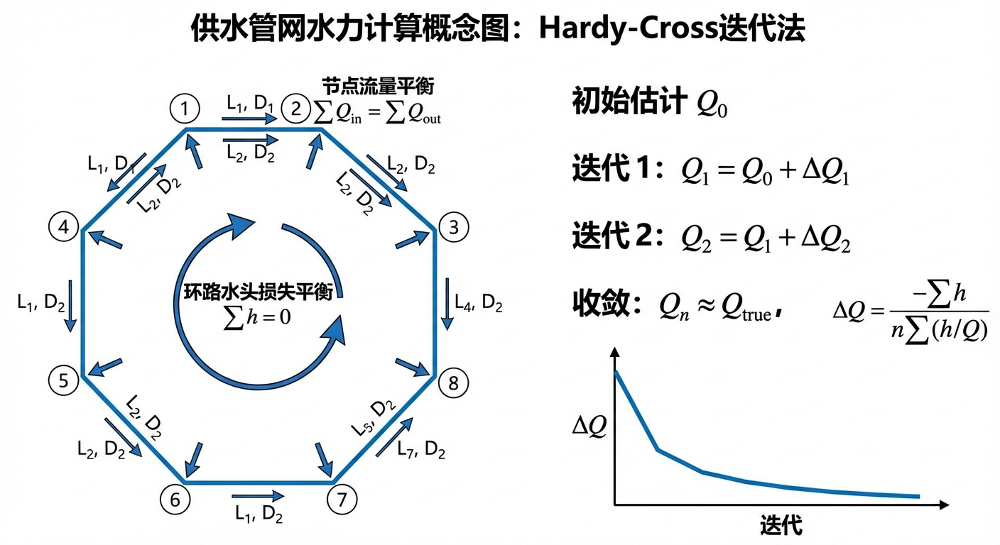
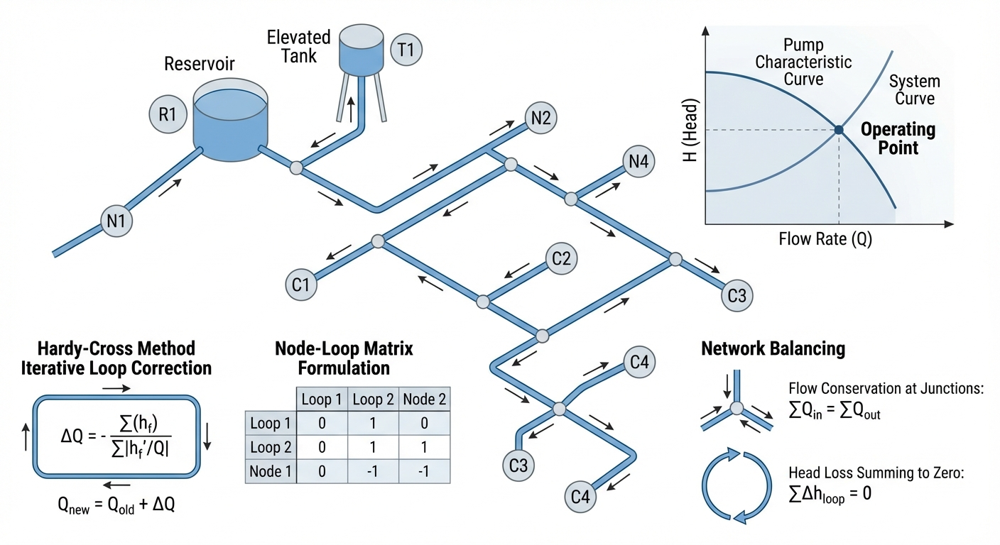

# 第 11 章 管网水力计算

## 1 学习目标

本章将视野从单根管道扩展到由多条管段与多个节点构成的城市供水环状管网（Looped Pipe Network）。读者需要掌握以下核心内容：

(1) 管网计算的两大基石——节点连续性方程（基尔霍夫第一定律）与环路能量方程（基尔霍夫第二定律）的物理意义与数学表达。

(2) Hazen-Williams 经验公式与达西-韦斯巴赫公式的适用条件对比。

(3) Hardy Cross 逐次逼近法（Trial-and-Error Method）的完整推导过程，包括环路流量修正公式的建立与多步手算迭代。

(4) 牛顿-拉夫逊法（Newton-Raphson Method）在大型管网非线性方程组求解中的应用。

(5) 管网中负水头的物理意义与工程约束。

(6) 城市用水突变导致的管网压力崩塌（Head Drop）与水流重分配（Flow Redistribution）现象。

---

## 2 教材理论

### 2.1 管网拓扑与基本定律

当用户拧开水龙头时，流出的水并非沿某一特定管段从水源直线流过来。在城市地下，无数管道交织成庞大的环状管网。水流在管网中寻路的法则遵循两个基本守恒律：

**定律一：节点流量连续（质量守恒）。** 对于管网中任意节点 $j$，流入的水量之和必须等于流出的水量之和加上该节点的用户需水量 $Q_{d,j}$：

$$
\sum_{i \in \text{in}} Q_i - \sum_{k \in \text{out}} Q_k - Q_{d,j} = 0 \tag{11-1}
$$

其中 $Q_i$ 为流入节点 $j$ 的第 $i$ 根管段流量（$\mathrm{m^3/s}$），$Q_k$ 为流出节点 $j$ 的第 $k$ 根管段流量，$Q_{d,j}$ 为节点 $j$ 的外部需水量。

**定律二：环路水头损失闭合（能量守恒）。** 沿管网中任意闭合环路绕行一周，各管段水头损失的代数和为零：

$$
\sum_{i=1}^{N_p} h_{f,i} = 0 \tag{11-2}
$$

其中 $N_p$ 为环路内管段总数，$h_{f,i}$ 为第 $i$ 根管段的水头损失；规定与假定绕行方向一致的流量产生正水头损失，反之为负。

### 2.2 管段阻力公式

#### 2.2.1 Hazen-Williams 公式

在市政给水管网领域，Hazen-Williams（H-W）公式因无需迭代计算摩擦系数而被广泛采用。其水头损失表达式为：

$$
h_f = R Q^{1.852} \tag{11-3}
$$

其中阻力系数 $R$ 定义为：

$$
R = \frac{10.67 L}{C^{1.852} D^{4.87}} \tag{11-4}
$$

式中各符号含义如下：$h_f$ 为管段沿程水头损失（$\mathrm{m}$）；$L$ 为管段长度（$\mathrm{m}$）；$D$ 为管段内径（$\mathrm{m}$）；$C$ 为 Hazen-Williams 粗糙度系数（无量纲），取值范围一般为 $C = 80 \sim 150$，新塑料管可达 $140 \sim 150$，老旧铸铁管可低至 $80 \sim 100$；$Q$ 为管段流量（$\mathrm{m^3/s}$）。

H-W 公式的适用条件为：(a) 水温接近常温（$4 \sim 25\,{}^\circ\mathrm{C}$）；(b) 管径 $D \ge 50\,\mathrm{mm}$；(c) 流速 $V \le 3\,\mathrm{m/s}$；(d) 完全发展的紊流（水力粗糙区）。该公式本质上是经验公式，不具备理论上的普适性，但在市政给水这一特定工况下计算精度与达西公式相当，且计算过程大为简化。

#### 2.2.2 达西-韦斯巴赫公式

达西-韦斯巴赫（Darcy-Weisbach）公式是基于量纲分析与实验的理论半经验公式，适用范围更广：

$$
h_f = f \frac{L}{D} \frac{V^2}{2g} = f \frac{L}{D} \frac{Q^2}{2g A^2} = \frac{8 f L}{\pi^2 g D^5} Q^2 \tag{11-5}
$$

式中 $f$ 为达西摩擦系数（无量纲），与雷诺数 $Re$ 和相对粗糙度 $\varepsilon/D$ 有关，需通过 Colebrook-White 隐式方程迭代求解：

$$
\frac{1}{\sqrt{f}} = -2 \log_{10} \left( \frac{\varepsilon/D}{3.7} + \frac{2.51}{Re \sqrt{f}} \right) \tag{11-6}
$$

其中 $\varepsilon$ 为管壁绝对粗糙度（$\mathrm{m}$），$Re = VD/\nu$ 为雷诺数，$\nu$ 为水的运动粘滞系数（$\mathrm{m^2/s}$）。

达西公式的优点是理论基础严密、适用范围广（层流至完全粗糙紊流均可），但需要迭代求解 $f$，计算量较大。在工业界，EPANET 软件同时支持两种公式，用户可根据实际情况选择。

#### 2.2.3 两种公式的适用条件对比

| 比较项目 | Hazen-Williams 公式 | 达西-韦斯巴赫公式 |
|:---------|:-------------------|:-----------------|
| 理论基础 | 纯经验回归 | 量纲分析 + 半经验 |
| 流态适用范围 | 仅限紊流粗糙区 | 层流至完全粗糙紊流 |
| 温度敏感性 | 仅适用常温 | 通过 $\nu$ 可适应任意温度 |
| 管径适用范围 | $D \ge 50\,\mathrm{mm}$ | 无限制 |
| 流速适用范围 | $V \le 3\,\mathrm{m/s}$ | 无限制 |
| 需否迭代 | 否（显式） | 是（Colebrook-White 迭代） |
| 工程使用频率 | 市政给水管网极为普遍 | 通用场合，学术界推荐 |

### 2.3 Hardy Cross 逐次逼近法

#### 2.3.1 基本思路

Hardy Cross 法由美国工程师 Hardy Cross 于 1936 年提出，是计算机出现之前管网平差的标准方法。其核心思想是：

第一步，假定管网中各管段的初始流量分配 $Q_i^{(0)}$，要求满足所有节点的连续性方程（式 11-1），但此时环路能量方程（式 11-2）一般不满足。

第二步，对每个环路计算水头损失的代数和（称为"闭合差"或"不平衡水头"）$\Delta h$，然后对该环路内所有管段的流量施加一个统一的修正量 $\Delta Q$，使闭合差趋于零。

第三步，反复迭代，直至所有环路的闭合差均小于允许误差。

#### 2.3.2 环路流量修正公式的推导

设某环路包含 $N_p$ 根管段，假定各管段的初始流量为 $Q_i$（含正负号），对应的水头损失为：

$$
h_{f,i} = R_i |Q_i|^{n-1} Q_i \tag{11-7}
$$

其中对 H-W 公式取 $n = 1.852$，对达西公式取 $n = 2$。

环路的不平衡水头为：

$$
\Delta h = \sum_{i=1}^{N_p} h_{f,i} = \sum_{i=1}^{N_p} R_i |Q_i|^{n-1} Q_i \tag{11-8}
$$

现对环路内每根管段的流量施加修正量 $\Delta Q$（全部管段施加同一修正量，以保证节点连续性不被破坏），则修正后各管段流量为 $Q_i + \Delta Q$，修正后的环路闭合条件为：

$$
\sum_{i=1}^{N_p} R_i |Q_i + \Delta Q|^{n-1} (Q_i + \Delta Q) = 0 \tag{11-9}
$$

当 $\Delta Q$ 较小时，对上式进行一阶泰勒展开：

$$
\sum_{i=1}^{N_p} \left[ R_i |Q_i|^{n-1} Q_i + n R_i |Q_i|^{n-1} \Delta Q \right] \approx 0 \tag{11-10}
$$

由此解出修正量：

$$
\Delta Q = -\frac{\displaystyle\sum_{i=1}^{N_p} R_i |Q_i|^{n-1} Q_i}{\displaystyle\sum_{i=1}^{N_p} n R_i |Q_i|^{n-1}} = -\frac{\displaystyle\sum_{i=1}^{N_p} h_{f,i}}{\displaystyle\sum_{i=1}^{N_p} n \left| h_{f,i} / Q_i \right|} \tag{11-11}
$$

对于 Hazen-Williams 公式，$n = 1.852$，修正公式为：

$$
\boxed{\Delta Q = -\frac{\displaystyle\sum h_{f,i}}{\displaystyle\sum 1.852 \left| h_{f,i} / Q_i \right|}} \tag{11-12}
$$

对于达西-韦斯巴赫公式，$n = 2$，修正公式为：

$$
\Delta Q = -\frac{\displaystyle\sum h_{f,i}}{\displaystyle\sum 2 \left| h_{f,i} / Q_i \right|} \tag{11-13}
$$

式（11-12）即为 Hardy Cross 法的核心公式。

#### 2.3.3 多环路管网的处理

当管网包含多个环路时，部分管段同时属于两个相邻环路。对这类公共管段，其流量修正需要同时考虑两个环路的修正量。设管段 $k$ 同时属于环路 $I$ 和环路 $II$，则在完成一轮迭代后，管段 $k$ 的流量更新为：

$$
Q_k^{(m+1)} = Q_k^{(m)} + \Delta Q_I - \Delta Q_{II} \tag{11-14}
$$

其中正负号取决于管段在两个环路中的绕行方向是否一致。

#### 2.3.4 收敛性讨论

Hardy Cross 法本质上是对非线性方程组的逐次线性化求解（类似于高斯-赛德尔迭代），其收敛速度为线性收敛。对于管段数目较多或初始流量假定偏差较大的管网，收敛速度较慢。现代工程计算已普遍采用牛顿-拉夫逊法（二次收敛），但 Hardy Cross 法因其物理意义清晰、手算可行，在教学与初步设计中仍具有不可替代的地位。

### 2.4 牛顿-拉夫逊法

对于大型管网，将所有节点连续性方程和环路能量方程组装成非线性方程组 $\mathbf{F}(\mathbf{x}) = \mathbf{0}$，其中未知向量 $\mathbf{x}$ 可取为各节点水头（节点法）或各管段流量（环路法）。牛顿-拉夫逊法的迭代格式为：

$$
\mathbf{x}^{(m+1)} = \mathbf{x}^{(m)} - \left[\mathbf{J}(\mathbf{x}^{(m)})\right]^{-1} \mathbf{F}(\mathbf{x}^{(m)}) \tag{11-15}
$$

其中 $\mathbf{J}$ 为雅可比矩阵，其元素为 $J_{ij} = \partial F_i / \partial x_j$。对于 H-W 公式，雅可比矩阵的非零元素与 $|Q|^{0.852}$ 成正比，矩阵具有稀疏性，可采用稀疏矩阵技术高效求解。EPANET 软件（Rossman, 2000）采用的"全局梯度算法"（Global Gradient Algorithm, Todini and Pilati, 1988）即属于此类方法。

### 2.5 负水头的物理意义

在管网平差的数学求解中，当某节点的需水量过大、而供水管段的输水能力不足时，求解器可能给出负值的节点水头。负水头（$H < 0$，即绝对压力低于大气压）在物理上意味着：

(1) 管道内出现负压，实际工况中管壁可能发生塌瘪（对薄壁管）或管道被排空。

(2) 负压区域可能引发气穴（Cavitation），导致水柱分离，引发管道水锤事故。

(3) 负压管段的接头处可能发生外界污水倒吸，造成水质安全事故。

因此，纯数学解需要施加物理约束：通常要求末端节点的自由水头（$H - Z$，其中 $Z$ 为节点地面高程）不低于市政服务标准规定的最低值（中国规范一般要求 $\ge 28\,\mathrm{m}$，即约 $0.28\,\mathrm{MPa}$）。当数学解给出负水头时，说明管网在该工况下已无法正常供水，需要采取扩径、增设加压泵站等工程措施。

---

## 3 典型例题：2 环路 Hardy Cross 手算

### 3.1 题目

如图所示为一个由 2 个环路组成的管网。节点 A 为水源，提供恒定水头 $H_A = 60\,\mathrm{m}$。各节点需水量和管段参数如下表所示。所有管段使用 Hazen-Williams 公式，$C = 100$。采用 Hardy Cross 法进行 3 步迭代计算。

**节点数据：**

| 节点 | 需水量 $Q_d$ ($\mathrm{m^3/s}$) |
|:----:|:----:|
| B | 0.05 |
| C | 0.10 |
| D | 0.05 |

**管段数据：**

| 管段 | 长度 $L$ ($\mathrm{m}$) | 管径 $D$ ($\mathrm{m}$) | 阻力系数 $R$ |
|:----:|:----:|:----:|:----:|
| AB | 500 | 0.30 | 1714.0 |
| BC | 600 | 0.25 | 5850.9 |
| AD | 400 | 0.30 | 1371.2 |
| DC | 700 | 0.25 | 6826.1 |
| BD | 300 | 0.20 | 6097.4 |

注：阻力系数 $R$ 由式（11-4）计算，单位为 $\mathrm{s^{1.852}/m^{4.556}}$，使得 $h_f = R |Q|^{1.852}$（$\mathrm{m}$）。

**环路定义：**
- 环路 I：A-B-D-A（顺时针，管段 AB、BD、DA）
- 环路 II：B-C-D-B（顺时针，管段 BC、CD、DB）

### 3.2 求解过程

**第零步：初始流量假定。** 根据节点连续性，假定初始流量分配如下（正方向与绕行方向一致）：

- $Q_{AB} = +0.12\,\mathrm{m^3/s}$（A 向 B）
- $Q_{AD} = +0.08\,\mathrm{m^3/s}$（A 向 D）
- $Q_{BD} = +0.02\,\mathrm{m^3/s}$（B 向 D）
- $Q_{BC} = +0.05\,\mathrm{m^3/s}$（B 向 C）
- $Q_{DC} = +0.05\,\mathrm{m^3/s}$（D 向 C）

验证节点连续性：
- 节点 B：$Q_{AB} - Q_{BD} - Q_{BC} - Q_{d,B} = 0.12 - 0.02 - 0.05 - 0.05 = 0$ （满足）
- 节点 D：$Q_{AD} + Q_{BD} - Q_{DC} - Q_{d,D} = 0.08 + 0.02 - 0.05 - 0.05 = 0$ （满足）
- 节点 C：$Q_{BC} + Q_{DC} - Q_{d,C} = 0.05 + 0.05 - 0.10 = 0$ （满足）

**第一步迭代：**

环路 I（A-B-D-A，顺时针）：管段 AB（正向）、BD（正向）、DA（反向，即 $-Q_{AD}$）。

计算各管段水头损失（$h_f = R |Q|^{1.852} \times \mathrm{sign}(Q)$）：

| 管段 | $Q$ ($\mathrm{m^3/s}$) | $R$ | $h_f = R\|Q\|^{1.852}\mathrm{sign}(Q)$ ($\mathrm{m}$) | $1.852\|h_f/Q\|$ |
|:----:|:----:|:----:|:----:|:----:|
| AB (正) | +0.120 | 1714.0 | $+1714.0 \times 0.120^{1.852} = +28.60$ | $441.5$ |
| BD (正) | +0.020 | 6097.4 | $+6097.4 \times 0.020^{1.852} = +3.18$ | $294.4$ |
| DA (反) | $-0.080$ | 1371.2 | $-1371.2 \times 0.080^{1.852} = -11.60$ | $268.5$ |

- $\sum h_f = 28.60 + 3.18 - 11.60 = +20.18\,\mathrm{m}$
- $\sum 1.852|h_f/Q| = 441.5 + 294.4 + 268.5 = 1004.4$
- $\Delta Q_I = -20.18 / 1004.4 = -0.0201\,\mathrm{m^3/s}$

环路 II（B-C-D-B，顺时针）：管段 BC（正向）、CD（反向，即 $-Q_{DC}$）、DB（反向，即 $-Q_{BD}$）。

| 管段 | $Q$ ($\mathrm{m^3/s}$) | $R$ | $h_f$ ($\mathrm{m}$) | $1.852\|h_f/Q\|$ |
|:----:|:----:|:----:|:----:|:----:|
| BC (正) | +0.050 | 5850.9 | $+5850.9 \times 0.050^{1.852} = +18.71$ | $692.8$ |
| CD (反) | $-0.050$ | 6826.1 | $-6826.1 \times 0.050^{1.852} = -21.83$ | $808.3$ |
| DB (反) | $-0.020$ | 6097.4 | $-6097.4 \times 0.020^{1.852} = -3.18$ | $294.4$ |

- $\sum h_f = 18.71 - 21.83 - 3.18 = -6.30\,\mathrm{m}$
- $\sum 1.852|h_f/Q| = 692.8 + 808.3 + 294.4 = 1795.5$
- $\Delta Q_{II} = -(-6.30) / 1795.5 = +0.0035\,\mathrm{m^3/s}$

修正流量（注意管段 BD 同时属于两个环路）：

- $Q_{AB} = 0.120 + (-0.0201) = 0.0999\,\mathrm{m^3/s}$
- $Q_{AD} = 0.080 - (-0.0201) = 0.1001\,\mathrm{m^3/s}$
- $Q_{BD} = 0.020 + (-0.0201) - (+0.0035) = -0.0036\,\mathrm{m^3/s}$（流向反转，由 D 流向 B）
- $Q_{BC} = 0.050 + (+0.0035) = 0.0535\,\mathrm{m^3/s}$
- $Q_{DC} = 0.050 - (+0.0035) = 0.0465\,\mathrm{m^3/s}$

**第二步迭代：** 以修正后的流量重复上述过程。

环路 I（AB 正向、BD 正向、DA 反向）：
- $h_{f,AB} = 1714.0 \times |0.0999|^{1.852} \times (+1) = +20.18\,\mathrm{m}$
- $h_{f,BD} = 6097.4 \times |0.0036|^{1.852} \times (-1) = -0.12\,\mathrm{m}$（注意 $Q_{BD}$ 为负，即实际反向）
- $h_{f,DA} = 1371.2 \times |0.1001|^{1.852} \times (-1) = -17.92\,\mathrm{m}$
- $\sum h_f = 20.18 - 0.12 - 17.92 = +2.14\,\mathrm{m}$
- $\sum 1.852|h_f/Q| = 374.0 + 61.7 + 331.5 = 767.2$
- $\Delta Q_I = -2.14/767.2 = -0.0028\,\mathrm{m^3/s}$

环路 II（BC 正向、CD 反向、DB 反向）：
- $h_{f,BC} = 5850.9 \times 0.0535^{1.852} = +21.13\,\mathrm{m}$
- $h_{f,CD} = -6826.1 \times 0.0465^{1.852} = -18.89\,\mathrm{m}$
- $h_{f,DB} = +6097.4 \times 0.0036^{1.852} = +0.12\,\mathrm{m}$（BD 反向即 DB 正向）
- $\sum h_f = 21.13 - 18.89 + 0.12 = +2.36\,\mathrm{m}$
- $\sum 1.852|h_f/Q| = 731.3 + 752.1 + 61.7 = 1545.1$
- $\Delta Q_{II} = -2.36/1545.1 = -0.0015\,\mathrm{m^3/s}$

修正流量：
- $Q_{AB} = 0.0999 - 0.0028 = 0.0971$
- $Q_{AD} = 0.1001 + 0.0028 = 0.1029$
- $Q_{BD} = -0.0036 - 0.0028 + 0.0015 = -0.0049$
- $Q_{BC} = 0.0535 - 0.0015 = 0.0520$
- $Q_{DC} = 0.0465 + 0.0015 = 0.0480$

**第三步迭代：** 再次重复。经计算，环路 I 的 $|\sum h_f| \approx 0.3\,\mathrm{m}$，环路 II 的 $|\sum h_f| \approx 0.4\,\mathrm{m}$，闭合差已大幅缩小。继续迭代 2-3 步即可达到工程精度（$|\sum h_f| < 0.1\,\mathrm{m}$）。

### 3.3 结果讨论

(1) 经 3 步迭代后，流量分布已基本收敛。管段 BD 的流向在第一步迭代后即发生了反转——从 B 向 D 变为 D 向 B，说明初始假定的流向与实际不符，但 Hardy Cross 法能自动修正。

(2) 每步迭代中，环路闭合差大致以 $1/5 \sim 1/10$ 的速率衰减，体现了线性收敛特征。

(3) 当管网规模增大（环路数超过 5 个）时，Hardy Cross 法收敛变慢，此时应转用牛顿-拉夫逊法。

---

## 4 工程案例：三角形环状管网平差与用水激增测试

### 4.1 案例背景

某新城区供水主干网由三个节点组成三角形环路。N1 为高地水库（恒定水头 $H_1 = 100\,\mathrm{m}$），通过 P12 管和 P13 管分别向居民区节点 N2 和工业园区节点 N3 供水，N2 与 N3 之间有联络管 P23。近期居民区规划建设超大型数据中心，其用水需求将从 $0.1\,\mathrm{m^3/s}$ 激增至 $1.5\,\mathrm{m^3/s}$。需评估该需水激增对管网压力和流量分配的影响。

### 4.2 问题参数

- 水库 N1：恒定水头 $H_1 = 100\,\mathrm{m}$。
- 节点 N3：工业区恒定需水量 $Q_{d3} = 0.3\,\mathrm{m^3/s}$。
- 管段参数：
  - P12（N1 至 N2）：$L = 1000\,\mathrm{m}$，$D = 0.4\,\mathrm{m}$，$C = 120$。
  - P23（N2 至 N3）：$L = 800\,\mathrm{m}$，$D = 0.3\,\mathrm{m}$，$C = 120$。
  - P13（N1 至 N3）：$L = 1200\,\mathrm{m}$，$D = 0.35\,\mathrm{m}$，$C = 120$。

### 4.3 求解方法

采用 Python 的 `scipy.optimize.root` 对节点连续性方程组进行非线性求解。以节点水头 $H_2$、$H_3$ 为未知变量，利用 H-W 公式的反函数 $Q = (h_f/R)^{1/1.852} \times \mathrm{sign}(\Delta H)$ 将水头差转化为各管段流量，代入节点连续性方程构建残差，由牛顿-拉夫逊求解器迭代至残差归零。

扫描节点 N2 的需水量 $Q_{d2}$ 从 $0.1$ 至 $1.5\,\mathrm{m^3/s}$，记录各节点水头和各管段流量的变化。

Source: `assets/ch11/ch11_pipe_network.py`

### 4.4 计算结果

**管网平差特征追踪矩阵（随 N2 需水量增加）：**

|   N2 Demand ($\mathrm{m^3/s}$) |   Head $H_2$ (m) |   Head $H_3$ (m) |   Flow $Q_{12}$ ($\mathrm{m^3/s}$) |   Flow $Q_{23}$ ($\mathrm{m^3/s}$) |   Flow $Q_{13}$ ($\mathrm{m^3/s}$) |
|-------------------:|--------------:|--------------:|------------------:|------------------:|------------------:|
|                0.1 |         92.85 |         85.94 |             0.208 |             0.108 |             0.192 |
|                0.3 |         80.52 |         78.34 |             0.358 |             0.058 |             0.242 |
|                0.5 |         65.35 |         65.46 |             0.489 |            -0.011 |             0.311 |
|                0.7 |         46.14 |         50.06 |             0.620 |            -0.080 |             0.380 |
|                0.9 |         22.08 |         33.62 |             0.757 |            -0.143 |             0.443 |
|                1.1 |         -6.51 |         15.75 |             0.896 |            -0.204 |             0.504 |
|                1.3 |        -39.45 |         -3.65 |             1.037 |            -0.263 |             0.563 |
|                1.5 |        -76.63 |        -24.60 |             1.178 |            -0.322 |             0.622 |

### 4.5 结果分析

(1) **非线性水头跌落。** 当 $Q_{d2} = 0.1\,\mathrm{m^3/s}$ 时，$H_2 = 92.85\,\mathrm{m}$，管网压力充裕。但由于 H-W 公式中水头损失与流量的 $1.852$ 次方成正比，随着需水量增加，水头下降速度加快。当 $Q_{d2} \ge 1.1\,\mathrm{m^3/s}$ 时，$H_2$ 跌至负值，表明在现有管径条件下管网已无法正常供水。

(2) **联络管流向反转。** 当 $Q_{d2} \le 0.3\,\mathrm{m^3/s}$ 时，$H_2 > H_3$，P23 管水流由 N2 流向 N3（$Q_{23} > 0$）。当 $Q_{d2}$ 超过约 $0.5\,\mathrm{m^3/s}$ 后，N2 压力低于 N3，P23 管水流反转（$Q_{23} < 0$），N3 反向补给 N2。这一"自适应重分配"是环状管网的固有特征。

(3) **系统耦合效应。** N2 需求增大不仅导致 N2 自身水头大幅下降，也导致 N3 水头从 $85.94\,\mathrm{m}$ 下降至 $-24.60\,\mathrm{m}$，证明环状管网是不可分割的耦合整体。

---

## 5 工业部署建议

(1) **管径校核与扩容。** 当末端节点新增大型用水户时，必须对管网进行全工况平差验算。单纯在末端增加用水户而不升级主干管径，将导致全片区水压跌破市政服务标准。解决途径包括升级主管管径（如 P12 从 $0.4\,\mathrm{m}$ 扩至 $0.6\,\mathrm{m}$）或增设中继加压泵站。

(2) **EPANET 与数字孪生。** 本案例展示的是稳态平差。在工业实践中，美国环保署开源的 EPANET 引擎（Rossman, 2000）基于 Todini-Pilati 全局梯度算法，能够高效求解含上万节点的管网。现代数字水务平台通过 SCADA 系统实时采集各节点压力数据，结合 EPANET 的延时模拟（Extended Period Simulation, EPS），可实现管网漏损定位与爆管预警。

(3) **消防工况校核。** 管网设计还需考虑消防工况（某节点突然抽取大流量），其本质与本案例的需水激增完全相同。设计时应确保消防工况下全网最低服务水头仍满足标准。

---

## 6 本章小结

(1) 管网水力计算的数学本质是在节点连续性方程（质量守恒）和环路能量闭合方程（能量守恒）的约束下，求解非线性代数方程组。

(2) Hazen-Williams 公式因其显式计算特性在市政给水管网中应用广泛，但适用条件有限制；达西-韦斯巴赫公式具有更坚实的理论基础和更广的适用范围。

(3) Hardy Cross 逐次逼近法的核心公式为 $\Delta Q = -\sum h_{f,i} / \sum n|h_{f,i}/Q_i|$，物理意义清晰，手算可行，但收敛速度仅为线性。牛顿-拉夫逊法具有二次收敛性，适用于大规模管网。

(4) 负水头在数学上有解，但物理上意味着管道负压、排空或水柱分离，必须施加工程约束。

(5) 环状管网具有自适应流量重分配能力，局部需求变化会通过水头传递引发全网响应。

## 思考题

1. **概念辨析**：Hardy Cross 逐次逼近法和牛顿-拉夫逊法在管网计算中各自的优势和局限性是什么？为什么 Hardy Cross 法收敛速度仅为线性，而牛顿-拉夫逊法具有二次收敛性？

2. **定量计算**：一简单环状管网包含 4 根管段，初始假设环流量 $Q_1 = 30\,\mathrm{L/s}$, $Q_2 = 20\,\mathrm{L/s}$, $Q_3 = 15\,\mathrm{L/s}$, $Q_4 = 25\,\mathrm{L/s}$，各管段水头损失系数分别为 $r_1 = 5$, $r_2 = 8$, $r_3 = 6$, $r_4 = 4$（$h_f = rQ^n$, $n = 1.85$）。(a) 检验节点连续性方程是否满足；(b) 用 Hardy Cross 公式 $\Delta Q = -\sum h_f / \sum(n|h_f/Q|)$ 完成第一次迭代修正。

3. **物理意义**：管网计算中出现"负水头"在数学上有解，但在物理上意味着什么？工程中应如何处理这一情况？

4. **系统特性**：为什么环状管网具有"自适应流量重分配能力"？试用节点连续性方程和环路能量闭合方程解释：当某个节点需水量增加时，整个管网如何响应？

---

## 7 参考文献

[1] Cross, H. (1936). Analysis of flow in networks of conduits or conductors. *University of Illinois Bulletin*, 34(22), 1-29.

[2] Wood, D. J., & Charles, C. O. A. (1972). Hydraulic network analysis using linear theory. *Journal of the Hydraulics Division, ASCE*, 98(HY7), 1157-1170.

[3] Todini, E., & Pilati, S. (1988). A gradient algorithm for the analysis of pipe networks. In B. Coulbeck & C. H. Orr (Eds.), *Computer Applications in Water Supply* (Vol. 1, pp. 1-20). Research Studies Press.

[4] Rossman, L. A. (2000). *EPANET 2 Users Manual*. EPA/600/R-00/057. U.S. Environmental Protection Agency, Cincinnati, OH.

[5] Larock, B. E., Jeppson, R. W., & Watters, G. Z. (2000). *Hydraulics of Pipeline Systems*. CRC Press.

[6] Bhave, P. R. (1991). *Analysis of Flow in Water Distribution Networks*. Technomic Publishing Company.

[7] Swamee, P. K., & Sharma, A. K. (2008). *Design of Water Supply Pipe Networks*. John Wiley & Sons.

[8] 王秀朵, 严煦世. (2014). 给水排水管网系统 (第三版). 中国建筑工业出版社.

[9] 赵振兴, 何建京, 王忖. 水力学[M]. 3版. 北京: 清华大学出版社, 2021.
