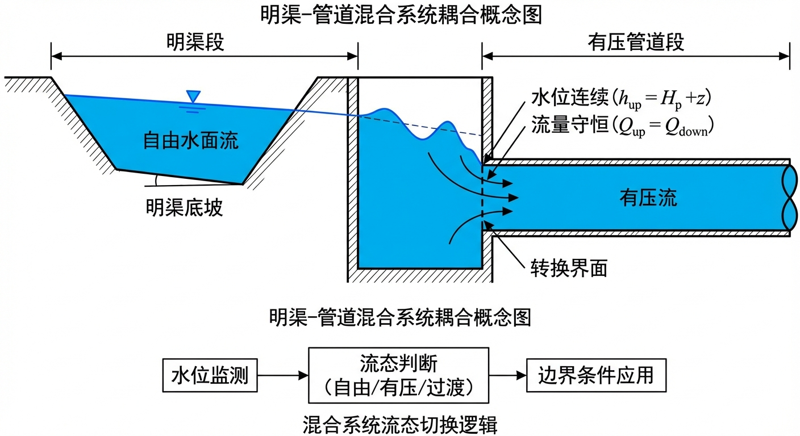
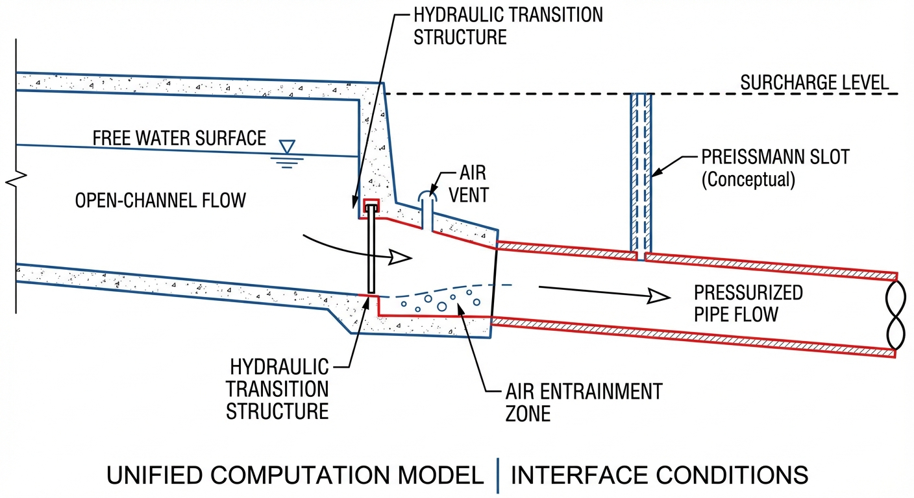
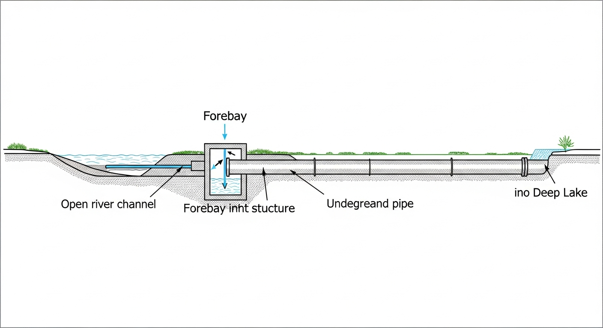
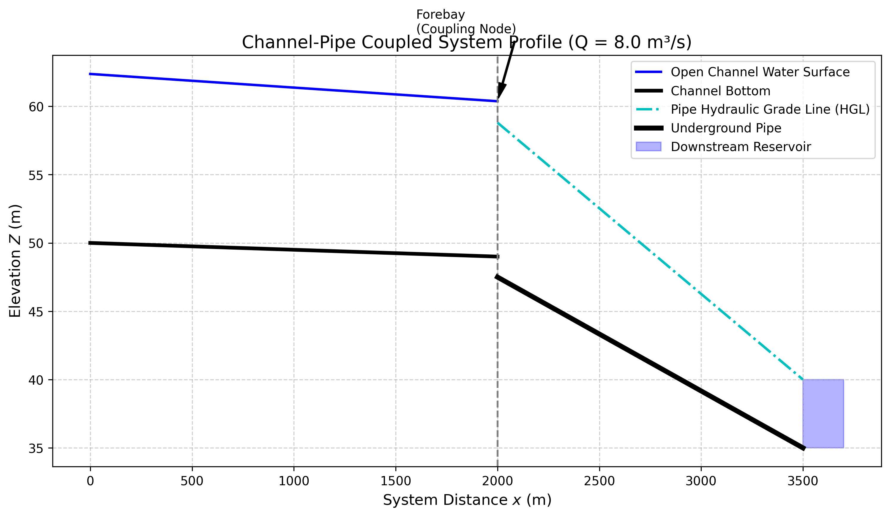

# 第 12 章 明渠-管道混合系统耦合

## 1 学习目标

本章打破明渠水力学与有压管流的学科壁垒，系统探讨长距离调水工程中最复杂的水力交界——明满流过渡与前池耦合。读者需要掌握以下核心内容：

(1) 渠道-前池-管道（Channel-Forebay-Pipe）系统的稳态能量耦合原理，包括耦合节点处的质量守恒与能量衔接方程。

(2) 管道阻力计算公式（达西-韦斯巴赫公式与局部损失）的完整表达。

(3) 下游管道阻力对上游明渠水面曲线的逆向决定作用（"顶托效应"）。

(4) 自由跌水（Free Fall）与淹没出流（Submerged）两种流态的定量判别准则。

(5) 标准步长法基本方程的差分形式及其在混合系统中的应用。

(6) 瞬态耦合的基本概念与稳态假设的局限性。

---

## 2 教材理论

### 2.1 混合系统的工程背景

在跨流域调水工程（如南水北调中线工程）中，水流并非始终在同一种水力结构中运行。典型的输水路径为：明渠段流行数十公里后，遇到山体或城市，通过前池（Forebay）转入暗涵或倒虹吸管道，变为有压流；穿越障碍后再从出口涌出，恢复为明渠流。这种由明渠段和有压管道段交替组成的系统称为明渠-管道混合系统（Hybrid Open-Channel-Pipe System）。

在混合系统中，明渠遵循包含水深 $h$ 和流速 $V$ 的渐变流微分方程（圣维南方程的简化形式），管道遵循以两端压差驱动的伯努利能量方程。二者的水力特性截然不同，唯一的联系纽带是交接处的前池，前池在能量传递和流态过渡中起着关键的枢纽作用。

### 2.2 耦合节点方程

#### 2.2.1 质量守恒

在稳态条件下，前池不存在蓄水量的变化，因此通过前池的质量守恒方程十分简洁：

$$
Q_{\text{channel}} = Q_{\text{pipe}} = Q \tag{12-1}
$$

其中 $Q_{\text{channel}}$ 为上游明渠到达前池的流量（$\mathrm{m^3/s}$），$Q_{\text{pipe}}$ 为前池流入下游管道的流量。在稳态假设下，系统流量 $Q$ 为统一的全局变量。

需要指出的是，上述稳态假设忽略了前池的调蓄作用。在实际工况中，当系统流量发生变化时，前池水面面积 $A_s$ 会产生蓄水变化：

$$
Q_{\text{channel}} - Q_{\text{pipe}} = A_s \frac{dZ_f}{dt} \tag{12-2}
$$

其中 $Z_f$ 为前池水位（$\mathrm{m}$），$t$ 为时间（$\mathrm{s}$）。前池面积越大，水位变化越缓慢，相当于为系统提供了"液压缓冲"。在大型调水工程中，前池常设计得极为宽大（甚至利用天然湖泊），以延缓流量剧变时的水位上涨速度，为上游闸门群预留关闸切断时间。

#### 2.2.2 能量衔接方程

前池将明渠系统与管道系统在能量上衔接起来。设前池水面高程为 $Z_f$，下游水库水位为 $Z_{\text{res}}$，则有压管道必须克服的总水头损失为：

$$
Z_f = Z_{\text{res}} + h_{f,\text{pipe}} + h_{m,\text{pipe}} \tag{12-3}
$$

其中 $h_{f,\text{pipe}}$ 为管道沿程摩擦损失（$\mathrm{m}$），$h_{m,\text{pipe}}$ 为管道局部损失（进口、弯头、出口等，$\mathrm{m}$）。

式（12-3）的物理意义是：为了驱动流量 $Q$ 通过有压管道到达下游水库，前池水位必须比下游水库水位高出 $\Delta H = h_{f,\text{pipe}} + h_{m,\text{pipe}}$。

### 2.3 管道阻力计算

#### 2.3.1 沿程损失

管道沿程摩擦损失由达西-韦斯巴赫公式计算：

$$
h_{f,\text{pipe}} = f \frac{L}{D} \frac{V^2}{2g} = f \frac{L}{D} \frac{Q^2}{2g(\pi D^2/4)^2} = \frac{8fLQ^2}{\pi^2 g D^5} \tag{12-4}
$$

式中各符号含义如下：$f$ 为达西摩擦系数（无量纲）；$L$ 为管道长度（$\mathrm{m}$）；$D$ 为管道内径（$\mathrm{m}$）；$V$ 为管道内平均流速（$\mathrm{m/s}$）；$g$ 为重力加速度，取 $9.81\,\mathrm{m/s^2}$；$Q$ 为流量（$\mathrm{m^3/s}$）。

#### 2.3.2 局部损失

管道系统中的进口、出口、弯头、渐变段等局部构件造成的水头损失统一表示为：

$$
h_{m,\text{pipe}} = K_{\text{minor}} \frac{V^2}{2g} = K_{\text{minor}} \frac{Q^2}{2g(\pi D^2/4)^2} \tag{12-5}
$$

其中 $K_{\text{minor}}$ 为局部损失系数（无量纲）。对于简单的管道连接，典型取值包括：突然收缩进口 $K \approx 0.5$，突然扩大出口 $K \approx 1.0$，$90°$ 弯头 $K \approx 0.3 \sim 0.5$。

#### 2.3.3 管道总水头损失

将沿程损失与局部损失合并：

$$
\Delta H_{\text{pipe}} = h_{f,\text{pipe}} + h_{m,\text{pipe}} = \left(f\frac{L}{D} + K_{\text{minor}}\right) \frac{V^2}{2g} \tag{12-6}
$$

由式（12-6）可见，管道总水头损失与流速（或流量）的平方成正比，这是混合系统非线性耦合效应的根本来源。当系统流量增大一倍时，管道水头损失将增大至原来的四倍，这种强非线性特性使得流量扩容的代价随流量增大而急剧上升。

### 2.4 明渠水面曲线计算——标准步长法

#### 2.4.1 基本方程

明渠渐变流的基本微分方程为：

$$
\frac{dh}{dx} = \frac{S_0 - S_f}{1 - Fr^2} \tag{12-7}
$$

其中 $h$ 为水深（$\mathrm{m}$），$x$ 为沿渠距离（$\mathrm{m}$，正方向为水流方向），$S_0$ 为渠底坡度，$S_f$ 为摩擦坡度（由曼宁公式计算），$Fr = V/\sqrt{gh}$ 为弗劳德数。

#### 2.4.2 差分形式

标准步长法（Standard Step Method）将上述微分方程离散化。在相邻两个断面 $i$ 和 $i+1$ 之间（间距 $\Delta x$），能量方程的差分形式为：

$$
Z_{b,i+1} + h_{i+1} + \frac{V_{i+1}^2}{2g} = Z_{b,i} + h_i + \frac{V_i^2}{2g} + (S_{f,\text{avg}} - S_0) \Delta x \tag{12-8}
$$

化简后：

$$
h_{i+1} + \frac{V_{i+1}^2}{2g} - h_i - \frac{V_i^2}{2g} = (S_0 - \bar{S}_f) \Delta x \tag{12-9}
$$

其中 $\bar{S}_f = (S_{f,i} + S_{f,i+1})/2$ 为两断面的平均摩擦坡度。该方程对于 $h_{i+1}$ 是隐式的（因为 $V_{i+1}$ 和 $S_{f,i+1}$ 均依赖 $h_{i+1}$），需逐步迭代求解。

在混合系统中，明渠段的下游边界条件即为前池水位 $Z_f$，从该处向上游逐步逆推即可获得整段明渠的水面曲线。

### 2.5 流态判别的定量准则

前池处的流态取决于前池水位 $Z_f$ 与明渠正常水位的相对关系。定义明渠末端断面的渠底高程为 $Z_{b,\text{end}}$，正常水深为 $h_n$（由曼宁公式在给定流量 $Q$ 下求得），则：

$$
Z_{n,\text{end}} = Z_{b,\text{end}} + h_n \tag{12-10}
$$

流态判别准则如下：

(1) **自由跌水（Free Fall, M2 降水曲线）：** 当 $Z_f < Z_{n,\text{end}}$ 时，前池水位低于明渠正常水面，水流在前池处加速跌落，渠内形成 M2 型降水曲线。此时明渠水面不受前池控制，管道与明渠之间处于解耦状态。

(2) **淹没出流（Submerged, M1 壅水曲线）：** 当 $Z_f > Z_{n,\text{end}}$ 时，前池水位高于明渠正常水面，高水位向上游倒灌壅水，渠内形成 M1 型壅水曲线。此时管道阻力通过前池水位"顶托"上游明渠，二者处于强耦合状态。

(3) **临界过渡：** 当 $Z_f \approx Z_{n,\text{end}}$ 时，明渠处于正常均匀流状态，水面平行于渠底。

### 2.6 瞬态耦合的基本概念

上述分析均基于稳态假设。在实际运行中，当系统流量发生调整（如闸门启闭、泵站启停）时，管道内将产生水锤波（Water Hammer），其传播速度约为 $a = 1000 \sim 1400\,\mathrm{m/s}$；明渠内将产生重力波，其传播速度约为 $c = \sqrt{gh} \approx 1 \sim 5\,\mathrm{m/s}$。由于两种波速相差 $2 \sim 3$ 个数量级，管道系统的瞬态响应远快于明渠系统，这要求在瞬态分析中对两个子系统采用不同的时间步长，或者采用特征线法（Method of Characteristics, MOC）进行耦合求解。对管道瞬态问题的完整处理超出本章范围，可参阅 Chaudhry (2014) 和 Wylie & Streeter (1993) 的专著。

---

## 3 典型例题：渠-管耦合前池水位计算

### 3.1 题目

某引水工程中，梯形明渠末端通过前池连接一根圆管，管道出口接入下游水库。已知参数如下：

- 管道：内径 $D = 1.0\,\mathrm{m}$，长度 $L = 500\,\mathrm{m}$，达西摩擦系数 $f = 0.020$，局部损失系数 $K_{\text{minor}} = 1.5$（进口 $0.5$ + 出口 $1.0$）。
- 下游水库水位 $Z_{\text{res}} = 30\,\mathrm{m}$。
- 系统流量 $Q = 2.0\,\mathrm{m^3/s}$。
- 明渠末端渠底高程 $Z_{b,\text{end}} = 35\,\mathrm{m}$，正常水深 $h_n = 0.8\,\mathrm{m}$。

求前池水位 $Z_f$，并判别流态。

### 3.2 求解

第一步，计算管道内流速：

$$
V = \frac{Q}{A} = \frac{Q}{\pi D^2/4} = \frac{2.0}{\pi \times 1.0^2/4} = 2.546\,\mathrm{m/s}
$$

第二步，计算速度水头：

$$
\frac{V^2}{2g} = \frac{2.546^2}{2 \times 9.81} = 0.330\,\mathrm{m}
$$

第三步，计算管道总水头损失：

$$
\Delta H_{\text{pipe}} = \left(f\frac{L}{D} + K_{\text{minor}}\right) \frac{V^2}{2g} = \left(0.020 \times \frac{500}{1.0} + 1.5\right) \times 0.330 = (10.0 + 1.5) \times 0.330 = 3.795\,\mathrm{m}
$$

其中局部损失 $K_{\text{minor}} = 1.5$ 由进口突然收缩（$K = 0.5$）和出口突然扩大（$K = 1.0$）两项组成。

第四步，计算前池水位：

$$
Z_f = Z_{\text{res}} + \Delta H_{\text{pipe}} = 30.0 + 3.795 = 33.795\,\mathrm{m}
$$

第五步，流态判别：

$$
Z_{n,\text{end}} = Z_{b,\text{end}} + h_n = 35.0 + 0.8 = 35.8\,\mathrm{m}
$$

因为 $Z_f = 33.795\,\mathrm{m} < Z_{n,\text{end}} = 35.8\,\mathrm{m}$，前池水位低于明渠正常水面，故为自由跌水（Free Fall），明渠末端形成 M2 降水曲线。

### 3.3 讨论

若将流量增大至 $Q = 5.0\,\mathrm{m^3/s}$，则 $V = 6.366\,\mathrm{m/s}$，$V^2/(2g) = 2.064\,\mathrm{m}$，$\Delta H_{\text{pipe}} = 11.5 \times 2.064 = 23.74\,\mathrm{m}$，$Z_f = 53.74\,\mathrm{m}$，远高于 $Z_{n,\text{end}}$，流态转为淹没出流（M1 壅水），此时管道阻力将通过前池高水位严重顶托上游明渠。

---

## 4 工程案例：明渠-管道稳态耦合水力推演

### 4.1 案例背景

某山区引水工程包含上游长 $2000\,\mathrm{m}$ 的梯形明渠，通过过渡前池连接长 $1500\,\mathrm{m}$ 的输水圆管，最终排入下游水库。设计院需将流量从 $4.0\,\mathrm{m^3/s}$ 扩容至 $12.0\,\mathrm{m^3/s}$，须评估流量增大后前池水位和上游明渠壅水的变化情况。

### 4.2 问题参数

- 上游明渠：底宽 $b = 3.0\,\mathrm{m}$，边坡系数 $m = 1.0$，曼宁糙率 $n = 0.015$，底坡 $S_0 = 0.0005$，渠长 $2000\,\mathrm{m}$，起点底高程 $50\,\mathrm{m}$，末端底高程 $49\,\mathrm{m}$。
- 下游有压管道：内径 $D = 1.5\,\mathrm{m}$，管长 $L = 1500\,\mathrm{m}$，达西摩擦系数 $f = 0.018$。
- 下游水库：恒定水位 $Z_{\text{res}} = 40\,\mathrm{m}$。

### 4.3 求解方法

采用"自下而上的能量逆推"策略：

第一步，对给定流量 $Q$，计算管道沿程损失 $h_{f,\text{pipe}} = 8fLQ^2/(\pi^2 g D^5)$。

第二步，确定前池水位 $Z_f = Z_{\text{res}} + h_{f,\text{pipe}}$（本案例管道两端直接连接，未计入额外局部损失）。

第三步，计算明渠在该流量下的正常水深 $h_n$（由曼宁公式反算），判别流态。

第四步，以 $Z_f$ 为下游边界条件，采用标准步长法向上游逆推 $2000\,\mathrm{m}$ 明渠的水面曲线。

Source: `assets/ch12/ch12_coupled_system.py`

### 4.4 计算结果

**耦合节点（前池）水位随系统流量变化追踪矩阵：**

|   System $Q$ ($\mathrm{m^3/s}$) |   Pipe Head Loss (m) |   Forebay Water Elev $Z_f$ (m) |   Channel Normal Depth $h_n$ (m) | Coupling Status   |
|------------------:|---------------------:|---------------------------:|---------------------------:|:------------------|
|                 4 |                 5.09 |                      45.09 |                       0.92 | Free Fall (M2)    |
|                 6 |                11.46 |                      51.46 |                       1.16 | Submerged (M1)    |
|                 8 |                20.37 |                      60.37 |                       1.36 | Submerged (M1)    |
|                10 |                31.83 |                      71.83 |                       1.53 | Submerged (M1)    |
|                12 |                45.83 |                      85.83 |                       1.69 | Submerged (M1)    |

关于 $Q = 4\,\mathrm{m^3/s}$ 时管道损失的说明：$h_f = 8 \times 0.018 \times 1500 \times 4^2 / (\pi^2 \times 9.81 \times 1.5^5) = 5.09\,\mathrm{m}$。此处管道损失仅计入沿程摩擦损失，未计入局部损失。若管道进出口包含局部损失（$K_{\text{minor}} = 1.5$），则总损失将增大约 $10\% \sim 15\%$。

### 4.5 结果分析

(1) **从自由跌落到严重顶托的流态转换。** 当 $Q = 4\,\mathrm{m^3/s}$ 时，管道通畅，水头损失仅 $5.09\,\mathrm{m}$，前池水位 $45.09\,\mathrm{m}$。而明渠末端渠底高程为 $49\,\mathrm{m}$，正常水面高程约为 $49.92\,\mathrm{m}$，前池水位远低于正常水面，水流以自由跌落方式进入前池（Free Fall, M2 曲线）。

(2) **非线性阻力的急剧增长。** 由式（12-4），管道水头损失与 $Q^2$ 成正比。当流量扩容至目标值 $8.0\,\mathrm{m^3/s}$ 时，管道损失暴增至 $20.37\,\mathrm{m}$，前池水位被撑高至 $60.37\,\mathrm{m}$，远高于明渠末端的渠底（$49\,\mathrm{m}$）和正常水面。

(3) **上游明渠全面壅水。** 此时前池高水位作为下游边界条件，迫使明渠水面抬升，使整段 $2000\,\mathrm{m}$ 明渠偏离正常水深，进入 M1 壅水状态。如果渠道原先仅按正常水深 $1.36\,\mathrm{m}$ 加上超高 $0.5\,\mathrm{m}$ 设计堤高（即约 $1.9\,\mathrm{m}$），则在 $Q = 8\,\mathrm{m^3/s}$ 时前池附近已有溃堤风险。

(4) **稳态假设的局限性。** 上述计算假定系统已达到稳态。实际运行中流量调整过程需要时间，前池的调蓄作用（式 12-2）会延缓水位变化。对于快速调控场景，需采用瞬态分析方法。

---

## 5 工业部署建议

(1) **系统视角的整体设计。** 在实际工程设计中，渠道工程师和管道工程师往往各自假定静态边界条件独立计算。本案例证明这种"割裂式设计"在流量扩容时极为危险。管道非线性阻力的增长会通过前池水位传递，直接威胁上游明渠的安全。必须建立全系统耦合计算模型。

(2) **前池的水力缓冲功能。** 大型调水工程中，前池应设计足够大的面积，以充当"液压电容"。当流量剧变时，大面积前池可极大延缓水位上涨速度，为上游闸门群预留数分钟的紧急关闸时间。

(3) **流态监测与预警。** 在前池处安装水位传感器，实时监测 $Z_f$ 的变化趋势。当 $Z_f$ 接近明渠设计堤顶高程时，应自动触发上游闸门减流措施。同时建议在前池上下游各设置至少一组冗余水位计，以确保监测数据的可靠性。

(4) **扩容设计的关键参数。** 流量扩容时，应优先考虑增大管道直径而非增大水头。由式（12-4），管径 $D$ 出现在分母的 $5$ 次方上，增大管径的减损效果远优于降低摩擦系数。例如，管径从 $1.5\ \mathrm{m}$ 增大 $20\%$ 至 $1.8\ \mathrm{m}$，水头损失可降低约 $60\%$。

---

## 6 本章小结

(1) 明渠-管道混合系统的耦合核心在于前池节点。在稳态条件下，前池处满足质量守恒 $Q_{\text{channel}} = Q_{\text{pipe}}$ 和能量衔接 $Z_f = Z_{\text{res}} + \Delta H_{\text{pipe}}$。前池作为两种流态的"翻译器"，将明渠的自由表面流条件转换为管道的有压流条件，是混合系统建模中最关键的边界处理节点。

(2) 管道沿程损失由达西-韦斯巴赫公式 $h_f = fLV^2/(D \cdot 2g)$ 计算，局部损失由 $h_m = K_{\text{minor}} V^2/(2g)$ 计算，两者合计构成管道总水头损失。

(3) 前池流态判别的定量准则为：$Z_f < Z_{n,\text{end}}$ 时为自由跌水（M2），$Z_f > Z_{n,\text{end}}$ 时为淹没出流（M1）。

(4) 标准步长法通过将渐变流微分方程离散化为断面间的能量方程差分形式，实现水面曲线的逐步逆推计算。该方法对缓流从下游向上游推进，对急流从上游向下游推进，推进方向由水流的控制断面位置决定。

(5) 稳态假设忽略了前池的调蓄作用（$A_s \cdot dZ_f/dt$）。对于瞬态工况，管道水锤波速（$\sim 1000\,\mathrm{m/s}$）与明渠重力波速（$\sim 3\,\mathrm{m/s}$）相差约三个数量级，需采用不同时间步长的耦合求解策略。

## 思考题

1. **概念辨析**：明渠-管道混合系统中，前池节点的耦合条件包括哪些？稳态条件下的质量守恒和能量衔接方程分别是什么？为什么前池的调蓄作用在瞬态分析中不可忽略？

2. **定量计算**：一明渠末端通过前池连接一根管道。明渠正常水深 $y_n = 2.5\,\mathrm{m}$，渠底高程 $Z_b = 100\,\mathrm{m}$，管道长 $L = 1500\,\mathrm{m}$，直径 $D = 1.2\,\mathrm{m}$，达西摩阻系数 $f = 0.018$，局部损失系数之和 $\sum K = 2.5$，流量 $Q = 1.5\,\mathrm{m^3/s}$。(a) 计算管道总水头损失；(b) 确定前池所需最低水位 $Z_f$；(c) 判断明渠末端属于 M1 还是 M2 水面曲线。

3. **时间尺度分析**：管道水锤波速（约 $1000\,\mathrm{m/s}$）与明渠重力波速（约 $3\,\mathrm{m/s}$）相差约三个数量级。这对耦合数值求解策略有何影响？为什么需要采用不同时间步长？

4. **工程应用**：在长距离调水工程中，明渠段和管道段（倒虹吸）交替出现。试分析这种混合系统水力衔接设计的关键要点。

---

## 7 参考文献

[1] Chaudhry, M. H. (2008). *Open-Channel Flow* (2nd ed.). Springer.

[2] Sturm, T. W. (2001). *Open Channel Hydraulics*. McGraw-Hill.

[3] 吴持恭. (2008). 水力学 (第四版). 高等教育出版社.

[4] Chaudhry, M. H. (2014). *Applied Hydraulic Transients* (3rd ed.). Springer.

[5] Wylie, E. B., & Streeter, V. L. (1993). *Fluid Transients in Systems*. Prentice Hall.

[6] Akan, A. O. (2006). *Open Channel Hydraulics*. Butterworth-Heinemann.

[7] Henderson, F. M. (1966). *Open Channel Flow*. Macmillan.

[8] French, R. H. (1985). *Open-Channel Hydraulics*. McGraw-Hill.

[9] 雷晓辉, 苏承国, 龙岩, 等. 基于无人驾驶理念的下一代自主运行智慧水网架构与关键技术 [J]. 南水北调与水利科技(中英文), 2025, 23(04): 778-786. DOI: 10.13476/j.cnki.nsbdqk.2025.0079.
