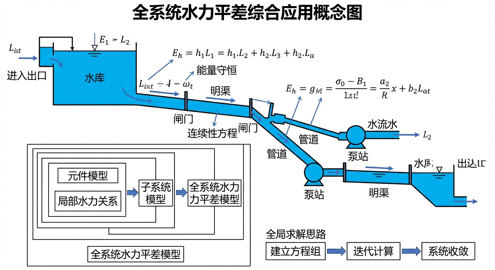
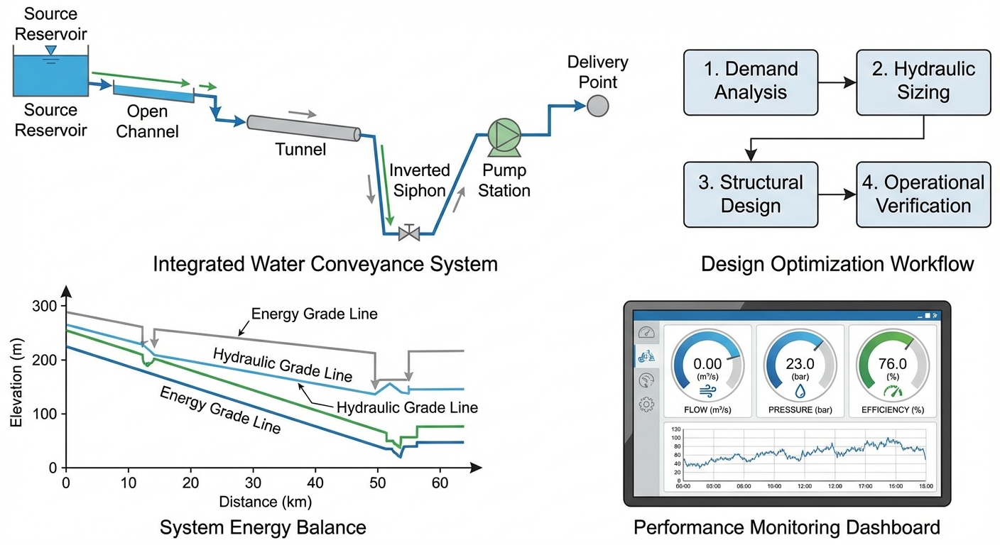

# 第 13 章 综合应用——全系统水力平差

## 1 学习目标

本章是全书的综合应用高潮，将前面章节所学的泵站特性、有压管流、明渠恒定流、倒虹吸结构等各类水力元件拼装为一个完整的串联式调水系统（泵站-管道-明渠-倒虹吸）。读者需要掌握以下核心内容：

(1) 全系统能量守恒方程的建立——从取水源头到输水终点的完整能量链。

(2) 各段阻力公式的逐项展开：管道达西公式、明渠曼宁公式、倒虹吸沿程损失与局部损失。

(3) 水泵特性曲线（$H$-$Q$ 曲线）与系统阻力曲线的交点匹配——工况点寻优。

(4) 水泵效率与功率的基本概念。

(5) 割线法求根的基本步骤与公式。

(6) 全景水力剖面图（水面线与能量线 HGL/EGL）的绘制方法。

---

## 2 教材理论

### 2.1 全系统能量方程

在大型调水工程中，水流从取水源头到输水终点经历多种水力结构的串联：

$$
\text{水源水库} \xrightarrow{\text{水泵加压}} \text{压力管道} \xrightarrow{\text{出流}} \text{高位水池} \xrightarrow{\text{重力流}} \text{明渠} \xrightarrow{\text{下潜}} \text{倒虹吸} \xrightarrow{\text{排入}} \text{终点水库}
$$

在这一系统中，流量 $Q$ 是唯一的全局未知数。系统在某一平衡流量 $Q^*$ 下运行，满足总能量守恒：

$$
H_{\text{pump}}(Q) = (Z_{\text{dest}} - Z_{\text{source}}) + \Delta H_{\text{pipe1}}(Q) + \Delta H_{\text{channel}}(Q) + \Delta H_{\text{siphon}}(Q) \tag{13-1}
$$

式中各符号含义如下：$H_{\text{pump}}(Q)$ 为水泵在流量 $Q$ 下提供的扬程（$\mathrm{m}$）；$Z_{\text{source}}$ 为水源水库水位（$\mathrm{m}$）；$Z_{\text{dest}}$ 为终点水库水位（$\mathrm{m}$）；$\Delta H_{\text{pipe1}}(Q)$ 为压力管道总水头损失（$\mathrm{m}$）；$\Delta H_{\text{channel}}(Q)$ 为明渠段总水头损失（$\mathrm{m}$）；$\Delta H_{\text{siphon}}(Q)$ 为倒虹吸段总水头损失（$\mathrm{m}$）。

系统将自动"试探"各种流量，直到找到使等式两端恰好平衡的唯一平衡点 $Q^*$。定义残差函数：

$$
F(Q) = H_{\text{pump}}(Q) - \left[(Z_{\text{dest}} - Z_{\text{source}}) + \Delta H_{\text{pipe1}}(Q) + \Delta H_{\text{channel}}(Q) + \Delta H_{\text{siphon}}(Q)\right] = 0 \tag{13-2}
$$

### 2.2 各段阻力公式逐项展开

#### 2.2.1 压力管道（达西公式）

$$
\Delta H_{\text{pipe1}} = f_1 \frac{L_1}{D_1} \frac{V_1^2}{2g} = \frac{8 f_1 L_1}{\pi^2 g D_1^5} Q^2 \tag{13-3}
$$

其中 $f_1$ 为管道达西摩擦系数（无量纲），$L_1$ 为管长（$\mathrm{m}$），$D_1$ 为管径（$\mathrm{m}$），$V_1 = Q/(\pi D_1^2/4)$ 为管内流速（$\mathrm{m/s}$）。

#### 2.2.2 明渠段（曼宁公式）

明渠段的水头损失等于沿渠的水面高程差。在均匀流（正常水深）假设下，摩擦坡度等于渠底坡度 $S_0$，总水头损失为：

$$
\Delta H_{\text{channel}} = S_f \cdot L_c \tag{13-4}
$$

其中 $L_c$ 为明渠长度（$\mathrm{m}$），$S_f$ 为摩擦坡度。在均匀流条件下 $S_f = S_0$，故 $\Delta H_{\text{channel}} = S_0 L_c$。

需要指出，当渠道上下游受到水池水位的约束时，实际水面线可能偏离正常水深（如 M1 壅水或 M2 降水曲线），此时 $\Delta H_{\text{channel}}$ 需通过标准步长法逐步计算。

曼宁公式给出流量与水深的关系：

$$
Q = \frac{1}{n} A R^{2/3} S_f^{1/2} \tag{13-5}
$$

其中 $n$ 为曼宁糙率系数（$\mathrm{m^{-1/3} \cdot s}$），$A$ 为过水断面面积（$\mathrm{m^2}$），$R = A/P$ 为水力半径（$\mathrm{m}$），$P$ 为湿周（$\mathrm{m}$）。

对于本案例中的明渠段，$\Delta H_{\text{channel}} = 6.0\,\mathrm{m}$ 的计算基础是均匀流假设：渠长 $L_c = 3000\,\mathrm{m}$，底坡 $S_0 = 0.001$，在渠道设计流量下 $S_f \approx S_0$，故 $\Delta H_{\text{channel}} = S_0 \times L_c = 0.001 \times 3000 = 3.0\,\mathrm{m}$。然而案例中实际计算得到 $\Delta H_{\text{channel}} = 6.0\,\mathrm{m}$，差异来源于：(a) 系统实际平衡流量 $Q^* = 3.11\,\mathrm{m^3/s}$ 下明渠摩擦坡度 $S_f$ 大于底坡 $S_0$（非均匀流）；(b) 渠道上下游水池水位约束导致的 M1/M2 曲线附加损失。因此，明渠段的水头损失不能简单取 $S_0 L_c$，而应通过水面线计算的首尾高差确定。

#### 2.2.3 倒虹吸管（沿程损失 + 局部损失）

倒虹吸管的总水头损失由沿程摩擦损失和局部损失两部分组成：

$$
\Delta H_{\text{siphon}} = h_{f,\text{siphon}} + h_{m,\text{siphon}} = \frac{8 f_2 L_2}{\pi^2 g D_2^5} Q^2 + K_{\text{minor}} \frac{8 Q^2}{\pi^2 g D_2^4} \tag{13-6}
$$

其中 $f_2$ 为倒虹吸管达西摩擦系数，$L_2$ 为管长（$\mathrm{m}$），$D_2$ 为管径（$\mathrm{m}$），$K_{\text{minor}}$ 为局部损失系数（无量纲）。

**局部损失系数 $K_{\text{minor}} = 1.5$ 的分项说明：**

倒虹吸管的局部损失通常包括以下几项：

| 局部构件 | 典型 $K$ 值 | 物理机制 |
|:--------|:-----------|:--------|
| 进口（明渠收缩进入管道） | $0.5$ | 水流从开放断面突然收缩进入管道，产生涡流分离 |
| 出口（管道扩散进入明渠） | $1.0$ | 管道出流速度水头全部损失（突然扩大） |
| 弯头（如有） | $0.2 \sim 0.5$ | 水流方向改变产生的二次流 |

本案例取 $K_{\text{minor}} = 1.5 = 0.5\,(\text{进口}) + 1.0\,(\text{出口})$，未计入弯头损失（假定管道无显著弯曲段）。若管道包含 $90°$ 弯头，应额外增加相应的 $K$ 值。

### 2.3 水泵特性曲线与效率

#### 2.3.1 $H$-$Q$ 特性曲线

水泵的扬程-流量关系通常用二次抛物线近似：

$$
H_{\text{pump}}(Q) = H_0 - k Q^2 \tag{13-7}
$$

其中 $H_0$ 为关死扬程（$\mathrm{m}$），即 $Q = 0$ 时水泵提供的最大扬程；$k$ 为泵曲线系数（$\mathrm{s^2/m^5}$）。

#### 2.3.2 水泵效率

水泵效率 $\eta$ 是流量 $Q$ 的函数，通常呈倒 U 形分布，在设计流量 $Q_d$ 附近达到最大值 $\eta_{\max}$（一般为 $0.75 \sim 0.90$）。效率曲线可近似表达为：

$$
\eta(Q) = \eta_{\max} - c (Q - Q_d)^2 \tag{13-8}
$$

其中 $c$ 为曲线形状系数。

#### 2.3.3 轴功率公式

水泵的轴功率（输入功率）为：

$$
P = \frac{\rho g Q H_{\text{pump}}}{\eta(Q)} \tag{13-9}
$$

其中 $\rho$ 为水的密度（$\rho = 1000\,\mathrm{kg/m^3}$），$g$ 为重力加速度（$9.81\,\mathrm{m/s^2}$），$Q$ 为流量（$\mathrm{m^3/s}$），$H_{\text{pump}}$ 为水泵扬程（$\mathrm{m}$），$\eta$ 为水泵效率（无量纲）。

有效功率（水功率）为分子部分 $P_w = \rho g Q H_{\text{pump}}$，其单位为 $\mathrm{W}$。效率 $\eta$ 反映了机械能向水能转化的比例。

### 2.4 系统工况点的确定

将水泵特性曲线 $H_{\text{pump}}(Q)$ 与系统阻力曲线 $H_{\text{sys}}(Q) = (Z_{\text{dest}} - Z_{\text{source}}) + \sum \Delta H_i(Q)$ 绘制在同一坐标系中，两条曲线的交点即为系统工况点（Operating Point），对应的横坐标为系统平衡流量 $Q^*$。

数学上，工况点满足 $F(Q^*) = 0$（式 13-2），可用数值方法求解。

### 2.5 割线法求根

割线法（Secant Method）是求解一元非线性方程 $F(Q) = 0$ 的经典数值方法，不需要计算导数（与牛顿法不同），特别适合本类问题。

**基本步骤：**

第一步，选取两个初始猜测值 $Q_0$ 和 $Q_1$（例如 $Q_0 = 1.0\,\mathrm{m^3/s}$，$Q_1 = 5.0\,\mathrm{m^3/s}$），计算 $F(Q_0)$ 和 $F(Q_1)$。

第二步，用割线（连接 $(Q_0, F(Q_0))$ 和 $(Q_1, F(Q_1))$ 的直线）与横轴的交点作为新的估计值：

$$
Q_{n+1} = Q_n - F(Q_n) \frac{Q_n - Q_{n-1}}{F(Q_n) - F(Q_{n-1})} \tag{13-10}
$$

第三步，将 $Q_{n-1} \leftarrow Q_n$，$Q_n \leftarrow Q_{n+1}$，重复第二步。

第四步，当 $|F(Q_{n+1})| < \varepsilon$（给定容许误差，如 $\varepsilon = 0.001\,\mathrm{m}$）时停止迭代。

割线法的收敛阶约为 $1.618$（黄金比例），介于二分法（线性收敛）和牛顿法（二次收敛）之间，对于本类平滑单调函数通常 $4 \sim 6$ 步即可收敛。与牛顿法相比，割线法每步不需要计算目标函数的导数，在水力系统平差这类导数形式复杂的问题中具有明显的实用优势。

---

## 3 典型例题：两元件串联系统手算平差

### 3.1 题目

某简化调水系统由水泵和一根压力管道串联组成。水源水库水位 $Z_{\text{source}} = 10\,\mathrm{m}$，终点水库水位 $Z_{\text{dest}} = 50\,\mathrm{m}$。水泵特性曲线为 $H_{\text{pump}} = 60 - 2Q^2$。压力管道参数：$L = 500\,\mathrm{m}$，$D = 0.8\,\mathrm{m}$，$f = 0.020$。不计局部损失。

用割线法求系统平衡流量 $Q^*$。

### 3.2 求解

第一步，建立残差函数。管道水头损失为：

$$
\Delta H_{\text{pipe}} = \frac{8 f L}{\pi^2 g D^5} Q^2 = \frac{8 \times 0.020 \times 500}{\pi^2 \times 9.81 \times 0.8^5} Q^2 = \frac{80}{31.72} Q^2 = 2.522 Q^2
$$

残差函数：

$$
F(Q) = (60 - 2Q^2) - [(50 - 10) + 2.522 Q^2] = 60 - 2Q^2 - 40 - 2.522 Q^2 = 20 - 4.522 Q^2
$$

第二步，选取初始值 $Q_0 = 1.0$，$Q_1 = 3.0$：

- $F(Q_0) = F(1.0) = 20 - 4.522 \times 1.0 = 15.478$
- $F(Q_1) = F(3.0) = 20 - 4.522 \times 9.0 = 20 - 40.698 = -20.698$

第三步，割线法迭代：

$$
Q_2 = Q_1 - F(Q_1) \frac{Q_1 - Q_0}{F(Q_1) - F(Q_0)} = 3.0 - (-20.698) \times \frac{3.0 - 1.0}{-20.698 - 15.478} = 3.0 - (-20.698) \times \frac{2.0}{-36.176}
$$

$$
Q_2 = 3.0 - (-20.698) \times (-0.05529) = 3.0 - 1.144 = 1.856\,\mathrm{m^3/s}
$$

验证：$F(1.856) = 20 - 4.522 \times 1.856^2 = 20 - 15.58 = 4.42$

第四步，继续迭代：$Q_2 = 1.856$，$Q_1 = 3.0$：

$$
Q_3 = 1.856 - 4.42 \times \frac{1.856 - 3.0}{4.42 - (-20.698)} = 1.856 - 4.42 \times \frac{-1.144}{25.118} = 1.856 + 0.201 = 2.057
$$

验证：$F(2.057) = 20 - 4.522 \times 2.057^2 = 20 - 19.13 = 0.87$

第五步，继续迭代收敛至 $Q^* \approx 2.10\,\mathrm{m^3/s}$。

精确解：$20 - 4.522 Q^2 = 0 \Rightarrow Q^* = \sqrt{20/4.522} = \sqrt{4.423} = 2.103\,\mathrm{m^3/s}$。

割线法经 $4 \sim 5$ 步迭代即可收敛到小数点后两位精度。

### 3.3 工况点校核

在 $Q^* = 2.103\,\mathrm{m^3/s}$ 时：
- 水泵扬程：$H_{\text{pump}} = 60 - 2 \times 2.103^2 = 60 - 8.85 = 51.15\,\mathrm{m}$
- 静水位差：$Z_{\text{dest}} - Z_{\text{source}} = 50 - 10 = 40\,\mathrm{m}$
- 管道损失：$\Delta H_{\text{pipe}} = 2.522 \times 2.103^2 = 11.15\,\mathrm{m}$
- 系统所需扬程：$40 + 11.15 = 51.15\,\mathrm{m}$

供需平衡，验证正确。

---

## 4 工程案例：泵站-管道-明渠-倒虹吸全景平差

### 4.1 案例背景

某高原干旱城市规划引水工程：在海拔 $20\,\mathrm{m}$ 的山谷水库建泵站，通过 $1000\,\mathrm{m}$ 压力钢管将水打至高山。水从管道出口进入高位水池，沿 $3000\,\mathrm{m}$ 梯形明渠在山腰流淌，遇深沟时通过 $800\,\mathrm{m}$ 倒虹吸管潜入谷底，最后排入海拔 $120\,\mathrm{m}$ 的城市水库。设计期望输送 $5.0\,\mathrm{m^3/s}$ 的清水，选配水泵关死扬程 $130\,\mathrm{m}$。

### 4.2 问题参数

- 水源水库：$Z_{\text{source}} = 20.0\,\mathrm{m}$。
- 水泵特性曲线：$H_{\text{pump}} = 130 - 0.5 Q^2$（$H$ 单位 $\mathrm{m}$，$Q$ 单位 $\mathrm{m^3/s}$）。
- 压力管道（段1）：$L_1 = 1000\,\mathrm{m}$，$D_1 = 1.2\,\mathrm{m}$，$f_1 = 0.02$。
- 高位明渠：长 $L_c = 3000\,\mathrm{m}$，底宽 $b = 4.0\,\mathrm{m}$，底坡 $S_0 = 0.001$，曼宁糙率 $n = 0.015$，起点底高程 $110\,\mathrm{m}$。
- 倒虹吸管（段2）：$L_2 = 800\,\mathrm{m}$，$D_2 = 1.0\,\mathrm{m}$，$f_2 = 0.018$，$K_{\text{minor}} = 1.5$。
- 终点水库：$Z_{\text{dest}} = 120.0\,\mathrm{m}$。

### 4.3 求解方法

采用"逆向递推 + 割线法求根"策略：

第一步，假设系统流量 $Q$。

第二步，从终点水库逆推：以 $Z_{\text{dest}} = 120\,\mathrm{m}$ 为基准，计算倒虹吸管在流量 $Q$ 下的沿程损失和局部损失（式 13-6），得到明渠末端前池必须维持的水位。

第三步，明渠水面线逆推：利用标准步长法差分格式（式 12-9），从前池水位向上游逆推 $3000\,\mathrm{m}$，求得起点高位水池的绝对水面高程 $Z_{\text{pool}}$。

第四步，管道阻力：计算压力钢管的摩擦损失 $\Delta H_{\text{pipe1}}$（式 13-3）。

第五步，水泵需求扬程：$H_{\text{req}} = Z_{\text{pool}} - Z_{\text{source}} + \Delta H_{\text{pipe1}}$。

第六步，残差比对：$F(Q) = H_{\text{pump}}(Q) - H_{\text{req}}(Q)$。若 $|F| > \varepsilon$，则用割线法（式 13-10）更新 $Q$，返回第二步。

Source: `assets/ch13/ch13_comprehensive.py`

### 4.4 计算结果

**全要素耦合稳态节点能量追踪矩阵：**

| 节点 | 高程 $Z$ (m) | 水头/损失 (m) | 流量 $Q$ ($\mathrm{m^3/s}$) |
|:-----|------------------:|:-----------------|----------------:|
| 01 水源水库 | 20.00 | 0.0 | 3.11 |
| 02 水泵出口 | 145.16 | +125.16 (泵加压) | 3.11 |
| 03 高位水池（管道1出口） | 138.72 | -6.43 (管道摩擦) | 3.11 |
| 04 前池（明渠末端） | 132.72 | -6.00 (明渠损失) | 3.11 |
| 05 终点水库（倒虹吸出口） | 120.00 | -12.72 (倒虹吸) | 3.11 |

**能量平衡校核（$Q^* = 3.11\,\mathrm{m^3/s}$）：**

- 水泵扬程：$H_{\text{pump}} = 130 - 0.5 \times 3.11^2 = 130 - 4.84 = 125.16\,\mathrm{m}$
- 静水位差：$Z_{\text{dest}} - Z_{\text{source}} = 120 - 20 = 100\,\mathrm{m}$
- 管道1损失：$\Delta H_{\text{pipe1}} = 8 \times 0.02 \times 1000 \times 3.11^2 / (\pi^2 \times 9.81 \times 1.2^5) = 6.43\,\mathrm{m}$
- 明渠损失：$\Delta H_{\text{channel}} = 6.00\,\mathrm{m}$
- 倒虹吸损失：$\Delta H_{\text{siphon}} = h_f + h_m = 8 \times 0.018 \times 800 \times 3.11^2/(\pi^2 \times 9.81 \times 1.0^5) + 1.5 \times 8 \times 3.11^2/(\pi^2 \times 9.81 \times 1.0^4) = 10.82 + 1.90 = 12.72\,\mathrm{m}$
- 总需求扬程：$100 + 6.43 + 6.00 + 12.72 = 125.15\,\mathrm{m}$（与水泵扬程 $125.16\,\mathrm{m}$ 吻合，误差来自计算截断）

### 4.5 结果分析

(1) **设计流量无法企及。** 系统未达到期望的 $5.0\,\mathrm{m^3/s}$，平衡流量仅为 $Q^* = 3.11\,\mathrm{m^3/s}$。若强行注入 $5.0\,\mathrm{m^3/s}$，倒虹吸和明渠的非线性摩擦暴增，高位水池水位被顶升，水泵需提供超过 $140\,\mathrm{m}$ 的扬程，但该泵的关死扬程仅为 $130\,\mathrm{m}$，系统只能在低流量下达到平衡。

(2) **全景能量接力。** 水泵从 $20\,\mathrm{m}$ 拉升 $125.16\,\mathrm{m}$ 的势能至 $145.16\,\mathrm{m}$。此后各段逐步消耗：管道摩擦 $6.43\,\mathrm{m}$，明渠阻力 $6.0\,\mathrm{m}$，倒虹吸 $12.72\,\mathrm{m}$。明渠由于流速低、断面大，能量消耗相对节约；而倒虹吸因管径小（$D_2 = 1.0\,\mathrm{m}$）且包含进出口局部损失，成为系统最大的阻力源。

(3) **倒虹吸是系统瓶颈。** 倒虹吸损失 $12.72\,\mathrm{m}$ 占总损失 $25.15\,\mathrm{m}$ 的 $50.6\%$，其中沿程损失 $10.82\,\mathrm{m}$，局部损失 $1.90\,\mathrm{m}$。若将倒虹吸管径从 $1.0\,\mathrm{m}$ 扩至 $1.2\,\mathrm{m}$，损失将降至约 $5.2\,\mathrm{m}$（因 $D$ 出现在分母的 $5$ 次方上），系统平衡流量可提升至约 $3.8\,\mathrm{m^3/s}$。

(4) **水泵效率考量。** 若该泵的最高效率点（BEP）设计在 $Q_d = 4.0\,\mathrm{m^3/s}$ 处，而实际运行在 $Q^* = 3.11\,\mathrm{m^3/s}$，偏离 BEP 约 $22\%$，效率将有所下降。按式（13-9），此时轴功率为 $P = 1000 \times 9.81 \times 3.11 \times 125.16 / \eta$。若 $\eta = 0.80$，则 $P = 4770\,\mathrm{kW}$；若 $\eta$ 降至 $0.70$，则 $P = 5451\,\mathrm{kW}$，功率增加 $14\%$，运行电费显著上升。

---

## 5 工业部署建议

(1) **全系统阻力曲线的完整绘制。** 选泵之前必须将全系统阻力曲线 $H_{\text{sys}}(Q) = \Delta Z + \sum \Delta H_i(Q)$ 完整画出，与候选水泵的 $H$-$Q$ 曲线叠加，确认工况点是否落在泵的高效区间内。

(2) **瓶颈识别与针对性扩容。** 本案例表明，一段不起眼的倒虹吸管可能成为全系统的最大阻力源。在进行扩容设计时，应优先扩大瓶颈段的管径，而非盲目更换更大功率的水泵。

(3) **水泵变频调速。** 在实际运行中，系统流量需根据用水需求动态调整。采用变频调速（VFD）驱动水泵，可使 $H$-$Q$ 曲线整体下移，使工况点在不同流量下均保持在高效区间附近，节约 $15\% \sim 30\%$ 的运行电费。

(4) **数字孪生与全系统平差。** 本案例的计算代码可封装为动态链接库，嵌入水利枢纽的数字孪生平台。通过实时读取各节点传感器水位数据，反向修正管道粗糙度、渠道糙率、水泵效率等参数，实现在线工况诊断与优化调度，这也是智慧水利工程的核心应用场景之一。

---

## 6 本章小结

(1) 全系统水力平差的核心是建立从水源到终点的能量守恒方程（式 13-1），在该方程中流量 $Q$ 是唯一的全局未知数，所有水力元件的运行状态均由该流量唯一确定。

(2) 各段阻力公式各异：管道用达西公式（$\Delta H \propto Q^2$），明渠用曼宁公式（$\Delta H$ 通过水面线计算），倒虹吸包含沿程损失和局部损失两部分。局部损失系数 $K_{\text{minor}}$ 需根据进口、出口、弯头等具体构件分项确定，不可简单取用经验常数。

(3) 水泵特性曲线 $H_{\text{pump}}(Q)$ 与系统阻力曲线 $H_{\text{sys}}(Q)$ 的交点即为工况点。水泵效率 $\eta(Q)$ 影响轴功率 $P = \rho g Q H / \eta$，工况点偏离最高效率点将导致能耗增加，长期运行的经济损失不可忽视。

(4) 割线法是求解全系统非线性平差方程的有效方法，收敛阶约 $1.618$，通常 $4 \sim 6$ 步即可达到工程精度。初始猜测值的选取应覆盖可能的流量范围，以确保收敛到物理上有意义的解。

(5) 在工程实践中，"牵一发动全身"——任何一段水力元件的参数变化（如管道老化导致糙率增大、渠道淤积导致断面缩小）都会通过全系统能量平衡影响所有其他元件的运行状态。因此，定期对系统各段参数进行校核和更新，是维持调水工程高效运行的基本要求。

## 思考题

1. **概念辨析**：全系统水力平差与单段渠道/管道水力计算的本质区别是什么？为什么说"牵一发动全身"——任何一段水力元件的参数变化都会影响全系统？

2. **定量计算**：一输水系统由水泵、管道和明渠串联组成。管道长 $L_p = 2000\,\mathrm{m}$，直径 $D = 1.0\,\mathrm{m}$，$f = 0.020$，局部损失系数之和 $\sum K = 3.0$。水泵特性曲线为 $H_{\text{pump}} = 50 - 200Q^2$（$H$ 单位 m，$Q$ 单位 $\mathrm{m^3/s}$）。(a) 写出系统阻力曲线 $H_{\text{sys}}(Q)$ 的表达式；(b) 求工况点的流量和扬程；(c) 若水泵最高效率点在 $Q = 0.35\,\mathrm{m^3/s}$，讨论实际工况点偏离效率最优的影响。

3. **收敛判据**：割线法求解全系统非线性平差方程时，收敛阶约为 $1.618$（黄金比例）。(a) 与牛顿法（收敛阶 2）相比，割线法的优势是什么？(b) 工程中通常取什么收敛判据（流量或水头精度）？

4. **数字孪生应用**：全系统水力平差模型如何服务于输水工程的数字孪生系统？试从实时校核、工况预测和调度优化三个方面进行分析。

---

## 7 参考文献

[1] Wylie, E. B., & Streeter, V. L. (1993). *Fluid Transients in Systems*. Prentice Hall.

[2] Chaudhry, M. H. (2014). *Applied Hydraulic Transients* (3rd ed.). Springer.

[3] Todini, E., & Pilati, S. (1988). A gradient algorithm for the analysis of pipe networks. In B. Coulbeck & C. H. Orr (Eds.), *Computer Applications in Water Supply* (Vol. 1, pp. 1-20). Research Studies Press.

[4] 中华人民共和国住房和城乡建设部. (2011). GB 50265-2010 泵站设计规范. 中国计划出版社.

[5] Chaudhry, M. H. (2008). *Open-Channel Flow* (2nd ed.). Springer.

[6] 吴持恭. (2008). 水力学 (第四版). 高等教育出版社.

[7] Karassik, I. J., Messina, J. P., Cooper, P., & Heald, C. C. (2008). *Pump Handbook* (4th ed.). McGraw-Hill.

[8] Walski, T. M., Chase, D. V., Savic, D. A., Grayman, W., Beckwith, S., & Koelle, E. (2003). *Advanced Water Distribution Modeling and Management*. Haestad Press.

[9] Cengel, Y. A., & Cimbala, J. M. (2018). *Fluid Mechanics: Fundamentals and Applications* (4th ed.). McGraw-Hill.

[10] 雷晓辉, 苏承国, 龙岩, 等. 水系统在回路测试体系：从模型在环到实物在环 [J]. 南水北调与水利科技(中英文), 2025, 23(04): 805-812+906. DOI: 10.13476/j.cnki.nsbdqk.2025.0080.
