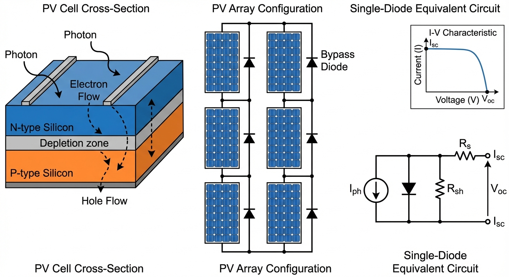

# 第 1 章：光伏电池与阵列建模：从光子到电子的量子跃迁

## 1. 学习目标
本章探讨光伏发电系统（Photovoltaic System）的最底层物理基础。我们将揭开光伏电池板在不同天气下的脾气与秉性。
读者需要掌握：
1. 半导体 PN 结的光电效应与单二极管物理模型（Single Diode Model）。
2. 光照强度（Irradiance）对短路电流 $I_{sc}$ 的决定性影响。
3. 温度（Temperature）对开路电压 $V_{oc}$ 的毁灭性衰减作用。
4. 关键的 $I-V$ 伏安特性曲线与 $P-V$ 功率曲线的非线性特征。

## 2. 教材理论：太阳是如何变成电流的？

### 2.1 光伏效应的物理本质

与风力发电那种"吹动叶片-带动齿轮-旋转线圈-切割磁感线"的复杂的机械物理过程不同，光伏发电的原理纯粹——**量子跃迁**。

光伏板的核心是一块半导体硅片（PN结）。当太阳光（光子）砸在这块硅片上时，如果光子的能量 $E_{photon} = h\nu$ 大于硅的禁带宽度 $E_g \approx 1.12 \, eV$（其中 $h$ 是普朗克常数，$\nu$ 是光子频率），它会把硅原子里束缚的电子直接撞飞——从价带跃迁到导带。这些自由的电子在 PN 结内建电场的驱使下，顺着导线流出去，这就形成了**光生电流（Photocurrent, $I_{ph}$）**。

从量子力学角度看，光伏效应的效率存在一个理论上限，即 Shockley-Queisser 极限（约 $33.7\%$，单结硅电池）。这是因为低于禁带宽度的光子无法激发电子（透射损失），而高于禁带宽度的光子多余能量会以热量形式耗散（热化损失）。理解这两种损失机制，是理解光伏电池效率天花板的关键。

### 2.2 单二极管等效电路模型

在电气工程师眼里，一块光伏电池等效于一个**理想电流源**并联了一个**二极管**。更精确的模型还包含串联电阻 $R_s$（导线与金属接触电阻）和并联电阻 $R_{sh}$（边缘漏电与制造缺陷）。

完整的单二极管模型方程为：

$$
I = I_{ph} - I_{rs} \left[ \exp\left(\frac{q(V + IR_s)}{AkT}\right) - 1 \right] - \frac{V + IR_s}{R_{sh}}
$$

其中各符号含义如下：

| 符号 | 物理含义 | 单位 |
|------|---------|------|
| $I_{ph}$ | 光生电流（正比于光照强度 $G$） | A |
| $I_{rs}$ | 二极管反向饱和电流 | A |
| $q$ | 电子电荷（$1.602 \times 10^{-19}$） | C |
| $V$ | 端电压 | V |
| $A$ | 二极管理想因子（$1.0 \sim 1.5$） | 无量纲 |
| $k$ | 玻尔兹曼常数（$1.381 \times 10^{-23}$） | J/K |
| $T$ | 电池绝对温度 | K |
| $R_s$ | 串联电阻 | $\Omega$ |
| $R_{sh}$ | 并联电阻 | $\Omega$ |

当忽略 $R_s$ 和 $R_{sh}$（理想化假设，$R_s = 0$，$R_{sh} \to \infty$）时，方程简化为教科书中最著名的非线性隐式方程：

$$
I = I_{ph} - I_{rs} \left[ \exp\left(\frac{q V}{A k T}\right) - 1 \right]
$$

这个方程冷酷地揭示了光伏板的两个致命弱点：
1. **它是靠天吃饭的（受光照影响）**：方程第一项 $I_{ph}$ 直接正比于大太阳的光照强度 $G$。今天阴天光照减半，你的短路电流（能发出的最大电流）立刻腰斩。
2. **它是怕热的（受温度影响）**：方程的第二项是二极管的漏电流。随着温度 $T$ 的升高，这个漏电流会呈指数级暴涨。它会疯狂地"吃掉"电压。这就是为什么在夏天最热的正午，虽然太阳毒辣，但光伏板的发电功率反而会诡异地下降。

### 2.3 光照与温度的定量影响

为了在工程中使用上述方程，我们需要建立光照和温度对关键参数的定量关系。

**光照对光生电流的影响**：

$$
I_{ph}(G, T) = \left[ I_{sc,STC} + K_i (T - T_{STC}) \right] \cdot \frac{G}{G_{STC}}
$$

其中 $I_{sc,STC}$ 是标准测试条件（STC: $G_{STC} = 1000 \, W/m^2$，$T_{STC} = 25^\circ C$）下的短路电流，$K_i$ 是电流温度系数（单位 $A/K$，对于硅电池通常为正值，约 $0.003 \sim 0.005 \, A/K$）。

**温度对开路电压的影响**：

$$
V_{oc}(T) = V_{oc,STC} + K_v (T - T_{STC})
$$

其中 $K_v$ 是电压温度系数（单位 $V/K$，对于硅电池为负值，约 $-0.1 \sim -0.15 \, V/K$）。这个负号意味着温度每升高 $1^\circ C$，开路电压下降约 $0.1 \sim 0.15 \, V$。对于一个串联了 $N_s = 54$ 片电池的组件而言，电压温度系数的叠加效应相当显著。

**反向饱和电流的推导**：

在开路条件下（$I = 0$），理想化方程变为：

$$
0 = I_{ph} - I_{rs} \left[ \exp\left(\frac{q V_{oc}}{A k T}\right) - 1 \right]
$$

由此可以反推出反向饱和电流：

$$
I_{rs} = \frac{I_{ph}}{\exp\left(\frac{q V_{oc}}{A k T}\right) - 1}
$$

这个量通常非常小（约 $10^{-9} \sim 10^{-12} \, A$），但它随温度呈指数增长，是温度导致电压衰减的根本原因。

### 2.4 从单电池到阵列：串并联组合

实际光伏电站不会使用单个电池片。电池片通过串联提高电压、并联提高电流，最终组成光伏阵列。

对于 $N_s$ 片串联、$N_p$ 支路并联的阵列，其 I-V 方程变为：

$$
I_{array} = N_p \cdot I_{ph} - N_p \cdot I_{rs} \left[ \exp\left(\frac{q (V_{array}/N_s + I_{array} R_s / N_p)}{A k T}\right) - 1 \right]
$$

串联可以将电压提升到逆变器要求的直流母线电压（通常 $400 \sim 800 \, V$），但串联也带来了一个致命问题——如果阵列中的某一块板被阴影遮挡，被遮挡的板会从"发电机"变成"负载"，在串联回路中消耗功率并发热，严重时会引发热斑（Hot Spot）效应烧毁组件。这就是为什么每块光伏板背后都要并联一个旁路二极管（Bypass Diode）。

任何想要控制光伏系统的人，都必须把这块板子在各种极端天气下的非线性 **I-V 曲线** 和 **P-V 曲线** 刻在骨子里。

## 3. 案例分析：理论与实践的桥梁（商用多晶硅光伏组件物理特性全息仿真）

### 3.1 案例背景 (Context)
某新能源公司计划在两个截然不同的地方建设光伏电站：
- **场景 A**：常年阴雨连绵的伦敦（光照极弱 $200 W/m^2$，但气温凉爽 $25^\circ C$）。
- **场景 B**：烈日炎炎的撒哈拉沙漠（光照拉满 $1000 W/m^2$，但板子被晒得发烫高达 $70^\circ C$）。
在做可行性报告时，投资人问你："同样一块标称功率为 215W 的电池板，在这两个鬼地方到底能发出多少电？"
为了回答这个问题，你必须利用 Python 写出底层单二极管方程，推演出这块板子在多变气象条件下的伏安特性。

### 3.2 问题描述 (Problem)
- **物理参数（STC 标准工况）**：$I_{sc}=8.21 A, V_{oc}=32.9 V$。温度系数 $K_i=0.0032, K_v=-0.123$。
- **变量 1（光照 $G$ 扫描）**：在恒温 $25^\circ C$ 下，光照从 $200 \to 1000 W/m^2$。
- **变量 2（温度 $T$ 扫描）**：在满光照 $1000 W/m^2$ 下，温度从 $10^\circ C \to 70^\circ C$。
- **任务**：求解理想单二极管超越方程，绘制经典的 I-V 与 P-V 曲面群，并准确标定出每一条曲线上的**最大功率点（MPP，黑星）**。

**物理场景与问题概化图 (Generated via Local Schematic)：**

### 3.3 解题思路 (Solution Approach)
本研究构建了一个半导体级的电气响应模拟器：
1. **环境变量偏置**：利用线性温度系数 $K_i, K_v$ 计算当前温度下的基准电流与电压漂移。
2. **反向饱和电流逆推**：利用 $I_{sc}$ 和 $V_{oc}$ 在开路状态下的零电流特性，精巧地反推出那个隐藏在公式底部的极小量 $I_{rs}$。
3. **电压扫描与功率映射**：生成从 $0V$ 到开路电压的电压数组，代入指数方程求出电流 $I$。随后执行简单的乘法 $P = V \times I$ 获得功率抛物线。
4. **极值追踪（Argmax）**：利用数组寻优函数，在茫茫曲线上找出那个唯一的功率巅峰坐标 $(V_{mp}, P_{max})$。

### 3.4 代码解读 (Code Walkthrough)

> 源代码文件：`assets/ch01/ch01_pv_modeling.py`

本仿真脚本分为以下几个关键模块：

**模块一：物理常数与组件参数定义**

代码首先定义了一组半导体级的物理常数——玻尔兹曼常数 $k = 1.381 \times 10^{-23} \, J/K$ 和电子电荷 $q = 1.602 \times 10^{-19} \, C$，这两个常数决定了热电压 $V_t = N_s k T / q$ 的大小，是二极管指数方程的"温度标尺"。组件参数取自某商业多晶硅电池板的数据手册，包括短路电流 $I_{sc} = 8.21 \, A$、开路电压 $V_{oc} = 32.9 \, V$、串联电池片数 $N_s = 54$ 以及理想因子 $A = 1.3$。

**模块二：核心函数 `calculate_pv_curve(G, T_celsius)`**

该函数是整个仿真的心脏。其计算流程严格遵循物理推导：

1. **温度偏置计算**：$dT = T - T_{STC}$，随后计算光生电流 $I_{ph} = (I_{sc} + K_i \cdot dT) \times G / G_{STC}$ 和温度偏置后的开路电压 $V_{oc,T} = V_{oc} + K_v \cdot dT$。

2. **热电压计算**：$V_t = N_s \cdot k \cdot T / q$。这个量在 STC 下约为 $1.39 \, V$，乘以理想因子后约为 $1.81 \, V$，决定了 I-V 曲线"拐弯"的锐利程度。

3. **反向饱和电流逆推**：利用开路条件 $I_{rs} = I_{ph} / [\exp(V_{oc,T} / (A \cdot V_t)) - 1]$。由于分母是一个指数项，$I_{rs}$ 通常在 $10^{-10}$ 量级，这个微小的电流在高温下会增大数个数量级。

4. **电压扫描**：在 $[0, V_{oc,T}]$ 区间均匀采样 100 个电压点，对每个电压 $V$ 代入 $I = I_{ph} - I_{rs} \cdot [\exp(V / (A \cdot V_t)) - 1]$ 计算电流，并裁剪负值至零（物理约束）。

**模块三：双参数扫描与 MPP 追踪**

代码分别执行两轮扫描：（1）固定温度 $25^\circ C$，光照从 $200$ 到 $1000 \, W/m^2$ 取 5 级；（2）固定光照 $1000 \, W/m^2$，温度从 $10^\circ C$ 到 $70^\circ C$ 取 5 级。对每条 P-V 曲线，利用 `np.argmax(P)` 定位最大功率点的坐标 $(V_{mp}, P_{max})$，并用黑色星号标记。多个 MPP 点之间连以虚线，形成 MPP 轨迹曲线（MPP Trajectory）。

### 3.5 代码执行与图表 (Code & Charts)
> **学习提示**：我们在后台执行了包含玻尔兹曼常数与基本电荷的量子级算式。请仔细对比表格中"Hot Summer Desert"这一行，体会什么叫"热死机"。

**不同极端气候带下单体光伏组件极限发电能力核算矩阵：**
| Environment       |   Irradiance ($W/m^2$) |   Temp (°C) |   Max Power (W) |   Optimal Voltage $V_{mp}$ |   Short Circuit $I_{sc}$ |   Open Circuit $V_{oc}$ |
|:------------------|-----------------------:|------------:|----------------:|---------------------------:|-------------------------:|------------------------:|
| STC (Ideal)       |                   1000 |          25 |           214.7 |                       27.9 |                     8.21 |                    32.9 |
| Hot Summer Desert |                   1000 |          70 |           170   |                       22.4 |                     8.35 |                    27.4 |
| Heavy Cloud       |                    200 |          25 |            42.9 |                       27.9 |                     1.64 |                    32.9 |

**光照与温度双重剥离下的光伏伏安特性与功率追踪（MPP）热力图：**

### 3.6 实验验证与结果剖析 (Verification & Result Interpretation)
这四张子图是所有光伏工程师的基本功，它们冷酷地展示了大自然的法则：

**光照的绝对统治（左侧上下两图）**：看左上方（变光照的 I-V 图）。当光照从 $1000$ 掉到 $200$ 时，电流（纵轴）发生了断崖式的平行下移（从 $8A$ 掉到不足 $2A$）。光照几乎是按着严格的正比例在压缩电流。反映到左下方的 P-V 图上，就是那可怜的最低的曲线。在"Heavy Cloud"这天，标称 215W 的板子只能发出惨淡的 $42.9W$ 电量。

从数学角度分析，这是因为光生电流 $I_{ph} \propto G$，而开路电压 $V_{oc}$ 与光照仅有微弱的对数关系 $V_{oc} \propto \ln(I_{ph}/I_{rs})$。因此光照变化主要影响电流轴（线性压缩），对电压轴影响甚微——这正是图中五条曲线几乎共享同一个"拐弯点"横坐标的原因。

**温度的隐形刺客（右侧上下两图）**：看右上方的图。此时外面是 $1000 W/m^2$ 的烈日。你看每一条线的左侧（电流），几乎都顶在最高的 $8.3A$ 左右。但是，请看横轴（电压）！随着板子被晒得发烫（紫线 $70^\circ C$），电压发生严重的"萎缩"，向左发生了恐怖的崩塌。

定量地看，电压温度系数 $K_v = -0.123 \, V/K$，从 $25^\circ C$ 升温到 $70^\circ C$（$\Delta T = 45K$），开路电压损失 $\Delta V_{oc} = -0.123 \times 45 = -5.535 \, V$，从 $32.9V$ 跌到约 $27.4V$，与表格数据完全一致。

看右下角的 P-V 图。在 $70^\circ C$ 的撒哈拉沙漠，虽然阳光刺眼，但因为电压萎缩，这块板子的最大功率（紫色曲线顶点）被硬生生削减到了 **$170 W$**。白白损失了近 $20\%$ 的能量。功率损失可以定量估算：

$$
\frac{\Delta P}{P_{STC}} \approx \gamma \cdot \Delta T = -0.004 \times 45 = -18\%
$$

其中 $\gamma \approx -0.004 \, /^\circ C$ 是功率温度系数。这就是半导体物理无法违背的"温度系数诅咒"。

### 3.7 工业部署与运行建议 (Industrial Deployment Recommendations)
1. **水上光伏的降维打击**：鉴于恶劣的"热死机"现象，工业界现在推崇"漂浮式水上光伏电站（Floating PV）"。把光伏板建在水库或湖面上，利用水体的巨大比热容和自然蒸发效应，可以为背后的组件降温 $5 \sim 10^\circ C$。就这几度的降温，就能在炎热的夏天凭空多出 $5\%$ 的发电量。
2. **MPPT 控制器的生存逻辑**：请看图表里那些连在一起的黑色虚线（MPP Trajectory）。随着每一秒钟飘过的云彩（光照变）和吹过的微风（温度变），那个最高效的黑星极值点在电压轴上是在疯狂滑动的。如果你傻傻地把电压固定在标称的 $27.9V$，你发出来的永远不是最大功率。系统必须外挂一个聪明的控制器，每秒钟不停地去"摸索"这根虚线上的最高点。这就引出了我们在下一章要详细探讨的逆天算法——最大功率点跟踪（MPPT）。
3. **双面组件与跟踪支架**：现代高效组件采用双面电池（Bifacial），背面可以接收地面反射光，在沙地或水面等高反射率环境下可增加 $10 \sim 25\%$ 的发电量。同时，单轴或双轴跟踪支架使组件始终正对太阳，可使日发电量提高 $15 \sim 30\%$。

## 4. 习题

**习题 1.1**（基础计算题）
某光伏组件在 STC 条件下的参数为：$I_{sc} = 9.5 \, A$，$V_{oc} = 38.5 \, V$，$K_i = 0.005 \, A/K$，$K_v = -0.14 \, V/K$。
（a）计算该组件在光照 $G = 600 \, W/m^2$、温度 $T = 45^\circ C$ 条件下的光生电流 $I_{ph}$ 和开路电压 $V_{oc,T}$。
（b）估算此条件下的最大功率（设功率温度系数 $\gamma = -0.004 \, /^\circ C$，STC 最大功率 $P_{STC} = 310 \, W$）。

**习题 1.2**（理论推导题）
从完整的单二极管方程出发，证明在短路条件（$V = 0$）下，若 $R_s \ll R_{sh}$，则短路电流近似等于光生电流，即 $I_{sc} \approx I_{ph}$。讨论当 $R_{sh}$ 下降到何种程度时，这一近似不再成立。

**习题 1.3**（编程实践题）
修改 `ch01_pv_modeling.py` 中的 `calculate_pv_curve` 函数，加入串联电阻 $R_s = 0.5 \, \Omega$ 的影响。提示：此时方程变为隐式方程 $I = I_{ph} - I_{rs}[\exp(q(V+IR_s)/(AkT)) - 1]$，需要对每个电压点使用牛顿迭代法求解。比较 $R_s = 0$ 和 $R_s = 0.5 \, \Omega$ 的 I-V 曲线差异，分析串联电阻对填充因子（Fill Factor, FF）的影响。

**习题 1.4**（工程分析题）
一个光伏阵列由 $20$ 块组件串联（每块 $V_{oc} = 32.9 \, V$），$5$ 路并联。如果其中第 $3$ 串的第 $7$ 块组件被树荫完全遮挡：
（a）在没有旁路二极管的情况下，定性分析被遮挡组件会发生什么现象？
（b）旁路二极管如何缓解该问题？画出等效电路示意图。
（c）从功率角度分析，该遮挡对整个阵列的功率损失百分比是多少？

## 5. 本章小结

本章从半导体物理出发，建立了光伏电池的单二极管等效电路模型。核心要点总结如下：

1. **光伏效应的本质**是光子激发半导体 PN 结中的电子跃迁，产生光生电流 $I_{ph}$。Shockley-Queisser 极限决定了单结硅电池的理论效率上限约为 $33.7\%$。

2. **单二极管模型**用一个电流源、一个二极管、串联电阻 $R_s$ 和并联电阻 $R_{sh}$ 四个元件等效整个电池的电气行为。简化后的理想方程 $I = I_{ph} - I_{rs}[\exp(qV/(AkT)) - 1]$ 揭示了 I-V 特性的非线性本质。

3. **光照影响电流，温度影响电压**——这是理解光伏特性的最核心规律。光照对 $I_{ph}$ 的影响是线性的（正比关系），温度通过增大反向饱和电流 $I_{rs}$ 间接压缩 $V_{oc}$，功率温度系数约为 $-0.4\%/^\circ C$。

4. **MPP 轨迹是动态变化的**。在实际运行中，光照和温度每分每秒都在变化，最大功率点在 P-V 曲面上不断漂移。这为下一章的 MPPT 控制算法提供了根本动机。

5. **从单电池到阵列**的串并联组合，在提升电压电流等级的同时，引入了部分遮挡下的热斑风险和多峰 P-V 曲线问题，需要旁路二极管和智能控制策略加以应对。

## 参考文献

[1] Villalva M G, Gazoli J R, Filho E R. Comprehensive approach to modeling and simulation of photovoltaic arrays. IEEE Transactions on Power Electronics, 2009, 24(5): 1198-1208.

[2] De Soto W, Klein S A, Beckman W A. Improvement and validation of a model for photovoltaic array performance. Solar Energy, 2006, 80(1): 78-88.

[3] Shockley W, Queisser H J. Detailed balance limit of efficiency of p-n junction solar cells. Journal of Applied Physics, 1961, 32(3): 510-519.

[4] King D L, Kratochvil J A, Boyson W E. Photovoltaic array performance model. Sandia National Laboratories Report SAND2004-3535, 2004.
