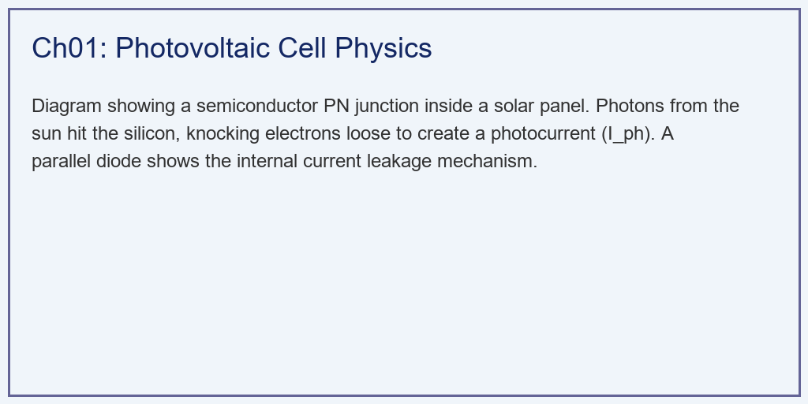
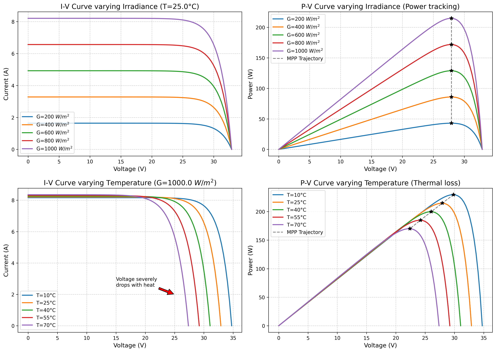

# 第 1 章：光伏电池与阵列建模：从光子到电子的量子跃迁

## 1. 学习目标
本章探讨光伏发电系统（Photovoltaic System）的最底层物理基础。我们将揭开光伏电池板在不同天气下的脾气与秉性。
读者需要掌握：
1. 半导体 PN 结的光电效应与单二极管物理模型（Single Diode Model）。
2. 光照强度（Irradiance）对短路电流 $I_{sc}$ 的决定性影响。
3. 温度（Temperature）对开路电压 $V_{oc}$ 的毁灭性衰减作用。
4. 极其关键的 $I-V$ 伏安特性曲线与 $P-V$ 功率曲线的非线性特征。

## 2. 教材理论：太阳是如何变成电流的？
与风力发电那种“吹动叶片-带动齿轮-旋转线圈-切割磁感线”的极其复杂的机械物理过程不同，光伏发电的原理极其极其纯粹——**量子跃迁**。

光伏板的核心是一块半导体硅片（PN结）。
当太阳光（光子）砸在这块硅片上时，如果光子的能量足够大，它会把硅原子里束缚的电子直接撞飞。这些自由的电子在 PN 结内建电场的驱使下，顺着导线流出去，这就形成了**光生电流（Photocurrent, $I_{ph}$）**。

在电气工程师眼里，一块光伏电池等效于一个**理想电流源**并联了一个**二极管**。
这就引出了光伏领域最著名的非线性隐式方程（忽略串并联电阻的理想模型）：
$$ I = I_{ph} - I_{rs} \left[ \exp\left(\frac{q V}{A k T}\right) - 1 \right] $$
这个方程极其冷酷地揭示了光伏板的两个致命弱点：
1. **它是靠天吃饭的（受光照影响）**：方程第一项 $I_{ph}$ 直接正比于大太阳的光照强度 $G$。今天阴天光照减半，你的短路电流（能发出的最大电流）立刻腰斩。
2. **它是怕热的（受温度影响）**：方程的第二项是二极管的漏电流。随着温度 $T$ 的升高，这个漏电流会呈指数级暴涨。它会疯狂地“吃掉”电压。这就是为什么在夏天最热的正午，虽然太阳极其毒辣，但光伏板的发电功率反而会诡异地下降。

任何想要控制光伏系统的人，都必须把这块板子在各种极端天气下的非线性 **I-V 曲线** 和 **P-V 曲线** 刻在骨子里。

## 3. 案例分析：理论与实践的桥梁（商用多晶硅光伏组件物理特性全息仿真）

### 🌟 案例背景 (Context)
某新能源公司计划在两个截然不同的地方建设光伏电站：
- **场景 A**：常年阴雨连绵的伦敦（光照极弱 $200 W/m^2$，但气温凉爽 $25^\circ C$）。
- **场景 B**：烈日炎炎的撒哈拉沙漠（光照拉满 $1000 W/m^2$，但板子被晒得发烫高达 $70^\circ C$）。
在做可行性报告时，投资人问你：“同样一块标称功率为 215W 的电池板，在这两个鬼地方到底能发出多少电？”
为了回答这个问题，你必须利用 Python 写出底层单二极管方程，推演出这块板子在多变气象条件下的伏安特性。

### 🎯 问题描述 (Problem)
- **物理参数（STC 标准工况）**：$I_{sc}=8.21 A, V_{oc}=32.9 V$。温度系数 $K_i=0.0032, K_v=-0.123$。
- **变量 1（光照 $G$ 扫描）**：在恒温 $25^\circ C$ 下，光照从 $200 \to 1000 W/m^2$。
- **变量 2（温度 $T$ 扫描）**：在满光照 $1000 W/m^2$ 下，温度从 $10^\circ C \to 70^\circ C$。
- **任务**：求解理想单二极管超越方程，绘制极其经典的 I-V 与 P-V 曲面群，并准确标定出每一条曲线上的**最大功率点（MPP，黑星）**。

**物理场景与问题概化图 (Generated via Local Schematic)：**

### 💡 解题思路 (Solution Approach)
本研究构建了一个半导体级的电气响应模拟器：
1. **环境变量偏置**：利用线性温度系数 $K_i, K_v$ 计算当前温度下的基准电流与电压漂移。
2. **反向饱和电流逆推**：利用 $I_{sc}$ 和 $V_{oc}$ 在开路状态下的零电流特性，极其精巧地反推出那个隐藏在公式底部的极小量 $I_{rs}$。
3. **电压扫描与功率映射**：生成从 $0V$ 到开路电压的电压数组，代入指数方程求出电流 $I$。随后执行简单的乘法 $P = V \times I$ 获得功率抛物线。
4. **极值追踪（Argmax）**：利用数组寻优函数，在茫茫曲线上找出那个唯一的功率巅峰坐标 $(V_{mp}, P_{max})$。

### 💻 代码执行与图表 (Code & Charts)
> 💡 **学习提示**：我们在后台执行了包含玻尔兹曼常数与基本电荷的量子级算式。请仔细对比表格中“Hot Summer Desert”这一行，体会什么叫“热死机”。

Source: `assets/ch01/ch01_pv_modeling.py`

**不同极端气候带下单体光伏组件极限发电能力核算矩阵：**
| Environment       |   Irradiance ($W/m^2$) |   Temp (°C) |   Max Power (W) |   Optimal Voltage $V_{mp}$ |   Short Circuit $I_{sc}$ |   Open Circuit $V_{oc}$ |
|:------------------|-----------------------:|------------:|----------------:|---------------------------:|-------------------------:|------------------------:|
| STC (Ideal)       |                   1000 |          25 |           214.7 |                       27.9 |                     8.21 |                    32.9 |
| Hot Summer Desert |                   1000 |          70 |           170   |                       22.4 |                     8.35 |                    27.4 |
| Heavy Cloud       |                    200 |          25 |            42.9 |                       27.9 |                     1.64 |                    32.9 |

**光照与温度双重剥离下的光伏伏安特性与功率追踪（MPP）热力图：**

### 📊 实验验证与结果剖析 (Verification & Result Interpretation)
这四张子图是所有光伏工程师的《圣经》，它们极其冷酷地展示了大自然的法则：
- **光照的绝对统治（左侧上下两图）**：看左上方（变光照的 I-V 图）。当光照从 $1000$ 掉到 $200$ 时，电流（纵轴）发生了断崖式的平行下移（从 $8A$ 掉到不足 $2A$）。光照几乎是按着严格的正比例在屠杀电流。反映到左下方的 P-V 图上，就是那极其可怜的最低的曲线。在“Heavy Cloud”这天，标称 215W 的板子只能发出极其惨淡的 $42.9W$ 电量。
- **温度的隐形刺客（右侧上下两图）**：看右上方的图。此时外面是 $1000 W/m^2$ 的烈日！你看每一条线的左侧（电流），几乎都顶在最高的 $8.3A$ 左右。但是，请看横轴（电压）！随着板子被晒得发烫（紫线 $70^\circ C$），电压发生严重的“萎缩”，向左发生了恐怖的崩塌。
  - 看右下角的 P-V 图。在 $70^\circ C$ 的撒哈拉沙漠，虽然阳光刺眼，但因为电压萎缩，这块板子的最大功率（紫色曲线顶点）被硬生生削减到了 **$170 W$**！白白损失了近 $20\%$ 的能量。这就是半导体物理无法违背的“温度系数诅咒”。

### 🚀 工业部署与运行建议 (Industrial Deployment Recommendations)
1. **水上光伏的降维打击**：鉴于极其恶劣的“热死机”现象，工业界现在极度推崇“漂浮式水上光伏电站（Floating PV）”。把光伏板建在水库或湖面上，利用水体的巨大比热容和自然蒸发效应，可以为背后的组件降温 $5 \sim 10^\circ C$。就这几度的降温，就能在炎热的夏天凭空多出 $5\%$ 的发电量！
2. **MPPT 控制器的生存逻辑**：请看图表里那些连在一起的黑色虚线（MPP Trajectory）。随着每一秒钟飘过的云彩（光照变）和吹过的微风（温度变），那个最高效的黑星极值点在电压轴上是在疯狂滑动的！如果你傻傻地把电压固定在标称的 $27.9V$，你发出来的永远不是最大功率。系统必须外挂一个极其聪明的控制器，每秒钟不停地去“摸索”这根虚线上的最高点。这就引出了我们在下一章要详细探讨的逆天算法——最大功率点跟踪（MPPT）。
