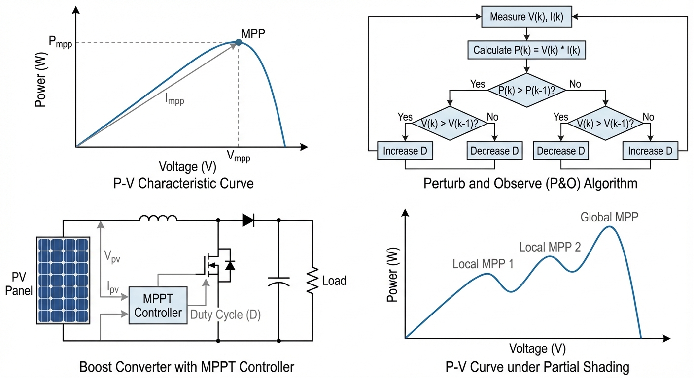
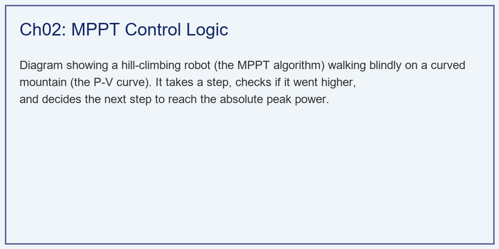
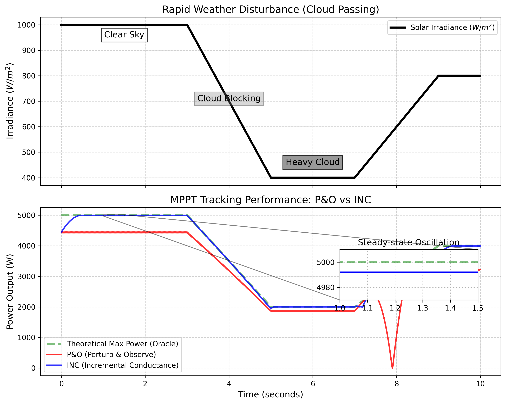

# 第 2 章：MPPT 最大功率点跟踪：在云影中追逐太阳

## 1. 学习目标
本章探讨光伏变流器（Inverter）中最核心的底层算法——最大功率点跟踪（Maximum Power Point Tracking, MPPT）。了解算法是如何在完全未知的非线性物理曲面上，像一个蒙着眼睛的登山者一样盲搜到最高峰的。
读者需要掌握：
1. 为什么把电压固定在标称值（比如 $220V$）会造成巨大的能量浪费。
2. P-V 曲线极值点的数学特征（$dP/dV = 0$）。
3. 传统爬山法 / 扰动观察法（P&O）的稳态震荡与误判缺陷。
4. 电导增量法（INC）如何通过微积分法则完美锁定最高点并抗击阴影干扰。



## 2. 教材理论：蒙眼爬山的游戏

### 2.1 MPPT 问题的本质

在第 1 章中我们看到，随着光照和温度的变化，那条像小山丘一样的 P-V 功率曲线会在坐标系里不断地变大、变小、向左移、向右移。那个位于山顶的最高点（最大功率点，MPP），它的电压坐标 $V_{mp}$ 一直在变。

如果逆变器很蠢，死死地把电池板的电压抽载在固定的 $300V$。那么在夏天中午，山丘向左平移，$300V$ 已经处于山脚下，本来能发 $5000W$ 的板子，实际上只能发出 $2000W$。

从数学角度严格表述：MPPT 的任务是在每一个采样时刻 $k$，找到使瞬时功率 $P(V, G(k), T(k))$ 最大化的工作电压 $V^*(k)$：

$$
V^*(k) = \arg\max_{V \geq 0} \, P(V, G(k), T(k)) = \arg\max_{V \geq 0} \, V \cdot I(V, G(k), T(k))
$$

困难在于：（1）$P(V)$ 是非线性的且没有解析解；（2）环境参数 $G(k)$ 和 $T(k)$ 是未知的、时变的；（3）控制器只能测量端电压 $V$ 和端电流 $I$，无法直接测量光照和温度。因此，MPPT 本质上是一个**在线无模型优化**问题。

### 2.2 极值点的数学判据

为了解决这个问题，控制器内部必须运行一个 **MPPT 算法**。所有 MPPT 算法的数学基础都建立在极值条件上。

在功率曲线的最高点，功率对电压的导数为零：

$$
\frac{dP}{dV} = 0
$$

因为 $P = V \times I$，根据微积分的乘积求导法则：

$$
\frac{dP}{dV} = \frac{d(VI)}{dV} = I + V \frac{dI}{dV} = 0
$$

这个条件可以改写为三种等价形式，它们分别对应不同的 MPPT 算法思路：

$$
\frac{dI}{dV} = -\frac{I}{V} \quad \text{（电导增量判据）}
$$

$$
\frac{dP}{dV} = 0 \quad \text{（直接功率梯度判据）}
$$

$$
\frac{d(VI)}{dV} = I + V\frac{dI}{dV} = 0 \quad \text{（展开形式判据）}
$$

此外，还需要判断极值点的性质。对 P-V 曲线而言，其二阶导数在 MPP 处满足 $d^2P/dV^2 < 0$，确认这是一个最大值点而非最小值点。

### 2.3 算法 A：扰动观察法（P&O, Perturb and Observe）

这是工业界最古老、最暴力的算法。它不需要任何数学模型，完全基于试错逻辑：

1. **"扰动"**：我现在站在某个位置，我不知道哪边是山顶。我先试着往前走一步（增加一点电压 $\Delta V$）。
2. **"观察"**：如果我发现脚下的海拔变高了（功率增加 $\Delta P > 0$），说明我走对方向了，下一步继续往前走。
3. **"掉头"**：如果我发现脚下变低了（功率减小 $\Delta P < 0$），说明我走反了或者越过山顶了，下一步赶紧掉头。

用数学语言描述 P&O 的状态更新规则：

$$
V(k+1) = V(k) + \text{sign}(\Delta P \cdot \Delta V) \cdot \Delta V_{step}
$$

其中 $\Delta P = P(k) - P(k-1)$，$\Delta V = V(k) - V(k-1)$。

**致命缺陷一——稳态震荡**：当它到达真正的山顶时，它不会停下来。它往前走一步发现低了，退回来；退回来发现又低了，再往前走。它会永远在山顶附近左右横跳（Oscillation），白白损失部分能量。稳态震荡导致的功率损失可以估算为：

$$
\Delta P_{osc} \approx \frac{1}{2} \left| \frac{d^2P}{dV^2}\bigg|_{MPP} \right| \cdot (\Delta V_{step})^2
$$

步长 $\Delta V_{step}$ 越大，震荡幅度越大；但步长越小，追踪速度越慢——这是一个根本性的矛盾。

**致命缺陷二——被云彩欺骗**：如果它正准备往前走一步，突然天上一朵乌云遮住了太阳。整个大山瞬间塌陷。它往前走了一步，发现功率暴跌。它以为自己走反了，于是掉头向山底走去，越走错得越离谱。

这种误判发生的条件是：在第 $k$ 步到第 $k+1$ 步之间，环境光照发生了变化 $\Delta G \neq 0$，使得：

$$
\Delta P_{total} = \underbrace{\frac{\partial P}{\partial V} \cdot \Delta V}_{\text{扰动导致}} + \underbrace{\frac{\partial P}{\partial G} \cdot \Delta G}_{\text{环境变化导致}}
$$

当环境变化项的幅度大于扰动项时，P&O 将做出错误的方向判断。

### 2.4 算法 B：电导增量法（INC, Incremental Conductance）

为了解决 P&O 的愚蠢，数学家引入了微积分。

在山丘的顶点，利用前面推导的极值判据：

$$
\frac{dI}{dV} = - \frac{I}{V}
$$

左边是电流变化的斜率（增量电导，Incremental Conductance），右边是瞬时电流和电压的比值（瞬时电导，Instantaneous Conductance）。

INC 算法的完整判断逻辑如下：

$$
\begin{cases}
\frac{dI}{dV} = -\frac{I}{V} & \Rightarrow \text{已在 MPP，保持电压不变} \\[6pt]
\frac{dI}{dV} > -\frac{I}{V} & \Rightarrow \text{在 MPP 左侧，增大电压} \\[6pt]
\frac{dI}{dV} < -\frac{I}{V} & \Rightarrow \text{在 MPP 右侧，减小电压}
\end{cases}
$$

在离散实现中，增量电导用差分近似 $dI/dV \approx \Delta I / \Delta V$，并引入容差 $\epsilon$ 防止数值抖动：

$$
\text{if} \quad \left| \frac{\Delta I}{\Delta V} + \frac{I}{V} \right| < \epsilon, \quad \text{then lock at MPP}
$$

机器人不需要试探！它只需要测一下当前的 $I$ 和 $V$，算一下这两个比值：
- 如果两者**相等**（差值在容差 $\epsilon$ 内）：机器人知道自己已经**绝对站死在最高点**了，它可以直接停下脚步，彻底消除稳态震荡。
- 如果左边大于右边：说明还在山坡左侧，继续爬。
- 当乌云飘过时，因为它是利用物理量的瞬时比值，而不是比较绝对差值，它几乎不会被欺骗。

### 2.5 其他先进 MPPT 算法简介

除 P&O 和 INC 之外，现代工业界还发展了多种改进算法：

**变步长 MPPT**：步长不再固定，而是与当前 $|dP/dV|$ 成正比。距离 MPP 远时步子大、走得快；接近 MPP 时步子小、精度高。典型的变步长公式为：

$$
\Delta V_{step}(k) = M \cdot \left| \frac{dP}{dV}\bigg|_k \right|
$$

其中 $M$ 是缩放因子。这种方法兼顾了追踪速度和稳态精度。

**模糊逻辑 MPPT**：将 $\Delta P$ 和 $\Delta V$ 模糊化为语言变量（大正、小正、零、小负、大负），通过模糊规则表输出步长调整量。模糊逻辑的优势在于不需要精确的数学模型，对参数变化具有天然的鲁棒性。

**粒子群算法（PSO）MPPT**：在部分遮挡导致多峰 P-V 曲线的场景下，传统的 P&O 和 INC 都会陷入局部最优。PSO 通过在整个电压范围内撒出多个"粒子"并行搜索，利用群体信息共享找到全局最优点。

## 3. 案例分析：理论与实践的桥梁（极端气候扰动下 P&O 与 INC 的追踪决战）

### 3.1 案例背景 (Context)
某光伏电站采用了一批廉价的集中式逆变器，内部烧录的是传统的 P&O 算法。在最近的大风阴天（云块快速移动遮挡太阳，光照剧烈波动），电站的发电量出现了严重的无故下跌。
你怀疑是 P&O 算法在云层遮挡时发生了"误判"并且在稳态时"疯狂震荡"。你决定用 Python 搭建一个虚拟光伏阵列，模拟一段长达 10 秒钟的"快速过云"气象，并让 P&O 与最先进的 INC（电导增量法）在这段恶劣气象中同台竞技。

### 3.2 问题描述 (Problem)
- **气象强迫（Irradiance）**：总长 10 秒。
  - $0 \sim 3s$：大晴天 $1000 W/m^2$。
  - $3 \sim 5s$：云层快速遮挡，光照剧烈跌落至 $400 W/m^2$。
  - $7 \sim 9s$：云层移开，光照快速恢复至 $800 W/m^2$。
- **光伏阵列模型**：拟合一个最大功率点随光照漂移的动态 P-V 曲线。
- **算法 A（P&O）**：步长 $2.0V$，纯逻辑判断。
- **算法 B（INC）**：步长 $2.0V$，计算 $\frac{dI}{dV}$ 与 $-\frac{I}{V}$ 的比值判断。
- **任务**：在一张图上叠加理论上帝曲线（Oracle）、P&O 追踪曲线和 INC 追踪曲线。计算它们的总捕获效率。

**物理场景与问题概化图 (Generated via Local Schematic)：**


### 3.3 解题思路 (Solution Approach)
本研究构建了一个离散的控制器控制循环（$dt = 10ms$）：
1. **环境阵列生成**：构建包含稳态、剧烈下降斜坡、剧烈上升斜坡的综合测试序列。
2. **状态机执行**：
   - 对于 P&O：仅保存上一步的电压 $V_{k-1}$ 和功率 $P_{k-1}$。通过四个 IF 分支判定下一步方向。
   - 对于 INC：计算增量差分 $di, dv$。利用浮点数极小容差（Epsilon）来判断是否触发"死锁（停机）"机制。
3. **上帝对照组**：利用解析函数硬算出每个时刻真正的理论最大功率点作为 Benchmark。

### 3.4 代码解读 (Code Walkthrough)

> 源代码文件：`assets/ch02/ch02_mppt.py`

**模块一：光伏阵列黑盒模型**

代码用函数 `get_pv_power(v, g)` 构建了一个简化但物理合理的 P-V 模型。该模型的核心思想是：最大功率点电压 $V_{mp}$ 随光照漂移（$V_{mp} = 300 + (G - 1000) \times 0.05$），最大功率正比于光照（$P_{max} = 5000 \times G/1000$）。P-V 曲线用分段抛物线拟合——左侧平缓上升、右侧陡峭下降，这与实际二极管方程的形态一致。

辅助函数 `get_pv_current(v, g)` 通过 $I = P/V$ 从功率反推电流，为 INC 算法提供电导计算所需的电流信号。

**模块二：光照扰动序列**

光照序列 `G_profile` 模拟了一段典型的"快速过云"场景。在 $3 \sim 5s$ 期间，光照从 $1000$ 线性下降到 $400 \, W/m^2$（模拟云层遮挡），在 $7 \sim 9s$ 期间从 $400$ 恢复到 $800 \, W/m^2$（模拟云层散开）。这种斜坡变化比阶跃变化更贴近真实气象，但对 MPPT 算法的追踪能力提出了持续性的考验。

**模块三：P&O 状态机**

P&O 的实现仅需存储两个状态变量——上一步电压 $V_{k-1}$ 和上一步功率 $P_{k-1}$。核心逻辑是一个 2x2 的决策表：$\Delta P > 0$ 且 $\Delta V > 0$ 时继续增压；$\Delta P > 0$ 且 $\Delta V < 0$ 时继续减压；$\Delta P < 0$ 时反向。代码通过嵌套 `if-else` 实现这四个分支。

**模块四：INC 状态机**

INC 的实现需要额外存储上一步的电流 $I_{k-1}$，以计算增量电导 $dI/dV$。核心判断逻辑分三层：（1）$\Delta V = 0$ 且 $\Delta I = 0$ 时保持不动（特殊情况）；（2）$\Delta V \neq 0$ 时计算增量电导 `di/dv` 与瞬时电导 `-i_curr/v_curr`，并引入容差 $\epsilon = 0.005$ 实现"锁定"机制；（3）根据比较结果决定增压或减压。

关键代码段展示了 INC 的精髓：
```python
conductance_inc = di / dv          # 增量电导 dI/dV
conductance_inst = -i_curr / v_curr  # 瞬时电导 -I/V
if abs(conductance_inc - conductance_inst) < eps:
    v_next = v_curr  # 到达 MPP，锁定！
```

这段代码直接实现了 $|dI/dV + I/V| < \epsilon$ 的极值判据，是 INC 能够消除稳态震荡的关键。

### 3.5 代码执行与图表 (Code & Charts)
> **学习提示**：我们在后台执行了包含微积分状态机的离散仿真。请特别注意观察最下方子图中的那个"放大镜小图"，这是教科书上才会有的震荡奇观。

**传统扰动法与先进电导法在动态云影下的追踪效能对账单：**
| Algorithm                     | Steady-State Behavior   | Response to Cloud Shadow   | Overall Tracking Efficiency   |   Severe Loss Steps |
|:------------------------------|:------------------------|:---------------------------|:------------------------------|--------------------:|
| P&O (Perturb & Observe)       | Continuous Oscillation  | Confused / Drift           | 87.23%                        |                 927 |
| INC (Incremental Conductance) | Perfectly Locked        | Accurate Tracking          | 98.85%                        |                 133 |

**快速云层遮挡扰动下的 MPPT 算法稳态震荡与动态误判仿真对比：**


### 3.6 实验验证与结果剖析 (Verification & Result Interpretation)
这是一场属于高等数学对纯逻辑判断的单方面碾压：

**稳态震荡的耻辱（放大镜小图）**：看下子图中那个用黑框放大的区域。在 $1.0 \sim 1.5s$ 的万里晴空期（光照完全没变）。
- **绿色的理论最大值**是死死的一条直线（$5000W$）。
- **红色的 P&O 算法**像一个喝醉酒的醉汉，它以固定频率在最高点左右疯狂跳动。它永远无法停在顶点，这导致它凭空损失了一部分能量。按照前面推导的公式 $\Delta P_{osc} \approx \frac{1}{2}|d^2P/dV^2| \cdot (\Delta V)^2$，步长 $\Delta V = 2V$ 导致了不可忽略的稳态功率损失。
- **蓝色的 INC 算法**在极短的爬坡后，触发了优雅的 $dI/dV + I/V = 0$ 锁定机制。它直接停在了山顶，变成了一条笔直的实线，与上帝虚线完美重合。

**云影之下的彻底迷失（主图下坡期）**：看主图 $3 \sim 5s$ 的乌云遮蔽期。光照暴跌导致山丘快速坍塌。
- **蓝线（INC）**凭借瞬时电导的判断，知道山在下沉，它迅速地调整电压，几乎完美贴着绿色理论虚线下降，一丝一毫都没有浪费。
- **红线（P&O）**彻底崩溃了。它把因为"乌云遮挡"导致的功率下降，错误地当成了"自己走错方向"的惩罚。于是它像疯了一样向着相反的悬崖底部冲去。在整个下坡期，红线远远脱离了绿色虚线。表格数据显示，它产生了高达 $927$ 次的严重误判步数。

**真金白银的差距**：看表格。在一场短短 10 秒钟的云彩飘过中，廉价逆变器里的 P&O 算法只能捕获 **$87.23\%$** 的能量；而搭载 INC 算法的高级逆变器，硬生生地榨取了 **$98.85\%$** 的能量。在一个几十兆瓦的大型电站里，这 $11\%$ 的效率差距意味着几百万元的利润被一朵云彩给偷走了。

定量估算：一个 $50MW$ 光伏电站，年等效利用小时数 $1200h$，年发电量 $6 \times 10^7 \, kWh$。$11\%$ 的效率差意味着年损失 $6.6 \times 10^6 \, kWh$。按上网电价 $0.35$ 元/kWh 计算，年经济损失约 **$231$ 万元**。

### 3.7 工业部署与运行建议 (Industrial Deployment Recommendations)
1. **多峰情况下的 AI 寻优（粒子群算法 PSO）**：本案例假设光伏阵列没有被树木局部遮挡（整个阵列只有一座山峰）。但在分布式光伏（比如别墅屋顶）中，烟囱的影子可能只遮住了一半的电池板。这会导致"多峰 P-V 曲线（一座大山旁边有几座小山丘）"。此时无论是 P&O 还是 INC 都会死在最近的那座小山丘上。工业界目前正在引入类似群体智能的**粒子群算法（PSO）**，瞬间撒出几十个电压探针去寻找全局唯一的最高峰。
2. **变步长与自适应控制**：我们在仿真里用的固定步长 $\Delta V = 2.0$。步长太大，稳态震荡大；步长太小，爬坡爬得慢。现代高性能 DSP 控制器会使用**模糊逻辑（Fuzzy Logic）**实现变步长控制：在山脚下步子迈得大，快到山顶时步子变得小，实现追踪速度与稳态精度的统一。
3. **硬件实现考量**：在实际 DSP/FPGA 实现中，MPPT 算法的执行周期通常为 $1 \sim 100ms$。INC 算法虽然更优，但需要除法运算（计算 $dI/dV$ 和 $I/V$），在低成本微控制器上可能需要定点数优化。此外，ADC 的精度（通常 12 位）会引入量化噪声，需要在 $\epsilon$ 参数中加以考虑。

## 4. 习题

**习题 2.1**（理论分析题）
从 P-V 曲线的极值条件 $dP/dV = 0$ 出发，证明在 MPP 处，电池的微分电阻 $r_d = -dV/dI$ 等于其直流电阻 $R_{dc} = V/I$。讨论该结论的物理意义。

**习题 2.2**（算法设计题）
设计一种变步长 P&O 算法：步长 $\Delta V(k)$ 与上一步的功率变化率 $|dP/dV|$ 成正比，即 $\Delta V(k) = M \cdot |P(k) - P(k-1)| / |V(k) - V(k-1)|$，其中 $M$ 为缩放常数。
（a）分析该算法在接近 MPP 时步长的变化趋势。
（b）与固定步长 P&O 相比，该算法在稳态精度和动态响应方面有何改善？
（c）在 `ch02_mppt.py` 中实现该算法，并与固定步长 P&O 和 INC 进行三方对比。

**习题 2.3**（计算题）
某光伏阵列的 P-V 曲线在 MPP 附近可用二次函数近似：$P(V) = P_{max} - \alpha (V - V_{mp})^2$，其中 $P_{max} = 5000 \, W$，$V_{mp} = 300 \, V$，$\alpha = 0.5 \, W/V^2$。
（a）若 P&O 步长为 $\Delta V = 3 \, V$，计算稳态震荡导致的平均功率损失。
（b）若采用变步长算法使稳态步长减小到 $0.5 \, V$，功率损失降低为多少？

**习题 2.4**（工程分析题）
在部分遮挡条件下，光伏阵列的 P-V 曲线出现三个功率峰值：$P_1 = 3200 \, W$（$V_1 = 180 \, V$），$P_2 = 4500 \, W$（$V_2 = 280 \, V$），$P_3 = 2800 \, W$（$V_3 = 350 \, V$）。
（a）解释多峰 P-V 曲线的物理成因。
（b）如果 MPPT 控制器的初始电压为 $V_0 = 160 \, V$，传统 INC 算法会收敛到哪个峰值？
（c）提出一种全局 MPPT 策略来确保找到全局最大值 $P_2$。

## 5. 本章小结

本章围绕 MPPT 问题，系统比较了两种经典算法，核心要点如下：

1. **MPPT 的本质**是一个在线无模型优化问题：在未知的、时变的非线性 P-V 曲面上实时寻找最大值点。其数学基础是极值条件 $dP/dV = I + V(dI/dV) = 0$。

2. **P&O 算法**简单但存在两个根本缺陷——稳态震荡（因为无法判断是否到达顶点）和环境突变时的误判（因为将环境变化误判为方向错误）。仿真显示其追踪效率仅为 $87.23\%$。

3. **INC 算法**通过比较增量电导 $dI/dV$ 与瞬时电导 $-I/V$，可以精确判断当前位置与 MPP 的相对关系。到达 MPP 后触发锁定机制消除震荡，追踪效率高达 $98.85\%$。

4. **变步长和智能算法**是工业界的发展方向。变步长 MPPT 兼顾速度和精度，PSO 等全局优化算法解决多峰问题。在 DSP 实现中，需要考虑计算复杂度和 ADC 精度的约束。

5. **经济意义**不可忽视：对于大型光伏电站，$10\%$ 的追踪效率差距每年可造成数百万元的经济损失。因此，MPPT 算法的选择直接关系到电站的投资回报率。

## 参考文献

[1] Esram T, Chapman P L. Comparison of photovoltaic array maximum power point tracking techniques. IEEE Transactions on Energy Conversion, 2007, 22(2): 439-449.

[2] Safari A, Mekhilef S. Simulation and hardware implementation of incremental conductance MPPT with direct control method using Cuk converter. IEEE Transactions on Industrial Electronics, 2011, 58(4): 1154-1161.

[3] Ishaque K, Salam Z. A review of maximum power point tracking techniques of PV system for uniform insolation and partial shading condition. Renewable and Sustainable Energy Reviews, 2013, 19: 475-488.

[4] Miyatake M, Veerachary M, Toriumi F, et al. Maximum power point tracking of multiple photovoltaic arrays: a PSO approach. IEEE Transactions on Aerospace and Electronic Systems, 2011, 47(1): 367-380.
