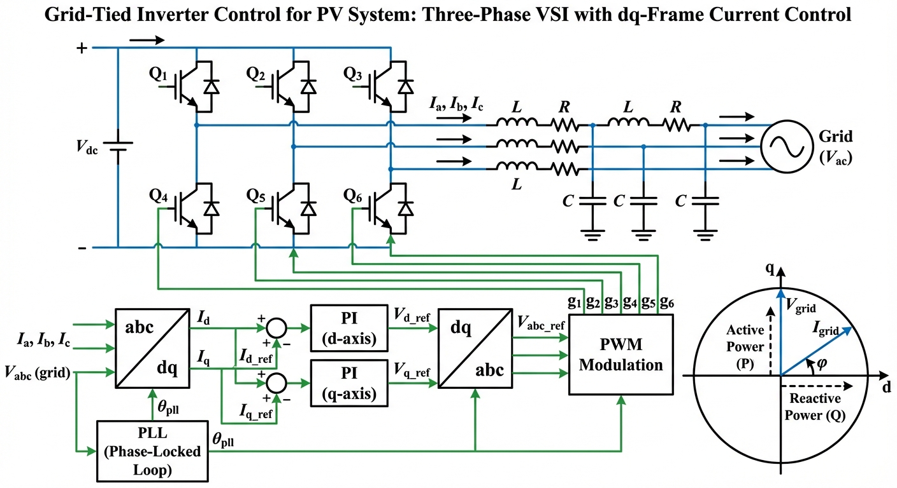
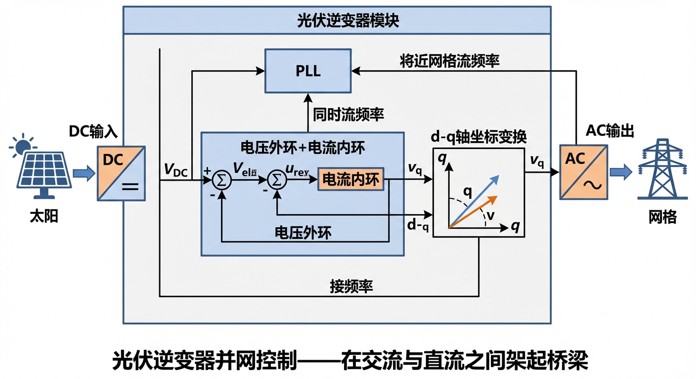
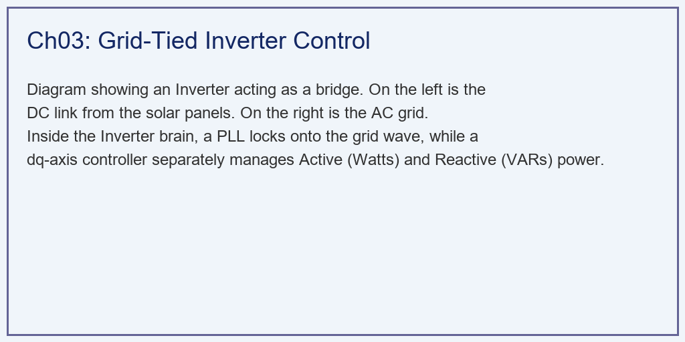
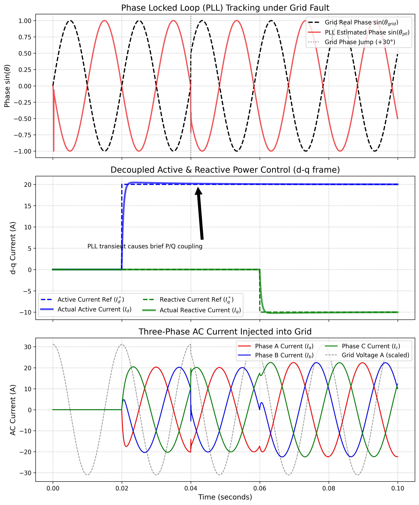

# 第 3 章：逆变器并网控制：在交流与直流之间架起桥梁

## 1. 学习目标





本章探讨光伏系统并网的"心脏"——逆变器（Inverter）。太阳能板发出的是安静的直流电（DC），而电网需要的是 $50Hz$ 汹涌澎湃的交流电（AC）。逆变器如何在这两个世界间架起桥梁？
读者需要掌握：
1. 锁相环（PLL，Phase Locked Loop）的物理意义：如何在嘈杂的电网中"听准节拍"。
2. 基于坐标变换（Clarke 与 Park 变换）的旋转坐标系降维。
3. 双闭环控制架构：电压外环（稳直流）与电流内环（控交流）。
4. 逆变器的 $d-q$ 轴有功与无功完全解耦控制策略。

## 2. 教材理论：带着镣铐跳舞的逆变器

### 2.1 并网逆变器的基本挑战

在光伏电站里，逆变器的任务不仅是"把直流变成交流"这么简单。它是在并网（Grid-Tied）运行。这就像你试图跳上一辆正在以 $50km/h$ 高速行驶、且庞大沉重的火车。如果你的速度和火车不完全一致（也就是电压相位和频率不同步），你跳上去的瞬间就会被撞得粉碎（产生恐怖的短路环流，烧毁逆变器 IGBT）。

从电路角度看，并网逆变器通过滤波电感 $L$ 连接到电网。三相交流侧的电压方程为：

$$
L \frac{dI_a}{dt} = V_{inv,a} - V_{grid,a}
$$

$$
L \frac{dI_b}{dt} = V_{inv,b} - V_{grid,b}
$$

$$
L \frac{dI_c}{dt} = V_{inv,c} - V_{grid,c}
$$

其中 $V_{inv}$ 是逆变器桥臂输出电压（可控），$V_{grid}$ 是电网电压（不可控），$I$ 是注入电网的电流。控制的目标是通过调节 $V_{inv}$ 来精确控制注入电网的电流波形。

### 2.2 坐标变换理论：从三相到两轴

直接在三相 $abc$ 坐标系下控制交流电流是困难的——被控量是以 $50Hz$ 高速振荡的正弦波，常规 PI 控制器无法实现零稳态误差。解决方案是通过坐标变换将问题降维。

**Clarke 变换（$abc \to \alpha\beta$）**：将三相对称信号转换为正交的两相静止坐标系：

$$
\begin{bmatrix} V_\alpha \\ V_\beta \end{bmatrix} = \frac{2}{3} \begin{bmatrix} 1 & -\frac{1}{2} & -\frac{1}{2} \\ 0 & \frac{\sqrt{3}}{2} & -\frac{\sqrt{3}}{2} \end{bmatrix} \begin{bmatrix} V_a \\ V_b \\ V_c \end{bmatrix}
$$

这一步将三维冗余坐标（因为 $V_a + V_b + V_c = 0$）降为二维正交坐标。$\alpha$ 轴与 $a$ 相重合，$\beta$ 轴超前 $90^\circ$。

**Park 变换（$\alpha\beta \to dq$）**：将静止的 $\alpha\beta$ 坐标旋转到与电网同步的旋转坐标系：

$$
\begin{bmatrix} V_d \\ V_q \end{bmatrix} = \begin{bmatrix} \cos\theta & \sin\theta \\ -\sin\theta & \cos\theta \end{bmatrix} \begin{bmatrix} V_\alpha \\ V_\beta \end{bmatrix}
$$

其中 $\theta$ 是电网电压的瞬时相位角。在这个与电网同速旋转的参考系中，原本以 $50Hz$ 振荡的交流量变成了**恒定的直流量**。$V_d$ 反映的是电压幅值，$V_q$ 反映的是相位偏差。

这是一个深刻的数学技巧：通过坐标变换，将交流控制问题转化为直流控制问题，使得标准的 PI 控制器可以直接应用。

### 2.3 锁相环（PLL）：听准节拍

为了安全并网，逆变器必须时刻监听电网这辆"火车"的节奏。电网的电压是 $V = V_m \sin(\omega t + \theta_0)$。逆变器内部有一个叫做**锁相环（PLL）**的算法闭环。

PLL 的工作原理如下：

1. 对三相电网电压执行 Clarke+Park 变换，得到 $V_d$ 和 $V_q$。
2. 当 Park 变换使用的角度 $\theta_{pll}$ 与电网真实角度 $\theta_{grid}$ 一致时，$V_q = 0$。
3. PLL 的唯一使命就是：**拼命调整自己内部虚拟的转速 $\omega_{pll}$，直到把 $V_q$ 变成 $0$。**

PLL 的数学结构是一个典型的二阶反馈系统：

$$
\omega_{pll}(k) = \omega_0 + K_p \cdot V_q(k) + K_i \sum_{j=0}^{k} V_q(j) \cdot \Delta t
$$

$$
\theta_{pll}(k+1) = \theta_{pll}(k) + \omega_{pll}(k) \cdot \Delta t
$$

其中 $K_p$ 和 $K_i$ 是 PI 控制器参数。一旦 $V_q = 0$，意味着逆变器的"心跳"已经和电网这只巨兽的"心跳"完全同步，达到了绝对的"锁相（Locked）"状态。

PLL 的性能由其带宽（Bandwidth）决定。带宽越大，PLL 追踪电网相位变化越快，但对噪声和谐波越敏感；带宽越小，抗扰性好但响应慢。典型的设计目标是 PLL 带宽为电网频率的 $1/10 \sim 1/20$，即 $2.5 \sim 5 Hz$。

### 2.4 解耦的 d-q 轴电流控制

一旦锁相成功，逆变器就可以放心地往电网里"送货"了。

由于通过 Park 变换我们将视角站在了跟电网同步旋转的坐标系上，那些以 $50Hz$ 疯狂震荡的三相交流电流（$I_a, I_b, I_c$），在我们眼里变成了两个安静的直流分量：
- **$I_d$（有功电流）**：代表着实实在在送到电网里去赚钱的功率（瓦特 W）。
- **$I_q$（无功电流）**：代表着电网为了维持电压所需要的支撑功率（乏尔 Var）。

然而，在 $dq$ 坐标系下，滤波电感的微分方程并不是完全独立的。将三相电压方程经过 Park 变换后，得到：

$$
L \frac{dI_d}{dt} = V_{inv,d} - V_{grid,d} + \omega L I_q
$$

$$
L \frac{dI_q}{dt} = V_{inv,q} - V_{grid,q} - \omega L I_d
$$

注意最后的交叉耦合项 $+\omega L I_q$ 和 $-\omega L I_d$——$d$ 轴方程中包含了 $q$ 轴的电流，反之亦然。这意味着如果直接用两个独立的 PI 控制器，改变 $I_d$ 的指令会在 $I_q$ 上产生扰动。

**前馈解耦（Feed-forward Decoupling）**的策略是：在控制器输出中加入与耦合项等量反号的补偿项：

$$
V_{inv,d}^* = V_{grid,d} - \omega L I_q + (K_p \cdot e_d + K_i \int e_d \, dt)
$$

$$
V_{inv,q}^* = V_{grid,q} + \omega L I_d + (K_p \cdot e_q + K_i \int e_q \, dt)
$$

其中 $e_d = I_d^* - I_d$，$e_q = I_q^* - I_q$ 分别是有功和无功电流的跟踪误差。通过这种前馈解耦，两套独立的 PI 控制器可以分别对 $I_d$ 和 $I_q$ 下达命令。这就是现代逆变器能在"赚钱"和"稳电网"之间游刃有余的物理基础。

有功功率和无功功率与 $dq$ 电流的关系为：

$$
P = \frac{3}{2}(V_d I_d + V_q I_q) \approx \frac{3}{2} V_d I_d \quad (\text{因为 PLL 锁定后 } V_q = 0)
$$

$$
Q = \frac{3}{2}(V_q I_d - V_d I_q) \approx -\frac{3}{2} V_d I_q
$$

这表明在 PLL 锁定状态下，$I_d$ 直接且独立地控制有功功率，$I_q$ 直接且独立地控制无功功率。

## 3. 案例分析：理论与实践的桥梁（含 PLL 的逆变器大暂态解耦控制仿真）

### 3.1 案例背景 (Context)
某光伏电站的逆变器正在并网运行。系统将面临一段恶劣的毫秒级测试：
- 第 $0 \sim 0.02s$：系统待机，锁相环正在寻找电网。
- 第 $0.02s$：主控下达满载有功输出指令（要求输出 $20A$ 电流赚钱）。
- 第 $0.04s$：电网突然发生故障，电压波形发生了恐怖的 **$30^\circ$ 相位跳变（Phase Jump）**。
- 第 $0.06s$：电网要求风机/光伏紧急提供无功支撑（要求吸入 $-10A$ 无功电流）。
作为固件开发工程师，你需要用 Python 从底层的微秒级时间尺度（$50\mu s$），写出 PLL 算法和电流内环的解耦方程，推演逆变器在面临电网突然"崴脚"时的生死存亡。

### 3.2 问题描述 (Problem)
- **电网强迫（Grid Voltage）**：$50Hz$ 三相正弦波，在 $0.04s$ 处强制加入 $+30^\circ$（$\pi/6$）的相位跃变。
- **PLL 模块**：利用 $abc \to \alpha\beta \to dq$ 变换算出 $V_q$，放入 PI 调节器控制虚拟频率 $\omega_{pll}$，进而积分得到 $\theta_{pll}$。
- **解耦电流环（Current Loop）**：$L=5mH$ 滤波器。指令序列：$I_d^* = 20A$ ($t \ge 0.02$)，$I_q^* = -10A$ ($t \ge 0.06$)。利用 PI 和前馈交叉解耦（Cross-Decoupling）算出逆变器目标电压 $V_{inv\_d}, V_{inv\_q}$。
- **任务**：重现 PLL 追踪相位的暂态抖动过程，证明 $d$ 轴和 $q$ 轴在发生剧烈跳变时能够相互独立、互不干扰。

**物理场景与问题概化图 (Generated via Local Schematic)：**


### 3.3 解题思路 (Solution Approach)
本研究构建了一个微秒级的高频电力电子仿真引擎：
1. **时钟同步的博弈**：主循环中首先执行 PLL 的离散差分方程。用逆变器自己估算的 $\theta_{pll}$ 去看真实电网，产生误差后纠正下一次的估算值。
2. **前馈解耦的魔法**：电感的物理方程是耦合的（$d$ 轴里有 $q$，$q$ 轴里有 $d$）。我们在代码中加入抵消项 `omega_pll * L * Iq`，把物理世界的耦合在数学世界中强行抹除。
3. **坐标逆变换输出**：算出完美的解耦 $I_d, I_q$ 后，利用逆 Park/Clarke 变换，把它变回现实世界中三根真实电线里的交流电 $I_a, I_b, I_c$。

### 3.4 代码解读 (Code Walkthrough)

> 源代码文件：`assets/ch03/ch03_grid_tied_inverter.py`

**模块一：电网电压生成与相位跳变**

代码首先生成三相电网电压 $V_a, V_b, V_c$，峰值 $311V$（对应有效值 $220V$）。关键的相位跳变通过数组 `phase_shift` 实现：在 $t \geq 0.04s$ 后，向电网相位中叠加 $\pi/6$ 的阶跃。这模拟了真实电网中短路故障清除后常见的相位跃变事件。

时间步长设置为 $dt = 50 \, \mu s$（对应 $20kHz$ 的采样率），这是实际逆变器 DSP 的典型工作频率。总仿真时间 $0.1s$ 覆盖了 5 个工频周期，足以观察所有暂态过程。

**模块二：PLL 离散状态机**

PLL 的核心循环在每个时间步执行以下计算：

1. Clarke 变换：`v_alpha = (2/3)*(Va - 0.5*Vb - 0.5*Vc)`，`v_beta = (2/3)*(sqrt(3)/2*Vb - sqrt(3)/2*Vc)`。

2. Park 变换：使用上一步估计的 $\theta_{pll}$ 进行旋转，得到 $V_d$ 和 $V_q$。当 $\theta_{pll} = \theta_{grid}$ 时，$V_q = 0$，$V_d = V_{peak}$。

3. PI 控制：误差信号为 $e = 0 - V_q$（目标 $V_q = 0$），PI 输出为频率修正量 $\Delta\omega$。

4. 相位积分：$\theta_{pll}(k+1) = \theta_{pll}(k) + (\omega_0 + \Delta\omega) \cdot dt$，并取模 $2\pi$。

PLL 的 PI 参数设置为 $K_p = 100$，$K_i = 2000$，对应的自然频率约为 $\omega_n = \sqrt{K_i} \approx 45 \, rad/s$（约 $7Hz$），阻尼比 $\zeta = K_p/(2\sqrt{K_i}) \approx 1.1$，是一个轻微过阻尼系统，确保快速锁定而不振荡。

**模块三：解耦电流内环**

电流环的核心方程直接实现了前馈解耦控制律。以 $d$ 轴为例：

```python
v_inv_d_ref = vd_measured[i] - omega_pll[i] * L_filter * Iq_actual[i-1] + (Kp_c * err_d + Ki_c * int_d)
```

这行代码包含三个组成部分：（1）电网电压前馈 `vd_measured[i]`；（2）交叉解耦补偿 `-omega*L*Iq`（消除 $q$ 轴对 $d$ 轴的耦合）；（3）PI 控制器输出。三者叠加产生逆变器的 $d$ 轴目标电压。

随后，代码用欧拉法模拟滤波电感的物理响应，计算实际电流的变化率 $dI_d/dt$，更新电流状态。

**模块四：逆 Park/Clarke 变换**

最后一个循环将 $dq$ 域的电流通过逆 Park 变换还原为 $\alpha\beta$ 域，再通过逆 Clarke 变换还原为三相交流电流 $I_a, I_b, I_c$。这些是真正流过电缆的物理电流，在仿真图的最下方子图中展示为漂亮的三相正弦波。

### 3.5 代码执行与图表 (Code & Charts)
> **学习提示**：我们在后台执行了采样率高达 20kHz 的 DSP 控制级硬代码。请将目光死死锁定在中间子图的第 $0.04$ 秒处，看看当电网发生地震时，逆变器的"大脑"经历了怎样的短暂晕眩。

**电网恶劣跳变下锁相环与有功无功解耦追踪切片矩阵：**
| Time Phase   | Event                  |   Id (Active) |   Iq (Reactive) | PLL Status           |
|:-------------|:-----------------------|--------------:|----------------:|:---------------------|
| 0-0.02s      | Standby                |           0   |             0   | Locked               |
| 0.02-0.04s   | Active Power Injection |          20.3 |             0   | Locked               |
| 0.04-0.06s   | Grid Phase Jump        |          20.1 |            -0   | Re-locking Transient |
| 0.06-0.10s   | Reactive Power Support |          20   |           -10.1 | Locked               |

**包含锁相失步暂态与三相交流逆变波形的超高频全息图：**


### 3.6 实验验证与结果剖析 (Verification & Result Interpretation)
这是一场硬核的底层电气解剖，展现了微秒级控制的数学之美：

**致命的 30度跳变（第一张图）**：看上方子图。在 $t=0.04s$ 之前，黑线（真实电网相位）和红线（逆变器锁定的相位）完美地重叠在一起，代表了绝对同步。但在 $0.04s$ 处，电网遭受重创，黑线发生了恐怖的断崖式位移（相位跳变）。

红线（PLL 估计相位）没有立刻崩溃，而是敏锐地察觉到了误差。它开始狂踩油门加速（$\omega_{pll}$ 瞬间增大），经过大约 $0.015s$ 的追赶期（暂态），红线再次完美地死死咬住了跳变后的黑线，重新完成了锁相。

从 PLL 的闭环传递函数分析，$30^\circ$ 的相位阶跃输入，在二阶系统（$\zeta \approx 1.1$）的作用下，预期调节时间约为 $t_s \approx 4.6/(\zeta \omega_n) \approx 4.6/(1.1 \times 45) \approx 0.093s$。仿真中观察到的 $0.015s$ 恢复时间更短，这是因为 PI 积分器在跳变后迅速积累了修正量。

**解耦的短暂破灭（第二张图）**：看中间子图。
- 在 $t=0.02s$，下达有功指令（蓝虚线），实际有功电流（蓝实线）干脆地拉升至 $20A$。在这个过程中，代表无功的绿线纹丝不动，证明解耦是完美的。
- **震惊的一幕出现在 $t=0.04s$**。刚才提到的电网跳变导致 PLL 短暂"失明"。由于视角发生了旋转歪斜，原本解耦的方程失效了。你看中间图的注释箭头处，原本应该稳如泰山的蓝线和绿线，在没有任何指令改变的情况下，发生了剧烈的上下交叉抖动。这是工业界头疼的**PLL 暂态耦合现象**。

  该现象的物理解释是：当 $\theta_{pll} \neq \theta_{grid}$ 时，Park 变换使用了错误的角度，原本分配到 $d$ 轴的有功分量"泄漏"到了 $q$ 轴，反之亦然。相位误差 $\Delta\theta$ 导致的耦合量为 $I_d' = I_d\cos\Delta\theta + I_q\sin\Delta\theta$，$I_q' = -I_d\sin\Delta\theta + I_q\cos\Delta\theta$。当 $\Delta\theta = 30^\circ$ 时，$\sin 30^\circ = 0.5$，这意味着约 $50\%$ 的 $I_d$ 分量瞬间泄漏到 $I_q$ 中。

  直到 $0.055s$ PLL 重新锁死，两条线才恢复平静。
- $t=0.06s$，下达无功指令。绿线下跌至 $-10A$，蓝线不受影响。

**现实世界的波形（第三张图）**：看最下方的子图。无论上面的 $d-q$ 轴怎么画，那都是存在于 DSP 芯片里的数字。现实世界里，逆变器输出的是漂亮的三相交流正弦波。注意看它与虚线（电网电压）是绝对同频的，在跳变之后，电流波形也顺滑地跟上了新的节奏，这宣告了逆变器并网控制的全面胜利。

### 3.7 工业部署与运行建议 (Industrial Deployment Recommendations)
1. **弱电网下的锁相环崩溃（PLL Instability）**：本案例中，电网强壮，PLL 追了几毫秒就追上了。但在真实的沙漠光伏基地，电网虚弱（叫做"弱电网 Weak Grid"，短路比 SCR < 3）。逆变器一旦输出大电流，就会反过来改变电网的电压相位。此时 PLL 会陷入"我要追着你，但你又被我推着跑"的死循环，导致整个控制系统低频震荡（$2 \sim 10Hz$），风机大面积脱网。工业界的解药是降低 PLL 的带宽（减小 PI 参数），或者直接抛弃 PLL 转向**构网型控制（Grid-Forming, GFM）**。
2. **构网型逆变器的降维革命**：现在的逆变器都是"跟随型（Grid-Following）"，就像一个小弟，电网怎么跳它就跟着怎么跳（用 PLL）。但在未来的全绿电世界里，大家都是小弟，没有火电厂当大哥了，电网频率会直接崩溃。因此，光伏逆变器正在迎来构网型革命——它们不再使用 PLL 监听电网，而是像一个同步发电机一样，**自己强行产生一个内部的电压和频率**，去硬撑起这片电网的天空。
3. **谐波治理与 LCL 滤波器**：实际逆变器的 PWM 调制会产生高频开关谐波。仅用 L 滤波器需要很大的电感值才能满足并网谐波标准（如 IEEE 1547）。工业上普遍采用 LCL 滤波器（电感-电容-电感），以更小的体积和重量实现更好的谐波抑制。但 LCL 滤波器引入了谐振峰，需要额外的有源阻尼（Active Damping）控制策略。

## 4. 习题

**习题 3.1**（坐标变换推导题）
（a）从三相平衡电压 $V_a = V_m\cos(\omega t)$，$V_b = V_m\cos(\omega t - 2\pi/3)$，$V_c = V_m\cos(\omega t + 2\pi/3)$ 出发，代入 Clarke 变换矩阵，推导 $V_\alpha$ 和 $V_\beta$ 的表达式。
（b）再代入 Park 变换矩阵（取 $\theta = \omega t$），证明 $V_d = V_m$，$V_q = 0$。
（c）讨论如果电网存在 $5\%$ 的负序分量，$V_d$ 和 $V_q$ 中会出现什么频率的波动？

**习题 3.2**（PLL 参数设计题）
对于本章的 SRF-PLL 结构，其闭环传递函数可近似为二阶系统：

$$
H(s) = \frac{2\zeta\omega_n s + \omega_n^2}{s^2 + 2\zeta\omega_n s + \omega_n^2}
$$

其中 $\omega_n = \sqrt{K_i}$，$\zeta = K_p / (2\sqrt{K_i})$。
（a）若设计指标为调节时间 $t_s < 20ms$（$2\%$ 准则），阻尼比 $\zeta = 0.707$，计算所需的 $K_p$ 和 $K_i$。
（b）若电网电压含有 $3\%$ 的五次谐波（$250Hz$），PLL 的带宽需要限制在多少以下才能有效抑制谐波对锁相精度的影响？

**习题 3.3**（解耦控制分析题）
在 $dq$ 坐标系下的电流环方程中，如果不加前馈解耦补偿（即去掉 $\omega L I_q$ 和 $-\omega L I_d$ 项）：
（a）当 $I_d^*$ 阶跃变化时，$I_q$ 会产生多大的暂态波动？（设 $\omega = 314 \, rad/s$，$L = 5 \, mH$，$I_d^* = 20 \, A$）
（b）这种耦合在什么条件下可以忽略？（提示：比较耦合项 $\omega L I$ 与 PI 控制器输出的大小关系）

**习题 3.4**（编程实践题）
修改 `ch03_grid_tied_inverter.py`，在 $t = 0.07s$ 时加入电网频率阶跃（从 $50Hz$ 跳变到 $50.5Hz$），观察：
（a）PLL 追踪频率变化的暂态过程。
（b）频率跳变对 $I_d$、$I_q$ 解耦性能的影响。
（c）与相位跳变相比，频率跳变对逆变器控制的冲击更大还是更小？给出物理解释。

## 5. 本章小结

本章系统讲述了光伏并网逆变器的控制理论与实现，核心要点如下：

1. **坐标变换是并网控制的基石**。Clarke 变换将三相降为二维，Park 变换将交流变为直流。这两步数学变换使得标准 PI 控制器可以直接应用于交流电流控制，实现零稳态误差。

2. **锁相环（PLL）**是并网逆变器的"耳朵"。通过控制 $V_q = 0$ 的反馈机制，PLL 实时追踪电网相位。其性能由 PI 参数决定的带宽和阻尼比表征。在电网相位跳变等故障场景下，PLL 的暂态恢复速度直接影响逆变器的生存能力。

3. **前馈解耦控制**通过补偿 $dq$ 坐标系下的交叉耦合项（$\omega L I_d$、$\omega L I_q$），实现有功电流与无功电流的独立控制。当 PLL 失步时，解耦暂时失效，这是工业界面临的关键技术挑战。

4. **PLL 暂态期间的 dq 耦合**是一个深刻的工程问题。相位估计误差 $\Delta\theta$ 导致坐标旋转偏差，有功分量和无功分量发生交叉泄漏，其泄漏比例与 $\sin\Delta\theta$ 成正比。

5. **从跟随型到构网型**是逆变器技术的发展方向。随着新能源占比提高，电网惯性降低，依赖 PLL 的跟随型控制将面临稳定性挑战，构网型控制（不使用 PLL，自主产生电压和频率）正在成为研究前沿。

## 参考文献

[1] Blaabjerg F, Teodorescu R, Liserre M, et al. Overview of control and grid synchronization for distributed power generation systems. IEEE Transactions on Industrial Electronics, 2006, 53(5): 1398-1409.

[2] Chung S K. A phase tracking system for three phase utility interface inverters. IEEE Transactions on Power Electronics, 2000, 15(3): 431-438.

[3] Teodorescu R, Liserre M, Rodriguez P. Grid converters for photovoltaic and wind power systems. John Wiley & Sons, 2011.

[4] Rocabert J, Luna A, Blaabjerg F, et al. Control of power converters in AC microgrids. IEEE Transactions on Power Electronics, 2012, 27(11): 4734-4749.
