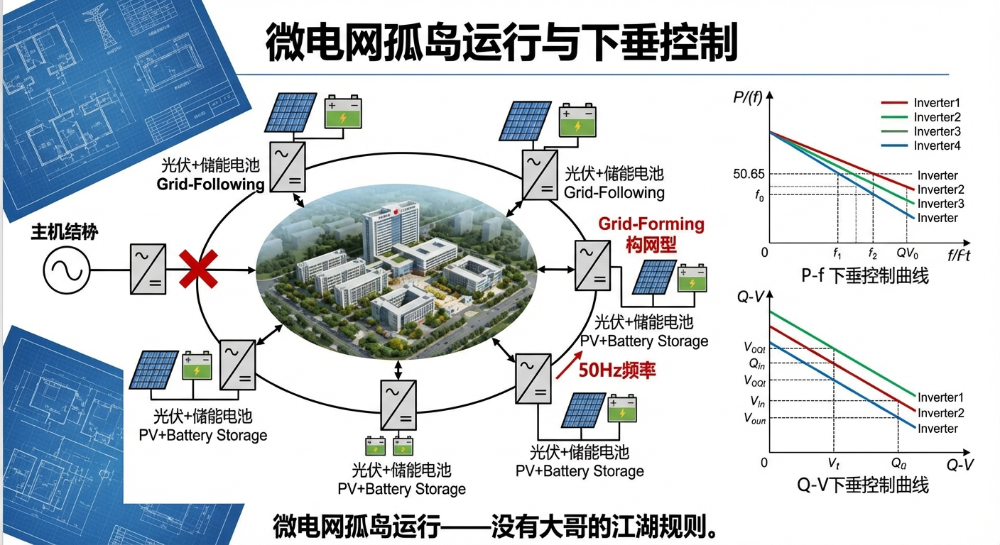
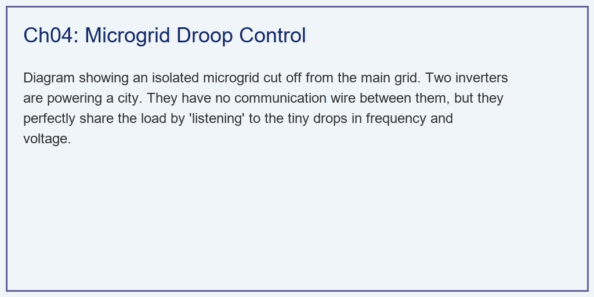
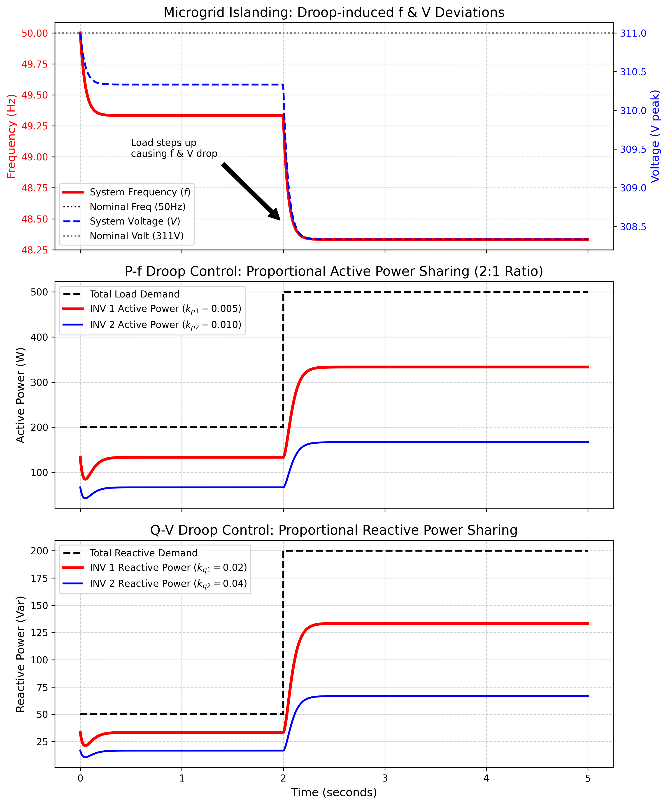

# 第 4 章：微电网孤岛运行：没有大哥的江湖规则

## 1. 学习目标

本章探讨当主电网崩溃，光伏/储能逆变器被迫切断与大电网的连接，形成一个独立的**孤岛微电网（Islanding Microgrid）**时的生存法则。
读者需要掌握：
1. 跟随型逆变器（Grid-Following）与构网型逆变器（Grid-Forming）的本质区别。
2. 为什么在孤岛中，绝对不允许逆变器继续使用 MPPT 满发？
3. 无通信线（Communication-less）条件下的分布式协作。
4. 下垂控制（Droop Control）：利用 $P-f$（有功-频率）和 $Q-V$（无功-电压）下垂曲线实现功率按比例自动均分。

## 2. 教材理论：谁来当带头大哥？

### 2.1 从并网到孤岛的模式切换

在第 3 章中，逆变器是一个听话的小弟。它用 PLL 死死锁住大电网的频率，大电网是 $50Hz$，它就是 $50Hz$。但是，如果某天发生大地震，主电网断电了，你的园区（比如一个医院）被迫断开开关，形成了一个孤岛微电网。

**此时，整个电网里没有火电厂了，没有大哥了，谁来规定电网的频率？**

如果逆变器还傻傻地用 PLL 去找电网频率，它会发现频率变成了 $0$（或者疯狂漂移），于是它直接崩溃停机。因此，孤岛中的逆变器必须切换为**"构网型（Grid-Forming, GFM）"**。它必须挺身而出，自己当大哥，自己强行用内部的晶振生成一个 $50Hz$ 的正弦波，去硬撑起医院的电压。

从控制理论角度看，跟随型与构网型的本质区别在于：

| 特征 | 跟随型（Grid-Following） | 构网型（Grid-Forming） |
|------|-------------------------|----------------------|
| 控制变量 | 电流（$I_d, I_q$） | 电压（$V, \theta$） |
| 同步机制 | PLL 追踪电网 | 内部自主产生频率 |
| 等效模型 | 受控电流源 | 受控电压源 |
| 适用场景 | 强电网并网 | 孤岛或弱电网 |
| 稳态特性 | 注入给定功率 | 维持给定电压和频率 |

### 2.2 孤岛中的功率平衡约束

在孤岛微电网中，一个新的物理约束变得至关重要——**功率平衡必须在微电网内部实时实现**：

$$
\sum_{i=1}^{n} P_{gen,i}(t) = P_{load}(t) + P_{loss}(t)
$$

在并网模式下，大电网充当无限大的功率缓冲池，任何不平衡都由电网吸收。但在孤岛中，如果光伏板发出的功率大于负载需求，多余的能量无处可去，会导致直流母线电压飙升；如果发电不足，频率会下跌直到系统崩溃。

这就是为什么在孤岛中**绝对不允许逆变器继续使用 MPPT 满发**——光伏板发多少电是老天说了算的，如果正午烈日发出的电大于此刻医院的用电需求，系统就会炸。必须有一个"削功率"的机制，让光伏板主动降低输出。这通常通过将工作点从 MPP 右移到 P-V 曲线的下降段来实现，称为**功率限制（Power Curtailment）**。

### 2.3 下垂控制（Droop Control）的数学基础

**无通信协作的魔法：下垂控制（Droop Control）**

在微电网中，通常有多个逆变器（比如楼顶的光伏、地下室的储能电池）连在一起。假设医院现在需要 $300kW$ 的电。1 号逆变器容量大，2 号逆变器容量小。它们怎么知道各自该发多少电？

拉一根网线（通信线）让它们互相商量？不行！如果网线断了，微电网就炸了。

天才的工程师们发明了**"下垂控制"**。这是一种不需要任何通信线的分布式协作算法，它模仿了传统发电机天然的物理惯性。传统同步发电机存在固有的转速-功率特性：当负载增大时，转子减速（频率降低）；当负载减小时，转子加速（频率升高）。下垂控制用数学方程人工模拟了这种特性：

**P-f 下垂（有功管频率）**：

$$
f_i = f_{nom} - k_{p,i} \cdot P_i
$$

其中 $f_{nom}$ 是额定频率（$50Hz$），$k_{p,i}$ 是第 $i$ 台逆变器的有功下垂系数（单位 $Hz/W$），$P_i$ 是其有功输出。当医院的负载突然增加（需要更多的有功 $P$ 时），发电机就像一个人扛了重东西，跑得变慢了（频率 $f$ 下跌）。所有的逆变器只要"听"到电网的频率跌了，就自动知道"哦，大家缺电了"，于是各自根据自己的容量（$k_p$ 系数）自动增加输出功率。

**Q-V 下垂（无功管电压）**：

$$
V_i = V_{nom} - k_{q,i} \cdot Q_i
$$

当医院的无功负载增加时，电网电压 $V$ 会下跌。逆变器只要"看"到电压跌了，就自动向外吐无功电流。

### 2.4 下垂控制的功率均分推导

下垂控制最精妙的特性是：**功率按照容量比例自动均分，无需通信**。推导如下：

在稳态下，所有逆变器连接在同一母线上，系统频率必须唯一：

$$
f_{sys} = f_{nom} - k_{p,1} \cdot P_1 = f_{nom} - k_{p,2} \cdot P_2
$$

由此得到功率比：

$$
\frac{P_1}{P_2} = \frac{k_{p,2}}{k_{p,1}}
$$

即下垂系数越小（越"硬"）的逆变器，承担的功率越大。如果设计 $k_{p,1} = 0.005$，$k_{p,2} = 0.010$（即 2 号的下垂系数是 1 号的两倍），则 $P_1/P_2 = 2$——大容量的 1 号自动承担 2 倍的负载。

联立功率平衡方程 $P_1 + P_2 = P_{load}$，可以推出系统稳态频率的解析公式：

$$
f_{sys} = f_{nom} - \frac{P_{load}}{1/k_{p,1} + 1/k_{p,2}}
$$

定义等效下垂系数 $k_{p,eq} = 1/(1/k_{p,1} + 1/k_{p,2})$，则有：

$$
f_{sys} = f_{nom} - k_{p,eq} \cdot P_{load}
$$

通过这种"听频率、看电压"的简单的物理本能，多个逆变器在没有任何通信的情况下，完美地实现了功率的按比例均分。

### 2.5 下垂控制的频率偏差与调频层级

下垂控制的代价是频率和电压永远回不到额定值。偏差量与负载大小成正比：

$$
\Delta f = f_{nom} - f_{sys} = k_{p,eq} \cdot P_{load}
$$

在电力系统中，这种频率偏差是有严格限制的。对于 $50Hz$ 电网，偏差通常不允许超过 $\pm 0.5Hz$。因此，工程上引入了分层调频机制：

- **一次调频（Primary Control）**：即下垂控制本身，响应速度快（毫秒级），但会留下频率偏差。
- **二次调频（Secondary Control）**：通过低带宽的积分控制器，缓慢调整下垂曲线的截距，将频率恢复到 $50Hz$。响应时间为秒到分钟级。
- **三次调频（Tertiary Control）**：经济调度层，优化各机组出力分配以最小化成本。响应时间为分钟到小时级。

## 3. 案例分析：理论与实践的桥梁（双逆变器无通信功率均分与暂态跌落仿真）

### 3.1 案例背景 (Context)
某海岛微电网，完全脱离大陆电网。岛上有两台构网型储能逆变器为小镇供电。
- INV 1：大逆变器（容量大，$P-f$ 下垂系数 $k_{p1} = 0.005$）。
- INV 2：小逆变器（容量小，$P-f$ 下垂系数 $k_{p2} = 0.010$。注意，下垂系数越大，代表它越"软"，出的力越少，刚好符合其容量只有一半的物理属性）。
一开始，小镇的负载很轻（总需求 $200W$）。在第 $2.0s$ 时，岛上的海水淡化工厂突然启动，这就像一座大山压下来，总有功负载瞬间飙升至 $500W$。
作为微电网架构师，你需要用代码证明：在这场突如其来的冲击下，两台互不通信的逆变器是如何通过"牺牲全岛的频率和电压"，默契地按 $2:1$ 的比例扛下所有负载的。

### 3.2 问题描述 (Problem)
- **额定参数**：$f_{nom} = 50.0Hz, V_{nom} = 311V$。
- **下垂参数**：INV1($k_p=0.005, k_q=0.02$)；INV2($k_p=0.010, k_q=0.04$)。
- **阶跃负载（Load Step）**：$t=2.0s$ 时，有功从 $200W \to 500W$，无功从 $50W \to 200Var$。
- **任务**：推演系统的公共频率 $f_{sys}$ 和电压 $V_{sys}$ 在负载冲击下的跌落轨迹，以及两台逆变器 $P$ 和 $Q$ 的自动再分配过程。

**物理场景与问题概化图 (Generated via Local Schematic)：**

### 3.3 解题思路 (Solution Approach)
本研究构建了一个微电网频率与功率的耦合惯性仿真模型：
1. **网络方程化简**：在稳态下，系统频率必然唯一。由此可以推导出负载增量将引发的电网目标频率跌落公式 $f_{target} = f_{nom} - P_{load} / (1/k_{p1} + 1/k_{p2})$。
2. **频率/电压惯性响应**：真实电网的频率不会瞬间跳变。在代码中引入一个低通滤波器（时间常数 $\tau = 0.05s$），模拟系统频率和电压像一个"沉重的飞轮"一样，在受到负载冲击后缓缓下跌的物理阻尼过程。
3. **本地响应与反作用**：在每一个时间步，两台逆变器测量此时的系统频率 $f_{sys}(t)$，立刻代入自己的下垂公式 $P = (f_{nom} - f_{sys}) / k_p$，算出自己应该出多少力，并将这股力量输出给电网。

### 3.4 代码解读 (Code Walkthrough)

> 源代码文件：`assets/ch04/ch04_microgrid_droop.py`

**模块一：系统参数与下垂系数设置**

代码定义了两台逆变器的下垂系数：INV1 的 $k_{p1} = 0.005 \, Hz/W$、$k_{q1} = 0.02 \, V/Var$；INV2 的 $k_{p2} = 0.010 \, Hz/W$、$k_{q2} = 0.04 \, V/Var$。注意 INV2 的下垂系数恰好是 INV1 的两倍，这意味着 INV2 的容量是 INV1 的一半。等效有功下垂系数为：

$$
k_{p,eq} = \frac{1}{1/k_{p1} + 1/k_{p2}} = \frac{1}{200 + 100} = \frac{1}{300} \approx 0.00333 \, Hz/W
$$

**模块二：负载需求序列**

负载采用阶跃模型——$t < 2s$ 时有功 $200W$ 无功 $50Var$，$t \geq 2s$ 时有功跳至 $500W$ 无功跳至 $200Var$。初始状态下的功率分配通过解析公式计算：$P_1 = P_{load} \times (1/k_{p1})/(1/k_{p1}+1/k_{p2}) = 200 \times 200/300 = 133.3W$，$P_2 = 200 \times 100/300 = 66.7W$。

**模块三：动态仿真主循环**

主循环的核心逻辑分三步：

1. **计算稳态目标**：利用解析公式 `f_target = f_nom - P_load / (1/kp1 + 1/kp2)` 算出目标频率。

2. **一阶惯性滤波**：`f_sys[i] = f_sys[i-1] + (f_target - f_sys[i-1]) * (dt/tau)`。这模拟了系统频率的惯性响应——频率不会瞬间跳变，而是以指数衰减的方式趋近目标值。时间常数 $\tau = 0.05s$ 意味着频率在负载阶跃后约 $0.15s$（$3\tau$）内达到 $95\%$ 的稳态值。

3. **逆变器本地下垂响应**：每台逆变器根据感知到的系统频率，通过自己的下垂公式计算应输出的功率——`P1_target = (f_nom - f_sys) / kp1`。同样通过一阶滤波实现功率的平滑跟踪。

这种实现方式虽然是简化的准稳态近似，但准确地捕捉了下垂控制的两个本质特征：（1）频率偏差与负载成正比；（2）功率按下垂系数的倒数比例分配。

**模块四：双轴绘图与功率比验证**

绘图部分使用了 `twinx()` 在同一子图中叠加频率和电压曲线，直观展示两者的同步下跌。功率子图中的黑色虚线（总负载）被红色和蓝色实线（两台逆变器的输出）精确填充，其比值在负载变化前后始终保持 $2:1$。

### 3.5 代码执行与图表 (Code & Charts)
> **学习提示**：我们在后台执行了没有中心控制器的纯分布式算力。请看表格，在没有任何人指挥的情况下，两台逆变器的出力比例在负载突变前后，死板地维持在完美的 $2.0:1$。

**孤岛负载冲击下频率/电压跌落与无通信功率均分矩阵：**
| Scenario          |   Sys Freq (Hz) |   Sys Volt (V) |   INV1 Power (W) |   INV2 Power (W) | Power Sharing Ratio   |
|:------------------|----------------:|---------------:|-----------------:|-----------------:|:----------------------|
| Light Load (t<2s) |           49.33 |          310.3 |            133.3 |             66.7 | 2.0:1                 |
| Heavy Load (t>2s) |           48.33 |          308.3 |            333.3 |            166.7 | 2.0:1                 |

我们可以手动验证表格数据：

轻载时：$f_{sys} = 50 - 200/(200+100) = 50 - 0.667 = 49.33 \, Hz$。

重载时：$f_{sys} = 50 - 500/(200+100) = 50 - 1.667 = 48.33 \, Hz$。

频率跌落量：$\Delta f = 49.33 - 48.33 = 1.0 \, Hz$，恰好等于负载增量 $300W$ 乘以等效下垂系数 $1/300 = 0.00333 \, Hz/W$，即 $300 \times 0.00333 = 1.0 \, Hz$。

**微电网下垂控制：频率妥协换取的完美功率均分仿真图：**

### 3.6 实验验证与结果剖析 (Verification & Result Interpretation)
图表生动地展示了微电网系统"以退为进"的生存哲学：

**牺牲指标换取生存（上方子图）**：看最上方的子图。黑线和灰虚线是完美的 $50Hz$ 和 $311V$。
- 在前 $2$ 秒轻载时，为了让逆变器出力（$200W$），系统频率（红实线）必须轻微下跌到 $49.33Hz$ 左右。
- 在第 $2.0$ 秒，大负载砸下。逆变器们立刻感觉到了"沉重"，你看红色的频率线和蓝色的电压线，就像被人重重地打了一拳，立刻向下发生了深度的暂态跌落。最终频率死死稳在了 $48.33Hz$ 左右。
- **划重点**：在这个孤岛里，电不再是完美的 $50Hz$。下垂控制的本质就是**"容忍频率和电压的偏差，以此作为通信信号，告诉所有设备现在到底有多缺电"**。频率偏差本身就是一种隐式的全局通信机制。

**惊人的默契（中间与下方子图）**：看下面两张功率图。黑色的虚线是总负载。
- 当 $t=2.0s$ 黑线跃升时。红线（大容量 INV1）和蓝线（小容量 INV2）没有发生任何争抢、也没有任何震荡，它们平滑地爬升并填满了黑线下的所有空间。
- 我们看具体的数值：在重载区（$t>2s$），总有功是 $500W$。红线分担了 $333.3W$，蓝线分担了 $166.7W$。因为我们在代码里设置的 $k_{p2}$ 是 $k_{p1}$ 的两倍（意味着 2 号机更不愿意出力），所以结果完美地呈现了 $333.3 : 166.7 = 2:1$ 的功率均分。无功功率（底层子图）也同样如此。

**暂态过程的物理解释**：在负载阶跃瞬间，系统频率不会突变——低通滤波器的时间常数 $\tau = 0.05s$ 模拟了系统的等效惯性。频率的指数衰减过程为：

$$
f_{sys}(t) = f_{final} + (f_{initial} - f_{final}) \cdot e^{-(t-t_0)/\tau}
$$

在 $3\tau = 0.15s$ 内，频率达到 $95\%$ 的稳态值；在 $5\tau = 0.25s$ 内达到 $99\%$。这个暂态过程决定了微电网的"柔软程度"——$\tau$ 越大，响应越慢但越平滑。

### 3.7 工业部署与运行建议 (Industrial Deployment Recommendations)
1. **二次调频（Secondary Control）的引入**：下垂控制（一次调频）虽然解决了生死问题，但留下了后遗症——频率永远回不到 $50Hz$ 了（像图里稳在了 $48.33Hz$）。如果让这种频率跑太久，岛上的精密医疗仪器可能会烧毁。在真实的微电网中，我们会引入一个带极慢积分环节的"二次调频（Secondary Control）"中心控制器。在发生冲击的几分钟后，它会缓慢地下发指令，把所有逆变器的下垂曲线整体向上平移，悄无声息地把频率重新"托举"回 $50Hz$。
2. **虚拟同步发电机（VSG）的崛起**：纯粹的下垂控制反应太快了，缺乏传统巨大转子的"惯性（Inertia）"。一旦微电网里有电机启动，电压会瞬间出现剧烈的毛刺。目前最前沿的技术是虚拟同步发电机（Virtual Synchronous Generator, VSG）。在逆变器的控制代码里，硬生生写入机械转子方程：

$$
J \frac{d\omega}{dt} = T_m - T_e - D(\omega - \omega_0)
$$

其中 $J$ 是虚拟转动惯量，$T_m$ 是虚拟机械力矩，$T_e$ 是电磁力矩，$D$ 是阻尼系数。让冰冷的 IGBT 开关表现得就像一个拥有几十吨重铁疙瘩的真实发电机一样，提供虚拟惯性来抑制频率变化率（RoCoF），增强了微电网抗瞬态冲击的柔韧性。

3. **线路阻抗不匹配问题**：理想的下垂控制假设逆变器到公共母线的线路阻抗相同。但在实际微电网中，不同逆变器的位置不同，线路阻抗差异会破坏功率均分的精度。工业界通过引入虚拟阻抗（Virtual Impedance）技术——在控制环中人工添加一个虚拟的电感或电阻，来补偿物理线路阻抗的差异。

## 4. 习题

**习题 4.1**（理论推导题）
考虑 $n$ 台逆变器组成的孤岛微电网，第 $i$ 台的 P-f 下垂方程为 $f = f_{nom} - k_{p,i} P_i$，总负载为 $P_{load}$。
（a）推导系统稳态频率的通用公式。
（b）推导第 $i$ 台逆变器分担的功率 $P_i$ 的表达式。
（c）若第 3 台逆变器因故障脱网，系统频率和剩余逆变器的出力如何变化？

**习题 4.2**（参数设计题）
某海岛微电网有 3 台逆变器，额定容量分别为 $100kW$、$50kW$、$25kW$。频率允许偏差范围为 $49.5 \sim 50.5Hz$。
（a）设计 3 台逆变器的下垂系数 $k_{p,i}$，使得在满载（$175kW$）时频率恰好为 $49.5Hz$。
（b）当负载为 $100kW$ 时，各台逆变器的出力和系统频率分别是多少？
（c）如果要求频率恢复到 $50Hz$，二次调频控制器需要将每台逆变器的下垂曲线截距调整多少？

**习题 4.3**（物理分析题）
解释以下现象：
（a）为什么下垂控制在感性线路（$X \gg R$）中效果好，但在阻性线路（$R \gg X$）中 P-f 和 Q-V 的映射关系会"反转"？
（b）在阻性线路主导的低压微电网中，应如何修改下垂控制策略？

**习题 4.4**（编程仿真题）
在 `ch04_microgrid_droop.py` 的基础上，增加一个二次调频控制器：
（a）在 $t = 3s$ 时启动二次调频，目标频率 $50Hz$，积分增益 $K_{i,sec} = 0.1$。
（b）观察频率恢复过程，记录恢复到 $49.95Hz$ 所需的时间。
（c）分析二次调频与一次下垂控制之间的时间尺度分离要求。

## 5. 本章小结

本章以孤岛微电网为背景，系统讲述了下垂控制的原理与工程实现，核心要点如下：

1. **孤岛运行的核心挑战**在于失去了大电网的频率和电压支撑。逆变器必须从"跟随型"切换为"构网型"，自主产生电压和频率参考。

2. **下垂控制**通过引入 P-f 和 Q-V 线性关系（$f = f_{nom} - k_p P$，$V = V_{nom} - k_q Q$），实现了无通信条件下的分布式功率均分。功率分配比例由下垂系数的倒数之比决定。

3. **频率偏差是一种隐式通信机制**——系统频率的下跌量 $\Delta f = k_{p,eq} \cdot P_{load}$ 携带了全局负载信息，每台逆变器通过感知频率即可推断自己应承担的功率份额。

4. **下垂控制的代价**是频率和电压永远偏离额定值。二次调频（积分控制）可以恢复频率，但需要低带宽通信或集中控制器，引入了额外的复杂性。

5. **虚拟同步发电机（VSG）**通过在逆变器控制中嵌入机械转子方程，提供虚拟惯性响应，增强了微电网对负载突变的抗冲击能力。虚拟惯量 $J$ 和阻尼系数 $D$ 是关键设计参数。

## 参考文献

[1] Guerrero J M, Vasquez J C, Matas J, et al. Hierarchical control of droop-controlled AC and DC microgrids—A general approach toward standardization. IEEE Transactions on Industrial Electronics, 2011, 58(1): 158-172.

[2] Lasseter R H. Microgrids. IEEE Power Engineering Society Winter Meeting, 2002, 1: 305-308.

[3] Zhong Q C, Weiss G. Synchronverters: Inverters that mimic synchronous generators. IEEE Transactions on Industrial Electronics, 2011, 58(4): 1259-1267.

[4] Pogaku N, Prodanovic M, Green T C. Modeling, analysis and testing of autonomous operation of an inverter-based microgrid. IEEE Transactions on Power Electronics, 2007, 22(2): 613-625.
