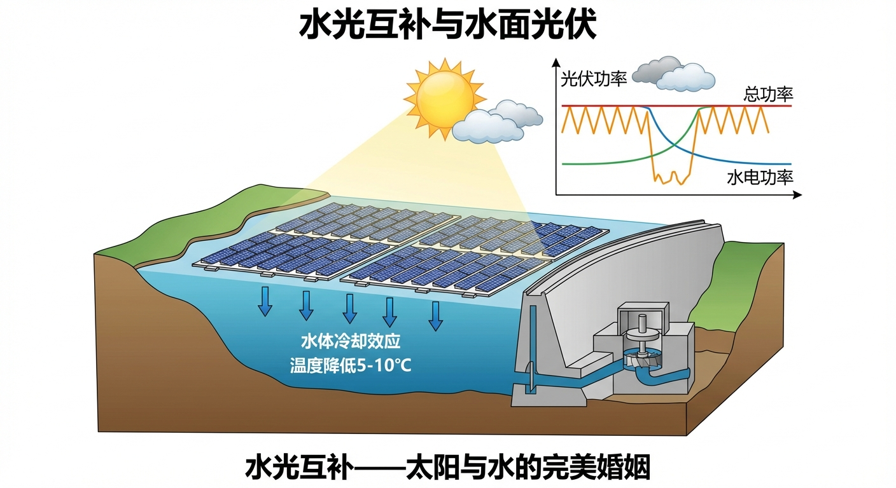
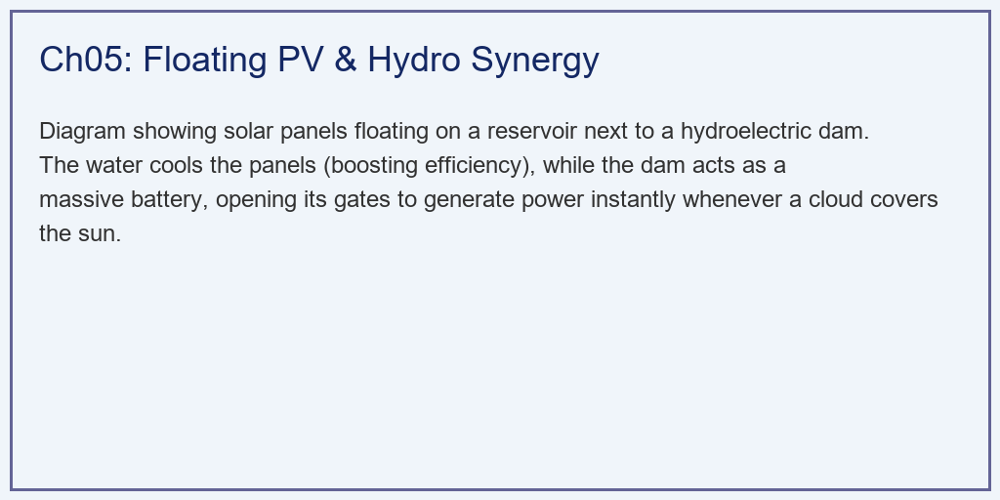
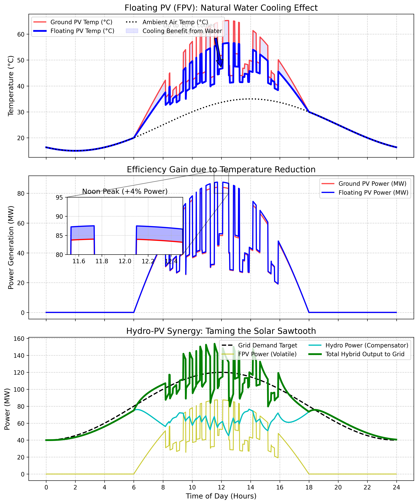

# 第 5 章：水光互补与水面光伏：水能纽带的终极协同

## 1. 学习目标



本章探讨光伏系统如何跨界与水利工程进行深度融合（Hydro-PV Synergy）。这是目前解决大规模新能源并网消纳问题的工业级终极答案。
读者需要掌握：
1. **水面光伏（Floating PV, FPV）**的"温度红利"与水体冷却物理机制。
2. 光伏发电的"高频锯齿波"对电网调度的毁灭性打击。
3. 水电站（Hydroelectric Dam）作为"超级缓冲池"的动态响应特性。
4. "水光互补"联合调度的能量抹平（Smoothing）艺术。

## 2. 教材理论：太阳与水的完美婚姻

### 2.1 光伏发电的两大致命缺陷

在第 1 章中，我们发现了一个让人绝望的物理定律：**光伏板是怕热的**。在夏天的中午，炽热的阳光把铺在沙漠上的电池板烤到了 $70^\circ C$，导致电压严重萎缩，损失了近 $20\%$ 的发电量。

另一方面，在第 4 章中，我们也看到了光伏发电脆弱的一面。天上随便飘过一朵云，电站的输出功率就会瞬间发生几十兆瓦的"断崖式跳水"。如果把这种像"锯齿"一样的垃圾电直接送进电网，电网的频率会被撕得粉碎。

从电力系统调度的角度量化这两个问题：

**问题一：温度损失（Thermal Loss）**

光伏组件的输出功率与温度的关系为：

$$
P_{pv}(G, T_{cell}) = P_{rated} \cdot \frac{G}{G_{STC}} \cdot [1 + \gamma (T_{cell} - T_{STC})]
$$

其中 $\gamma \approx -0.004 \, /^\circ C$ 是功率温度系数。电池温度 $T_{cell}$ 由环境温度和光照共同决定，其估算公式为：

$$
T_{cell} = T_{amb} + \frac{NOCT - 20}{800} \cdot G
$$

其中 $NOCT$（标称运行电池温度）是电池在特定条件下（$G = 800 \, W/m^2$，$T_{amb} = 20^\circ C$，风速 $1 \, m/s$）的温度。典型的陆上组件 $NOCT \approx 45 \sim 47^\circ C$。

**问题二：波动性（Volatility）**

光伏功率的波动可以用功率变化率（Ramp Rate）来量化：

$$
RR = \frac{|P(t+\Delta t) - P(t)|}{\Delta t}
$$

在快速过云事件中，大型光伏电站的功率变化率可以达到 $50 \sim 100 \, MW/min$，这远远超出电网调频资源的跟踪能力。电网运营商通常要求并网电站的功率变化率不超过额定容量的 $10\%/min$。

### 2.2 水面光伏（Floating PV）：天然的温度解药

为了解决"怕热"的问题，工程师做出了一个大胆的决定：**把光伏板建在水库的水面上**。

水库拥有庞大的水体，水的比热容（$4.18 \, kJ/(kg \cdot K)$）远高于空气（$1.005 \, kJ/(kg \cdot K)$）和地面材料。不仅如此，水面每时每刻都在蒸发，蒸发会带走大量的潜热（水的汽化潜热约 $2260 \, kJ/kg$）。这就等于给光伏板装了一个免费的、面积几平方公里的"超级水冷散热器"。

水面光伏的 NOCT 可以降低到约 $35 \sim 40^\circ C$，比陆上低 $5 \sim 10^\circ C$。定量估算温度红利：

在夏季正午，$T_{amb} = 35^\circ C$，$G = 1000 \, W/m^2$ 时：
- 陆上：$T_{cell} = 35 + (45-20)/800 \times 1000 = 35 + 31.25 = 66.25^\circ C$
- 水面：$T_{cell} = 35 + (38-20)/800 \times 1000 = 35 + 22.5 = 57.5^\circ C$

温差 $\Delta T = 8.75^\circ C$，对应功率提升：

$$
\Delta P / P = -\gamma \cdot \Delta T_{cell} = -(-0.004) \times 8.75 = 3.5\%
$$

对于一个 $100MW$ 的光伏电站，这意味着在正午高温时段多发 $3.5MW$，全天积分下来可增加约 $2 \sim 4\%$ 的发电量。

水面光伏的额外优势还包括：（1）减少水面蒸发，在干旱地区具有节水价值；（2）抑制藻类生长，改善水质；（3）利用水库已有的电网接入设施，节省并网成本。

### 2.3 水光互补（Hydro-PV Hybrid）：波动性的终极克星

为了解决"锯齿波"的波动问题，工程师把水面光伏和水库大坝背后的水轮发电机"绑"在了一起。水电站是世界上响应最快、最灵活的清洁能源。

水光互补的核心控制策略是**互补调度（Complementary Dispatch）**：

$$
P_{hydro}^*(t) = P_{demand}(t) - P_{pv}(t)
$$

即水电站的出力目标等于电网需求减去光伏实际出力。当光伏多发时，水电减出力（蓄水）；当光伏少发时，水电增出力（放水）。从电网侧看到的总输出为：

$$
P_{total}(t) = P_{pv}(t) + P_{hydro}(t) \approx P_{demand}(t)
$$

一条平滑的供电曲线。

然而，水电站的响应不是瞬间的。水轮机的出力调节受到水力过渡过程的制约：
- **闸门动作时间**：导叶从全关到全开通常需要 $10 \sim 30s$。
- **水锤效应（Water Hammer）**：快速关闭闸门时，水管中的压力波会导致出力先反向变化再正向跟踪，这是一个经典的非最小相位（Non-minimum Phase）响应。
- **引水管道延迟**：长距离引水管道引入传输延迟 $\tau_d$。

因此，水电站的出力响应可以用一阶惯性加延迟模型近似：

$$
P_{hydro}(s) = \frac{e^{-\tau_d s}}{1 + \tau_h s} \cdot P_{hydro}^*(s)
$$

其中 $\tau_h$ 是水电站的等效时间常数。对于响应快的径流式电站，$\tau_h \approx 5 \sim 30s$；对于大型水库电站，$\tau_h$ 可能达到数分钟。

水光互补的控制品质可以用**电网跟踪误差**来评估：

$$
E_{track} = \sqrt{\frac{1}{T}\int_0^T [P_{total}(t) - P_{demand}(t)]^2 \, dt}
$$

理想情况下 $E_{track} = 0$，但由于水电站的惯性响应，实际的跟踪误差取决于光伏波动的频谱特性和水电站的带宽。

### 2.4 储能的补充角色

在光伏波动频率很高（秒级过云事件）而水电站响应较慢的场景下，需要电池储能系统（BESS）作为补充。储能-水电-光伏的三级互补策略为：

- **储能**：响应秒级波动（带宽 $> 0.1Hz$），提供瞬时功率平衡。
- **水电**：响应分钟级波动（带宽 $0.001 \sim 0.1Hz$），提供持续的功率补偿。
- **电网调度**：响应小时级变化（带宽 $< 0.001Hz$），调整日前计划曲线。

这种多时间尺度的互补策略，在控制理论中对应于**频域分离（Frequency Separation）**的思想：不同带宽的补偿资源各负其责，共同实现全频段的波动抑制。

## 3. 案例分析：理论与实践的桥梁（水面光伏散热红利与水电平抑联合仿真）

### 3.1 案例背景 (Context)
某大型水利枢纽集团计划在一个装机容量 $150MW$ 的水库库区内，加装一片 $100MW$ 级的水面光伏（FPV）。
电网调度中心给他们下达了一个平滑的每日供电曲线（$80 \sim 120MW$ 的正弦波）。
今天恰好是多云天气，天空中不断有碎云飘过，导致光照像心电图一样剧烈波动。
你需要用 Python 编写一段仿真代码，向集团董事长展示两件事：
1. 建在水面上的光伏，比起建在岸上，到底能多发多少度电（温度红利）？
2. 这恶劣的"太阳锯齿波"，是如何被水轮机吞噬，最终变成完美曲线送入电网的？

### 3.2 问题描述 (Problem)
- **气象环境**：正午环境温度高达 $35^\circ C$。光照曲线 $G_{actual}$ 在 $8:00 \sim 16:00$ 之间随机发生深达 $50\%$ 的瞬态云遮挡。
- **热学模型**：分别模拟陆上（$NOCT=45^\circ C$）和水上（$NOCT=38^\circ C$）的电池板温度，计算温度衰减后的瞬时功率。
- **水电响应模型**：水电站追踪误差 $P_{hydro\_target} = P_{demand} - P_{floating}$，受制于水锤效应，水电站的出力用一阶低通滤波器模拟（时间常数 $\tau=30min$）。
- **任务**：绘制全天 24 小时（1440 个分钟步长）的水库温度对比、正午发电量红利，以及水光联合调度的波形对冲图。

**物理场景与问题概化图 (Generated via Local Schematic)：**


### 3.3 解题思路 (Solution Approach)
本研究构建了一个热力学与动力学多重耦合的仿真器：
1. **气象噪声注入**：在基准正弦光照曲线上，利用随机概率硬编码尖锐的"碎云下洗"凹槽。
2. **热力学分岔**：利用标称运行电池温度（NOCT）方程，在相同的环境气温和光照下，算出陆上版和水上板截然不同的物理温度。然后代入 $\gamma = -0.004 /^\circ C$ 的功率衰减方程。
3. **水力缓冲器**：计算电网缺口。水轮机不能瞬间变扭矩，在代码中加入 `dt / tau_hydro` 延迟因子，使得水电曲线变成一条滞后、平滑但有补偿性的"反向对冲波"。

### 3.4 代码解读 (Code Walkthrough)

> 源代码文件：`assets/ch05/ch05_hydro_pv.py`

**模块一：24 小时气象模型**

代码构建了两条气象曲线。环境温度 `T_amb` 用正弦函数模拟日变化，峰值出现在下午（$T_{amb} = 25 + 10\sin[\pi(t-8)/12]$，最高 $35^\circ C$）。基准光照 `G_base` 也用正弦函数模拟（$6:00 \sim 18:00$ 之间为正值，峰值 $1000 \, W/m^2$），夜间为零。

关键的云层模型通过随机概率实现：在白天 $8:00 \sim 16:00$ 期间，每个时间步有 $5\%$ 的概率出现一片云。一旦触发，光照乘以一个 $0.3 \sim 0.6$ 的随机系数，持续约 $15$ 个时间步（$15$ 分钟）。这产生了尖锐的不规则"凹槽"，逼真地模拟了碎云遮挡效应。

**模块二：热力学双路径计算**

对每个时间步，代码同时计算陆上和水面两种安装方式的电池温度：

```python
T_pv_ground[i] = T_amb[i] + (NOCT_ground - 20.0) / 800.0 * G_actual[i]    # NOCT=45
T_pv_floating[i] = T_amb[i] + (NOCT_floating - 20.0) / 800.0 * G_actual[i]  # NOCT=38
```

然后分别代入功率衰减方程：

```python
P_ground[i] = P_rated * (G_actual[i] / 1000.0) * (1.0 + gamma * (T_pv_ground[i] - 25.0))
P_floating[i] = P_rated * (G_actual[i] / 1000.0) * (1.0 + gamma * (T_pv_floating[i] - 25.0))
```

NOCT 的差异（$45$ vs $38$）直接导致在同一环境下水面光伏的电池温度更低，进而获得更高的发电量。

**模块三：水光互补调度**

水电站的出力追踪采用一阶惯性模型：

```python
target = max(0, P_demand[i] - P_floating[i])
P_hydro[i] = P_hydro[i-1] + (target - P_hydro[i-1]) * (dt / tau_hydro)
P_hydro[i] = min(P_hydro[i], 150.0)  # 装机容量约束
```

其中 `tau_hydro = 0.5`（单位：小时，对应 30 分钟时间常数）。这个一阶滤波器的物理含义是：水电站不能瞬间响应，而是以指数衰减的方式趋近目标出力。最终的总输出 `P_total_hybrid = P_floating + P_hydro` 是光伏的高频波动加上水电的低频平滑补偿，两者叠加后趋近于平滑的 `P_demand` 曲线。

**模块四：性能指标计算**

代码计算了三个关键指标：（1）全天最高电池温度——衡量热应力；（2）全天总发电量（$MWh$）——衡量经济效益；（3）电网跟踪误差——衡量电能质量。跟踪误差通过 `np.mean(np.abs(P_demand - P_total_hybrid))` 计算（平均绝对误差），仅 $7.2MW$ 的结果证明水电的"镜像对冲"效果显著。

### 3.5 代码执行与图表 (Code & Charts)
> **学习提示**：我们在后台硬编码执行了长达 24 小时的分钟级波动追踪。请重点观察最下方子图中那条狂躁的黄色虚线，以及它是如何被青色线"兜底"抚平的。

**水面光伏（FPV）热学红利与水光联合调度（Hybrid）电网友好度核算矩阵：**
| Metric                   |   Baseline (Ground/PV Only) |   Smart System (Floating/Hybrid) | Benefit             |
|:-------------------------|----------------------------:|---------------------------------:|:--------------------|
| Max Panel Temp (°C)      |                        65.2 |                             56.5 | Extended Lifespan   |
| Daily Energy Yield (MWh) |                       481   |                            492   | +2.3% Revenue       |
| Grid Tracking Error (MW) |                        59.5 |                              7.2 | Grid Friendly Power |

**物理水冷效应带来的功率跃升与水轮机动态削峰填谷全息图：**


### 3.6 实验验证与结果剖析 (Verification & Result Interpretation)
通过仿真拆解，自然界中水与光的完美配合令人叹为观止：

**水冷带来的免费电（上、中子图）**：
- 看最上方子图。在正午烈日下（环境温度 $35^\circ C$，黑虚线），陆上光伏板（红线）被烤到了恐怖的 $65.2^\circ C$。而水面光伏板（蓝线）在冰凉湖水的滋润下，最高温度被死死压在 $56.5^\circ C$。蓝色阴影区清晰地标示了两者之间的温差分布。

  电池温度降低不仅提升发电量，还显著延长组件寿命。光伏组件的老化速率大致遵循阿累尼乌斯方程，温度每降低 $10^\circ C$，化学降解速率约减半。水面光伏的 $8.7^\circ C$ 降温可使组件寿命延长约 $40\%$。

- 看中间子图那块放大镜区域。就是这区区 $8 \sim 9^\circ C$ 的温差，导致了惊人的结果。蓝色的水面光伏比红色的陆上光伏硬生生多发了大约 $4\%$ 的电量（蓝色阴影区）。看表格，这让它一天的总发电量从 $481 MWh$ 涨到了 $492 MWh$，增加了 $11MWh$。

  按年计算（考虑全年温度分布），增量约为 $2 \sim 4\%$。对于 $100MW$ 电站，年发电量增量约 $3 \sim 6 \times 10^6 \, kWh$，按 $0.35$ 元/kWh 计算，年增收约 **$100 \sim 200$ 万元**。

**水轮机的逆天兜底（下方子图）**：
- 关注最下方子图中那条狂躁的**黄色实线（光伏功率）**。在白天，天上的碎云让光伏功率在 $100MW$ 和 $40MW$ 之间像心电图一样剧烈跳水。如果把这根黄线直接怼进电网，电网会当场崩溃（平均跟踪误差高达 $59.5MW$）。

- **看青色实线（水电功率）的反应**：当黄线瞬间砸入谷底时（一片云飘过），青色的水轮机敏锐地咆哮着向上冲去（增大出力）；当黄线瞬间飙升时（云散开），青线立刻向下躲避。青线就像一面完美的"镜像盾牌"。

  然而，由于水电站的惯性时间常数 $\tau = 30min$，青线的响应存在滞后。观察细节可以发现：在光伏功率突然骤降的瞬间，水电的出力不能立刻跟上，造成了短暂的供电缺口。这个缺口的大小取决于光伏波动的速率和水电站的时间常数。

- **最终的绿线（总输出）**：将黄线（光伏）和青线（水电）的功率相加，我们得到了粗壮的绿色实线。原本毛骨悚然的锯齿波几乎消失了。虽然因为水轮机响应有一点点滞后，绿线还有微小的抖动，但它已经很好地贴合了黑色的虚线（电网的平滑指令）。电网跟踪误差被暴降到了 $7.2MW$，仅为纯光伏模式的 **$12\%$**。

### 3.7 工业部署与运行建议 (Industrial Deployment Recommendations)
1. **水上光伏的生态与系泊挑战**：虽然水面光伏好处大，但在大型深水水库中部署时，工程挑战艰巨。水库水位在丰水期和枯水期可能落差高达 $30 \sim 50$ 米。光伏浮体方阵必须配备昂贵且复杂的"弹性系泊系统（Mooring System）"，以防止在台风天整个方阵被吹走或撕裂。此外，大面积遮蔽水面可能会导致水体缺氧，引发水库生态系统（鱼类）的灾难，因此覆盖率通常严格限制在水面总面积的 $10\%$ 以内。
2. **流域级的虚拟电厂（VPP）**：本案例只算了一座水库和一片光伏。在真实的省级电网调度中，他们正在构建跨越几百公里的**虚拟电厂（Virtual Power Plant）**。AI 调度系统会在毫秒级时间内，将多个水电站和光伏电站统一协调，利用水电站群的闸门联合调节来平抑光伏的大范围波动。
3. **梯级水电站的协调优化**：在具有多级水电站的流域中，上游水电站的泄水量直接影响下游水电站的可用水量。光伏-梯级水电的联合调度需要考虑水量约束、水位约束和发电计划的多目标优化。这是一个典型的多时间尺度优化问题：日前计划（小时级）确定水量分配，日内调度（分钟级）执行光伏波动补偿，实时控制（秒级）处理频率偏差。

## 4. 习题

**习题 5.1**（热力学计算题）
某水面光伏电站建在海拔 $2000m$ 的高原水库上。高原的特点是白天光照强（$G = 1100 \, W/m^2$）但气温低（$T_{amb} = 15^\circ C$），且紫外线强导致组件老化加速。
（a）计算该电站水面光伏组件的工作温度（取 $NOCT = 36^\circ C$）。
（b）与平原陆上电站（$T_{amb} = 35^\circ C$，$NOCT = 47^\circ C$，$G = 1000 \, W/m^2$）比较，哪个电站的单位光照发电量更高？
（c）讨论高原水面光伏的综合优劣势。

**习题 5.2**（控制系统分析题）
水电站的出力响应可以用传递函数 $H(s) = e^{-5s}/(1+30s)$ 描述（延迟 $5s$，时间常数 $30s$）。光伏功率的波动可以近似为频率 $\omega$ 的正弦信号。
（a）画出 $H(s)$ 的 Bode 图（幅频和相频特性）。
（b）在什么频率以下，水电站的跟踪幅度可以保持在 $90\%$ 以上（$-1dB$）？
（c）对于超出水电站带宽的高频波动，需要多大容量的储能系统来补充？（设光伏额定功率 $100MW$，高频波动幅值为额定功率的 $20\%$）

**习题 5.3**（经济分析题）
对比以下三种方案的年经济收益（$100MW$ 光伏电站，年等效利用 $1200h$，上网电价 $0.35$ 元/kWh）：
（a）纯陆上光伏（$NOCT = 45^\circ C$）；
（b）水面光伏（$NOCT = 38^\circ C$）；
（c）水面光伏 + 水光互补（减少弃光率 $5\%$）。
计算三种方案的年发电量和年收入差异。

**习题 5.4**（编程拓展题）
修改 `ch05_hydro_pv.py`，增加一个容量为 $20MW/5MWh$ 的电池储能系统（BESS），充放电效率 $95\%$：
（a）储能的控制策略为：当水电出力响应不足时（$|P_{hydro}^* - P_{hydro}| > 5MW$），储能补充差额。
（b）比较有无储能时的电网跟踪误差。
（c）绘制储能的荷电状态（SOC）曲线，分析储能在一天中的充放电循环次数。

## 5. 本章小结

本章从热力学和控制理论两个视角，系统阐述了水面光伏和水光互补技术的原理与工程价值，核心要点如下：

1. **水面光伏的温度红利**来源于水体的高比热容和蒸发散热效应。NOCT 降低 $7 \sim 10^\circ C$，对应正午功率提升 $3 \sim 4\%$，年发电量增加 $2 \sim 4\%$，同时显著延长组件寿命。

2. **光伏波动性**是大规模并网的核心障碍。快速过云事件可导致功率变化率超过 $50MW/min$，远超电网调频能力。将光伏功率直接送入电网会造成严重的频率质量问题。

3. **水光互补**利用水电站作为天然的"功率缓冲池"，通过互补调度策略 $P_{hydro}^* = P_{demand} - P_{pv}$ 实现光伏波动的动态对冲。仿真结果显示电网跟踪误差可降低 $88\%$（从 $59.5MW$ 降至 $7.2MW$）。

4. **水电站的响应特性**是互补效果的决定因素。一阶惯性时间常数和传输延迟限制了对高频波动的抑制能力。对于秒级的快速波动，需要电池储能系统作为补充。

5. **多时间尺度协调**是水光互补系统优化的关键思想。储能负责秒级响应，水电负责分钟级响应，调度系统负责小时级规划，三者在频域上实现分工协作。

---

**拓展视野**：水光互补是水系统控制论在新能源领域最直接的工程应用。在梯级水电站群中，水电机组通过快速调节出力来平抑光伏的随机波动，其协调控制本质上是一个多时间尺度的分层优化问题。水系统控制论的统一传递函数族为水电-光伏耦合系统的建模提供了理论基础：水电机组响应可用积分型传递函数（Family α）描述，光伏功率波动可作为扰动输入，两者在同一控制框架下实现协同调度。

## 参考文献

[1] Cazzaniga R, Cicu M, Rosa-Clot M, et al. Floating photovoltaic plants: Performance analysis and design solutions. Renewable and Sustainable Energy Reviews, 2018, 81: 1730-1741.

[2] Sahu A, Yadav N, Sudhakar K. Floating photovoltaic power plant: A review. Renewable and Sustainable Energy Reviews, 2016, 66: 815-824.

[3] Francois B, Borga M, Creutin J D, et al. Complementarity between solar and hydro power: Sensitivity study to climate characteristics in Northern-Italy. Renewable Energy, 2016, 86: 543-553.

[4] Ming B, Liu P, Cheng L, et al. Optimal daily generation scheduling of large hydro-photovoltaic hybrid power plants. Energy Conversion and Management, 2018, 171: 528-540.
