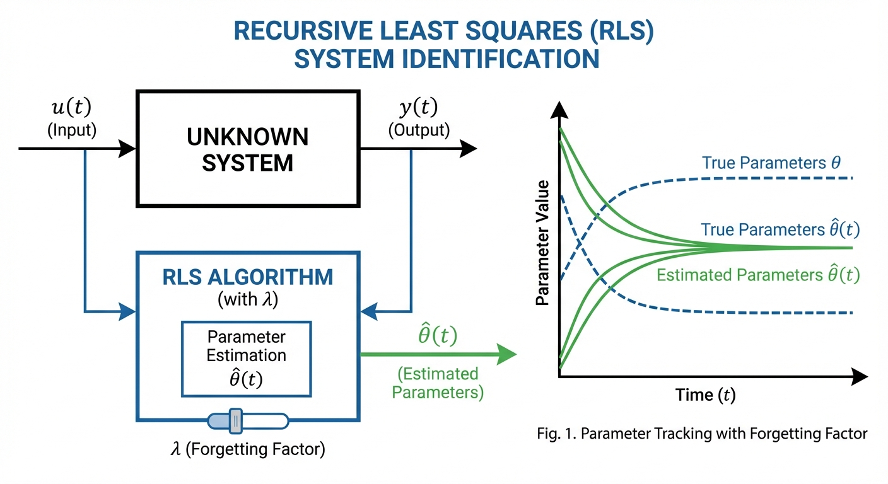
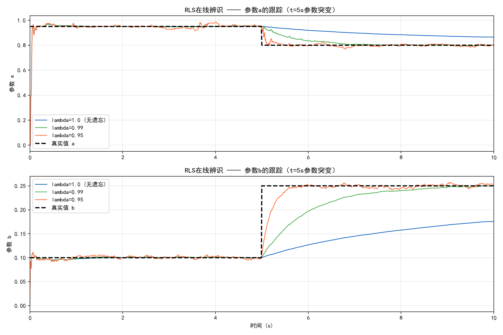

# 第 1 章：系统辨识理论基础 —— 从黑盒到白盒的探秘

## 学习目标

- 深入理解参数辨识在新能源发电与并网系统中的必要性，掌握电气设备模型漂移与老化现象的深层物理机理。
- 熟练掌握递推最小二乘法（RLS）的核心理论，能够独立完成从批量法到矩阵逆引理，再到带有遗忘因子递推更新公式的完整数学推导。
- 了解极大似然估计（MLE）与扩展卡尔曼滤波（EKF）、无迹卡尔曼滤波（UKF）在处理复杂非线性系统与强耦合参数辨识中的基本原理及应用场景。
- 熟悉系统辨识技术在国际与国家新能源测试标准（如IEC 61400系列、GB/T 19963）中的规范化应用与模型验证评价体系。
- 掌握工程应用中的标准测试流程，并通过典型的电网阻抗在线辨识案例，建立从理论算法到实际工程落地的完整闭环思维。

## 1.1 为什么需要参数辨识：模型漂移与老化机理

现代新能源系统（包括风力发电、光伏发电、储能系统及其并网逆变器）的控制架构高度依赖于被控对象的精确数学模型。无论是经典的比例积分（PI）解耦控制，还是先进的模型预测控制（MPC）与滑模控制（SMC），其控制法则的设计与参数整定均建立在一组核心物理参数的基础之上。例如，永磁同步电机（PMSM）的定子电阻与交直轴电感、风力机的气动功率系数、光伏组件的等效串并联电阻以及并网滤波器的阻抗参数等。

然而，在实际运行的恶劣工况与长周期生命周期内，这些被视为"常数"的物理参数并非一成不变，而是会随着环境条件、运行状态以及设备老化发生显著的时变衰减或突变。这种物理特性与控制器内部名义模型之间产生的持续偏差，在工程界被称为"模型漂移"（Model Drift）。

模型漂移的物理机理通常可归纳为以下几个维度：

1. **热效应与温度漂移**：电机的定子绕组电阻会随运行温度的升高而呈线性增大，温度每升高10°C，铜导线的电阻率约增加4%。在满载运行的数百摄氏度温升下，电阻变化率可达30%以上。同样，光伏电池的开路电压与最大功率点也会随组件温度的剧烈波动而发生显著偏移。
2. **磁路饱和与交叉耦合效应**：在风电机组或电动汽车的驱动电机中，为追求高转矩密度，电机通常运行在磁路深度饱和区。大电流注入不仅会导致交轴和直轴电感发生严重的非线性衰减，还会引发强烈的交直轴交叉耦合现象，使得传统的常参数线性模型完全失效。
3. **材料疲劳与物理老化**：永磁体在高温及剧烈退磁电流冲击下，会发生不可逆的磁链衰减；风力机叶片在长期运行后，表面结冰、积灰或前缘气蚀会导致空气动力学特性急剧恶化；电解电容的等效串联电阻（ESR）会随电解液干涸而呈指数级上升。
4. **外部环境的动态演变**：对于并网逆变器而言，电网的短路容量和等效阻抗会随着电网拓扑结构的切换、其他分布式电源的投退而发生剧烈波动（即弱电网特性的时变性），这对锁相环（PLL）与电流环的稳定性构成了严重威胁。

当控制器所依赖的模型参数与实际物理系统产生偏差时，控制性能将显著恶化。轻则导致动态响应变慢、稳态误差增加、能量转换效率降低；重则引发控制系统极点向右半平面漂移，诱发系统级振荡（如次同步谐振 SSO）甚至脱网事故。

为应对这一挑战，参数辨识技术应运而生。其核心目标是在系统运行过程中，通过实时采集输入指令与输出响应的观测数据，利用数学算法在线估计并动态更新这些漂移的参数，使得控制器的内部模型始终与物理被控对象保持高度一致。这本质上是一个反推系统内部状态的"逆向工程"。

根据对系统先验物理知识的掌握程度，辨识方法通常被划分为三大流派：

- **白盒模型（White-box）**：完全基于机理方程构建，所有参数的物理意义明确。其缺点是过于理想化，难以涵盖所有复杂的寄生效应和不可预测的非线性衰减。
- **黑盒模型（Black-box）**：如人工神经网络（ANN）、NARX模型等，完全由数据驱动，不依赖任何物理先验。其拟合能力强，但缺乏物理可解释性，且在未遍历的工况下容易发生不可预测的震荡，这在对可靠性要求高的新能源并网标准中是难以被接受的。
- **灰盒模型（Gray-box）**：融合了机理建模与数据驱动的优势。物理方程确定了模型的骨架结构（确保了系统的全局稳定性与物理一致性），而其中的未知或时变参数则通过在线数据进行实时拟合校正。在新能源工程实践中，由于系统拓扑和电路微分方程通常是已知的，**灰盒辨识成为了最核心、最实用、应用最广泛的主流技术路线**。

## 1.2 递推最小二乘法（RLS）的理论与完整推导

在众多灰盒辨识算法中，最小二乘法（Least Squares, LS）因其数学结构清晰、无偏估计特性优良而成为基础中的基础。然而，传统的批量最小二乘法无法直接应用于控制器的在线运行，由此衍生出的递推最小二乘法（Recursive Least Squares, RLS）则彻底解决了工程落地的计算瓶颈。

### 1.2.1 批量最小二乘的局限性

考虑一个典型的多输入单输出（MISO）线性离散时间系统，其观测方程可表示为：

$$
y(k) = \boldsymbol{\varphi}^T(k) \boldsymbol{\theta} + e(k) \tag{1.1}
$$

其中：
- $y(k)$ 为系统在 $k$ 时刻的实际输出观测值。
- $\boldsymbol{\varphi}(k) = [\varphi_1(k), \varphi_2(k), \dots, \varphi_n(k)]^T$ 为回归向量，由系统历史的输入输出数据及已知状态构成。
- $\boldsymbol{\theta} = [\theta_1, \theta_2, \dots, \theta_n]^T$ 为包含待辨识物理参数的未知参数向量。
- $e(k)$ 为包含测量噪声与建模误差的白噪声序列。

批量最小二乘的目标是寻找一组参数估计值 $\hat{\boldsymbol{\theta}}$，使得在所有历史时刻 $i = 1, 2, \dots, k$ 上，模型输出预测值与实际观测值之间的误差平方和达到最小。定义目标代价函数为：

$$
J(\boldsymbol{\theta}) = \frac{1}{2} \sum_{i=1}^k \left[ y(i) - \boldsymbol{\varphi}^T(i)\boldsymbol{\theta} \right]^2
$$

为求极值，令代价函数对参数向量的梯度为零：$\frac{\partial J}{\partial \boldsymbol{\theta}} = \mathbf{0}$，可推导出著名的**法方程（Normal Equation）**：

$$
\left[ \sum_{i=1}^k \boldsymbol{\varphi}(i)\boldsymbol{\varphi}^T(i) \right] \hat{\boldsymbol{\theta}}(k) = \sum_{i=1}^k \boldsymbol{\varphi}(i)y(i) \tag{1.2}
$$

令信息矩阵 $\boldsymbol{H}(k) = \sum_{i=1}^k \boldsymbol{\varphi}(i)\boldsymbol{\varphi}^T(i)$，则参数的最优估计值为 $\hat{\boldsymbol{\theta}}(k) = \boldsymbol{H}^{-1}(k) \sum_{i=1}^k \boldsymbol{\varphi}(i)y(i)$。在实际微控制器（如DSP或FPGA）中，每增加一个采样点，批量法都需要重新累加所有的历史数据，并对高维信息矩阵进行求逆运算。这不仅会导致内存随时间无限增长，其 $O(n^3)$ 的求逆计算复杂度也无法满足几十微秒级的高频实时控制需求。

### 1.2.2 矩阵逆引理与RLS完整递推推导

为了将庞大的批量计算转化为微控制器友好的逐点递推形式，我们引入线性代数中的**矩阵逆引理（Woodbury Matrix Identity）**。引理指出，对于任意非奇异矩阵 $A$ 和 $C$，以及适配维度的矩阵 $B$ 和 $D$，满足：

$$
(A + BCD)^{-1} = A^{-1} - A^{-1}B(C^{-1} + DA^{-1}B)^{-1}DA^{-1} \tag{1.3}
$$

**步骤 1：信息矩阵的递推化**

首先，定义协方差矩阵为信息矩阵的逆，即 $\boldsymbol{P}(k) = \boldsymbol{H}^{-1}(k)$。显然，信息矩阵可以写成前后时刻的递推形式：

$$
\boldsymbol{P}^{-1}(k) = \boldsymbol{P}^{-1}(k-1) + \boldsymbol{\varphi}(k)\boldsymbol{\varphi}^T(k) \tag{1.4}
$$

**步骤 2：应用矩阵逆引理求解 P(k)**

对照引理公式 (1.3)，令：$A = \boldsymbol{P}^{-1}(k-1)$， $B = \boldsymbol{\varphi}(k)$， $C = 1$ (标量)， $D = \boldsymbol{\varphi}^T(k)$。代入引理可得：

$$
\boldsymbol{P}(k) = \boldsymbol{P}(k-1) - \frac{\boldsymbol{P}(k-1)\boldsymbol{\varphi}(k)\boldsymbol{\varphi}^T(k)\boldsymbol{P}(k-1)}{1 + \boldsymbol{\varphi}^T(k)\boldsymbol{P}(k-1)\boldsymbol{\varphi}(k)} \tag{1.5}
$$

为简化书写，定义**增益矩阵（或称卡尔曼增益）** $\boldsymbol{K}(k)$ 为：

$$
\boldsymbol{K}(k) = \frac{\boldsymbol{P}(k-1)\boldsymbol{\varphi}(k)}{1 + \boldsymbol{\varphi}^T(k)\boldsymbol{P}(k-1)\boldsymbol{\varphi}(k)} \tag{1.6}
$$

此时，协方差矩阵的更新公式即可化简为：

$$
\boldsymbol{P}(k) = \left[ \boldsymbol{I} - \boldsymbol{K}(k)\boldsymbol{\varphi}^T(k) \right] \boldsymbol{P}(k-1) \tag{1.7}
$$

需要注意的是，公式 (1.6) 中的分母 $1 + \boldsymbol{\varphi}^T(k)\boldsymbol{P}(k-1)\boldsymbol{\varphi}(k)$ 是一个标量。这意味着我们通过数学变换，彻底消除了高维矩阵求逆的过程，将其替换为简单的标量除法。

**步骤 3：参数向量估计值的递推更新**

根据法方程求得的解，第 $k$ 时刻的估计值可拆分为前 $k-1$ 时刻的累加项与当前时刻的新增项：

$$
\hat{\boldsymbol{\theta}}(k) = \boldsymbol{P}(k) \left[ \sum_{i=1}^{k-1} \boldsymbol{\varphi}(i)y(i) + \boldsymbol{\varphi}(k)y(k) \right]
$$

注意到 $\sum_{i=1}^{k-1} \boldsymbol{\varphi}(i)y(i) = \boldsymbol{P}^{-1}(k-1)\hat{\boldsymbol{\theta}}(k-1)$，将其代入上式并利用公式 (1.4) 中 $\boldsymbol{P}^{-1}(k-1) = \boldsymbol{P}^{-1}(k) - \boldsymbol{\varphi}(k)\boldsymbol{\varphi}^T(k)$ 进行替换展开：

$$
\begin{aligned}
\hat{\boldsymbol{\theta}}(k) &= \hat{\boldsymbol{\theta}}(k-1) + \boldsymbol{P}(k)\boldsymbol{\varphi}(k) \left[ y(k) - \boldsymbol{\varphi}^T(k)\hat{\boldsymbol{\theta}}(k-1) \right]
\end{aligned} \tag{1.8}
$$

结合 $\boldsymbol{K}(k)$ 的定义，参数更新方程最终定型为：

$$
\hat{\boldsymbol{\theta}}(k) = \hat{\boldsymbol{\theta}}(k-1) + \boldsymbol{K}(k)\left[ y(k) - \hat{y}(k) \right] \tag{1.9}
$$

其中 $\hat{y}(k) = \boldsymbol{\varphi}^T(k)\hat{\boldsymbol{\theta}}(k-1)$ 为基于上一时刻参数模型对当前输出的先验预测。公式 (1.9) 展现了反馈校正的绝妙美感：**新参数 = 旧参数 + 增益矩阵 × 预测误差**。

### 1.2.3 遗忘因子的引入：对抗数据饱和

上述标准 RLS 算法存在一个致命缺陷：随着时间推移，信息矩阵不断累加，协方差矩阵 $\boldsymbol{P}(k)$ 的元素会逐渐趋近于零（即增益矩阵 $\boldsymbol{K}(k) \to 0$）。此时算法发生了"数据饱和"，即便物理参数发生剧烈漂移产生巨大的预测误差，算法也失去了更新修正的能力，沦为"死锁"状态。

为解决时变参数跟踪问题，我们在目标代价函数中引入一个按指数衰减的**遗忘因子（Forgetting Factor）** $\lambda \in (0, 1]$：

$$
J(\boldsymbol{\theta}) = \frac{1}{2} \sum_{i=1}^k \lambda^{k-i} \left[ y(i) - \boldsymbol{\varphi}^T(i)\boldsymbol{\theta} \right]^2 \tag{1.10}
$$

由于 $k$ 时刻的最新数据权重为 $\lambda^0 = 1$，而 $k-n$ 时刻的老旧数据权重衰减为 $\lambda^n$。当 $\lambda < 1$ 时，系统等于自动"遗忘"了久远的过去，始终保持对新动态的敏感度。

按照前述相同的推导逻辑，带遗忘因子的递推信息矩阵变为 $\boldsymbol{P}^{-1}(k) = \lambda \boldsymbol{P}^{-1}(k-1) + \boldsymbol{\varphi}(k)\boldsymbol{\varphi}^T(k)$。再次应用矩阵逆引理，我们最终得到工程中广泛使用的**带遗忘因子递推最小二乘法（FF-RLS）标准计算框架**：

$$
\boldsymbol{K}(k) = \frac{\boldsymbol{P}(k-1)\boldsymbol{\varphi}(k)}{\lambda + \boldsymbol{\varphi}^T(k)\boldsymbol{P}(k-1)\boldsymbol{\varphi}(k)} \tag{1.11}
$$

$$
\hat{\boldsymbol{\theta}}(k) = \hat{\boldsymbol{\theta}}(k-1) + \boldsymbol{K}(k)\left[y(k) - \boldsymbol{\varphi}^T(k)\hat{\boldsymbol{\theta}}(k-1)\right] \tag{1.12}
$$

$$
\boldsymbol{P}(k) = \frac{1}{\lambda}\left[\boldsymbol{P}(k-1) - \boldsymbol{K}(k)\boldsymbol{\varphi}^T(k)\boldsymbol{P}(k-1)\right] \tag{1.13}
$$

遗忘因子 $\lambda$ 构成了一对经典的偏差-方差折衷：较小的 $\lambda$ 赋予新数据高权重，跟踪突变速度快，但会对测量噪声敏感，造成稳态估计值剧烈波动；反之，较大的 $\lambda$ 能够有效平滑噪声，但对参数突变的响应显得迟钝。

## 1.3 极大似然估计与非线性滤波理论

尽管 RLS 在处理线性参数化模型时表现卓越，但新能源系统中充斥着不可忽略的强非线性环节（如半导体开关管的死区效应、磁路饱和曲线等）。面对非线性系统或噪声概率分布已知的情况，统计学领域的辨识理论展现出了不可替代的优势。

### 1.3.1 极大似然估计（MLE）

极大似然估计的核心思想是：在所有可能的参数组合中，寻找最有可能产生当前观测数据序列的那一组参数。假设系统噪声服从某种已知概率密度函数（通常为高斯分布），我们可以构建联合概率密度函数，即似然函数 $L(\boldsymbol{\theta})$。通过对其取对数并求导寻优，即可得到参数估计值。MLE 能够提供渐进无偏且方差达到克拉美-罗下界（Cramer-Rao Lower Bound, CRLB）的最佳统计学估计。但在实时工程中，求解复杂的非凸似然函数容易陷入局部最优，且计算开销巨大，因此多用于离线数据后处理与模型校准。

### 1.3.2 扩展卡尔曼滤波（EKF）联合估计

为了在线处理非线性系统，扩展卡尔曼滤波（EKF）提供了一种优雅的降维方案。在状态空间模型中，EKF 将待辨识的静止参数 $\boldsymbol{\theta}$ 视为导数为零的虚拟状态变量，与原有的动态状态 $\boldsymbol{x}$ 合并，构造出高维的扩维状态向量 $\boldsymbol{X}_a = [\boldsymbol{x}^T, \boldsymbol{\theta}^T]^T$。此时，原本线性的参数识别问题转化为非线性的状态观测问题。EKF 在每个采样周期通过对非线性状态转移方程和观测方程进行泰勒级数展开，保留一阶导数（即计算雅可比矩阵），实现局部线性化。随后，标准的卡尔曼预测-校正递推框架即可运作。在永磁同步电机无位置传感器控制中，利用 EKF 同步估算转子位置（状态）与定子电阻（参数）已被大量高端驱动器采用。

### 1.3.3 无迹卡尔曼滤波（UKF）

当系统的非线性程度较深（例如存在饱和硬非线性或风力机的复杂二维气动查表曲线）时，EKF 忽略高阶泰勒项所带来的截断误差可能导致滤波器发散。无迹卡尔曼滤波（UKF）创新性地摒弃了求导计算，转而采用确定性采样策略，在当前概率分布的均值附近对称地选取少量的 Sigma 点。让这些真实的离散点直接穿透原始的非线性函数，再重新组合重构后验概率的高斯分布。UKF 不仅避免了繁琐的雅可比矩阵求解，且其对均值和协方差的逼近精度可以达到泰勒展开的三阶水平，是现代复杂新能源机理模型在线辨识的有力工具。

## 1.4 测试标准中的系统辨识应用

在新能源并网的宏大图景中，系统辨识技术不仅停留在学术论文与微控制器代码中，它已被全面固化进国际电工委员会（IEC）与国家强制性测试标准（GB/T）的合规性检验流程中。

### 1.4.1 IEC 61400 系列标准中的模型验证

在风力发电领域，IEC 61400-27-1对风电机组的电气仿真模型提出了严苛的验证要求。标准明确规定，设备制造商提供的"通用仿真模型"必须经过基于现场实测数据的验证（Model Validation）。测试机构会在实地对风电机组施加各种电网扰动（如电压跌落、频率阶跃），随后通过"回放（Playback）"技术，将实测的电网电压幅值与频率输入到机组的数字仿真模型中。此时，必须利用最优化算法（本质上即多维参数辨识技术）对模型内部的控制器增益与限制环节参数进行迭代微调，使得模型输出的视在功率、有功功率与无功功率响应曲线与实测数据高度贴合。标准明确规定了平均绝对误差（MAE）和稳态偏差的允许容限。

### 1.4.2 GB/T 19963 系列接入标准的要求

在《GB/T 19963-2021 风电场接入电力系统技术规定》中，要求新能源场站必须向电网调度部门提供准确的动态机电暂态与电磁暂态模型。特别是在进行低电压穿越（LVRT）与高电压穿越（HVRT）特性评价时，传统的基于铭牌参数的白盒建模往往由于忽略了锁相环的动态延时与限幅器的非线性，导致仿真与实际波形在故障恢复期间出现巨大分歧。工程实践中，测试单位通常会获取现场跌落测试的暂态录波数据，采用灰盒辨识策略，利用粒子群算法（PSO）、遗传算法（GA）或先进的离线系统辨识工具箱，反向辨识出实际控制软件中不便公开的黑盒控制参数。

## 1.5 工程案例与测试流程：电网阻抗在线辨识

为了将理论具象化，我们梳理新能源系统参数辨识的通用标准测试流程，并结合光伏逆变器的实际痛点进行剖析。

**通用系统辨识测试流程通常包含五个核心节点：**

1. **激励信号设计与注入**：为确保信息矩阵满秩（即满足持续激励条件 Persistent Excitation），必须在稳态系统中注入具有足够频谱宽度的激励信号。常用的信号包括伪随机二进制序列（PRBS）、多频正弦波（Multisine）或在控制指令上叠加微小阶跃扰动。
2. **高速数据采集与滤波**：在靠近待辨识节点的硬件处配置高精度传感器。为防止频谱混叠，采样频率需满足奈奎斯特准则，并通过硬件抗混叠滤波器与软件零相位滤波器剔除高频开关谐波与低频直流偏置。
3. **模型结构映射**：依据被控对象，将其转化为便于辨识的标准形式（如自回归滑动平均模型 ARMAX 或输出误差模型 OE），提取回归向量 $\boldsymbol{\varphi}(k)$。
4. **在线算法执行**：在 DSP 的后台低优先级中断中，周期性调用 RLS 或 EKF 算法，监控参数的收敛轨迹。
5. **模型验证与闭环部署**：验证残差序列 $e(k)$ 是否为不相关的白噪声。确认参数收敛后，将最新参数投递给控制器计算核心，实时更新 PI 增益或前馈解耦补偿量。

**典型工程案例：弱电网下的光伏逆变器阻抗辨识**

随着大规模光伏接入偏远地区，电网呈现出典型的弱电网特征（高且时变的短路阻抗）。如果逆变器的电流环 PI 参数按照刚性强电网设计，遇到巨大的电网电感 $L_g$ 时，系统带宽将被大幅压缩甚至切入右半平面，引发高频谐振脱网事故。解决方案：在并网逆变器运行中，通过软件在交轴电流指令中叠加微小的 75Hz 与 125Hz 非特征次间谐波电流（激励信号）。逆变器端口的并网点（PCC）电压中会立刻感应出对应的间谐波电压。控制软件提取这部分电压电流数据，直接构建一阶电感-电阻（RL）差分方程的回归向量。利用带遗忘因子的 RLS 算法，逆变器可以在 100 毫秒内准确辨识出当前电网的等效电阻 $R_g$ 与电感 $L_g$。随后，逆变器主控芯片利用辨识结果，自适应重构电流环的比例积分增益以及锁相环的带宽，从而在任何未知的电网拓扑下实现稳定的功率送出。

## 1.6 代码实现要点

仿真脚本 `assets/ch01/ch01_rls_forgetting.py` 实现了带遗忘因子RLS的完整流程。其代码结构中值得关注的工程细节包括：

1. **回归向量构造**：核心回归向量写成列向量 $\boldsymbol{\varphi} = [y(k-1), u(k-1)]^T$，参数向量为二维 $\boldsymbol{\theta} = [a, b]^T$。增益计算严格按照矩阵形式 $\boldsymbol{K} = \boldsymbol{P}\boldsymbol{\varphi}/(\lambda + \boldsymbol{\varphi}^T\boldsymbol{P}\boldsymbol{\varphi})$，分母为标量，分子为 $2 \times 1$ 向量。
2. **协方差对称化处理**：理论上 $\boldsymbol{P}$ 应保持对称正定，但浮点计算和递推误差会引入非对称项。代码每步执行 $\boldsymbol{P} = (\boldsymbol{P} + \boldsymbol{P}^T)/2$，将数值误差投影回对称矩阵空间，减少长期迭代后的漂移和异常增益。
3. **PRBS激励信号**：输入 $u$ 由 $\pm 1$ 随机切换生成，属于伪随机二值激励。它的价值在于持续激发系统各阶动态，让回归向量在时间上保持足够变化，避免信息矩阵退化。若输入过于平缓或近常值，参数 $a, b$ 之间将不可分或病态，RLS即使公式正确也会出现慢收敛甚至误收敛。

## 1.7 仿真案例：RLS遗忘因子对比实验

### 案例描述

本案例旨在通过数值仿真，深入考察一阶离散系统 $y(k) = a \cdot y(k-1) + b \cdot u(k-1) + e(k)$ 在遭遇参数突变场景下，RLS 算法对时变特性的捕捉能力。设定系统参数在 $t = 5$ s 时刻，由初始状态 $(a, b) = (0.95, 0.10)$ 瞬间突变为 $(a, b) = (0.80, 0.25)$。激励输入选用 PRBS 信号，系统测量过程叠加有标准差为 0.02 的高斯白噪声，采样间隔设定为 0.01 s。

仿真脚本：`assets/ch01/ch01_rls_forgetting.py`

### 仿真结果

**RLS参数辨识性能对比（突变后稳态，$t = 8\sim10$ s）：**

| 遗忘因子 | 参数a稳态估计 | a相对误差 | 参数b稳态估计 | b相对误差 | 突变后收敛时间(a) |
|:--------:|:----------:|:--------:|:----------:|:--------:|:---------------:|
| $\lambda = 1.0$ (无遗忘) | 0.8730 | 9.13% | 0.1677 | 32.91% | 未收敛 |
| $\lambda = 0.99$ | 0.8010 | 0.12% | 0.2460 | 1.58% | 0.900 s |
| $\lambda = 0.95$ | 0.7995 | 0.06% | 0.2504 | 0.15% | 0.070 s |

### 结果深度分析

仿真结果直观地揭示了遗忘因子 $\lambda$ 在算法跟踪机制中的核心枢纽作用。

当设置 $\lambda = 1.0$（即标准批量等效的无遗忘机制）时，算法在面临 $t=5$ s 的突变后表现出近乎瘫痪的迟钝。至仿真结束时，参数 $a$ 的估计误差高达 9.13%，参数 $b$ 的误差严重偏离真值达 32.91%。从算法机理上剖析，这是因为在前 5 秒累积了 500 个采样点的巨大数据权重，使得协方差矩阵 $\boldsymbol{P}(k)$ 已经衰减得微小（算法陷入数据饱和）。突变产生的新生误差信息在乘以此微小增益后，完全无法驱动参数向新真值发生有效位移。

引入 $\lambda = 0.99$ 后，系统展现出了优秀的自愈能力，在约 0.9 秒内完成了重构收敛，各项误差均被压缩至工程可接受的 2% 以内。若进一步采用较为激进的 $\lambda = 0.95$，参数收敛时间被压缩至 0.07 秒，跟踪动态近乎贴合物理真值的跳变。

然而，图表背后隐藏着工程应用中必须警惕的**协方差矩阵积分饱和（Covariance Wind-up）问题**。当系统中暂时缺乏持续的 PRBS 激励（即输入进入长时间的恒定直流稳态）且 $\lambda < 1$ 时，根据公式 (1.13)，除以一个小于 1 的标量会使协方差矩阵 $\boldsymbol{P}$ 的迹呈指数级膨胀。此时算法对噪声变得高度过敏，微小的测量噪声也会导致估计参数发生剧烈震荡。因此，在工业级代码实现中，通常需要配合**变遗忘因子机制**、**协方差迹重置**或**死区修正技术（Dead-zone Modification）**来规避这一数值计算陷阱。

## 1.8 本章小结

本章作为整部教材的理论基石，系统性地回答了新能源系统中"为什么需要辨识"与"如何进行辨识"的两大核心疑问。从被控对象老化演变的物理机理出发，我们深入剖析了模型漂移对控制系统造成的深远破坏。数学层面，我们不仅完成了 RLS 算法由批量法向带遗忘因子递推形式的完整重构推导，还纵向拓展了 MLE 与卡尔曼滤波在应对非线性挑战中的理论边界。同时，通过融合国际测试标准规范与具体的光伏工程应用案例，将抽象的矩阵运算彻底落实为解决实际工程痛点的落地工具。

**拓展视野**：RLS 递推辨识方法在水力系统中有直接应用。渠道的传递函数参数（延迟时间、积分常数）会随水位和流量工况变化，在线辨识是自适应控制的前提。本章的辨识理论为跨领域的模型自动校准奠定了方法基础。

## 1.9 思考与练习

1. 在推导带有遗忘因子的 RLS 算法时，为什么在软件初始化阶段，协方差矩阵的初值 $\boldsymbol{P}(0)$ 通常必须被设为一个对角线元素较大的常数矩阵（如 $\alpha \boldsymbol{I}, \alpha = 10^4$）？如果初值设置得过小，从算法推导公式的角度分析，会对辨识初期的收敛过程产生什么实质性阻碍？

2. 结合前文对 IEC 61400 或 GB/T 19963 系列标准的论述，阐明在进行大型风电机组低电压穿越（LVRT）模型认证评估时，基于数据的系统辨识技术是如何替代传统铭牌参数计算，进而大幅提升暂态仿真轨迹与实测波形之间吻合度的？

3. 在实际的新能源并网逆变器弱电网适应性控制中，如果采用固定常数遗忘因子（如 $\lambda = 0.98$）的 RLS 算法来在线辨识电网阻抗，当电网负荷稳定且系统长时间缺乏足够的输入激励信号时，协方差矩阵 $\boldsymbol{P}(k)$ 会暴露出什么致命的数值计算问题？在工业级代码中应当如何设计保护逻辑进行规避？

4. 系统辨识存在白盒、灰盒与黑盒三大体系。请剖析这三种模型架构在新能源关键电气参数（如电池内阻、电机电感）估计中的优缺点。为何主流工程界对数据驱动的深度学习黑盒模型抱有戒心，而倾向于采用灰盒辨识策略进行控制器的闭环设计？

## 参考文献

[1] Ljung, L. (1999). *System Identification: Theory for the User* (2nd ed.). Prentice Hall.

[2] Haykin, S. (2002). *Adaptive Filter Theory* (4th ed.). Prentice Hall.

[3] Isermann, R., & Munchhof, M. (2011). *Identification of Dynamic Systems: An Introduction with Applications*. Springer.
