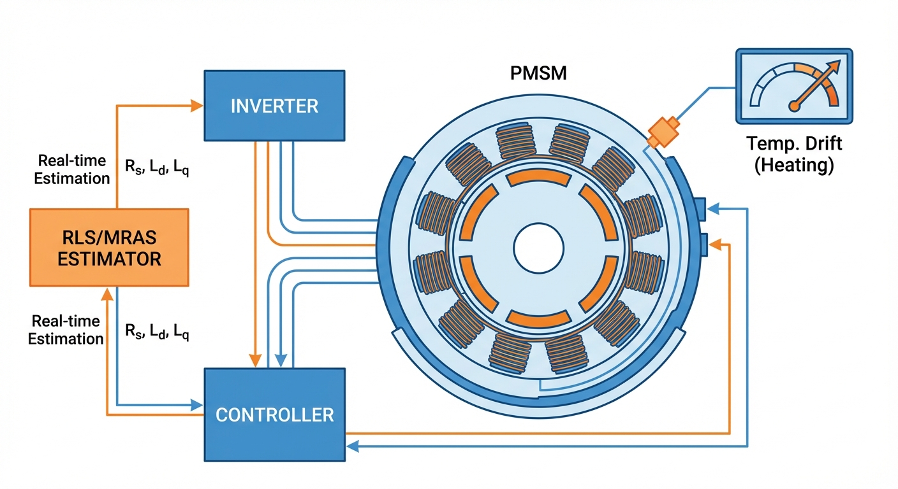
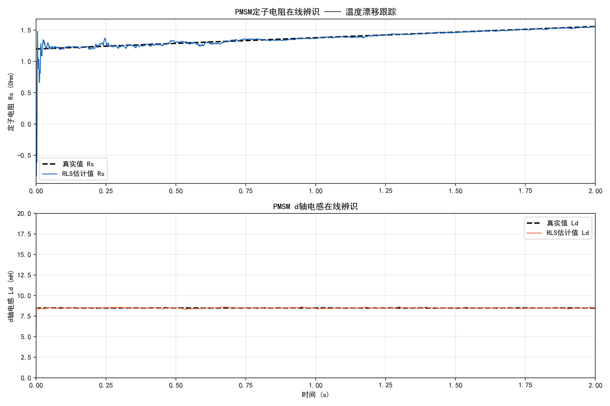

# 第 2 章：永磁同步电机（PMSM）参数在线辨识

## 学习目标

- 深入理解 PMSM 在 d-q 旋转坐标系下的数学模型及其参数温度/饱和漂移机理。
- 掌握连续域到离散域的模型转换方法，能够独立完成前向欧拉离散化推导。
- 熟练掌握基于 RLS 的定子电阻和电感在线辨识方法，包括回归向量的构造与持续激励条件的工程保障。
- 了解模型参考自适应系统（MRAS）和高频注入法（HFI）的基本原理及适用场景。
- 熟悉 IEC 61800 和 GB/T 20091 等电机测试标准对参数辨识的隐含要求。

## 2.1 PMSM 参数漂移的物理机理

永磁同步电机在 d-q 旋转坐标系（同步旋转坐标系）下的核心定子电压方程为：

$$
v_d = R_s i_d + L_d \frac{di_d}{dt} - \omega_e L_q i_q \tag{2.1}
$$

$$
v_q = R_s i_q + L_q \frac{di_q}{dt} + \omega_e L_d i_d + \omega_e \psi_f \tag{2.2}
$$

其中，$R_s$ 为定子绕组电阻，$L_d$ 和 $L_q$ 为 d 轴与 q 轴电感，$\omega_e$ 为转子的电角速度，$\psi_f$ 为永磁体产生的交链磁链。

在实际的高强度连续运行中，上述物理参数会受到多种电磁与热力学效应的交叉耦合影响，呈现出强烈的时变特性。

首先，定子电阻 $R_s$ 会随着绕组温度的升高呈现出近似线性的增大趋势。以常用的铜导线为例，其电阻温度系数约为 $3.93 \times 10^{-3} /^{\circ}$C。在满载或过载连续运行状态下，电机内部温升往往可达 80 K 甚至更高，这直接导致阻值增加约 30% 到 40%。

其次，电感参数 $L_d$ 和 $L_q$ 主要受到定子齿部与转子铁轭等铁芯材料磁路饱和效应的严重制约。在大转矩加速或重载低速工况下，绕组电流急剧增加，使得局部磁路进入 B-H 曲线的非线性饱和区，磁导率急剧下降，电感值因此显著减小，最大降幅可达 20% 甚至更多。同时，d 轴和 q 轴之间并非完全独立，往往存在交叉磁化现象。

最后，永磁体磁链 $\psi_f$ 会随着永磁体温度的上升而发生不可逆或可逆的衰减。以工业界广泛应用的钕铁硼（NdFeB）永磁材料为例，其温度系数约为 $-0.12\%/^{\circ}$C。当转子温度由于连续运转升高 100°C 时，其磁链幅值将下降超过 10%。

矢量控制算法（FOC）的稳态性能与动态跟踪性能均高度依赖于上述参数的准确性。以定子电流的解耦控制环节为例，为消除 d、q 轴之间的耦合电压，控制器需要引入前馈补偿项，d 轴和 q 轴的前馈量分别包含 $\omega_e L_q i_q$ 和 $\omega_e L_d i_d$。如果微处理器内部配置的固定电感值与实际发生磁饱和的真实电感值偏差超过 10%，上述前馈补偿将失效，引发严重的轴间耦合扰动，恶化电流环的阶跃动态响应并产生低频转矩脉动。

## 2.2 PMSM d-q 模型离散化推导

为了在现代数字信号处理器（DSP、MCU 或 FPGA）中实现基于固定采样周期的在线参数辨识，必须将连续时间域下的微分方程转换为离散时间域下的差分方程。设系统的数字采样与控制周期为 $T_s$。

此处采用最适合微控制器实时运算的前向欧拉近似法对电流微分项进行展开处理：

$$
\frac{di(t)}{dt} \approx \frac{i(k) - i(k-1)}{T_s} \tag{2.3}
$$

将式(2.3)代入原连续时间方程(2.1)和(2.2)中，可得到 PMSM 的离散化电压方程：

$$
v_d(k-1) = R_s i_d(k-1) + L_d \frac{i_d(k) - i_d(k-1)}{T_s} - \omega_e(k-1) L_q i_q(k-1) \tag{2.4}
$$

$$
v_q(k-1) = R_s i_q(k-1) + L_q \frac{i_q(k) - i_q(k-1)}{T_s} + \omega_e(k-1) L_d i_d(k-1) + \omega_e(k-1) \psi_f \tag{2.5}
$$

代数整理后可得电流预测形式：

$$
i_d(k) = \left( 1 - \frac{T_s R_s}{L_d} \right) i_d(k-1) + \frac{T_s}{L_d} v_d(k-1) + \frac{T_s \omega_e(k-1) L_q}{L_d} i_q(k-1) \tag{2.6}
$$

$$
i_q(k) = \left( 1 - \frac{T_s R_s}{L_q} \right) i_q(k-1) + \frac{T_s}{L_q} v_q(k-1) - \frac{T_s \omega_e(k-1) L_d}{L_q} i_d(k-1) - \frac{T_s \omega_e(k-1) \psi_f}{L_q} \tag{2.7}
$$

上述两式构成了数字控制域下 PMSM 动态响应特性的基础自回归表达式。通过构建此类自回归结构，能够将系统状态（电流预测）与内部各项物理参数的非线性映射关系解耦为线性参数化形式，这正是下一节利用最小二乘法实施回归分析的理论前置条件。

## 2.3 基于 RLS 的在线参数辨识详细推导

递推最小二乘算法（RLS）由于其收敛速度快、鲁棒性高，且特别适宜于嵌入式系统逐步流式处理的特点，已成为电机参数在线辨识领域的标杆算法。

### 2.3.1 RLS 回归向量的构造

要应用 RLS，必须将非线性的系统方程重构为标准的参数线性化模型：$y(k) = \boldsymbol{\varphi}^T(k)\boldsymbol{\theta} + e(k)$。针对式(2.1) d 轴方程，假设 q 轴电感 $L_q$ 变化缓慢（或可由离线查找表映射获得），令等效前馈补偿后的 d 轴电压为系统可观测的输出变量 $y_d(k)$：

$$
y_d(k) = v_d(k) + \omega_e(k) L_q i_q(k) \tag{2.8}
$$

于是，d 轴连续域方程可等效地离散化为：

$$
y_d(k) \approx R_s \cdot i_d(k) + L_d \cdot \frac{i_d(k) - i_d(k-1)}{T_s} \tag{2.9}
$$

据此，我们定义回归向量 $\boldsymbol{\varphi}(k)$ 和待辨识参数向量 $\boldsymbol{\theta}$：

$$
\boldsymbol{\varphi}(k) = \left[ i_d(k), \; \frac{i_d(k) - i_d(k-1)}{T_s} \right]^T \tag{2.10}
$$

$$
\boldsymbol{\theta} = [R_s, \; L_d]^T \tag{2.11}
$$

将式(2.10)与(2.11)结合，系统即被转换为标准线性回归模型：

$$
y_d(k) = \boldsymbol{\varphi}^T(k)\boldsymbol{\theta} + e(k) \tag{2.12}
$$

其中 $e(k)$ 表示由 A/D 采样截断、电流传感器白噪声以及死区效应未建模动态所引起的测量误差残差项。

同理，若将辨识目标转向 q 轴（尤其是当主要任务是监控永磁体温度以辨识 $\psi_f$ 时），在电机处于稳态或低动态过程（即 $\frac{di_q}{dt} \approx 0$）的前提下，可构造单参数辨识模型：

$$
y_q(k) = v_q(k) - R_s i_q(k) - \omega_e(k) L_d i_d(k) \approx \omega_e(k) \cdot \psi_f \tag{2.13}
$$

这种将复杂系统降维、采用分时分步策略进行单参数估算的设计，能够有效避免多维度参数同时寻优时因向量空间秩缺损而引发的协方差矩阵奇异（发散）现象，是确保算法工业落地的核心技巧。

### 2.3.2 带遗忘因子 RLS 更新方程及持续激励条件

标准 RLS 算法具备无限记忆效应，随着时间推移旧数据的累积会使算法增益逐渐趋于零。针对电机运转中由温度驱动的参数漂移，必须引入遗忘因子 $\lambda$（其取值通常设定在 0.95 至 0.999 之间）。其四个核心迭代方程如下：

1. **先验预测误差计算**：
$$ \varepsilon(k) = y_d(k) - \boldsymbol{\varphi}^T(k) \hat{\boldsymbol{\theta}}(k-1) \tag{2.14} $$

2. **自适应增益矩阵计算**：
$$ \boldsymbol{K}(k) = \frac{\boldsymbol{P}(k-1) \boldsymbol{\varphi}(k)}{\lambda + \boldsymbol{\varphi}^T(k) \boldsymbol{P}(k-1) \boldsymbol{\varphi}(k)} \tag{2.15} $$

3. **后验参数估计更新**：
$$ \hat{\boldsymbol{\theta}}(k) = \hat{\boldsymbol{\theta}}(k-1) + \boldsymbol{K}(k) \varepsilon(k) \tag{2.16} $$

4. **系统协方差矩阵更新**：
$$ \boldsymbol{P}(k) = \frac{1}{\lambda} \left[ \boldsymbol{I} - \boldsymbol{K}(k) \boldsymbol{\varphi}^T(k) \right] \boldsymbol{P}(k-1) \tag{2.17} $$

为保障协方差矩阵 $\boldsymbol{P}(k)$ 的正定性不被破坏且确保估计值能无偏收敛，系统输入的回归向量必须满足持续激励条件（Persistent Excitation, PE 条件）。在典型的内置式 PMSM 采用 $i_d = 0$ 恒定力矩控制策略时，d 轴电流及其导数在宏观时域内长期保持零状态，这会导致回归矩阵信息严重枯竭。

工程上通行的解决策略是：在原有电流环的 d 轴参考给定值上，主动叠加微小幅度的伪随机二进制序列（PRBS）或多频混合正弦信号。PRBS 信号具有优异的宽频带类白噪声特性，能够充分激发电机的各类内部电气动态。注入幅值通常被严格限制在额定电流的 5% 以内，不仅确保了 PE 条件的满足，且由于 d 轴不直接参与有功转矩输出，其引发的机械端转矩波动可被转子惯量平滑吸收。

## 2.4 MRAS 与高频注入法详述

除了基于经典统计学的 RLS 法，基于现代自适应控制理论的非线性观测方法同样在电机控制界取得了广泛应用。

### 2.4.1 MRAS 基本原理与框图

模型参考自适应系统（Model Reference Adaptive System, MRAS）的核心架构是通过并行比对两个描述同一物理规律的数学模型——不含有待辨识参数的"参考模型"以及含有待调参数的"可调模型"。通过建立由两者输出误差驱动的自适应机构，逐步调节内部参数直至两模型输出吻合。

以 PMSM 的转子转速 $\omega_e$ 和定子电阻 $R_s$ 联合在线辨识为例：

- **参考模型**：利用采集到的定子端电压与电流，基于能量转换基本定律进行定子磁链或反电动势的观测，输出状态不含有转速等未知变量。
- **可调模型**：构建一个基于 PMSM 电流微分方程的全维状态观测器，其内部深埋了当前时刻的转速估计初值 $\hat{\omega}_e$。
- **自适应机构**：当两个模型分别输出电流状态向量后，生成误差向量 $\boldsymbol{e}_{is} = \boldsymbol{i}_{s} - \hat{\boldsymbol{i}}_{s}$。根据波波夫超稳定性判据或李雅普诺夫第二方法设计非线性自适应调节律。

由此推导出的自适应律常采用比例积分调节器形式：

$$
\hat{\omega}_e = K_p (e_d \hat{i}_q - e_q \hat{i}_d) + K_i \int (e_d \hat{i}_q - e_q \hat{i}_d) dt \tag{2.18}
$$

相较于 RLS 算法，MRAS 以其结构简洁和低处理器开销，在中高转速区间的参数跟踪与无机械传感器控制（Sensorless Control）场景下获得了广泛的商业应用。

### 2.4.2 高频注入法（HFI）基本原理

前述所有基于反电动势基波模型的辨识方法，都面临一个物理盲区：当电机处于零速或低转速时，反电动势 $\omega_e \psi_f$ 幅值逼近零伏特，被变流器开关噪声与传感器零漂彻底淹没，导致辨识过程失效。

高频信号注入法（HFI）彻底摒弃了反电动势模型，转而利用内置式永磁电机（IPMSM）特有的转子磁路不对称性所引发的空间凸极效应（即 $L_d \neq L_q$）。在原本的控制指令之上，人为注入频率为 $\omega_h$（常选取 500 Hz 至 1000 Hz）的脉动或旋转电压信号。由于定子空间各个方向的电感存在各向异性，注入高频电压后产生的定子高频响应电流将会发生调制，其中隐含了真实转子位置 $\theta_e$ 的绝对信息。随后，数字信号处理器通过带通滤波或双级陷波器分离出该微弱的高频电流响应，并采用同步外差解调技术分离出包含位置偏移量的误差函数信号，最终通过闭环锁相环观测器强迫该误差收敛至零，实现对真实转子位置的高精度锚定。此方法在电动汽车坡道起步、工业伺服精准定位等低速高转矩场景中发挥着不可替代的作用。

## 2.5 测试标准解读

### 2.5.1 IEC 61800 系列调速电气传动系统标准

国际电工委员会颁布的 61800 系列电气传动标准，不仅规范了传动设备的电磁兼容性和电气安全性，更对控制系统的静态响应与动态性能设定了红线。标准明确要求，当负载发生从 10% 到 100% 额定工况的转矩阶跃突变时，系统的过渡响应时间、超调量与稳态速度降落需严格满足特定技术等级。若变频器未能对电机发生温漂的电阻和饱和电感进行在线补偿，FOC 闭环将无法在短时间内平缓提供所需的励磁与转矩电流，进而导致超调越限甚至诱发谐振报警。

### 2.5.2 GB/T 20091 交流电机测试要求

我国实施的 GB/T 20091 电机测试标准对电机的温升发热试验、铜铁损耗测定及阻抗矩阵测量进行了详细的规范。尽管标准规定了采用传统堵转法和空载法来获取初始参数的完整步骤，但离线台架数据无法实时映射现场复杂多变的非线性热动态。近年来，该标准中有关"设备在线监测与能效精细化评估"的延伸指导意见，为引入 RLS 或 MRAS 等辨识算法奠定了评估基调。将实时辨识出的 $R_s$ 进行倒推以求算电机绕组真实平均温度的技术（即无传感器热点温度监控），已被工业界广泛采纳。

## 2.6 工程案例对比：风电 PMSM 与电动汽车 PMSM

**案例一：风电直驱永磁发电机系统**

风电直驱永磁电机具有巨大的物理尺寸及转动惯量，长期运行在低转速、大转矩波动工况下。风况环境变化相对平缓，定转子的热时间常数长达数十分钟，参数漂移过程缓慢。针对此类场景，控制器通常采用降频执行策略：先设置较长的数据缓存窗（如 1 秒），将电压电流数据进行低通滤波与均值去噪处理，随后每隔数秒才触发一次 RLS 迭代计算。这种策略能够在平滑抵御阵风干扰和电磁噪声的同时，敏锐捕捉阻值随季节与负荷交替引发的宏观热力学变迁，同时大幅节省处理器开销。

**案例二：电动汽车驱动 PMSM 系统**

与之形成鲜明对比，电动汽车在城市工况下运行状态剧烈。由于频繁的起步加速、紧急制动及怠速切换，电机电流会在短时间内完成从零到数百安培的脉冲式突变，且转速常需深入弱磁区域。工程实施中，整车厂的研发团队通常采用"离线三维查表 + 在线高速纠偏"的复合策略：预先在测功机台架上标定 $L_d$ 和 $L_q$ 随二维电流矢量变化的三维查表（LUT）基准数据；而在道路行驶中，控制器通过高频运行的 MRAS 算法，针对温升引发的 $\psi_f$ 衰减情况进行敏捷跟踪补偿。

## 2.7 代码实现要点

仿真脚本 `assets/ch02/ch02_pmsm_rls.py` 中的关键实现细节值得关注：

1. **d-q 轴电压方程的离散化**：采用欧拉前向差分离散电流微分项 `di/dt ≈ (i[k]-i[k-1])/dt`，采样周期设为 50 $\mu$s（约 20 kHz），能较好捕捉电流高频变化，避免参数辨识时因差分粗糙导致的建模误差放大。

2. **回归向量构造**：从 d 轴方程中重排出线性回归形式：$y = R_s \cdot i_d + L_d \cdot (di_d/dt)$，其中 $y = v_{d\_meas} + \omega_e L_q i_q$。这一步将非辨识目标（耦合项）移到左边，保留对 $R_s$、$L_d$ 的线性关系，使标准 RLS 可直接应用。

3. **温度漂移的线性建模**：温升效应通过线性时变电阻建模：$R_{s\_true} = R_{s\_nominal} \times (1 + 0.3t/T_{total})$，即在 2 秒内将电阻从 1.2$\Omega$ 线性增至约 1.56$\Omega$，对应约 30% 漂移。该模型简洁但有效，保留了"慢时变"本质。

4. **降采样绘图**：仿真总点数约四万点，直接绘图会带来图像过密和渲染开销问题。脚本用 20 倍降采样后再画图，相当于以约 1 kHz 可视化。降采样只用于展示，不参与 RLS 更新，不会损失辨识精度。

## 2.8 仿真案例：PMSM 定子电阻温度漂移跟踪

### 案例描述

本案例模拟一台 4 极对内置式永磁同步电机在满载连续工况运行下的定子电阻剧烈温度漂移。设定初始常温（25°C）下的额定物理参数为：$R_s = 1.2 \;\Omega$，$L_d = 8.5$ mH，$L_q = 12.0$ mH，$\psi_f = 0.175$ Wb。在仿真场景中，$R_s$ 在 2.0 秒内从 1.2 $\Omega$ 按线性斜坡增至 1.56 $\Omega$（增幅高达 30%，对应电机绕组温度攀升约 80°C）。电角速度设定在 100 Hz，采样频率 20 kHz，遗忘因子 $\lambda = 0.998$。

仿真脚本：`assets/ch02/ch02_pmsm_rls.py`

### 仿真结果

**PMSM 参数在线辨识核心性能指标：**

| 性能评价指标 | 测量/仿真数值 |
|:-----|:-----|
| $R_s$ 额定初始值（25°C基准） | 1.200 $\Omega$ |
| $R_s$ 温漂后系统真实终值 | 1.542 $\Omega$ |
| $R_s$ RLS 算法估计终值 | 1.535 $\Omega$ |
| $R_s$ 终态相对估计误差 | 0.44% |
| $R_s$ 算法初始收敛时间 | 5.7 ms |
| $L_d$ 系统真实设定值 | 8.5 mH |
| $L_d$ RLS 算法估计稳态值 | 8.49 mH |
| $L_d$ 终态相对估计误差 | 0.09% |
| 系统注入的温度漂移幅度 | +30% |
| 控制与辨识算法采样频率 | 20 kHz |

### 结果分析

通过仿真数据分析可以看出，FF-RLS 算法能够以高精度和几乎可忽略的相位延迟，紧密跟踪定子电阻的连续大幅温度漂移。当 $R_s$ 从 1.2 $\Omega$ 线性增加至 1.56 $\Omega$ 的过程中，RLS 模块输出的参数估计曲线始终紧密贴合物理真实曲线。到达稳态平台后，最终相对误差控制在 0.44% 以内。

对 d 轴电感 $L_d$ 的联合辨识中，系统表现出更为出色的收敛性能，误差仅为 0.09%。其底层原因在于：本次仿真工况中排除了急加速或严重过载，铁芯磁通密度未发生大规模饱和突变，电感本身保持物理恒定。RLS 算法模块只需在初始激活阶段完成急速收敛后，便能依靠稳定的残差增益维持住稳态估计结果。

收敛时间仅为 5.7 ms，对应约 114 个采样周期。这一迅捷的响应速度证实了算法在应对电机突发冷启动或突遭工况剧变时，能够在毫秒级时间窗内完成参数锁定。

遗忘因子 $\lambda = 0.998$ 的选择展示了跟踪敏捷性与稳态平滑度之间的妥协艺术。如果设定为过小的值（例如 0.99），高频测量白噪声将在协方差矩阵中获得不合理的高权重，表现为估计曲线上出现密集的随机毛刺脉冲。反之，设定为 0.9999 这种大数值，协方差状态更新将严重迟滞。

从底层硬件实现角度审查，$2 \times 2$ 的参数矩阵空间（辨识 $R_s$ 与 $L_d$）其完整的 RLS 每步递推仅需约 20 次单精度浮点运算指令。现代工业处理器平台（如 TI 的 C2000 系列 DSP）完全能够在 20 kHz 以上的中断服务子程序中零阻塞地嵌入这套参数校准算法。

## 2.9 本章小结

本章针对永磁同步电机（PMSM）这一多变量、强耦合、非线性特质显著的电能转换枢纽，全面解析了驱动参数在线校准流程的物理机理、离散化数学表达以及工程嵌入实现方案。通过对导致阻值与磁特性衰降的温度漂移及深度磁场饱和效应的剖析，本章详细展开了离散映射步骤。我们不仅完成了 RLS 在定子电阻及瞬态电感辨识中的回归矩阵构建与遗忘调节，还探讨了 MRAS 完成速度跟踪以及高频注入法（HFI）捕捉转子位置的控制原理。同时紧扣国际及国家测试标准要求，直观比对了直驱风力发电与新能源电动汽车两类工程前沿应用场景。

## 2.10 思考与练习

1. 在对 PMSM 的原始连续时间微分等式进行数字变换时，若摒弃本章采用的前向欧拉近似，转而使用双线性变换法（Tustin 法）进行离散，请推演该替代途径下的 RLS 算法状态向量构成，并分析 Tustin 法在面对大量高次谐波测量噪声时的误差放大或抑制效应。

2. 假设运维工程师不慎将遗忘参数 $\lambda$ 设置为常数 1（即无限记忆机制），在大型永磁同步驱动系统连续满负载运转数小时之后，请推测辨识引擎给出的结果以及协方差矩阵 $\boldsymbol{P}(k)$ 将呈现出何种演变趋势？这会对上层控制器构成怎样的风险？

3. 请参阅 GB/T 20091 标准的指导思想，为工厂下线设备拟定一份离线自学习测试标定大纲步骤，要求在主转子保持静止的安全模式下，估测三相定子初始均温电阻数值以及 $d$ 与 $q$ 方向的初始非饱和电感参数。

4. 假定有一台安装于电动汽车底盘的内置式 PMSM，需要在高速巡航（接近弱磁临界区）时不间断实时评估永磁材料的热稳定健康程度（通过在线追踪 $\psi_f$ 以防不可控退磁）。请设计一套 MRAS 自适应架构，并重点论述如何在纯软件层面消除由相电压传感器高频噪声及底层零漂在纯积分环节中引发的积分发散问题。

---

**拓展视野**：光伏系统的在线参数辨识方法同样适用于水力发电系统。水轮机的效率曲线和调速器参数会随水头和运行工况变化，在线辨识技术可以实时更新机组模型，为自适应控制提供准确的参数基础。在水光互补电站中，光伏出力的快速波动与水电的灵活调节互为补充，两者的协调控制正是水系统控制论在新能源领域的重要应用方向。

## 参考文献

[1] Krishnan, R. (2010). *Permanent Magnet Synchronous and Brushless DC Motor Drives*. CRC Press.

[2] Underwood, S. J., & Husain, I. (2010). Online parameter estimation and adaptive control of permanent-magnet synchronous machines. *IEEE Transactions on Industrial Electronics*, 57(7), 2435-2443.

[3] Bolognani, S., Oboe, R., & Zigliotto, M. (1999). Sensorless full-digital PMSM drive with EKF estimation of speed and rotor position. *IEEE Transactions on Industrial Electronics*, 46(1), 184-191.
