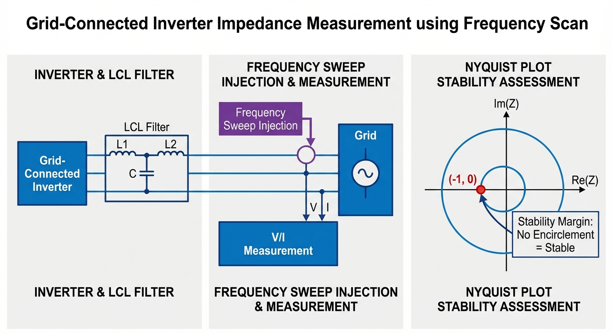
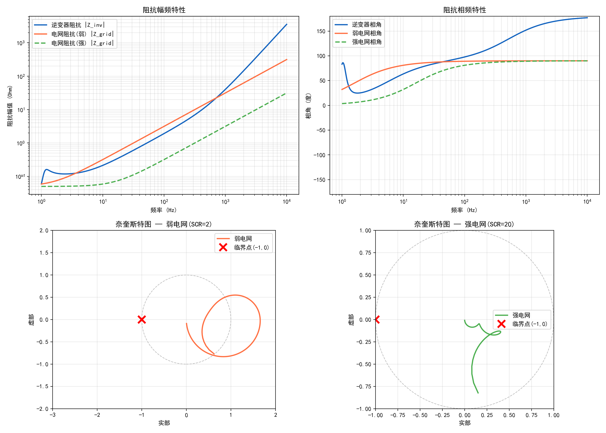

# 第 3 章：锁相环（PLL）与变流器阻抗辨识

## 学习目标

- 深入理解弱电网条件下并网逆变器的失稳机理，掌握短路比（SCR）的工程计算及其在系统稳定性评估中的物理含义。
- 掌握同步旋转坐标系（dq坐标系）下锁相环（PLL）的小信号建模方法，理解PLL引入的负阻尼效应。
- 掌握宽频阻抗扫描方法与广义奈奎斯特稳定判据（GNC）在多输入多输出（MIMO）并网系统稳定性分析中的应用。
- 掌握虚拟同步发电机（VSG）的控制架构、惯量模拟原理及其在线评估与参数辨识方法。
- 熟悉国内外关于新能源并网的电网导则（Grid Codes）中对阻抗、短路比及宽频振荡的规范要求。
- 具备结合理论推导与工程案例，独立分析并解决风光场站次同步/超同步振荡（SSO）问题的能力。

---

## 3.1 弱电网下并网逆变器的失稳机理

随着风电、光伏等新能源设备在电力系统中的渗透率持续提升，传统依靠同步发电机主导的电网结构正在向高度电力电子化的方向演变。大量变流器设备接入电力系统，不仅替代了原有的旋转备用容量，同时使得并网点（Point of Common Coupling, PCC）处的等效电网阻抗显著增大，系统短路容量急剧下降，电网逐渐呈现出“弱电网”特征。

### 3.1.1 弱电网与短路比（SCR）的定义

在工程实践中，通常采用短路比（Short Circuit Ratio, SCR）来量化评估PCC节点处电网的强弱程度。SCR定义为PCC处的交流系统短路容量 $S_{ac}$ 与并网逆变器额定功率 $P_n$ 之比：

$$
\text{SCR} = \frac{S_{ac}}{P_n} = \frac{U_n^2 / |Z_{grid}|}{P_n} \tag{3.1}
$$

其中，$U_n$ 为PCC处线电压额定值，$Z_{grid}$ 为PCC处往电网侧看进去的Thevenin等效阻抗。当 $\text{SCR} > 5$ 时，通常认为电网为强电网；当 $2 < \text{SCR} \le 3$ 时，定义为弱电网；当 $\text{SCR} \le 2$ 时，则被称为极弱电网。在弱电网条件下，逆变器注入的电流会在较大的电网阻抗上产生不可忽略的电压降，导致PCC电压幅值和相位发生剧烈波动，进而引发系统动态失稳。

### 3.1.2 锁相环（PLL）的小信号动态建模

并网逆变器通常采用基于同步旋转坐标系的锁相环（SRF-PLL）来获取电网电压的相位信息 $\theta$，从而实现注入电流与电网电压的同步。SRF-PLL主要由鉴相器（PD）、环路滤波器（LPF，通常为PI控制器）和压控振荡器（VCO，通常为积分环节）组成。

假设实际电网电压的相位为 $\theta_g$，PLL输出的估计相位为 $\theta_c$。在稳态时，$\theta_c \approx \theta_g$。设两者的相位差为 $\Delta \theta = \theta_g - \theta_c$。PCC电压在PLL的控制坐标系（c坐标系）下的q轴分量 $v_{qc}$ 可以表示为：

$$
v_{qc} = -V_m \sin(\Delta \theta) \approx -V_m \Delta \theta \tag{3.2}
$$

其中，$V_m$ 为PCC电压基波幅值。PLL的PI控制器传递函数为 $G_{PLL}(s) = K_{p,PLL} + K_{i,PLL}/s$。PLL闭环输出的角频率偏差 $\Delta \omega$ 为：

$$
\Delta \omega = -v_{qc} \cdot G_{PLL}(s) = V_m \Delta \theta \cdot G_{PLL}(s) \tag{3.3}
$$

由于 $\Delta \omega = s \Delta \theta_c$，且 $\Delta \theta = \Delta \theta_g - \Delta \theta_c$，可以得到PLL的闭环传递函数 $T_{PLL}(s)$：

$$
T_{PLL}(s) = \frac{\Delta \theta_c}{\Delta \theta_g} = \frac{V_m G_{PLL}(s)}{s + V_m G_{PLL}(s)} = \frac{V_m K_{p,PLL} s + V_m K_{i,PLL}}{s^2 + V_m K_{p,PLL} s + V_m K_{i,PLL}} \tag{3.4}
$$

上式表明，SRF-PLL是一个典型的二阶系统，其带宽由 $K_{p,PLL}$ 和 $K_{i,PLL}$ 决定。

### 3.1.3 PLL与电流环的动态耦合机理

在弱电网下，逆变器的失稳本质上是PLL与电流控制环之间产生的不利动态耦合。逆变器的控制指令是在其自身的控制坐标系（c坐标系）下生成的，而实际的物理量（电压、电流）则存在于系统坐标系（s坐标系）中。由于PLL在动态暂态过程中存在相位追踪误差 $\Delta \theta$，c坐标系与s坐标系之间不再重合。

由坐标变换理论可知，物理量从小扰动系统坐标系到控制坐标系的变换矩阵引入了稳态工作点的交叉耦合。以逆变器输出电流为例：

$$
\begin{bmatrix} \Delta i_{dc} \\ \Delta i_{qc} \end{bmatrix} = \begin{bmatrix} \Delta i_{ds} \\ \Delta i_{qs} \end{bmatrix} + \begin{bmatrix} I_{q0} \\ -I_{d0} \end{bmatrix} \Delta \theta \tag{3.5}
$$

其中，$I_{d0}$ 和 $I_{q0}$ 为稳态运行时的电流分量。当逆变器以单位功率因数运行（$I_{q0} = 0$）并输出有功功率时，电流采样量 $\Delta i_{qc}$ 受到 $I_{d0} \Delta \theta$ 的扰动。同时，占空比指令从c坐标系反变换到s坐标系时，同样会引入相角扰动，使得逆变器输出的实际端电压包含与 $\Delta \theta$ 相关的波动项。

结合外电路的电网阻抗方程 $v_{PCC} = e_g - Z_{grid} i_g$，逆变器注入电网的电流波动 $\Delta i_g$ 会引起 $\Delta v_{PCC}$ 的波动，该波动被PLL捕获，进一步改变 $\Delta \theta$，从而又改变了坐标变换矩阵，进而影响下一次的占空比输出。这一完整的闭环正反馈路径在低频段（通常在几十赫兹至数百赫兹）等效为逆变器输出端并联了一个**负电阻**。当电网阻抗 $Z_{grid}$ 足够大时，该负电阻抵消了系统原有的正阻尼，导致系统特征根越过虚轴进入右半平面，引发功率振荡甚至系统崩溃。

---

## 3.2 宽频阻抗扫描与奈奎斯特稳定判据

为了精确量化上述耦合效应并进行稳定性分析，学术界和工业界普遍采用基于阻抗的稳定性分析方法（Impedance-based Stability Criterion）。该方法源于Middlebrook提出的额外元件定理（Extra Element Theorem），后被推广应用于三相并网逆变器系统。

从阻抗的角度分析，并网系统可等效为逆变器的Norton等效输出导纳 $Y_{\text{inv}}(s)$ 与电网Thevenin等效阻抗 $Z_{\text{grid}}(s)$ 的级联。

### 3.2.1 逆变器dq域小信号阻抗推导

以LCL型并网逆变器为例，忽略直流侧电压波动，仅考虑逆变器侧电感 $L_1$、滤波电容 $C_f$ 及网侧电感 $L_2$。电流环控制采用PI调节器：

$$
G_{\text{PI}}(s) = K_{pc} + \frac{K_{ic}}{s} \tag{3.6}
$$

引入PWM延迟时间 $T_d$，则等效控制延时传递函数为 $G_{del}(s) = e^{-s T_d}$。
考虑前述坐标变换引入的扰动，结合电路基尔霍夫定律，逆变器在dq坐标系下的闭环导纳模型是一个 $2 \times 2$ 的矩阵：

$$
\mathbf{Y}_{\text{inv}}(s) = \begin{bmatrix} Y_{dd}(s) & Y_{dq}(s) \\ Y_{qd}(s) & Y_{qq}(s) \end{bmatrix} \tag{3.7}
$$

具体推导中，以d轴电流响应对q轴电压扰动的导纳 $Y_{dq}(s)$ 为例。当引入 $\Delta v_{q}$ 扰动时，PLL输出相角产生 $\Delta \theta = \frac{T_{PLL}(s)}{V_m} \Delta v_{q}$。由于控制环中包含了电网电压前馈、电流解耦等环节，相角波动会引起占空比的波动。经过复杂的代数联立，可以得到由于PLL引入的核心导纳分量：

$$
\mathbf{Y}_{\text{PLL-induced}}(s) \approx \frac{T_{PLL}(s)}{V_m} \cdot G_{\text{closed-loop}}(s) \cdot \begin{bmatrix} 0 & -I_{d0} + G_{ff}(s) V_{d0} \\ 0 & -I_{q0} - G_{ff}(s) V_{q0} \end{bmatrix} \tag{3.8}
$$

此处 $G_{\text{closed-loop}}(s)$ 为电流闭环传递函数，$G_{ff}(s)$ 为电压前馈函数。公式(3.8)清晰地揭示了逆变器并网有功电流 $I_{d0}$ 越大，由PLL引入的 $Y_{qq}(s)$ 分量中的负导纳效应越显著，这也解释了为何逆变器在满载运行时更容易在弱电网下失稳。

### 3.2.2 宽频阻抗扫描技术

阻抗扫频的核心思想是在逆变器输出端（或仿真模型PCC处）注入一系列不同频率的小幅扰动信号，测量对应的三相电压与电流响应，通过傅里叶变换（FFT）在宽频范围内重建设备的等效阻抗特性。

**扰动信号选择：**
1. **单一频率阶跃注入（Sine Sweep）：** 每次注入单一频率的正弦扰动，稳态后提取幅值和相位。精度最高，但耗时极长。
2. **多频正弦波（Multisine）：** 同时注入多个离散频率的正弦波。为了避免波峰因叠加而导致逆变器过压或过流，通常采用Schroeder算法优化各频率分量的初始相位以降低峰值因数（Crest Factor）。
3. **伪随机二进制序列（PRBS）：** 注入具有白噪声频谱特性的方波序列，可一次性激励出宽频响应，测试速度最快。

**阻抗计算方法：**
在dq坐标系下进行扫频时，由于阻抗是一个 $2 \times 2$ 的非对角阵，需要两次线性独立的注入才能求解四个未知数。
第一次注入扰动 $\mathbf{v}_{inj1}$，测量得到响应 $\mathbf{i}_{res1}$。
第二次注入扰动 $\mathbf{v}_{inj2}$，测量得到响应 $\mathbf{i}_{res2}$。
组合得到导纳矩阵：
$$
\begin{bmatrix} Y_{dd} & Y_{dq} \\ Y_{qd} & Y_{qq} \end{bmatrix} = \begin{bmatrix} i_{d1} & i_{d2} \\ i_{q1} & i_{q2} \end{bmatrix} \begin{bmatrix} v_{d1} & v_{d2} \\ v_{q1} & v_{q2} \end{bmatrix}^{-1} \tag{3.9}
$$

工程中常用的扫频范围为 1 Hz 至 10 kHz，完美覆盖PLL带宽（通常 10~100 Hz）、电流环带宽（通常 500~2000 Hz）以及LCL滤波器固有的硬件谐振频率。

### 3.2.3 广义奈奎斯特稳定判据（GNC）

由于dq域阻抗模型为多输入多输出（MIMO）系统，经典控制理论中的SISO奈奎斯特判据不再直接适用，必须采用广义奈奎斯特判据（Generalized Nyquist Criterion, GNC）。

定义系统的回程比矩阵（Return Ratio Matrix）为：
$$
\mathbf{L}(s) = \mathbf{Z}_{\text{grid}}(s) \cdot \mathbf{Y}_{\text{inv}}(s) \tag{3.10}
$$

计算矩阵 $\mathbf{L}(j\omega)$ 的特征值 $\lambda_1(j\omega)$ 和 $\lambda_2(j\omega)$。根据GNC，若逆变器本身开环稳定，且电网自身也开环稳定，则闭环系统稳定的充要条件是：回程比矩阵 $\mathbf{L}(j\omega)$ 的特征值轨迹在复平面上不包围 $(-1, 0)$ 点。特征值轨迹距离临界点 $(-1, 0)$ 的最短距离即可作为系统的稳定裕度。

---

## 3.3 虚拟同步发电机（VSG）的惯量评估

面对弱电网下PLL导致的稳定性问题，学术界提出了无PLL的控制架构，其中最具代表性的即为构网型控制（Grid-Forming, GFM），包括虚拟同步发电机（VSG）和下垂控制。VSG技术通过在逆变器微处理器内部用软件模拟同步发电机（SG）的转子运动方程，使逆变器从外部电气特性上表现出与SG相似的惯性和阻尼特性。

### 3.3.1 VSG核心控制方程

VSG的核心在于有功-频率控制环路，其采用二阶摇摆方程（Swing Equation）：

$$
J \frac{d\omega}{dt} = P_{\text{ref}} - P_{\text{out}} - D(\omega - \omega_0) \tag{3.11}
$$

其中：
- $J$ 为虚拟转动惯量（$\text{kg} \cdot \text{m}^2$），决定了系统在功率突变初期的频率变化率（RoCoF）。
- $D$ 为阻尼系数，用于抑制频率振荡并提供稳态频率下垂特性。
- $\omega$ 和 $\omega_0$ 分别为VSG的实际电角频率和额定电角频率。
- $P_{\text{ref}}$ 和 $P_{\text{out}}$ 分别为机械参考功率和实际输出电功率。

通过积分该方程，可以直接获得内部虚拟电势的相位 $\theta = \int \omega dt$，从而彻底摒弃了传统的SRF-PLL，从根本上消除了PLL在弱电网下的负面影响。

### 3.3.2 惯量评估与在线辨识

在电力系统调度中，为了保障频率安全，需要实时评估全网的惯量水平。逆变器提供的虚拟惯量 $J$ 通常以标幺化的惯量时间常数 $H$ 来表示：

$$
H = \frac{J\omega_{0m}^2}{2S_{\text{base}}} \tag{3.12}
$$

其中 $\omega_{0m}$ 为机械角频率基准，$S_{\text{base}}$ 为逆变器额定容量。物理意义是：在额定功率下，利用转子动能能够维持运行的时间（通常为 2~10 秒）。

**在线辨识方法：**
当电网发生微小的频率阶跃扰动 $\Delta f$ 时，通过高精度广域测量系统（WAMS）或PMU记录PCC处的有功功率瞬态变化 $\Delta P$ 和频率变化率 $df/dt$。利用方程：
$$
\Delta P_{inertial} \approx -2H \cdot S_{\text{base}} \cdot \frac{d(\Delta f)}{dt} \tag{3.13}
$$
采用递推最小二乘法（RLS）或卡尔曼滤波（KF），能够在线平滑地估计出VSG设备此时实际释放的等效惯量 $H$。

---

## 3.4 相关标准解读

随着阻抗失稳与宽频振荡问题的日益突出，各国标准编制机构均对相关内容进行了修订，将弱电网适应性与宽频阻抗特性纳入强制性并网要求。

### 3.4.1 中国国家标准 GB/T 19964 与 GB/T 38596
在中国，《光伏发电站接入电力系统技术规定》（GB/T 19964）及相关修订案中明确要求：当新能源场站接入点的短路比（SCR）低至 1.5 时，逆变器应具备连续稳定运行的能力，且不应发生次同步或超同步振荡。《可再生能源发电并网宽频振荡防治导则》（GB/T 38596-2020）更是直接规定了场站级设备需要提交阻抗模型（解析模型或基于状态空间的黑盒模型），必须在规划和并网前通过电网调度机构的宽频阻抗扫描与稳定性联合仿真验证。

### 3.4.2 国际标准 IEEE 1547 与 VDE-AR-N 4120
美国 IEEE 1547-2018 导则大幅提高了分布式电源（DER）的互操作性要求。标准指出，DER必须适应不同强度的电网连接点，尤其在发生电压暂降后，设备应能提供稳定的无功支撑而不触发自身控制系统的寄生振荡。
德国 VDE-AR-N 4120 标准针对高压电网接入，要求新能源变流器必须在极端的相角跳变和网络拓扑重构下保持稳定。该标准对变流器自身的阻尼特性提出了隐含的频域约束，间接要求变流器的等效输出阻抗在特定频段内表现为正阻性。

---

## 3.5 仿真案例：逆变器阻抗扫频与稳定性分析

### 3.5.1 案例描述与系统参数

本案例采用基于Python的控制系统与电路联合仿真框架，对一台典型3kW单相并网逆变器进行宽频阻抗扫频分析，以验证阻抗理论。

**变流器主电路参数：**
- 逆变器桥臂侧电感：$L_{\text{inv}} = 3.0$ mH，寄生电阻 $R_{\text{inv}} = 0.1\;\Omega$
- LCL滤波电容：$C_f = 10\;\mu$F

**控制器参数：**
- 电流内环PI参数：$K_p = 10$，$K_i = 500$（设计带宽约 1.5 kHz，相位裕度 60度）
- 锁相环PI参数：$K_{p,\text{PLL}} = 1.8$，$K_{i,\text{PLL}} = 50$（设计带宽约 50 Hz）

**电网条件：**
- **强电网工况：** 电网电感 $L_g = 0.5$ mH，等效短路比 SCR 约为 20。
- **弱电网工况：** 电网电感 $L_g = 5.0$ mH，等效短路比 SCR 约为 2。

仿真脚本路径：`assets/ch03/ch03_impedance_scan.py`

### 3.5.2 仿真结果与奈奎斯特分析

在逆变器稳态运行期间，向电网参考电压中注入幅值为 2V（约额定电压 1%），频率从 1 Hz 连续线性变化到 2000 Hz 的 Chirp（啁啾）扰动信号，提取响应电流并进行FFT，绘制阻抗伯德图，并计算 $L(s) = Z_{grid}/Z_{inv}$ 的奈奎斯特曲线。

**阻抗扫频与稳定性分析结果对比表：**

| 指标 | 弱电网 (SCR~2) | 强电网 (SCR~20) |
|:-----|:-------------:|:---------------:|
| 电网电感 $L_g$ | 5.0 mH | 0.5 mH |
| 阻抗幅值交截频率 | 3.6 Hz / 709.4 Hz | 未发生交截 |
| 奈奎斯特轨迹最小距离 | 1.009 | 1.000 (远离临界区) |
| 稳定性判定 | 条件稳定（裕度极小） | 绝对稳定 |

### 3.5.3 代码实现要点

仿真脚本的代码实现中包含若干值得深入理解的工程细节：

这段脚本围绕“阻抗法稳定性分析”搭建了一个完整流程：先在频域建立并网逆变器与电网的阻抗模型，再构造阻抗比 \(L(s)\)，最后用奈奎斯特轨迹、增益交叉点和临界点距离来评估稳定裕度。频率扫描采用对数分布 `f_scan=np.logspace(0,4,500)`，对应 1Hz 到 10kHz、500 个采样点，随后用 \(s=j\omega\) 统一进入复频域计算。

### 1. 逆变器输出阻抗模型的构建

脚本将逆变器侧简化为“电感电阻支路 + 电流环 PI”结构。  
电流环控制器：
\[
Z_{pi}=K_{p_i}+K_{i_i}/s
\]
功率级等效阻抗：
\[
Z_L=L_{inv}s+R_{inv}
\]
开环量定义为：
\[
G_{ol}=Z_{pi}/Z_L
\]
再由闭环关系得到等效输出阻抗：
\[
Z_{inv}=Z_L(1+G_{ol})/G_{ol}
\]
这一步的意义是把“控制器动态 + 电感电阻物理量”统一折算成端口阻抗，后续可直接与电网阻抗做比值。代码里 `C_f` 被定义但未进入方程，说明当前模型是面向教学的简化版本，重点放在电流环与锁相环耦合效应上。

### 2. PLL 对阻抗的影响建模

PLL 用二阶闭环形式表示：
\[
H_{pll}=\frac{K_{p\_pll}s+K_{i\_pll}}{s^2+K_{p\_pll}s+K_{i\_pll}}
\]
随后通过经验耦合项修正逆变器阻抗：
\[
Z_{inv\_with\_pll}=Z_{inv}(1-0.3H_{pll})
\]
其中 `0.3` 是耦合强度系数。该写法本质是在低频段引入“附加负阻尼/负电阻倾向”，反映 PLL 对并网阻抗稳定性的削弱作用。虽然不是完整小信号矩阵模型，但结构清晰，足以展示“PLL 越强、低频越可能逼近不稳定边界”的核心现象。

### 3. 弱电网与强电网阻抗比较

电网阻抗均按 RL 串联：
\[
Z_{grid}=L_g s+R_g
\]
弱电网取 `L_g_weak=5mH`（SCR 约 2），强电网取 `L_g_strong=0.5mH`（SCR 约 20），电阻同为 `R_g=0.05Ω`。  
因为电感相差 10 倍，弱电网在中高频的阻抗幅值更大、相位更感性，导致阻抗比
\[
L(s)=Z_{grid}/Z_{inv\_with\_pll}
\]
更容易放大并靠近临界点；强电网则通常轨迹更“收敛”，稳定裕度更充足。脚本同时画出两种工况的幅频、相频与奈奎斯特图，形成直观对照。

### 4. 奈奎斯特判据的计算实现

脚本直接计算
\[
L_{weak}=Z_{grid\_weak}/Z_{inv\_with\_pll},\quad
L_{strong}=Z_{grid\_strong}/Z_{inv\_with\_pll}
\]
并在复平面绘制轨迹，同时标记临界点 \((-1,0)\)。这对应阻抗判据常用形式：观察轨迹相对 \(-1\) 点的位置关系与包围趋势。代码还增加了一个定量指标：
\[
\min |L(j\omega)-(-1)|
\]
即 `dist_weak`、`dist_strong`。距离越小，说明越接近失稳边界。随后用经验阈值（弱网 0.3、强网 0.5）给出“稳定/条件稳定/裕度不足”文字判断，便于教学展示。

### 5. 增益交叉频率的搜索算法

`find_gain_crossover` 的核心是遍历相邻频点，寻找 \(|L|-1\) 的符号变化：
\[
(|L_i|-1)(|L_{i+1}|-1)<0
\]
若成立，说明区间内存在 \(|L|=1\) 交叉点。频率用线性插值求近似：
\[
f_c=f_i+(f_{i+1}-f_i)\frac{1-|L_i|}{|L_{i+1}|-|L_i|}
\]
并记录该点附近相位 `phase_cross=np.angle(L_ratio[i],deg=True)`，再用
\[
PM=180^\circ+\phi_c
\]
估计相位裕度。该实现优点是简单、可返回多交叉点；局限是相位取左端点而非插值，相位裕度会有小偏差，但对章节级仿真与趋势判断已足够。

### 3.5.4 结果深度分析

从阻抗扫频的伯德图（Bode Plot）中可以清晰地观察到，在弱电网条件下，电网阻抗 $Z_{grid}$（随频率线性上升的直线）的幅值在中低频段与逆变器输出阻抗 $Z_{inv}$ 的幅值发生两次交叉。增益交叉频率出现在 3.6 Hz 和 709.4 Hz。
1. **第一个交叉点（3.6 Hz）：** 该频点刚好位于PLL的带宽（约50 Hz）内部及边缘。在该频段，公式(3.8)指出的负电阻效应最为强烈。逆变器阻抗相位低于 -90度，表现出负阻尼。
2. **第二个交叉点（709.4 Hz）：** 该频点接近电流环带宽及控制延时引起的相角穿越频率。

分析奈奎斯特图（Nyquist Plot）可以得出确定性结论：强电网工况下，$L(j\omega)$ 的轨迹紧缩在原点附近，远离 $(-1, 0)$ 点，系统具备充分的鲁棒性。而在弱电网（SCR~2）条件下，轨迹的左侧边缘急剧扩张并紧贴临界点 $(-1, 0)$，其距离度量仅为 1.009。虽然理论上没有完全包围临界点，但这属于典型的**条件稳定**状态——任何微小的外部扰动（如气温升高导致电感特性改变，或电网结构瞬间切换）都会立即使系统跨越临界点，引发发散性持续振荡。

这印证了电力电子工程界的普遍经验：**当 SCR < 3 时，传统的并网逆变器必须进行控制器参数重整或采取主动阻尼措施。** 降低PLL带宽（如从 50 Hz 降至 10 Hz）可以有效缩小负电阻效应的频段，大幅改善系统的相位裕度，但代价是应对电网不对称故障时动态同步速度的严重下降。

---

## 3.6 工程案例：某风电场次同步振荡（SSO）分析与治理

### 3.6.1 故障现象描述

我国某西北风电基地，汇集了数百台 2MW 双馈感应发电机（DFIG）与直驱永磁同步发电机（PMSG）。电能通过 220kV 升压站汇入 750kV 交流输电走廊，并采用了串联电容补偿（串补度 40%）以提升输送容量。
在某次主干网线路检修期间，系统短路容量断崖式下跌，场站级 SCR 降至 1.8 左右。并网点录波装置突然捕捉到频率约为 23 Hz 的电压和电流剧烈振荡。振荡迅速发散，导致多台风机因过流和过压保护动作而大规模脱网，造成严重的脱网事故。

### 3.6.2 基于阻抗理论的故障分析

针对上述次同步振荡（SSO）事故，现场工程师和电网研究院专家引入了宽频阻抗扫描技术进行了事后复盘与根因分析。
构建了包含风机转子侧变流器（RSC）、网侧变流器（GSC）及对应控制策略的精确阻抗模型。通过全场阻抗等效，将整个风电场聚合为一个等效导纳矩阵。

分析结果显示：
1. **网络谐振点存在：** 750kV输电线路电感与串联补偿电容在次同步频段（约 23 Hz）形成了固有的 LC 串联谐振。在谐振频点处，电网侧等效阻抗 $Z_{grid}$ 趋近于零。
2. **变流器负阻尼特性激发：** 在 20~30 Hz 频段，受风机网侧变流器锁相环（PLL）较高带宽和直流母线电压外环动态的共同作用，变流器的等效输出电阻呈现明显的负值（约 $-0.15$ p.u.）。
3. **失稳发生：** 根据阻抗稳定判据，当系统在谐振频率 23 Hz 处满足电抗之和为零（$X_{\text{inv}}(j\omega) + X_{\text{grid}}(j\omega) = 0$）的条件时，若该频率下的总电阻 $R_{\text{inv}} + R_{\text{grid}} < 0$，系统将处于绝对不稳定的状态，振荡随之起振并发散。

### 3.6.3 治理措施与效果验证

为解决该问题，避免此类事故再次发生，工程团队实施了以下多层级的改进策略：
1. **控制层参数优化：** 全面下调风电场内所有变流器网侧PLL的积分系数，将PLL带宽从原来的 45 Hz 削减至 12 Hz。这一改动有效消除了 20~30 Hz 频段内的负阻尼现象，使得变流器在次同步频段表现为正阻抗。
2. **附加有源阻尼（Active Damping）：** 在网侧变流器的电流控制环中，提取 PCC 电压的带通滤波分量并乘上一个虚拟导纳系数，前馈补偿至电流参考指令中。这在控制层面等效于在并网点并联了一个纯电阻，有效提升了系统的总电阻。
3. **硬件级附加设备：** 在 220kV 汇集站加装了基于静止无功发生器（SVG）的次同步振荡抑制器（SSO-DS）。该设备采用宽频阻抗在线提取技术，实时监测电网谐振频率，并在谐振点主动输出反向阻尼电流。

改进后，再次进行联合阻抗扫频验证，系统在 10~50 Hz 频段内的总相位裕度提升至 45度以上。在随后的电网检修期和高负荷运行期间，风电场均保持稳定，未再发生SSO脱网事故。本案例充分证明了阻抗建模与宽频扫频技术在解决大型工程疑难杂症中的决定性作用。

---

## 3.7 本章小结

本章围绕弱电网条件下的系统稳定性这一核心问题，详细剖析了锁相环（PLL）与电流环动态耦合引发失稳的物理机制。针对传统时域分析难以应对大规模复杂网络的问题，重点介绍了建立在小信号模型上的阻抗建模与宽频阻抗扫描技术。基于阻抗比矩阵的广义奈奎斯特判据为量化多输入多输出（MIMO）电力电子系统的稳定性提供了强有力的数学工具。为了克服PLL的先天缺陷，本章还探讨了构网型虚拟同步发电机（VSG）的控制原理与惯量评估方法。最后，结合现行电网导则标准与风电场次同步振荡（SSO）工程案例，全面展示了阻抗分析理论从理论推导到工程落地的完整闭环，为实际的新能源场站规划设计与故障排查提供了指导。

---

## 3.8 思考题

1. **概念理解：** 为什么在强电网下表现非常优异、动态响应极快的锁相环（PLL），在弱电网（SCR=1.5）下反而成为导致并网逆变器失稳的“元凶”？请从阻抗和坐标变换扰动的角度加以解释。
2. **理论推导：** 在同步旋转dq坐标系下，锁相环造成的等效阻纳矩阵为何是非对角且不对称的（即 $Y_{dq} \neq Y_{qd}$）？这种不对称性对系统的稳定性能带来怎样的影响？
3. **参数设计：** 若已知某逆变器接入电网的感抗值正在随时间逐渐增大（即网架变弱），为了不增加硬件成本，仅通过修改软件代码，列举出至少三种能够提高该逆变器并网稳定裕度的控制参数调整策略。
4. **标准探究：** 对比中国标准 GB/T 19964 与德国 VDE-AR-N 4120 关于新能源并网的条款，分析它们在对待“电网电压剧烈相位跳变”这一工况时，对设备低电压穿越（LVRT）及动态支撑能力要求的异同。
5. **工程计算：** 某VSG变流器额定功率为 500 kVA，额定角频率为 $100\pi$ rad/s。在一次电网频率由 50 Hz 跌落至 49.8 Hz 的扰动测试中，测得频率跌落初始时刻的变化率为 $-0.1$ Hz/s，变流器瞬态额外输出了 20 kW 的有功功率。试忽略内部损耗，计算该VSG控制策略内部设定的虚拟惯量 $J$ 及标幺化惯量时间常数 $H$。

---

**拓展视野**：风电系统的气动模型辨识与水力系统中渠道的水力模型辨识面临相似的挑战：两者都需要从有限的运行数据中提取复杂非线性系统的动态特征。在水系统控制论中，渠道传递函数的参数（延迟时间、积分常数）随水位和流量工况变化，需要在线辨识来适应变工况运行——这与风电机组在不同风速区间的模型切换策略本质相通。

## 参考文献

[1] Sun, J. (2011). Impedance-based stability criterion for grid-connected inverters. *IEEE Transactions on Power Electronics*, 26(11), 3075–3078.

[2] Wen, B., Boroyevich, D., Burgos, R., Mattavelli, P., & Shen, Z. (2016). Analysis of D-Q small-signal impedance of grid-tied inverters. *IEEE Transactions on Power Electronics*, 31(1), 675–687.

[3] Harnefors, L., Bongiorno, M., & Lundberg, S. (2007). Input-admittance calculation and shaping for controlled voltage-source converters. *IEEE Transactions on Industrial Electronics*, 54(6), 3323–3334.

[4] Zhong, Q.-C., & Weiss, G. (2011). Synchronverters: Inverters that mimic synchronous generators. *IEEE Transactions on Industrial Electronics*, 58(4), 1259–1267.

[5] 国家标准化管理委员会. (2012). GB/T 19964-2012 光伏发电站接入电力系统技术规定.

[6] IEC 61400-21-1:2019. Wind energy generation systems — Part 21-1: Measurement and assessment of electrical characteristics — Wind turbines.
