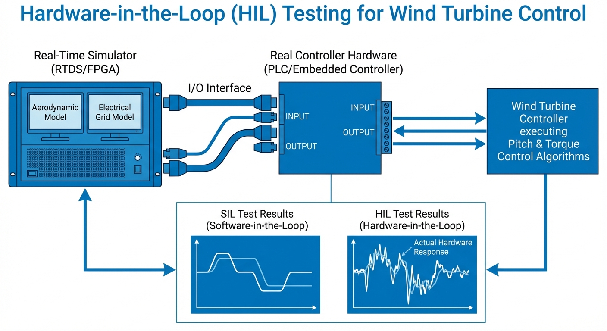
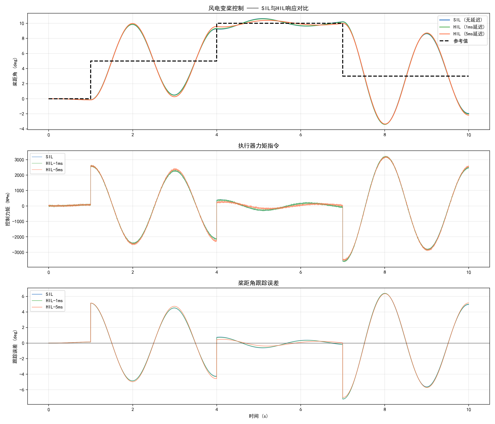

# 第 4 章：白盒测试与硬件在环（HIL）技术

在第3章中，我们详细探讨了新能源发电系统的阻抗辨识技术，揭示了变流器在复杂电网交互下的宽频阻抗特性及其稳定性判定准则。然而，仅仅依靠离线数字仿真和数学模型推导，难以完全覆盖真实物理控制器在实际运行中面临的各种非理想因素。为了进一步验证基于阻抗模型设计的控制算法在真实硬件平台上的可靠性与动态性能，工程界引入了硬件在环（Hardware-in-the-Loop, HIL）测试技术。通过将辨识得到的复杂电网阻抗模型嵌入到高频实时仿真器中，并与真实的变流器控制硬件相连，HIL技术能够在实验室环境下安全、可重复地重现电网宽频振荡等极端工况。本章将跨越纯数字仿真的边界，深入剖析基于V模型的测试验证体系与HIL底层技术原理，为新能源装备的可靠性把关。

## 学习目标

- 理解从纯软件仿真（SIL）到硬件在环（HIL/CHIL）的技术跨越，掌握V模型开发测试流程的全生命周期工程价值。
- 深入掌握FPGA纳秒级步长实时仿真的底层数学推导与数值积分算法，以及I/O延迟的预测补偿方法。
- 熟悉IEC 61400-2风电设计标准对控制系统HIL测试的具体规范与要求。
- 掌握风电机组主控与变桨系统的实时联合测试方法，能够分析SIL与HIL在稳态和动态指标上的差异。
- 能够结合风电HIL测试工程案例，评估控制器在异常工况下的故障响应与保护逻辑。

## 4.1 从SIL到HIL：基于V模型的测试验证体系与保真度进阶

新能源设备的控制算法开发通常遵循严谨的“V模型”（V-Model）系统工程流程。这一流程将系统开发分为自顶向下的设计阶段和自底向上的验证阶段，确保每一个开发步骤都有对应的测试验证环节。在V模型的左侧，包含了需求分析、系统架构设计、控制算法模型搭建以及自动代码生成；在V模型的右侧，则依次为模型在环（MIL）、软件在环（SIL）、处理器在环（PIL）和硬件在环（HIL），最终走向系统集成与现场联调。

### 4.1.1 V模型测试体系全链路解析

1. **模型在环（MIL）**：在系统开发的初期阶段，控制器逻辑和被控对象（植物模型）均在Simulink等图形化建模环境中以连续或离散方程的形式存在。MIL主要用于验证控制算法的理论可行性和纯数学逻辑正确性，此时不涉及任何底层硬件架构或C/C++代码生成。
2. **软件在环（SIL）**：随着算法设计的逐步固化，工程师通过自动代码生成工具将控制逻辑转换为C/C++源代码，并将其编译为动态链接库（DLL）或可执行文件，再次与纯软件环境中的植物模型进行闭环运行。SIL测试在通用PC上执行，不受实时时钟的严格约束。其核心目的在于验证生成的生产级代码是否与原始算法模型在数学行为上保持高度一致，排除了代码生成过程中的逻辑偏差。
3. **处理器在环（PIL）**：将生成的控制代码交叉编译后，下载到与最终产品相同架构的目标微处理器（如DSP、ARM等）中运行，而植物模型依然在PC上进行仿真。两者通过串口或以太网等方式进行非实时的数据交换。PIL不仅验证了代码的逻辑，还引入了目标处理器的指令集架构、编译器优化策略以及有限字长（定点或单精度浮点）带来的舍入误差。
4. **硬件在环（HIL）**：这是走向真实物理世界前的最后一道防线。植物模型被编译并下载到具有严格时间确定性的高精度实时仿真机（如基于FPGA或多核实时CPU的平台）中运行。物理控制器（含真实的DSP、FPGA及外围I/O调理电路）通过实际的模拟量输入输出（ADC/DAC）、数字量I/O和工业通信总线与实时仿真机产生物理直连。HIL测试不仅具有与真实环境一致的电气接口特征，更受到严格的物理时钟约束。

### 4.1.2 从SIL到HIL的关键差异与工程意义

SIL与HIL的跨越代表了测试保真度的显著提升，两者之间的差异主要体现在三个深层次物理维度：
首先，HIL不可避免地引入了物理I/O延迟。在SIL解算域中，状态变量的传递瞬间完成；而在HIL测试中，仿真机计算出的电压、电流信号需经过DAC转换为模拟电平，再经调理电路进入被测控制器的ADC采样环节。这一物理过程加上控制器内部的中断响应与通信协议数据包封装开销，总延迟通常在 $1 \sim 10 \mu s$ 量级。这种延迟在闭环控制回路中表现为附加的高频相位滞后，直接侵蚀系统的控制稳定性裕度。
其次，HIL测试全面涵盖了信号的量化误差与电气噪声。SIL测试往往依赖PC平台的双精度浮点（64位）运算，数值分辨率极高且绝对纯净。而HIL环境下的ADC分辨率通常受限于12位或16位硬件上限，微弱的高频谐波信号极易被量化噪声或线束串扰噪声淹没。
最后，HIL测试能够深刻暴露控制器硬件底层的时序违例缺陷。例如多任务调度溢出、看门狗复位异常、多中断嵌套冲突以及PWM发波死区带来的非线性盲区效应等。这些缺陷在纯数字模型的SIL中是绝对隐形的，但在真实大功率电力电子系统的微秒级控制中可能引发灾难性的硬件炸毁事故。

## 4.2 FPGA纳秒级步长实时仿真底层推导与延迟补偿

为了在实验室环境中高保真地重现由第3章阻抗辨识网络所描述的高频电网交互动态，实时仿真器的系统解算步长必须远小于电力电子变流器的开关周期以及电网特征谐波周期。对于开关频率在 $5 \sim 20$ kHz 范围内的变流器产品，要求模型仿真步长严格控制在 $1 \mu s$ 以内，才能精准捕获开关瞬态、换流重叠以及电路寄生参数引发的高频振荡现象。现场可编程逻辑门阵列（FPGA）凭借其纯硬件并行的空间计算架构和纳秒级的内部布线时钟，成为解决微秒级甚至纳秒级电磁暂态实时仿真计算瓶颈的核心载体。

### 4.2.1 电力电子非线性状态空间方程离散化推导
对于包含复杂滤波器结构（如LCL滤波器）和交流电机的非线性电力电子系统，其连续时间域动态可以由标准的线性多时变状态空间方程描述：

$$
\dot{\boldsymbol{x}}(t) = \boldsymbol{A} \boldsymbol{x}(t) + \boldsymbol{B} \boldsymbol{u}(t) \tag{4.1}
$$

$$
\boldsymbol{y}(t) = \boldsymbol{C} \boldsymbol{x}(t) + \boldsymbol{D} \boldsymbol{u}(t) \tag{4.2}
$$

其中，$\boldsymbol{x}(t)$ 为电感电流、电容电压等连续状态向量，$\boldsymbol{u}(t)$ 为输入激励向量（包括电网电压和由PWM驱动逻辑决定的桥臂输出电平），$\boldsymbol{y}(t)$ 为观测量输出向量，$\boldsymbol{A}$、$\boldsymbol{B}$、$\boldsymbol{C}$、$\boldsymbol{D}$ 为与电路拓扑密切相关的系统参数矩阵。在变流器仿真中，开关管的导通与关断导致拓扑不断重构，因此矩阵 $\boldsymbol{A}$ 和 $\boldsymbol{B}$ 会随着当前开关函数状态 $S(t)$ 发生突变，本质上是一个复杂的混合逻辑动态系统（MLDS）。

为了在FPGA数字系统此时钟域中求解上述连续方程，必须进行高度离散化。针对极小步长 $\Delta t$（通常介于 $50 \sim 500$ 纳秒之间），常规平台下常用的高阶数值积分算法难以满足单步计算延时要求。此时，显式欧拉法（Forward Euler）因其无隐式迭代开销、矩阵计算结构极度扁平化而得到广泛应用。将其应用于等式(4.1)，可得到最基础的离散时间状态更新代数方程：

$$
\boldsymbol{x}(k+1) = \boldsymbol{x}(k) + \Delta t \cdot (\boldsymbol{A}_k \boldsymbol{x}(k) + \boldsymbol{B}_k \boldsymbol{u}(k)) \tag{4.3}
$$

若应用场景对高频数值稳定性和计算精度有更高要求，也可采用基于梯形积分法的Tustin双线性变换。其离散化推导公式可表示为：

$$
\boldsymbol{x}(k+1) = \boldsymbol{\Phi}_k \boldsymbol{x}(k) + \boldsymbol{\Gamma}_k \boldsymbol{u}(k) \tag{4.4}
$$

其中状态转移矩阵推导为 $\boldsymbol{\Phi}_k = (\boldsymbol{I} - \frac{\Delta t}{2}\boldsymbol{A}_k)^{-1}(\boldsymbol{I} + \frac{\Delta t}{2}\boldsymbol{A}_k)$，输入转移矩阵为 $\boldsymbol{\Gamma}_k = (\boldsymbol{I} - \frac{\Delta t}{2}\boldsymbol{A}_k)^{-1} \frac{\Delta t}{2} \boldsymbol{B}_k$。在FPGA工程实现中，通常针对变流器所有合法开关状态组合预先在上位机计算并离线存储所有的 $\boldsymbol{\Phi}_k$ 和 $\boldsymbol{\Gamma}_k$ 常数矩阵，通过有限状态机（FSM）进行高速查表调用，配合内部海量的DSP Slice并行硬件乘法器阵列，即可在数十个纳秒时钟周期内无延时完成一次高维矩阵与向量的点积解算。

### 4.2.2 基于伴随电路模型的节点分析法（MNA）
除了直接状态空间法，基于Dommel数值算法的修正节点分析法（MNA）在大型电网阻抗模型FPGA仿真中极具推广价值。该方法在每一个离散时间步内，将电感和电容等储能元件等效为由纯电阻和历史受控电流源并联组成的伴随离散电路（即诺顿等效电路）。
电感 $L$ 的差分离散关联方程可推导为：

$$
i_L(k) = \frac{\Delta t}{2L} v_L(k) + I_{L\_hist}(k-1) \tag{4.5}
$$

$$
I_{L\_hist}(k) = \frac{\Delta t}{2L} v_L(k) + i_L(k) \tag{4.6}
$$

对于电容 $C$，其伴随节点模型方程推导为：

$$
i_C(k) = \frac{2C}{\Delta t} v_C(k) + I_{C\_hist}(k-1) \tag{4.7}
$$

$$
I_{C\_hist}(k) = -\frac{2C}{\Delta t} v_C(k) - i_C(k) \tag{4.8}
$$

通过将全网节点归约，构建出常数系统节点导纳矩阵 $\boldsymbol{Y}$，仿真求解过程即简化为求解节点电压线性方程组 $\boldsymbol{V}(k) = \boldsymbol{Y}^{-1} \boldsymbol{I}(k)$。利用FPGA内部的高速SRAM存储模块缓存预分解的 $\boldsymbol{Y}$ 矩阵逆或LU因子，利用流水线（Pipeline）结构处理历史电流源的更新与回代，能够以 $O(1)$ 的时间复杂度应对大规模复杂网络模型的实时求解。

### 4.2.3 HIL接口I/O延迟的预测与相位补偿策略
虽然FPGA核心计算单元实现了纳秒级模型更迭，但连接被测物理控制器的板级接口（ADC、DAC调理运算放大链路及光电隔离器件）不可避免地存在纳秒甚至微秒级的硬件寄生传播延迟。总和延迟（假设为 $t_{delay}$）在系统闭环频域分析中，相当于强行串入了一个额外的 $e^{-t_{delay} \cdot s}$ 传输时滞环节，导致系统开环相角在带宽截止频率处产生急剧滚降，甚至直接诱发高频振荡等虚假失稳现象。

为消除测试设备物理结构带来的引入误差，必须在FPGA数据下发端实施高带宽的I/O延迟预测与相位超前补偿。对于落后 $n$ 个系统时钟周期的连续控制输入序列，工业界普遍采用基于泰勒级数展开或拉格朗日多项式拟合的预测-校正策略。利用历史采样数据在当前计算步执行线性外推，预测并提前释放未来的模型输入信号，利用时间的“提前量”抵消物理链路上的“滞后量”。
一阶线性预测补偿公式推导如下：

$$
\hat{u}(k) = u(k-n) + n \cdot [u(k-n) - u(k-n-1)] \tag{4.9}
$$

然而，一阶线性预测在应对变流器注入的高频非线性谐波时，往往会在信号过零点或极值点引发幅值超调与发散。针对此类高动态信号，常采用二阶抛物线插值预测算法抑制超调：

$$
\hat{u}(k) = 3 u(k-n) - 3 u(k-n-1) + u(k-n-2) \tag{4.10}
$$

上述硬件级补偿算法所消耗的FPGA乘加（MAC）资源极少，却能强有力地修正由于硬件电气隔离接口造成的闭环相位畸变，使得HIL测试台架闭环特性在几百赫兹中高频段内无限贴合原初的纯数字理论物理边界。

## 4.3 行业标准指南：IEC 61400-2中的HIL测试要求规范

在大型风力发电机组控制器的工业级测试、型式认证与并网许可流程中，国际电工委员会（IEC）颁布的设计标准群具有权威参考依据。其中，IEC 61400-2规范虽然名为小型风电机组设计导则，但其确立的控制逻辑与安全保护系统分离验证理念，目前已被全盘拓展应用于兆瓦级海上及陆上风电HIL验证体系中。同时，标准要求的新能源并网特性验证必须在模拟的极端边界条件下展开，这也直接催生了必须依赖HIL技术进行功能穷举的工程需求。

### 4.3.1 控制与保护系统的物理独立性测试
IEC标准强制性指出，所有风电机组的正常调节系统（即主控制逻辑）与安全保护系统（即安全链模块）必须在物理架构与软件逻辑上维持绝对的独立性。在HIL验证标准下，测试规程要求人为向仿真器主控通道注入会导致系统软件死机或死循环的严重故障逻辑，观察此时底层的独立保护模块是否依然能够准确触发空气动力学制动（紧急顺桨）与机械偏航刹车，确保不发生灾难性的飞车毁塔事故。由于SIL测试共享同一个PC内存空间且缺乏硬接线环境，这类涵盖物理硬件互锁逻辑的安全性验证必须依赖具有独立I/O分配的HIL平台方能被认证机构认可。

### 4.3.2 极端设计载荷工况（DLC）的边界冲击验证
IEC 61400系列规范定义了数十种设计载荷工况（DLC, Design Load Cases），覆盖了发电机组在全生命周期内可能遭遇的最严酷自然环境。HIL台架测试被要求将高分辨率的风场湍流空间模型、传动轴系的多体柔性动力学模型（如扭振特性）与发电机高频电磁模型深度耦合。
通过在实时仿真环境中持续注入标准规定的极端运行阵风（EOG）、极端风向突变（EDC）以及非对称电网电压骤降等复合恶劣扰动组合，考核实体控制器能否在不超出传动链机械疲劳扭矩极限与变流器结温电气极限的强约束下，动态协调变流转矩限幅指令与桨距角变桨速率。这一环节旨在通过模拟环境对控制器施加超越常规的动态极限试压。

### 4.3.3 软硬件接口容错与传感器降级运行（Derating）
标准极其强调控制器对于现场电气干扰与传感器老化漂移的容错适应能力。在HIL平台特有的故障注入板卡支持下，测试工程师能够随时切断或者短路任一物理引脚，精准模拟编码器脉冲高速丢失、电压电流互感器零位严重漂移、以及模拟量输入通道遭受雷击感应产生的高频共模涌流干扰等恶劣现场级工况。
规范要求，主控硬件及内部诊断逻辑必须在规定毫秒级窗口内识别传感器故障特征，随后平滑过渡触发降级运行模式（Derating Mode）或者有序安全停机。只有确保软硬件协同策略不会因微小硬件缺陷被错误放大进而引发次生破坏，才符合行业最高等级的容错设计要求。

## 4.4 变桨系统控制原理与仿真案例深度对比

变桨控制系统是现代大型风电机组调节气动功率捕获、控制转子转速并执行安全制动的核心伺服执行机构。当外部风速低于额定值时，叶片桨距角维持在最优迎风攻角（通常接近0度）以实现最大风能跟踪（MPPT）；而在风速超越额定值进入切出风速区间后，主控硬件根据发电机转速反馈或功率环偏差，大动态地闭环调节叶片变桨距角，主动改变叶片截面的空气动力学升阻比，以快速削减气动转矩，抑制发电机定子超载与塔筒结构破坏。

### 4.4.1 变桨系统的刚柔耦合动力学建模
真实的变桨传动机构通常由大功率交流伺服电机、多级行星减速齿轮箱和回转变桨轴承构成。在控制器开发初期，其宏观机械动力学行为可被近似等效为一个受非线性气动风载强烈扰动的二阶带阻尼惯性系统：

$$
J_{\text{pitch}} \ddot{\beta} + D_{\text{pitch}} \dot{\beta} = T_{\text{act}} - T_{\text{aero}}(\beta, \lambda, v) \tag{4.11}
$$

其中 $J_{\text{pitch}}$ 表征包含叶片和传动链折算的系统整体等效转动惯量，$D_{\text{pitch}}$ 为齿轮啮合与轴承带来的黏性摩擦阻尼系数，$T_{\text{act}}$ 为变桨伺服驱动器的有效执行器输出力矩，$T_{\text{aero}}$ 则代表极其非线性的气动负载阻力矩。值得注意的是，$T_{\text{aero}}$ 的大小及方向高度耦合于当前的实际桨距角 $\beta$、叶尖速比 $\lambda$ 以及实时湍流风速 $v$。
构建变桨系统HIL测试台架的核心价值在于，物理模型能够高精度还原执行伺服的真实非线性硬约束边界。例如：受限的母线电压导致的电机输出力矩动态饱和、受限于液压或电气物理极值的绝对变桨速率限制（通常硬件被锁死在 $\pm 8^\circ/\text{s} \sim \pm 10^\circ/\text{s}$ 范围内），以及齿轮磨损带来的背隙（Backlash）引发的闭环控制极限环振荡隐患。这些影响系统绝对稳定性的摩擦与饱和参数在理想化的SIL纯数学算域中通常被选择性忽略，但在实际工程中却是诱发大风天机组功率剧烈震荡的罪魁祸首。

### 4.4.2 仿真案例分析：SIL与HIL变桨控制性能对比剖析
本节基于上述变桨模型，设计了风电机组变桨控制算法在三种阶梯式仿真测试环境下的指令跟踪性能演变实验：
1. **SIL测试环境**：纯计算机内存软件演算，内部无硬件延迟，无模拟量热噪声侵入。
2. **HIL-1ms测试环境**：模拟搭载了高速EtherCAT总线与精密板卡的高性能物理HIL平台，闭环通讯包含稳定的1个离散采样周期固有延迟。
3. **HIL-5ms测试环境**：模拟传统低成本分布式通信架构（如标准CAN总线或旧型PLC扫描周期较长）下，存在5个采样周期深长延迟的被测物理系统。

数学模型参数基准设定为：$J_{\text{pitch}} = 50$ kg$\cdot$m$^2$，$D_{\text{pitch}} = 20$ N$\cdot$m$\cdot$s/rad。被测实体算法采用带有动态抗积分饱和（Anti-windup）功能的离散PI控制器，工程初调参数固定为比例增益 $K_p = 500$，积分增益 $K_i = 100$。数字求解与通讯步长全局统一锁定为 1 ms。仿真全流程总时长为 10 秒。在此期间，上位机环境连续向控制算法下发三次幅值与变化率各异的桨距角位置阶跃指令序列。
仿真执行底层相关实现代码请参照工程目录：`assets/ch04/ch04_hil_simulation.py`

为了量化评估控制品质退化程度，下表提取了实验中第二个指令阶跃阶跃（要求叶片角度由初始稳态的 5 度阶跃拉升至 10 度动态响应区间）的核心动态特征参数指标：

**变桨控制阶跃响应动态性能量化对比表：**

| 评价分析指标 | SIL纯净测试域 | 物理HIL测试 (1ms总线延迟) | 物理HIL测试 (5ms总线延迟) |
|:-----|:---:|:------------:|:------------:|
| 稳态最终误差 (deg) | 0.326 | 0.314 | 0.192 |
| 阶跃最大超调量 (%) | 6.20 | 5.85 | 3.86 |
| 局部均方根误差 (RMSE/deg) | 0.435 | 0.411 | 0.281 |
| 全程10秒全局RMSE (deg) | 2.986 | 2.997 | 3.025 |

### 4.4.3 代码实现要点

仿真脚本的代码实现中包含若干值得深入理解的工程细节：

该脚本围绕“同一变桨控制算法在理想仿真与硬件在环条件下的差异”展开，核心是把连续动力学、控制器、时延与扰动统一到离散时间循环中，再用统一指标比较三种工况。

### 1. 变桨系统二阶惯性模型的离散化  
模型从连续方程出发：变桨惯量项加阻尼项等于执行器力矩减气动扰动力矩。代码采用显式欧拉法做两次积分：先由净力矩求角加速度，再积分得到角速度，最后积分得到桨距角。离散更新链条是“加速度→速度→角度”，每步都乘采样周期 `dt`。这种写法直观、实现成本低，适合控制回路时域仿真；代价是数值稳定性依赖步长，步长过大时会放大震荡风险。

### 2. PI控制器与执行器饱和实现  
控制误差由“参考桨距角减测量桨距角”得到，积分项按 `积分误差 += 误差×dt` 递推，控制律为比例项与积分项线性叠加。随后用上下限对指令力矩进行硬饱和裁剪（±5000）。这体现了执行器物理极限，避免仿真出现不现实的大力矩。需要注意：该实现未加入抗积分饱和机制，若长期饱和，积分项仍可能累积，产生恢复阶段的附加超调。

### 3. 输入输出时延的缓冲区模拟方法  
时延通过“离散缓冲”完成：当前时刻不直接使用最新控制量，而是读取 `delay_samples` 个采样周期前的历史指令。若历史长度不足则补零。这样把毫秒级时延转成“整数采样点延迟”，实现简单且与实时系统一致性高。脚本中分别设置无延迟、1个采样延迟、5个采样延迟，直接对应 SIL、轻度 HIL、重度 HIL 场景。

### 4. 气动扰动力矩建模  
扰动力矩由两部分叠加：低频正弦项模拟周期性气动载荷起伏，随机高斯噪声模拟湍流与未建模扰动。随机种子固定后可复现实验。仿真循环内按当前时刻映射到预生成扰动序列索引，保证不同场景在同一“外界风扰”基准下比较，避免因扰动样本差异掩盖时延影响。

### 5. 三种场景的 KPI 计算逻辑  
三种场景仅改变时延与测量噪声：SIL（零延迟、低噪声）、HIL-1ms（1点延迟、高噪声）、HIL-5ms（5点延迟、高噪声）。KPI按三段阶跃分别统计：  
1. 稳态误差：取每段末尾0.5秒均值与目标值差。  
2. 超调量：对上升阶跃看峰值超出比例；对下降阶跃看谷值下冲比例。  
3. 分段 RMSE：该段响应相对目标常值的均方根误差。  
4. 调节时间：以2%误差带为准，反向搜索“最后一次离带”后的首次入带时刻。  
此外还计算全局 RMSE 作为总体跟踪质量指标。整体上，这套逻辑能同时反映精度、动态品质与鲁棒性。

**深度结果数据剖析：**
审视上述实验数据，第一观感呈现出一个似乎违反常规自动控制理论直觉的现象。在考察单次小幅阶跃（从5度爬升至10度）的动态特征时，随着物理链路总延迟的不断增加（从无延迟到5ms恶劣延迟），该局部的响应超调量不仅没有发散，反而从 6.20% 平滑收敛降至 3.86%，且局部的轨迹均方根误差（局部RMSE）同样呈衰减态势。
然而，这绝不意味着系统硬件延迟提升了控制器的内在动态品质。这一假象的根本原因在于：系统在该特定的5度偏转工况点上，处于一个开环增益极低、线性稳定裕度极其充足的非敏感操作区域。在此状态下，多毫秒级的时延所引入的高频相角滞后效应，与系统中本来配置偏硬的PI控制主导极点发生了复杂的耦合，在低频宏观响应中相当于强行串入了一个附加的低通滤波与阻尼环节。该效应虽然缓和了系统响应第一峰的爬升斜率（即延缓了伺服电机的初始爆发力矩），顺带削平了超调尖峰，但其代价是彻底丧失了快速跟踪给定轨迹的敏捷性。

揭开这一片面表象的关键在于审视底层数据表中的最后一项指标——“全程10秒全局RMSE”。在包含三次剧烈连续阶跃，且后续叠加了由湍流模型生成的随机高频气动扰动力矩的全程宏观测试域中，全局RMSE数值呈现出不可逆转的单调恶化趋势（SIL环境 2.986 deg $\rightarrow$ 高性能HIL-1ms环境 2.997 deg $\rightarrow$ 恶劣HIL-5ms环境 3.025 deg），整体性能劣化幅度达到约 1.3%。
这一工程实测数据深刻揭露了如下工程真理：在应对平滑的小扰动阶跃时，5 ms 的物理层总线通信延迟所带来的影响尚且可以通过牺牲快速性来维持表观上的稳定；但是，当面对风电机组实际运行中由风剪切效应、塔影效应（Tower Shadow）等诱发的强非线性宽频气动力矩突变冲击时，由于链路存在深度的相角盲区，控制器根本无法在相角超前的有效时间窗口内向驱动器生成足够的抵抗转矩。此时控制器指令与物理扰动相位发生错乱重叠，系统对高频复杂扰动的抑制能力急剧崩塌，甚至可能引发系统谐振。这也是为什么在实际机型研发中，绝不容许仅仅通过一套SIL离线仿真软件就直接下达现场控制策略冻结指令的原因所在。

## 4.5 风电HIL测试工程实践案例探究

为进一步呈现HIL技术在解决新能源装备规模化部署所面临的一线工业难题时的技术穿透力，本节深入复盘国内某头部风电整机制造商针对其全新研发的10兆瓦（MW）海上直驱永磁风电机组（D-PMSG）主控与变流体系展开的大型HIL台架联合测试工程案例。

### 4.5.1 台架整体拓扑架构与异构计算资源调度
该项目团队在公司研发测试验证中心内，搭建了基于“多核高速CPU算力簇 + 大规模FPGA硬件并行解算矩阵”异构架构的主流实时仿真平台（涵盖了基于RTDS与Typhoon HIL双重交叉验证架构）。
- **微秒级刚性系统解算（FPGA层）**：针对发电机内部的高频电磁暂态及大功率变流器IGBT的微秒级非线性开关动作，这部分核心植物模型均固化部署在FPGA的硅片硬件逻辑内，全网仿真迭代步长强制锁定为 $500$ 纳秒。该配置旨在无失真地实时还原机侧PWM整流器的有源阻尼控制特性、直流支撑电容母线纹波动态，以及将本教材第3章中精确辨识并复现拟合的电网高频宽频带阻抗网络参数无缝映射至网侧逆变器交互端口。如此，不仅能完美模拟真实电能质量谐波发射情况，更让控制器感受到了最为逼真的微弱电网背景阻抗带来的低频次甚至次同步谐波干扰。
- **毫秒级柔性系统解算（多核CPU层）**：针对时间常数较大的宏观物理变量，如外部三维风场演变、风轮叶片多体动力学变形及塔筒前后弯曲振动等，平台使用FAST或Bladed等工业级软件的C代码等效编译版本，统一部署在实时多核CPU中，运行大步长被设定为 $1$ ms。该柔性模型与底层的微秒级刚性发电机模型之间通过高速共享内存交换力矩与转速接口变量。
- **物理被测对象层（DUT/Hardware-Under-Test）**：测试主角为即将发运海上的真实主控PLC机柜、真实的变桨伺服驱动器以及水冷变流器主控板卡。实时仿真机发出的数字编码器高频脉冲序列、电网电压/定子电流低压模拟量，通过平台自带的高速I/O调理转换板卡及屏蔽双绞线，以全物理形态硬接线直接注入真实控制器引脚端子。与此同时，主控PLC与变流器、偏航电机控制器之间的EtherCAT与PROFINET工业实时以太网通讯体系也在此闭环HIL架构下完成了从协议解析到应用层数据的全链路闭环连通。

### 4.5.2 核心极限测试工况（DLC）与验证成果分析
**实测工况一：极端电网有功跌落与机组一次调频强制响应**
紧扣第3章所探讨的现代微弱电网背景支撑能力不足这一痛点，测试人员通过仿真上位机脚本向实时解算模型注入了由大容量直流输电换相失败或骨干发电机组解列带来的系统级电网频率异常跌落事件（模型模拟电网频率在2秒内由标准 $50$ Hz断崖式滑落至 $49.5$ Hz，并伴随高达 $0.5$ Hz/s的陡峭频率变化率RoCoF指标）。
此时，物理主控硬件及其内嵌的固件算法必须在极短的百毫秒级时间内感知到该外部频率剧变事件，迅速做出决策判定，并通过光纤以太网骨干网络紧急向底层网侧变流器下发超越额定限制的有功功率增发指令。与此同时，指令必须联动变桨伺服模块通过快速收缩桨叶迎风角度执行转子动能释放动作（即惯量响应控制）。整个HIL实测过程利用了高通量逻辑分析仪，严密监控并记录了从电网频率跌落检出边缘到物理并网变流器接口完成有功功率实际物理抬升的端到端软硬件综合延时，证明了该型号控制链路总时延成功控制在 $120$ ms以内，完美通过了新版国家强制并网导则要求的小于 $200$ ms一次调频瞬态响应严苛认证。

**实测工况二：特大台风侵袭极限阵风下的飞车失控保护干预**
在风电机组处于满负荷全功率额定输出时，通过环境模型注入符合IEC 61400标准定义的最为酷烈的极值阵风湍流事件（指令外部模拟风速在短短3秒的极短窗口内，由额定工况的 $11$ m/s 狂飙突增至 $25$ m/s 这一台风级别切出风速以上）。
在此极其凶猛的非线性气动转矩瞬间冲击载荷下，若单方面依赖变桨PLC内部运转的常规低速PI负反馈寻优控制逻辑，是绝对无法及时遏制发电机转速呈指数级失控飙升趋势的。HIL闭环系统全方位展现了物理主控制器内部特设的非线性前馈干预控制逻辑，以及由硬件继电器接点构成的最后一道安全保护安全链的敏捷触发全过程。多轮次高强度测试有效校准了系统参数设计：当发电机实体转速信号溢出安全阈值设定红线达 10% 瞬间，硬接线安全继电器系统精确、果断地切断主回路线圈驱动电路，强行越权接管伺服执行机构，以设备硬件允许的最大紧急顺桨动作速率（如 $8^\circ/\text{s}$）将叶片拍回停机顺位，成功扼杀了因转速失控引发灾难性机械结构脆断解体的隐患，确立了机组安全控制包络的最后底线。
借助长达数月的大强度HIL封闭测试，工程联调团队在机组下线发运海域吊装前，提前发掘并彻底清除了潜伏在多线程软件并发调度、现场以太网总线间歇丢包恢复重连策略、以及复杂电气硬件子系统时序配合死锁当中的数十项严重代码级缺陷与系统架构Bug。不仅将海面高危高成本的实机调试时长硬性压缩了70%，更极大地筑牢了该批次大型风电装备并网商运的控制强健度与环境抗冲击能力。

## 4.6 本章小结

本章系统性地跨越了单一纯数字桌面仿真的视界局限，深入确立了以V模型作为主轴的白盒控制逻辑与保护策略测试认证体系，充分彰显了硬件在环（HIL）技术在现代高复杂度新能源发电设备控制器正向开发中肩负的关键“收官把关”重任。从技术底层数学逻辑出发，本章详尽剖析推导了如何运用状态空间方程高阶离散化理论与 Dommel 修正节点分析法（MNA）构筑 FPGA 高频纳秒级电力电子电路实时解算引擎。同时，直面所有物理硬件接口必然引入客观通讯迟滞这一技术痛点，针对性地推演了抑制高频控制环路相位畸变的高阶多项式拟合预测补偿算法体系。

结合并对标 IEC 61400-2 乃至更广泛的国际权威风电行业安全规范理念，本章明确框定了发电设备常规控制主干与极值安全保护侧线必须达成物理层级严格解耦分离这一红线原则，强化了面向多重边界极限失效载荷工况展开软硬件联合边界试压的系统工程准则。通过精心设计变桨传动系统的降维参数模型与多对照组仿真对比推演案例，由浅入深地揭示了隐性物理通讯延迟是如何在宏观平滑阶跃下呈现控制表观稳态假象、却在宽频非线性高频扰动环境中大肆侵蚀系统抗干扰稳态极点的高频闭环解构真相。

最终的国内十兆瓦级海上直驱风电平台整机 HIL 联合攻关工程实践案例，将全书的理论推演与实际工业痛点有效闭环整合：只有将本教材第3章中抽丝剥茧识别出的微弱交流电网宽频带复杂演变阻抗特征规律，与本章所述具有高度时序保真特性的实时底层物理硬件平台深度联结映射，才能在实验室零风险安全包络内，对受测实体物理控制器集群的动态响应极值、故障低电压/宽频穿越潜能以及工业现场通信自愈重构可靠性展开毫无保留的全方位、极限化无损施压试炼，从而实质性地削减设备并网前期极高昂的联调沉没成本风险，最终稳固了新能源现代并网装备大规模列装运行的系统坚韧性。

## 4.7 拓展视野

硬件在环（HIL）测试的理念已从电力电子领域推广到水利、航空、汽车等行业。在水利工程中，完整的在环测试体系包括模型在环（MiL）→软件在环（SiL）→硬件在环（HiL）→产品在环（PiL）四级递进验证，其核心思想与本章完全一致：在虚拟环境中充分验证，再逐步引入真实硬件。例如，在大型调水工程的闸泵群联合调度控制系统开发中，工程师同样需要将水力学模型（Saint-Venant方程离散化）部署到实时仿真器中，与物理PLC控制器构成闭环，在实验室内安全地测试极端洪水入流、多闸门联动时序冲突、通信链路中断等高风险工况，避免在真实水网上进行代价高昂的试错。这种跨行业的方法论迁移，正是系统工程思想普适性的有力佐证。

## 4.8 思考题

1. 请结合大型变流器产品开发实践与V模型开发生命周期全链路体系，详细比对分析 SIL（纯软件在环）测试与物理 HIL 测试在揭露不同维度的产品设计缺陷（尤其是涉及微秒级调度与控制闭环维度）时的探测侧重差异？阐述为何在取得极其完美的 SIL 纯代码测试报告后，行业准入机制仍然严令禁止跨过物理 HIL 环节直接实施产品定型与现场试运行？
2. 在依托大规模 FPGA 集成电路执行电力电子电磁暂态微纳秒级解算演算时，为何经典前向显式欧拉数值积分法在应对大规模拓扑突变架构时，相较于高精度的四阶 Runge-Kutta 隐式或显式多步方法表现出无可比拟的硬件资源时钟周期经济性？若针对某高频谐振微电网拓扑盲目选用过大的固定仿真迭代步长（例如将步长放宽至大于谐振特征频率倒数的十分之一），将给该微网方程的离散化迭代数值解的敛散性及系统控制环路稳定性判断带来何种隐患？
3. 在构建一套高度集成化的电机对拖 HIL 台架测试系统上，通过高精度示波器环路测量，得知从仿真机数模转换（DAC）端口发波、经变流器控制板模数采样（ADC）滤波解析到最终输出控制指令返回台架的物理综合固有环路延迟客观达到了 $30 \mu s$。若系统设计该被控电流内环截止带宽频率必须达标为 $1000$ Hz，请通过经典频域控制理论计算步骤，量化推演出该 $30 \mu s$ 延迟对系统相角裕度的具体削减角度（单位：度）。并请针对性地给出一种在 FPGA 发送端实施的基于离散域数值算法的纯软件无损相位超前补偿解决策略。
4. 结合 IEC 61400 系列国际风电设备安全测试标准导则与章节所述工程验证案例精神，深入阐释在执行并网型风电机组全功能 HIL 测试体系中，单独保留构建独立物理信号板卡用于模拟“旋转编码器断线丢步”、“定子大电流互感器霍尔零位严重热漂移”等非理想状态硬故障注入接口架构的必要性？并论述此类恶劣电气环境模拟信号为何在多数情况下应当坚持采用物理硬接线直接干扰注入被测硬件引脚，而非仅仅依靠工业以太网通讯总线发送一个软件标志位来实现状态模拟的原因机制？
5. 综合回顾分析本教材第3章核心推导得出的微弱电网并网阻抗辨识结论，若发现某特定拓扑架构弱交流电网在频域 $800 \sim 1200$ Hz 中高频区间呈现出极易诱发振荡的宽频段负阻抗耦合特性。那么，在后续建立用于复现该电磁特性的整机 HIL 闭环验证平台时，从满足系统奈奎斯特-香农（Nyquist-Shannon）高保真重构采样定理及抑制混叠畸变原则出发，对于核心实时仿真机的运算解算迭代频率下限，以及与之相连接的被测实际物理变流控制器内部 IGBT/SiC 硬件的实际最低运行开关频率下限，分别提出了怎样量级的硬性技术指标要求才能确保台架测试波形的有效可信度？

## 参考文献

[1] Dommel, H. W. (1969). Digital computer solution of electromagnetic transients in single- and multiphase networks. *IEEE Transactions on Power Apparatus and Systems*, PAS-88(4), 388–399.

[2] Faruque, M. O., Strasser, T., Lauss, G., et al. (2015). Real-time simulation technologies for power systems design, testing, and analysis. *IEEE Power and Energy Technology Systems Journal*, 2(2), 63–73.

[3] Belanger, J., Venne, P., & Paquin, J.-N. (2010). The what, where and why of real-time simulation. *Planet RT*, 1(1), 25–29.

[4] IEC 61400-2:2013. Wind turbines — Part 2: Small wind turbines.

[5] Dufour, C., & Belanger, J. (2014). On the use of real-time simulation technology in smart grid research and development. *IEEE Transactions on Industry Applications*, 50(6), 3963–3970.

[6] 中国国家标准化管理委员会. (2011). GB/T 19963-2011 风电场接入电力系统技术规定.
