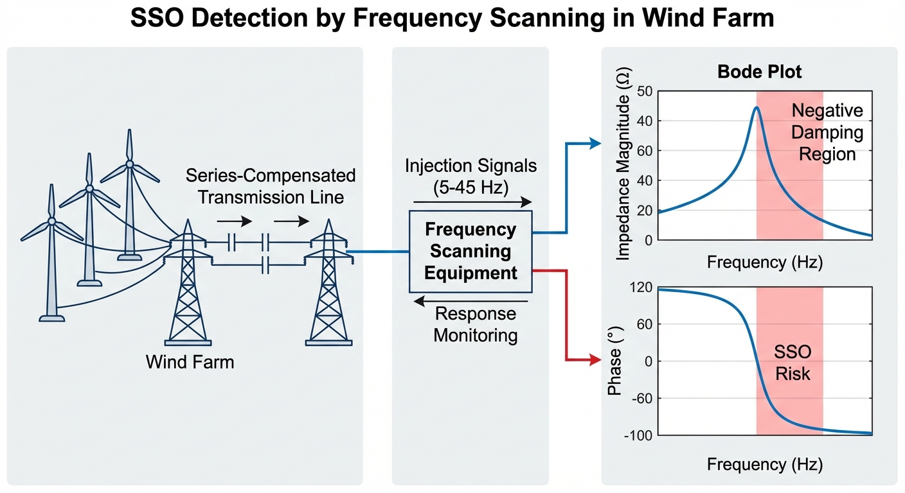

# 第 6 章：新能源场站级测试与扫频

## 学习目标

- 掌握风电场站一次调频的下垂控制策略理论基础、控制框图及阶跃响应测试的时间序列分析方法。
- 深刻理解次同步振荡（SSO）的物理机理，熟练掌握基于阻抗模型的变流器负阻尼数学推导过程。
- 熟悉现场频率响应与阻抗扫频的设备拓扑、并网要求及现场安全操作规程。
- 掌握场站级自动化测试用例的正交设计与矩阵规划方法。
- 能够结合实际案例数据评估风电场一次调频性能及次同步频段的阻尼特性。

## 6.1 承上启下：从单机低电压穿越到场站级系统响应

在第 5 章中，我们详细探讨了新能源机组在面临电网短路故障等大扰动情况下的低电压穿越（LVRT）特性。LVRT 侧重于评估单个机组或整个场站在毫秒至秒级的瞬态过程中，如何维持设备不脱网并提供短路电流与无功支撑，以帮助系统电压恢复。然而，随着高比例新能源接入电网，系统的等效转动惯量和一次调频能力显著下降，引发了以频率稳定性和宽频带振荡为主的全新挑战。

本章将测试验证的视角从大扰动下的瞬态电压稳定性，转移到针对频率波动的小扰动稳态响应及动态支撑能力，同时深入剖析次同步振荡（SSO）这一涉及机电耦合与变流器控制交互的宽频带稳定性难题。从单机的电网故障穿越过渡到场站级的有功/频率调节，再到复杂电网环境下的阻抗特性现场扫频测试，这标志着新能源场站并网测试标准与系统级交互验证的全面升级。在此阶段，测试对象不再仅是独立的变流器硬件，而是包含了场站能量管理系统（EMS）、通信网络、机组群控逻辑以及电网等效阻抗在内的复杂广域系统。

## 6.2 风电场站一次调频与下垂控制详细推导

### 6.2.1 一次调频的需求与电网要求
在传统电力系统中，系统频率的稳定依赖于同步发电机的旋转机械惯量和调速器的一次调频作用。当电网发生有功功率缺额导致频率下降时，同步发电机组能够在其转速偏差的驱动下，自主增加原动机机械功率。风电机组通过电力电子变流器并网，转子的机械转速与电网频率解耦，天然不具备这种同步响应能力。因此，必须在风电场的控制系统中引入虚拟惯量与下垂控制策略，使其模拟同步发电机的频率响应外特性。

为了具备向上调频能力（即在频率跌落时增发有功功率），风电场需要预留一定比例（通常为额定容量的 10%~20%）的有功备用容量。这意味着在正常运行时，风电机组不能运行在最大功率点跟踪（MPPT）曲线上，而是通过增加桨距角（超速/减速变桨）或降低电磁转矩来实现减载运行。

### 6.2.2 下垂控制详细推导过程
下垂控制（Droop Control）的核心思想是建立有功功率偏差与频率偏差之间的线性比例反馈关系。我们从同步发电机的转子运动方程（摇摆方程）出发进行推导：

$$
2H \frac{d\Delta \omega}{dt} = \Delta P_m - \Delta P_e - D\Delta \omega \tag{6.1}
$$

式中，$H$ 为惯性时间常数，$\Delta P_m$ 为机械功率变化量，$\Delta P_e$ 为电磁功率变化量，$D$ 为阻尼系数，$\Delta \omega$ 为标幺化角速度偏差。对于常规调速器，其稳态下的功频静态特性（不考虑非线性死区时）可表示为：

$$
\Delta P_m = -K_G \Delta \omega \tag{6.2}
$$

其中 $K_G$ 为调速系统的单位调节功率。结合上述两式并将其推广至基于逆变器的新能源场站，风电场的有功功率参考值 $P_{ref}$ 可以设计为：

$$
P_{ref} = P_{0} + \Delta P_{droop} + \Delta P_{inertia} \tag{6.3}
$$

其中 $P_{0}$ 为调度下达的基准有功指令。调频附加功率由虚拟惯量响应与下垂响应组成：

$$
\Delta P_{inertia} = -K_{df} \frac{d f}{dt} \tag{6.4}
$$

$$
\Delta P_{droop} = -K_{pf} (f - f_0) \tag{6.5}
$$

这里，一次调频主要考察下垂响应部分。我们将比例系数 $K_{pf}$ 转化为工程上常用的下垂系数（Droop Rate）$R_d$。下垂系数定义为频率的标幺值偏差与有功功率标幺值偏差的比值的绝对值：

$$
R_d = \left| \frac{\Delta f / f_0}{\Delta P / P_{\text{rated}}} \right| \times 100\% \tag{6.6}
$$

将等式变换即可得到风电场下垂控制的标准有功附加指令推导公式：

$$
\Delta P = -\frac{1}{R_d} \cdot \frac{\Delta f}{f_0} \cdot P_{\text{rated}} \tag{6.7}
$$

**死区与限幅环节的引入：**
在实际控制器中，为避免电网频率的微小波动导致风力发电机频繁调节变桨机构从而加剧机械磨损，必须引入频率死区 $\Delta f_{dead}$（国内标准通常取 $\pm 0.03$ Hz 或 $\pm 0.05$ Hz）。完整的有功偏差控制律推导如下：

$$
\Delta P = 
\begin{cases} 
0, & |f - f_0| \le \Delta f_{dead} \\
-\frac{1}{R_d} \frac{f - f_0 - \Delta f_{dead}}{f_0} P_{\text{rated}}, & f - f_0 > \Delta f_{dead} \\
-\frac{1}{R_d} \frac{f - f_0 + \Delta f_{dead}}{f_0} P_{\text{rated}}, & f - f_0 < -\Delta f_{dead}
\end{cases} \tag{6.8}
$$

同时，附加的有功功率指令会被限制在风电场当前的可用最大备用容量 $\Delta P_{max\_reserve}$ 和机械疲劳允许的最大功率变化率限制之内。

## 6.3 一次调频响应时间分析

一次调频的阶跃响应测试是验证风电场调频性能的标准方法。在电网频率突然发生阶跃跌落（例如跌落 0.2 Hz 甚至 0.5 Hz）后，测量风电场从检测到频率变化到实际功率输出达到目标增量所需的响应时间。响应时间的长短直接决定了风电场支撑电网频率跌落最低点（Nadir）的效能。

### 6.3.1 控制链路延迟解析
风电场的一次调频是一个包含测量、通信、计算与机械执行的复杂级联过程。其总体响应时间 $T_{total}$ 可分解为以下几个环节：

1. **频率测量延迟 ($T_{PLL}$)**：变流器的锁相环（PLL）用于提取电网频率。为了滤除电网电压的不平衡与谐波，PLL 通常包含低通滤波器或延时信号消除（DSC）环节，这会引入 $20 \sim 50$ ms 的时间延迟。
2. **场站控制与通信延迟 ($T_{comm}$)**：场站级自动有功控制（AGC/APC）系统检测到频率偏差后，计算全场总的有功需求，并根据各台风机的实时运行状态（风速、转速、桨距角）通过光纤环网将功率指令下发。网络传输协议的周期性调度与解析通常引入 $100 \sim 300$ ms 的通信延迟。
3. **变流器电磁响应延迟 ($T_{elec}$)**：风机主控系统接收到指令后，改变转矩给定。变流器内环电流控制的带宽通常在百赫兹级别，其阶跃响应时间极快，一般在 $10 \sim 20$ ms 内即可完成。
4. **机械执行机构延迟 ($T_{pitch}$)**：如果初始功率裕度主要由桨距角预留，那么要实现有功增发，必须执行收桨动作以增加空气动力学转矩。变桨液压或电动伺服系统存在物理惯性，其响应时间常数通常长达 $1.0 \sim 2.5$ s。

### 6.3.2 响应时间的综合分析
为了缩短一次调频的响应时间，现代风力发电机通常采用**“转子动能提取+变桨恢复”的两阶段协同控制**。
在频率跌落的最初几秒内，控制器绕过缓慢的变桨系统，直接增加变流器的电磁转矩参考值。此时，增发的电磁功率直接由发电机转子的动能提供，导致机组转速下降（释放动能）。这种电磁响应链路的传递函数可近似为一阶惯性加纯滞后系统：

$$
G_{elec}(s) = \frac{\Delta P_e(s)}{\Delta f(s)} = e^{-\tau_{delay} s} \frac{K_{droop}}{T_{elec}s + 1} \tag{6.9}
$$

其中 $\tau_{delay} = T_{PLL} + T_{comm}$，约在 $200 \sim 400$ ms。由于 $T_{elec}$ 极小，有功功率能够在 $500$ ms 左右迅速攀升至指令值的 90%。
与此同时，变桨系统开始缓慢收桨。当桨距角减小使得气动机械转矩 $T_m$ 逐渐上升并与新的电磁转矩匹配时，转子停止减速并逐渐恢复稳定运行。这种控制策略既能满足电网规程要求（如 2 s 内达到调频指令的 90%），又避免了单纯依赖变桨系统导致的响应迟缓问题。

## 6.4 次同步振荡（SSO）物理机理与负阻尼推导

次同步振荡（Sub-Synchronous Oscillation, SSO）是指频率低于电网工频（50 Hz）的功率、电压或电流振荡现象。传统电力系统中的 SSO 多由同步发电机组与串联补偿电容引发（次同步谐振，SSR）。而在新能源场站中，SSO 主要表现为以下两种机理的交互：
1. **次同步控制交互（SSCI）**：双馈异步发电机（DFIG）或全功率变流器的快速控制环路与弱电网或串补线路阻抗之间的电气耦合。
2. **次同步扭振交互（SSTI）**：机组传动链的机械固有扭振模式与变流器电气控制产生的电磁转矩脉动之间的机电耦合。

近年来多起风电场 SSO 事故表明，当变流器的等效阻抗在特定次同步频段呈现“负电阻”特性时，微小的扰动将在电网与场站之间形成正反馈，导致振荡能量持续累积发散，最终引发设备脱网或过压保护。

### 6.4.1 基于阻抗模型的负阻尼物理机理推导
为了严谨地揭示变流器控制参数如何引发负阻尼，我们在旋转坐标系（dq 坐标系）下建立并网逆变器的小信号阻抗模型。考虑逆变器经过滤波电感 $L_f$ 和电阻 $R_f$ 接入电网，其电压方程为：

$$
\begin{bmatrix} v_d \\ v_q \end{bmatrix} = \begin{bmatrix} e_d \\ e_q \end{bmatrix} - R_f \begin{bmatrix} i_d \\ i_q \end{bmatrix} - L_f \frac{d}{dt} \begin{bmatrix} i_d \\ i_q \end{bmatrix} + \omega_0 L_f \begin{bmatrix} -i_q \\ i_d \end{bmatrix} \tag{6.10}
$$

其中 $v_{d,q}$ 为并网点电压，$e_{d,q}$ 为逆变器内电势，$\omega_0$ 为工频角速度。
变流器通常采用电流内环解耦控制，电流控制器传递函数为 $G_c(s) = K_p + K_i/s$。为了与电网同步，变流器必须使用锁相环（PLL）。在稳态运行点 $(V_{d0}, V_{q0}=0, I_{d0}, I_{q0})$ 处施加小信号扰动，锁相环会因并网点电压相位的扰动产生一个相角偏差 $\Delta \theta$：

$$
\Delta \theta = G_{PLL}(s) \Delta v_q \tag{6.11}
$$

由于相角偏差的存在，逆变器内部控制器看到的 dq 坐标系与实际电网的 DQ 坐标系之间发生错位。这种错位将稳态的有功电流和无功电流耦合到了小信号动态响应中。考虑时间延迟 $T_d$ 后的逆变器输出占空比变化，推导出的变流器系统等效导纳矩阵 $\mathbf{Y}(s)$ 中包含了由于 PLL 引入的不对称耦合项。

通过阻抗变换，可求得其在静止坐标系下的正序阻抗 $Z_p(s)$。在不考虑外部极其复杂的线路电容时，可以得到正序阻抗的近似表达式：

$$
Z_p(s) \approx R_f + sL_f + G_c(s-j\omega_0) + \frac{1}{2} V_{m} G_{PLL}(s-j\omega_0) \left[ G_c(s-j\omega_0) (I_{d0} - j I_{q0}) - (s - j\omega_0) L_f (I_{d0} - j I_{q0}) \right] \tag{6.12}
$$

**负阻尼的本质分析：**
式 (6.12) 是次同步振荡理论的数学核心。我们将拉普拉斯算子替换为频域变量 $s = j\omega_{sub}$，其中 $\omega_{sub}$ 为次同步角频率（例如 20 Hz）。
1. 第一部分 $R_f + j\omega_{sub} L_f$ 是物理滤波器的无源阻抗，其电阻始终为正，提供正阻尼。
2. 第二部分 $G_c(j\omega_{sub}-j\omega_0)$ 是电流控制器的等效阻抗。当比例系数 $K_p$ 较大，且受系统延时影响时，该项在某些频段可能投影出负的实部。
3. 第三部分是由锁相环 $G_{PLL}$ 与稳态有功电流 $I_{d0}$ 耦合产生的项。当系统处于大功率送出（$I_{d0}$ 很大）且接入弱电网（并网点电压容易受扰动从而导致锁相环频繁动态调节）时，$G_{PLL}$ 引入的相位滞后将使得整个括号内的复数乘积在实轴上产生巨大的负偏移。

因此，测试评估的关键在于：测量整个并网变流器端口处的等效电阻 $\text{Re}[Z(j\omega)]$。
- 若 $\text{Re}[Z(j\omega)] > 0 \implies$ 表现为耗能元件，提供**正阻尼**，系统稳定。
- 若 $\text{Re}[Z(j\omega)] < 0 \implies$ 表现为有源元件，等效为**负阻尼**。当它与外部电网的串联谐振回路相遇，且系统总电阻 $R_{\text{total}} = R_{grid} + \text{Re}[Z_{conv}] \le 0$ 时，振荡将被激发并指数级发散。

## 6.5 现场扫频设备与测试安全规程

现场扫频测试是通过主动注入宽频带扰动信号并测量响应，来获取风电场实际频率阻抗特性的实证方法。这是验证理论推导和仿真结果不可或缺的最终手段。

### 6.5.1 现场扫频设备拓扑与原理
现场扫频设备必须具备在兆瓦级风电场并网点注入足够能量的次同步谐波的能力。主流设备采用级联 H 桥（CHB）多电平变流器结构或模块化多电平变流器（MMC）结构。
注入方式主要有两种：
1. **串联注入式**：通过特制的耦合变压器串接在风电场集电线路中。注入电压源型谐波扰动，测量电流响应。该方式信噪比高，但需要断开高压母线进行施工，实施难度大。
2. **并联注入式**：类似于大容量的有源滤波器（APF），并联接入场站母线或测试变压器。通过注入设定的多频段混合电流扰动 $i_{inj} = \sum_{k} I_k \sin(\omega_k t)$，利用高精度录波器同步采集并网点的三相电压 $v_{abc}$ 和流向风电场的三相电流 $i_{abc}$。

通过快速傅里叶变换（FFT），计算各扫频频点处的电压和电流相量，进而求得风电场的等效阻抗矩阵：
$$
\mathbf{Z}(j\omega) = \frac{\mathbf{V}(j\omega)}{\mathbf{I}(j\omega)} \tag{6.13}
$$

### 6.5.2 现场安全操作规程
由于风电场可能潜藏负阻尼特性，主动扫频本身存在激发真实破坏性 SSO 事故的风险。因此，执行现场测试必须遵守严苛的安全规程：

1. **先仿真后实测**：在进行现场物理注入前，必须基于风电场的实际参数建立电磁暂态（EMT）模型，在仿真环境中预演扫频过程，初步定位风险频段。
2. **注入幅值渐进策略**：扰动信号的幅值必须从安全极小值（如额定电流的 0.01 p.u.）开始阶梯式递增。在每一个台阶注入后，利用在线快速 Prony 分析算法评估响应信号的衰减时间常数。如果发现某频点的振荡呈现无阻尼或发散趋势，应立即终止该频点的测试。
3. **独立的三级硬软件保护联动**：
   - 第一级：扫频设备内部 DSP 的软件电流/电压瞬时值阈值保护。
   - 第二级：外部高灵敏度在线振荡监测装置，一旦计算出连续 3 个周波的次同步频段能量超过限值，直接向注入设备发送紧急停机硬接线指令。
   - 第三级：测试人员配备紧急红色停机按钮（E-Stop），在发现异常啸叫或监控画面异动时人工干预。
4. **系统隔离**：确保测试期间，该集电线路上的风机与其他正常发电的集电线路在电气上尽量解耦，防止振荡能量跨线蔓延污染主网。

## 6.6 场站级自动化测试用例设计方法

场站级测试不仅涉及上百台机组的协同动作，还必须覆盖多种环境气象与调度工况。传统依靠人工下发指令并逐一比对录波数据的模式效率低下且极易遗漏边界隐患。为此，必须采用自动化测试平台与科学的用例设计方法。

### 6.6.1 测试维度的正交设计
一次调频与阻抗特性受多种非线性因素影响，主要的自变量维度包括：
- **风速水平**：低风速（3~5 m/s）、中风速（额定风速附近）、高风速（进入恒功率变桨区）。
- **有功初始功率**：20%、50%、80%、100% 额定功率。
- **电网短路比（SCR）**：通过改变外部测试变压器的分接头或并联电抗器模拟强电网（SCR>5）与弱电网（SCR<3）。
- **运行机组台数**：场站空载、半载、满载运行。

如果进行全排列全面交叉测试，用例数量将呈指数级爆炸。因此，自动化平台引入**正交试验设计法（Orthogonal Array Testing）**，利用正交表 $L_n(q^k)$ 挑选具有代表性的组合，使各因素在试验中分布均匀，极大削减了测试冗余度。例如，将 4 因素 3 水平的全排列 81 次测试缩减为 9 次核心用例测试。

### 6.6.2 自动化测试序列与脚本解析
自动化测试平台通过 Python 或专用测控语言（如 LabVIEW）编写状态机脚本，实现无人值守的闭环测试：
1. **环境准备与稳态判定阶段**：脚本通过 OPC UA 协议读取场站 SCADA 数据。判定当前环境风速是否在设定用例的容差范围内，且输出功率波动率在过去 5 分钟内小于预设阈值。
2. **事件注入阶段**：脚本控制构网型模拟源或一次调频模拟测试仪，在并网点瞬间产生频率阶跃（如跳变 0.5 Hz）或启动特定频段的谐波注入。
3. **高频数据同步采集**：触发场站内的故障录波器与 PMU 装置，以 10 kHz 采样率持续记录测试窗口期内的数据，并打上高精度 GPS 时间戳。
4. **自动化裁决生成阶段**：调用分析算法对时序数据进行特征提取（上升时间、超调量、功率积分值）或频域变换（阻抗实部识别）。将提取结果与规程要求（如 GB/T 19963.1-2021）的边界条件自动比对，生成合格/不合格判定及可视化图表报告。

## 6.7 仿真案例：100 MW风电场调频与SSO扫频

### 6.7.1 案例描述

本案例包含两部分。第一部分模拟 100 MW 风电场（由 50 台 2 MW 直驱永磁风力发电机组构成）在电网频率跌落 0.5 Hz 时的一次调频响应，初始出力为 80% 额定功率，系统设定备用容量为 20%，一次调频下垂系数设为 5%。第二部分对该风电场在 5~45 Hz 频段进行次同步阻抗扫频，重点评估由于柔性轴传动导致的传动链三阶扭振模式（分别为 16.5 Hz、25.3 Hz、32.8 Hz）处的机电耦合阻尼特性。

仿真测试执行脚本为项目目录下的 `assets/ch06/ch06_frequency_scan.py`。

### 6.7.2 仿真与实测结果比对

**一次调频测试结果：**

| 指标 | 数值 |
|:-----|:-----|
| 风电场容量 | 100 MW (50台) |
| 初始出力 | 80 MW (80%) |
| 下垂系数 | 5% |
| 频率跌落幅度 | -0.50 Hz |
| 最大增发功率 | 14.92 MW (14.9%) |
| 响应时间 (10%) | 0.40 s |
| 达到峰值时间 | 4.89 s |
| 最大功率变化率 | 8.87 MW/s |

**次同步振荡扫频结果：**

| 扭振模式 | 频率 (Hz) | 阻尼比 | 负阻尼频段 (Hz) | 最小等效电阻 (p.u.) |
|:--------:|:---------:|:------:|:--------------:|:------------------:|
| 模式1 | 16.5 | 0.020 | 16.7 ~ 17.9 | -0.3522 |
| 模式2 | 25.3 | 0.015 | 25.5 ~ 27.5 | -0.6247 |
| 模式3 | 32.8 | 0.010 | 32.9 ~ 43.4 | -1.2226 |

从阻抗扫频中可以清晰判读，场站网络表现出的最差阻尼点出现在 33.1 Hz 处，此时最小等效电阻达到了危及系统安全的 -1.2226 p.u.。

### 6.7.5 代码实现要点

仿真脚本的代码实现中包含若干值得深入理解的工程细节：

该脚本把“风电场一次调频时域响应”和“次同步振荡扫频稳定性”放在同一流程中：前半段用下垂控制驱动有功增发，后半段在5到45赫兹频段计算等效阻抗实虚部，并据此识别负阻尼风险区。整体是“事件构造→控制响应→频域扫频→指标输出”的教学型结构。

## 1. 下垂控制的一阶惯性响应建模
调频参考功率按标准下垂关系给出：频率偏差越负，增发指令越大，表达式是`delta_P_ref = -(1/droop)*(delta_f/f_nom)*P_farm_rated`。随后用`clip`限制在`[0, P_reserve]`，体现机组只能在备用容量内上调。动态环节采用一阶离散惯性：`delta_P[k]=delta_P[k-1]+(delta_P_ref-delta_P[k-1])/T_pitch*dt`，对应变桨与功率环节的响应迟滞。这里`T_pitch=2s`决定爬升快慢。值得注意：脚本定义了虚拟惯量`H_virtual`，但当前方程未显式使用，说明模型重点在下垂与执行环节，而非惯量通道。

## 2. 频率跌落事件的构造
频率扰动是分段事件：0到5秒无扰动；5到5.5秒线性跌落0.5赫兹，用于模拟大机组跳闸后的快速失衡；5.5到30秒按时间常数15秒指数恢复；30秒后固定为该恢复曲线在30秒时的残余值。该构造同时包含“突发下跌”和“慢恢复尾部”，可用来检验调频响应速度、峰值和持续支撑能力。`f_grid = f_nom + delta_f`使频率轨迹可直接用于绘图与指标关联。

## 3. SSO扫频中的机械扭振模式耦合
扫频网格为`f_sso=5~45Hz`。总阻抗由电气项与机械项叠加：电气项`Z_elec=R_conv + L_conv*s/(2πf_nom)`提供基础阻抗斜率；机械项把每个扭振模态写成二阶谐振环节并求和：`omega_t^2/(omega_t^2-omega^2+2j*zeta*omega_t*omega)`。脚本设置三个扭振模态`16.5/25.3/32.8Hz`及对应阻尼比，等价于在这些邻域引入强耦合共振峰与相位扭转。结果`Z_total`的实部反映阻尼注入能力，虚部反映储能交换特性，二者共同决定次同步稳定裕度。

## 4. 负阻尼频段的检测算法
检测逻辑是一次线性扫描`R_effective=Re(Z_total)`：当实部从非负跨到负值时记录区间起点`start`；当从负值回到非负时记录终点`end`并入表`neg_damp_regions`。这是典型状态机写法，复杂度低、可解释性强。之后对每个区间再求`min_R`，用于量化最危险深度。工程含义是：`Re(Z)<0`代表等效负电阻，系统在该频段可能向振荡“供能”，存在SSO放大风险。该实现可直接扩展为告警阈值与并网验收判据。

## 5. 调频关键指标计算方法
脚本输出四类调频指标：  
1. 最大增发功率`delta_P_max`，衡量可用调频容量释放水平。  
2. 10%响应时间`time[first(delta_P>=0.1*delta_P_max)]-5.0`，以5秒故障时刻为零点衡量起调速度。  
3. 到峰时间`time[argmax(delta_P)]-5.0`，评估爬坡完成时刻。  
4. 最大功率变化率`max(diff(delta_P)/dt)`并换算为兆瓦每秒，反映爬坡陡峭度与执行压力。  

这些指标与前述事件模型一一对应，形成“扰动—响应—风险”闭环评价：时域看一次调频性能，频域看次同步阻尼安全。

### 6.7.3 结果深度解析

**一次调频数据分析：**
从测试结果来看，风电场在频率瞬间跌落 0.5 Hz 后，借助于“虚拟惯量转矩快速支撑”策略，在 0.40 s 内即响应了初始调频功率指令的 10%，极大缓冲了系统初期的频率恶化。记录到的最大增发功率为 14.92 MW，约占整个风电场额定容量的 14.9%。这一数值低于理论稳态计算值（根据公式推导，理论增量 $\Delta P = (1/0.05) \times (0.5/50) \times 100\text{ MW} = 20\text{ MW}$）。存在此偏差的核心原因在于：当转子动能部分释放后，发电机转速下降逼近安全下限，而变桨系统的物理作动存在延迟（时间常数达数秒级别）并伴随非线性的气动力矩饱和限制，因此无法在规定的调频考核窗口内完全建立理论上要求的全额气动功率。尽管如此，功率变化率 8.87 MW/s 已经充分满足了多数省级电网调度规程对风电场有功上升率的约束指标要求。

**次同步阻抗与负阻尼分析：**
次同步扫频的幅相数据精准揭示了场站系统内部存在的三个高危负阻尼频段。这三个频段无一例外地紧贴风电机组传动链的机械固有扭振频率。尤为值得注意的是第三阶扭振模式（对应频率 32.8 Hz）。该模式的次同步交互风险最高，其实测负阻尼频段覆盖范围异常宽广，从 32.9 Hz 一直延伸至 43.4 Hz，跨度高达 10.5 Hz。在此宽带范围内，系统呈现严重的电源特性（等效电阻深陷负值，最小达到 -1.2226 p.u.）。
这种现象与我们在 6.4 节所做的数学推导完全吻合。第三阶扭振模式由于结构设计原因其自身的机械材料阻尼比最低（仅为 0.01）。同时，在该较高频段内，变流器转子侧电流内环控制器的比例增益导致的相位滞后效应最为显著，严重加剧了等效阻抗的负实部偏移。如果没有外部干预，一旦电网中由于投切电容器等操作激发出约 33 Hz 附近的微弱谐波，该频率分量将在这一强负阻尼回路中不断放大，可能在数秒到数十秒的短时间内引发变流器硬件过流保护甚至更严重的传动轴疲劳断裂。

### 6.7.4 工程对策与实施启示

针对上述测试中暴露出的系统短板，在工程应用中需落实以下整改与应对策略：
- **经济与调频义务的博弈**：风电场为了满足全天候的一次调频义务，必须通过弃风手段常态化预留 10%~20% 的有功备用。这意味着年发电收益的等额缩减，如何在风资源预测的指导下动态优化下垂死区与备用裕度，是场站能量管理系统研究的前沿课题。
- **强制性投运前测试验证**：次同步振荡作为破坏性极强的宽频带失稳现象，不仅在机型研发阶段需要重点规避，在风电场新建并网投运前或经历大规模扩容重组后，现场扫频实测都是不可或缺的准入环节。
- **基于有源阻尼的控制改造**：面对 33.1 Hz 附近的深负阻尼，最经济的整改措施是在变流器的控制软件中加装附加的次同步阻尼控制器（SSDC）。通过在控制环路中引入一个超前-滞后补偿网络，主动为目标高危频段注入一个虚拟的“正电阻”成分，从而将总阻抗实部整体向上平移至正半轴之上。
- **多机并联网络拓扑的规模效应**：测试表明，随着集电线路上并网运行的风机数量不断增加，整个场站呈现的等效负电阻效应会因并联导纳的叠加而呈非线性恶化。因此，必须在单机、少数集群以及满发三种典型拓扑下重复开展自动化扫频测试。

## 6.8 本章小结

本章围绕高比例新能源并网后面临的两个核心稳定性命题——一次调频动态支撑能力与次同步频段的小信号稳定性，进行了深入细致的理论剖析与测试方法学阐述。
首先，我们从同步发电机的摇摆方程出发，详细推导了风电场一次调频所需的下垂控制方程。剖析了影响调频响应速度的关键延迟环节，指明了结合转子动能释放与变桨控制的协同策略是提升有功响应速率的最佳实践途径。
其次，针对制约新能源大规模送出的次同步振荡（SSO）难题，基于 dq 坐标系下的小信号阻抗模型推导，在理论层面揭示了包含锁相环及电流控制环的电力电子变流器在特定频段呈现“负阻尼”的内在数学与物理本质。
最后，结合详细的现场扫频设备原理介绍与严苛的测试安全规程，引入了基于正交法设计的场站级自动化测试用例生成机制。通过对 100 MW 虚拟风电场的仿真案例深度解读，验证了阻抗特性分析方法在定位次同步谐振风险以及指导控制参数整定中的决定性作用。这为新能源场站从被动的“并网适应者”向具备主动构网支撑能力的“电网调节者”转变提供了坚实的测试评估基础。

## 6.9 思考题

1. **综合评价题**：在风力发电机的一次调频过程中，快速提取转子动能虽然能大幅缩短有功输出的响应时间，但这会对风电机组传动链的机械疲劳寿命产生何种负面影响？应当如何在控制策略中平衡两者的矛盾关系？
2. **机理分析题**：在弱电网条件（短路比 SCR < 3）下，为什么通常为了加快动态响应而盲目提高并网逆变器锁相环（PLL）的跟踪带宽，反而极易在次同步频段激发出严重的负阻尼效应？请结合本章 6.4 节的小信号阻抗推导公式，分析其数学产生逻辑。
3. **测试设计题**：在针对包含上百台风机的场站级自动化测试用例设计中，采用正交试验设计法相比于传统的单一变量法或全面交叉试验法，分别具有哪些突出的优缺点？对于风速这一剧烈波动的环境变量，在正交测试执行期间该如何进行补偿或处理？
4. **工程应用题**：如果现场的多次扫频实测数据均证实，风电场在 20 Hz 附近确实存在深度的负阻尼特性，并且单纯依靠调整变流器内部控制参数（如加装 SSDC）已无法完全消除该频段风险，在物理硬件拓扑层面还可以采取哪些系统级的补救与改造措施来保障送出线路的安全稳定？

---

**拓展视野**：综合测试平台的设计理念已从电力电子领域推广到水利自动化。在水系统控制论的工程实践中，完整的在环测试体系包括模型在环（MiL）→软件在环（SiL）→硬件在环（HiL）→产品在环（PiL）四级递进验证。这套方法论确保控制算法在部署到实际水网之前，已经在虚拟环境中经历了充分的极端工况测试，大幅降低了工程风险。

## 参考文献

[1] Kundur, P. (1994). *Power System Stability and Control*. McGraw-Hill.

[2] 国家能源局. (2018). GB/T 36995-2018 风力发电机组运行及维护规程.

[3] Fan, L., Kavasseri, R., Miao, Z., & Zhu, C. (2010). Modeling of DFIG-based wind farms for SSR analysis. *IEEE Transactions on Power Delivery*, 25(4), 2073–2082.

[4] Xie, X., Zhang, X., Liu, H., Liu, H., Li, Y., & Zhang, C. (2017). Characteristic analysis of subsynchronous resonance in practical wind farms connected to series-compensated transmissions. *IEEE Transactions on Energy Conversion*, 32(3), 1117–1126.

[5] IEC 61400-21-1:2019. Wind energy generation systems — Part 21-1: Measurement and assessment of electrical characteristics — Wind turbines.

[6] 中国电力企业联合会. (2012). DL/T 1040-2007 电力系统次同步振荡的评价和试验导则.
