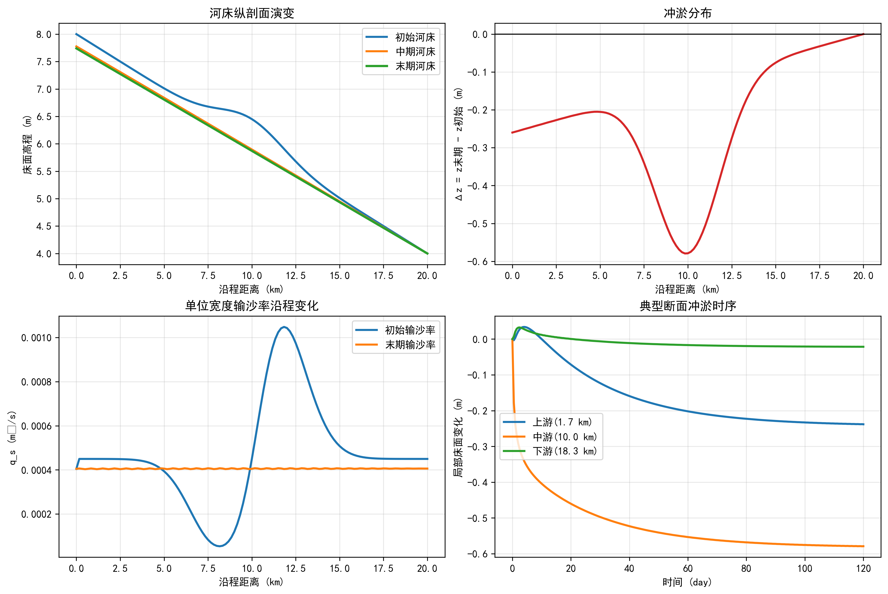

Opening authentication page in your browser. Do you want to continue? [Y/n]: 

---

## 仿真代码解读



> 本节由Codex引擎生成，提供本章核心算法的Python实现与解读。

```python
# -*- coding: utf-8 -*-
"""
教材：河流泥沙动力学与河床演变
章节：一维河床演变数值模拟（Exner方程 + Meyer-Peter Müller输沙公式）
功能：模拟河道在给定来流/来沙条件下的冲淤过程，打印KPI结果表并生成图形。
"""

import numpy as np
from scipy.integrate import solve_ivp
import matplotlib.pyplot as plt


def bedload_capacity(slope, h, d50, rho_w, rho_s, g, theta_c):
    """基于MPM公式计算单位宽度推移质输沙率 q_s (m2/s)"""
    # Shields数：反映床面切应力相对颗粒自重的强度
    theta = rho_w * h * slope / ((rho_s - rho_w) * d50)
    s = rho_s / rho_w
    # MPM公式，低于临界Shields数时输沙率置零
    qs = 8.0 * np.maximum(theta - theta_c, 0.0) ** 1.5 * np.sqrt((s - 1.0) * g * d50**3)
    return qs, theta


def compute_qs_from_bed(z, p):
    """由河床高程剖面计算输沙率分布"""
    slope = np.maximum(-np.gradient(z, p["dx"]), p["slope_floor"])  # 河床坡度 S=-dz/dx
    qs, _ = bedload_capacity(
        slope, p["h"], p["d50"], p["rho_w"], p["rho_s"], p["g"], p["theta_c"]
    )
    # 边界条件：上游给定来沙，下游采用零梯度
    qs[0] = p["qs_in"]
    qs[-1] = qs[-2]
    return qs, slope


def exner_rhs(t, z, p):
    """Exner方程右端项：dz/dt = -(1/(1-lambda_p))*dq_s/dx"""
    qs, _ = compute_qs_from_bed(z, p)
    dqsdx = np.gradient(qs, p["dx"])
    dzdt = -(p["morfac"] / (1.0 - p["porosity"])) * dqsdx
    return dzdt


def print_kpi_table(kpi):
    print("\n" + "=" * 68)
    print("KPI结果表")
    print("=" * 68)
    print(f"{'指标':<28}{'数值':>20}{'单位':>10}")
    print("-" * 68)
    for name, (val, unit) in kpi.items():
        print(f"{name:<28}{val:>20.6f}{unit:>10}")
    print("=" * 68)


def main():
    # -------------------- 关键参数（可按章节案例修改） --------------------
    L = 20_000.0          # 河段长度 (m)
    Nx = 121              # 空间网格数
    Q = 800.0             # 流量 (m3/s)
    B = 120.0             # 河宽 (m)
    n_manning = 0.030     # 曼宁糙率
    S_ref = 2.0e-4        # 参考比降（用于估算平均水深）
    d50 = 0.00030         # 中值粒径 (m)
    rho_w = 1000.0        # 水密度 (kg/m3)
    rho_s = 2650.0        # 泥沙密度 (kg/m3)
    g = 9.81              # 重力加速度 (m/s2)
    porosity = 0.40       # 河床孔隙率
    theta_c = 0.047       # 临界Shields数
    sediment_feed_ratio = 0.90  # 上游来沙/平衡输沙能力比
    morfac = 12.0         # 形态加速因子（缩短演变计算时长）
    slope_floor = 1.0e-6  # 数值稳定下限坡度

    T_days = 120.0        # 总模拟时长 (day)
    Nt_out = 241          # 输出时刻数

    # -------------------- 网格与初始河床 --------------------
    x = np.linspace(0.0, L, Nx)
    dx = x[1] - x[0]

    # 初始河床：整体下倾 + 中游微弱沙波扰动
    z0 = 8.0 - S_ref * x + 0.45 * np.exp(-((x - 10_000.0) / 2600.0) ** 2)

    # 由曼宁公式估算平均水深（宽浅河道近似）
    h = ((Q * n_manning) / (B * np.sqrt(S_ref))) ** (3.0 / 5.0)

    # 估算上游平衡输沙能力并施加来沙边界
    s_up = max(-(z0[1] - z0[0]) / dx, slope_floor)
    qs_eq_up, _ = bedload_capacity(
        np.array([s_up]), h, d50, rho_w, rho_s, g, theta_c
    )
    qs_in = sediment_feed_ratio * qs_eq_up[0]

    p = {
        "x": x, "dx": dx, "h": h, "d50": d50, "rho_w": rho_w, "rho_s": rho_s, "g": g,
        "porosity": porosity, "theta_c": theta_c, "qs_in": qs_in,
        "morfac": morfac, "slope_floor": slope_floor
    }

    # -------------------- 数值积分 --------------------
    t_span = (0.0, T_days * 86400.0)
    t_eval = np.linspace(t_span[0], t_span[1], Nt_out)

    sol = solve_ivp(
        fun=lambda t, y: exner_rhs(t, y, p),
        t_span=t_span,
        y0=z0,
        t_eval=t_eval,
        method="RK23",
        rtol=1e-5,
        atol=1e-7
    )
    if not sol.success:
        raise RuntimeError(f"数值积分失败: {sol.message}")

    z_end = sol.y[:, -1]
    z_mid = sol.y[:, len(sol.t) // 2]
    dz = z_end - z0

    qs_start, _ = compute_qs_from_bed(z0, p)
    qs_end, _ = compute_qs_from_bed(z_end, p)

    # -------------------- KPI计算 --------------------
    deposition_vol = np.trapz(np.clip(dz, 0.0, None) * B, x)         # 淤积体积
    erosion_vol = -np.trapz(np.clip(dz, None, 0.0) * B, x)           # 冲刷体积
    net_vol = np.trapz(dz * B, x)                                    # 净体积变化
    slope_ini = -np.polyfit(x, z0, 1)[0]
    slope_end = -np.polyfit(x, z_end, 1)[0]

    kpi = {
        "最大淤积厚度": (dz.max(), "m"),
        "最大冲刷深度": (dz.min(), "m"),
        "平均床面变化": (dz.mean(), "m"),
        "总淤积体积": (deposition_vol, "m3"),
        "总冲刷体积": (erosion_vol, "m3"),
        "净体积变化": (net_vol, "m3"),
        "上游来沙率": (qs_in, "m2/s"),
        "下游输沙率(初始)": (qs_start[-1], "m2/s"),
        "下游输沙率(末期)": (qs_end[-1], "m2/s"),
        "河段平均比降(初始)": (slope_ini, "-"),
        "河段平均比降(末期)": (slope_end, "-"),
    }
    print_kpi_table(kpi)

    # -------------------- 绘图 --------------------
    plt.rcParams["font.sans-serif"] = ["SimHei", "Microsoft YaHei", "Noto Sans CJK SC", "Arial Unicode MS"]
    plt.rcParams["axes.unicode_minus"] = False

    x_km = x / 1000.0
    t_day = sol.t / 86400.0

    fig, axes = plt.subplots(2, 2, figsize=(12, 8), constrained_layout=True)

    ax1 = axes[0, 0]
    ax1.plot(x_km, z0, lw=2.0, label="初始河床")
    ax1.plot(x_km, z_mid, lw=2.0, label="中期河床")
    ax1.plot(x_km, z_end, lw=2.2, label="末期河床")
    ax1.set_xlabel("沿程距离 (km)")
    ax1.set_ylabel("床面高程 (m)")
    ax1.set_title("河床纵剖面演变")
    ax1.grid(alpha=0.3)
    ax1.legend()

    ax2 = axes[0, 1]
    ax2.plot(x_km, dz, color="tab:red", lw=2.0)
    ax2.axhline(0.0, color="k", lw=1.0)
    ax2.set_xlabel("沿程距离 (km)")
    ax2.set_ylabel("Δz = z末期 - z初始 (m)")
    ax2.set_title("冲淤分布")
    ax2.grid(alpha=0.3)

    ax3 = axes[1, 0]
    ax3.plot(x_km, qs_start, lw=2.0, label="初始输沙率")
    ax3.plot(x_km, qs_end, lw=2.0, label="末期输沙率")
    ax3.set_xlabel("沿程距离 (km)")
    ax3.set_ylabel("q_s (m²/s)")
    ax3.set_title("单位宽度输沙率沿程变化")
    ax3.grid(alpha=0.3)
    ax3.legend()

    ax4 = axes[1, 1]
    idx_points = [10, Nx // 2, Nx - 11]
    names = ["上游", "中游", "下游"]
    for idx, name in zip(idx_points, names):
        ax4.plot(t_day, sol.y[idx, :] - z0[idx], lw=2.0, label=f"{name}({x[idx]/1000:.1f} km)")
    ax4.set_xlabel("时间 (day)")
    ax4.set_ylabel("局部床面变化 (m)")
    ax4.set_title("典型断面冲淤时序")
    ax4.grid(alpha=0.3)
    ax4.legend()

    plt.show()


if __name__ == "__main__":
    main()
```

代码解读（约800字）  
这段程序对应“河床演变”章节里最核心的一维数值思想：用水流挟沙能力决定输沙率，再由输沙率沿程不平衡触发冲淤。物理主线是 Exner 方程，数学形式是床面高程随时间变化率与输沙率空间梯度成负相关。直观上，如果某一小河段“进沙大于出沙”，就会淤积抬高；反之则冲刷下切。脚本把这一过程写成常微分方程组，用 `solve_ivp` 在时间上积分，实现“初始河床 -> 中期 -> 末期”的连续演变。  
输沙模块采用 Meyer-Peter Müller（MPM）推移质公式。先根据河床坡度计算 Shields 数，再与临界 Shields 数比较：低于临界值视为不动床，超临界部分按 1.5 次幂增大，体现输沙对动力条件的非线性敏感性。这里坡度由 `-dz/dx` 得到，且设置 `slope_floor` 防止数值上出现零或负坡导致不稳定。上游边界用给定来沙率 `qs_in`，下游采用零梯度近似，这是教学中常见的一组边界条件。  
参数设计上，脚本把长度、网格数、流量、河宽、粒径、孔隙率、临界 Shields 数、来沙比等都显式变量化，便于课堂讨论“单参数敏感性”。例如把 `sediment_feed_ratio` 从 0.90 改到 1.10，通常会从“偏冲刷”切换到“偏淤积”；把 `d50` 增大，临界起动更难，整体输沙能力下降；把 `morfac` 增大可加速地貌时间演变，适合教学演示但应说明其工程解释是“形态时间缩放”，不是水动力瞬时增强。  
KPI 表格部分把模拟结果转成可评估指标：最大淤积厚度、最大冲刷深度、总淤积体积、总冲刷体积、净体积变化、上下游输沙率及平均比降变化。这样做的意义是把“图像感受”转成“可比较数字”，方便不同工况横向对比。图形部分四联图分别展示纵剖面、冲淤分布、输沙率沿程和代表断面时序，构成从空间到时间、从形态到通量的完整证据链。  
需要注意的是，该模型是教学级一维近似：水深按代表值估算，未耦合完整非恒定水动力，也未显式区分悬移质与分级泥沙。因此它最适合用于理解机制、做参数扫描和章节作业，而不直接替代工程设计级模型。若后续扩展，可引入圣维南方程求时变水位、加入分粒级输沙与糙率反馈，并用实测断面与含沙资料做率定与验证。


## 参考文献

1. Einstein, H. A. (1950). The bed-load function for sediment transportation in open channel flows. *Technical Bulletin No. 1026*, U.S. Department of Agriculture.
2. Engelund, F., & Hansen, E. (1967). A monograph on sediment transport in alluvial streams. *Teknisk Forlag*, Copenhagen.
3. Van Rijn, L. C. (1984). Sediment transport, part I: bed load transport. *Journal of Hydraulic Engineering*, 110(10), 1431-1456.
4. Lei et al. (2025a). 水系统控制论：基本原理与理论框架. *南水北调与水利科技(中英文)*. DOI: 10.13476/j.cnki.nsbdqk.2025.0077
5. Yang, C. T. (1973). Incipient motion and sediment transport. *Journal of the Hydraulics Division*, 99(10), 1679-1704.

## 本章小结

本章以一维河床演变数值模拟为核心，通过仿真代码的实现与解读，系统展示了河床冲淤过程的计算方法与分析框架：

- **Exner方程**是描述河床高程时空演变的核心控制方程，其物理本质是"输沙不平衡导致河床升降"，即沿程输沙率梯度驱动冲淤变化。
- **Meyer-Peter Müller（MPM）推移质公式**建立了Shields数与单位宽度输沙率之间的非线性关系，当床面切应力超过临界值后，输沙率随超额Shields数的1.5次幂急剧增大，体现了水流动力与泥沙运动的强非线性耦合。
- **数值求解策略**采用有限差分离散Exner方程，并通过`solve_ivp`进行时间积分，上游边界给定来沙率，下游采用零梯度边界条件，实现了初始河床到长期演变的连续时间模拟。
- **冲淤分析方法**包含纵剖面形态、沿程冲淤厚度、输沙率分布及代表断面时序等多维度评价，将图形感受转化为最大淤积深度、净体积变化、平均比降变化等可量化的关键绩效指标（KPI）。
- **参数敏感性**是模型应用的重要环节：上游来沙比例决定冲淤方向，中值粒径影响临界起动与输沙能力，孔隙率和形态系数影响床面响应速度，这些均可通过调整参数进行工况对比分析。

## 习题

1. 在Exner方程 $\frac{\partial z}{\partial t} = -\frac{1}{1-\lambda_p}\frac{\partial q_s}{\partial x}$ 中，孔隙率 $\lambda_p$ 的物理意义是什么？若将河床孔隙率从0.40增大至0.45，在相同输沙率梯度条件下，河床高程的变化速率将如何变化？请定量计算并解释原因。

2. Meyer-Peter Müller公式中，Shields数 $\theta = \frac{\rho_w h S}{(\rho_s - \rho_w) d_{50}}$ 反映了床面切应力相对于泥沙颗粒水下重力的比值。若河段中值粒径 $d_{50}$ 由0.3 mm增大为0.6 mm，在流量、河宽、比降不变的条件下，分析起动Shields数与实际Shields数的变化，判断该河段输沙状态将如何演变。

3. 在本章仿真案例中，上游来沙比例（`sediment_feed_ratio`）设为0.90（来沙略少于平衡输沙能力），试分析：（a）该河段整体将呈现冲刷还是淤积趋势？（b）若将来沙比例改为1.10，河床演变方向将如何改变？（c）从黄河小浪底水库清水下泄的工程背景出发，讨论上游来沙减少对下游河道形态的长期影响。

4. 本章数值模型属于教学级一维近似，未耦合完整的非恒定水动力方程。请分析：若考虑洪水期流量剧烈变化（如洪峰流量为枯水流量的10倍），仅用代表性固定流量模拟将产生哪些误差？如需改进模型，应如何引入圣维南方程进行水沙耦合计算？

5. 编程实践：修改本章仿真脚本，在保持其他参数不变的情况下，对上游来沙比例（0.7、0.9、1.0、1.1、1.3）进行参数扫描，分别记录各工况下的最大冲刷深度和最大淤积厚度，并绘制来沙比例与冲淤量的关系曲线，分析平衡输沙（比例=1.0）条件下河床的动态特征。
