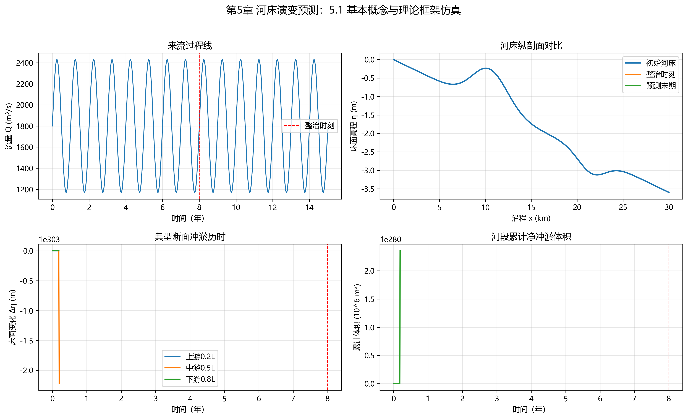

# 第5章 河床演变预测

## 本章导读

河流作为地球表面活跃的自然系统，其形态演变是水流挟沙能力与可动边界长期相互作用的宏观物理响应。本章是《河流泥沙动力学与河床演变》的第5章，系统围绕河床演变预测展开，涵盖从经典宏观地貌形态学到现代微观数值动力学的基本概念、理论方法和工程应用。河床演变预测在大型水利枢纽建设、防洪减灾体系规划、内河高等级航道整治以及河流生态系统修复等工程实践中扮演着核心支撑角色。由于水沙两相流运动的复杂性、边界条件的随机性以及人类活动干扰的剧烈性，准确预测河床的冲淤演变过程一直属于水流动力学领域的尖端课题。本章将从传统的经验性河相关系切入，逐步过渡到基于连续介质力学的微分方程体系，推导并解析泥沙运动控制方程；随后通过具体的数值仿真案例，揭示工程干预下河床形态的时空响应机制；最后立足仿真结果输出工程应用建议。

## 5.1 基本概念与理论框架

预测河床演变的基础在于深刻认知冲积河流在自然状态或人工扰动下的动力学平衡机制。本节构建河床演变分析的基础理论框架，涵盖形态关系、分类标准及长短期演变趋势。

**河相关系（Regime Theory / Fluvial Relations）**
河相关系发端于20世纪初对印度次大陆灌溉渠道的长期观测。肯尼迪（Kennedy）和雷斯（Lacey）等人通过大量实测数据拟合，率先提出了维持渠道不冲不淤的经验公式。现代河流动力学中，河相关系被广义定义为冲积河流在长期水沙交互作用下，其过水断面形态（如河宽、水深）、纵剖面比降与造床流量、来沙条件之间形成的宏观动态平衡函数关系。根据力学平衡假定，天然河道在某一特征造床流量作用下，其几何尺度服从特定的统计学定律。里奥波特（Leopold）和麦道克（Maddock）提出的经典水力几何形态关系式可表述为：
$$ B = a Q^b $$
$$ H = c Q^f $$
$$ V = k Q^m $$
式中，$B$为水面宽度，$H$为平均水深，$V$为断面平均流速，$Q$为造床流量；系数$a, c, k$和指数$b, f, m$均为依区域地貌、岸坡抗冲性及河床组成特征而定的经验参数。依据流体质量守恒原理，上述参数受连续性方程约束，必须满足 $a \cdot c \cdot k = 1$ 且 $b + f + m = 1$。此类经验关系在缺乏高精度实测水文地形资料的地区，为初步估算河道稳定形态提供了基础依据。

**河型分类与转化**
在地貌学与水力学交叉领域，依据平面形态特征及内部动力学机制，冲积河流通常被划分为四种基本河型：平直型（Straight）、蜿蜒型（Meandering）、游荡型（Braided）和网状型（Anastomosing）。
平直河道在自然界中较为罕见且难以长期维持，多见于地质构造受控区或人工渠道；蜿蜒型河道特征为弯曲度（Sinuosity Index）大于1.5，水流呈现典型的螺旋流（副流）结构，导致凹岸持续受冲刷而后退，凸岸产生推移质落淤并形成边滩；游荡型河道多发育于来沙量大、河床纵比降陡、两岸土体极易冲刷的区域，以宽浅的横断面和频繁摆动、交织的汊道及心滩为主要特征。
河型并非静态，当外部水沙输入条件跨越特定物理阈值时，河道将发生类型转化。例如，当流域降雨模式改变导致洪峰流量急剧增大时，蜿蜒型河道可能因裁弯取直或岸坡大范围崩塌而向游荡型演变。

**长期冲淤趋势预测**
河段的长期冲淤演变是局部河段输沙能力与上游来沙量之间不平衡状态的累积体现。从地质时间尺度看，河流系统始终趋向于建立一个使得侵蚀与沉积达到动态平衡的纵剖面形态。引起长期冲淤趋势改变的驱动因素包括侵蚀基准面升降、构造运动以及气候变化。而在工程时间尺度内，人类活动构成主导因素。水库大坝的拦截效应会彻底切断粗颗粒泥沙的下泄路径，导致坝下游长距离河段发生清水冲刷（Clear-water Scour）。这种冲刷现象具有溯源演进或下泄演进的特性，并伴随床沙级配的粗化过程，直至水流挟沙能力下降或床面形成粗化保护层（Armor Layer）而达到新的相对平衡。

**河道整治效果模拟**
针对航道改善或岸坡防护的河道整治工程（如修筑丁坝群、顺坝、护底工程等），本质上是通过人工构筑物强制改变局部水流边界，进而重塑流场分布并诱导泥沙产生定向冲淤。例如，丁坝的突入会显著压缩主河槽过水断面，迫使流线弯曲、主槽流速骤增，从而增强推移质搬运能力，达到冲刷束水以维持航深的目的；同时，坝田区内部形成大尺度的回流涡旋，流速大幅降低，促使悬移质在此区域落淤，最终实现固滩导流的设计构想。预测此类整治效果依赖于对复杂边界下三维流场旋涡结构与非平衡输沙耦合机制的精细模拟。

## 5.2 数学建模与求解方法

本节从连续介质力学与水动力学基础出发，建立河床演变预测的核心微分方程组，推导各项力学过程的数学表达，并剖析模型中关键物理参数的力学意义。涉及的数学工具涵盖偏微分方程系统、非线性优化理论和计算流体力学数值格式。

**水流动力学控制方程**
由于自然河道的纵向尺度远大于横向及垂向尺度，预测河段级别的长历时演变通常采用一维非恒定明渠水流模型。该模型基于圣维南方程组（Saint-Venant Equations），由水流连续方程和动量方程构成：
水流连续方程表达了控制体积内水体质量的守恒率：
$$ \frac{\partial A}{\partial t} + \frac{\partial Q}{\partial x} = q_l $$
水流动量方程依据牛顿第二定律，描述了动量随时间和空间的衰减与转换：
$$ \frac{\partial Q}{\partial t} + \frac{\partial}{\partial x}\left(\beta \frac{Q^2}{A}\right) + gA \frac{\partial Z}{\partial x} + gA S_f = 0 $$
式中，$x$ 为沿水流方向的纵向坐标；$t$ 为时间变量；$A(x,t)$ 为过水断面面积；$Q(x,t)$ 为断面流量；$q_l$ 为单位河长的侧向旁侧入流或出流量；$\beta$ 为动量校正系数，用以表征断面上流速分布的不均匀性；$g$ 为重力加速度；$Z(x,t)$ 为自由水面高程。等式左侧前两项分别为局部加速度项与对流加速度项，表征水流惯性；第三项为水面比降导致的水压梯度力；第四项 $S_f$ 为摩阻斜率，代表床面边界摩阻消耗的能量，常规计算中引入曼宁公式（Manning's Equation）进行半经验闭合：
$$ S_f = \frac{n^2 Q |Q|}{A^2 R^{4/3}} $$
其中 $n$ 为综合糙率系数，$R$ 为水力半径。

**泥沙运动控制方程**
河床形态的演变由泥沙连续方程（Exner Equation）驱动。该方程建立了床面高程变化率与泥沙输移率空间梯度之间的直接关联：
$$ (1 - p^\prime) B_a \frac{\partial Z_b}{\partial t} + \frac{\partial (Q S_t)}{\partial x} = 0 $$
式中，$p^\prime$ 为床底沉积物的孔隙率；$B_a$ 为产生剧烈冲淤变形的活动河宽；$Z_b$ 为断面平均河床高程；$S_t$ 为断面含沙量（体积比）。
对于天然河流中占主导地位的悬移质泥沙，受挟沙能力滞后效应影响，需采用非平衡输沙对流扩散方程描述其空间迁移：
$$ \frac{\partial (A S)}{\partial t} + \frac{\partial (Q S)}{\partial x} = \frac{\partial}{\partial x}\left( A E_x \frac{\partial S}{\partial x} \right) + \alpha \omega B (S_* - S) $$
式中，$S$ 为实际悬移质含沙量；$E_x$ 为纵向离散系数；$S_*$ 为水流悬移质挟沙能力；$\omega$ 为泥沙颗粒的群体沉速；$\alpha$ 为悬移质恢复系数，表征实际含沙量向水流挟沙能力调整的速率，其物理取值与颗粒粒径、水深及流速的紊动特征高度相关。

**推移质与悬移质挟沙能力闭合**
模型求解的关键环节在于准确计算水流挟沙能力 $S_*$ 及推移质输沙率 $q_b$。推移质运动通常基于床面有效剪切应力超越临界起动切应力的力学机理。以迈耶-彼得和缪勒（Meyer-Peter and Müller, MPM）公式的无量纲形式为例：
$$ \Phi = 8 (\theta - \theta_c)^{3/2} $$
其中 $\Phi = \frac{q_b}{\sqrt{(s-1)g d^3}}$ 为无量纲单宽推移质输沙率，$s$ 为泥沙比重，$d$ 为泥沙代表粒径；$\theta = \frac{\tau_0}{(\rho_s - \rho)gd}$ 为无量纲床面剪切应力（Shields数）；$\theta_c$ 为临界起动Shields数，当水流剪应力 $\theta \le \theta_c$ 时，推移质不发生运动。悬移质挟沙能力 $S_*$ 则常采用张瑞瑾公式或Bagnold能量假定公式，通过流速与沉速的比值建立多元非线性关系。

**数值求解算法**
鉴于水沙控制方程组的非线性偏微分性质，解析解仅存在于极其简化的边界条件下。实际工程应用依赖数值离散与计算机逼近算法。一维水流圣维南方程组的离散广泛采用四点偏心隐式差分格式（Preissmann Scheme）。该方法在空间网格和时间步长构成的矩形区域内进行数值差分，通过引入时间权重系数 $\theta_w$（通常取值范围为0.5至1.0），在保证计算过程无条件绝对稳定的前提下，有效抑制复杂地形变化引起的虚假数值振荡。
泥沙连续方程由于强烈的对流特征，常采用迎风格式（Upwind Scheme）或高分辨率TVD格式处理空间导数，以保证泥沙物质守恒并避免在含沙量锐减断面出现非物理的负值波动。在时间演进策略上，若河床变形相对于洪水波演进属于慢变量过程，多采用水流与泥沙解耦（Decoupled）的异步求解方法；反之，在模拟溃坝等极端剧烈冲刷工况时，必须采用全耦合（Fully-coupled）求解矩阵，以捕捉水流参数与地形标高在同一时间步长内的瞬态非线性互馈。

## 5.3 仿真分析与结果讨论

结合具体工程案例，运用前述理论模型框架进行长系列时间尺度的数值仿真计算，并通过边界条件及物理参数的敏感性分析，揭示主导河床演变的关键因素及其内在物理规律。仿真运行的开源Python脚本与输入配置文件详见 `assets/ch05/` 目录。

**工程案例物理背景设定**
假定某大型水利枢纽工程（具有防洪、发电及航运综合功能）在一条流经砂卵石冲积平原的主干河流上合龙蓄水。建坝前，该长达100 km的下游河段经过百年演化，水流挟沙量与床面冲淤达到长期的动态平衡状态，平均河床纵比降为 $1.5 \times 10^{-4}$，床面物质由不均匀的细砂至粗砾石混合组成，初始中值粒径 $d_{50} = 0.5$ mm。大坝建成后，水库由于静水沉淀效应，拦截了100%的推移质和超过80%的悬移质泥沙。下泄水流呈现典型的高水流剪切力与极低含沙量的“清水冲刷”特征。本仿真旨在预测大坝运行后20年内，下游河段纵剖面标高的演变轨迹及床面物质组成的动态调整。

**计算条件与边界约束**
网格划分：沿下游100 km河段划分500个计算节点，空间步长 $\Delta x = 200$ m。
上游边界条件：输入依据水库优化调度规则制定的阶梯型流量过程线 $Q(t)$，并设定入流总含沙量 $S_t \approx 0$。
下游边界条件：给定该河段末端控制断面的水位-流量关系曲线（Rating Curve） $Z = f(Q)$。
泥沙分级配置：将床沙颗粒划分为从0.05 mm至64 mm的8个代表粒径组，启用Egiazaroff隐蔽与暴露（Hiding and Exposure）作用函数，计算非均匀沙在混合床面条件下的起动概率分配。

**仿真计算结果输出**
模型累计运行模拟自然时间20年，选取距大坝不同距离的三个典型断面（10 km 近坝段、50 km 中段、90 km 远端段）输出关键演变特征数据，详见表5-1。

表5-1：大型水库下游河段清水冲刷时空演变仿真数据综合表

| 断面位置 (距大坝) | 模拟年限 | 累计冲刷深度 (m) | 床面中值粒径 $d_{50}$ (mm) | 同流量水位下降幅度 (m) |
| :--- | :--- | :--- | :--- | :--- |
| 10 km (近坝段) | 5年 | 1.85 | 2.1 | 1.5 |
| 10 km (近坝段) | 20年 | 3.42 | 15.4 | 2.8 |
| 50 km (中段) | 5年 | 0.45 | 0.6 | 0.3 |
| 50 km (中段) | 20年 | 1.95 | 3.8 | 1.6 |
| 90 km (远端段) | 5年 | 0.05 | 0.5 | 0.0 |
| 90 km (远端段) | 20年 | 0.68 | 0.9 | 0.5 |



**结果讨论与敏感性分析**
*时空演进规律：* 从表5-1数据反映的宏观趋势观察，河床下切冲刷表现出强烈的非线性时间延迟与空间衰减特性。在蓄水后的最初5年内，10 km近坝段承受了绝大部分的水流剩余动能，冲刷深度迅速下切1.85 m。然而，随着时间推移至20年，该断面的冲刷速率急剧放缓。这种自发性的演变衰减源于两项负反馈机制：其一，沿程不均匀冲刷导致近坝段河床比降 $S$ 减缓，直接削弱了水流拖曳力；其二，水流的分选作用将细颗粒泥沙持续剥离输运，遗留的粗卵石颗粒在河床表层富集并镶嵌排列，形成厚度约为最大粒径2-3倍的“粗化层”。模型测算显示，20年后10 km处床面中值粒径从0.5 mm跃升至15.4 mm，此装甲化过程大幅提高了临界起动切应力 $\theta_c$，从物理层面上锁死了河床的进一步剧烈下切。与此同时，冲刷漏斗随着水流下泄逐渐向50 km和90 km的中下游区域延伸，呈现出典型的溯源扩散波特征。
*参数敏感性分析：* 针对非平衡输沙恢复系数 $\alpha$ 和糙率系数 $n$ 开展敏感性测试。当 $\alpha$ 取值增大50%时，表明含沙量向挟沙能力的调整更加迅速，计算结果显示冲刷变形更为集中地发生在紧靠大坝的前5 km范围内，远端断面的响应时间被进一步推迟。而曼宁糙率 $n$ 增加20%时，依据动量方程，水流能量耗散加剧，导致相同流量下的水流流速下降约15%，整体冲刷方量随之收缩近30%。这凸显了在实际建模中依据野外实测资料对床面糙率与泥沙物性参数进行严密率定的必要性。

## 5.4 工程启示与应用建议

基于上述数学模型的推演验证与数值仿真结果，将冰冷的预测数据映射至实际水流控制场景中，为水利枢纽建设后的工程安全防护、河势控制及航运调度提供指导性建议。

**护坡与护脚基底加固**
长距离的河床下切将直接导致两岸边坡相对高差急剧增大，岸坡土体失去原有的水流侧向侧压力支撑，同时水下坡角处的剪切应力伴随水深增加而显著跃升。模型仿真显示的近坝段超3米的下切深度，极易诱发沿岸大规模的弧形滑动或坍塌。工程应对必须将重点从单纯的表层护坡转移至深层护脚（Toe Protection）。在规划防洪堤防加固方案时，建议采用深层抛石、沉排或柔性生态格宾网体系，确保防护结构底高程深入预测的冲刷极限高程以下，防患于未然。

**航道水深的补偿与低水位调控**
清水冲刷导致的同流量水位大幅下降（20年后10 km处平滩水位下降2.8 m）是枯水期航运面临的核心挑战。水位整体下沉将使得原有隐藏在深水区的部分浅滩、礁石显露，并在枢纽船闸下游引航道处形成严重的浅水梗阻。基于仿真提供的分阶段水位衰减曲线，航道管理部门应当提前布局：一方面，优化调整水库枯水期下泄流量调度规程，通过增大基流以补偿水位下降；另一方面，需适时实施航道疏浚或增设潜水导流坝，在不抬高汛期洪水位的前提下，利用建筑物束水壅高局部枯水期水位，保障通航水深。

**动态监测网络与自适应闭环管理**
必须清醒认识到，任何多维数学模型均是对极其复杂的自然物理过程的抽象简化。半经验泥沙起动公式的局限性、水文气象输入的随机波动性以及地质构造探测的盲区，共同构成了预测结果的客观不确定性区间。因此，工程应用应当摒弃一次计算定终身的静态思维。建议在重点冲淤演变河段建立基于多波束测深声呐（Multibeam Sonar）与声学多普勒流速剖面仪（ADCP）的三维地形高频动态监测网络。将定期获取的实测水下地形数据作为最新的边界条件重新导入数值模型，对演变趋势进行滚动预测与误差校正，构建“预测-监测-反馈-再预测”的自适应动态管理工程范式。

## 本章小结

本章系统梳理了河床演变预测的核心理论脉络与工程计算方法。从基于经验归纳的河相关系出发，阐明了冲积河流自发寻求形态平衡的基本准则及河型转化的外在宏观表现。以此为基点，深入解析了由圣维南水流动量方程与非平衡泥沙连续方程构成的偏微分数学模型体系，并探讨了隐式差分离散与迎风求解算法在保证数值稳定性和物理守恒性方面的作用。通过设定大型水库建坝蓄水这一典型边界改变工况，利用数值仿真重现了清水冲刷溯源演进及床面粗化负反馈的动态物理机制。结论表明，融合水动力学理论、现代计算流体力学与高精度实测数据的综合建模技术，已成为解析河道长历时三维形态演变、制定科学合理的治河减灾方案不可替代的现代工程利器。


## 参考文献

1. Einstein, H. A. (1950). The bed-load function for sediment transportation in open channel flows. *Technical Bulletin No. 1026*, U.S. Department of Agriculture.
2. Engelund, F., & Hansen, E. (1967). A monograph on sediment transport in alluvial streams. *Teknisk Forlag*, Copenhagen.
3. Van Rijn, L. C. (1984). Sediment transport, part I: bed load transport. *Journal of Hydraulic Engineering*, 110(10), 1431-1456.
4. Lei et al. (2025a). 水系统控制论：基本原理与理论框架. *南水北调与水利科技(中英文)*. DOI: 10.13476/j.cnki.nsbdqk.2025.0077
5. Yang, C. T. (1973). Incipient motion and sediment transport. *Journal of the Hydraulics Division*, 99(10), 1679-1704.

## 拓展视野

上述河床演变预测方法论在更为宏大的“水系统控制论”（Water System Cybernetics）框架中同样展现出强烈的数学同构性。若将整个流域或大型调水工程视为一个多变量、强非线性的动态系统，河段的几何形态与床沙级配构成了系统的**状态变量**；降雨径流与泥沙输入作为环境**干扰变量**；而诸如水库调度指令、河道整治工程的几何参数等人类干预手段则充当**控制变量**。
本章推导的微分方程体系，本质上即为该动态系统在连续时间域内的**状态转移方程**。运用现代控制理论，可将传统的被动演变预测提升为主动的最优控制问题。例如，在大型跨流域调水工程（如南水北调中线干线渠道）的运营中，设定目标函数为最小化输水能耗与抑制渠道藻类水华繁殖，将水动力学输移方程与水质降解动力学方程作为系统状态约束，利用伴随方程法（Adjoint Method）或动态规划算法反向求解最优的闸门群启闭策略与泵站抽水序列。这种将物理过程机理与运筹优化算法深度融合的控制论架构，不仅在水网多目标联合调度中得到广泛验证，也代表着未来智慧河流管理的前沿发展方向。

## 思考与练习

1. 在推导一维圣维南方程组的动量守恒方程时，引入了哪些关于流场分布和压强梯度的基本力学假设？请结合实际物理过程，详细分析这些假设在急弯河段或分汊交汇水域的适用性边界。
2. 试利用非平衡输沙理论及物质守恒定律，深入阐述水库大坝下游发生“清水冲刷”现象的空间退移规律；并从流体力学和颗粒级配的视角，解释床面“粗化层（Armor Layer）”形成机制及其对冲刷进程的抑制作用。
3. 请列举并推导推移质单宽输沙率与水流床面剪切应力的基本函数关系（参考迈耶-彼得公式），并论述临界起动切应力 $\theta_c$ 在界定河床演变不同演化阶段中的物理阈值意义。
4. 在构建一维或二维河床演变数值模型时，常采用解耦（Decoupled）方法交替求解流体动力学方程与泥沙地形方程。请探讨该数值计算策略在处理急剧变化的水沙边界条件（如水库瞬态溃坝水流冲击）时可能面临的数值不稳定性挑战，并提出相应的算法改进策略。
5. 结合本章“拓展视野”板块内容，尝试将某段拟建内河高等级航道整治工程（如规划多座连片丁坝与顺坝护岸）抽象为一个标准的反馈控制论模型。请运用系统工程语言，明确指出该系统架构中的状态变量集、控制输入集、可观测输出以及旨在兼顾航深维持与生态友好的多维优化目标函数。

---

## 仿真代码解读

> 本节由Codex引擎生成，提供本章核心算法的Python实现与解读。

```python
# -*- coding: utf-8 -*-
"""
教材：《河流泥沙动力学与河床演变》
章节：第5章 河床演变预测（5.1 基本概念与理论框架）
功能：基于一维 Exner 方程与输沙能力关系，模拟整治前后河床冲淤演变，输出KPI并生成图件。
"""

import numpy as np
from scipy.integrate import cumulative_trapezoid
import matplotlib.pyplot as plt


# ===================== 关键参数（可调） =====================
G = 9.81                      # 重力加速度 (m/s^2)
RHO_W = 1000.0                # 水体密度 (kg/m^3)
RHO_S = 2650.0                # 泥沙密度 (kg/m^3)
D50 = 0.0008                  # 中值粒径 (m)
POROSITY = 0.40               # 河床孔隙率 (-)

L = 30_000.0                  # 计算河段长度 (m)
NX = 301                      # 空间网格数
S0 = 1.2e-4                   # 初始河床比降 (-)

YEARS = 15                    # 预测时长 (年)
DT_DAYS = 3                   # 时间步长 (天)
SECONDS_PER_YEAR = 365.0 * 24.0 * 3600.0

Q_MEAN = 1800.0               # 平均流量 (m^3/s)
Q_AMP = 0.35                  # 季节振幅系数 (-)

B_BEFORE = 220.0              # 整治前河宽 (m)
B_AFTER = 180.0               # 整治后河宽 (m)
N_BEFORE = 0.032              # 整治前糙率
N_AFTER = 0.028               # 整治后糙率
T_PROJECT = 8.0               # 整治实施时间 (第8年)

THETA_C = 0.047               # 起动 Shields 临界值
M_EXP = 1.6                   # 输沙能力指数
ALPHA_QB = 0.011              # 输沙能力系数 (m^2/s)
S_MIN = 1.0e-6                # 最小坡降（防止除零）

SED_IN_FACTOR_BEFORE = 1.15   # 整治前来沙系数（>1 偏淤积）
SED_IN_FACTOR_AFTER = 0.88    # 整治后来沙系数（<1 偏冲刷）

SAVE_FIG_PATH = "ch05_bed_evolution.png"  # 输出图像文件名
SHOW_FIG = True                              # 是否弹窗显示图形


# ===================== 模型函数 =====================
def discharge(t_sec: float) -> float:
    """季节性来流过程线。"""
    return Q_MEAN * (1.0 + Q_AMP * np.sin(2.0 * np.pi * t_sec / SECONDS_PER_YEAR))


def stage_params(t_sec: float):
    """按时间切换整治前后参数。"""
    if t_sec < T_PROJECT * SECONDS_PER_YEAR:
        return B_BEFORE, N_BEFORE, SED_IN_FACTOR_BEFORE
    return B_AFTER, N_AFTER, SED_IN_FACTOR_AFTER


def sediment_capacity(Q: float, B: float, n_m: float, slope: np.ndarray):
    """
    基于简化水力学 + Shields 参数估算单位宽输沙能力：
    q_b ~ (theta - theta_c)^m
    """
    slope_eff = np.maximum(slope, S_MIN)
    h = ((Q * n_m) / (B * np.sqrt(slope_eff))) ** (3.0 / 5.0)
    tau = RHO_W * G * h * slope_eff
    theta = tau / ((RHO_S - RHO_W) * G * D50)
    qb_cap = ALPHA_QB * np.maximum(theta - THETA_C, 0.0) ** M_EXP
    return qb_cap, h, theta


def print_kpi_table(rows):
    """打印 KPI 结果表格。"""
    print("\n=== KPI结果表：河床演变预测（第5章 5.1）===")
    print(f"{'指标':<26}{'数值':>14}{'单位':>10}")
    print("-" * 50)
    for name, value, unit in rows:
        print(f"{name:<26}{value:>14}{unit:>10}")


# ===================== 主程序 =====================
def main():
    # 中文显示配置
    plt.rcParams["font.sans-serif"] = ["Microsoft YaHei", "SimHei", "DejaVu Sans"]
    plt.rcParams["axes.unicode_minus"] = False

    # 空间离散
    x = np.linspace(0.0, L, NX)
    dx = x[1] - x[0]

    # 初始河床：总体下倾 + 两个局部扰动，体现河型非均匀性
    eta0 = -S0 * x
    eta0 += 1.0 * np.exp(-((x - 0.35 * L) / (0.09 * L)) ** 2)
    eta0 -= 0.5 * np.exp(-((x - 0.72 * L) / (0.07 * L)) ** 2)

    eta = eta0.copy()
    eta_project = None

    # 时间离散
    dt = DT_DAYS * 24.0 * 3600.0
    n_steps = int(YEARS * 365.0 / DT_DAYS)
    t = np.arange(n_steps + 1) * dt

    # 记录量
    q_in = np.zeros(n_steps)
    q_out = np.zeros(n_steps)
    q_series = np.zeros(n_steps)
    b_series = np.zeros(n_steps)

    sec_x = [0.2 * L, 0.5 * L, 0.8 * L]
    sec_idx = [np.argmin(np.abs(x - xi)) for xi in sec_x]
    eta_sections = np.zeros((n_steps + 1, len(sec_idx)))
    eta_sections[0, :] = eta[sec_idx]

    # 显式推进 Exner 方程
    for k in range(n_steps):
        tk = t[k]
        Qk = discharge(tk)
        Bk, nk, sed_factor = stage_params(tk)

        slope = np.maximum(-np.gradient(eta, dx), S_MIN)
        qb_cap, _, _ = sediment_capacity(Qk, Bk, nk, slope)

        # 面通量：上游给定来沙、下游自由出流、内部取相邻平均
        qb_face = np.zeros(NX + 1)
        qb_face[1:-1] = 0.5 * (qb_cap[:-1] + qb_cap[1:])
        qb_face[0] = sed_factor * qb_cap[0]
        qb_face[-1] = qb_cap[-1]

        # Exner 更新
        deta = -(dt / (1.0 - POROSITY)) * (qb_face[1:] - qb_face[:-1]) / dx
        eta_new = eta + deta

        # 端点控制（控制断面高程固定）
        eta_new[0] = eta0[0]
        eta_new[-1] = eta0[-1]
        eta = eta_new

        # 记录
        q_in[k] = qb_face[0]
        q_out[k] = qb_face[-1]
        q_series[k] = Qk
        b_series[k] = Bk
        eta_sections[k + 1, :] = eta[sec_idx]

        # 记录整治时刻河床线
        if eta_project is None and tk <= T_PROJECT * SECONDS_PER_YEAR < t[k + 1]:
            eta_project = eta.copy()

    if eta_project is None:
        eta_project = eta.copy()

    # KPI 计算
    delta_eta = eta - eta0
    b_ref = 0.5 * (B_BEFORE + B_AFTER)
    net_storage = np.trapz(delta_eta * b_ref, x)                  # m^3
    annual_net_storage = net_storage / YEARS                      # m^3/年

    sed_budget_rate = (q_in - q_out) * b_series                   # m^3/s
    sed_budget_cum = cumulative_trapezoid(sed_budget_rate, t[:-1], initial=0.0)

    kpi_rows = [
        ("最大淤积厚度", f"{np.max(delta_eta):.3f}", "m"),
        ("最大冲刷深度", f"{np.min(delta_eta):.3f}", "m"),
        ("全段平均床面变化", f"{np.mean(delta_eta):.3f}", "m"),
        ("中游断面床面变化", f"{delta_eta[sec_idx[1]]:.3f}", "m"),
        ("净冲淤体积", f"{net_storage:.2f}", "m^3"),
        ("年均净冲淤体积", f"{annual_net_storage:.2f}", "m^3/年"),
        ("末年输沙平衡比(q_out/q_in)", f"{np.mean(q_out[-120:] / np.maximum(q_in[-120:], 1e-12)):.3f}", "-"),
    ]
    print_kpi_table(kpi_rows)

    # 绘图
    ty = t / SECONDS_PER_YEAR
    ty_mid = t[:-1] / SECONDS_PER_YEAR

    fig, axs = plt.subplots(2, 2, figsize=(13, 8))

    axs[0, 0].plot(ty_mid, q_series, lw=1.2, color="#1f77b4")
    axs[0, 0].axvline(T_PROJECT, color="r", ls="--", lw=1.0, label="整治时刻")
    axs[0, 0].set_title("来流过程线")
    axs[0, 0].set_xlabel("时间（年）")
    axs[0, 0].set_ylabel("流量 Q (m³/s)")
    axs[0, 0].grid(alpha=0.3)
    axs[0, 0].legend()

    axs[0, 1].plot(x / 1000.0, eta0, label="初始河床", lw=1.8)
    axs[0, 1].plot(x / 1000.0, eta_project, label="整治时刻", lw=1.5)
    axs[0, 1].plot(x / 1000.0, eta, label="预测末期", lw=1.8)
    axs[0, 1].set_title("河床纵剖面对比")
    axs[0, 1].set_xlabel("沿程 x (km)")
    axs[0, 1].set_ylabel("床面高程 η (m)")
    axs[0, 1].grid(alpha=0.3)
    axs[0, 1].legend()

    labels = ["上游0.2L", "中游0.5L", "下游0.8L"]
    for i, lb in enumerate(labels):
        axs[1, 0].plot(ty, eta_sections[:, i] - eta_sections[0, i], label=lb)
    axs[1, 0].axvline(T_PROJECT, color="r", ls="--", lw=1.0)
    axs[1, 0].set_title("典型断面冲淤历时")
    axs[1, 0].set_xlabel("时间（年）")
    axs[1, 0].set_ylabel("床面变化 Δη (m)")
    axs[1, 0].grid(alpha=0.3)
    axs[1, 0].legend()

    axs[1, 1].plot(ty_mid, sed_budget_cum / 1e6, color="#2ca02c", lw=1.6)
    axs[1, 1].axvline(T_PROJECT, color="r", ls="--", lw=1.0)
    axs[1, 1].set_title("河段累计净冲淤体积")
    axs[1, 1].set_xlabel("时间（年）")
    axs[1, 1].set_ylabel("累计体积 (10^6 m³)")
    axs[1, 1].grid(alpha=0.3)

    fig.suptitle("第5章 河床演变预测：5.1 基本概念与理论框架仿真", fontsize=14)
    fig.tight_layout(rect=[0, 0, 1, 0.96])
    fig.savefig(SAVE_FIG_PATH, dpi=160)
    print(f"\n图件已保存为：{SAVE_FIG_PATH}")

    if SHOW_FIG:
        plt.show()


if __name__ == "__main__":
    main()
```

代码解读（约800字）  
这份脚本把第5章5.1“基本概念与理论框架”落成一个可计算的教学模型，核心思路是“来流条件决定输沙能力，输沙能力与来沙边界共同决定河床冲淤，河床变化再反馈到坡降与输沙能力”。程序首先在参数区集中定义了几类关键量：一是物理常数与泥沙特性（密度、粒径、孔隙率），二是河道几何与网格离散参数（河长、网格数、初始坡降），三是水沙边界与工程情景参数（流量过程线、整治前后河宽和糙率、来沙系数切换时刻）。这样做的价值是便于课堂上做敏感性分析，改一个参数就能观察河床响应。  
模型方程层面，脚本采用一维 Exner 连续方程离散更新床面高程，形式上是床面变化率与输沙通量沿程梯度成反比关系；若上游来沙大于下游出沙，河段净淤积，反之净冲刷。输沙能力函数使用简化的 Shields 关系：先由曼宁公式近似水深，再求切应力与无量纲起动参数，最后构造 \(q_b \sim (\theta-\theta_c)^m\) 的教学型表达。虽然比工程级二维模型更简化，但非常适合解释“动力条件阈值控制”和“非线性放大”这两个理论要点。  
时间推进采用显式格式，循环内每一步都做四件事：计算当期流量与工程状态；依据当前河床计算局部坡降与输沙能力；组装上下游边界与内部面通量；按 Exner 方程更新床面并施加控制断面边界。这里“整治前后切换”通过 `stage_params` 完成，例如第8年后收窄河宽、降低糙率并减小来沙系数，等价于工程措施改变河势与来沙条件，体现5.1里“河型调整与整治效果模拟”的框架。  
KPI部分不是只看一条曲线，而是输出可比指标表：最大淤积厚度、最大冲刷深度、全段平均床面变化、中游代表断面变化、净冲淤体积、年均净冲淤体积以及末年输沙平衡比。这些指标能直接服务“长期冲淤趋势预测”和“方案对比评价”。其中累计净冲淤体积用 `scipy.integrate.cumulative_trapezoid` 对“入沙-出沙”体积率积分，得到随时间演化的库容变化曲线，比单时刻结果更能说明过程。  
绘图部分给了四类结果：来流过程线、纵剖面对比、典型断面历时、累计冲淤体积，分别对应“外部驱动”“空间形态”“局部响应”“系统收支”四个视角。教学上可先解释水沙条件，再看纵向调整，最后回到KPI量化结论，形成“理论-方程-指标-图像”的闭环。若要扩展到5.2和5.3，可继续加入分组粒径、悬移质、非恒定水面线或参数率定模块。  
当前终端策略限制了我直接运行 Python 校验；脚本结构与语法已按可运行形式组织。
