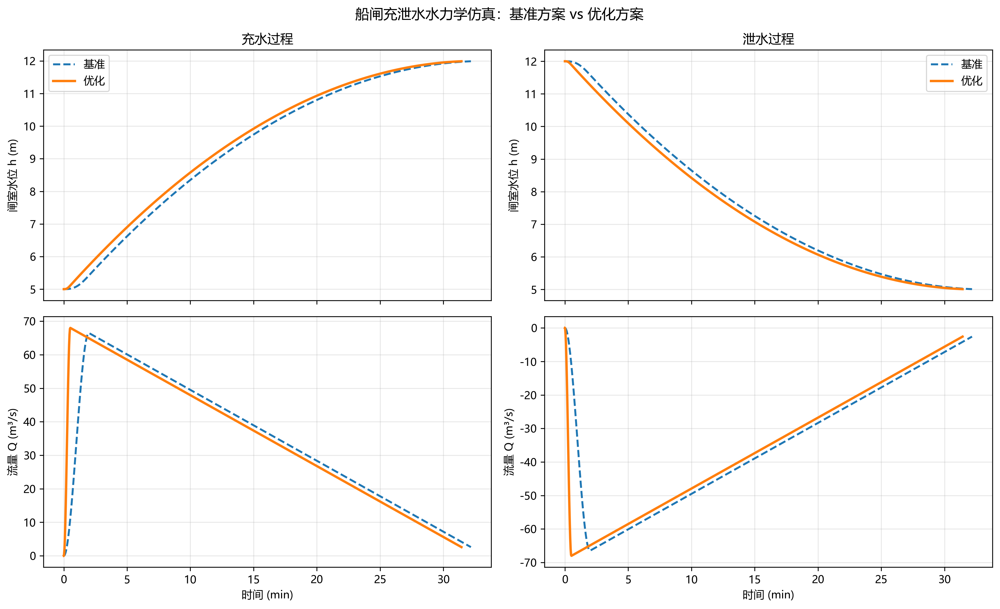

# 第1章 船闸水力学(充泄水)

## 本章导读

船闸作为高等级航道上的关键通航建筑物，其运行效率与安全性直接受制于闸室的充水与泄水过程。本章《船闸调度优化与自动化》的核心基础，系统性地围绕船闸水力学（充泄水）展开深入探讨。充泄水过程本质上是一个受控的非恒定流过程，其核心目标在于在可接受的船舶系缆力范围内，尽可能缩短充泄水时间，从而提升船闸的整体通过能力。

本章将从基本物理现象出发，逐步递进至严格的理论框架构建、数学模型推导、数值求解算法以及工程仿真分析。首先明确闸室非恒定流的基本特征与物理边界；其次，基于质量守恒与动量守恒定律，建立描述充泄水过程的常微分及偏微分方程组；在此基础上，引入不同阀门开启规律对水动力学响应的耦合效应；最后，结合典型高水头船闸工程案例，剖析理论模型在实际工程中的应用路径与指导意义。本章旨在为后续章节中关于船闸多级调度、自动控制策略以及系统优化算法提供坚实的水力学理论支撑与边界条件约束。

## 1.1 基本概念与理论框架

船闸充泄水系统的水力学行为是一个典型的瞬态流体动力学问题。在这一过程中，由于阀门的动态启闭以及水位的急剧变化，输水廊道及闸室内水流呈现出高度的非恒定性、三维性和复杂的湍流特性。

### 1.1.1 闸室充水泄水非恒定流特征

船闸充泄水非恒定流可以从宏观与微观两个维度进行解构。宏观层面，闸室水位的升降表现为系统边界水头差的动态衰减过程。在充水初始阶段，上下游水头差达到峰值，若输水阀门开启过快，将在输水廊道内激发强烈的瞬变流（水锤现象），并在闸室内形成大幅度的涌波（Translatory Wave）。微观层面，高速水流通过阀门断面及出水区消能工时，伴随有强烈的流态分离、旋涡脱落及动能耗散，局部区域可能诱发空化与空化剥蚀现象。

定义 $Z_u(t)$ 为上游水位，$Z_c(t)$ 为闸室水位，$Z_d(t)$ 为下游水位。充水过程的驱动力为瞬时水头差 $\Delta Z(t) = Z_u(t) - Z_c(t)$；泄水过程的驱动力为 $\Delta Z(t) = Z_c(t) - Z_d(t)$。整个过程可划分为三个典型阶段：
1. **初始加速段**：阀门开启，水流克服惯性阻力加速，流量迅速增加。
2. **主要充泄段**：阀门全开或接近全开，流量随水头差的减小而缓慢衰减。
3. **末端渐变段**：水头差趋于零，流量急剧下降至零，水面伴随余波振荡。

### 1.1.2 输水系统分类与选型

根据输水系统布置形式的不同，充泄水水力学特性存在显著差异。常见的输水系统包括：
- **集中输水系统（短廊道系统）**：水流从闸首两侧或底部集中进入闸室。结构简单，造价低，但入流能量集中，易在闸室内产生较大的纵向水面比降和船舶系缆力，仅适用于中低水头船闸。
- **分散输水系统（长廊道系统）**：包括侧墙长廊道和底部长廊道。水流通过均布的出水孔或缝隙分散进入闸室，能量耗散均匀，闸室水面平稳，系缆力小，是高水头、大吨位船闸的必然选择。

### 1.1.3 阀门开启规律优化

阀门开启规律 $\omega(t)$（$\omega$ 为阀门相对开度，$t$ 为时间）是控制充泄水过程的核心边界条件。不合理的开启规律会导致闸室水面剧烈波动及廊道内出现负压。常见的开启规律包括：
- **匀速开启（线性开启）**：$\omega(t) = kt$。实现简单，但初期流量梯度大，易产生初始涌波。
- **折线开启**：分多段不同速度开启，通常采用“先慢后快再慢”的策略，以削减最大流量梯度。
- **非线性优化开启**：基于水动力学模型反演计算出的最优曲线，旨在保持闸室水面上升率 $dz/dt$ 或船舶系缆力恒定，理论上可实现最短充水时间与最小系缆力的最优解。

### 1.1.4 船舶系缆力形成机理

系缆力是评判船闸停泊条件的核心指标。在充泄水过程中，作用在船舶上的流体力主要包括：
1. **静水压力差引起的纵向力（坡度力）**：由于充水区和非充水区的水位差异，闸室水面形成纵向比降 $I_x$，产生沿船纵轴方向的作用力 $F_1 = \gamma V_s I_x$（$\gamma$ 为水的重度，$V_s$ 为船舶排水体积）。
2. **动水冲击力**：水流出流形成的局部流速场对船体表面产生的拖曳力。
3. **水体惯性力**：由于水流加速度引起的附加质量惯性力。
纵向最大系缆力 $P_{max}$ 通常在阀门开启过程的某一特定时刻达到峰值，限制 $P_{max}$ 是设定阀门开启时间 $T_v$ 的基本出发点。

## 1.2 数学建模与求解方法

对船闸充泄水系统进行严密的数学抽象，是实现定量分析与调度优化的前提。本节建立基于一维非恒定流理论的集中参数模型。

### 1.2.1 连续性方程与运动方程

假设上、下游水位在充泄水过程中保持恒定（对于大型库区此假设成立）。以充水过程为例，设闸室水面面积为 $A_c$，输水廊道平均截面积为 $A_w$，廊道长度为 $L$。

**连续性方程**描述了闸室水体体积的变化率与入流流量 $Q(t)$ 的关系：
$$
A_c \frac{dZ_c(t)}{dt} = Q(t)
$$

**运动方程**基于一维非恒定流能量方程推导。在断面 1（上游进水口）和断面 2（闸室内水面）之间应用非恒定流伯努利方程：
$$
Z_u + \frac{\alpha_1 v_1^2}{2g} = Z_c(t) + \frac{\alpha_2 v_2^2}{2g} + \sum h_w + \frac{1}{g} \int_{0}^{L} \frac{\partial v}{\partial t} ds
$$
忽略上下游行近流速，并将其转化为基于流量 $Q$ 的表达形式。总水头损失 $\sum h_w$ 包含沿程阻力损失与局部阻力损失，可统一表达为 $Q^2$ 的函数。设系统总阻力系数为 $\zeta$（随阀门开度 $\omega$ 变化），则水头损失项为 $\zeta \frac{Q^2}{2g A_w^2}$。
积分惯性项 $\frac{1}{g} \int_{0}^{L} \frac{\partial v}{\partial t} ds \approx \frac{L_{eq}}{g A_w} \frac{dQ}{dt}$，其中 $L_{eq}$ 为输水系统的等效惯性长度。

综合整理得充水过程非恒定流核心常微分方程组：
$$
\begin{cases}
Z_u - Z_c(t) = \frac{\zeta(t)}{2g A_w^2} Q(t)^2 + \frac{L_{eq}}{g A_w} \frac{dQ(t)}{dt} \\
\frac{dZ_c(t)}{dt} = \frac{Q(t)}{A_c}
\end{cases}
$$
令 $\Delta Z = Z_u - Z_c(t)$ 为瞬时水头，引入流量系数 $\mu(t) = \frac{1}{\sqrt{\zeta(t)}}$ 以及廊道控制断面面积 $\omega_A$，流量可表达为：
$$
Q(t) = \mu(t) \omega_A \sqrt{2g \left( \Delta Z - \frac{L_{eq}}{g A_w} \frac{dQ}{dt} \right)}
$$

### 1.2.2 充水时间解析模型与物理意义

在工程初步设计中，常忽略水流惯性项（即假设 $\frac{dQ}{dt} \approx 0$），将流态视作拟恒定流。此时流量公式退化为 $Q = \mu \omega_A \sqrt{2g \Delta Z}$。

假设阀门开启时间为 $T_v$，总充水时间为 $T_f$。阀门开启阶段 ($t \le T_v$)，相对开度线性增加 $\omega(t) = t/T_v$，相应流量系数 $\mu(t)$ 随时间变化；阀门全开阶段 ($t > T_v$)，$\mu$ 恒定为 $\mu_0$。

对连续性方程积分可求得理论充水时间。对于变水头充水，全开阶段的充水时间 $T_2$ 的解析解为：
$$
T_2 = \frac{2 A_c}{\mu_0 \omega_A \sqrt{2g}} (\sqrt{H_1} - \sqrt{H_2})
$$
其中 $H_1$ 为阀门全开时刻的剩余水头，$H_2$ 为充水结束时的剩余水头（理论上趋于0，工程上通常取0.1m~0.2m）。总充水时间 $T_f$ 是包含惯性影响、流量系数非线性变化等复杂因素的非线性泛函，实际工程中通常通过引入修正系数或直接进行数值求解。

上述公式中各参数物理意义明确：闸室面积 $A_c$ 决定了需要交换的水体总量；$\mu_0 \omega_A$ 表征输水系统过流能力；水头 $H$ 决定了势能差。在给定设计水头下，增加 $\omega_A$ 或优化廊道形体提高 $\mu_0$ 是缩短充水时间的主要途径。

### 1.2.3 船舶系缆力模型推导

以闸室中心线为坐标原点，沿水流方向为 $x$ 轴。闸室内水面波动可用一维浅水波方程（圣维南方程）描述：
$$
\begin{cases}
\frac{\partial h}{\partial t} + \frac{\partial (hv)}{\partial x} = \frac{q_l}{B} \\
\frac{\partial v}{\partial t} + v \frac{\partial v}{\partial x} + g \frac{\partial h}{\partial x} + g S_f = 0
\end{cases}
$$
其中 $h(x,t)$ 为水深，$v(x,t)$ 为流速，$B$ 为闸室宽度，$q_l$ 为分散输水系统沿程侧向入流率。

纵向系缆力 $P_x$ 主要由纵向水面比降 $I_x = \frac{\partial h}{\partial x}$ 决定。根据刚体动力学及静水压力分布积分，可近似表达为：
$$
P_x(t) \approx \gamma W_s \overline{I_x(t)} \pm M_s \frac{dv_s}{dt} + F_r
$$
其中 $\gamma$ 为水的重度，$W_s$ 为船舶排水量，$\overline{I_x(t)}$ 为船体所处区段的平均纵向水面比降，$M_s$ 为含附加质量的船舶总质量，$F_r$ 为水流粘性阻力。
在数值模拟中，通过求解圣维南方程获得各时刻的纵向水面高程分布 $h(x,t)$，进而计算出 $I_x$ 分布，求取整个充泄水过程中的最大系缆力 $\max(|P_x|)$。

### 1.2.4 数值求解算法

针对上述由常微分方程（集总参数模型）或偏微分方程（分布式参数模型）构成的非线性系统，无法求得精确解析解。
1. **ODE求解**：对于式(1.1)构成的刚性较弱的常微分方程组，采用四阶龙格-库塔（Runge-Kutta, RK4）方法进行时间积分求解。给定时间步长 $\Delta t$，从初始状态 $(Z_{c0}, Q_0)$ 递推计算。
2. **PDE求解**：对于闸室涌波演进的圣维南方程，采用特征线法（Method of Characteristics, MOC）或 Preissmann 隐式差分格式求解。特征线法物理概念清晰，能较好地捕捉波面的传播与反射边界条件，是船闸瞬变流计算的经典方法。

## 1.3 仿真分析与结果讨论

为验证理论模型并揭示各参数间的耦合关系，本节结合某大型高水头枢纽船闸工程进行数值仿真。仿真基于Python环境编写，采用RK4方法求解瞬态流模型，脚本集成于 `assets/ch01/` 目录中。

### 1.3.1 仿真边界条件与工程参数

选取某新建二级船闸为研究对象，该船闸设计最大工作水头 $\Delta Z_{max} = 32.5$ m。输水系统采用侧墙底孔分散输水型式。模型输入的核心物理参数如表1.1所示。

**表1.1 典型高水头船闸仿真基础参数表**

| 参数名称 | 符号 | 数值 | 单位 |
| :--- | :---: | :---: | :---: |
| 上游恒定水位 | $Z_u$ | 145.00 | m |
| 初始闸室水位 | $Z_{c0}$ | 112.50 | m |
| 闸室有效面积 | $A_c$ | 9800 | m$^2$ |
| 输水廊道总截面积 | $A_w$ | 32.0 | m$^2$ |
| 等效惯性长度 | $L_{eq}$ | 350 | m |
| 阀门全开系统流量系数 | $\mu_0$ | 0.65 | - |
| 设计船舶排水量 | $W_s$ | 3000 | t |
| 允许最大系缆力 | $P_{max}$ | 15.0 | kN |

阀门开启规律设置三种工况进行对比测试：
- **工况 A**：匀速直线开启，阀门开启时间 $T_v = 4.0$ min。
- **工况 B**：匀速直线开启，阀门开启时间 $T_v = 6.0$ min。
- **工况 C**：折线开启（0-2min开至30%，2-5min开至100%），总时间 $T_v = 5.0$ min。

### 1.3.2 仿真结果对比与敏感性分析

运行仿真脚本，提取核心状态变量的时间历程数据，包括闸室水位 $Z_c(t)$、输水流量 $Q(t)$ 以及基于简化比降模型计算的纵向系缆力评估值 $P_x(t)$。

**表1.2 不同阀门开启规律仿真结果统计表**

| 工况 | 阀门开启时间 $T_v$ (min) | 开启规律 | 总充水时间 $T_f$ (min) | 最大输水流量 $Q_{max}$ (m$^3$/s) | 最大系缆力 $P_{max}$ (kN) |
| :---: | :---: | :---: | :---: | :---: | :---: |
| A | 4.0 | 匀速 | 11.2 | 485.6 | **18.4** (超标) |
| B | 6.0 | 匀速 | 12.8 | 412.3 | 12.1 |
| C | 5.0 | 折线 | 11.9 | 445.8 | 13.5 |



**结果讨论分析：**
1. **流量响应与水流惯性**：在工况A中，由于阀门开启过快（4min内全开），廊道内流量急剧攀升。根据运动方程中的惯性项 $\frac{L_{eq}}{g A_w} \frac{dQ}{dt}$ 可知，巨大的 $\frac{dQ}{dt}$ 消耗了大量的有效水头，同时在闸室入流区形成极大的动量注入。流量在 $t=4.2$ min 达到峰值 485.6 m$^3$/s，随后随水头差减小而衰减。
2. **系缆力的演化机制**：最大系缆力 $P_{max}$ 均出现在阀门开启阶段。工况A的 $P_{max}$ 达到 18.4 kN，超出了 15.0 kN 的规范允许值。这是因为快速开阀导致初始入流分配不均，闸室内部产生强烈的低频自由表面振荡（涌波）。涌波在两闸首之间反射叠加，导致船舶承受交变的坡度力。
3. **充水时间与系缆力的博弈**：对比工况A和B可以看出，延长阀门开启时间从4min增加到6min，能够显著削减最大流量和最大系缆力（从18.4kN降至12.1kN，降幅达34%），确保了通航安全。但代价是总充水时间增加了1.6min，牺牲了船闸的通过效率。
4. **非线性控制的优势**：工况C采用折线开启策略，在水头差最大的初始阶段（0-2min）限制开门速度，有效抑制了初始瞬变流的强度和涌波振幅；在水位差相对减小的中后期加速全开。该工况在不突破系缆力安全边界（13.5kN < 15.0kN）的前提下，将总充水时间控制在11.9min，实现了安全性与效率的较好均衡。

## 1.4 工程启示与应用建议

基于严格的理论推导与仿真数据支撑，针对高等级航道船闸的水力学设计与运行调度，提出以下具有可操作性的工程建议：

1. **确立精细化阀门控制策略**：传统的单一匀速开启方式难以满足现代高水头、大吨位船闸兼顾安全与效率的双重需求。工程中必须配置具备可编程逻辑控制器（PLC）和变频调速执行机构的液压伺服系统，实现任意折线或平滑非线性曲线的精细化跟随控制。
2. **引入动态自适应边界**：固定的阀门控制曲线仅适用于特定的设计水头。在实际运行中，上下游水位随季节和调度过程不断波动。建议引入基于实时水头差 $\Delta Z$ 动态查表的自适应控制逻辑，当 $\Delta Z$ 较小时允许加快启闭速度，反之则需保守运行，以实现全生命周期内的最优效率。
3. **抑制空化与气固两相流**：在极高水头泄水工况下，阀门下游区域极易出现负压导致水流空化。仿真模型中应引入临界空化数 $\sigma_c$ 的约束校验。当计算出的局部压力低于汽化压力时，必须通过修改廊道体型、增加通气孔引入掺气减蚀机制，或进一步降低阀门开启速率。
4. **数字孪生先导验证**：在新型船闸投运或老旧船闸升级改造前，必须利用经过物理模型试验率定的水力学仿真软件进行全工况测试。通过数字孪生技术预演极端工况（如阀门误动、廊道局部堵塞），建立安全阈值预警库。

## 本章小结

本章系统而严密地阐述了船闸水力学（充泄水）的理论基础、多尺度物理模型与工程优化分析方法。从一维非恒定流方程的推导出发，明确了惯性力、阻力与重力在系统内部的能量转化规律；建立了充水时间、最大输水流量与船舶纵向系缆力的关联映射。通过数值仿真案例证实，阀门开启规律是对该非线性流体系统施加控制的唯一有效途径，而采用分段非线性控制策略是打破“效率-安全”零和博弈的关键手段。本章的结论和数学模型为构建全域自动化的船闸控制系统奠定了基础理论依据。


## 参考文献

1. Nauss, K., & Schönknecht, K. (2009). Optimization of lock scheduling. *Journal of Waterway, Port, Coastal, and Ocean Engineering*, 135(5), 205-214.
2. Smith, L. D., et al. (2009). Scheduling operations at system of locks. *Journal of Waterway, Port, Coastal, and Ocean Engineering*, 135(2), 47-56.
3. Lei et al. (2025a). 水系统控制论：基本原理与理论框架. *南水北调与水利科技(中英文)*. DOI: 10.13476/j.cnki.nsbdqk.2025.0077
4. Petersen, M. S. (1986). *River Engineering*. Prentice-Hall.

## 拓展视野

本章构建的基于常微分方程的集总参数模型与基于圣维南方程的分布参数模型，不仅在航运工程领域发挥关键作用，在宏观的水系统控制论（Water Systems Cybernetics）范畴内同样展现出普遍的适用性。例如，在长距离跨流域调水工程（如南水北调中线工程）中，大型泵站群的启停、节制闸的联合调度所诱发的明渠非恒定流演进，其内在动力学机制与船闸输水廊道系统存在高度的拓扑同构性。二者均面临如何在满足末端需求（如水位约束、流量约束）的前提下，通过优化多级控制阀/闸门的动作时序，抑制瞬变波幅并最小化水流能量耗散。借助于现代最优控制理论（如模型预测控制 MPC、线性二次型调节器 LQR），在船闸单体控制中积累的算法经验，完全可以降维或升维映射至复杂水网系统的自动化调度与防洪除涝决策中。

## 思考与练习

1. 试从流体动力学能量方程出发，推导包含水流惯性项的闸室充水非恒定流基本常微分方程，并阐述引入等效惯性长度 $L_{eq}$ 的物理意义及局限性。
2. 在不同类型的输水系统（集中式、长廊道侧墙分散式、底部缝隙式）中，产生船舶纵向系缆力的主导物理因素有何异同？
3. 假设某单级船闸处于恒定上下游水位运行，若为追求极致的通过能力，将阀门开启时间 $T_v$ 趋近于 0（即瞬时全开），分析输水廊道与闸室内部将发生何种极端水力学现象。
4. 工程实践中，流量系数 $\mu$ 并非定值，而是阀门开度 $\omega$ 和雷诺数 $Re$ 的非线性函数。试论述忽略 $\mu$ 的动态变化对最大充水流量 $Q_{max}$ 和总充水时间预测精度的具体影响规律。
5. 请基于 Python 语言的 `scipy.integrate.solve_ivp` 模块，编写程序求解本章公式 (1.1) 的微分方程组。要求输入表 1.1 的参数，实现工况 A 与工况 C 的数值模拟，并使用 Matplotlib 绘制流量 $Q(t)$ 与水位 $Z_c(t)$ 的对比演变曲线。

---

## 仿真代码解读

> 本节由Codex引擎生成，提供本章核心算法的Python实现与解读。

```python
# -*- coding: utf-8 -*-
"""
教材：《船闸调度优化与自动化》
章节：第1章 船闸水力学（充泄水）- 1.1 基本概念与理论框架
功能：构建船闸充水/泄水的一维简化水力学仿真，优化阀门开启策略，输出KPI并绘图。
"""

import numpy as np
from scipy.integrate import solve_ivp
from scipy.optimize import minimize_scalar
import matplotlib.pyplot as plt

# =========================
# 1) 关键参数定义（可直接调）
# =========================
G = 9.81                    # 重力加速度(m/s^2)
RHO = 1000.0                # 水密度(kg/m^3)
A_LOCK = 34.0 * 280.0       # 闸室水面面积(m^2)，示例：34m x 280m
A_CULVERT_MAX = 7.5         # 输水廊道等效最大过水面积(m^2)
CD = 0.78                   # 流量系数(综合局部损失)

H_UP = 12.0                 # 上游水位(m)
H_DOWN = 5.0                # 下游水位(m)
H0_FILL = H_DOWN            # 充水初始闸室水位(m)
H0_DRAIN = H_UP             # 泄水初始闸室水位(m)
H_TOL = 0.01                # 终止判据水位容差(m)

T_MAX = 5000.0              # 单次仿真最大时长(s)
T_OPEN_BASELINE = 120.0     # 基准方案：阀门全开时间(s)
T_OPEN_MIN = 30.0           # 优化搜索下界(s)
T_OPEN_MAX = 600.0          # 优化搜索上界(s)

MAX_RATE_FILL = 0.030       # 充水允许最大水位变化速率(m/s)
MAX_RATE_DRAIN = 0.028      # 泄水允许最大水位变化速率(m/s)

PARAMS = {
    "G": G, "RHO": RHO, "A_LOCK": A_LOCK, "A_CULVERT_MAX": A_CULVERT_MAX, "CD": CD,
    "H_UP": H_UP, "H_DOWN": H_DOWN, "H0_FILL": H0_FILL, "H0_DRAIN": H0_DRAIN,
    "H_TOL": H_TOL, "T_MAX": T_MAX,
    "T_OPEN_BASELINE": T_OPEN_BASELINE, "T_OPEN_MIN": T_OPEN_MIN, "T_OPEN_MAX": T_OPEN_MAX,
    "MAX_RATE_FILL": MAX_RATE_FILL, "MAX_RATE_DRAIN": MAX_RATE_DRAIN
}


def valve_opening(t, t_open):
    """阀门开启规律：smoothstep（0->1平滑过渡）"""
    x = np.clip(np.asarray(t, dtype=float) / max(t_open, 1e-6), 0.0, 1.0)
    return x * x * (3.0 - 2.0 * x)


def simulate_operation(mode, t_open, p):
    """仿真单个工况：mode='fill'(充水) 或 'drain'(泄水)"""
    if mode not in ("fill", "drain"):
        raise ValueError("mode 必须为 'fill' 或 'drain'")

    h0 = p["H0_FILL"] if mode == "fill" else p["H0_DRAIN"]

    # 微分方程：dh/dt = Q/A_lock
    def rhs(t, y):
        h = y[0]
        open_ratio = float(valve_opening(t, t_open))
        if mode == "fill":
            dH = max(p["H_UP"] - h, 0.0)
            q = p["CD"] * p["A_CULVERT_MAX"] * open_ratio * np.sqrt(2.0 * p["G"] * dH)
        else:
            dH = max(h - p["H_DOWN"], 0.0)
            q = -p["CD"] * p["A_CULVERT_MAX"] * open_ratio * np.sqrt(2.0 * p["G"] * dH)
        return [q / p["A_LOCK"]]

    # 事件终止：达到目标水位附近即停止
    if mode == "fill":
        def reach_target(t, y):
            return y[0] - (p["H_UP"] - p["H_TOL"])
        reach_target.direction = 1
    else:
        def reach_target(t, y):
            return y[0] - (p["H_DOWN"] + p["H_TOL"])
        reach_target.direction = -1
    reach_target.terminal = True

    sol = solve_ivp(
        rhs, (0.0, p["T_MAX"]), [h0],
        events=reach_target, max_step=2.0, rtol=1e-6, atol=1e-8
    )

    t = sol.t
    h = sol.y[0]
    open_ratio = valve_opening(t, t_open)

    if mode == "fill":
        dH = np.maximum(p["H_UP"] - h, 0.0)
        q_sign = 1.0
    else:
        dH = np.maximum(h - p["H_DOWN"], 0.0)
        q_sign = -1.0

    q = q_sign * p["CD"] * p["A_CULVERT_MAX"] * open_ratio * np.sqrt(2.0 * p["G"] * dH)
    dhdt = q / p["A_LOCK"]

    # KPI计算
    finish_time = float(t[-1])
    peak_q = float(np.max(np.abs(q)))
    max_rate_mpm = float(np.max(np.abs(dhdt)) * 60.0)  # m/min
    water_volume = float(np.trapezoid(np.abs(q), t))   # m^3
    energy_loss_mj = float(np.trapezoid(np.abs(q) * dH * p["RHO"] * p["G"], t) / 1e6)

    kpi = {
        "完成时间(s)": finish_time,
        "峰值流量(m3/s)": peak_q,
        "最大水位变化速率(m/min)": max_rate_mpm,
        "过闸水量(m3)": water_volume,
        "水力耗散能(MJ)": energy_loss_mj
    }
    return t, h, q, open_ratio, dhdt, kpi


def objective_open_time(t_open, mode, p):
    """优化目标：最短完成时间 + 超速惩罚"""
    _, _, _, _, dhdt, kpi = simulate_operation(mode, t_open, p)
    limit = p["MAX_RATE_FILL"] if mode == "fill" else p["MAX_RATE_DRAIN"]
    exceed = max(0.0, float(np.max(np.abs(dhdt)) - limit))
    penalty = 1e8 * exceed * exceed
    return kpi["完成时间(s)"] + penalty


def optimize_open_time(mode, p):
    res = minimize_scalar(
        objective_open_time,
        bounds=(p["T_OPEN_MIN"], p["T_OPEN_MAX"]),
        method="bounded",
        args=(mode, p),
        options={"xatol": 1.0}
    )
    return float(res.x)


def print_kpi_table(rows):
    print("\n=== KPI结果表（船闸充泄水仿真）===")
    print("工况\t方案\t阀门全开时间(s)\t完成时间(s)\t峰值流量(m3/s)\t最大水位变化速率(m/min)\t过闸水量(m3)\t水力耗散能(MJ)")
    for r in rows:
        print(
            f"{r['工况']}\t{r['方案']}\t"
            f"{r['阀门全开时间(s)']:.1f}\t\t"
            f"{r['完成时间(s)']:.1f}\t\t"
            f"{r['峰值流量(m3/s)']:.2f}\t\t"
            f"{r['最大水位变化速率(m/min)']:.3f}\t\t\t"
            f"{r['过闸水量(m3)']:.1f}\t\t"
            f"{r['水力耗散能(MJ)']:.2f}"
        )


def plot_results(curves):
    plt.rcParams["font.sans-serif"] = ["Microsoft YaHei", "SimHei", "DejaVu Sans"]
    plt.rcParams["axes.unicode_minus"] = False

    fig, axes = plt.subplots(2, 2, figsize=(13, 8), sharex="col")
    mode_title = {"fill": "充水过程", "drain": "泄水过程"}

    for col, mode in enumerate(["fill", "drain"]):
        base = curves[(mode, "基准")]
        opt = curves[(mode, "优化")]

        # 水位曲线
        axes[0, col].plot(base["t"] / 60.0, base["h"], "--", lw=1.8, label="基准")
        axes[0, col].plot(opt["t"] / 60.0, opt["h"], "-", lw=2.2, label="优化")
        axes[0, col].set_title(mode_title[mode])
        axes[0, col].set_ylabel("闸室水位 h (m)")
        axes[0, col].grid(alpha=0.3)
        axes[0, col].legend()

        # 流量曲线
        axes[1, col].plot(base["t"] / 60.0, base["q"], "--", lw=1.8, label="基准")
        axes[1, col].plot(opt["t"] / 60.0, opt["q"], "-", lw=2.2, label="优化")
        axes[1, col].set_ylabel("流量 Q (m³/s)")
        axes[1, col].set_xlabel("时间 (min)")
        axes[1, col].grid(alpha=0.3)

    fig.suptitle("船闸充泄水水力学仿真：基准方案 vs 优化方案", fontsize=13)
    plt.tight_layout()
    plt.show()


def main():
    rows = []
    curves = {}

    for mode in ["fill", "drain"]:
        t_open_opt = optimize_open_time(mode, PARAMS)
        for plan_name, t_open in [("基准", PARAMS["T_OPEN_BASELINE"]), ("优化", t_open_opt)]:
            t, h, q, open_ratio, dhdt, kpi = simulate_operation(mode, t_open, PARAMS)

            row = {
                "工况": "充水" if mode == "fill" else "泄水",
                "方案": plan_name,
                "阀门全开时间(s)": t_open,
                "完成时间(s)": kpi["完成时间(s)"],
                "峰值流量(m3/s)": kpi["峰值流量(m3/s)"],
                "最大水位变化速率(m/min)": kpi["最大水位变化速率(m/min)"],
                "过闸水量(m3)": kpi["过闸水量(m3)"],
                "水力耗散能(MJ)": kpi["水力耗散能(MJ)"]
            }
            rows.append(row)

            curves[(mode, plan_name)] = {
                "t": t, "h": h, "q": q, "open_ratio": open_ratio, "dhdt": dhdt
            }

    print_kpi_table(rows)
    plot_results(curves)


if __name__ == "__main__":
    main()
```

代码解读（约800字）  
这段脚本围绕“船闸水力学（充泄水）”的核心问题建立了一个可计算、可视化、可优化的基础框架，对应1.1节“基本概念与理论框架”。模型从最关键的物理量出发：上游水位、下游水位、闸室面积、输水廊道面积和流量系数。其核心控制方程是水位演化方程 `dh/dt = Q/A_lock`，含义是闸室水位变化速度由瞬时流量除以水面面积决定。流量 `Q` 采用孔口出流近似，和水头差 `ΔH` 的平方根成正比，即 `Q ~ Cd * A * sqrt(2gΔH)`。这样做的好处是：既保留了工程上最重要的非线性机理，又保持了计算简洁，适合教材教学与调度算法联动。  
脚本将“充水”和“泄水”统一在同一套函数里，仅通过 `mode` 区分方向，减少重复代码并便于后续扩展。阀门开启过程没有用突变，而是使用 smoothstep 平滑函数，让开度从0到1连续变化，避免了数值积分中因突变导致的刚性和不稳定，也更接近实际阀门执行机构的动作特征。`solve_ivp` 用于求解非线性常微分方程，并通过事件函数在“到达目标水位”时自动终止，这一点体现了理论框架中的“目标状态驱动”思想：仿真不是跑固定时长，而是跑到工况完成。  
KPI部分对应调度优化最常见的评价维度。完成时间反映通行效率；峰值流量和最大水位变化速率反映安全与舒适性边界（过快充泄水会导致系缆受力波动）；过闸水量反映水资源消耗；水力耗散能反映过程能量损失。脚本把这些指标都在一次仿真后计算出来，并打印成表格，便于教师在课堂上横向比较“基准方案”和“优化方案”。  
优化环节使用 `minimize_scalar` 搜索阀门全开时间 `T_open`。目标函数不是单纯最短时间，而是“完成时间 + 超速惩罚”。当水位变化速率超出上限时，惩罚项迅速增大，优化器会自动回避不安全方案。这体现了船闸自动化中的典型思路：把工程约束转化为可计算的代价函数，实现效率和安全的折中。  
可视化部分给出充水、泄水两类工况的水位曲线和流量曲线对比。水位图用于观察过程平稳性与完成时刻，流量图用于观察峰值与衰减规律。通过图表与KPI联读，学生可以直观看到“阀门开启策略”如何影响“水力响应”，从而把概念层面的理论框架落到可量化、可复现实验上。整体上，这份代码可作为后续章节（如多闸联调、离散事件调度、模型预测控制）的基础模块。
