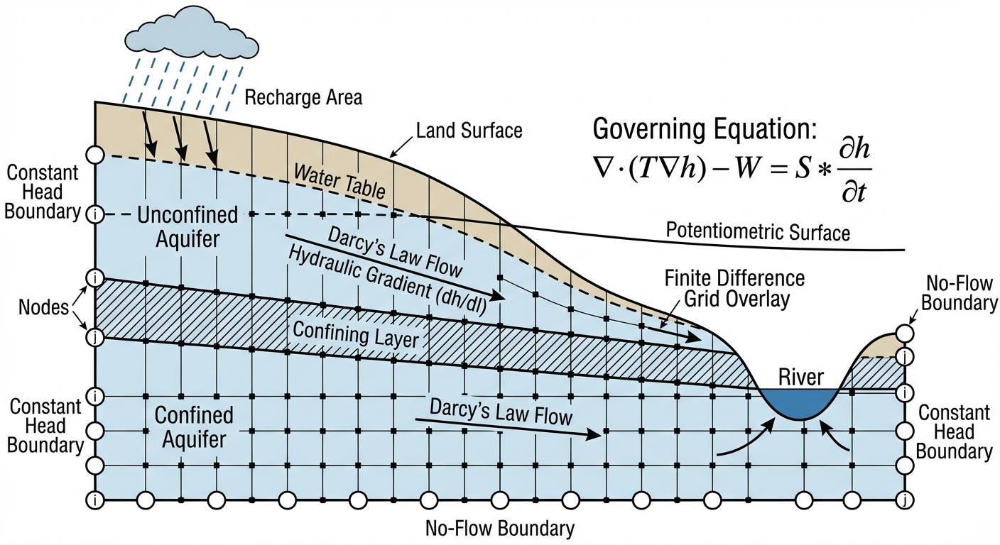
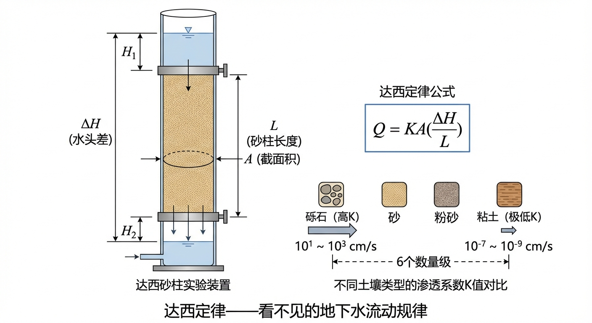
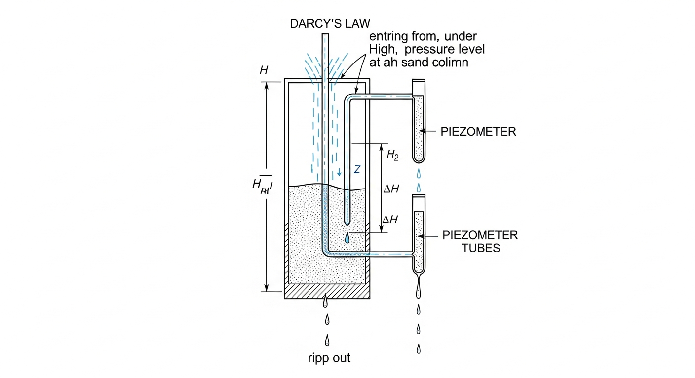
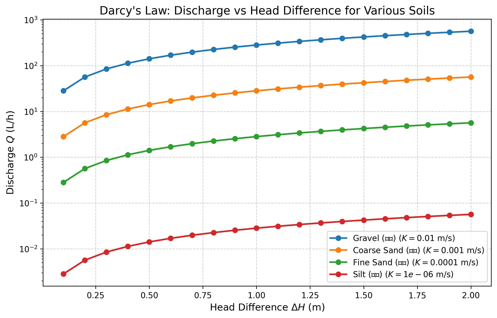

# 第 1 章：地下水动力学：看不见的流体与达西定律

## 1. 学习目标
本章旨在建立地下水动力学（Underground Water Dynamics）最核心的宏观物理认知，揭示水流在多孔介质中缓慢的运动规律。
读者需要掌握：
1. 孔隙度（Porosity）与多孔介质（Porous Media）的概念。
2. 地下水运动的基石：达西定律（Darcy's Law）的实验基础与数学表达。
3. 渗透系数（Hydraulic Conductivity）$K$ 的物理意义及其在不同土壤类型中的巨大跨度。
4. 达西流速（Darcy Velocity）与真实孔隙流速（Actual Pore Velocity）的区别。

## 2. 教材理论：水在泥土中如何穿行？
在《明渠水力学计算》中，前文研究的水流自由奔放，流速动辄高达数米每秒。然而，当目光转向脚下的大地，水流的形态发生了根本性的改变。
地下并不是巨大的空洞暗河，绝大多数地下水是存在于砂石、土壤颗粒之间的微小孔隙中的。水流在这种**多孔介质（Porous Media）**中的运动，需要在密集的孔隙通道中克服显著的摩擦阻力。

描述这种缓慢的渗流（Seepage）运动，是1856年由法国工程师亨利·达西（Henry Darcy）通过著名的砂柱实验得出的**达西定律**。
达西发现，水流穿过砂柱的流量 $Q$：
1. 与砂柱两端的水头差（水压差加高程差） $\Delta H$ 成正比。
2. 与砂柱的横截面积 $A$ 成正比。
3. 与砂柱的长度 $L$ 成反比。

将 $\Delta H / L$ 称为**水力梯度（Hydraulic Gradient, $I$）**，达西定律可以写成简洁的形式：
$$ v = \frac{Q}{A} = K \cdot I \tag{1.1} $$
其中：
- $v$ 被称为**达西流速（或渗透速度）**。注意，这不是水分子真实的移动速度，而是假定水穿过了整个截面 $A$（连沙子一起算）的宏观平均速度。
- $K$ 是**渗透系数（Hydraulic Conductivity）**。这是地下水动力学中最核心的参数，代表了某种介质让水通过的能力。

### 达西定律的三维推广

式(1.1)描述的是一维均匀流场中的渗流。在实际的三维非均质含水层中，水力梯度在空间各方向上的分量不同，渗透系数也可能具有方向性（各向异性）。此时，达西定律需要推广为矢量-张量形式：
$$ \mathbf{q} = -\mathbf{K} \nabla h \tag{1.2} $$
其中，$\mathbf{q} = (q_x, q_y, q_z)^T$ 为达西流速矢量，$h$ 为总水头（压力水头与位置水头之和），$\nabla h = (\partial h/\partial x, \partial h/\partial y, \partial h/\partial z)^T$ 为水头梯度矢量。负号表示水流方向与水头梯度方向相反——水总是从高水头流向低水头。$\mathbf{K}$ 为渗透系数张量（$3 \times 3$ 对称正定矩阵）：
$$ \mathbf{K} = \begin{pmatrix} K_{xx} & K_{xy} & K_{xz} \\ K_{yx} & K_{yy} & K_{yz} \\ K_{zx} & K_{zy} & K_{zz} \end{pmatrix} \tag{1.3} $$
在各向同性介质中，$\mathbf{K}$ 退化为标量 $K$ 乘以单位矩阵，式(1.2)简化为 $\mathbf{q} = -K \nabla h$。在层状沉积含水层中，水平方向的渗透系数 $K_h$ 通常比垂直方向的 $K_v$ 大一个数量级，这种各向异性对地下水流场形态有重要影响。

### 渗透系数的量纲分析与物理本质

渗透系数 $K$ 的量纲为 $[LT^{-1}]$（即速度量纲），但它并非真实的流体速度。从量纲分析的角度，$K$ 实际上综合反映了介质几何特性和流体物理性质两方面的因素。根据 Kozeny-Carman 关系，渗透系数可以分解为：
$$ K = \frac{k \rho g}{\mu} \tag{1.4} $$
其中，$k$ 为固有渗透率（Intrinsic Permeability），量纲 $[L^2]$，仅取决于多孔介质的孔隙结构（孔隙度、孔径分布、迂曲度等）；$\rho$ 为流体密度 $[ML^{-3}]$；$g$ 为重力加速度 $[LT^{-2}]$；$\mu$ 为流体动力粘度 $[ML^{-1}T^{-1}]$。这一分解表明，同一种砂土对于水和油的渗透系数是不同的，因为两种流体的密度和粘度不同。在地下水动力学中，由于研究对象通常是常温常压下的地下水，流体性质变化不大，因此直接使用综合参数 $K$ 更为方便。

**典型地质材料的渗透系数范围**：

| 地质材料 | 渗透系数 $K$ (m/s) | 固有渗透率 $k$ (m$^2$) | 水文地质分类 |
|:---------|:------------------:|:---------------------:|:------------|
| 砾石（Gravel） | $10^{-2} \sim 10^{0}$ | $10^{-9} \sim 10^{-7}$ | 优良含水层 |
| 粗砂（Coarse Sand） | $10^{-4} \sim 10^{-2}$ | $10^{-11} \sim 10^{-9}$ | 良好含水层 |
| 细砂（Fine Sand） | $10^{-5} \sim 10^{-4}$ | $10^{-12} \sim 10^{-11}$ | 一般含水层 |
| 粉砂（Silt） | $10^{-7} \sim 10^{-5}$ | $10^{-14} \sim 10^{-12}$ | 弱透水层 |
| 粘土（Clay） | $10^{-11} \sim 10^{-8}$ | $10^{-18} \sim 10^{-15}$ | 隔水层 |
| 致密岩石（Dense Rock） | $< 10^{-12}$ | $< 10^{-19}$ | 完全不透水层 |

上表清楚地展示了渗透系数跨越十余个数量级的巨大变化范围。在实际工程勘察中，准确测定 $K$ 值是地下水数值模拟的首要挑战。

### 稳态渗流的拉普拉斯方程

当地下水流场达到稳态（即流速、水头均不随时间变化）时，根据质量守恒原理，流入某一微元体的水量必须等于流出的水量。将达西定律（式1.2）代入连续性方程，对于均质各向同性含水层，可以推导出描述稳态渗流的拉普拉斯方程：
$$ \nabla^2 h = \frac{\partial^2 h}{\partial x^2} + \frac{\partial^2 h}{\partial y^2} + \frac{\partial^2 h}{\partial z^2} = 0 \tag{1.5} $$
拉普拉斯方程是数学物理中最经典的椭圆型偏微分方程，它说明在没有源汇的稳态渗流场中，任意一点的水头等于其周围各点水头的加权平均值（调和函数的平均值性质）。这一性质为后续章节中有限差分法的五点差分格式提供了直接的物理依据。

### 承压含水层与潜水含水层

在讨论地下水流动时，必须区分两种基本的含水层类型：

**承压含水层（Confined Aquifer）**的顶底板均为隔水层，含水层中充满了承压水。此时含水层厚度 $b$ 不随水头变化而变化，导水系数 $T = Kb$ 为常数。其二维稳态渗流方程为：
$$ T \left( \frac{\partial^2 h}{\partial x^2} + \frac{\partial^2 h}{\partial y^2} \right) + W = 0 \tag{1.6} $$
其中 $W$ 为源汇项（如降雨入渗补给或抽水）。由于 $T$ 为常数，该方程是线性的，数学处理相对简单，叠加原理成立。

**潜水含水层（Unconfined Aquifer）**的上表面为自由水面（潜水面），含水层厚度等于水位高程 $h$。此时导水系数 $T = Kh$ 随水位变化，渗流方程呈现非线性特征：
$$ \frac{\partial}{\partial x}\left( Kh \frac{\partial h}{\partial x} \right) + \frac{\partial}{\partial y}\left( Kh \frac{\partial h}{\partial y} \right) + W = 0 \tag{1.7} $$
这就是第3章将要详细讨论的 Boussinesq 方程。由于 $h$ 既出现在被微分的函数中，又出现在微分算子的系数中，该方程的非线性使得解析求解极为困难，通常需要借助数值方法。承压含水层与潜水含水层控制方程的这一根本差异，贯穿地下水动力学的整个理论体系。

**达西流速与真实孔隙流速的区分**：

达西流速 $v$ 是基于整个截面积 $A$ 计算的宏观平均速度，然而水流并不穿过固体颗粒，而只能在颗粒之间的孔隙空间中流动。因此，水分子的真实移动速度——孔隙流速 $v_p$——要比达西流速快得多：
$$ v_p = \frac{v}{n_e} = \frac{K \cdot I}{n_e} \tag{1.8} $$
其中 $n_e$ 为有效孔隙度（Effective Porosity），即能够参与流动的连通孔隙所占体积比。对于松散砂层，$n_e$ 一般在 $0.20 \sim 0.35$ 之间；对于密实粘土，$n_e$ 可能低至 $0.01 \sim 0.05$。这意味着在同样的达西流速下，粘土中污染物的真实移动速度可能是砂层中的数倍。这一区分在地下水污染风险评估中至关重要，第4章将对此进行更深入的讨论。

**大自然的对数级跨度**：
渗透系数 $K$ 的变化范围跨度很大。粗砾石的 $K$ 可能高达 $10^{-2} m/s$（水流通畅），而致密黏土的 $K$ 可能低至 $10^{-9} m/s$（水流几乎停滞，常被视为不透水层）。这种跨越七个数量级的差异，是地下水计算中最难以准确确定的变量。

**达西定律的适用条件与失效判据**：

达西定律并非普适的物理定律，而是在特定流态条件下的经验定律。其本质上描述的是层流状态下粘性力主导的渗流运动，适用范围受雷诺数 $Re$ 的约束。地下水力学中的雷诺数定义为：
$$ Re = \frac{v \cdot d_{10}}{\nu} \tag{1.9} $$
其中 $d_{10}$ 为介质的有效粒径（通过筛分曲线上10%对应的粒径），$\nu$ 为水的运动粘度（20°C时约为 $1.0 \times 10^{-6} m^2/s$）。当 $Re < 1 \sim 10$ 时，孔隙中的水流保持层流状态，达西定律严格成立。当 $Re$ 超过临界值（通常在粗砾石层或抽水井近井区域），孔隙水流开始出现惯性效应甚至湍流，流量与水力梯度之间不再是线性关系。此时需要采用 Forchheimer 方程：
$$ I = \frac{v}{K} + \beta v^2 \tag{1.10} $$
其中 $\beta$ 为非达西流系数 $[TL^{-2}]$，其数值取决于介质的孔隙结构特征，对于粗砾石层，$\beta$ 的典型取值范围为 $10^2 \sim 10^4 \, s^2/m^2$。与达西定律相比，Forchheimer 方程增加了一个与流速平方成正比的非线性阻力项，反映了高流速下惯性力对渗流的附加阻碍作用。在工程实践中，判断是否需要采用非达西流模型的关键步骤是：首先根据场地水文地质条件估算最大可能的达西流速，再通过式(1.9)计算雷诺数，当 $Re$ 接近或超过临界值时，应考虑采用 Forchheimer 方程进行修正。

## 3. 案例分析：理论与实践的桥梁（达西圆柱渗透实验的数值复现）

### 案例背景
某环境工程实验室正在评估四种不同地层材料（砾石、粗砂、细砂、粉砂）作为垃圾填埋场底层渗滤液导流层的可行性。工程师构建了一个标准的达西圆柱形实验装置（长度 $L=1.0m$，直径 $D=0.1m$）。他们需要精确知道：在 $1.0m$ 的标准水头差下，这四种材料一个小时到底能渗出多少升的水？

### 问题描述
- 圆柱体尺寸：$L = 1.0 m$，直径 $D = 0.1 m$。
- 介质参数：
  - Gravel (砾石)：$K = 1 \times 10^{-2} m/s$
  - Coarse Sand (粗砂)：$K = 1 \times 10^{-3} m/s$
  - Fine Sand (细砂)：$K = 1 \times 10^{-4} m/s$
  - Silt (粉砂)：$K = 1 \times 10^{-6} m/s$
- 测试条件：在不同材质的砂柱两端，施加从 $0.1m$ 到 $2.0m$ 不等的水头差 $\Delta H$。
求各个材质的渗透流量 $Q$ 随水头差的变化曲线，并输出 $\Delta H = 1.0m$ 时的精确达西流速与小时级流量。

**物理场景与问题概化图 (Generated via nano-banana-pro 3)：**

### 解题思路
本研究直接调用达西定律核心公式进行扫参计算：
1. **几何参数准备**：计算圆柱截面积 $A = \frac{\pi D^2}{4}$。
2. **水力梯度计算**：对于每一个施加的水头差 $\Delta H$，计算梯度 $I = \Delta H / L$。
3. **达西流速求解**：根据公式 $v = K \cdot I$ 算出渗透流速。
4. **宏观流量换算**：由于达西流速很小，算出的 $Q = v \cdot A$ 单位为 $m^3/s$ 不够直观。因此将乘以 $1000 \times 3600$，将其转换为 $L/h$（升/小时）。

### 代码与仿真
> **学习提示**：后台执行了参数扫描脚本。注意观察图表中必须使用对数坐标（Log Scale）才能将不同介质的流量画在同一张图里，这直观地展现了地质材料渗透性的巨大差异。

Source: `assets/ch01/ch01_darcy_law.py`

**达西定律标准渗透实验数据追踪矩阵 (当水头差 dH = 1.0m 时)：**
| Material           |   Hydraulic Conductivity K (m/s) |   Head Diff dH (m) |   Gradient I |   Darcy Velocity v (m/s) |   Discharge Q (L/h) |
|:-------------------|---------------------------------:|-------------------:|-------------:|-------------------------:|--------------------:|
| Gravel (砾石)      |                           0.01   |                  1 |            1 |                   0.01   |              282.74 |
| Coarse Sand (粗砂) |                           0.001  |                  1 |            1 |                   0.001  |               28.27 |
| Fine Sand (细砂)   |                           0.0001 |                  1 |            1 |                   0.0001 |                2.83 |
| Silt (粉砂)        |                           1e-06  |                  1 |            1 |                   1e-06  |                0.03 |

**不同地质介质的流量-水头差特性曲线：**

### 结果分析
经过仿真运算，数据展示了达西定律的线性特征和渗透系数的显著跨度：
- **完美的线性关系**：正如达西定律所描述，对于任何一种特定介质，流量 $Q$ 与施加的水压差 $\Delta H$ 完全成正比。如果在图表中不使用对数坐标，每一条线都将是一条绝对笔直的射线。
- **介质决定的数量级鸿沟**：观察表格，在完全相同的设备、完全相同的 $1.0m$ 水压驱动下：
  - **砾石（Gravel）**：渗透通畅，达西流速达到 $0.01 m/s$，一小时能渗出 **282.74 升** 的水。
  - **粉砂（Silt）**：阻力显著，达西流速低至 $10^{-6} m/s$。一整个小时仅能渗出 **0.03 升（30毫升）** 的水。
- 这解释了为什么在寻找地下水源（打井）时，必须找到砾石或粗砂构成的“含水层（Aquifer）”；而在建设垃圾填埋场或水库大坝底层时，必须铺设压实的黏土或粉砂作为“隔水层（Aquitard）”。

### 工业部署建议
1. **真实孔隙流速的常见误区**：在污染物运移（如地下水污染溯源）的数字孪生模型中，不能直接使用达西流速 $v$ 来计算溶质的移动速度。因为达西流速是假设整个截面 $A$ 都能过水。而实际上，水只能在颗粒之间的孔隙中流动。所以真实的溶质移动速度（孔隙流速 $v_{pore}$）必须除以土壤孔隙度 $n$。由于 $n$ 通常在 $0.2 \sim 0.4$ 之间，**真实的污染扩散速度会比达西流速快 3 到 5 倍。**
2. **达西定律的失效边界**：达西定律仅在水流极慢、雷诺数极低（层流，通常 $Re < 1 \sim 10$）时成立。如果在粗大的抛石层中，或者在抽水井附近的高压抽吸区，水流速度变快引发了漩涡（紊流），由于紊流摩擦力的存在，流量的增加将落后于水压的增加，此时必须使用非线性的 Forchheimer 方程（式1.10）。
3. **渗透系数的空间变异性处理**：在实际含水层中，$K$ 值往往呈现强烈的空间变异性，其分布通常服从对数正态分布。在建立地下水数值模型时，采用 $K$ 的几何平均值或等效值来代替空间变异场，可能导致流量估算的系统性偏差。对于重要的工程项目（如核废料处置场选址、大型供水水源地评价），应当开展多点抽水试验和室内渗透试验，结合地质统计学方法（如克里金插值）构建渗透系数的空间分布场，以提高模型预测的可靠性。

## 4. 本章小结

本章系统介绍了地下水动力学的基本概念与核心定律。达西定律（Darcy's Law）是描述多孔介质中水流运动的基石，它揭示了渗透流量与水力梯度之间的线性关系（式1.1）。本章将达西定律从一维标量形式推广到了三维张量形式（式1.2），讨论了渗透系数张量在各向异性含水层中的物理意义。通过 Kozeny-Carman 关系（式1.4）的量纲分析，阐明了渗透系数 $K$ 综合反映介质几何特性与流体物理性质的本质。渗透系数在不同地质材料中跨越十余个数量级（从砾石的 $10^{0} m/s$ 到致密岩石的 $10^{-12} m/s$），这种巨大差异直接决定了含水层与隔水层的工程划分。

在此基础上，本章推导了稳态渗流的拉普拉斯方程（式1.5），并对比了承压含水层与潜水含水层控制方程的根本差异——前者为线性方程，叠加原理成立；后者因导水系数随水位变化而呈现非线性特征。达西流速与真实孔隙流速的区别（式1.8）是理解污染物运移的关键前提，忽视有效孔隙度修正将导致对污染扩散速度的严重低估。此外，达西定律的适用条件（雷诺数判据，式1.9）和超出适用范围时的 Forchheimer 修正（式1.10）为后续工程应用中的模型选择提供了理论依据。本章通过达西圆柱渗透实验的数值复现，验证了达西定律的线性特性，并直观展示了不同介质的渗透性差异。

## 5. 思考题

1. 某砂柱实验装置长度 $L = 0.5m$，横截面积 $A = 0.02m^2$，两端水头差 $\Delta H = 0.8m$，测得稳态流量 $Q = 3.2 \times 10^{-5} m^3/s$。请计算该介质的渗透系数 $K$，并判断其可能对应的地质材料类型。

2. 达西流速的量纲是 $[m/s]$，渗透系数 $K$ 的量纲也是 $[m/s]$，而水力梯度 $I$ 是无量纲的。请从量纲分析的角度说明，为什么渗透系数可以看作一种"速度"？它与真实的水流速度有何本质区别？

3. 在均质含水层中，达西定律的适用条件是层流状态（雷诺数 $Re < 1 \sim 10$）。而在非均质含水层中，即使宏观流速很低，局部孔隙通道中的流速可能远高于平均值。请分析：在砾石与细砂交错分布的非均质含水层中，达西定律是否仍然适用？需要做哪些修正？

4. 某垃圾填埋场需要在底部铺设一层防渗材料，要求在 $1.0m$ 水头差下，单位面积每天的渗漏量不超过 $1.0 L/(m^2 \cdot d)$。请反算所需防渗材料的最大允许渗透系数 $K$，并讨论在工程实践中如何保证这一指标。

## 6. 参考文献

[1] Darcy H. Les fontaines publiques de la ville de Dijon[M]. Paris: Victor Dalmont, 1856.

[2] Bear J. Dynamics of Fluids in Porous Media[M]. New York: American Elsevier, 1972.

[3] Freeze R A, Cherry J A. Groundwater[M]. Englewood Cliffs: Prentice-Hall, 1979.

[4] 雷晓辉,龙岩,许慧敏,等.水系统控制论：提出背景、技术框架与研究范式[J].南水北调与水利科技(中英文),2025,23(04):761-769+904.DOI:10.13476/j.cnki.nsbdqk.2025.0077.
