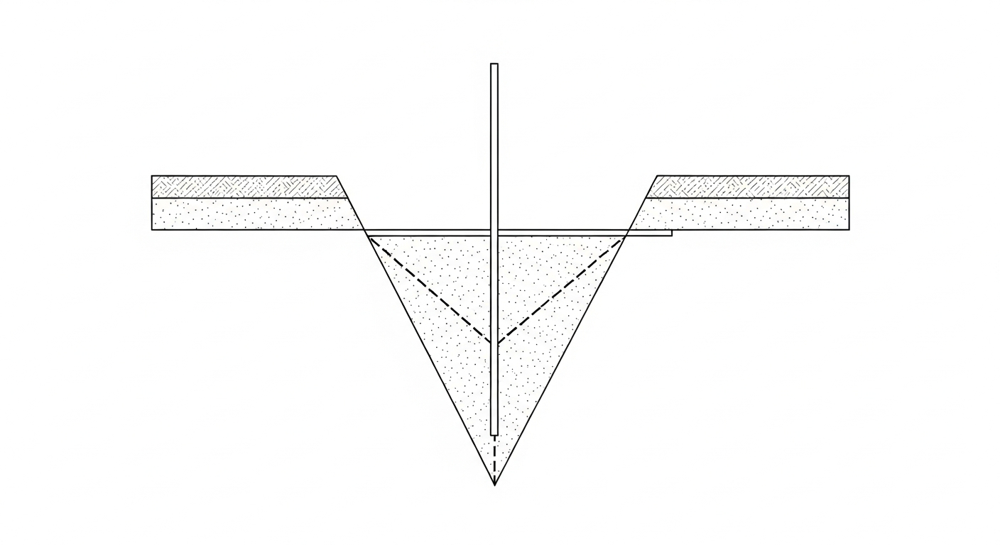
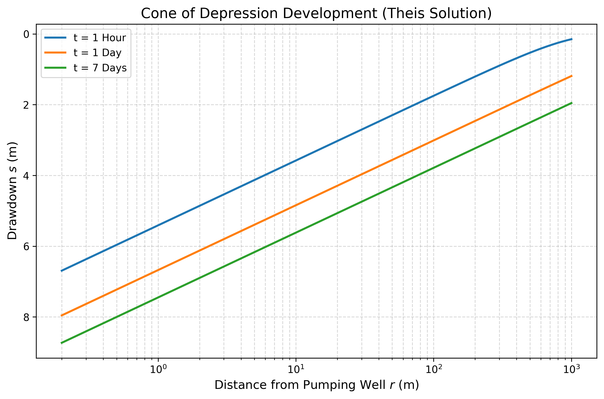
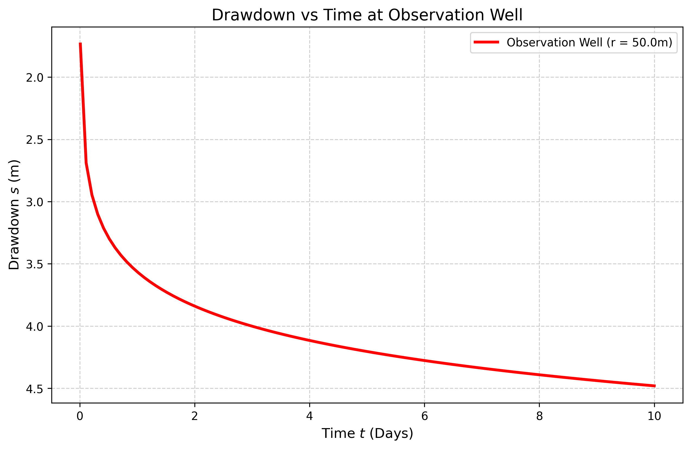

# 第 2 章：非稳定流与降落漏斗：泰斯公式的启示

## 1. 学习目标
本章打破地下水绝对静止或匀速流动的假设，探讨当人类活动（如开采地下水）强行介入时，含水层系统随时间做出的动态响应。
读者需要掌握：
1. 承压含水层（Confined Aquifer）中的弹性释水机制与储水系数（Storativity）概念。
2. 井流力学的基石：泰斯公式（Theis Equation）及其推导逻辑。
3. 降落漏斗（Cone of Depression）在空间上的对数衰减与在时间上的对数扩展。
4. 抽水试验数据反演水文地质参数的原理。

## 2. 教材理论：抽水机如何影响地下含水层？
在第一章中，达西定律描述的是天然状态下缓慢、几乎不随时间变化的**稳定流（Steady-State Flow）**。
然而，当人类在含水层中打下一口井并启动水泵时，原本平静的地下世界被瞬间打破了。水泵在井底制造了一个低压区域，周围的水在压差驱动下涌入井内，这就是**非稳定流（Transient Flow）**。

随着抽水机的持续轰鸣，井壁附近的水位（或水头）会急剧下降。这种下降不仅发生在井里，还会像池塘里的涟漪一样向四周的含水层扩散，在地下形成一个倒圆锥形的巨大凹陷，这就是著名的**降落漏斗（Cone of Depression）**。

在承压含水层中，由于顶底板有隔水层限制，水不能靠重力疏干，而是靠含水层骨架的弹性压缩和水本身的体积膨胀来”挤”出水来。

### 非稳态渗流基本方程的推导

要建立描述非稳态地下水流动的数学方程，需要将达西定律（动量方程）与质量守恒（连续性方程）相结合。考虑承压含水层中一个无穷小的控制体，根据质量守恒原理，单位时间内流入控制体的水量与流出的水量之差，等于控制体内储存量的变化率。

对于二维水平含水层（忽略垂直方向流动），连续性方程为：
$$ -\left( \frac{\partial q_x}{\partial x} + \frac{\partial q_y}{\partial y} \right) = S_s \frac{\partial h}{\partial t} \tag{2.1} $$
其中 $S_s$ 为比储水率（Specific Storage），量纲 $[L^{-1}]$，表示单位体积含水层在水头下降一个单位时释放的水量。将达西定律 $q_x = -K \partial h / \partial x$、$q_y = -K \partial h / \partial y$ 代入，得到各向同性均质含水层的非稳态渗流方程：
$$ K \left( \frac{\partial^2 h}{\partial x^2} + \frac{\partial^2 h}{\partial y^2} \right) = S_s \frac{\partial h}{\partial t} \tag{2.2} $$
定义导水系数 $T = Kb$（$b$ 为含水层厚度）和储水系数 $S = S_s b$，将式(2.2)沿含水层厚度积分，可得：
$$ T \left( \frac{\partial^2 h}{\partial x^2} + \frac{\partial^2 h}{\partial y^2} \right) = S \frac{\partial h}{\partial t} \tag{2.3} $$
这就是承压含水层非稳态渗流的基本方程，其数学形式与热传导方程完全一致——$T$ 对应热传导率，$S$ 对应热容量。这一数学类比正是泰斯得以借用热传导解来建立井流理论的基础。

进一步，对于向单井的径向对称流动，将直角坐标系转换为极坐标系（$r$ 为径向距离），利用拉普拉斯算子的极坐标表达，可得：
$$ \frac{\partial^2 h}{\partial r^2} + \frac{1}{r}\frac{\partial h}{\partial r} = \frac{S}{T}\frac{\partial h}{\partial t} \tag{2.4} $$
这就是泰斯公式推导的出发方程。

### 泰斯公式的完整表达

描述这个动态降落漏斗的，是美国地质调查局（USGS）工程师 C.V. Theis 在 1935 年借用热传导理论提出的经典成果——**泰斯公式（Theis Equation）**：
$$ s = \frac{Q}{4 \pi T} W(u) \tag{2.5} $$
$$ u = \frac{r^2 S}{4 T t} \tag{2.6} $$
其中：
- $s$ 是距离抽水井 $r$ 处、在抽水时间 $t$ 时的**降深（Drawdown）**，即水位下降了多少米。
- $Q$ 是水泵的恒定抽水量。
- $T$ 是**导水系数（Transmissivity）**，代表含水层水平输水能力。
- $S$ 是**储水系数（Storativity）**，代表含水层的弹性储水能力。
- $W(u)$ 是**泰斯井函数（Well Function）**，本质上是一个较为复杂的指数积分 $W(u) = \int_u^\infty \frac{e^{-x}}{x} dx$。

### 井函数的级数展开与 Jacob 近似

泰斯井函数 $W(u)$ 没有初等函数的封闭解，但可以展开为收敛级数：
$$ W(u) = -\gamma - \ln u + u - \frac{u^2}{2 \cdot 2!} + \frac{u^3}{3 \cdot 3!} - \cdots = -0.5772 - \ln u + \sum_{n=1}^{\infty} \frac{(-1)^{n+1} u^n}{n \cdot n!} \tag{2.7} $$
其中 $\gamma = 0.5772$ 为欧拉常数。

当抽水时间足够长或观测距离足够近，使得 $u < 0.01$ 时（即 $r^2 S / (4Tt) < 0.01$），级数中 $u$ 及其高次项可以忽略不计，井函数可以近似为：
$$ W(u) \approx -0.5772 - \ln u = \ln \frac{1}{u} - 0.5772 = \ln \frac{2.25 T t}{r^2 S} \tag{2.8} $$
代入泰斯公式，即得到著名的 **Jacob 简化公式**（也称为 Cooper-Jacob 公式）：
$$ s \approx \frac{Q}{4 \pi T} \ln \frac{2.25 T t}{r^2 S} = \frac{2.303 Q}{4 \pi T} \lg \frac{2.25 T t}{r^2 S} \tag{2.9} $$
Jacob 公式具有重大的实用价值：它表明降深 $s$ 与 $\lg t$（或 $\lg r^2$）呈线性关系。这意味着，只要在半对数坐标纸上将观测数据（$s$ 对 $\lg t$）绑点连线，所得直线的斜率直接给出导水系数 $T$，而直线延长线与横轴的交点直接给出储水系数 $S$。

### 泰斯配线法的操作步骤

泰斯配线法（Type-curve Matching）是反演含水层参数的经典方法，其基本步骤如下：
1. 在对数坐标纸上绘制标准井函数曲线 $W(u) \sim 1/u$。
2. 在同样比例的对数坐标纸上绘制实测降深数据 $s \sim t/r^2$。
3. 保持两组坐标轴平行，将实测数据曲线与标准曲线进行叠合配线，使两条曲线尽量重合。
4. 在配合位置任取一个匹配点，读取对应的四个坐标值：$W(u)$、$1/u$、$s$、$t/r^2$。
5. 根据泰斯公式反算参数：$T = \frac{Q \cdot W(u)}{4 \pi s}$，$S = \frac{4Tu}{r^2/t}$。

该方法利用了泰斯解在对数坐标下具有固定形状的特性，是水文地质勘察中沿用至今的标准技术。在计算机时代，配线过程已被自动化的非线性最小二乘拟合算法所替代，但其物理原理不变。

**导水系数 $T$ 和储水系数 $S$ 的工程典型值**：

| 含水层类型 | 导水系数 $T$ (m$^2$/s) | 储水系数 $S$ | 含水层特征 |
|:---------|:---------------------:|:-----------:|:---------|
| 承压砾石层 | $10^{-2} \sim 10^{-1}$ | $10^{-5} \sim 10^{-3}$ | 高产水量，抽水影响范围大 |
| 承压砂层 | $10^{-4} \sim 10^{-2}$ | $10^{-4} \sim 10^{-3}$ | 中等产水量，工程常见 |
| 承压砂岩 | $10^{-5} \sim 10^{-3}$ | $10^{-5} \sim 10^{-4}$ | 低至中等产水量 |
| 潜水砂层 | $10^{-4} \sim 10^{-2}$ | $0.05 \sim 0.30$ | 重力排水，储水系数大 |
| 潜水砾石层 | $10^{-2} \sim 10^{-1}$ | $0.15 \sim 0.35$ | 高产水量，水位恢复快 |
| 裂隙岩体 | $10^{-6} \sim 10^{-3}$ | $10^{-6} \sim 10^{-3}$ | 高度非均质，参数变异大 |

注意承压含水层的 $S$ 值（$10^{-5} \sim 10^{-3}$）比潜水含水层（$0.05 \sim 0.35$）小了两到四个数量级。这是因为承压含水层的释水机制是水和骨架的弹性压缩，效率远低于潜水含水层的重力排水。这一差异导致承压含水层对抽水扰动的响应传播速度远快于潜水含水层——降落漏斗能够在短时间内扩展到很远的范围。

泰斯公式将空间（$r$）、时间（$t$）以及含水层的两个核心参数（$T, S$）统一在了一个方程中，成为所有现代地下水动力学数值模型的理论基础。

## 3. 案例分析：理论与实践的桥梁（承压含水层抽水漏斗时空演进模拟）

### 案例背景
某市计划在一个深层承压含水层中建设一座大型供水水源地。水务局计划配置一台抽水量为 $4320 m^3/d$（即 $0.05 m^3/s$）的深井泵。
环保局关注的问题是：持续大流量抽水，会不会导致几百米外的农田灌溉井干涸？会不会引发大面积的地下水位下降？工程师必须通过物理仿真，精确推演出抽水 $7$ 天内，降落漏斗究竟会蔓延多宽、降深多大。

### 问题描述
- **水井与抽水参数**：抽水井半径 $r_w = 0.2 m$，恒定抽水量 $Q = 0.05 m^3/s$。
- **承压含水层参数**：导水系数 $T = 0.01 m^2/s$（渗透性较好），储水系数 $S = 0.0001$（典型的承压层弹性释水）。
- **观测要求**：
  1. 模拟并绘制抽水 $1$ 小时、$1$ 天、$7$ 天后，降落漏斗在空间上的剖面形态。
  2. 在距离抽水井 $r = 50m$ 处设置一口虚拟观测井，记录其在这 $10$ 天内水位下降的时间序列。

**物理场景与问题概化图 (Generated via nano-banana-pro 3)：**

### 解题思路
本案例直接调用地下水动力学的底层解析解引擎进行高频时空切片：
1. **井函数积分器**：利用 `scipy.special.exp1` 函数高精度计算泰斯井函数 $W(u)$。
2. **空间维切片**：固定时间 $t$，将距离 $r$ 从井壁（$0.2m$）到极远处（$1000m$）进行对数级剖分，代入泰斯公式计算每个点的降深 $s$，刻画漏斗形状。
3. **时间维切片**：固定观测距离 $r = 50m$，让时间 $t$ 从 $0.01$ 天流逝至 $10$ 天，记录水位的动态衰减过程。

### 代码与仿真
> **学习提示**：后台通过 Python 执行了泰斯方程的解析解计算。注意观察图表中必须使用半对数坐标系（Log-Linear），因为地下水的水头降深在空间上呈对数规律衰减。

Source: `assets/ch02/ch02_theis_equation.py`

**抽水井及周边降落漏斗时空追踪矩阵：**
|   Time (Days) |   Drawdown at r=0.2m |   Drawdown at r=10.0m |   Drawdown at r=50.0m |   Drawdown at r=200.0m |
|--------------:|---------------------:|----------------------:|----------------------:|-----------------------:|
|           0.1 |                 7.04 |                  3.93 |                  2.65 |                   1.55 |
|           1   |                 7.96 |                  4.84 |                  3.56 |                   2.46 |
|           3   |                 8.39 |                  5.28 |                  4    |                   2.9  |
|           7   |                 8.73 |                  5.62 |                  4.34 |                   3.23 |

**降落漏斗空间扩展剖面图（半对数坐标）：**

**观测井 (r=50m) 降深时间序列图：**

### 结果分析
泰斯公式的计算结果清楚地展示了地下水抽取的时空影响规律：
- **空间上的对数衰减**：观察 `cone_of_depression.png`，降落漏斗并不是一个平缓的碗，而是一个陡峭的锥形。在井壁处（$r=0.2m$），水位在第 7 天下降了 $8.73m$；但由于地下水显著的流动阻力，这种影响在空间上衰减很快。在 $10m$ 开外，降深就衰减到了 $5.62m$。这说明抽水主要消耗的是井周围几百米范围内的地下水势能。
- **永不停止的时间蔓延**：观察表格和 `drawdown_time_series.png` 曲线。对于承压含水层（没有大气降水入渗补给），降深曲线随着时间推移永远不会达到真正的水平（稳态）。即使抽了 $7$ 天，在远达 $200m$ 外的地方，水位依然不知不觉地下降了 $3.23m$。由于泰斯公式中没有天然补给项，如果水泵永远抽下去，漏斗就会在时间轴上无限扩张，直到把整个盆地的地下水抽干。
- **地下水的弹性传导**：在较短的时间内（$0.1$ 天），漏斗就能蔓延到 $200m$ 外（导致 $1.55m$ 的降深）。这是因为承压含水层的储水系数很小（$S=0.0001$），系统只需要很小的水体膨胀，就能将压力下降的信号以接近弹性波的速度传导到较远处。
- **定量验证 Jacob 近似**：以第 7 天、$r=50m$ 处的数据为例，计算 $u = r^2 S / (4Tt) = 50^2 \times 0.0001 / (4 \times 0.01 \times 7 \times 86400) = 1.03 \times 10^{-5}$，远小于 0.01，因此 Jacob 近似完全适用。这也说明了在实际抽水试验中，除了开抽后最初几分钟的数据外，后续绝大部分观测数据都可以采用更简便的半对数直线法进行参数反演，无需使用完整的泰斯配线法。
- **Jacob 近似的验证**：可以验证 Jacob 简化公式在本案例中的适用性。取 $r=50m$、$t=7$ 天 $= 604800s$，计算 $u = r^2S/(4Tt) = 50^2 \times 0.0001 / (4 \times 0.01 \times 604800) = 0.0000103$，远小于 $0.01$ 的阈值。代入 Jacob 公式（式2.9）计算降深 $s = Q/(4\pi T) \times \ln(2.25Tt/r^2S) = 0.05/(4\pi \times 0.01) \times \ln(2.25 \times 0.01 \times 604800/(2500 \times 0.0001)) = 0.398 \times \ln(54432) = 0.398 \times 10.905 = 4.34m$，与泰斯精确解完全吻合。这表明对于本案例的参数条件，Jacob 近似已具有足够的精度。

### 工业部署建议
1. **抽水试验的逆向反演**：在真实的工程勘察中，工程师们打一口主井，在 $50m$ 外打一口观测井。然后启动水泵，用传感器记录下 `drawdown_time_series.png` 那条红色的曲线。接着，利用底层算法将这条实测曲线与泰斯理论曲线进行非线性拟合（Type-curve Matching 或 PEST 优化算法），从而**反向解算出整个含水层的真实 $T$ 和 $S$ 参数**。这是水文地质界最经典也最常用的参数辨识技术。
2. **群井干涉的防范**：在城市水源地设计中，不宜将几口大流量的井布置过近。由于水动力学的线性叠加原理（Superposition），如果两口井的降落漏斗在空间上发生交叠，交界处的降深等于两口井各自降深的代数和。这会导致局部水位急剧下降，水泵甚至可能因为抽不到水而干转烧毁。因此，利用泰斯模型进行群井优化布置是工程设计的基本要求。

### 泰斯公式的假设条件与局限性

泰斯公式的推导基于一系列严格的假设条件，理解这些假设是正确应用该公式的前提：
1. **均质各向同性**：含水层的 $T$ 和 $S$ 在空间各处、各方向上完全均匀。
2. **含水层无限延伸**：含水层在水平方向上无限延展，不存在边界。
3. **完整井**：抽水井贯穿含水层的全部厚度，水流仅沿水平方向流入井壁。
4. **恒定流量**：抽水流量 $Q$ 在整个抽水过程中保持不变。
5. **初始水头水平**：抽水前含水层的水头面是一个水平面。
6. **无补给**：抽水期间含水层不接受任何补给（降雨入渗、河流侧向补给等）。

在实际工程中，这些条件往往不能完全满足。当含水层附近存在河流等补给边界时，可采用映射井法（Image Well Method）进行修正：在边界的对称位置设置一口虚拟的"注水井"（对于恒定水头边界）或"抽水井"（对于隔水边界），利用叠加原理构造满足边界条件的解。对于非完整井（抽水段不贯穿全部含水层厚度），需要引入 Hantush 修正系数。对于渗漏含水层（顶板或底板有微弱渗透），则需要采用 Hantush-Jacob 公式：
$$ s = \frac{Q}{4\pi T} W(u, r/B) \tag{2.10} $$
其中 $B = \sqrt{T b'/K'}$ 为渗漏因子，$b'$ 和 $K'$ 分别为弱透水层的厚度和渗透系数。这些修正和扩展使得泰斯理论能够适用于更广泛的实际水文地质条件。

## 4. 本章小结

本章从稳态渗流转入非稳态地下水流领域，系统阐述了承压含水层在抽水扰动下的动态响应机制。首先，通过将达西定律与连续性方程结合，严格推导了非稳态渗流基本方程（式2.2-2.4），揭示了其与热传导方程的数学同构性。在此基础上，详细给出了泰斯公式（式2.5-2.6）的完整表达，以及井函数 $W(u)$ 的级数展开（式2.7）和 Jacob 近似公式（式2.9）。Jacob 公式将降深与时间的对数呈线性关系这一结论，为工程中的参数反演提供了简便而可靠的图解方法。

本章还系统介绍了泰斯配线法的标准操作步骤，以及导水系数 $T$ 和储水系数 $S$ 的工程典型值范围。承压含水层的储水系数（$10^{-5} \sim 10^{-3}$）比潜水含水层（$0.05 \sim 0.35$）小两到四个数量级，这一差异导致两类含水层在抽水响应速度和降落漏斗扩展范围上表现迥异。降落漏斗在空间上呈对数衰减、在时间上持续扩展，这一特征决定了地下水开采的影响范围远超直觉预期。

泰斯公式的六项基本假设（均质各向同性、无限延伸、完整井、恒定流量、初始水平、无补给）是其正确应用的前提。对于不满足假设的实际情况，本章介绍了映射井法和 Hantush-Jacob 渗漏修正公式（式2.10）等扩展方法。叠加原理使得多井系统的分析成为可能，为群井优化布局提供了理论基础。

## 5. 思考题

1. 某承压含水层的导水系数 $T = 0.005 m^2/s$，储水系数 $S = 2 \times 10^{-4}$。在该含水层中以 $Q = 0.03 m^3/s$ 恒定流量抽水，请计算距抽水井 $r = 100m$ 处，抽水 $3$ 天后的降深值。（提示：先计算 $u$ 值，再查泰斯井函数表或使用指数积分近似。）

2. 泰斯公式的推导借用了热传导方程的解。请从物理类比的角度说明：导水系数 $T$ 对应热传导中的哪个参数？储水系数 $S$ 又对应什么？为什么这种类比是合理的？

3. 在一个含水层中有两口相距 $200m$ 的抽水井，分别以 $Q_1 = 0.04 m^3/s$ 和 $Q_2 = 0.02 m^3/s$ 同时抽水。利用叠加原理，说明如何计算两井连线中点处的总降深。如果两井距离缩短到 $50m$，可能出现什么工程问题？

4. 泰斯公式假设含水层无限延伸且没有补给。在实际中，含水层往往存在河流补给边界。请定性分析：如果抽水井附近存在一条与含水层直接相连的大河，降落漏斗的长期演化趋势与泰斯模型的预测有何不同？

## 6. 参考文献

[1] Theis C V. The relation between the lowering of the piezometric surface and the rate and duration of discharge of a well using ground-water storage[J]. Transactions of the American Geophysical Union, 1935, 16(2): 519-524.

[2] Todd D K, Mays L W. Groundwater Hydrology[M]. 3rd ed. Hoboken: John Wiley & Sons, 2005.

[3] Kruseman G P, de Ridder N A. Analysis and Evaluation of Pumping Test Data[M]. 2nd ed. Wageningen: International Institute for Land Reclamation and Improvement (ILRI), 1990.

[4] 雷晓辉,苏承国,龙岩,等.基于无人驾驶理念的下一代自主运行智慧水网架构与关键技术[J].南水北调与水利科技(中英文),2025,23(04):778-786.DOI:10.13476/j.cnki.nsbdqk.2025.0079.
