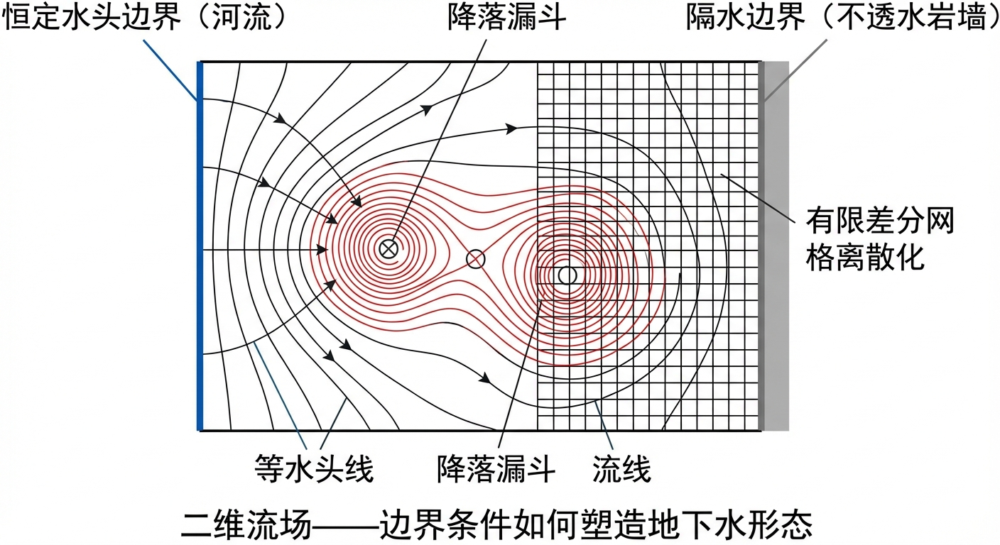
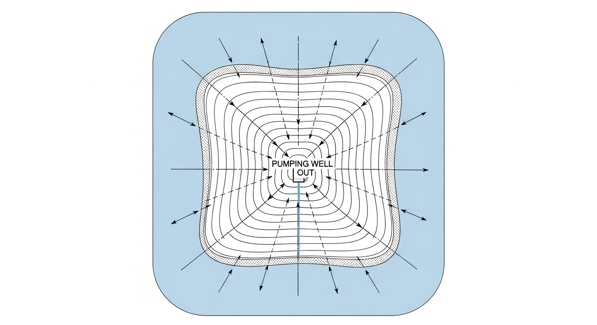
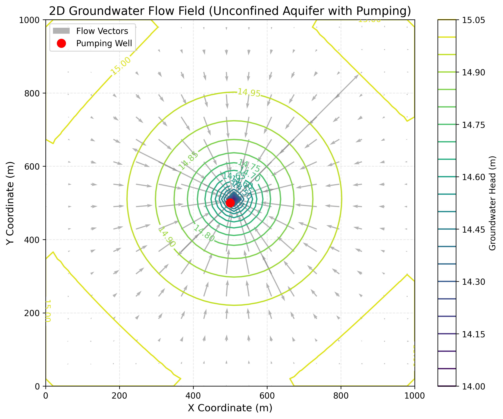
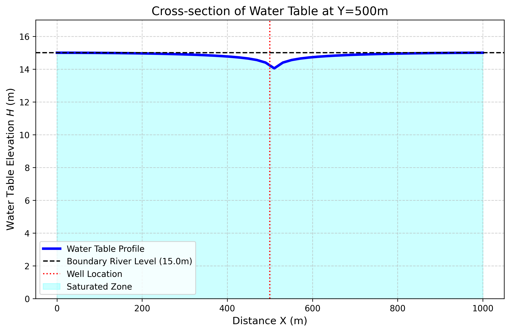

# 第 3 章：二维流场与边界条件：从点到面的降维打击

## 1. 学习目标
本章将地下水动力学从一维的径向线扩展到真正的二维广阔平面，探讨复杂地质边界如何决定流场的最终形态。
读者需要掌握：
1. 描述地下水流动的核心偏微分方程（Boussinesq 方程）。
2. 潜水含水层（Unconfined Aquifer）中非线性项的物理意义与求解。
3. 边界条件（恒定水头边界与隔水边界）对区域流场形态的强制约束作用。
4. 数值有限差分法（Finite Difference Method）在求解二维流场中的应用。

## 2. 教材理论：水在地图上如何绘制等高线？
在第 2 章中，泰斯公式是基于”一维径向（Radial）”对称的。它假设含水层无边无际，水流从四面八方均匀地流向水井。
然而，真实的地下世界并不是无限大的。含水层可能被一条大河切断，或者被一堵不可渗透的岩墙阻挡。当存在这些复杂的几何边界时，一维的泰斯公式不再适用，需要在 $X-Y$ 的二维笛卡尔坐标系下建立流场。

描述二维地下水平面流动的基本方程，是由达西定律和质量守恒定律结合推导出的**拉普拉斯方程（稳定流）**或**布辛内斯克方程（Boussinesq Equation，潜水非稳定流）**。

### Boussinesq 方程的推导

Boussinesq 方程的推导过程体现了从三维达西定律到二维潜水方程的降维思想。出发点是三维连续性方程与达西定律的结合：
$$ \frac{\partial}{\partial x}\left( K \frac{\partial h}{\partial x} \right) + \frac{\partial}{\partial y}\left( K \frac{\partial h}{\partial y} \right) + \frac{\partial}{\partial z}\left( K \frac{\partial h}{\partial z} \right) = S_s \frac{\partial h}{\partial t} \tag{3.1} $$

对于潜水含水层，做以下关键假设：（1）含水层底板水平且不透水；（2）水流以水平方向为主（Dupuit 假设），即忽略垂直方向的流速分量和水头梯度的垂直变化；（3）潜水面处的压力等于大气压。在 Dupuit 假设下，对式(3.1)从底板（$z=0$）到潜水面（$z=h$）沿垂直方向积分，考虑潜水面处的运动学边界条件和降雨入渗补给 $W$，可得：
$$ \frac{\partial}{\partial x}\left( K h \frac{\partial h}{\partial x} \right) + \frac{\partial}{\partial y}\left( K h \frac{\partial h}{\partial y} \right) + W = S_y \frac{\partial h}{\partial t} \tag{3.2} $$
其中 $S_y$ 为给水度（Specific Yield），表示单位面积含水层水位下降一个单位时通过重力排出的水量。当达到稳态（$\partial h / \partial t = 0$）时，方程简化为：
$$ \frac{\partial}{\partial x}\left( K h \frac{\partial h}{\partial x} \right) + \frac{\partial}{\partial y}\left( K h \frac{\partial h}{\partial y} \right) + W = 0 \tag{3.3} $$
其中：
- $K$ 为渗透系数。
- $h$ 为潜水面高程（也就是含水层厚度）。
- $W$ 为降雨入渗补给（Source/Sink 项）。

注意式(3.3)的显著非线性特征：$h$ 同时出现在微分算子的系数和被微分的函数中。这种非线性使得 Boussinesq 方程不能像线性方程那样利用叠加原理，也没有一般性的解析解，必须借助数值方法求解。可以利用 Kirchhoff 变换 $\phi = h^2/2$ 将式(3.3)线性化为 $K(\partial^2 \phi/\partial x^2 + \partial^2 \phi/\partial y^2) + W = 0$，但这一变换仅在 $K$ 为常数时有效。

**解密流场的两把钥匙（边界条件）**：
偏微分方程本身只是一条”物理规矩”，真正决定流场形态的是区域的”边缘”：
1. **第一类边界（Dirichlet 边界 / 恒定水头）**：例如含水层旁边有一条常年水位为 $15m$ 的大河。这条河就像一个无限大的水库，强行把边界上的地下水位”钉死”在 $15m$。数学表达为 $h(x,y) = h_0$，其中 $h_0$ 为已知的边界水头值。
2. **第二类边界（Neumann 边界 / 给定流量）**：例如不透水的断层或基岩。水流无法穿透它，所以在边界上的法向水力梯度必须为零（$\frac{\partial h}{\partial n} = 0$），这就叫隔水边界。更一般地，第二类边界可以指定非零的法向流量，如含水层与相邻地层之间的越流量。
3. **第三类边界（Cauchy 边界 / 混合边界）**：它同时约束水头和流量的关系，最典型的例子是河流底部的弱透水层。此时边界处的流量与含水层水头和河流水位之差成正比：$q_n = C(h_{river} - h)$，其中 $C$ 为河床渗透系数与厚度之比，称为河床传导系数。在 MODFLOW 中，河流模块（RIV Package）正是基于第三类边界条件实现的。

## 3. 案例分析：理论与实践的桥梁（二维潜水岛屿流场数值模拟）

### 案例背景
某面积为 $1km^2$ ($1000m \times 1000m$) 的正方形沙洲岛屿，四周被一条恒定水位为 $15.0m$ 的宽阔大河完全包围。
开发商想在岛屿正中心打一口大口径抽水井，抽取地下水进行灌溉（抽水量 $Q = 0.1 m^3/s$）。
岛屿环保部门要求：抽水不能导致岛屿边缘的树木因地下水枯竭而死亡。工程师必须给出一张精确的“二维地下水等水位线图（流网图）”，来评估中心抽水对全岛各处水位的降落影响。

### 问题描述
- **模拟区域**：正方形 $1000m \times 1000m$。
- **介质参数**：潜水含水层，渗透系数 $K = 0.005 m/s$（中粗砂），微量降雨补给 $W = 10^{-7} m/s$。
- **边界条件（四周大河）**：四周边界为第一类边界（Dirichlet），水头恒定 $H_{river} = 15.0m$。
- **中心抽水井（点汇）**：位于坐标 $(500, 500)$ 处，抽水流量 $Q_{well} = 0.1 m^3/s$。
利用有限差分法，求解二维 Boussinesq 方程的稳态解，并绘制等水位线与流速矢量场。

**物理场景与问题概化图 (Generated via nano-banana-pro 3)：**

### 解题思路

#### 五点差分格式的推导

有限差分法的核心思想是将连续的偏微分方程离散化为代数方程组。对于均质含水层的稳态拉普拉斯方程 $\frac{\partial^2 h}{\partial x^2} + \frac{\partial^2 h}{\partial y^2} = 0$，利用二阶中心差分近似：
$$ \frac{\partial^2 h}{\partial x^2} \approx \frac{h_{i+1,j} - 2h_{i,j} + h_{i-1,j}}{(\Delta x)^2} \tag{3.4} $$
$$ \frac{\partial^2 h}{\partial y^2} \approx \frac{h_{i,j+1} - 2h_{i,j} + h_{i,j-1}}{(\Delta y)^2} \tag{3.5} $$
当 $\Delta x = \Delta y$ 时，代入拉普拉斯方程并整理，得到经典的五点差分格式：
$$ h_{i,j} = \frac{1}{4}\left( h_{i+1,j} + h_{i-1,j} + h_{i,j+1} + h_{i,j-1} \right) \tag{3.6} $$
式(3.6)表明，在稳态渗流场中，任意内部节点的水头等于其上下左右四个相邻节点水头的算术平均值。这一结论与调和函数的平均值性质完全一致，直观地反映了地下水在没有源汇的区域内自然"均化"水头分布的物理本质。

对于非线性的 Boussinesq 方程（式3.3），由于导水系数 $T=Kh$ 随水位变化，差分格式需要特殊处理。本案例采用以下方法：

本研究采用计算数学中经典的**二维有限差分法（FDM）**与**高斯-塞德尔迭代法（Gauss-Seidel Iteration）**：
1. **网格剖分**：将 $1000m \times 1000m$ 的区域划分为 $50 \times 50$ 的正方形网格（$\Delta x = \Delta y = 20m$）。
2. **离散方程**：将非线性的微分方程转化为五点差分格式。由于导水系数 $T=Kh$ 在相邻节点间不同，采用算术平均值处理界面导水系数（例如 $T_E = K(h_i+h_{i+1})/2$）。
3. **源汇处理**：降雨 $W$ 均匀分配到每个网格；抽水井 $Q$ 仅在中心坐标网格 $(25, 25)$ 处作为负向源项扣除。
4. **迭代逼近**：给定初始猜测水位 $15m$，利用五点差分公式在全网格上不断扫描更新水头，直到相邻两次迭代的水头最大差值小于 $10^{-4}m$（表明系统达到了稳定的能量平衡态）。

#### 网格收敛性分析

有限差分法的计算精度与网格尺寸 $\Delta x$ 直接相关。对于二阶中心差分格式，截断误差为 $O(\Delta x^2)$，即网格尺寸减半时，离散化误差理论上降低为原来的四分之一。在实际应用中，应进行网格收敛性分析：分别使用不同密度的网格（例如 $25 \times 25$、$50 \times 50$、$100 \times 100$）求解同一问题，比较关键位置的水头值。当网格进一步加密后水头变化不超过预设阈值（通常为 $1\%$）时，可认为网格已足够精细。需要注意的是，网格从 $N \times N$ 加密到 $2N \times 2N$，未知数个数增加为原来的4倍，计算量（对于直接求解法）可增加至8倍以上。因此，在保证精度的前提下选择尽可能粗的网格，是工程计算中的重要原则。

### 代码与仿真
> **学习提示**：后台执行了包含近 2500 个节点的二维偏微分方程组迭代求解。经过 482 次内部迭代，全域能量残差归零。这展示了真正工业级的地下水流场“网格化（Gridding）”渲染过程。

Source: `assets/ch03/ch03_2d_flow.py`

**中心断面 (Y=500m) 水位降落追踪矩阵：**
|   Location X (m) |   Distance to Well r (m) |   Water Table Elevation (m) |   Drawdown (m) |
|-----------------:|-------------------------:|----------------------------:|---------------:|
|                0 |                      500 |                       15    |           0    |
|              100 |                      400 |                       14.99 |           0.01 |
|              300 |                      200 |                       14.89 |           0.11 |
|              480 |                       20 |                       14.4  |           0.6  |
|              500 |                        0 |                       14.05 |           0.95 |

**二维全域地下水等水头线与流速矢量场：**

**中心抽水剖面（X-Z 截面）水位线：**

### 结果分析
通过高斯-塞德尔迭代解算出的二维流场，清楚地展示了边界条件的控制作用：
- **边界的“锁死”效应**：观察 `cross_section_profile.png` 截面图和表格数据。在 $X=0m$ 和 $X=1000m$ 的岛屿边缘，水位被大河固定在 $15.0m$（Drawdown = 0）。岛中央的水泵无法改变边界处持续的水源补给。
- **流场的向心漏斗**：看 `groundwater_flow_field.png` 的二维平面图。四周高（$15m$）、中间低（$14.05m$），形成了规则的同心圆等水位线。水流矢量（灰色小箭头）全部从四周边缘出发，沿着水力梯度最陡的方向（垂直于等水位线），指向中心的抽水井。
- **降深评估结论**：计算表明，中心水井附近的剧烈降深（高达 $0.95m$）在向外扩散时，由于受到降雨补给和四周大河的强力侧向补给，降深在距离井 $200m$ 外（$X=300m$）就已经衰减到了仅 $0.11m$。岛屿边缘的树木根系（$X < 100m$）的水位几乎没有任何下降（降深仅 $0.01m$），完全不受抽水影响。
- **非线性效应的定量评估**：本案例中井中心最大降深为 $0.95m$，相对于含水层初始厚度 $15.0m$，降深比例约为 6.3%。在这一水平下，Boussinesq 方程中导水系数 $T = Kh$ 的非线性效应对计算结果影响有限。但若抽水量增大至 $0.5 \, m^3/s$，中心降深可能超过含水层厚度的 30%，非线性效应将变得显著，线性化近似将产生不可忽视的误差。
- **水量平衡验证**：稳态条件下，抽水井抽出的水量应等于所有补给来源的总和。本案例中降雨入渗总量为 $W \times A = 10^{-7} \times 10^6 = 0.1 \, m^3/s$，恰好等于抽水量，四周河流的净补给量趋近于零。水量平衡分析是检验数值模型正确性的重要手段，在实际建模工作中应当始终进行水量收支核算。
- **数值误差来源**：本案例的主要误差来源包括三个方面：其一是空间离散误差，$20m$ 的网格间距在井中心附近难以精确捕捉水位的剧烈梯度变化；其二是界面导水系数的近似处理，在非均质含水层中调和平均比算术平均更为合理；其三是抽水井的点汇处理方式，将抽水量集中施加于单个网格节点会导致该节点水位的过度下降，实际工程中可采用等效井半径修正进行校正。

### 工业部署建议
1. **MODFLOW 的工业地位与模块化结构**：本案例中手写了五点有限差分求解器。在实际的地下水工程中，此类问题通常使用美国地质调查局（USGS）开发的 **MODFLOW** 求解。MODFLOW 采用模块化设计理念，其核心包括以下关键模块：
   - **BAS（Basic Package）**：定义模型网格、边界条件类型和初始水头。
   - **BCF/LPF（Block-Centered Flow / Layer-Property Flow）**：定义含水层的水力参数（$K$、$S$、含水层类型）。
   - **WEL（Well Package）**：处理抽水井和注水井的源汇项。
   - **RIV（River Package）**：实现河流与含水层之间的第三类边界条件交互。
   - **RCH（Recharge Package）**：处理降雨入渗补给的面状源项。
   - **PCG/GMG（求解器模块）**：采用预条件共轭梯度法等高效算法求解大型稀疏线性方程组。

   这种模块化架构使得 MODFLOW 能够灵活组装各类水文地质要素，适用于从简单的教学案例到包含数十万网格节点的区域级地下水模型。目前 MODFLOW 已发展到第六代（MODFLOW 6），支持非结构化网格和多模型耦合，进一步扩展了其在复杂水文地质条件下的适用范围。
2. **海水入侵的二维预警**：该岛屿模型稍加变形，即可用于沿海城市的风险预判。如果右侧的恒定水头边界不是淡水河而是海洋，一旦中心抽水量过大导致漏斗底部的绝对高程低于海平面（甚至为负值），水流矢量方向将反转，海水被抽吸向内陆，导致严重且难以逆转的**海水入侵（Seawater Intrusion）**。这就必须在边缘布置”注水井”来建立水力帷幕（Hydraulic Barrier）。

## 4. 本章小结

本章将地下水动力学从一维径向流扩展到二维平面流场，系统阐述了从三维达西定律到二维 Boussinesq 方程的降维推导过程（式3.1-3.3）。Dupuit 假设是这一降维的关键前提，它将三维问题简化为沿潜水面高程 $h$ 求解的二维问题。对于潜水含水层，导水系数 $T = Kh$ 随水位变化，使得控制方程呈现非线性特征，这是与承压含水层（线性）的根本区别。

本章详细讨论了三类边界条件的数学表达和物理意义：第一类 Dirichlet 边界（恒定水头）、第二类 Neumann 边界（给定流量或隔水）、第三类 Cauchy 边界（混合型，如河床渗透）。偏微分方程本身仅描述物理规律，而边界条件决定了具体解的形态——同一偏微分方程在不同的边界条件下会产生完全不同的流场。

在数值方法方面，本章推导了拉普拉斯方程的五点差分格式（式3.4-3.6），揭示了"中心节点水头等于四邻节点平均值"这一简洁结论的数学基础。对于非线性 Boussinesq 方程，采用界面导水系数算术平均的处理方法和高斯-塞德尔迭代求解策略。网格收敛性分析是保证数值解可靠性的必要步骤，二阶中心差分的截断误差为 $O(\Delta x^2)$。MODFLOW 作为国际通用的地下水模拟软件，其核心正是本章介绍的有限差分方法的工业化实现，其模块化架构为各类水文地质要素的灵活组装提供了标准化框架。

在工程应用层面，二维流场模型是评估抽水井对周围生态环境影响的基本工具，水量平衡分析则是检验模型正确性的必要手段。海水入侵预警分析展示了边界条件反转引发的严重后果，提示了地下水资源开发中必须遵循的可持续开采原则。数值误差来源的识别与控制（网格离散、界面参数处理、点汇近似）是保证模型预测可靠性的关键环节，工程实践中应通过网格收敛性分析来确认计算结果的精度。

## 5. 思考题

1. 对于二维稳态地下水流的拉普拉斯方程 $\frac{\partial^2 h}{\partial x^2} + \frac{\partial^2 h}{\partial y^2} = 0$，请推导其在均匀网格（网格间距 $\Delta x = \Delta y$）上的五点差分格式，并说明为什么中心节点的水头等于四个相邻节点水头的算术平均值。

2. 在有限差分模型中，网格尺寸 $\Delta x$ 的选取直接影响计算精度。请分析：如果将本章案例的网格从 $50 \times 50$（$\Delta x = 20m$）加密到 $100 \times 100$（$\Delta x = 10m$），计算量会增加多少倍？中心抽水井处的降深值会如何变化？为什么？

3. 本章案例中，岛屿四周为恒定水头边界（第一类边界）。如果将南侧边界改为隔水边界（$\frac{\partial h}{\partial y} = 0$），即假设南侧为不透水的岩墙而非河流，请定性描述流场形态和降落漏斗将发生怎样的变化。

4. Boussinesq 方程中的非线性项 $\frac{\partial}{\partial x}(Kh\frac{\partial h}{\partial x})$ 在数值求解时需要特殊处理。请比较两种常用的界面导水系数处理方法（算术平均和调和平均），说明在渗透系数存在突变的非均质含水层中，哪种方法更为合理，并解释原因。

## 6. 参考文献

[1] Harbaugh A W. MODFLOW-2005, The U.S. Geological Survey modular ground-water model — the Ground-Water Flow Process[R]. U.S. Geological Survey Techniques and Methods 6-A16. Reston: USGS, 2005.

[2] Wang H F, Anderson M P. Introduction to Groundwater Modeling: Finite Difference and Finite Element Methods[M]. San Francisco: W.H. Freeman, 1982.

[3] 雷晓辉,龙岩,许慧敏,等.水系统控制论：提出背景、技术框架与研究范式[J].南水北调与水利科技(中英文),2025,23(04):761-769+904.DOI:10.13476/j.cnki.nsbdqk.2025.0077.
