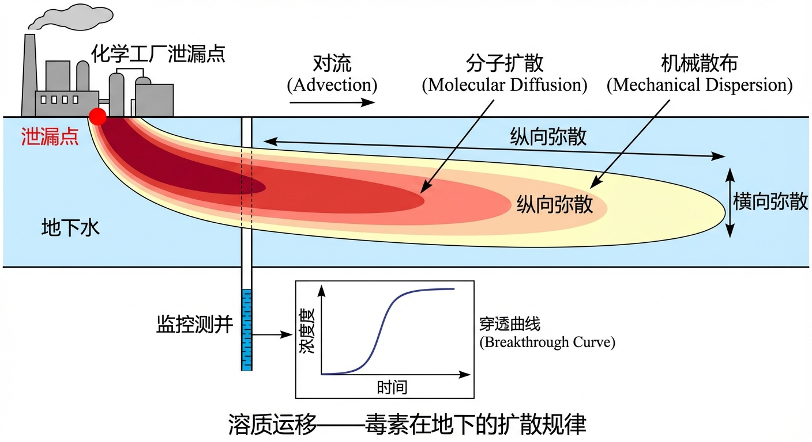
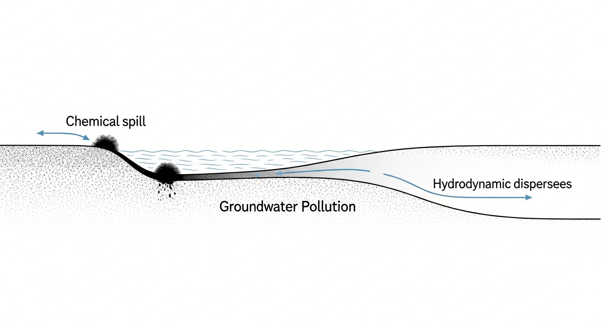
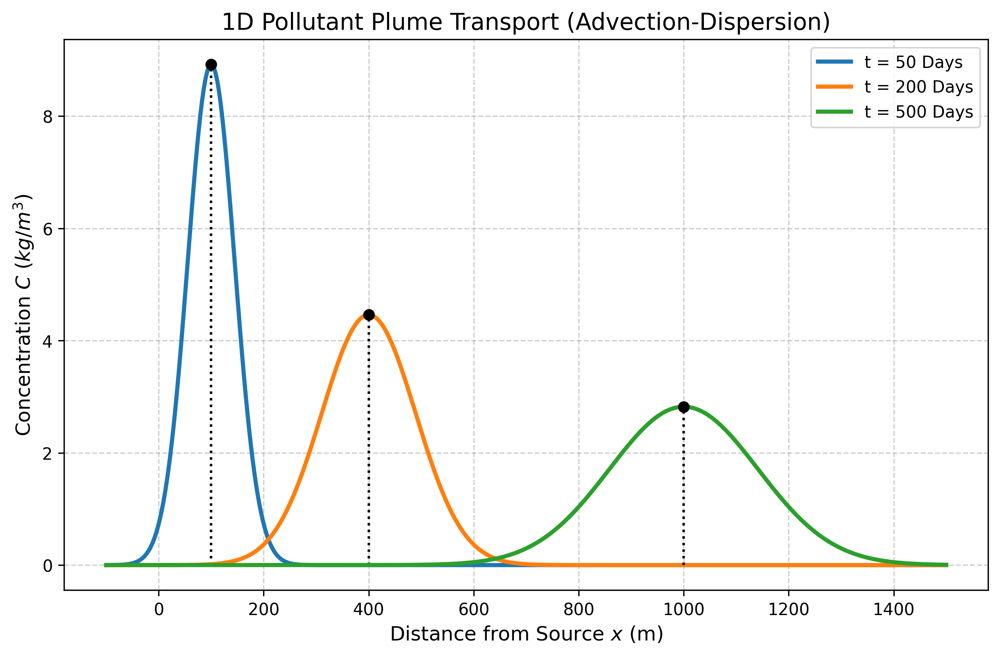
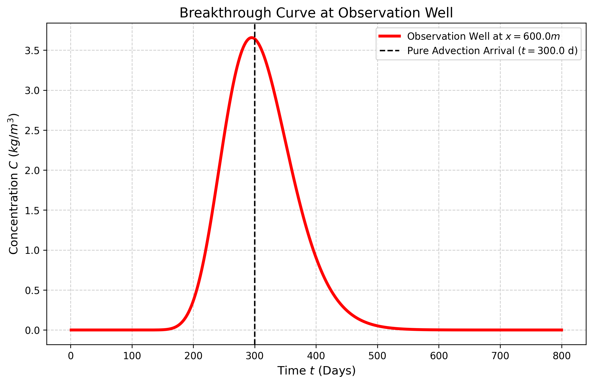

# 第 4 章：溶质运移：水质污染的对流与弥散

## 1. 学习目标
本章将视线从“水本身的运动”转移到“水中携带物质的运动”，探讨地下水污染防控中最核心的动力学理论。
读者需要掌握：
1. 污染物在地下水中的三种基本运移机制：对流（Advection）、分子扩散（Diffusion）与机械散布（Mechanical Dispersion）。
2. 水动力弥散系数（Hydrodynamic Dispersion Coefficient）与真实孔隙流速的耦合关系。
3. 一维对流弥散方程（Advection-Dispersion Equation, ADE）的解析解形式。
4. 污染羽（Plume）在空间上的扩展规律与观测井的穿透曲线（Breakthrough Curve）。

## 2. 教材理论：毒素在地下是如何扩散的？
地下水中的污染物运移可类比为流体中的溶质输运过程。
当化工厂发生泄漏，或者垃圾填埋场的防渗膜破裂时，毒素进入含水层，它的运动绝不仅仅是“跟着水流一起走”那么简单。真实世界中，污染物运移受两大核心机制主导：

1. **对流（Advection）**：
   这是最直观的运动。毒素随着地下水的宏观流动被带向下游。它的速度等于真实的**孔隙流速 $v_{pore} = \frac{v_{darcy}}{n}$**（其中 $n$ 为孔隙度）。如果只有对流，污染团将像一块固体石头一样，保持着最初的浓度和形状，被原封不动地搬运到远方。

2. **弥散（Dispersion）**：
   这是多孔介质特有的扩散增强机制。由于沙石颗粒大小不一，孔隙通道曲折且宽窄不一。同处于一个起跑线的毒素分子，有的走进了宽敞的高速通道，有的被迫挤进狭窄的慢速死角，还有的在绕过沙砾时走了更远的弯路。
   这种微观流速的不均匀性，导致原本聚集在一起的高浓度污染团，在向下游移动的过程中被不断“拉扯、撕裂”，变得越来越宽、越来越稀释。这种由机械散布和微观分子扩散叠加而成的宏观现象，称为**水动力弥散（Hydrodynamic Dispersion, $D_L$）**。

将这两大机制结合，就得到了地下水污染领域最基本的**对流-弥散偏微分方程 (ADE)**。

### 对流-弥散方程的完整推导

ADE 方程可以从质量守恒原理严格推导得到。考虑一维均匀流场中的微小控制体（长度 $\Delta x$、单位截面积），溶质在 $\Delta t$ 时间内的质量变化等于对流通量与弥散通量之差。

对流质量通量（单位时间、单位面积通过的溶质质量）为：
$$ J_{adv} = v_{pore} \cdot C \tag{4.1} $$
弥散质量通量遵循 Fick 第一定律的宏观类比：
$$ J_{disp} = -D_L \frac{\partial C}{\partial x} \tag{4.2} $$
其中 $D_L$ 为纵向水动力弥散系数，它由两部分组成：
$$ D_L = \alpha_L \cdot v_{pore} + D_m^* \tag{4.3} $$
式中 $\alpha_L$ 为纵向弥散度（Longitudinal Dispersivity），量纲 $[L]$，反映介质的非均质程度；$D_m^* = D_m / \tau$ 为有效分子扩散系数，$D_m$ 为自由水中的分子扩散系数（对于大多数溶质约为 $10^{-9} \sim 10^{-10} m^2/s$），$\tau$ 为迂曲度因子。在地下水流速不太低的条件下（$v_{pore} > 10^{-7} m/s$），机械弥散远大于分子扩散，$D_m^*$ 项可以忽略。

对控制体应用质量守恒：
$$ \frac{\partial(n \cdot C)}{\partial t} = -\frac{\partial}{\partial x}\left( n \cdot v_{pore} \cdot C - n \cdot D_L \frac{\partial C}{\partial x} \right) \tag{4.4} $$
假设孔隙度 $n$ 和流速 $v_{pore}$ 在空间和时间上均匀不变（均匀稳态流场），约去 $n$，即得 ADE 方程：
$$ \frac{\partial C}{\partial t} = D_L \frac{\partial^2 C}{\partial x^2} - v_{pore} \frac{\partial C}{\partial x} \tag{4.5} $$

### 贝克莱数的物理意义

对流与弥散两种机制的相对重要性，可以用无量纲的**贝克莱数（Peclet Number）**来衡量：
$$ Pe = \frac{v_{pore} \cdot L}{D_L} \tag{4.6} $$
其中 $L$ 为特征长度（通常取计算网格尺寸或问题的空间尺度）。当 $Pe \gg 1$ 时，对流占主导，污染团基本保持原始形态向下游平移；当 $Pe \ll 1$ 时，弥散占主导，污染物向各方向均匀扩散。在数值求解 ADE 时，贝克莱数还直接影响算法的稳定性：当单元贝克莱数（$Pe_{cell} = v_{pore} \cdot \Delta x / D_L$）超过 2 时，中心差分格式会产生严重的数值振荡（非物理的负浓度），必须采用上风差分、特征线法或 TVD 格式来保证解的稳定性和物理合理性。

### 一维 ADE 的解析解

对于**瞬时点源**（在 $x=0$、$t=0$ 时刻注入质量 $M$），ADE 的解析解为高斯分布：
$$ C(x,t) = \frac{M}{n \sqrt{4\pi D_L t}} \exp\left[ -\frac{(x - v_{pore} \cdot t)^2}{4 D_L t} \right] \tag{4.7} $$
该解表明：污染团中心以 $v_{pore}$ 速度移动；峰值浓度与 $1/\sqrt{t}$ 成正比下降；污染团的标准差（展宽）$\sigma = \sqrt{2D_L t}$ 与 $\sqrt{t}$ 成正比增长。

对于**连续点源**（在 $x=0$ 处从 $t=0$ 开始持续注入浓度 $C_0$），解析解为：
$$ C(x,t) = \frac{C_0}{2}\left[ \text{erfc}\left(\frac{x - v_{pore} t}{2\sqrt{D_L t}}\right) + \exp\left(\frac{v_{pore} x}{D_L}\right) \text{erfc}\left(\frac{x + v_{pore} t}{2\sqrt{D_L t}}\right) \right] \tag{4.8} $$
其中 $\text{erfc}$ 为互补误差函数。当 $t \to \infty$ 时，连续点源的解趋于稳态分布 $C(x) = C_0 \exp(-v_{pore} x / D_L)$，浓度沿流向呈指数衰减，不会无限增长。

### 弥散度的尺度效应

弥散度 $\alpha_L$ 存在著名的"尺度效应"：在实验室柱实验中（特征尺度约 $0.1 \sim 1m$），$\alpha_L$ 通常为 $0.01 \sim 0.1m$；在场地尺度（$10 \sim 100m$）上，$\alpha_L$ 增至 $1 \sim 10m$；在区域尺度（$>1000m$）上，$\alpha_L$ 可达 $10 \sim 100m$ 甚至更大。Gelhar 等人(1992)对全球数百个野外示踪试验数据的统计分析表明，$\alpha_L$ 与观测尺度 $L$ 之间近似存在幂律关系。

这种尺度效应的物理根源在于含水层非均质性的层次结构：在小尺度上，弥散主要由孔隙级别的流速不均匀性引起；在大尺度上，含水层中透镜体、夹层、断裂带等宏观非均质结构导致了更大范围的流速变异，从而表现为更强的宏观弥散效应。在建立溶质运移模型时，必须根据问题的空间尺度选择合适的弥散度值，而不能简单套用实验室数据。

**不同尺度下弥散度的典型取值范围**：

| 观测尺度 $L$ | 纵向弥散度 $\alpha_L$ | 横向弥散度 $\alpha_T$ | $\alpha_T / \alpha_L$ |
|:------------|:--------------------:|:--------------------:|:--------------------:|
| 实验室（$<1m$） | $0.01 \sim 0.1m$ | $0.001 \sim 0.01m$ | $0.1$ |
| 场地（$10 \sim 100m$） | $1 \sim 10m$ | $0.1 \sim 1m$ | $0.1 \sim 0.3$ |
| 区域（$>1000m$） | $10 \sim 100m$ | $1 \sim 10m$ | $0.1 \sim 0.3$ |

### CXTFIT 参数拟合方法

在实际的溶质运移研究中，弥散参数的确定通常依赖示踪试验数据的反演分析。CXTFIT 是由美国盐分实验室开发的参数估计程序，其核心思想是通过非线性最小二乘法，将 ADE 解析解（或数值解）与实测穿透曲线进行拟合，从而反演出最优的 $v_{pore}$ 和 $D_L$（进而得到 $\alpha_L$）。拟合的目标函数为：
$$ \min \sum_{i=1}^{N} \left[ C_{obs}(x_i, t_i) - C_{model}(x_i, t_i; v_{pore}, D_L) \right]^2 \tag{4.9} $$
CXTFIT 还支持包含吸附（线性平衡吸附、一级动力学吸附）和衰减（一级反应）等附加过程的参数反演，使其成为地下水污染研究中最广泛使用的参数辨识工具之一。

## 3. 案例分析：理论与实践的桥梁（一维均匀流场中化工厂瞬间泄漏扩散模拟）

### 案例背景
某化工厂发生严重事故，含有高毒性重金属的废水在瞬间击穿了地表，注入了地下浅层含水层（瞬时注入强度为 $1000 kg/m^2$）。
在化工厂下游 $600m$ 处，有一个为全镇供水的水源井。镇长紧急询问水文地质专家：这批污染物多久会到达水源井？到达时最高浓度是多少？水源井会被污染多久？

### 问题描述
- **含水层流场**：达西流速 $v = 0.5 m/d$，孔隙度 $n = 0.25$。
- **弥散参数**：介质的纵向弥散度 $\alpha_L = 10.0 m$（由此可算出水动力弥散系数 $D_L = \alpha_L \cdot v_{pore}$）。
- **污染源**：在 $x=0, t=0$ 时刻瞬时注入质量面密度 $M = 1000.0 kg/m^2$。
- **观测需求**：
  1. 绘制第 50天、200天、500天时，地下污染羽（Plume）在空间上的扩散剖面。
  2. 在 $x=600m$ 的水源井处，记录从第1天到第800天的浓度穿透曲线（Breakthrough Curve）。

**物理场景与问题概化图 (Generated via nano-banana-pro 3)：**

### 解题思路
本研究调用基于 Ogata-Banks 模型变体的一维 ADE 解析解公式进行时空推演：
1. **真实速度矫正**：首先区分达西流速与实际孔隙流速，计算出真实的溶质移动速度 $v_{pore} = 0.5 / 0.25 = 2.0 m/d$。
2. **时空双维扫描**：
   - 空间扫描：固定时间 $t$，让 $x$ 沿程变化，代入正态解析公式计算浓度，观察高斯钟形曲线如何变矮变胖。
   - 时间扫描：固定距离 $x=600m$，让 $t$ 随时间流逝，生成观测井的警报日志（穿透曲线）。

### 代码与仿真
> **学习提示**：后台执行了包含对流和弥散双重算子的解析解计算。请特别注意图表中那条”黑色垂直虚线”，它具有重要的物理意义。

Source: `assets/ch04/ch04_advection_dispersion.py`

**污染羽核心扩散追踪矩阵（浓度峰值与展宽）：**
|   Time (Days) |   Plume Center X (m) |   Peak Concentration C_max |   Plume Spread Width (m) |
|--------------:|---------------------:|---------------------------:|-------------------------:|
|            50 |                  100 |                       8.92 |                    271.4 |
|           150 |                  300 |                       5.15 |                    470.2 |
|           300 |                  600 |                       3.64 |                    664.9 |
|           500 |                 1000 |                       2.82 |                    858.4 |

**污染团空间演进与浓度稀释剖面：**

**下游 600m 水源观测井穿透曲线 (Breakthrough Curve)：**

### 结果分析
计算结果清楚地表明了弥散效应带来的”早到”与”迟走”两方面影响：
- **污染物的提前到达（弥散效应）**：按照纯粹的对流速度（$2.0 m/d$），污染物本应在第 300 天（$600m / 2.0$）到达水源井。但观察 `breakthrough_curve.png`（红线），由于弥散作用（部分溶质通过高渗透率孔隙通道提前运移），**在第 200 天左右，水源井的浓度就已经开始上升。**如果仅按对流速度估算而在第 300 天才关闭水泵，则会造成约100天的污染暴露期。这是弥散效应带来的重要后果——预警时间的显著缩短。
- **浓度的长尾效应**：同时，由于一部分溶质在微小孔隙中滞留，当峰值浓度（第 300 天前后）经过水源井后，水质并未立即恢复。即便到了第 500 天、第 600 天，水源井依然能检测到残留的污染物。这就是典型的”污染长尾”现象。
- **自然稀释效应**：弥散效应使污染团在空间上展宽的同时，峰值浓度也相应降低。从表格中可以看到，在第 50 天时，峰值浓度为 $8.92 kg/m^3$（宽度仅 $271m$）；而经过 300 天运移到达水源井时，污染带已展宽至 $664m$，峰值浓度降低到 $3.64 kg/m^3$。
- **贝克莱数的定量分析**：本案例中 $v_{pore} = 2.0 m/d$，$D_L = \alpha_L \cdot v_{pore} = 10 \times 2.0 = 20 m^2/d$。取问题特征尺度 $L = 600m$（泄漏点到水源井的距离），贝克莱数 $Pe = v_{pore} \cdot L / D_L = 2.0 \times 600 / 20 = 60$。由于 $Pe \gg 1$，说明本案例以对流为主导，弥散起到的是修正而非控制作用。正因如此，污染团仍然保持着较为集中的高斯分布形态，而非在各方向上均匀弥散。但即便弥散的相对贡献较小，其导致的100天提前到达时间在工程实践中仍然具有决定性意义。
- **解析解精度的适用范围**：式(4.7)的高斯解析解严格成立的前提是均匀稳态流场、均质含水层和无化学反应。在实际的含水层中，非均质性导致的宏观弥散、吸附解吸的延迟效应、以及生物降解和化学反应等过程，都会使真实的穿透曲线偏离高斯理论预测。特别是，吸附作用会延迟污染物的到达时间（延迟因子 $R = 1 + \rho_b K_d / n$，其中 $K_d$ 为分配系数），而一级降解反应则会使浓度随距离和时间呈指数下降。当这些附加过程显著时，必须采用包含吸附和反应项的扩展 ADE 进行分析。

### 工业部署建议
1. **环保溯源的逆向工程**：当环保局在某口井里突然测到了污染物，通常会反向运用这个 ADE 方程，结合贝叶斯算法或马尔可夫链蒙特卡洛（MCMC）方法，根据测到的穿透曲线（浓度上升的速度和形状），逆向反推出污染源到底在多远的地方（定位）、是哪一天泄漏的（定案）。
2. **可渗透反应墙（PRB）拦截设计**：为了保护下游水源井，现代地下水修复工程会在污染羽移动的前方道路上，垂直挖一条长沟，填入零价铁（ZVI）或活性炭，建造一面”可渗透反应墙”。地下水可以通过，但污染物会在穿过墙体时被化学还原或物理吸附。PRB 墙的厚度和位置设计，完全依赖于本章介绍的这种对流-弥散模型。
3. **监测自然衰减（MNA）策略**：对于某些低风险的污染场地，自然衰减可能是最经济的修复方案。其核心思想是利用含水层中天然存在的生物降解、化学反应和弥散稀释过程，使污染羽在到达敏感受体（如饮用水井）之前浓度降至安全标准以下。MNA 策略的可行性评估完全依赖于 ADE 模型的预测：通过在污染源和受体之间设置多个监测井，获取不同位置和时间的浓度数据，利用 CXTFIT 或类似工具反演运移参数和降解速率常数，进而预测污染羽的长期演化趋势。只有当模型预测表明自然衰减速率足以在安全距离内将浓度降至标准以下时，MNA 策略才被允许实施。在我国《地下水污染防治规划》的技术框架中，污染场地调查评估报告中的溶质运移模拟是必要的技术支撑内容。

## 4. 本章小结

本章从质量守恒原理出发，严格推导了一维对流-弥散方程（ADE，式4.5），阐明了水动力弥散系数的组成（式4.3）——机械弥散与分子扩散的叠加。贝克莱数（式4.6）作为对流与弥散相对强度的度量指标，不仅具有物理判据意义，还直接影响数值方法的选择和稳定性。

本章给出了两种典型污染源条件下的解析解：瞬时点源的高斯解（式4.7）和连续点源的 Ogata-Banks 解（式4.8）。前者说明污染团中心以 $v_{pore}$ 移动、展宽随 $\sqrt{t}$ 增长、峰值浓度随 $1/\sqrt{t}$ 衰减；后者说明连续排放条件下浓度最终趋于稳态指数分布。

弥散效应带来的"早到"现象（污染先头部队提前到达）和"长尾"效应（残余污染持续存在）具有重大的工程意义，直接关系到污染预警时间和地下水修复周期的评估。弥散度 $\alpha_L$ 存在显著的尺度效应（从实验室的厘米级到区域尺度的数十米），其物理根源在于含水层非均质性的层次结构。CXTFIT 参数拟合方法（式4.9）提供了从示踪试验数据反演弥散参数的标准化工具。在实际应用中，还需要考虑吸附、降解等化学过程对溶质运移的影响，这些过程可通过延迟因子和反应项纳入扩展的 ADE 框架。监测自然衰减策略的可行性评估，以及可渗透反应墙的工程设计，均以 ADE 模型的预测结果为核心依据。从本章案例的数值复现中可以得到的核心工程启示是：在污染事故的应急响应中，仅依据对流速度估算污染物到达时间将严重低估风险，弥散效应导致的提前到达必须纳入预警方案的考量。

## 5. 思考题

1. 一维对流-弥散方程（ADE）为 $\frac{\partial C}{\partial t} = D_L \frac{\partial^2 C}{\partial x^2} - v_{pore} \frac{\partial C}{\partial x}$。请分别说明方程右端两项的物理意义：如果 $D_L = 0$（无弥散），污染团将如何运动？如果 $v_{pore} = 0$（无对流），污染团又将如何演化？

2. 贝克莱数（Peclet Number）定义为 $Pe = \frac{v_{pore} \cdot L}{D_L}$，其中 $L$ 为特征长度。当 $Pe \gg 1$ 时，运移以对流为主；当 $Pe \ll 1$ 时，以弥散为主。请计算本章案例中 $Pe$ 数的量级，并讨论：在什么样的含水层条件下（流速、弥散度、距离），弥散效应可以忽略？

3. 弥散度 $\alpha_L$ 存在著名的"尺度效应"（scale effect）：在实验室柱实验中，$\alpha_L$ 通常为厘米量级；在野外尺度上，$\alpha_L$ 可达数米甚至数十米。请从多孔介质的微观非均质性角度，解释这种尺度效应产生的物理原因。

4. 某化工厂在含水层中持续排放污水（连续点源，而非瞬时点源），下游 $500m$ 处有一口饮用水井。请定性分析：与本章瞬时点源案例相比，连续点源情况下穿透曲线（Breakthrough Curve）的形状有何不同？稳态浓度是否会无限增长？

## 6. 参考文献

[1] Bear J. Dynamics of Fluids in Porous Media[M]. New York: American Elsevier, 1972.

[2] Zheng C, Bennett G D. Applied Contaminant Transport Modeling[M]. 2nd ed. New York: John Wiley & Sons, 2002.

[3] Toride N, Leij F J, van Genuchten M T. The CXTFIT code for estimating transport parameters from laboratory or field tracer experiments, Version 2.0[R]. Research Report No. 137. Riverside: U.S. Salinity Laboratory, 1995.

[4] 雷晓辉,张峥,苏承国,等.自主运行智能水网的在环测试体系[J].南水北调与水利科技(中英文),2025,23(04):787-793.DOI:10.13476/j.cnki.nsbdqk.2025.0080.
