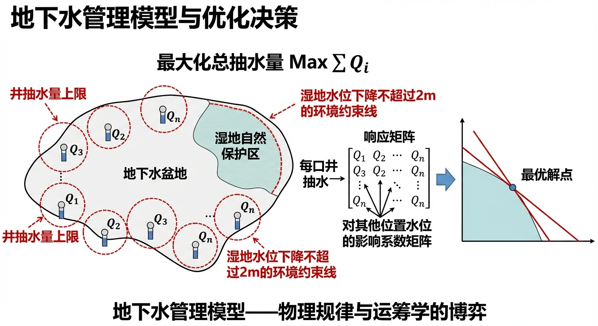
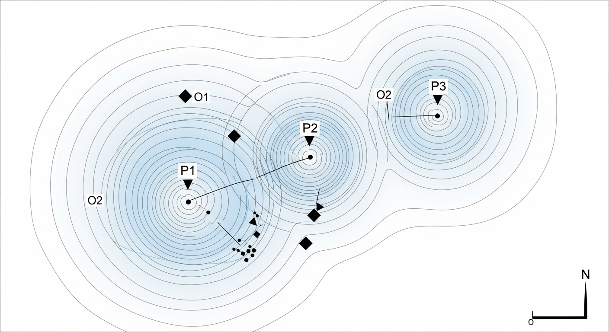
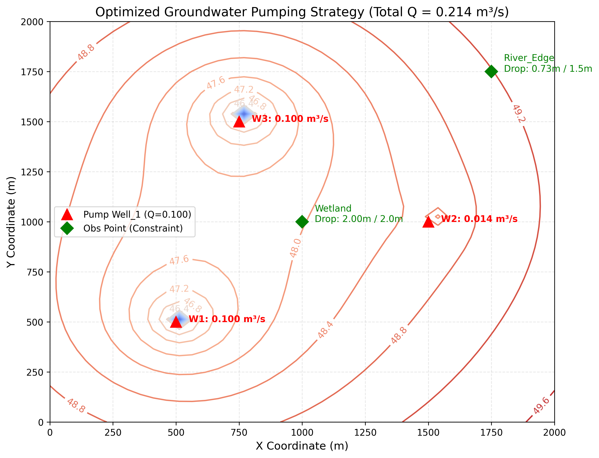

# 第 5 章：地下水管理模型：物理规律与运筹学的博弈

## 1. 学习目标
本章是地下水科学的高阶应用。不再局限于”预测地下水会怎么流”，而是通过数学优化，为决策者回答”应该怎么抽水”的问题。
读者需要掌握：
1. 响应矩阵法（Response Matrix Method）的构建与线性叠加原理。
2. 地下水管理模型的目标函数（Objective Function）与约束条件（Constraints）。
3. 线性规划（Linear Programming, LP）在水资源分配中的应用。
4. 经济发展需求与生态环境保护之间的博弈与妥协。

## 2. 教材理论：给地下水装上“自动驾驶”
在传统的地下水流模拟（如前几章的 MODFLOW）中，工程师的计算模式是**正向的（Forward Simulation）**：给定抽水井的位置和流量，算出一个降落漏斗，看看有没有超标；如果超标了，就凭经验估计一个更小的流量，再算一遍。这种”试凑法”面对几百口井的大型盆地时，效率很低。

现代水文地质学家引入了运筹学（Operations Research），将地下水模型从“模拟器”升级为**“管理模型（Management Model）”**。这是一种**逆向求解**过程。

管理模型由三大要素构成：
1. **决策变量（Decision Variables）**：通常是每口井的抽水量 $Q_1, Q_2, \dots, Q_n$。
2. **目标函数（Objective Function）**：优化所追求的核心目标。例如：最大化总抽水量 $\text{Max } \sum Q_i$，或者最小化水泵的耗电费用。
3. **约束条件（Constraints）**：大自然的物理底线和人类的行政法规。例如：任何一口井的抽水量不能超过水泵上限（物理约束）；某个自然保护区湿地下方的水位下降绝对不能超过 $2.0m$（环境约束）。

**响应矩阵法（Response Matrix）的数学推导**：

优化算法（如线性规划 LP）需要快速计算数万次，不可能每次都在循环中求解偏微分方程。由于承压含水层的渗流方程（拉普拉斯方程或泰斯方程）是线性的，可利用**叠加原理**预先算好一个系数矩阵。

具体地，设含水层中有 $n$ 口抽水井和 $m$ 个需要保护的环境敏感点。定义影响系数 $a_{ij}$ 为第 $j$ 口井以单位流量（$Q_j = 1$）抽水时，在第 $i$ 个敏感点引起的降深。这些系数可以通过解析公式（如泰斯稳态解的对数近似 $a_{ij} = \frac{1}{2\pi T}\ln\frac{R}{r_{ij}}$，其中 $r_{ij}$ 为第 $j$ 口井到第 $i$ 个敏感点的距离，$R$ 为影响半径）或数值模型（如运行 $n$ 次 MODFLOW，每次只开一口井）计算得到。

所有影响系数构成响应矩阵 $\mathbf{A}$：
$$ \mathbf{A} = \begin{pmatrix} a_{11} & a_{12} & \cdots & a_{1n} \\ a_{21} & a_{22} & \cdots & a_{2n} \\ \vdots & \vdots & \ddots & \vdots \\ a_{m1} & a_{m2} & \cdots & a_{mn} \end{pmatrix} \tag{5.1} $$

那么，任何抽水组合 $\mathbf{Q} = (Q_1, Q_2, \dots, Q_n)^T$ 在所有敏感点引起的降深向量为：
$$ \mathbf{s} = \mathbf{A} \mathbf{Q} \tag{5.2} $$
环境约束条件要求每个敏感点的降深不超过允许上限：
$$ \mathbf{A} \mathbf{Q} \le \mathbf{s}_{max} \tag{5.3} $$
这使得复杂的偏微分方程约束被降维为优化算法可直接处理的线性不等式。

### 线性规划模型的标准形式

地下水管理模型的线性规划（LP）标准形式为：
$$ \max \quad \mathbf{c}^T \mathbf{Q} = \max \sum_{j=1}^{n} c_j Q_j \tag{5.4} $$
$$ \text{s.t.} \quad \mathbf{A} \mathbf{Q} \le \mathbf{s}_{max} \quad \text{（环境约束）} \tag{5.5} $$
$$ \quad 0 \le Q_j \le Q_j^{max}, \quad j = 1, 2, \dots, n \quad \text{（产能约束）} \tag{5.6} $$
其中 $c_j$ 为目标函数系数（最大化总产水量时 $c_j = 1$；最小化运行成本时 $c_j$ 取各井单位流量的运行费用）。

### 对偶问题与影子价格

每个线性规划问题都存在一个对偶问题。原问题（最大化产水量）的对偶问题为：
$$ \min \quad \mathbf{s}_{max}^T \boldsymbol{\lambda} + \sum_{j=1}^{n} Q_j^{max} \mu_j \tag{5.7} $$
$$ \text{s.t.} \quad \mathbf{A}^T \boldsymbol{\lambda} + \boldsymbol{\mu} \ge \mathbf{c} \tag{5.8} $$
$$ \quad \boldsymbol{\lambda} \ge 0, \quad \boldsymbol{\mu} \ge 0 \tag{5.9} $$
其中 $\boldsymbol{\lambda} = (\lambda_1, \lambda_2, \dots, \lambda_m)^T$ 为环境约束的对偶变量，即**影子价格（Shadow Price）**。$\lambda_i$ 的物理意义是：如果第 $i$ 个敏感点的最大允许降深 $s_{max,i}$ 放宽1个单位（如从 $2.0m$ 放宽到 $3.0m$），目标函数值（总产水量）将增加 $\lambda_i$ 个单位。影子价格为决策者提供了约束条件的边际价值评估——约束越"紧"（恰好取等号的约束），其影子价格越大，说明放宽该约束对系统收益的提升越显著。影子价格为零的约束表明该约束目前处于"松弛"状态，放宽它对最优解没有任何改善作用。

### 灵敏度分析

影子价格还可以用于灵敏度分析（Sensitivity Analysis）。工程师可以回答以下类型的问题：
- 如果环保标准变化（$s_{max}$ 增大或减小），最优产水量如何变化？
- 如果某口井的水泵升级（$Q_j^{max}$ 增大），是否值得投资？
- 含水层参数的不确定性（$T$ 和 $S$ 的测量误差）如何影响最优决策的鲁棒性？

在线性规划的最优解中，目标函数值在约束条件右端值的一个范围内保持为对偶变量的线性函数，这个范围称为影子价格的有效范围。超出有效范围后，基变量发生变化（基变换），影子价格需要重新计算。

### 多目标优化：供水量与地面沉降控制

在实际的地下水管理中，往往需要同时考虑多个相互冲突的目标。典型的多目标优化问题包括：
$$ \max \quad f_1(\mathbf{Q}) = \sum_{j=1}^{n} Q_j \quad \text{（最大化供水量）} \tag{5.10} $$
$$ \min \quad f_2(\mathbf{Q}) = \max_i \{ s_i(\mathbf{Q}) \} \quad \text{（最小化最大降深/沉降量）} \tag{5.11} $$
这两个目标是矛盾的：增大抽水量必然导致更大的降深和更高的地面沉降风险。多目标优化的解不是一个点，而是一组 Pareto 最优解集——在该集合中，任何解都不能在改善一个目标的同时不恶化另一个目标。Pareto 前沿曲线直观地展示了供水收益与环境代价之间的权衡关系，为决策者在不同偏好下选择方案提供了科学依据。

### CHS 理论中 P5 鲁棒性原理的体现

从水系统控制论（CHS）的视角来看，地下水管理模型是 P5 鲁棒性原理（Robustness Principle）在水资源系统中的典型应用。P5 原理要求控制系统在参数不确定性和外部扰动下仍能保持基本性能。在地下水管理的语境中，鲁棒性体现在以下方面：含水层的水文地质参数（$T$、$S$）存在显著的空间变异性和测量不确定性，而优化方案必须在这些不确定条件下仍然满足环境约束。因此，鲁棒优化方法（如机会约束规划、最坏情况优化）逐渐成为地下水管理的前沿研究方向。这类方法不追求单一参数条件下的最优，而是寻找在参数变化范围内均能满足约束的稳健方案，体现了"宁可保守也不超标"的工程安全理念。

## 3. 案例分析：理论与实践的桥梁（含生态约束的多井抽水线性规划）

### 案例背景
某干旱地区规划了 3 口候选水源井，准备为城市供水（目标是把总抽水量开到最大）。每口井配备的水泵最大产能都是 $0.1 m^3/s$。
但是，环保部门介入了。在井群附近有一片珍贵的湿地（Wetland）和一条河流（River Edge）。环保法规强制约束：湿地处的地下水位下降不能超过 $2.0m$，河流边缘的水位下降不能超过 $1.5m$。
需要确定一个优化方案：这三口井应各抽多少水，才能在满足环保约束的前提下，获取最大的供水量？

### 问题描述
- **含水层区域**：$2000m \times 2000m$，导水系数 $T = 0.02 m^2/s$，初始水头 $H_0 = 50m$。
- **决策变量**：三口井 $W_1(10,10)$, $W_2(30,20)$, $W_3(15,30)$ 的抽水量 $Q_1, Q_2, Q_3$。
- **产能约束**：$0 \le Q_i \le 0.1 m^3/s$。
- **生态约束**：
  - 湿地观测点 $(20,20)$：降深 $s \le 2.0m$。
  - 河流观测点 $(35,35)$：降深 $s \le 1.5m$。
- **目标函数**：Maximize $(Q_1 + Q_2 + Q_3)$。
使用响应矩阵法结合线性规划（LP）求解最优抽水策略。

**物理场景与问题概化图 (Generated via nano-banana-pro 3)：**

### 解题思路
本研究引入了 `scipy.optimize.linprog` 运筹学引擎与地下水物理模型进行底层跨界联合：
1. **生成响应矩阵**：通过解析公式（泰斯稳态对数近似），分别单独开启 $W_1, W_2, W_3$（$Q=1$），记录它们在“湿地”和“河边”造成的单位降深，形成 $2 \times 3$ 的线性响应矩阵 $A_{ub}$。
2. **构建单纯形法（Simplex）问题**：目标向量 $c = [-1, -1, -1]$（求极小值以实现最大化）。上限约束向量 $b_{ub} = [2.0, 1.5]$。变量边界 $bounds = [0, 0.1]$。
3. **求解与流场重构**：将优化出的最佳 $Q_{opt}$ 代回物理引擎，基于叠加原理重构出全域的稳态降深等值线图。

### 代码与仿真
> **学习提示**：后台执行了将物理偏微分方程转化为线性规划约束的完整过程。这是运筹学在地球科学中的典型应用，也是水资源管理部门配水调度系统的核心算法。

Source: `assets/ch05/ch05_groundwater_optimization.py`

**多井抽水最优策略及生态约束检验矩阵：**
| Component     | Type                      | Optimal Value   | Constraint / Capacity   |
|:--------------|:--------------------------|:----------------|:------------------------|
| Well_1        | Pumping Well              | 0.100 m³/s      | Max 0.100 m³/s          |
| Well_2        | Pumping Well              | 0.014 m³/s      | Max 0.100 m³/s          |
| Well_3        | Pumping Well              | 0.100 m³/s      | Max 0.100 m³/s          |
| Wetland       | Env Constraint (Drawdown) | 2.00 m          | Max 2.0 m               |
| River_Edge    | Env Constraint (Drawdown) | 0.73 m          | Max 1.5 m               |
| Total Pumping | Objective Function        | 0.214 m³/s      | -                       |

**全域最优化降落漏斗叠加等值线图：**

### 结果分析
线性规划求解器客观地给出了恰好满足约束条件的最优解：
- **约束的差异化影响**：观察表格中的最优抽水量。三口井中，$W_1$ 和 $W_3$ 都被允许满负荷运行（$0.100 m^3/s$）。然而，**$W_2$ 被严格限制，仅允许抽取 $0.014 m^3/s$。** 原因如下。
- **保护区的无形护盾**：答案在图表 `optimized_flow_field.png` 中。看那个绿色的菱形标志（Wetland）。$W_1$ 和 $W_3$ 距离湿地相对较远，但 $W_2$ 离湿地太近了。如果让 $W_2$ 满负荷抽水，其降落漏斗会导致湿地水位过度下降。优化算法精确计算出：将 $W_2$ 的出力限制在产能的 $14\%$，恰好使湿地处的降深等于 $2.00m$（见表格的 Env Constraint 检验）。
- **总目标的妥协**：如果不考虑环保约束，三口井全开的总水量为 $0.3 m^3/s$（但湿地水位将严重超标）。加入环保约束后，系统找到了最优折中方案：总抽水量为 $0.214 m^3/s$。减少的 $0.086 m^3/s$，即为保护生态环境所付出的供水代价。
- **影子价格的工程解读**：在本案例中，湿地约束恰好取等号（$2.00m = 2.0m$），说明该约束处于"紧约束"状态，其影子价格 $\lambda_1 > 0$。河流约束处于松弛状态（$0.73m < 1.5m$），其影子价格 $\lambda_2 = 0$。这意味着，如果环保部门将湿地允许降深从 $2.0m$ 放宽到 $2.5m$，系统总产水量将获得显著提升（$W_2$ 的流量将大幅增加）；但即使放宽河流约束（从 $1.5m$ 到任意更大值），总产水量不会有任何改变。这一分析为环保部门确定优先管理目标提供了定量依据。
- **最优解的几何特征**：根据线性规划的基本定理，最优解一定出现在可行域的顶点上。在本案例中，可行域由6个不等式约束（3个产能上限 + 2个环境约束 + 各井非负约束）构成的多面体决定。最优解处恰好有3个约束取等号（$Q_1 = 0.1$、$Q_3 = 0.1$、湿地降深 $= 2.0m$），对应可行域的一个顶点。单纯形法正是沿着多面体的边从一个顶点移动到相邻的更优顶点，直至找到最优解。

### 工业部署建议
1. **影子价格（Shadow Price）的经济学意义**：在线性规划的输出中，往往还附带一个“影子价格”。它告诉市长：如果我花钱去游说环保局，把湿地的约束从 $2.0m$ 放宽到 $2.1m$，总产水量能增加多少？这直接将水文地质学转化为了一门“环境经济学”，是辅助政府高层进行水权交易（Water Rights Trading）定价的核心依据。
2. **非线性优化的挑战**：本案例基于承压含水层的线性叠加假设。但在潜水含水层中（$T$ 随水头变化，见第3章），叠加原理失效，响应矩阵 $\mathbf{A}$ 不再是一个常量矩阵。此时必须使用遗传算法（GA）、模拟退火（SA）或基于梯度的非线性规划（NLP）引擎。这通常需要通过不断外挂调用 MODFLOW（Simulation-Optimization 耦合）来进行求解，每次评估目标函数都需要完整运行一次数值模型，计算成本可能高达数天。
3. **时变管理模型的扩展**：本章讨论的是稳态管理模型，假设抽水量恒定不变。在实际的水源地运行管理中，抽水量往往需要随季节变化的需水量和补给量进行动态调整。此时需要建立多时段管理模型，在每个管理时段设置独立的决策变量和约束条件，响应矩阵也需要扩展为包含时间维度的动态响应矩阵。这种时变管理模型的决策变量数量为"井数乘以时段数"，问题规模急剧增大，但仍然可以用线性规划求解。

## 4. 本章小结

本章将地下水动力学与运筹学相结合，系统介绍了地下水资源管理优化的理论框架与核心方法。

首先，响应矩阵法（式5.1-5.3）是连接物理模型与优化算法的关键桥梁。通过利用线性叠加原理，预先计算每口井在每个敏感点的单位降深影响系数，将复杂的偏微分方程约束降维为线性不等式。这一方法的前提是含水层渗流方程的线性性，对于承压含水层（$T$ 为常数）严格成立，但对于潜水含水层（$T = Kh$ 随水头变化）需要引入近似或改用非线性优化方法。

其次，线性规划模型的标准形式（式5.4-5.6）由决策变量（各井抽水量）、目标函数（最大化总产水量或最小化成本）和约束条件（产能上限、环境下限）三要素构成。对偶理论（式5.7-5.9）揭示了影子价格的深刻物理意义——每个约束条件的边际价值，为决策者提供了约束条件的经济评估依据。灵敏度分析进一步考察了参数变化对最优解的影响，为工程方案的稳健性评估提供了量化工具。

本章案例表明，在引入生态约束后，优化算法能够精确找到"卡在法律底线上"的最优解——距离生态敏感区最近的水井被严格限流，而远处的水井可以满负荷运行。多目标优化（式5.10-5.11）则将问题从单一目标扩展到供水量与环境保护的权衡分析，Pareto 前沿曲线为不同偏好条件下的方案选择提供了科学依据。

从水系统控制论（CHS）的视角来看，地下水管理优化是 P5 鲁棒性原理的典型应用场景。含水层参数的不确定性要求优化方案具有足够的鲁棒性——在参数变化范围内均能满足环境约束。鲁棒优化方法（机会约束规划、最坏情况优化）的引入，使得地下水管理从"确定性最优"走向"不确定性下的稳健可行"，体现了CHS理论框架中安全约束优先的工程哲学。

## 5. 思考题

1. 响应矩阵中的元素 $a_{ij}$ 表示第 $j$ 口井以单位流量抽水时，在第 $i$ 个观测点引起的降深。请说明：为什么 $a_{ij}$ 的大小主要取决于第 $j$ 口井与第 $i$ 个观测点之间的距离？如果含水层是各向异性的（$K_x \ne K_y$），响应矩阵的对称性是否仍然成立？

2. 本章案例中，优化结果表明 $W_2$ 被严格限流（仅为产能的 14%）。如果环保部门同意将湿地约束从 $2.0m$ 放宽到 $2.5m$，请定性分析 $W_2$ 的最优抽水量和系统总产水量将如何变化。这体现了线性规划中什么概念的含义？

3. 在潜水含水层中，导水系数 $T = Kh$ 随水头 $h$ 变化，叠加原理不再严格成立。此时响应矩阵 $A$ 不再是常数矩阵。请讨论：在这种非线性情况下，如何修改管理模型的求解策略？有哪些可行的替代优化方法？

4. 某地区有 5 口候选水源井和 3 个环境敏感点（湿地、河流、泉水出露点），每个敏感点都有最大允许降深约束。请设计一个完整的线性规划问题的数学表达式（写出目标函数、决策变量、约束条件的一般形式），并说明如何利用响应矩阵将水文地质约束转化为线性约束。

## 6. 参考文献

[1] Ahlfeld D P, Mulligan A E. Optimal Management of Flow in Groundwater Systems[M]. San Diego: Academic Press, 2000.

[2] Gorelick S M. A review of distributed parameter groundwater management modeling methods[J]. Water Resources Research, 1983, 19(2): 305-319.

[3] 雷晓辉,龙岩,许慧敏,等.水系统控制论：提出背景、技术框架与研究范式[J].南水北调与水利科技(中英文),2025,23(04):761-769+904.DOI:10.13476/j.cnki.nsbdqk.2025.0077.

[4] 雷晓辉,苏承国,龙岩,等.基于无人驾驶理念的下一代自主运行智慧水网架构与关键技术[J].南水北调与水利科技(中英文),2025,23(04):778-786.DOI:10.13476/j.cnki.nsbdqk.2025.0079.
