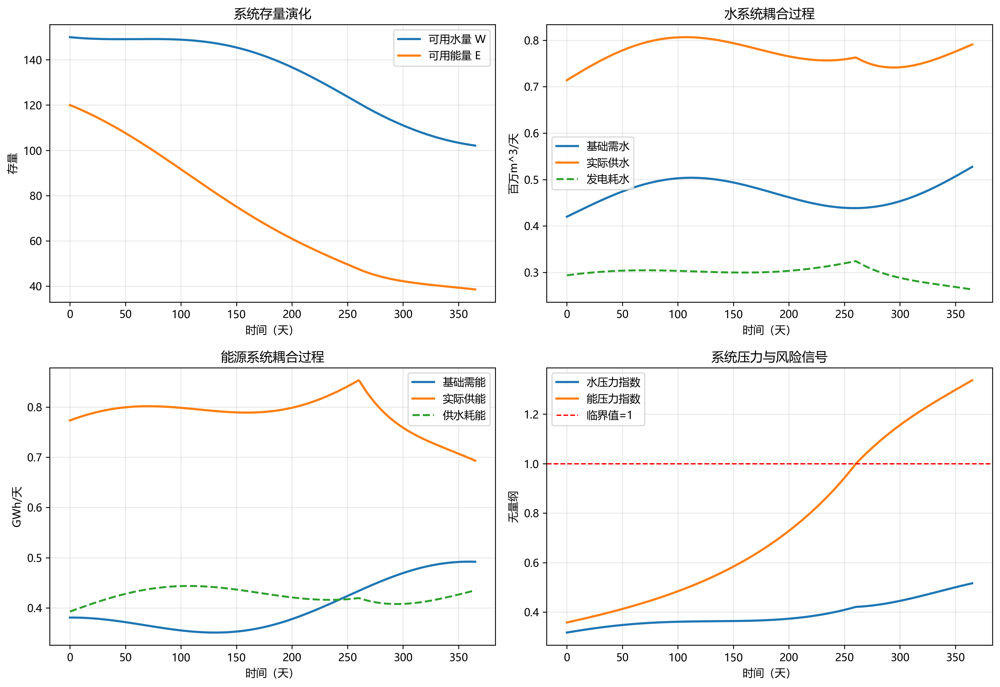

# 第2章 水-能耦合建模

## 本章导读

水-能耦合系统（Water-Energy Nexus）作为现代区域资源管理与基础设施规划的核心研究对象，其内部存在的非线性反馈与复杂交互机制，要求工程设计与运行管理突破单一资源视角的局限。本章围绕水-能耦合建模的理论框架与工程应用展开，系统阐释水资源循环与能源代谢的物理映射关系。内容不仅涵盖水利系统能耗分析、水电工程水资源消耗机理等基础理论，同时深入探讨水能投入产出矩阵及系统动力学（System Dynamics, SD）等宏观建模方法。

在工程实践层面，本章从数学抽象出发，构建水-能耦合的核心微分方程组与多目标优化求解框架，详细推导涉及质量守恒与能量守恒的耦合动力学公式，并剖析各控制参数的物理机制与工程约束条件。在此基础上，引入跨流域调水与多能互补发电的典型工程案例，运用数值仿真手段揭示不同边界条件下的系统演化规律。本章旨在为读者提供一套完整的理论工具与方法论体系，为复杂水利系统的规划设计、联合调度与安全运行提供坚实的定量分析基础。

## 2.1 基本概念与理论框架

水与能的耦合关系可概括为“水驱动能（Water for Energy, W4E）”与“能驱动水（Energy for Water, E4W）”两个维度。在建立数学模型前，需对系统边界、能流/水流网络拓扑及核心物理过程进行界定。

### 2.1.1 水利系统能耗分析（E4W）

水利系统全生命周期的能耗主要集中在原水取用、输配、净水处理及污水再生等环节。其中，长距离跨流域调水工程的泵站提水能耗在区域总能耗中占据显著比重。流体输送过程的能耗模型基于伯努利方程，受扬程、管网阻力系数与机组效率的共同制约。现代水务系统正逐步向高耗能的非传统水源（如海水淡化、再生水利用）拓展，这进一步强化了水资源供给侧对能源系统（尤其是电网）的依赖。下表展示了典型水处理与输配过程的能耗强度参考区间。

| 过程环节 | 技术路线/工程类型 | 能耗强度区间 $(kWh/m^3)$ | 核心影响因素 |
| :--- | :--- | :--- | :--- |
| 原水取水 | 地表水自流/浅层地下水 | $0.05 - 0.20$ | 取水高程差、水泵效率 |
| 跨流域调水 | 多级泵站梯级提水 | $0.50 - 3.50$ | 总扬程、输水距离、管网摩阻 |
| 净水处理 | 常规混凝沉淀过滤 | $0.15 - 0.35$ | 原水浊度、药剂投加量 |
| 海水淡化 | 反渗透（RO） | $2.50 - 4.00$ | 海水盐度、高压泵效率、能量回收装置 |
| 污水处理 | 传统活性污泥法 | $0.30 - 0.60$ | 进水BOD/COD浓度、曝气方式 |



### 2.1.2 能源系统水耗分析（W4E）

能源开采、转化与利用过程均伴随不同规模的水资源消耗。火力发电与核电的冷却系统（直流冷却或循环冷却）是工业用水的绝对主体；水力发电虽不直接“消耗”水体，但水库大面积水面蒸发及为维持河道生态所必须下泄的环境流量，构成了广义上的水电水耗。此外，页岩气水力压裂采掘、煤炭洗选及生物质能作物的灌溉，均在区域水循环中占据较大份额。

### 2.1.3 水-能投入产出矩阵分析

基于列昂惕夫（Leontief）投入产出理论，可构建宏观经济系统下的水-能耦合矩阵。设区域经济分为 $n$ 个部门，定义直接消耗系数矩阵为 $A$，水资源直接消耗强度向量为 $F_w$（单位产值耗水量），能源直接消耗强度向量为 $F_e$（单位产值耗能）。水与能的完全消耗系数向量 $C_w$ 与 $C_e$ 可表示为：
$$ C_w = F_w (I - A)^{-1} $$
$$ C_e = F_e (I - A)^{-1} $$
其中，$(I - A)^{-1}$ 为列昂惕夫逆矩阵。该框架量化了隐含在供应链中的“虚拟水”与“虚拟能”流动，为产业结构调整与资源配置提供了宏观决策依据。

### 2.1.4 系统动力学建模基础

水-能系统包含众多的非线性反馈环。例如，“水资源短缺 $\rightarrow$ 增加海水淡化/跨流域调水 $\rightarrow$ 能耗急剧增加 $\rightarrow$ 碳排放增加及气候变暖 $\rightarrow$ 加剧局部水资源短缺”构成了一个典型的正反馈（增强型）回路。系统动力学（SD）采用存量（Stock）、流量（Flow）和辅助变量（Auxiliary Variable）构建因果回路图与存量流量图，通过一阶常微分方程组描述系统状态变量的时间演化，适用于中长期资源承载力演变规律的模拟。

## 2.2 数学建模与求解方法

水-能耦合建模的核心在于用严谨的数学语言表述物质守恒与能量转换规律。本节构建基于离散时间步长的多源多目标水能联合调度优化模型。

### 2.2.1 状态转移与守恒方程

系统状态变量主要为各水库的蓄水量 $S_{i,t}$（$i$ 为水库节点，$t$ 为时段）。水库水量平衡方程服从质量守恒定律：
$$ S_{i,t+1} = S_{i,t} + \left( I_{i,t} + \sum_{j \in U_i} R_{j,t} - R_{i,t} - W_{i,t} - E_{i,t}^{evap} - L_{i,t} \right) \Delta t $$
式中：
- $I_{i,t}$ 为节点 $i$ 的区间天然来水流量；
- $U_i$ 为节点 $i$ 的上游相连节点集合；
- $R_{j,t}$ 为上游节点 $j$ 的下泄流量；
- $R_{i,t}$ 为本节点的下泄流量；
- $W_{i,t}$ 为本节点向供水区的取水流量；
- $E_{i,t}^{evap}$ 为水库水面蒸发损失速率，与其水面面积 $A_i(S_{i,t})$ 及气象蒸发率 $e_{i,t}$ 呈正相关，即 $E_{i,t}^{evap} = A_i(S_{i,t}) \cdot e_{i,t}$；
- $L_{i,t}$ 为水库渗漏等其他损失率。

### 2.2.2 水-能耦合控制方程

**（1）泵站提水能耗方程**
对于调水工程或城市供水管网，泵站节点 $k$ 在时段 $t$ 的提水耗电功率 $P_{k,t}^{pump}$ 为：
$$ P_{k,t}^{pump} = \frac{\rho g Q_{k,t} H_{k,t}}{1000 \eta_{k}} $$
式中：$\rho$ 为水的密度；$g$ 为重力加速度；$Q_{k,t}$ 为提水流量；$H_{k,t}$ 为净扬程（包含地形高差与管网水头损失）；$\eta_{k}$ 为泵站综合机组效率。

**（2）水力发电产能方程**
水电站 $m$ 在时段 $t$ 的发电出力 $P_{m,t}^{hydro}$ 模型如下：
$$ P_{m,t}^{hydro} = K_m Q_{m,t}^{turb} h_{m,t} $$
式中：$K_m$ 为水电站综合出力系数（涵盖水轮发电机组效率及常数项）；$Q_{m,t}^{turb}$ 为发电引用流量；$h_{m,t}$ 为发电净水头（水库水位减去尾水位及引水损失）。

**（3）火电/核电冷却水耗方程**
热电厂 $n$ 的冷却耗水量 $W_{n,t}^{cool}$ 与其发电负荷 $P_{n,t}^{thermal}$ 线性相关：
$$ W_{n,t}^{cool} = \gamma_n \cdot P_{n,t}^{thermal} $$
式中：$\gamma_n$ 为该电厂所采用冷却技术（如闭式循环冷却塔、空冷系统等）的单位发电耗水定额。

### 2.2.3 目标函数与约束条件

考虑区域系统综合效益最大化，构建如下双目标优化函数。
目标一：供水缺水量最小化（水量安全）
$$ \min f_1 = \sum_{t=1}^{T} \sum_{d=1}^{D} \left( Demand_{d,t} - Supply_{d,t} \right) \cdot w_d $$
目标二：系统综合运行成本（或净能耗）最小化（能效经济）
$$ \min f_2 = \sum_{t=1}^{T} \left( \sum_{k} p_t^e \cdot P_{k,t}^{pump} \Delta t - \sum_{m} \pi_t^e \cdot P_{m,t}^{hydro} \Delta t \right) $$
式中：$Demand_{d,t}$ 与 $Supply_{d,t}$ 分别为需求节点 $d$ 的需水量与实际供水量；$w_d$ 为惩罚权重；$p_t^e$ 与 $\pi_t^e$ 分别为时段 $t$ 的外购电价与上网电价（体现分时电价机制）。

主要约束条件包括：
1. **水位约束**：$Z_{i,min} \le Z_{i,t} \le Z_{i,max,t}$，受限于死水位及防洪限制水位。
2. **流量约束**：$R_{i,min} \le R_{i,t} \le R_{i,max}$，下限满足河道生态基流，上限受限于泄流建筑物能力。
3. **电网消纳约束**：$\sum P^{hydro} + \sum P^{thermal} = P^{demand} + \sum P^{pump}$，保证区域电力供需瞬时平衡。

此类模型属于典型的混合整数非线性规划（MINLP）问题。常用的求解算法包括基于梯度下降的内点法（用于连续松弛模型），以及遗传算法（GA）、粒子群算法（PSO）等启发式算法。近年来，结合动态规划（DP）降维特性的逐步优化算法（POA）在梯级水电调度中表现出较高的计算效率。

## 2.3 仿真分析与结果讨论

为验证上述理论模型的有效性，本节引入某大型区域水网工程作为仿真案例。该区域包含3座梯级调节水库（承担发电与供水双重功能）、一条跨流域长距离调水干线（含4级大型泵站）及若干火电/新能源机组。仿真步长为1天，计算周期为1个典型水文年。完整仿真数据与Python求解脚本已归档至随书代码库 `assets/ch02/` 目录。

### 2.3.1 仿真情景设置与基础数据

设定三种水文气象情景：丰水年（P=25%）、平水年（P=50%）及枯水年（P=75%）。调水泵站总装机容量为 $120 MW$，梯级水电站总装机容量为 $850 MW$。区域电网执行峰谷分时电价机制（峰平谷时段比例为 8:8:8，电价比例为 3:2:1）。

下表列出了系统在平水年情景下不同月份的关键运行参数与仿真结果切片。

| 月份 | 天然来水量 $(10^6 m^3)$ | 综合用水需求 $(10^6 m^3)$ | 梯级发电量 $(GWh)$ | 泵站提水能耗 $(GWh)$ | 系统净电费收益 $(万元)$ |
| :---: | :---: | :---: | :---: | :---: | :---: |
| 1月（枯季） | 125.4 | 180.5 | 42.1 | 38.5 | -125.0 |
| 4月（枯季） | 140.2 | 220.0 | 55.3 | 45.2 | -280.4 |
| 7月（汛期） | 680.5 | 255.0 | 280.4 | 15.6 | 6850.5 |
| 10月（蓄水） | 350.6 | 195.5 | 150.2 | 22.4 | 3210.0 |

### 2.3.2 结果分析与机制解构

仿真结果深刻反映了水-能系统的时空错配特征与协同优化潜力：

1. **丰枯交替对能源流向的重塑**：在7月至9月的汛期，充沛的径流使得梯级水电站满负荷运行，系统表现为强烈的“能量输出型”；不仅满足了全部抽水能耗，还向外部电网输送大量清洁电力。而在1月至4月的枯水期，来水锐减且春灌用水激增，系统转变为“能量消耗型”，泵站高负荷运行导致系统净电费收益为负。
2. **分时电价驱动的水能时域转移**：仿真显示，优化算法在遵循管网调蓄容积约束的前提下，自动实现了泵站运行负荷的“削峰填谷”。模型倾向于在谷电时段（夜间）满负荷开机抽水至调节水池，在峰电时段（白昼）停机或降负荷运行，仅利用水池容积满足供水需求。此策略使泵站年平均度电成本降低了 $18.5\%$。
3. **水位-扬程-效率耦合效应**：在干旱情景下，取水水库水位下降，不仅导致水轮机发电水头减小、出力骤降，同时迫使取水泵站实际扬程增加。扬程偏离水泵设计工况点导致机组效率大幅跌落（由 $82\%$ 降至 $74\%$），引发单位水耗能耗的指数级上升。这验证了系统在极端气候边界下的脆弱性。

### 2.3.3 参数敏感性分析

为量化关键参数扰动对系统的影响程度，设定泵站综合效率 $\eta$ 在基准值上下浮动 $\pm 5\%$，降雨径流向减小方向偏离 $-10\%$。敏感性分析表明：
- 泵站效率提升 $5\%$，系统全生命周期总能耗下降约 $4.8\%$，且有效平抑了枯水年的电网负荷冲击；
- 径流减少 $-10\%$ 导致的发电量损失并非线性，而是高达 $-14.2\%$，这源于水库长期处于低水位运行区间，水头损失效应被显著放大。

## 2.4 工程启示与应用建议

基于上述理论建模与数值分析结果，针对现代水-能耦合工程的规划与运行，提出以下建议：

1. **推行水风光储一体化调度策略**：在具有大型泵站和调节水库的区域，应充分发挥水库的“巨型实体电池”功能。利用太阳能与风能的高峰期驱动泵站抽水蓄能，在晚间用电高峰期释放势能发电。打破水务与电力部门的数据壁垒，构建跨行业的联合调度平台。
2. **深化全生命周期能耗评价**：在涉水工程可行性研究阶段，不应仅局限于工程投资成本，必须将运行期的水-能耦合碳足迹纳入评价体系。对于高扬程调水工程，应严格论证替代方案（如本地非常规水源开发、海水淡化利用）在不同能源结构下的综合效益对比。
3. **强化系统韧性设计**：鉴于极端干旱事件对“水库水位下降-发电减少-提水扬程增加-能耗飙升”恶性循环的催化作用，工程设计应预留充足的冗余容量。包括配置变频调速机组以适应更宽广的扬程变化范围，以及构建多源互济的网状供水格局，避免单一水源失效引发系统性崩溃。

## 本章小结

本章系统解构了水-能耦合建模的理论基础、数学架构与工程范式。首先梳理了 W4E 与 E4W 的物理过程，阐释了投入产出法与系统动力学在宏观刻画上的优势。随后，依托状态方程与连续性约束，构建了涵盖泵站提水、水电转化等过程的混合整数非线性规划模型。通过典型工程区域的仿真分析，定量揭示了分时电价驱动、水文周期交替以及水头/扬程变动对系统能效和水资源调配轨迹的综合影响规律，为跨行业系统协同与低碳运维提供了扎实的理论依据。


## 参考文献

1. Hoff, H. (2011). Understanding the Nexus. *Background Paper for the Bonn 2011 Conference: The Water, Energy and Food Security Nexus*. Stockholm Environment Institute.
2. Bazilian, M., et al. (2011). Considering the energy, water and food nexus: Towards an integrated modelling approach. *Energy Policy*, 39(12), 7896-7906.
3. Albrecht, T. R., et al. (2018). The Water-Energy-Food Nexus: A systematic review of methods for nexus assessment. *Environmental Research Letters*, 13(4), 043002.
4. Lei et al. (2025a). 水系统控制论：基本原理与理论框架. *南水北调与水利科技(中英文)*. DOI: 10.13476/j.cnki.nsbdqk.2025.0077

## 拓展视野

本章探讨的水-能耦合系统建模与优化方法，其底层逻辑与现代控制理论特别是“水系统控制论（Water System Cybernetics）”存在深刻的数学同构性。水系统控制论将流域或区域调水管网视为一个多输入多输出（MIMO）的受控动态系统。水库库容与管道压力对应于状态空间方程中的状态向量 $x(t)$，闸门开度、泵站转速与发电负荷则映射为控制输入向量 $u(t)$。

在这一视阈下，水网工程不仅关注物质流与能量流的平衡，更强调信息流对物理实体的高效控制。本章构建的最优调度模型，实质上等价于控制论中的最优控制（Optimal Control）问题或模型预测控制（Model Predictive Control, MPC）框架。水系统控制论中关于系统可达性（能否通过调度将水位转移至安全区间）、可观性（能否通过有限测点反演全局水情）以及反馈增益矩阵的设计，已在南水北调中线工程等长距离明渠调水系统的自动控制中得到成功验证。理解这种跨学科的同构关系，将为传统水利系统向具备自适应感知、动态寻优与前馈调节能力的智慧水务平台演进提供全新的思维维度。

## 思考与练习

1. **基本原理辨析**：阐述“水驱动能（W4E）”与“能驱动水（E4W）”在自然水文循环与社会水循环中的具体表现形式，并分析气候变化如何干扰这两类循环的稳定性。
2. **理论推导与物理意义**：根据节 2.2 构建的联合优化目标函数，若引入惩罚函数法处理约束条件，请写出无约束形式的广义拉格朗日乘子方程。推导并阐明影子价格（Shadow Price）在评价每增加一单位水资源或能源时的经济学涵义。
3. **控制参数评估**：在长距离多级泵站调水工程中，若某中间调节水库的库容减小 50%，请从水动力学与能耗两个角度，定性分析该参数变化对前后级泵站启停频率及系统总耗电量的影响规律。
4. **算法实现与数值对比**：利用提供的 `assets/ch02/` 基础数据字典，编写 Python 程序。采用任意一种启发式算法（如 PSO 或遗传算法）求解平水年典型月的三库联合调度问题，要求绘制包含水库水位演变轨迹、泵站逐时抽水功率以及系统总能耗的三轴对比折线图。
5. **前沿交叉拓展**：查阅文献，试述若将区域风电、光伏等间歇性新能源的大规模并网接入考虑在内，水-能耦合模型在约束条件与目标函数维度需要进行哪些数学形式上的修正？这种修正对传统水利调度带来了何种挑战？

---

## 仿真代码解读

> 本节由Codex引擎生成，提供本章核心算法的Python实现与解读。

```python
# -*- coding: utf-8 -*-
"""
教材：《水-能-粮纽带系统建模》
章节：第2章 水-能耦合建模（2.1 基本概念与理论框架）
功能：构建水-能双系统耦合动态仿真，输出KPI结果表格并绘制过程图
"""

import numpy as np
import matplotlib.pyplot as plt
from scipy.integrate import solve_ivp

# =========================
# 1) 关键参数定义（可直接调参）
# =========================
SIM_DAYS = 365                      # 仿真时长（天）
TIME_SPAN = (0, SIM_DAYS)
T_EVAL = np.arange(0, SIM_DAYS + 1, 1)

# 初始状态：可用水量、可用能量储备
W0 = 150.0                          # 百万m^3
E0 = 120.0                          # GWh

# 基础需求与增长
BASE_W_DEMAND = 0.42                # 基础需水（百万m^3/天）
BASE_E_DEMAND = 0.35                # 基础需能（GWh/天）
GROWTH_W = 0.0007                   # 需水日增长率
GROWTH_E = 0.0008                   # 需能日增长率
SEASON_W = 0.12                     # 需水季节波动幅度
SEASON_E = 0.10                     # 需能季节波动幅度

# 外部补给（入流/发电）与季节波动
BASE_W_INFLOW = 0.68                # 来水补给（百万m^3/天）
BASE_E_GEN = 0.62                   # 发电补给（GWh/天）
INFLOW_SEASON = 0.25
GEN_SEASON = 0.15
PHASE_W = 0.3                       # 相位（弧度）
PHASE_E = 1.0

# 系统供给能力（与存量成比例）
K_W = 0.015                         # 水系统最大供给系数（1/天）
K_E = 0.018                         # 能源系统最大供给系数（1/天）

# 水-能耦合参数
ALPHA_WE = 0.55                     # 每单位供水需要的能量（GWh / 百万m^3）
BETA_EW = 0.38                      # 每单位供能需要的水量（百万m^3 / GWh）

# 过程损耗与回用
REUSE_RATE = 0.12                   # 供水回用比例
LOSS_W = 0.0010                     # 水系统自然损耗（1/天）
LOSS_E = 0.0008                     # 能源系统自然损耗（1/天）


# =========================
# 2) 需求与补给函数
# =========================
def water_demand(t):
    """基础需水：增长 + 季节波动"""
    return BASE_W_DEMAND * (1 + GROWTH_W * t) * (1 + SEASON_W * np.sin(2 * np.pi * t / 365))


def energy_demand(t):
    """基础需能：增长 + 季节波动"""
    return BASE_E_DEMAND * (1 + GROWTH_E * t) * (1 + SEASON_E * np.cos(2 * np.pi * t / 365 + 0.5))


def water_inflow(t):
    """外部来水补给"""
    return BASE_W_INFLOW * (1 + INFLOW_SEASON * np.sin(2 * np.pi * t / 365 + PHASE_W))


def energy_generation(t):
    """外部发电补给"""
    return BASE_E_GEN * (1 + GEN_SEASON * np.cos(2 * np.pi * t / 365 + PHASE_E))


# =========================
# 3) 耦合供给求解（固定点迭代）
# =========================
def coupled_supply(W, E, d_w, d_e, n_iter=20):
    """
    在给定存量 W,E 下，求解耦合后的供水/供能：
    - 能源需求 = 基础需能 + 供水耗能
    - 供水需求 = 基础需水 + 发电耗水
    """
    max_w = max(K_W * max(W, 0.0), 0.0)
    max_e = max(K_E * max(E, 0.0), 0.0)

    # 初始化：先按基础需求估计
    s_w = min(d_w, max_w)
    s_e = min(d_e, max_e)

    for _ in range(n_iter):
        e_req = d_e + ALPHA_WE * s_w
        s_e_new = min(e_req, max_e)

        w_req = d_w + BETA_EW * s_e_new
        s_w_new = min(w_req, max_w)

        if abs(s_w_new - s_w) < 1e-9 and abs(s_e_new - s_e) < 1e-9:
            s_w, s_e = s_w_new, s_e_new
            break
        s_w, s_e = s_w_new, s_e_new

    # 输出需求侧总请求（用于压力指标）
    final_e_req = d_e + ALPHA_WE * s_w
    final_w_req = d_w + BETA_EW * s_e
    return s_w, s_e, final_w_req, final_e_req


# =========================
# 4) 动态方程
# =========================
def nexus_ode(t, y):
    """状态变量 y=[W, E]"""
    W, E = y
    d_w = water_demand(t)
    d_e = energy_demand(t)

    s_w, s_e, _, _ = coupled_supply(W, E, d_w, d_e)

    # 水量变化：来水 - 供水 + 回用 - 损耗
    dWdt = water_inflow(t) - s_w + REUSE_RATE * s_w - LOSS_W * W
    # 能量变化：发电 - 供能 - 损耗
    dEdt = energy_generation(t) - s_e - LOSS_E * E
    return [dWdt, dEdt]


# =========================
# 5) 主程序：求解、KPI、绘图
# =========================
def main():
    # 中文显示设置（若本机无中文字体，图仍可运行）
    plt.rcParams["font.sans-serif"] = ["Microsoft YaHei", "SimHei", "Arial Unicode MS"]
    plt.rcParams["axes.unicode_minus"] = False

    # 求解常微分方程
    sol = solve_ivp(
        nexus_ode,
        TIME_SPAN,
        [W0, E0],
        t_eval=T_EVAL,
        method="RK45",
        max_step=1.0,
        rtol=1e-6,
        atol=1e-8
    )
    if not sol.success:
        raise RuntimeError(f"积分失败：{sol.message}")

    t = sol.t
    W = sol.y[0]
    E = sol.y[1]

    # 后处理：逐时刻计算需求、供给、压力
    d_w_arr, d_e_arr = [], []
    s_w_arr, s_e_arr = [], []
    w_req_arr, e_req_arr = [], []
    for i in range(len(t)):
        d_w = water_demand(t[i])
        d_e = energy_demand(t[i])
        s_w, s_e, w_req, e_req = coupled_supply(W[i], E[i], d_w, d_e)
        d_w_arr.append(d_w)
        d_e_arr.append(d_e)
        s_w_arr.append(s_w)
        s_e_arr.append(s_e)
        w_req_arr.append(w_req)
        e_req_arr.append(e_req)

    d_w_arr = np.array(d_w_arr)
    d_e_arr = np.array(d_e_arr)
    s_w_arr = np.array(s_w_arr)
    s_e_arr = np.array(s_e_arr)
    w_req_arr = np.array(w_req_arr)
    e_req_arr = np.array(e_req_arr)

    # 耦合耗用项
    energy_for_water = ALPHA_WE * s_w_arr
    water_for_energy = BETA_EW * s_e_arr

    # KPI 计算
    water_rel = np.mean(s_w_arr >= d_w_arr) * 100.0
    energy_rel = np.mean(s_e_arr >= d_e_arr) * 100.0
    avg_w_short = np.mean(np.maximum(0.0, d_w_arr - s_w_arr))
    avg_e_short = np.mean(np.maximum(0.0, d_e_arr - s_e_arr))
    coupling_e_share = np.mean(energy_for_water / (s_e_arr + 1e-9)) * 100.0
    coupling_w_share = np.mean(water_for_energy / (s_w_arr + 1e-9)) * 100.0

    water_stress = w_req_arr / (K_W * np.maximum(W, 1e-9))
    energy_stress = e_req_arr / (K_E * np.maximum(E, 1e-9))
    nexus_risk = np.mean((np.clip(water_stress, 0, 2) + np.clip(energy_stress, 0, 2)) / 2) * 50.0

    kpi_table = [
        ("水系统可靠性(%)", water_rel),
        ("能源系统可靠性(%)", energy_rel),
        ("平均供水缺口(百万m^3/天)", avg_w_short),
        ("平均供能缺口(GWh/天)", avg_e_short),
        ("供水耗能占供能比例(%)", coupling_e_share),
        ("发电耗水占供水比例(%)", coupling_w_share),
        ("末期可用水量(百万m^3)", W[-1]),
        ("末期可用能量(GWh)", E[-1]),
        ("纽带综合风险指数(0-100)", nexus_risk),
    ]

    # 打印 KPI 表格
    print("\n=== 水-能耦合建模 KPI 结果 ===")
    print(f"{'指标':<24} {'数值':>14}")
    print("-" * 40)
    for name, value in kpi_table:
        print(f"{name:<24} {value:>14.4f}")

    # 绘图
    fig, axs = plt.subplots(2, 2, figsize=(13, 9))

    # 图1：系统存量
    axs[0, 0].plot(t, W, label="可用水量 W", lw=2)
    axs[0, 0].plot(t, E, label="可用能量 E", lw=2)
    axs[0, 0].set_title("系统存量演化")
    axs[0, 0].set_xlabel("时间（天）")
    axs[0, 0].set_ylabel("存量")
    axs[0, 0].grid(alpha=0.3)
    axs[0, 0].legend()

    # 图2：水系统需求-供给
    axs[0, 1].plot(t, d_w_arr, label="基础需水", lw=2)
    axs[0, 1].plot(t, s_w_arr, label="实际供水", lw=2)
    axs[0, 1].plot(t, water_for_energy, label="发电耗水", lw=1.8, ls="--")
    axs[0, 1].set_title("水系统耦合过程")
    axs[0, 1].set_xlabel("时间（天）")
    axs[0, 1].set_ylabel("百万m^3/天")
    axs[0, 1].grid(alpha=0.3)
    axs[0, 1].legend()

    # 图3：能源系统需求-供给
    axs[1, 0].plot(t, d_e_arr, label="基础需能", lw=2)
    axs[1, 0].plot(t, s_e_arr, label="实际供能", lw=2)
    axs[1, 0].plot(t, energy_for_water, label="供水耗能", lw=1.8, ls="--")
    axs[1, 0].set_title("能源系统耦合过程")
    axs[1, 0].set_xlabel("时间（天）")
    axs[1, 0].set_ylabel("GWh/天")
    axs[1, 0].grid(alpha=0.3)
    axs[1, 0].legend()

    # 图4：压力指标
    axs[1, 1].plot(t, water_stress, label="水压力指数", lw=2)
    axs[1, 1].plot(t, energy_stress, label="能压力指数", lw=2)
    axs[1, 1].axhline(1.0, color="r", ls="--", lw=1.2, label="临界值=1")
    axs[1, 1].set_title("系统压力与风险信号")
    axs[1, 1].set_xlabel("时间（天）")
    axs[1, 1].set_ylabel("无量纲")
    axs[1, 1].grid(alpha=0.3)
    axs[1, 1].legend()

    plt.tight_layout()
    plt.show()


if __name__ == "__main__":
    main()
```

代码解读（约800字）  
这段脚本对应“2.1 基本概念与理论框架”的核心思想：把水系统与能源系统看作两个相互依赖、动态反馈的子系统。状态变量只有两个，分别是可用水量 `W` 和可用能量 `E`，这样做的好处是结构清晰，便于教学阶段先建立“纽带系统”的最小可运行模型。需求侧通过 `water_demand()` 与 `energy_demand()` 给出基础需水、需能，并叠加增长趋势和季节波动，体现社会经济发展与气候周期的共同影响。供给侧通过 `water_inflow()` 与 `energy_generation()` 表示外部补给，说明系统并非封闭，而是受自然来水和发电能力约束。最关键的是 `coupled_supply()`：它把“供水要耗能、供能要耗水”这两个耦合关系写成固定点迭代。先给供水和供能一个初值，再反复用 `ALPHA_WE` 和 `BETA_EW` 修正，直到前后变化很小。这个步骤在概念上等价于求解一个简化的联立方程组，能直观展示纽带关系不是单向因果，而是双向互锁。动力学方程 `nexus_ode()` 中，`dWdt` 包含来水、供水、回用和损耗，`dEdt` 包含发电、供能和损耗，形式上是典型的“库存-流量”结构，这正是系统建模最常见的表达范式。数值求解使用 `solve_ivp`，按日输出，保证模型既连续又便于解读。后处理阶段逐时刻重算需求、供给和请求量，是为了构建 KPI 与压力指标。KPI 里“可靠性”反映满足基础需求的时间占比，“平均缺口”反映资源紧张程度，“供水耗能占比、发电耗水占比”直接度量耦合强度，“末期存量”用于看系统是否在透支运行。`water_stress` 与 `energy_stress` 采用“总请求/可供能力”的比值，当超过 1 时表示能力不足，图中用红线标出临界值，便于课堂上讲解风险阈值。最后的综合风险指数把两类压力归一后合成，得到 0-100 的可比较量，适合做情景对比。四幅图分别回答四个问题：系统存量是否稳定、供需是否匹配、耦合消耗有多强、风险何时上升。整体上，这个脚本不追求行业级细节，而是把理论框架落成可运行、可解释、可扩展的教学原型；后续可在此基础上加入价格机制、政策约束、随机干旱冲击或与粮食子系统联动。
