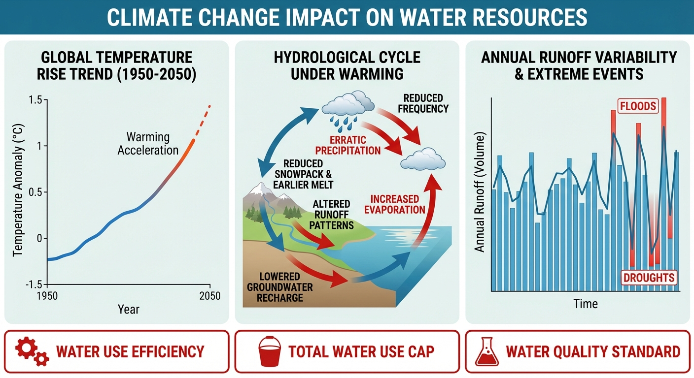
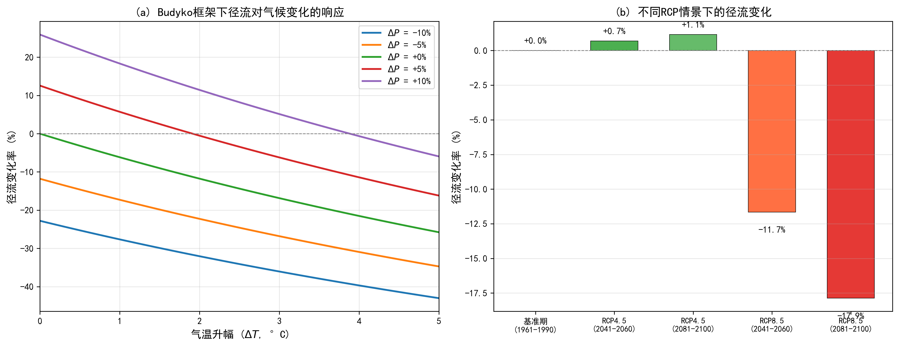

# 第 1 章 全球变暖下的水资源挑战

## 学习目标

- **深化理论认知**：深入探讨水资源承载力的多维概念，并全面理解中国“三条红线”最严格水资源管理制度的理论基础与宏观调控意义。
- **掌握物理机制**：系统掌握水文循环中的水热耦合平衡原理，熟练推导 Budyko 框架及 Fu 方程式，透彻理解其在气候变化影响定量评估中的核心逻辑。
- **强化数学推演**：能够独立推导径流对降水和潜在蒸发的弹性系数模型，并运用该工具剖析不同气候变量对流域产流能力的非线性扰动特征。
- **分析仿真结果**：通过华北典型半湿润流域的仿真案例，系统评估不同代表性浓度路径（RCP）排放情景下径流演变规律，揭示“蒸发主导”机制的物理成因。
- **拓宽工程视野**：深刻剖析农业灌溉、工业发展与生态基流在水资源衰减条件下的竞争态势，为后续供需平衡规划与适应性管理奠定基础。

---

## 1.1 水资源承载力与"三条红线"控制

水资源承载力是指在特定经济技术条件、社会发展阶段和生态环境约束下，一个区域或流域的水资源系统能够持续支撑的最大社会经济系统规模。这一概念突破了传统“以需定供”的无限制开发思维，确立了水资源作为刚性约束的战略地位。在全球变暖与人类活动双重扰动下，水资源承载力的内涵已从单一的水量供需平衡，拓展为水量、水质与水生态多维度的复合约束体系。

为切实守住水资源承载力底线，2012 年国务院发布了《关于实行最严格水资源管理制度的意见》，在国家层面确立了“三条红线”控制指标体系。这一制度将粗放式的水资源总量管理推向了精细化的多维指标管控，其核心内容包括：

1. **用水总量控制红线（水量约束）**：确立了流域和区域取用水量的绝对上限。旨在遏制用水规模的无序扩张，保障基础的生态基流不受侵占。
2. **用水效率控制红线（经济约束）**：通过设定万元国内生产总值用水量、万元工业增加值用水量和农田灌溉水有效利用系数等指标，倒逼产业结构升级和节水技术创新。
3. **水功能区限制纳污红线（水质与生态约束）**：严格控制入河湖排污总量，确保水质达标，维持水体的自净能力和生态服务功能。

承载力的定量评估通常基于系统供需平衡框架。设区域可利用水资源总量为 $W_{\text{avail}}$，各国民经济部门需水之和为 $W_{\text{demand}}$。其中，可利用水量必须扣除维持河流健康所必需的生态基流：

$$
W_{\text{avail}} = W_{\text{surface}} + W_{\text{groundwater}} + W_{\text{unconventional}} - W_{\text{eco\_base}}
$$

区域总需水量则为各部门（农业、工业、生活、城市生态等）需水量之和：

$$
W_{\text{demand}} = \sum_{i} (q_i \times A_i)
$$

式中，$q_i$ 为第 $i$ 部门的用水定额，$A_i$ 为其经济社会活动规模。水资源承载力系数 $\alpha$ 定义为可利用水资源量与总需水量的比值：

$$
\alpha = \frac{W_{\text{avail}}}{W_{\text{demand}}}
$$

当 $\alpha \ge 1.2$ 时，系统处于安全承载状态；当 $1.0 < \alpha < 1.2$ 时，系统处于临界状态；当 $\alpha < 1$ 时，区域陷入水资源超载状态。在全球变暖背景下，流域潜在蒸发加剧导致自然产流量衰减，使得 $W_{\text{surface}}$ 和 $W_{\text{groundwater}}$ 趋于减小；同时，极端高温频发伴随人口与经济增长，推动 $W_{\text{demand}}$ 持续攀升。分子减小与分母增大的双重挤压，使得区域水资源承载压力呈指数级增长。

---

## 1.2 气候变化对径流年际与年内分配的扰动

气候变化不仅导致全球平均气温升高，更从根本上改变了大气圈的水汽循环热力学特征。根据克劳修斯-克拉珀龙（Clausius-Clapeyron）方程，气温每升高 1°C，大气保持水汽的能力约增加 7%，这直接导致降水极端化加剧、时空分配更加不均，并大幅提升了地表的潜在蒸发需求。这种扰动对流域径流的生成过程产生了深远影响。

### 1.2.1 Budyko 水热耦合平衡框架的理论推导

在长期（多年平均）尺度上，评估气候变化对径流影响的经典理论工具是 Budyko（1974）提出的水热耦合平衡框架。该框架立足于流域物质守恒与能量守恒两大基本定律。

**水量平衡方程**：
$$
P = E + R + \Delta S
$$
式中，$P$ 为降水量，$E$ 为实际蒸发散量，$R$ 为径流量，$\Delta S$ 为流域蓄水变量。在多年平均尺度下（通常 $>10$ 年），流域蓄水变化趋于零（$\Delta S \approx 0$），水量平衡简化为 $P = E + R$。这意味着降水是水分供给的上限，即水分限制条件：$E \le P$。

**能量平衡方程**：
$$
R_n = \lambda E + H + G
$$
式中，$R_n$ 为地表净辐射，$\lambda E$ 为潜热通量，$H$ 为感热通量，$G$ 为土壤热通量。多年平均尺度下 $G \approx 0$。流域实际蒸发受限于可用的热能供给，通常用潜在蒸发量 $PET$（或 $E_0$）来表征能量上限，即能量限制条件：$E \le PET$。

Budyko 假设的核心在于：流域多年平均实际蒸发量 $E$ 是降水量 $P$ 和潜在蒸发量 $PET$ 的综合函数，即 $E = f(P, PET)$。引入干燥指数 $\phi = PET / P$，通过量纲分析可将其转化为单变量函数 $E/P = F(\phi)$。该函数必须满足两个极限边界条件：
1. **湿润极限**：当 $\phi \to 0$（极端湿润区，能量受限）时，$E \to PET$，即 $F(\phi) \to \phi$。
2. **干旱极限**：当 $\phi \to \infty$（极端干旱区，水分受限）时，$E \to P$，即 $F(\phi) \to 1$。

### 1.2.2 Fu 方程式的解析与参数物理意义

为了给出满足上述边界条件的具体函数表达式，Fu（1981）基于偏微分方程推导了具有严密数学物理基础的解析解。假定随着降水或潜在蒸发的增加，蒸发的边际增量依赖于剩余的蒸发潜力：
$$
\frac{\partial E}{\partial P} = f_1\left(1 - \frac{E}{PET}\right), \quad \frac{\partial E}{\partial PET} = f_2\left(1 - \frac{E}{P}\right)
$$
通过积分求解上述偏微分方程组，Fu 得到了具有单参数 $w$ 的解析形式：

$$
\frac{E}{P} = 1 + \frac{PET}{P} - \left[1 + \left(\frac{PET}{P}\right)^w\right]^{1/w}
$$

式中，$w$ 为综合反映流域下垫面特征的无量纲参数。**参数 $w$ 的物理意义非常明确**：它代表了流域在同等水热条件下将降水转化为实际蒸发的能力。$w$ 值通常在 1.5 到 3.0 之间变动。较高的 $w$ 值（如 2.5—3.0）通常对应于植被覆盖良好、土壤入渗能力强、地形平缓的流域，这些特征增加了水分在地表的滞留时间，有利于蒸发散；较低的 $w$ 值（如 1.5—2.0）则对应于植被稀疏、地形陡峭或城市化程度高的流域，地表径流迅速汇集流失，实际蒸发相对较小。

### 1.2.3 径流气候弹性系数的严密推导

为定量评估降水和潜在蒸发微小变化对径流的扰动程度，水文学界引入了径流弹性系数概念。降水弹性系数 $\varepsilon_P$ 和潜在蒸发弹性系数 $\varepsilon_{PET}$ 分别定义为：
$$
\varepsilon_P = \frac{\partial R / R}{\partial P / P} = \frac{\partial R}{\partial P} \cdot \frac{P}{R}, \quad \varepsilon_{PET} = \frac{\partial R / R}{\partial PET / PET} = \frac{\partial R}{\partial PET} \cdot \frac{PET}{R}
$$

基于 $R = P - E$ 及 Fu 方程式，令干燥指数 $\phi = PET/P$，并将 Fu 公式重写为 $R$ 的表达式：
$$
R = P \left[ \left(1 + \phi^w\right)^{1/w} - \phi \right]
$$
设 $H(\phi) = (1 + \phi^w)^{1/w} - \phi$，则 $R = P \cdot H(\phi)$。
计算径流对降水 $P$ 的偏导数。需应用链式法则，因为 $\phi$ 是 $P$ 的函数（$\frac{\partial \phi}{\partial P} = -\frac{\phi}{P}$）：
$$
\frac{\partial R}{\partial P} = H(\phi) + P \cdot H'(\phi) \cdot \left(-\frac{\phi}{P}\right) = H(\phi) - \phi H'(\phi)
$$
计算径流对潜在蒸发 $PET$ 的偏导数（$\frac{\partial \phi}{\partial PET} = \frac{1}{P}$）：
$$
\frac{\partial R}{\partial PET} = P \cdot H'(\phi) \cdot \frac{1}{P} = H'(\phi)
$$
对 $H(\phi)$ 求导得：
$$
H'(\phi) = \frac{1}{w}(1 + \phi^w)^{\frac{1}{w}-1} \cdot w\phi^{w-1} - 1 = \phi^{w-1}(1 + \phi^w)^{\frac{1-w}{w}} - 1
$$
将偏导数代入弹性系数定义式，得到精确解析解：
$$
\varepsilon_P = \frac{P}{P \cdot H(\phi)} \left[ H(\phi) - \phi H'(\phi) \right] = 1 - \frac{\phi H'(\phi)}{H(\phi)}
$$
$$
\varepsilon_{PET} = \frac{PET}{P \cdot H(\phi)} H'(\phi) = \frac{\phi P}{P \cdot H(\phi)} H'(\phi) = \frac{\phi H'(\phi)}{H(\phi)}
$$
从上述理论推导可以清晰地证明一个守恒律：**$\varepsilon_P + \varepsilon_{PET} \equiv 1$**。这意味着如果在特定气候情景下，降水和潜在蒸发同时增加 1%，径流量也将随之增加 1%。这一组解析公式为后续定量预估气候变化响应提供了强大的数学武器。

---

## 1.3 模拟案例：Budyko 框架下的气候变化径流响应

### 1.3.1 案例背景与参数选择依据

本案例选取我国华北典型半湿润偏半干旱流域（如海河流域部分子流域）为研究对象。该地区是我国水资源供需矛盾最为尖锐的区域。基准期（1961—1990）水文气象特征参数设定为：年降水 $P = 550$ mm，潜在蒸发 $PET = 950$ mm。干燥指数 $\phi = 950 / 550 \approx 1.73$，表明该流域整体处于水分受限状态。

下垫面参数选取 $w = 2.6$。**参数选择依据**：华北地区长期开展大规模水土保持工程（如梯田、淤地坝建设），且农业灌溉面积广阔、作物生长季耗水量大。高强度的地表干预延长了降水在地表的滞留时间，显著提升了流域将水分转化为蒸发散的能力，因此 $w$ 值处于理论区间的中高段（2.6 属于典型的农业-自然混合型流域经验值）。

案例将评估第五次/第六次国际耦合模式比较计划（CMIP5/6）中两种典型的代表性浓度路径：RCP4.5（温和减排情景，辐射强迫稳定在 $4.5 \text{ W/m}^2$）和 RCP8.5（高排放/基准情景，辐射强迫达 $8.5 \text{ W/m}^2$），分别对比 21 世纪中期（2041—2060）和末期（2081—2100）的径流演变趋势。

**仿真脚本及技术实现**：通过运行 `assets/ch01/ch01_climate_runoff.py` 脚本，将 GCM 降尺度气候预估数据代入 Fu 方程式，实现径流响应的定量计算。

### 1.3.2 模拟结果展示

| 情景 | 气温升幅(°C) | 降水(mm) | 潜在蒸发(mm) | 径流(mm) | 径流变化率(%) |
|------|-------------|----------|-------------|----------|-------------|
| 基准期 (1961-1990) | +0.0 | 550 | 950 | 82.4 | +0.0 |
| RCP4.5 (2041-2060) | +1.8 | 578 | 1027 | 83.0 | +0.7 |
| RCP4.5 (2081-2100) | +2.5 | 588 | 1057 | 83.4 | +1.1 |
| RCP8.5 (2041-2060) | +2.8 | 561 | 1070 | 72.8 | -11.7 |
| RCP8.5 (2081-2100) | +4.5 | 566 | 1142 | 67.7 | -17.9 |

### 1.3.3 结果物理机制解析

模拟结果深刻揭示了华北半湿润地区对气候变化呈现出的“蒸发主导”响应机制。

首先计算基准期的径流系数 $\alpha_R = 82.4 / 550 \approx 0.150$，即 85% 的降水被蒸散发消耗。利用 1.2 节推导的弹性系数公式，代入 $\phi = 1.73, w=2.6$，可求得基准期的理论弹性系数：$\varepsilon_P \approx 2.46$，$\varepsilon_{PET} \approx -1.46$。这具有高度的指示意义：**降水每减少 1%，径流将非线性剧减 2.46%；而潜在蒸发每增加 1%，径流将减少 1.46%。**

在 RCP4.5 情景下，降水实现了约 5%—7% 的增长，而潜在蒸发增加了约 8%—11%。降水增加带来的产流效益，刚好被气温升高导致的蒸发损耗所抵消（$2.46 \times 7\% \approx 17.2\%$，$-1.46 \times 11\% \approx -16.1\%$），最终径流表现为微弱正增长（0.7%—1.1%）。

然而，在 RCP8.5 高排放情景末期（2081—2100），气温飙升 4.5°C，驱动 $PET$ 大幅增加 20.2%（至 1142 mm）；与此同时，降水仅微增 2.9%（至 566 mm）。如果运用弹性系数进行一阶线性预估，径流变化率约为：$\Delta R/R \approx 2.46 \times 2.9\% - 1.46 \times 20.2\% = 7.1\% - 29.5\% = -22.4\%$。虽然 Budyko 曲线的非线性特征（高阶导数效应）使得实际模拟降幅（-17.9%）略小于线性预估，但这种剧烈衰减仍是灾难性的。

这种现象的物理根源在于：在水分受限的干旱半干旱区，新增的降水难以转化为有效的地表汇流，绝大部分被极度饥渴的干燥大气（剧增的潜在蒸发）作为潜热消耗掉了；不仅如此，剧烈的蒸发拉力还会进一步“掠夺”本应转化为基流的深层土壤水分，导致径流量出现断崖式下跌。

---

## 1.4 气候变化背景下的水资源适应性规划与工程启示

上述模拟结果打破了传统水利工程设计中“水文一致性（Stationarity）”的根本假设。针对未来可能面临的严峻衰减，水资源规划管理必须实现范式转换：

1. **从确定性规划转向鲁棒性适应（Robust Decision Making）**：水资源规划必须摒弃依赖单一历史数据的预测模式，转而采用多情景集成分析。工程设计需充分考量 RCP8.5 这种“低概率-高影响”的最不利情景，预留足够的安全冗余。
2. **重估水利枢纽调控能力**：径流衰减不仅削弱了水库的年际调节库容利用率，更会大幅降低设计的供水保证率。规划中必须重新核算大型水利工程的死水位与正常蓄水位，并在流域层面推进多源联合调度。
3. **突破自然水文循环的绝对依赖**：当气候变化导致流域内在 $\alpha$ 系数跌破安全红线时，节水措施（农业滴灌、工业中水回用）虽能缓解需求端压力，但无法逆转水资源总量的物理萎缩。必须大力推进非常规水源开发（如沿海海水淡化、大规模再生水利用）以及跨流域调水工程，从外部打破 Budyko 水热平衡框架的物理桎梏。
4. **刚性约束与弹性配置结合**：在宏观层面坚守“三条红线”刚性约束的同时，微观层面需引入水权交易市场机制（将在第 4 章详述），确保在水资源“蛋糕”缩小的背景下，水资源能够向高附加值产业和关键生态节点高效流转。

---

## 本章小结

本章系统剖析了全球变暖对区域水资源安全带来的系统性威胁。我们从水资源承载力的核心概念出发，阐明了“三条红线”管理制度在约束水资源无序开发中的基石作用。在此基础上，深入推导了水文循环核心理论——Budyko 水热耦合平衡框架及 Fu 方程式，并利用严格的数学偏导数构建了径流弹性系数模型。通过华北平原典型流域的数值模拟实证发现，半干旱/半湿润地区对气候变化呈现强烈的“蒸发主导”特征：在 RCP8.5 情景下，气温急剧攀升导致的潜在蒸发暴涨，将完全吞噬降水微增带来的红利，引发径流高达 17.9% 的严重衰减。这一科学结论向我们敲响了警钟：传统基于历史平稳序列的水资源配置方案已面临严峻挑战。如何在自然可用水资源确定性减少的客观趋势下，通过供需两侧的深度双向重构来维持系统健康？这正是下一章《第 2 章 供需平衡分析》将要深入探讨的核心命题。

---

## 思考与练习

1. **理论辨析**：简述水资源承载力的多维内涵。在实际流域管理中，“三条红线”控制制度是如何分别对水量、水质与水生态三个维度的承载力进行约束的？
2. **公式推演**：试利用水量平衡和能量平衡的基本物理边界条件，证明 Budyko 假设中蒸发比 $E/P$ 在干燥指数趋于极端干旱（$\phi \to \infty$）和极端湿润（$\phi \to 0$）两种状态下的理论渐近线。
3. **弹性计算**：某内陆干旱流域多年平均降水量 $P = 300$ mm，潜在蒸发量 $PET = 1500$ mm，下垫面参数 $w=1.8$。请完整计算该流域的径流对降水和潜在蒸发的弹性系数 $\varepsilon_P$ 和 $\varepsilon_{PET}$。若未来 30 年内降水减少 10%、潜在蒸发增加 8%，请利用弹性系数一阶近似评估其径流变化率。
4. **物理释义**：参数 $w$ 在 Fu 方程式中代表了什么物理意义？大规模毁林开荒与大规模实施退耕还林工程，分别会导致参数 $w$ 及流域实际蒸发量发生怎样的方向性变化？请结合 Budyko 曲线特征进行分析。
5. **系统思考**：结合本章 1.3 节的结论分析，如果气候变化导致某流域的可用水资源总量（$W_{\text{avail}}$）呈不可逆的下降趋势，在跨部门的水资源规划中，应如何权衡农业粮食安全、工业经济增长与河湖生态基流之间的矛盾？（为下一章供需平衡方案求解做铺垫）

---

## 附录：仿真脚本解读

**脚本路径**：`assets/ch01/ch01_climate_runoff.py`

该脚本采用"参数定义—物理计算—情景推演—敏感性分析—结果可视化—表格输出"的线性流程。开头导入 NumPy 与 Matplotlib 库，并将绘图后端设为非交互模式（`Agg`），保证脚本可在无图形界面的服务器环境直接生成图片。随后统一设置中文字体（SimHei / Microsoft YaHei）和负号显示，避免图中文字乱码。

核心函数 `budyko_fu(P, PET, w)` 实现了 Fu 型 Budyko 公式。先计算干燥指数 $\phi = PET/P$，再按 $E = P(1 + \phi - (1 + \phi^w)^{1/w})$ 求得实际蒸发，径流由水量平衡 $R = P - E$ 得到。函数一次返回蒸发、径流与干燥指数三个变量，便于后续同时分析蒸发响应与气候干湿状态。脚本将 $w = 2.6$ 固定为区域代表值，使不同情景对比聚焦于气候驱动而非下垫面变化。

气候情景通过字典结构定义，每个情景包含气温增量 `dT` 和降水百分比变化 `dP_pct` 两个参数。降水按百分比直接缩放基准值；潜在蒸发按经验关系 $PET_{\text{new}} = PET_{\text{base}}(1 + 0.045 \cdot \Delta T)$ 计算，将复杂的气候变化压缩为可解释的两参数驱动。

敏感性分析采用双变量扫描：气温升幅在 0--5°C 连续取 50 个等距点，降水变化率取 $-10\%$、$-5\%$、$0\%$、$+5\%$、$+10\%$ 共 5 组。对每组降水变化率，脚本在整条气温区间上调用 Budyko 函数，生成径流相对变化率曲线，实现"升温主效应 + 降水调节效应"的联合展示。

绘图采用 $1 \times 2$ 子图布局：左图为多折线敏感性曲线（横轴气温升幅，纵轴径流变化率，不同颜色对应不同降水变化率），右图为各 RCP 情景柱状图（柱顶标注具体百分比），实现"趋势识别靠曲线、情景对比靠柱状、数值核对靠表格"的完整表达闭环。最终以 300 dpi 分辨率保存为 `climate_runoff_response.png`。

---

**拓展视野**：水资源系统分析经历了从静态水量平衡到动态运行控制的三阶段演进。第一阶段（1950s—1980s）关注"建什么"，以水量平衡和线性规划为核心工具；第二阶段（1990s—2010s）关注"配多少"，以多目标优化和综合水资源管理（IWRM）为主流范式；第三阶段（2020s—）关注"怎么调"，以水系统控制论为理论基础，实现水网的实时动态控制与自主运行。本章所讨论的气候变化影响评估正处于第二阶段向第三阶段过渡的关键节点——未来的水资源规划不仅需要回答"气候变化会带来多少水量变化"，更需要回答"如何在不确定性中实时调控水网以保障安全供水"。关于这一学科演进的系统论述，可参阅 Lei (2025d) 的相关研究。

## 参考文献

[1] Budyko M I. Climate and Life. Academic Press, 1974.

[2] Fu B P. On the calculation of the evaporation from land surface (in Chinese). Scientia Atmospherica Sinica, 1981, 5(1): 23-31.

[3] Yang H, Yang D, Lei Z, et al. New analytical derivation of the mean annual water-energy balance equation. Water Resources Research, 2008, 44(3): W03410.
